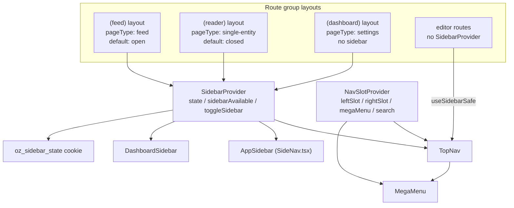

The navigation shell is built from two independent context layers: `SidebarProvider` (from shadcn, extended in [`src/components/ui/sidebar.tsx`](https://github.com/ozeaon/ozeaon-v2/blob/0a4f1a95824db87782f1221a4108019d174df3d9/src/components/ui/sidebar.tsx)) owns sidebar open/close state and persistence, while `NavSlotProvider` (in [`src/components/nav/NavSlotContext.tsx`](https://github.com/ozeaon/ozeaon-v2/blob/0a4f1a95824db87782f1221a4108019d174df3d9/src/components/nav/NavSlotContext.tsx)) owns the top nav's slot content, variant, mega-menu state, and mobile search mode. For per-component detail see [../../components/nav/](../../components/nav/). The original layout spec lives in [DESIGN-CONSISTENCY-PLAN.md](https://github.com/ozeaon/ozeaon-v2/blob/0a4f1a95824db87782f1221a4108019d174df3d9/DESIGN-CONSISTENCY-PLAN.md) and describes the intended end state; the sections below reflect what is in the code at the pinned commit.

## Overview

`SidebarProvider` is mounted per route group with a `pageType` prop (`"feed" | "single-entity" | "settings"`). It derives `sidebarAvailable` (`true` unless `pageType === "settings"`) and exposes `state` (`"expanded" | "collapsed"`), `open`, `toggleSidebar`, and mobile variants. A Cmd/Ctrl+B keyboard shortcut calls `toggleSidebar`. Routes that deliberately have no sidebar — editors — omit `SidebarProvider` entirely; consuming components call `useSidebarSafe`, which returns a safe default with `sidebarAvailable: false` and `open: false` rather than throwing.

Sidebar open/closed state is persisted in the `oz_sidebar_state` cookie (not `localStorage`) so the server can render the correct layout in the initial HTML and avoid layout shift on first paint. The cookie encodes per-page-type state as `feed:open,single-entity:closed`. Settings is not persisted: the dashboard layout pins the sidebar closed.

## Architecture

`(main)/layout.tsx` mounts both `NavSlotProvider` and `NavHistoryTracker`. Individual route-group layouts then add `SidebarProvider` with the appropriate `pageType`, and render either `AppSidebar` or `DashboardSidebar`.

## Sidebar State

`SidebarProvider` reads the `oz_sidebar_state` cookie on mount and on route changes. On first visit to a page type the cookie is absent for that type, so the default fires (`feed` → open; `single-entity` → closed). After the user toggles, the new value is written back to the cookie with a one-year max-age.

`useSidebarSafe` returns `{ pageType: "settings", sidebarAvailable: false, state: "collapsed", open: false, … }` when no `SidebarProvider` is present. It is safe to call anywhere — editors use it to detect the shell-less context without a try/catch.

`SidebarShell` ([`src/components/ui/layout/shells/SidebarShell.tsx`](https://github.com/ozeaon/ozeaon-v2/blob/0a4f1a95824db87782f1221a4108019d174df3d9/src/components/ui/layout/shells/SidebarShell.tsx)) is a presentational wrapper — `hidden md:flex w-58 sticky …` — that takes only `children`. The tablet icon-only sidebar (40 px icon mode) described in the design spec is not built; the sidebar is either visible at full width on md+ or hidden on mobile.

## AppSidebar

`AppSidebar` ([`src/components/nav/SideNav.tsx`](https://github.com/ozeaon/ozeaon-v2/blob/0a4f1a95824db87782f1221a4108019d174df3d9/src/components/nav/SideNav.tsx)) renders when `useSidebar().open` is true. It returns `null` immediately when the sidebar is closed, so it leaves no DOM footprint in the collapsed state.

Contents:

- **Create dropdown** — reads `sitemap.addItems` from [`src/config/sitemap.tsx`](https://github.com/ozeaon/ozeaon-v2/blob/0a4f1a95824db87782f1221a4108019d174df3d9/src/config/sitemap.tsx): Article `/articles/new`, Project `/projects/new`, Organisation `/organizations/new`.
- **Platform section** — Community `/posts`, Articles `/articles`, Projects `/projects` (collapsible).
- **Footer nav** — Network `/network`, Organisations `/organizations`.
- **My Library** — Resources, Notes, Bookmarks; all disabled with a "Soon" badge. Notes & Bookmarks is on the roadmap.

## DashboardSidebar

`DashboardSidebar` ([`src/components/nav/DashboardSidebar.tsx`](https://github.com/ozeaon/ozeaon-v2/blob/0a4f1a95824db87782f1221a4108019d174df3d9/src/components/nav/DashboardSidebar.tsx)) renders on settings routes inside `SidebarShell`. It has its own `CREATE_LINKS` constant (Article, Project, Organisation) and shows account-type-specific settings links. The organization variant has a `DropdownMenuContent` for the Create button that is hardcoded via `CREATE_LINKS` — the `useCreateAction` abstraction described in the spec is not implemented.

## NavSlotContext

`NavSlotProvider` ([`src/components/nav/NavSlotContext.tsx`](https://github.com/ozeaon/ozeaon-v2/blob/0a4f1a95824db87782f1221a4108019d174df3d9/src/components/nav/NavSlotContext.tsx)) manages top-nav slot content independently of the sidebar. Its context includes:

- `leftSlot` / `rightSlot` — arbitrary `ReactNode` injected by route-specific nav slots (see `src/components/nav/slots/`).
- `variant: "default" | "org"` — switches the nav's visual treatment.
- `megaMenuOpen` / `toggleMegaMenu` / `closeMegaMenu` — mega-menu state.
- `searchOpen` / `openSearch` / `closeSearch` — mobile search bar state; opening search closes the mega menu and vice versa.
- `sectionEntityName` — the entity name shown in the top nav on profile and org routes.

`EntityTitleSlot` reads `sectionEntityName` and renders it in the top nav; it is mounted in the `(profile)` org and user layouts.

## Mobile

On mobile, `AppSidebar` and `SidebarShell` both use `hidden md:flex` — no sidebar column renders at all. `MobileFloatingCreate` ([`src/components/nav/components/MobileFloatingCreate.tsx`](https://github.com/ozeaon/ozeaon-v2/blob/0a4f1a95824db87782f1221a4108019d174df3d9/src/components/nav/components/MobileFloatingCreate.tsx)) is a floating action button that appears on the relevant feed routes. `MegaMenu` covers the screen for navigation on mobile.

## Failure Modes & Edge Cases

Using `useSidebar` outside a `SidebarProvider` throws; use `useSidebarSafe` on routes that may render without a provider (editors, error boundaries). The `oz_sidebar_state` cookie is not `httpOnly`, so the client component can write it directly without an API round-trip; any garbled segment is silently dropped by `parseSidebarState`. On settings routes `sidebarAvailable` is `false`, which the `TopNav` uses to hide the toggle button — the toggle should gate on `sidebarAvailable`, not just `sidebarOpen`, to avoid rendering a button that toggles nothing.

## Extension Points

New sidebar entries go into `sitemap.tsx` (`leftNav`, `footerNav`, or `addItems`). New top-nav slot content uses the `useNavSlot` hook to set `leftSlot`/`rightSlot` from a route layout. New route groups that need a sidebar mount `SidebarProvider` with the appropriate `pageType`; those that should be shell-less omit it. The `NavVariant` union (`"default" | "org"`) is the extension point for further top-nav visual treatments.

## Related Links

- [../../components/nav/](../../components/nav/) — per-component detail for all nav components
- [../../design-system/design-tokens/](../../design-system/design-tokens/) — design tokens consumed by the shell
- [../../architecture/app-structure/](../../architecture/app-structure/) — route groups and layout hierarchy
- [sidebar.tsx](https://github.com/ozeaon/ozeaon-v2/blob/0a4f1a95824db87782f1221a4108019d174df3d9/src/components/ui/sidebar.tsx)
- [sidebar-state.ts](https://github.com/ozeaon/ozeaon-v2/blob/0a4f1a95824db87782f1221a4108019d174df3d9/src/utils/data/sidebar-state.ts)
- [sitemap.tsx](https://github.com/ozeaon/ozeaon-v2/blob/0a4f1a95824db87782f1221a4108019d174df3d9/src/config/sitemap.tsx)
