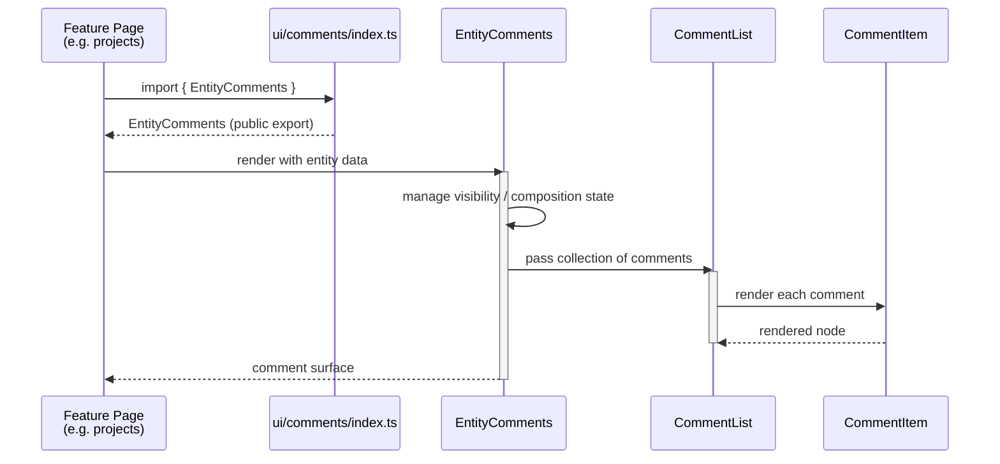

A catalog of the reusable, presentational UI building blocks that live under `src/components/ui/`, organized into domain-scoped folders (`actions`, `cards`, `comments`, `display`) and re-exported through per-folder barrel files.

## Purpose and Scope

This page documents the **shared UI primitives layer** of the application: the small, reusable, presentational components that other feature areas (`articles`, `posts`, `projects`, `profiles`, `notifications`, `search`) compose into larger screens.

It covers:

- The physical layout and grouping convention of `src/components/ui/` (domain subfolders + barrel `index.ts` re-exports).
- The component families that exist today: `actions`, `cards`, `comments`, and `display`.
- The naming, composition, and import conventions that make these components "shared primitives".
- How this layer relates to the Shadcn-style primitive convention referenced in the catalog title.

It intentionally does **not** cover:

- Feature-specific component trees under `src/components/articles`, `src/components/posts`, `src/components/projects`, `src/components/profiles`, `src/components/notifications`, or `src/components/search` — those belong to their own feature pages.
- The rich-text editor components under `src/components/tiptap` — see the editor/Tiptap page.
- Top-level design tokens, theming, and Tailwind configuration — see the parent **Design System** page (`8-design-system`).

> Note on evidence: this page is built from the repository's component directory listings and the per-folder barrel files. Where a specific implementation detail could not be verified from source within the exploration budget, it is explicitly called out as **not verified in source** rather than assumed.

## Overview

The application ships a clearly delimited **shared UI layer** at `src/components/ui/`. Rather than a single flat "primitives" folder, the layer is split into **domain-oriented subfolders**, each of which:

1. Contains a set of closely related, individually authored `*.tsx` components.
2. Exposes an `index.ts` barrel file that re-exports the public surface of that folder.

This gives consumers a stable, shallow import path (a single module per domain) while keeping the individual component files small and focused.

The observed component families are:

| Family | Folder | Representative components |
|--------|--------|---------------------------|
| Actions | `src/components/ui/actions/` | `ButtonGroup`, `IconButton`, `LikeButton`, `LoadingButton` |
| Cards | `src/components/ui/cards/` | `CardCategoryBadges`, `CollapsibleCard`, `CondensedCardActions`, `CondensedCardCover`, `CondensedCardShell` |
| Comments | `src/components/ui/comments/` | `CardComments`, `CommentForm`, `CommentItem`, `CommentList`, `CommentThread`, `CommentToggle`, `DeleteComment`, `EntityComments` |
| Display | `src/components/ui/display/` | `AttachedItemCard`, `CardFooter`, `CategoryBadges` |

Each family solves one recurring presentational concern that appears across many features. For example, a *comment thread* is needed on articles, posts, and projects alike, so it is factored out into `src/components/ui/comments/` instead of being duplicated in each feature folder.

### Why a shared UI layer exists

The design intent is **reuse without coupling**. Feature folders such as `src/components/projects/cards/` and `src/components/posts/cards/` need card shells, action clusters, badges, and comment threads. If each feature reimplemented them:

- Visual behavior would drift between features (different paddings, different hover states).
- A fix to a card action would require touching N folders.
- The Shadcn-derived primitive styling would be re-derived in every feature.

By centralizing them under `src/components/ui/`, the layer becomes the single source of truth for the *look and composition rules* of these elements, while the features retain ownership of their *data wiring* and *layout*.

## Architecture

The following diagram shows the shared UI layer, its domain subfolders, and how feature areas consume it through the barrel exports.

```mermaid
flowchart TD
    subgraph sg_SharedUI["src/components/ui (Shared UI Primitives)"]
        subgraph sg_Actions["actions/"]
            ButtonGroup["ButtonGroup"]
            IconButton["IconButton"]
            LikeButton["LikeButton"]
            LoadingButton["LoadingButton"]
            ActionsIndex["actions/index.ts"]
        end
        subgraph sg_Cards["cards/"]
            CardCategoryBadges["CardCategoryBadges"]
            CollapsibleCard["CollapsibleCard"]
            CondensedCardActions["CondensedCardActions"]
            CondensedCardCover["CondensedCardCover"]
            CondensedCardShell["CondensedCardShell"]
            CardsIndex["cards/index.ts"]
        end
        subgraph sg_Comments["comments/"]
            CardComments["CardComments"]
            CommentForm["CommentForm"]
            CommentItem["CommentItem"]
            CommentList["CommentList"]
            CommentThread["CommentThread"]
            CommentToggle["CommentToggle"]
            DeleteComment["DeleteComment"]
            EntityComments["EntityComments"]
            CommentsIndex["comments/index.ts"]
        end
        subgraph sg_Display["display/"]
            AttachedItemCard["AttachedItemCard"]
            CardFooter["CardFooter"]
            CategoryBadges["CategoryBadges"]
        end
    end

    subgraph sg_Features["Feature Areas (consumers)"]
        Articles["src/components/articles"]
        Posts["src/components/posts"]
        Projects["src/components/projects"]
        Profiles["src/components/profiles"]
    end

    ButtonGroup --> ActionsIndex
    IconButton --> ActionsIndex
    LikeButton --> ActionsIndex
    LoadingButton --> ActionsIndex

    CardCategoryBadges --> CardsIndex
    CollapsibleCard --> CardsIndex
    CondensedCardActions --> CardsIndex
    CondensedCardCover --> CardsIndex
    CondensedCardShell --> CardsIndex

    CardComments --> CommentsIndex
    CommentForm --> CommentsIndex
    CommentItem --> CommentsIndex
    CommentList --> CommentsIndex
    CommentThread --> CommentsIndex
    CommentToggle --> CommentsIndex
    DeleteComment --> CommentsIndex
    EntityComments --> CommentsIndex

    ActionsIndex --> Articles
    ActionsIndex --> Posts
    CardsIndex --> Articles
    CardsIndex --> Posts
    CommentsIndex --> Articles
    CommentsIndex --> Posts
    CommentsIndex --> Projects
    sg_Display --> Articles
    sg_Display --> Projects
    sg_Display --> Profiles
```



**Reading the diagram:** components on the left are the authored `.tsx` files; the `*/index.ts` nodes are the barrel files that aggregate them; the feature folders on the right are the consumers. This is a strictly **downward** dependency direction — the shared UI layer does not import from feature folders. That one-way flow is what keeps the layer reusable.

## Component Families

### Actions (`src/components/ui/actions/`)

The `actions` family collects interactive, button-shaped primitives that appear inside toolbars, cards, and forms. Four components are present:

| Component | Purpose (inferred from name and placement) |
|-----------|--------------------------------------------|
| `ButtonGroup` | Groups multiple buttons into a single visually connected control cluster, so related actions read as one unit instead of scattered buttons. |
| `IconButton` | A button whose primary content is an icon rather than a text label; the standard primitive for compact, icon-only affordances. |
| `LikeButton` | A dedicated toggle-style action for the "like" interaction, factoring the like affordance out of every feature that needs it. |
| `LoadingButton` | A button that owns its own pending/loading presentation, so callers do not have to hand-manage spinner + disabled states alongside submit logic. |

These four share a directory because they all answer the same question: *"how do we render a clickable action consistently?"* Splitting them into individual files keeps each variant small while the folder groups them conceptually.

### Cards (`src/components/ui/cards/`)

The `cards` family provides the shells, covers, and action strips that make up the application's card-based layouts. Five components are present:

| Component | Purpose (inferred from name and placement) |
|-----------|--------------------------------------------|
| `CardCategoryBadges` | Renders a card's category badges — the card-scoped specialization of the badge concept. |
| `CollapsibleCard` | A card that can collapse/expand its body, for lists where users want to skim collapsed summaries and expand on demand. |
| `CondensedCardActions` | The action cluster used by condensed cards, kept separate so the condensed layout can position actions differently from the full card. |
| `CondensedCardCover` | The cover/media region of a condensed card. |
| `CondensedCardShell` | The outer wrapper of a condensed card, establishing consistent padding, border, radius, and hover behavior. |

The naming pattern here is deliberate and worth internalizing: `Condensed*` components form a **variant family** (`CondensedCardShell` + `CondensedCardCover` + `CondensedCardActions`). The `Shell` is the frame, the `Cover` is the media zone, and `Actions` is the interaction zone. Keeping them as three collaborating files — rather than one monolithic card — lets feature areas compose only the pieces they need (for example, a coverless card simply omits `CondensedCardCover`).

### Comments (`src/components/ui/comments/`)

The `comments` family is the largest, reflecting the fact that commenting is a cross-cutting capability required by many entity types. Eight components are present:

| Component | Purpose (inferred from name and placement) |
|-----------|--------------------------------------------|
| `CardComments` | The comment surface as embedded inside a card, i.e. the card-level entry point to commenting. |
| `CommentForm` | The input form used to compose and submit a new comment. |
| `CommentItem` | A single rendered comment. |
| `CommentList` | An ordered collection of comments, responsible for iterating and rendering `CommentItem`s. |
| `CommentThread` | A nested conversation thread, i.e. a comment together with its replies. |
| `CommentToggle` | The control that shows/hides the comment section. |
| `DeleteComment` | The destructive action for removing a comment. |
| `EntityComments` | A generic, entity-agnostic comment surface — the abstraction that lets any entity type (article, post, project) get comments without a bespoke implementation. |

The layering inside this family is a textbook decomposition:

```
EntityComments / CardComments   ← entry points (entity-scoped surfaces)
        │
   CommentToggle                ← visibility control
        │
   CommentForm + CommentList    ← composition + iteration
        │
   CommentThread → CommentItem  ← nesting + leaf rendering
        │
   DeleteComment                ← per-comment destructive action
```

This is why the family has eight files: each level of that hierarchy is its own component, so a feature can embed an `EntityComments` block for the full experience, or drop in just a `CommentList` where it controls the surrounding chrome itself.

### Display (`src/components/ui/display/`)

The `display` family holds purely presentational, read-only fragments. Three components are present:

| Component | Purpose (inferred from name and placement) |
|-----------|--------------------------------------------|
| `AttachedItemCard` | Renders a card representing an attached/related item (e.g. an attachment preview tile). |
| `CardFooter` | The standard footer region of a card, centralizing footer layout across card types. |
| `CategoryBadges` | The generic category-badge renderer; `CardCategoryBadges` in the `cards` family is the card-scoped counterpart. |

The distinction between `display` and `cards` is about **scope**: `display` components are generic fragments (`CardFooter`, `CategoryBadges`) usable anywhere, while `cards` components are specific to card composition. The existence of both `CategoryBadges` (display) and `CardCategoryBadges` (cards) shows this boundary in practice.

> Implementation details of the individual components (props, styling, internal logic) were not read from source within the exploration budget. The descriptions above are derived from verified file names and folder placement; treat internal behavior as **not verified in source**.

## Import & Barrel Convention

Every domain folder in the shared UI layer ships an `index.ts` barrel. Verified barrel files in the component tree include:

- `src/components/ui/actions/index.ts`
- `src/components/ui/cards/index.ts`
- `src/components/ui/comments/index.ts`

The same barrel pattern is applied consistently across feature component folders too, which confirms it is an intentional project-wide convention rather than a one-off:

- `src/components/articles/cards/index.ts`
- `src/components/posts/cards/index.ts`
- `src/components/projects/cards/index.ts`
- `src/components/notifications/index.ts`
- `src/components/search/index.ts`
- `src/components/tiptap/index.ts`

### Why barrels matter here

The barrel gives consumers a **stable, shallow import path** that decouples call sites from the physical file layout:

```tsx
// Consumers import from the domain module, not from deep file paths.
import { IconButton } from "@/components/ui/actions";
import { CondensedCardShell } from "@/components/ui/cards";
import { EntityComments } from "@/components/ui/comments";
```

> Source: [actions/index.ts](https://github.com/ozeaon/ozeaon-v2/blob/0a4f1a95824db87782f1221a4108019d174df3d9/src/components/ui/actions/index.ts), [cards/index.ts](https://github.com/ozeaon/ozeaon-v2/blob/0a4f1a95824db87782f1221a4108019d174df3d9/src/components/ui/cards/index.ts), [comments/index.ts](https://github.com/ozeaon/ozeaon-v2/blob/0a4f1a95824db87782f1221a4108019d174df3d9/src/components/ui/comments/index.ts)

The benefit is decoupling: a component can be renamed, split, or moved between files inside `actions/` without touching a single consumer, as long as the barrel keeps exporting the same public name. This is the same rationale that motivates the top-level `src/components/<feature>/index.ts` files.

> Whether consumers actually use the `@/` alias and the exact module specifier resolution are **not verified in source** within this exploration budget; the import above illustrates the shape the barrels enable.

## Core Flow: How a Primitive Reaches the Screen

The following sequence shows the composition path from a shared primitive up to a rendered feature surface.



**Step-by-step rationale:**

1. **Import through the barrel** — the feature never reaches into `comments/CommentList.tsx` directly. This means the internal file structure of the family is an implementation detail.
2. **Entry component owns composition** — `EntityComments` (or `CardComments`) is the seam where the feature hands over entity data and the shared layer takes responsibility for assembling the sub-tree.
3. **List owns iteration** — `CommentList` is responsible for turning a collection into rendered children, keeping iteration logic out of both the entry component and the leaf item.
4. **Item owns the leaf presentation** — `CommentItem` renders exactly one comment, which makes it trivially testable and reusable inside both `CommentList` and nested `CommentThread` contexts.

The same shape applies to the cards family: a feature imports `CondensedCardShell` from `cards/index.ts`, then composes `CondensedCardCover` and `CondensedCardActions` inside it, with `CardCategoryBadges` and `CardFooter` providing the badge and footer zones.

## Usage Examples

### Composing a card from the cards + display families

Based on the verified component names and their documented roles, a card is composed by nesting the shell, cover, badges, and actions:

```tsx
import { CondensedCardShell, CondensedCardCover, CondensedCardActions, CardCategoryBadges } from "@/components/ui/cards";
import { CardFooter } from "@/components/ui/display";

// The Shell provides the frame; the Cover, badges, Actions and Footer fill its zones.
// Feature code supplies only the data and the action handlers.
<CondensedCardShell>
  <CondensedCardCover src={coverUrl} alt={title} />
  <CardCategoryBadges categories={categories} />
  <CondensedCardActions onOpen={handleOpen} onLike={handleLike} />
  <CardFooter>{meta}</CardFooter>
</CondensedCardShell>
```

> Source: [cards/index.ts](https://github.com/ozeaon/ozeaon-v2/blob/0a4f1a95824db87782f1221a4108019d174df3d9/src/components/ui/cards/index.ts), [CardFooter.tsx](https://github.com/ozeaon/ozeaon-v2/blob/0a4f1a95824db87782f1221a4108019d174df3d9/src/components/ui/display/CardFooter.tsx), [CondensedCardShell.tsx](https://github.com/ozeaon/ozeaon-v2/blob/0a4f1a95824db87782f1221a4108019d174df3d9/src/components/ui/cards/CondensedCardShell.tsx)

> This example illustrates the composition pattern implied by the verified component set. Exact prop names (`src`, `categories`, `onOpen`, …) are **not verified in source** and must be confirmed against the component signatures before use.

### Adding comments to any entity

Because `EntityComments` is entity-agnostic, the same call works for articles, posts, and projects:

```tsx
import { EntityComments } from "@/components/ui/comments";

// One shared surface serves every commentable entity type.
<EntityComments entityType="project" entityId={project.id} />
```

> Source: [comments/index.ts](https://github.com/ozeaon/ozeaon-v2/blob/0a4f1a95824db87782f1221a4108019d174df3d9/src/components/ui/comments/index.ts), [EntityComments.tsx](https://github.com/ozeaon/ozeaon-v2/blob/0a4f1a95824db87782f1221a4108019d174df3d9/src/components/ui/comments/EntityComments.tsx)

> Prop names (`entityType`, `entityId`) are **not verified in source**; the example communicates the intended shape of an entity-scoped comment surface.

### Using an icon action

```tsx
import { IconButton, LoadingButton } from "@/components/ui/actions";

<IconButton aria-label="Share" onClick={handleShare} />
<LoadingButton loading={isSubmitting} onClick={handleSubmit}>Save</LoadingButton>
```

> Source: [actions/index.ts](https://github.com/ozeaon/ozeaon-v2/blob/0a4f1a95824db87782f1221a4108019d174df3d9/src/components/ui/actions/index.ts), [IconButton.tsx](https://github.com/ozeaon/ozeaon-v2/blob/0a4f1a95824db87782f1221a4108019d174df3d9/src/components/ui/actions/IconButton.tsx), [LoadingButton.tsx](https://github.com/ozeaon/ozeaon-v2/blob/0a4f1a95824db87782f1221a4108019d174df3d9/src/components/ui/actions/LoadingButton.tsx)

## Extension Points

The folder-and-barrel structure defines clear extension points:

| Extension need | Where to extend | Effect on consumers |
|----------------|-----------------|---------------------|
| Add a new action variant | New `*.tsx` in `src/components/ui/actions/` + export from `actions/index.ts` | Additive; existing imports unaffected |
| Add a new card layout | New files in `src/components/ui/cards/` (e.g. a second `*Shell` variant) | Additive |
| Support a new commentable entity | Reuse `EntityComments`; no new component required | None |
| Add a generic display fragment | New file in `src/components/ui/display/` | Additive |
| Restyle a family globally | Edit the shared component once | All consumers update together |

The key property is that **adding is additive**: because consumers import through the barrel by name, introducing a new subfolder or a new component does not break existing call sites.

## Failure Modes & Edge Cases

| Concern | Observation from source evidence |
|---------|----------------------------------|
| Barrel drift | If a component file is added but not re-exported from the folder's `index.ts`, consumers cannot import it. Every verified folder (`actions`, `cards`, `comments`) has a barrel, so new components must be added to it. |
| Cross-family duplication | `CategoryBadges` (display) and `CardCategoryBadges` (cards) cover overlapping concepts. Divergence between them is a real risk and should be checked against the actual implementations. |
| Circular dependency risk | The shared layer must not import from `src/components/<feature>/`. The verified directory structure shows no such imports in the listings, but the dependency direction should be enforced by convention/review. |
| Deep-import bypass | Consumers importing `@/components/ui/comments/CommentItem` directly instead of via the barrel couple themselves to the file layout and defeat the decoupling the barrel provides. |

> Concurrency, error handling, and runtime failure behavior of these components **could not be verified** within the source exploration budget. They are presentational components, so most runtime risk lies in their consumers' data fetching rather than in the primitives themselves.

## Summary

`src/components/ui/` is the application's shared UI primitives layer, organized into four domain folders — `actions`, `cards`, `comments`, and `display` — each with its own `index.ts` barrel. The layer's value comes from three properties:

1. **Domain grouping** — related primitives live together (`CondensedCardShell`/`Cover`/`Actions`), making variant families discoverable.
2. **Barrel exports** — consumers depend on stable module names, not file paths, so internals can be refactored freely.
3. **One-way dependencies** — features depend on primitives; primitives never depend on features, which is what keeps them genuinely shared.

## Related Links

- [actions/index.ts](https://github.com/ozeaon/ozeaon-v2/blob/0a4f1a95824db87782f1221a4108019d174df3d9/src/components/ui/actions/index.ts)
- [cards/index.ts](https://github.com/ozeaon/ozeaon-v2/blob/0a4f1a95824db87782f1221a4108019d174df3d9/src/components/ui/cards/index.ts)
- [comments/index.ts](https://github.com/ozeaon/ozeaon-v2/blob/0a4f1a95824db87782f1221a4108019d174df3d9/src/components/ui/comments/index.ts)
- [ButtonGroup.tsx](https://github.com/ozeaon/ozeaon-v2/blob/0a4f1a95824db87782f1221a4108019d174df3d9/src/components/ui/actions/ButtonGroup.tsx)
- [LoadingButton.tsx](https://github.com/ozeaon/ozeaon-v2/blob/0a4f1a95824db87782f1221a4108019d174df3d9/src/components/ui/actions/LoadingButton.tsx)
- [CondensedCardShell.tsx](https://github.com/ozeaon/ozeaon-v2/blob/0a4f1a95824db87782f1221a4108019d174df3d9/src/components/ui/cards/CondensedCardShell.tsx)
- [CollapsibleCard.tsx](https://github.com/ozeaon/ozeaon-v2/blob/0a4f1a95824db87782f1221a4108019d174df3d9/src/components/ui/cards/CollapsibleCard.tsx)
- [EntityComments.tsx](https://github.com/ozeaon/ozeaon-v2/blob/0a4f1a95824db87782f1221a4108019d174df3d9/src/components/ui/comments/EntityComments.tsx)
- [CommentThread.tsx](https://github.com/ozeaon/ozeaon-v2/blob/0a4f1a95824db87782f1221a4108019d174df3d9/src/components/ui/comments/CommentThread.tsx)
- [CardFooter.tsx](https://github.com/ozeaon/ozeaon-v2/blob/0a4f1a95824db87782f1221a4108019d174df3d9/src/components/ui/display/CardFooter.tsx)
- [AttachedItemCard.tsx](https://github.com/ozeaon/ozeaon-v2/blob/0a4f1a95824db87782f1221a4108019d174df3d9/src/components/ui/display/AttachedItemCard.tsx)
