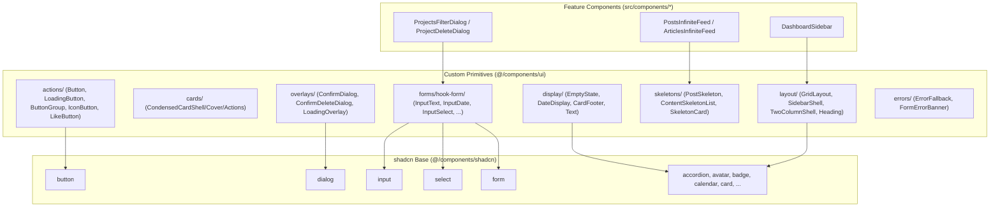
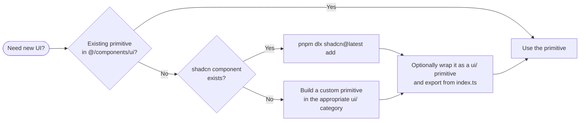

The project's design system is organized around two layers: a curated set of custom UI primitives under `@/components/ui` (cards, actions, forms, display, layout, overlays, skeletons), and a wrapped [shadcn/ui](https://ui.shadcn.com/) base layer under `@/components/shadcn` that provides the unstyled-behavior-meets-Tailwind building blocks (buttons, dialogs, inputs, selects, etc.). Together they provide the single source of truth for building UI in this codebase.

## Purpose and Scope

This page documents the design-system building blocks of the application:

- The two module namespaces: `@/components/ui` (custom primitives) and `@/components/shadcn` (shadcn-generated components).
- The categorized exports exposed through the barrel file [`src/components/ui/index.ts`](https://github.com/ozeaon/ozeaon-v2/blob/0a4f1a95824db87782f1221a4108019d174df3d9/src/components/ui/index.ts).
- Usage patterns and rules enforced by the team, as captured in [`docs/component-library.md`](https://github.com/ozeaon/ozeaon-v2/blob/0a4f1a95824db87782f1221a4108019d174df3d9/docs/component-library.md).
- The conventions for adding new shadcn components (CLI-only workflow).

This page does **not** cover:

- Feature-specific components that live outside `ui/` and `shadcn/` (for example, feed wrappers such as `PostsInfiniteFeed`, `ArticlesInfiniteFeed`, and `ProjectsInfiniteFeed`, whose domain logic belongs to their feature pages).
- Domain form hooks such as `useArticleForm` and `useProjectForm` and their multi-step Zod schemas — see the forms/validation pages.
- Build tooling, Tailwind configuration, or the app's rendering/SSR strategy. For SSR-specific rendering markers, see the relevant rendering rules documentation.

> Note: Only the top-level barrel file and the component-library reference documentation were read within this page's source budget. The exact prop-level signatures of individual primitives are not reproduced here unless they appear in the collected evidence.

## Overview

The design system is deliberately split so that application code never has to reason about low-level styling while still being able to compose rich UI. The reference doc states the intent plainly:

> "Full primitive list, usage patterns, and code samples. Read this before building any new UI — most needs are already covered by an existing primitive."

This is a strong architectural directive: **before building any new UI, search for an existing primitive**. The custom `ui/` layer is meant to absorb the app's recurring shapes (empty states, date rendering, responsive grids, confirmation dialogs) so that feature code stays declarative and visually consistent.

Key concepts and terminology:

| Term | Meaning |
|------|---------|
| **Primitive** | A small, reusable, presentation-focused component exported from `@/components/ui`. |
| **shadcn component** | A base component generated by the shadcn CLI and vendored under `@/components/shadcn`. |
| **Barrel export** | A single `index.ts` that re-exports a category's public surface, e.g. [`src/components/ui/index.ts`](https://github.com/ozeaon/ozeaon-v2/blob/0a4f1a95824db87782f1221a4108019d174df3d9/src/components/ui/index.ts). |
| **Category folder** | A subdirectory grouping related primitives, e.g. `actions/`, `cards/`, `display/`, `layout/`, `overlays/`, `skeletons/`, `comments/`, `forms/`, `inputs/`, `images/`. |
| **RHF wrapper** | A component under `ui/forms/hook-form/` that binds a shadcn input to React Hook Form state. |

The system is designed to be **composable**: custom primitives are built on top of shadcn components, and feature components are built on top of custom primitives. This layering is the mechanism that keeps design consistency enforceable — changes to a primitive propagate everywhere it is used.

## Architecture

The following diagram illustrates the layered architecture and the two namespaces.



The diagram reflects the verified import relationships: the barrel [`src/components/ui/index.ts`](https://github.com/ozeaon/ozeaon-v2/blob/0a4f1a95824db87782f1221a4108019d174df3d9/src/components/ui/index.ts) re-exports from category folders, and it explicitly re-exports one shadcn primitive (`Skeleton`) to make it available from the same entry point:

```typescript
// shadcn primitives commonly used
export { Skeleton } from "@/components/shadcn/skeleton";
```

> Source: [index.ts](https://github.com/ozeaon/ozeaon-v2/blob/0a4f1a95824db87782f1221a4108019d174df3d9/src/components/ui/index.ts#L78-L79)

That single line is architecturally significant: it shows the intended dependency direction — custom primitives may depend on shadcn, and `ui/index.ts` is allowed to surface selected shadcn primitives directly, but feature code is expected to import from `@/components/ui` for the "commonly used" primitives.

### The two namespaces

1. **`@/components/shadcn/*`** — Vendored shadcn/ui components. Examples present in the repository include `accordion.tsx`, `avatar.tsx`, `badge.tsx`, `breadcrumb.tsx`, `button.tsx`, `calendar.tsx`, `card.tsx`, `checkbox.tsx`, `collapsible.tsx`, `command.tsx`, `dialog.tsx`, `drawer.tsx`, `dropdown-menu.tsx`, `form.tsx`, `input.tsx`, `label.tsx`, `popover.tsx`, `radio-group.tsx`, `scroll-area.tsx`, `select.tsx`, and more.

2. **`@/components/ui/*`** — The application's own primitives, organized into category folders and surfaced via a barrel file.

The reason for keeping shadcn components as a separate namespace rather than merging them into `ui/` is to preserve the upstream shape of generated files (making regeneration/upgrades easier) while giving application code a stable, curated API at `@/components/ui`.

## Primitive Categories

The barrel file [`src/components/ui/index.ts`](https://github.com/ozeaon/ozeaon-v2/blob/0a4f1a95824db87782f1221a4108019d174df3d9/src/components/ui/index.ts) is the authoritative map of the design system. It is organized into commented sections, each corresponding to a category folder. Every category re-exports both its **values** (components, constants, hooks) and, where applicable, its **types** using `export type { ... }`.

### Card Primitives (`cards/`)

Three composable pieces that together form the project's condensed card layout:

```typescript
// Card primitives
export {
  CondensedCardShell,
  CondensedCardCover,
  CondensedCardActions,
} from "./cards";
```

> Source: [index.ts](https://github.com/ozeaon/ozeaon-v2/blob/0a4f1a95824db87782f1221a4108019d174df3d9/src/components/ui/index.ts#L1-L6)

The design intent is a **shell + slots** composition: `CondensedCardShell` provides the outer frame, `CondensedCardCover` handles the media/image area, and `CondensedCardActions` standardizes the action bar. The `cards/` folder additionally contains `CardCategoryBadges.tsx` and `CollapsibleCard.tsx`, indicating variations for badges and collapsible cards.

### Action Primitives (`actions/`)

Buttons and action-related controls, exported with their prop types:

```typescript
// Action primitives
export { LoadingButton, ButtonGroup, IconButton, LikeButton } from "./actions";
export type {
  LoadingButtonProps,
  ButtonGroupProps,
  IconButtonProps,
  LikeButtonProps,
  LikeButtonSize,
} from "./actions";
```

> Source: [index.ts](https://github.com/ozeaon/ozeaon-v2/blob/0a4f1a95824db87782f1221a4108019d174df3d9/src/components/ui/index.ts#L8-L16)

Notable members and their documented purpose:

| Component | Purpose | Source |
|-----------|---------|--------|
| `Button` | Base button with `iconLeft`/`iconRight` props; sizes `default` (h-9) and `sm` | `docs/component-library.md` |
| `LoadingButton` | Button with a `Loader2` spinner for imperative async actions | `docs/component-library.md` |
| `ButtonGroup` | Accessible `role="group"` wrapper for related button pairs | `docs/component-library.md` |
| `IconButton` | Icon-only action button | `actions/index.ts` |
| `LikeButton` | Like/reaction button with a `LikeButtonSize` union type | `actions/index.ts` |

The `actions/` folder physically contains `ButtonGroup.tsx`, `IconButton.tsx`, `LikeButton.tsx`, `LoadingButton.tsx`, and `index.ts`. A key convention from the reference doc:

> "Do NOT pass icons as children alongside text — use the icon props instead."

and

> "Pass Lucide icon component references (not JSX): `iconLeft={ArrowLeft}`."

This is a deliberate API constraint: passing component references (rather than JSX nodes) lets the `Button` control icon sizing automatically based on the button's `size`, keeping icon-to-text proportions consistent everywhere.

### Form Inputs (`inputs/`)

The entire inputs category is re-exported with a wildcard, reflecting a broad, flat public surface:

```typescript
// Form inputs
export * from "./inputs";
```

> Source: [index.ts](https://github.com/ozeaon/ozeaon-v2/blob/0a4f1a95824db87782f1221a4108019d174df3d9/src/components/ui/index.ts#L18-L19)

Together with the RHF wrappers documented in the reference doc, the input surface covers text, password, date, select/multi-select, checkbox/radio groups, boolean toggles, grid select, tags, async search select, and a rich text editor. See the [React Hook Form Wrappers](#react-hook-form-wrappers-forms-hook-form) section below.

### Display Primitives (`display/`)

Read-only presentation components:

```typescript
// Display primitives
export {
  EmptyState,
  DateDisplay,
  CardFooter,
  Text,
  DocumentMetadata,
  AttachedItemCard,
} from "./display";
export type {
  EmptyStateProps,
  DateDisplayProps,
  CardFooterProps,
  TextProps,
  DocumentMetadataProps,
  AttachedItemCardProps,
} from "./display";
```

> Source: [index.ts](https://github.com/ozeaon/ozeaon-v2/blob/0a4f1a95824db87782f1221a4108019d174df3d9/src/components/ui/index.ts#L21-L37)

The reference doc establishes hard rules for two of these, framed as "never do the raw thing" directives:

- **`EmptyState`** — "all empty states; never raw `<div className="text-center">`"
- **`DateDisplay`** — "all dates; formats: `"relative"` / `"short"` / `"long"`"
- **`GridLayout`** — "all responsive card grids; never raw `<div className="grid…">`"

The intent is consistency-by-construction: date formatting and empty-state presentation are centralized so that locale/format changes happen in one place.

### Layout Primitives (`layout/`)

Layout primitives, plus a set of exported **class-name constants** used for sticky/aside/gutter behavior:

```typescript
// Layout primitives
export {
  CarouselSection,
  Footer,
  GridLayout,
  ResponsiveCardList,
  SectionHeading,
  Heading,
  headingVariants,
  TwoColumnShell,
  SidebarShell,
  CONTENT_MAX_WIDTH_CLASS,
  STICKY_ASIDE_CLASS,
  STICKY_NAV_CLASS,
  CONTENT_GUTTER_CLASS,
} from "./layout";
export type {
  GridLayoutProps,
  SectionHeadingProps,
  HeadingProps,
} from "./layout";
```

> Source: [index.ts](https://github.com/ozeaon/ozeaon-v2/blob/0a4f1a95824db87782f1221a4108019d174df3d9/src/components/ui/index.ts#L46-L66)

Two distinctive aspects of this category:

1. **`headingVariants`** is a variants object (typical of `class-variance-authority`), paired with a `Heading` component that consumes it. Type exports include `HeadingProps`.
2. **Exported layout constants** (`CONTENT_MAX_WIDTH_CLASS`, `STICKY_ASIDE_CLASS`, `STICKY_NAV_CLASS`, `CONTENT_GUTTER_CLASS`) let feature code reuse canonical spacing classes instead of hardcoding Tailwind strings. This is how the codebase keeps page gutters and sticky offsets aligned across two-column and sidebar layouts.

The `layout/` folder contains shells such as [`TwoColumnShell.tsx`](https://github.com/ozeaon/ozeaon-v2/blob/0a4f1a95824db87782f1221a4108019d174df3d9/src/components/ui/layout/shells/TwoColumnShell.tsx) and [`SidebarShell.tsx`](https://github.com/ozeaon/ozeaon-v2/blob/0a4f1a95824db87782f1221a4108019d174df3d9/src/components/ui/layout/shells/SidebarShell.tsx) (referenced in `DESIGN-CONSISTENCY-PLAN.md`). `SidebarShell` is consumed by [`DashboardSidebar.tsx`](https://github.com/ozeaon/ozeaon-v2/blob/0a4f1a95824db87782f1221a4108019d174df3d9/src/components/nav/DashboardSidebar.tsx#L7), and `GenericInfiniteFeed` (a layout-level component) is consumed by [`ProjectsInfiniteFeed.tsx`](https://github.com/ozeaon/ozeaon-v2/blob/0a4f1a95824db87782f1221a4108019d174df3d9/src/components/projects/ProjectsInfiniteFeed.tsx#L3).

### Comment Primitives (`comments/`)

```typescript
// Comment primitives
export { CardComments, CommentToggle, EntityComments } from "./comments";
```

> Source: [index.ts](https://github.com/ozeaon/ozeaon-v2/blob/0a4f1a95824db87782f1221a4108019d174df3d9/src/components/ui/index.ts#L39-L40)

The `comments/` folder is substantial, containing `CardComments.tsx`, `CommentForm.tsx`, `CommentItem.tsx`, `CommentList.tsx`, `CommentThread.tsx`, `CommentToggle.tsx`, `DeleteComment.tsx`, and `EntityComments.tsx`. The barrel deliberately exposes only the three composition-level components (`CardComments`, `CommentToggle`, `EntityComments`), keeping the internal pieces private to the folder.

### Image Primitives (`images/`)

```typescript
// Image primitives
export { ImageContainer } from "./images";
export type { ImageContainerProps } from "./images";
```

> Source: [index.ts](https://github.com/ozeaon/ozeaon-v2/blob/0a4f1a95824db87782f1221a4108019d174df3d9/src/components/ui/index.ts#L42-L44)

A single `ImageContainer` primitive with an exported `ImageContainerProps`, centralizing image framing/aspect-ratio behavior.

### Skeleton Primitives (`skeletons/`)

```typescript
// Skeleton primitives
export {
  PostSkeleton,
  ContentSkeletonList,
  SkeletonCard,
  skeletonItemClass,
  NavSkeleton,
} from "./skeletons";
export type { ContentSkeletonListProps } from "./skeletons";
```

> Source: [index.ts](https://github.com/ozeaon/ozeaon-v2/blob/0a4f1a95824db87782f1221a4108019d174df3d9/src/components/ui/index.ts#L68-L76)

Documented skeletons from the reference doc:

| Component | Purpose |
|-----------|---------|
| `PostSkeleton` | Post/feed item loading skeleton |
| `ContentSkeletonList` | Generic list skeleton wrapper |
| `SkeletonCard` | Generic card-shaped skeleton |

The `skeletonItemClass` export is a shared class string used to keep skeleton shimmer/pulse consistent across each skeleton component.

### Overlay Primitives (`overlays/`)

```typescript
// Overlay primitives
export {
  ConfirmDialog,
  ConfirmDeleteDialog,
  LoadingOverlay,
  ModerationRejectedDialog,
} from "./overlays";
export type {
  ConfirmDialogProps,
  ConfirmDeleteDialogProps,
  LoadingOverlayProps,
  ModerationRejectedDialogProps,
} from "./overlays";
```

> Source: [index.ts](https://github.com/ozeaon/ozeaon-v2/blob/0a4f1a95824db87782f1221a4108019d174df3d9/src/components/ui/index.ts#L81-L93)

The reference doc mandates:

> "`ConfirmDialog` — all confirmation prompts; never `window.confirm()`"

This is used pervasively; for example, [`ProjectDeleteDialog.tsx`](https://github.com/ozeaon/ozeaon-v2/blob/0a4f1a95824db87782f1221a4108019d174df3d9/src/components/projects/ProjectDeleteDialog.tsx#L3) imports `ConfirmDialog` from `@/components/ui`. `ConfirmDeleteDialog` is a destructive-action specialization, and `ModerationRejectedDialog` is a domain-specific overlay for moderation rejections.

### Error Primitives (`errors/`)

```typescript
// Error primitives
export { ErrorFallback, FormErrorBanner } from "./errors";
export type { FormErrorBannerProps } from "./errors";
```

> Source: [index.ts](https://github.com/ozeaon/ozeaon-v2/blob/0a4f1a95824db87782f1221a4108019d174df3d9/src/components/ui/index.ts#L95-L97)

`ErrorFallback` is used by the app-level error boundary; see [`src/app/error.tsx`](https://github.com/ozeaon/ozeaon-v2/blob/0a4f1a95824db87782f1221a4108019d174df3d9/src/app/error.tsx#L3). `FormErrorBanner` renders form-level error messaging.

### Link Primitives

```typescript
// Link primitives
export { ExternalLink } from "./ExternalLink";
export type { ExternalLinkProps } from "./ExternalLink";
```

> Source: [index.ts](https://github.com/ozeaon/ozeaon-v2/blob/0a4f1a95824db87782f1221a4108019d174df3d9/src/components/ui/index.ts#L99-L101)

`ExternalLink` is exported from a root-level file rather than a folder, providing consistent treatment (e.g. `target`/`rel` handling) for outbound links.

### Root-Level Components

Two established components live at the root of `ui/` rather than in a category folder:

```typescript
// Existing UI components (at root level)
export { PasswordInput } from "./password-input";
export {
  Sidebar,
  SidebarContent,
  ...
  useSidebar,
  useSidebarSafe,
} from "./sidebar";
```

> Source: [index.ts](https://github.com/ozeaon/ozeaon-v2/blob/0a4f1a95824db87782f1221a4108019d174df3d9/src/components/ui/index.ts#L103-L131)

The `sidebar` module is the largest single export surface, providing a full sidebar compound component set: `Sidebar`, `SidebarProvider`, `SidebarTrigger`, `SidebarContent`, `SidebarHeader`, `SidebarFooter`, `SidebarGroup` (+ `SidebarGroupContent`, `SidebarGroupLabel`, `SidebarGroupAction`), `SidebarMenu` (+ `SidebarMenuItem`, `SidebarMenuButton`, `SidebarMenuAction`, `SidebarMenuBadge`, `SidebarMenuSkeleton`), submenus (`SidebarMenuSub`, `SidebarMenuSubButton`, `SidebarMenuSubItem`), plus `SidebarRail`, `SidebarSeparator`, `SidebarInset`, and `SidebarInput`. It also exposes two hooks: `useSidebar` and `useSidebarSafe`.

The presence of **`useSidebarSafe`** alongside `useSidebar` is a deliberate design accommodation: `useSidebar` presumably throws when used outside a `SidebarProvider`, while `useSidebarSafe` allows components to render safely outside a provider context.

## React Hook Form Wrappers (`forms/hook-form/`)

One of the most important parts of the design system is the layer of React Hook Form (RHF)-connected field wrappers. These bind shadcn inputs to RHF state so that feature forms contain almost no controller boilerplate.

The reference doc describes them as living in `src/components/ui/forms/hook-form/`, and `docs/hook-form-components.md` refers to them as "RHF-connected field wrappers". They are imported as a single namespace:

```typescript
import {
  InputText, InputPassword, InputSelect, InputDate, InputRichText, ShowWhen,
} from "@/components/ui/forms/hook-form";
```

> Source: [hook-form-components.md](https://github.com/ozeaon/ozeaon-v2/blob/0a4f1a95824db87782f1221a4108019d174df3d9/docs/hook-form-components.md#L11-L13)

The full wrapper catalog, as documented:

| Component | Use for |
|-----------|---------|
| `InputText` / `InputTextarea` | Text input / multi-line text |
| `InputPassword` | Password with show/hide toggle |
| `InputDate` | Date picker |
| `InputSelect` / `InputMultiSelect` | Single / multi select |
| `InputCheckbox` / `InputCheckboxGroup` / `InputRadioGroup` | Checkbox / group / radio |
| `InputBoolean` | Toggle switch |
| `InputGridSelect` | Card-grid single/multi select |
| `InputTags` | Free-form tags |
| `InputSearchSelect` | Async search single select |
| `InputRichText` | BlockNote rich text editor |
| `OtpInput` | OTP input — standalone, not RHF-connected |

Two notable design points emerge from this table:

1. **`ShowWhen`** is a conditional-rendering helper (distinct from an input) that pairs with RHF to show/hide fields based on other field values. It appears alongside inputs in the import example, confirming it lives in the same module.
2. **`OtpInput` is explicitly *not* RHF-connected.** The doc flags this as an exception ("standalone, not RHF-connected"), which matters because a developer might otherwise assume every component in this module integrates with form state automatically.

### RHF wrapper integration

The wrappers are consumed inside shadcn `Form` providers. For example, [`ProjectsFilterDialog.tsx`](https://github.com/ozeaon/ozeaon-v2/blob/0a4f1a95824db87782f1221a4108019d174df3d9/src/components/projects/ProjectsFilterDialog.tsx#L10-L19) combines shadcn's `Form` with the RHF wrappers and a layout helper:

```tsx
import { Form } from "@/components/shadcn/form";
import { InputDate, InputMultiSelect } from "@/components/ui/forms/hook-form";
// ...
import { FilterSection } from "@/components/ui/forms";
```

> Source: [ProjectsFilterDialog.tsx](https://github.com/ozeaon/ozeaon-v2/blob/0a4f1a95824db87782f1221a4108019d174df3d9/src/components/projects/ProjectsFilterDialog.tsx#L10-L19)

This illustrates the intended composition: **shadcn `Form` provides the RHF context, and the `ui/forms/hook-form` wrappers consume it**, while `ui/forms` provides a `FilterSection` layout primitive for grouping fields.

### Domain form hooks

Beyond the generic wrappers, the system includes domain-specific multi-step form hooks:

> "Domain form hooks: `useArticleForm` (6 steps, `src/zod/articles/step1–6.ts`), `useProjectForm` (5 steps)."

This convention pairs each wizard step with its own Zod schema file, keeping validation co-located per step.

## Adding shadcn Components

A strict workflow governs how shadcn components enter the codebase. The reference doc is explicit:

> "Always use the CLI — never manually write shadcn files or install `@radix-ui/react-*` packages directly"

```bash
pnpm dlx shadcn@latest add <component-name>
```

> Source: [component-library.md](https://github.com/ozeaon/ozeaon-v2/blob/0a4f1a95824db87782f1221a4108019d174df3d9/docs/component-library.md#L82-L88)

The design rationale: manually authoring shadcn files or hand-installing Radix primitives breaks the regeneration path. By always going through the CLI, generated files retain their canonical structure, and Radix dependencies are resolved transitively and versioned consistently. This also matches the architectural decision to keep the shadcn files as a separate `@/components/shadcn` namespace rather than merging them into `ui/`.



This decision flow captures the repository's stated principle: **prefer an existing primitive; prefer the shadcn CLI for base components; only then build custom.**

## Infinite Feed Primitives

While the feed components are feature-level, their shared machinery is part of the layout layer. The reference doc documents the feeds and their contract:

- `PostsInfiniteFeed` — posts feed (`components/posts/PostsInfiniteFeed.tsx`)
- `ArticlesInfiniteFeed` — wraps `GenericInfiniteFeed` for articles
- `ProjectsInfiniteFeed` — wraps `GenericInfiniteFeed` for projects

The documented contract is important for correct use:

> "Pattern: SSR the first page and pass as `initial`; the component handles scroll-loading via `IntersectionObserver`. Never wrap in `<Suspense>` — the feed renders its own loading state. Pass `userId` to filter by a specific user (profile tabs); omit for the global feed."

The canonical usage from the reference doc shows the server-component pattern:

```tsx
// Server Component
const posts = await getFeedPosts(supabase, {
  limit: 5,
  offset: 0,
  userIds: [profileId],
});
return (
  <PostsInfiniteFeed
    initialPosts={posts}
    likedPosts={liked}
    repostedPosts={reposted}
    userId={profileId}
  />
);
```

> Source: [component-library.md](https://github.com/ozeaon/ozeaon-v2/blob/0a4f1a95824db87782f1221a4108019d174df3d9/docs/component-library.md#L30-L45)

Two design decisions stand out here:

1. **SSR-first rendering with client-side continuation.** The first page is fetched on the server and handed to the component as `initial`, so the feed is immediately visible in the initial HTML. The client then takes over with an `IntersectionObserver`.
2. **Self-managed loading state.** The explicit warning not to wrap feeds in `<Suspense>` exists because the feed already renders its own loading/skeleton UI, and double-wrapping would produce conflicting loading indicators. This ties back to the `skeletons/` primitives (`PostSkeleton`, `ContentSkeletonList`, `SkeletonCard`) which back the feed's loading state.

`ProjectsInfiniteFeed` demonstrates the wrapper pattern in code — it imports and configures the generic feed:

```tsx
import GenericInfiniteFeed from "@/components/ui/layout/GenericInfiniteFeed";
import { useIsMobile } from "@/hooks";
```

> Source: [ProjectsInfiniteFeed.tsx](https://github.com/ozeaon/ozeaon-v2/blob/0a4f1a95824db87782f1221a4108019d174df3d9/src/components/projects/ProjectsInfiniteFeed.tsx#L3-L4)

## Usage Examples

### Using primitives in an error boundary

`ErrorFallback` is consumed directly by the App Router's error boundary:

```tsx
import { ErrorFallback } from "@/components/ui";
```

> Source: [error.tsx](https://github.com/ozeaon/ozeaon-v2/blob/0a4f1a95824db87782f1221a4108019d174df3d9/src/app/error.tsx#L3)

This demonstrates that `@/components/ui` is the canonical import path for primitives — feature code imports from the barrel, not from deep category paths.

### Composing layout with `SidebarShell`

```tsx
import { useActiveAccount } from "@/hooks";
import { SidebarShell } from "@/components/ui";
import { PlusIcon, ChevronDown, Building2 } from "lucide-react";
```

> Source: [DashboardSidebar.tsx](https://github.com/ozeaon/ozeaon-v2/blob/0a4f1a95824db87782f1221a4108019d174df3d9/src/components/nav/DashboardSidebar.tsx#L6-L8)

Note that icons are imported from `lucide-react` and passed as component references (per the `Button` icon-prop convention), never as inline JSX children.

### Confirmation flows with `ConfirmDialog`

```tsx
import { ConfirmDialog } from "@/components/ui";
```

> Source: [ProjectDeleteDialog.tsx](https://github.com/ozeaon/ozeaon-v2/blob/0a4f1a95824db87782f1221a4108019d174df3d9/src/components/projects/ProjectDeleteDialog.tsx#L3)

### The `useAsyncAction` hook

The reference doc highlights a hook that consolidates the common async-action pattern:

> "`useAsyncAction` — replaces manual `useState + try/catch + toast`"

```typescript
const { execute: handleFollow, isLoading } = useAsyncAction(
  () => followUser(targetUserId),
  { successMessage: "Followed!", errorMessage: "Failed to follow" },
);
```

> Source: [component-library.md](https://github.com/ozeaon/ozeaon-v2/blob/0a4f1a95824db87782f1221a4108019d174df3d9/src/components/component-library.md#L55-L62)

The design intent is centralized: `useAsyncAction` returns an `execute` function that wraps the promise with loading state and toast notifications, so components no longer repeat `useState` + `try/catch` + `toast` three times per action.

## Conventions, Edge Cases & Shared Constants

### Import-path conventions

| Intent | Correct path |
|--------|--------------|
| Use a curated app primitive | `@/components/ui` |
| Use a specific category directly | `@/components/ui/<category>` (e.g. `@/components/ui/forms/hook-form`) |
| Use a raw shadcn component | `@/components/shadcn/<component>` (e.g. `@/components/shadcn/form`) |
| Use a wrapped shadcn primitive | Import from `@/components/ui` when re-exported (e.g. `Skeleton`) |

### "Never do the raw thing" rules

The design system enforces several invariants stated as absolute rules in the reference doc. These are effectively edge cases handled centrally so that individual features cannot drift:

| Rule | Raw anti-pattern | Correct primitive |
|------|------------------|-------------------|
| Empty states | `<div className="text-center">` | `EmptyState` |
| Dates | Manual `toLocaleDateString` style calls | `DateDisplay` (`relative`/`short`/`long`) |
| Responsive card grids | `<div className="grid...">` | `GridLayout` |
| Confirmation prompts | `window.confirm()` | `ConfirmDialog` |
| Button icons as children | `<Button><Icon />Text</Button>` | `iconLeft={Icon}` / `iconRight={Icon}` |
| Manually authoring shadcn files | Hand-written shadcn `.tsx` or direct `@radix-ui/react-*` installs | `pnpm dlx shadcn@latest add` |

### Edge cases worth noting

- **`OtpInput` is not RHF-connected.** Unlike its siblings in `ui/forms/hook-form/`, it must be wired to form state manually. Treat it as a controlled component, not a drop-in managed field.
- **Two sidebar hooks (`useSidebar` vs `useSidebarSafe`).** The `Safe` variant exists to allow components to consume sidebar context without crashing when rendered outside a `SidebarProvider`. Choose based on whether the component can legally require a provider.
- **Infinite feeds must not be wrapped in `<Suspense>`.** The feed renders its own loading state; wrapping it produces conflicting loading indicators.
- **Icon props take references, not JSX.** Because `Button` computes icon size from its own `size` prop, passing raw JSX (`<ArrowLeft />`) as a child breaks the automatic sizing contract.

### Shared class-name constants

The layout category exports four canonical class strings that should be reused instead of inlined Tailwind:

| Constant | Purpose |
|----------|---------|
| `CONTENT_MAX_WIDTH_CLASS` | Standard max-width for page content |
| `CONTENT_GUTTER_CLASS` | Standard horizontal page gutter |
| `STICKY_ASIDE_CLASS` | Sticky positioning for aside columns |
| `STICKY_NAV_CLASS` | Sticky positioning for navigation |

Reusing these constants is what keeps two-column shells, sidebar layouts, and page gutters aligned when the design changes.

## Extension Points

The design system offers three sanctioned extension paths, in order of preference:

1. **Compose existing primitives.** The dominant approach — most UI needs are expected to be met by combining `ui/` primitives with `shadcn/` base components.
2. **Wrap a shadcn component as a `ui/` primitive.** When a base component needs app-specific behavior (like `Button` wrapping shadcn `button` with `iconLeft`/`iconRight`), wrap it and export it from the appropriate category's `index.ts`, then surface it through [`src/components/ui/index.ts`](https://github.com/ozeaon/ozeaon-v2/blob/0a4f1a95824db87782f1221a4108019d174df3d9/src/components/ui/index.ts).
3. **Add a new shadcn component via the CLI.** The required mechanism for introducing new Radix-backed base components, ensuring canonical file structure and dependency resolution.

The single choke point for the curated API is the barrel file. Any primitive you want available at `@/components/ui` must be re-exported there — the barrel is both the public surface and the single point where categories are composed (e.g. the `Skeleton` re-export from shadcn).

## Operational & Consistency Notes

- **Enforcement is documentation-led.** The rules live in [`docs/component-library.md`](https://github.com/ozeaon/ozeaon-v2/blob/0a4f1a95824db87782f1221a4108019d174df3d9/docs/component-library.md) as a "read this before building any new UI" reference, plus a `DESIGN-CONSISTENCY-PLAN.md` that tracks shell layout standardization (referencing `TwoColumnShell.tsx` and `SidebarShell.tsx`).
- **Change propagation is a feature.** Because primitives sit beneath all feature code, updating a primitive (e.g. `DateDisplay` format handling) automatically updates every consumer — the primary reason raw markup is disallowed.
- **Type surfaces are exported explicitly.** Most categories export their prop types (`ButtonGroupProps`, `EmptyStateProps`, `GridLayoutProps`, etc.) alongside values, so consumers can type-extend or wrap primitives without duplicating type definitions.

## Related Links

- [Component Library Reference](https://github.com/ozeaon/ozeaon-v2/blob/0a4f1a95824db87782f1221a4108019d174df3d9/docs/component-library.md) — the authoritative primitive catalog and usage rules.
- [React Hook Form Components](https://github.com/ozeaon/ozeaon-v2/blob/0a4f1a95824db87782f1221a4108019d174df3d9/docs/hook-form-components.md) — details on the RHF field wrappers.
- [UI barrel export](https://github.com/ozeaon/ozeaon-v2/blob/0a4f1a95824db87782f1221a4108019d174df3d9/src/components/ui/index.ts) — the single public surface of the design system.
- [shadcn components directory](https://github.com/ozeaon/ozeaon-v2/blob/0a4f1a95824db87782f1221a4108019d174df3d9/src/components/shadcn/button.tsx) — the vendored base layer (see `button.tsx`, `form.tsx`, `dialog.tsx`, `select.tsx`, and others in the same folder).
- [App error boundary](https://github.com/ozeaon/ozeaon-v2/blob/0a4f1a95824db87782f1221a4108019d174df3d9/src/app/error.tsx) — consumes `ErrorFallback` from `@/components/ui`.
- [DashboardSidebar](https://github.com/ozeaon/ozeaon-v2/blob/0a4f1a95824db87782f1221a4108019d174df3d9/src/components/nav/DashboardSidebar.tsx) — example of `SidebarShell` usage.
- [ProjectsFilterDialog](https://github.com/ozeaon/ozeaon-v2/blob/0a4f1a95824db87782f1221a4108019d174df3d9/src/components/projects/ProjectsFilterDialog.tsx) — example of shadcn `Form` + RHF wrappers composition.
- [ProjectsInfiniteFeed](https://github.com/ozeaon/ozeaon-v2/blob/0a4f1a95824db87782f1221a4108019d174df3d9/src/components/projects/ProjectsInfiniteFeed.tsx) — example of wrapping `GenericInfiniteFeed`.
- [Design Consistency Plan](https://github.com/ozeaon/ozeaon-v2/blob/0a4f1a95824db87782f1221a4108019d174df3d9/DESIGN-CONSISTENCY-PLAN.md) — standardization roadmap for shells and layout.
- [SSR rendering rules](https://github.com/ozeaon/ozeaon-v2/blob/0a4f1a95824db87782f1221a4108019d174df3d9/docs/ssr/rendering-rules-today.md) — for rendering markers such as `DynamicMarker` that interact with UI shells.
