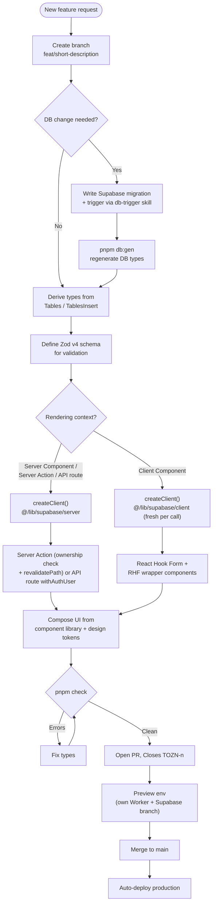

A practical walkthrough of how a new feature is designed, implemented, type-checked, reviewed, and shipped in OZEAON. Because the stack is convention-heavy, adding a feature is less about inventing new patterns and more about fitting into existing ones — correct client selection, derived types, ownership-scoped mutations, and CI-gated deploys.

## Overview

The stack is **Next.js (App Router) + TypeScript + Supabase (PostgreSQL + RLS) + Zod v4 + React Hook Form + Tailwind CSS v4**, deployed to the edge via **OpenNext + Wrangler → Cloudflare Workers**.



## Step 1 — Branching, Commits & PR Conventions

Branch naming, commit format, PR requirements, and the Monday ticket lifecycle are covered in [CI/CD Workflows](../../operations/ci-cd-workflows/) and [docs/workflows.md](https://github.com/ozeaon/ozeaon-v2/blob/0a4f1a95824db87782f1221a4108019d174df3d9/docs/workflows.md). Short form: branch `feat/short-description`, commit `feat(scope): description`, PR with `Closes TOZN-<n>` and a code owner review for anything in `src/`, `supabase/`, or `.github/workflows/`.

## Step 2 — Data Access: Choosing the Correct Supabase Client

Picking the right client is the single most important correctness decision. It determines both RLS enforcement and rendering behavior (static prerender vs. dynamic).

| Client | Import | Use in |
| --- | --- | --- |
| Server | `@/lib/supabase/server` | Server Components, Server Actions, API routes |
| Browser | `@/lib/supabase/client` | Client Components — create fresh per call |
| Admin | `@/lib/supabase/admin` | API routes bypassing RLS (use sparingly) |
| Public | `@/lib/supabase/public` | Unauthenticated public queries |

Calling `await createClient()` (the server client) internally calls `cookies()`, which **automatically opts that route into dynamic rendering**. Never declare `export const dynamic` — the `cookies()` call is the signal. Never use `createPublicClient()` in a component that also renders user-specific state.

`getAuthUserOrRedirect()` and `getAuthUser()` from [`@/lib/supabase/queries/auth`](https://github.com/ozeaon/ozeaon-v2/blob/0a4f1a95824db87782f1221a4108019d174df3d9/src/lib/supabase/queries/auth.ts) both return a `supabase` client memoized by React `cache()` for the request. Reuse it:

```typescript
// ✅ Correct — reuse the client from auth
const { user, supabase } = await getAuthUserOrRedirect();
```

Route handlers wrapped in `withAuthUser` receive `supabase` via context — never call `createClient()` inside:

```typescript
export const POST = withAuthUser(async (req, { user, supabase }) => {
  // supabase is already available
});
```

## Step 3 — Type System: Derive, Never Hand-Roll

All domain types must be derived from the generated Supabase types in `@/types/supabase`. Never hand-write row shapes. Domain types live in `src/types/` and must not be defined inside component files.

```typescript
type Project = Tables<"projects">; // full row
type Slug = Pick<Tables<"resource_subcategories">, "id" | "name" | "slug">; // projection
const insert: TablesInsert<"projects"> = { title, slug, created_by: user.id }; // mutation
```

When a feature adds or changes a table, run `pnpm db:gen` after the migration to regenerate `src/types/supabase.ts`. The most common source of feature bugs is a three-way mismatch: verify that field names are consistent across Zod schemas, DB types, and component props (for example `author_name` vs `display_name`).

## Step 4 — Mutations: API Routes & Server Actions

**API routes** must use `withAuthUser()` — ESLint ([`eslint.rules.auth.mjs`](https://github.com/ozeaon/ozeaon-v2/blob/0a4f1a95824db87782f1221a4108019d174df3d9/eslint.rules.auth.mjs)) bans `supabase.auth.getUser()` and `supabase.auth.getSession()` project-wide. See [Conventions & Linting](../conventions-and-linting/) for the full auth rule rationale. Return `201` on create, `400` on validation failure, `401` on unauthorized, `500` on error.

**Server Actions** must always verify ownership by adding `.eq("user_id", user.id)` to the mutation, and call `revalidatePath(...)` after writes. Ownership enforcement belongs in the mutation query itself, not as a separate pre-check — this closes the time-of-check/time-of-use gap.

## Step 5 — UI: Reuse the Component Library & Design Tokens

Two hard constraints apply:

- **Never reinvent a primitive.** Check the component library first. Common primitives: `EmptyState`, `GridLayout`, `Button` / `LoadingButton` (use `iconLeft`/`iconRight` props, not JSX children), `ConfirmDialog`.
- **Never use raw Tailwind size or color utilities.** Use the project's tokens in `src/styles/typography.css` and `src/styles/globals.css` (see [Design Tokens](../../design-system/design-tokens/)).

Import conventions:

```typescript
import { useAuth } from "@/hooks";
import { env, IMAGE_CONFIG } from "@/config";
import { validateFileType, generateUniqueKey } from "@/utils";
import { createClient } from "@/lib/supabase/server";
import type { Tables, TablesInsert } from "@/types/supabase";
```

Domain cards import from the domain's `cards/` subdirectory: `@/components/posts/cards`, `@/components/articles/cards`, etc.

## Step 6 — Database Changes: Migrations & Triggers

If the feature needs new tables, columns, or derived state, the change belongs in a Supabase migration, not application code. The current schema is in [docs/db/schema.sql](https://github.com/ozeaon/ozeaon-v2/blob/0a4f1a95824db87782f1221a4108019d174df3d9/docs/db/schema.sql); migration conventions and history are in [Migrations & Seeding](../../operations/migrations-and-seeding/).

Use **PostgreSQL triggers** for any logic that is a deterministic side-effect of a row state change — audit timestamps, cascading inserts, denormalised counters, invariant enforcement. This logic must never live in API routes or Server Actions: whatever path mutates the row, the trigger is the single source of truth for derived state. When writing a trigger, invoke the `db-trigger` skill rather than hand-rolling — it encodes the project's full security convention (`SECURITY DEFINER`, `search_path`, revoke grants).

A migration that changes what the preview fixture writes to must update `supabase/seeds/10-preview-fixture.sql` in the same PR.

## Step 7 — Storage: Always Use StorageAdapter

For any file upload, URL generation, or deletion, use `StorageAdapter` from [`@/lib/storage/adapter`](https://github.com/ozeaon/ozeaon-v2/blob/0a4f1a95824db87782f1221a4108019d174df3d9/src/lib/storage/adapter.ts). Never use the raw R2 binding directly. See [Storage (R2)](../../storage/storage-r2/).

## Step 8 — Verification Gates

Run `pnpm check` (TypeScript) and `pnpm lint` before pushing. The CI gates are `pr-validation.yml` (runs lint and typecheck on every PR) and `pnpm check` locally — these are the real gatekeepers, not any editor hook.

The project bans `export const dynamic`, `"use cache"`, `cacheTag`, `cacheLife`, and `updateTag` via ESLint ([`eslint.rules.cache.mjs`](https://github.com/ozeaon/ozeaon-v2/blob/0a4f1a95824db87782f1221a4108019d174df3d9/eslint.rules.cache.mjs)) — the project does not support `cacheComponents` yet. See [Conventions & Linting](../conventions-and-linting/).

## Step 9 — Shipping: Preview Environments & Production

The production path is: merge to `main` → CI runs `_shared-build.yml` → `production.yml` deploys. **Never run `pnpm ci:deploy` locally** — deploys are CI-only. Rollback is `git revert` followed by a new CI run, not `wrangler rollback`.

Every PR into `main` gets its own Worker and Supabase branch, seeded from `supabase/seeds/10-preview-fixture.sql`. See [CI/CD Workflows](../../operations/ci-cd-workflows/) for the full preview lifecycle and secrets setup.

## Failure Modes & Edge Cases

| Situation | Wrong approach | Correct approach |
| --- | --- | --- |
| User-specific data in a Server Component | `createPublicClient()` / admin client | `createClient()` — its `cookies()` call is the dynamic signal |
| Route handler auth | `supabase.auth.getUser()` inside handler | `withAuthUser()` wrapper; use `supabase` from context |
| After `getAuthUserOrRedirect()` | Call `createClient()` again | Reuse `supabase` from the auth helper |
| Forcing rendering mode | `export const dynamic` / `revalidate` | Rely on the `cookies()` signal |
| Client Component Supabase client | Caching the client globally | Create a fresh client per call |
| Mutation authorization | Separate pre-check then write | `.eq("user_id", user.id)` in the mutation query |
| Cache staleness after write | No invalidation | `revalidatePath(...)` after writes |
| Derived state / counters | Application-level updates | PostgreSQL trigger via `db-trigger` skill |
| Zod ↔ DB ↔ props mismatch | Trusting structural compatibility | Verify all three field names match explicitly |
| Migration affects preview fixture | Not updating the fixture | Update `10-preview-fixture.sql` in the same PR |

## Technology Constraints

Breaking changes that affect how you write feature code:

- **Next.js:** `cookies()` / `headers()` are async — always `await` them.
- **Zod v4:** breaking changes from v3; do not use deprecated v3 APIs.
- **Tailwind CSS v4:** the config format differs from v3; do not use a `tailwind.config.js` pattern.

See [Cloudflare Deployment](../../operations/cloudflare-deployment/) for the deployment pipeline and environment details. Use `pnpm only` — never `npm` or `yarn`.

## Extension Points

| Extension point | Where | Notes |
| --- | --- | --- |
| Database triggers | Supabase migrations | Deterministic side-effects; use the `db-trigger` skill |
| Server Actions | Feature modules | Ownership-scoped mutations + `revalidatePath` |
| API routes | `withAuthUser` wrappers | Auth via context; never `createClient()` inside |
| Storage operations | `StorageAdapter` | Never the raw R2 binding |
| UI primitives | Component library | Reuse; never reinvent markup |
| Design tokens | `src/styles/typography.css`, `src/styles/globals.css` | Never raw Tailwind size/color utilities |
| Generated types | `@/types/supabase` | Regenerate with `pnpm db:gen` after migrations |

## Related Links

- [CI/CD Workflows](../../operations/ci-cd-workflows/) — branch, commit, PR conventions and preview lifecycle
- [Conventions & Linting](../conventions-and-linting/) — ESLint rules, auth restrictions, caching model
- [Cloudflare Deployment](../../operations/cloudflare-deployment/) — deployment pipeline
- [Migrations & Seeding](../../operations/migrations-and-seeding/) — migration conventions and history
- [Supabase Client Patterns](../../architecture/supabase-client-patterns/) — client factory details
- [Storage (R2)](../../storage/storage-r2/) — upload/URL/delete patterns
- [Design Tokens](../../design-system/design-tokens/) — type scale and color tokens
- [docs/workflows.md](https://github.com/ozeaon/ozeaon-v2/blob/0a4f1a95824db87782f1221a4108019d174df3d9/docs/workflows.md) — branch, commit, PR and ticket lifecycle
- [docs/db/schema.sql](https://github.com/ozeaon/ozeaon-v2/blob/0a4f1a95824db87782f1221a4108019d174df3d9/docs/db/schema.sql) — current database schema
