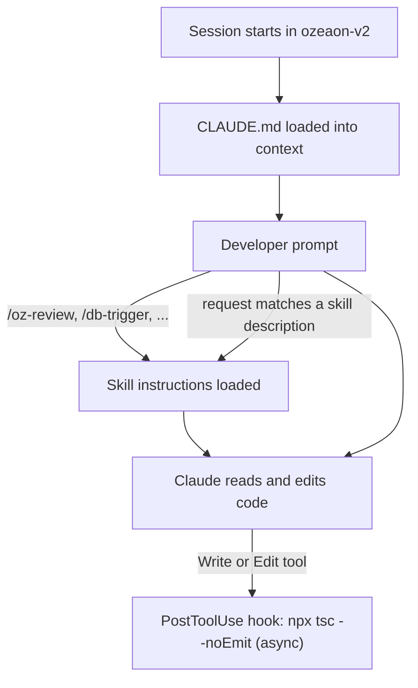

The ozeaon-v2 repository ships a shared Claude Code configuration, so every developer who clones it gets the same project instructions, hook, skills and agent. This page covers what each piece does, how to invoke it, and what you have to set up yourself. For the conventions the configuration encodes, see [Conventions & Linting](../conventions-and-linting/) and [Adding a Feature End-to-End](../adding-a-feature/).

## Overview

| File | Kind | Purpose |
| --- | --- | --- |
| [`CLAUDE.md`](https://github.com/ozeaon/ozeaon-v2/blob/eb7b75a5ce9802b7848f614195586fadda822f0b/CLAUDE.md) | Project memory | Loaded into every session. Stack, rules, client patterns and pointers into `docs/` |
| [`.claude/settings.json`](https://github.com/ozeaon/ozeaon-v2/blob/eb7b75a5ce9802b7848f614195586fadda822f0b/.claude/settings.json) | Settings | One `PostToolUse` hook that type-checks after edits |
| [`.claude/skills/oz-review/`](https://github.com/ozeaon/ozeaon-v2/blob/eb7b75a5ce9802b7848f614195586fadda822f0b/.claude/skills/oz-review/SKILL.md) | Skill | Structured, ticket-aware code review of the current branch against `main` |
| [`.claude/skills/db-trigger/`](https://github.com/ozeaon/ozeaon-v2/blob/eb7b75a5ce9802b7848f614195586fadda822f0b/.claude/skills/db-trigger/SKILL.md) | Skill | The project's security convention for PostgreSQL trigger functions and migrations |
| [`.claude/skills/zod4/`](https://github.com/ozeaon/ozeaon-v2/blob/eb7b75a5ce9802b7848f614195586fadda822f0b/.claude/skills/zod4/SKILL.md) | Skill | Zod 4 syntax reference, so schemas avoid deprecated Zod 3 APIs |
| [`.claude/skills/logtape/`](https://github.com/ozeaon/ozeaon-v2/blob/eb7b75a5ce9802b7848f614195586fadda822f0b/.claude/skills/logtape/SKILL.md) | Skill | LogTape usage reference: loggers, structured messages, context, redaction |
| [`.claude/skills/analyze/`](https://github.com/ozeaon/ozeaon-v2/blob/eb7b75a5ce9802b7848f614195586fadda822f0b/.claude/skills/analyze/SKILL.md) | Skill | Read-only analysis that writes a severity-ranked report and fix plan |
| [`.claude/agents/claude-config-docs.md`](https://github.com/ozeaon/ozeaon-v2/blob/eb7b75a5ce9802b7848f614195586fadda822f0b/.claude/agents/claude-config-docs.md) | Subagent | Generic helper for writing Claude Code configuration |

## How the pieces load

`CLAUDE.md` is always in context. Skills load on demand, either when you type their name as a slash command or when Claude decides a request matches the skill's `description`. CLAUDE.md also tells Claude to reach for a skill in specific cases, for example "invoke the `db-trigger` skill" before writing any trigger.

