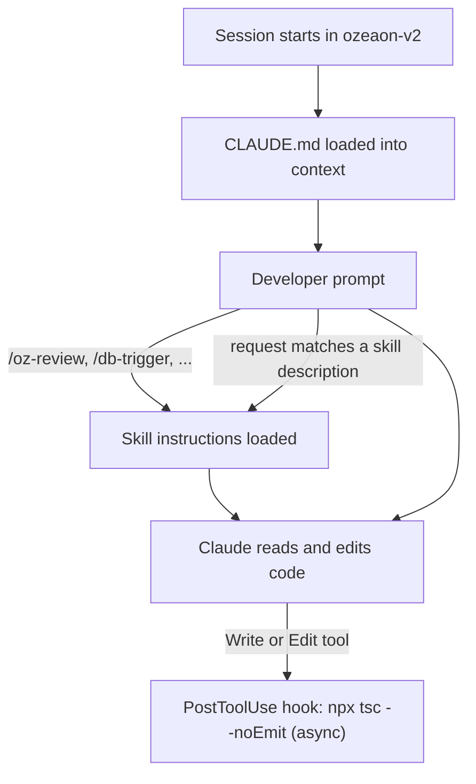

The ozeaon-v2 repository ships a shared Claude Code configuration, so every developer who clones it gets the same project instructions, hook, skills and agent. This page covers what each piece does, how to invoke it, and what you have to set up yourself. For the conventions the configuration encodes, see [Conventions & Linting](../conventions-and-linting/) and [Adding a Feature End-to-End](../adding-a-feature/).

## Overview

| File | Kind | Purpose |
| --- | --- | --- |
| [`CLAUDE.md`](https://github.com/ozeaon/ozeaon-v2/blob/eb7b75a5ce9802b7848f614195586fadda822f0b/CLAUDE.md) | Project memory | Loaded into every session. Stack, rules, client patterns and pointers into `docs/` |
| [`.claude/settings.json`](https://github.com/ozeaon/ozeaon-v2/blob/eb7b75a5ce9802b7848f614195586fadda822f0b/.claude/settings.json) | Settings | One `PostToolUse` hook that type-checks after edits |
| [`.claude/skills/oz-review/`](https://github.com/ozeaon/ozeaon-v2/blob/eb7b75a5ce9802b7848f614195586fadda822f0b/.claude/skills/oz-review/SKILL.md) | Skill | Structured, ticket-aware code review of the current branch against `main` |
| [`.claude/skills/db-trigger/`](https://github.com/ozeaon/ozeaon-v2/blob/eb7b75a5ce9802b7848f614195586fadda822f0b/.claude/skills/db-trigger/SKILL.md) | Skill | The project's security convention for PostgreSQL trigger functions and migrations |
| [`.claude/skills/zod4/`](https://github.com/ozeaon/ozeaon-v2/blob/eb7b75a5ce9802b7848f614195586fadda822f0b/.claude/skills/zod4/SKILL.md) | Skill | Zod 4 syntax reference, so schemas avoid deprecated Zod 3 APIs |
| [`.claude/skills/logtape/`](https://github.com/ozeaon/ozeaon-v2/blob/eb7b75a5ce9802b7848f614195586fadda822f0b/.claude/skills/logtape/SKILL.md) | Skill | LogTape usage reference: loggers, structured messages, context, redaction |
| [`.claude/skills/analyze/`](https://github.com/ozeaon/ozeaon-v2/blob/eb7b75a5ce9802b7848f614195586fadda822f0b/.claude/skills/analyze/SKILL.md) | Skill | Read-only analysis that writes a severity-ranked report and fix plan |
| [`.claude/agents/claude-config-docs.md`](https://github.com/ozeaon/ozeaon-v2/blob/eb7b75a5ce9802b7848f614195586fadda822f0b/.claude/agents/claude-config-docs.md) | Subagent | Generic helper for writing Claude Code configuration |

## How the pieces load



`CLAUDE.md` is always in context. Skills load on demand, either when you type their name as a slash command or when Claude decides a request matches the skill's `description`. CLAUDE.md also tells Claude to reach for a skill in specific cases, for example "invoke the `db-trigger` skill" before writing any trigger.

## CLAUDE.md

The project instructions are deliberately short and point into `docs/` for the full detail, so the two don't drift apart. Its sections:

| Section | What it tells Claude |
| --- | --- |
| Project Overview | SSR constraints, the planned `cacheComponents` move, and the ban on old route segment config (`export const dynamic`, `revalidate`, `fetchCache`, `runtime`). Read the bundled Next.js docs in `node_modules/next/dist/docs/` before touching routes, caching or Supabase-in-SSR code |
| Workflow Rules | Diagnose the root cause before editing. Analysis first when asked to understand, analyse or review. Parallel agents for changes spanning 4+ files |
| TypeScript | Verify each fix resolves the exact error, check field names across Zod, DB types and props, and always await promises |
| Technology Stack & Versions | Breaking changes that matter: async `cookies()`/`headers()`, Zod 4, Tailwind v4 config, pnpm only |
| Commands Reference | The `pnpm` scripts (`dev`, `check`, `lint`, `db:gen`, `ci:deploy`, ...) |
| Supabase Client Patterns | Which client to import where, and never calling `createClient()` after `getAuthUser()` or inside a `withAuthUser` handler. See [Supabase Client Patterns](../../architecture/supabase-client-patterns/) |
| R2 Storage Patterns | Always go through `StorageAdapter`. Points to `docs/r2-storage.md` |
| API & Server Action Patterns | Status codes, `TablesInsert<>`, ownership checks on mutations, `revalidateTag` after writes |
| Import Conventions | Barrel imports and domain `cards/` subdirectories |
| Type System | Derive from generated types, never hand-roll them. Domain types live in `src/types/` |
| Component Library | The primitives most often reinvented (`EmptyState`, `GridLayout`, `Button` icon props, `ConfirmDialog`). Points to `docs/component-library.md` |
| Typography & Color System | No raw Tailwind size or colour utilities. Points to `docs/design-system.md` |
| Database Schema / Triggers | Core tables, `docs/db/schema.sql`, and side effects as triggers written with the `db-trigger` skill |
| Deployment | Always pass `--env` to `ci:deploy`, plus the per-PR preview fixture rule |

### The Next.js agent-rules block

The block between `<!-- BEGIN:nextjs-agent-rules -->` and `<!-- END:nextjs-agent-rules -->` at the bottom is written by `next dev`, not by hand. If you delete it, it reappears as an uncommitted change the next time the dev server starts. Leave it committed.

## The type-check hook

`.claude/settings.json` registers a single hook:

```json
{
  "hooks": {
    "PostToolUse": [
      {
        "matcher": "Write|Edit",
        "hooks": [
          { "type": "command", "command": "npx tsc --noEmit 2>&1 | head -20", "timeout": 60, "async": true }
        ]
      }
    ]
  }
}
```

After every `Write` or `Edit` tool call, it runs a full `tsc --noEmit` in the background and reports the first 20 lines of output.

:::caution
CLAUDE.md's TypeScript section describes this differently. It says the hook runs on **Stop**, runs only when `.ts`/`.tsx` files were edited, and **blocks completion** until errors are fixed. The committed hook does none of those things. It fires on every edit to any file, and because it is `async` it never blocks. Until the two are reconciled, run `pnpm check` yourself before finishing.
:::

## Skills

| Skill | Invoke | Use it for |
| --- | --- | --- |
| `oz-review` | `/oz-review [file-or-feature]` | Reviewing the current branch before or during code review |
| `db-trigger` | `/db-trigger`, or automatically when writing a trigger | Any migration that creates a trigger function or an RLS helper |
| `zod4` | Automatically when writing Zod schemas | Avoiding Zod 3 syntax |
| `logtape` | Automatically when adding logging | LogTape API usage |
| `analyze` | `/analyze`, or "analyze / audit / investigate X" | A written plan before any code is touched |

### oz-review

The largest skill. It reviews **only the diff against `main`** and watches for signs of vibe coding, such as unnecessary fallbacks and over-complicated data processing. Pass a file or feature to narrow the scope.

1. **Identify the ticket.** It parses the ticket id from the branch name (`<type>/<tozn|bozn>-<n>-<description>`), falling back to the PR's `Closes TOZN-<n>` line. It then reads the item, its updates and any linked Monday doc through the Monday MCP. If the ticket body is just a Google Docs link, it reads that doc through the Google Drive connector.
2. **PR context.** It reads the PR description, comments, review threads and linked issues with `gh`.
3. **Triage and orientation.** It classifies each changed file (page, route, layout, component, hook, schema, migration) and runs `pnpm check` and `pnpm lint`.
4. **Checklist review.** Supabase client usage, auth, server/client boundaries, Zod, RHF, R2 uploads and moderation, types, design system, API routes, error handling, state, performance, logging, migrations. It looks conventions up in the reference docs rather than arguing from memory.
5. **Verify every finding.** It runs a probe against the local stack where one exists: `psql` with an `authenticated` role for RLS, `curl` against the dev server, Playwright for rendering, `eslint` for lint claims. Each finding is labelled **CONFIRMED**, **REFUTED** (deleted) or **UNVERIFIED** (kept, with the reason).
6. **Output.** Findings are grouped 🔴 Critical / 🟡 Warnings / 🟢 Suggestions / ✅ What's working well, ordered by severity. Every 🔴 and 🟡 carries an `Evidence:` line, and the report says how many findings were refuted. Unmet acceptance criteria are 🔴, and changes outside the ticket are flagged as scope creep.

`references/anti-patterns.md` is a before/after table the skill loads only when a finding doesn't fit the checklist.

**What it needs.** Its `allowed-tools` reference MCP servers that the repo does not configure, so connect them yourself:

| Capability | Needed for |
| --- | --- |
| Monday connector (`claude_ai_monday_com`) | Reading the ticket. Without it the review runs with no ticket context |
| Google Drive connector | Tickets whose description is a Google Docs link |
| Playwright MCP | Verifying rendering and hydration findings |
| Supabase MCP | Advisor checks and SQL on migration findings |
| `gh` CLI, authenticated | PR context |
| Local Supabase + `pnpm dev` | Verification. With the stack down, findings ship as UNVERIFIED |

### db-trigger

This skill encodes the trigger convention derived from the migration history, so new triggers don't trip Supabase advisor lints 0011, 0028 and 0029:

- `SECURITY DEFINER` and `SET search_path TO ''`, with fully qualified table names. Triggers that only mutate `NEW` don't need `SECURITY DEFINER`.
- `trg_` prefix on both the function and the trigger.
- `BEFORE` triggers for mutating the row, `AFTER` for side effects on other tables. Guard status transitions with `IS DISTINCT FROM`.
- Revoke `EXECUTE` from **both** `PUBLIC` and `anon, authenticated` in the same migration. Either revoke alone still gets flagged.
- RLS-only helpers go in the `private` schema. RPC-callable functions are granted to `authenticated` only.
- `(SELECT auth.uid())` in policies, and policies split per command.
- Verify with `has_function_privilege` after `supabase db reset`.

See [Migrations & Seeding](../../operations/migrations-and-seeding/) for where migrations fit in the workflow.

### zod4

A reference table of the Zod 3 → 4 breaking changes as they apply here. Examples: top-level format validators (`z.email()`, not `z.string().email()`), the unified `error` parameter, `z.strictObject` / `z.looseObject`, two-argument `z.record`, `.default()` matching the output type, and `z.treeifyError`. See [Zod Schemas](../../forms/zod-schemas/) for how the project's schemas are organised.

### logtape

The upstream LogTape skill (MIT), covering loggers, structured message syntax, configuration, context, lazy evaluation, sinks, redaction and testing. It is generic. The project-specific categories and helpers live in `docs/logging-conventions.md` and [Logging & Observability](../../operations/logging-observability/), and those win where the two differ.

### analyze

A read-only mode. Claude reads the whole area, ranks issues Critical / High / Medium / Low, and writes a file-by-file fix plan with line numbers. It saves the report to `.claude/docs/analysis/analysis-<topic>.md` and stops without editing source files. You review the plan and then ask for the changes.

The skill's description says the report goes to `docs/`, but its process step writes to `.claude/docs/analysis/`. That folder isn't gitignored, so reports show up as untracked files. Delete them or leave them out of your commits.

## Subagent: claude-config-docs

A general-purpose helper for writing CLAUDE.md sections, skills, agents and hooks. It runs on Opus. It contains nothing specific to OZEAON, and its hook example uses an `event`/`matcher.type` shape that is not the real `settings.json` format. Copy hook syntax from `.claude/settings.json` instead.

