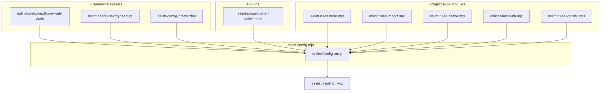
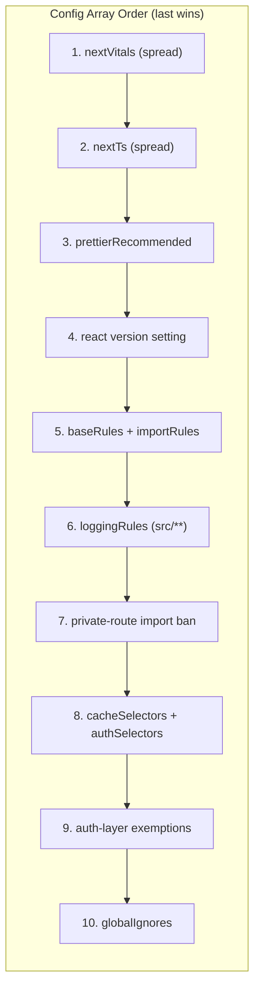
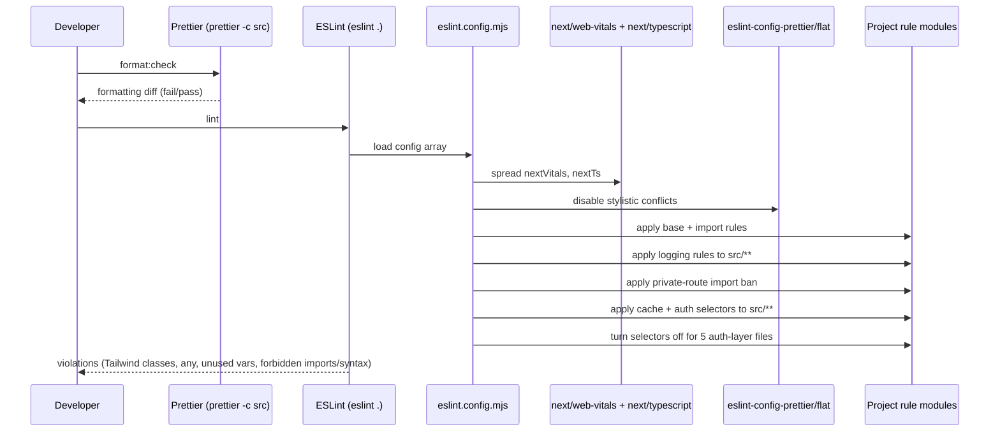
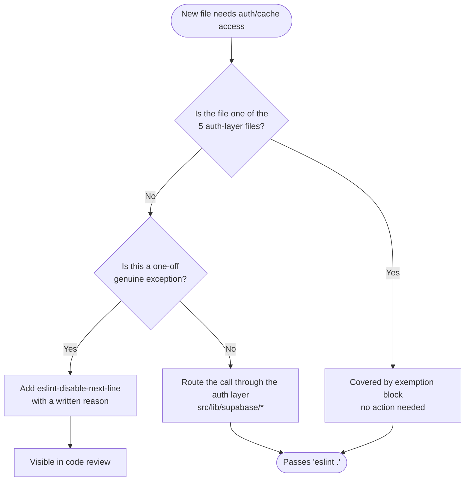

How the ozeaon-v2 codebase enforces type safety, code style, and architectural boundaries through TypeScript compiler settings and a modular ESLint flat configuration.

## Purpose and Scope

This page documents the **static-analysis and coding-standards layer** of ozeaon-v2: the TypeScript compiler configuration that governs type checking, the ESLint flat config that composes framework presets with project-specific rule modules, and the custom rule sets that encode architectural boundaries (import ordering, cache access, and the auth layer funnel).

This page intentionally stays inside that boundary:

- It documents **what rules exist and why they exist** — it does not document how to run individual features or how the application is deployed.
- The rules here reference application modules such as `@/lib/supabase/*`. For the runtime behavior of those modules, see the Supabase/data-access pages.
- For build/tooling pipeline details beyond linting and formatting, see the build & deployment page.

## Overview

ozeaon-v2 is a Next.js (App Router) application written in TypeScript. Rather than a single monolithic `.eslintrc`, the project uses the **ESLint 9 flat-config format** (`eslint.config.mjs`) and splits project-specific rules into small, purpose-named modules:

| Module | Responsibility |
|--------|----------------|
| `eslint.rules.base.mjs` | Core JS/TS/React rule overrides and Tailwind class validation |
| `eslint.rules.import.mjs` | Import ordering and module-resolution conventions |
| `eslint.rules.cache.mjs` | `no-restricted-syntax` selectors that constrain cache access patterns |
| `eslint.rules.auth.mjs` | `no-restricted-syntax` selectors that funnel auth access through a single layer |
| `eslint.rules.logging.mjs` | Logging conventions applied only to `src/**` TypeScript files |

This decomposition is the central design decision of the standards layer: **rules are grouped by concern, not by severity or by file type.** Each module is a plain ES module exporting a rules object, which the root config spreads into scoped config blocks.

Key terminology used throughout this page:

- **Flat config** — ESLint 9's array-of-config-objects format, where each object can carry `files`, `ignores`, `plugins`, `settings`, and `rules`.
- **Selector rule** — `no-restricted-syntax` used with AST selector strings (exported as arrays from `eslint.rules.cache.mjs` and `eslint.rules.auth.mjs`) to ban specific syntactic constructs.
- **The auth funnel** — the architectural rule that all auth access must be routed through a small, explicitly-listed set of files, with all other files banned from bypassing it.

## Architecture

The configuration is assembled in `eslint.config.mjs` by concatenating framework presets and then layering project rule blocks. Order matters: later objects override earlier ones, and the final exemption block deliberately re-enables restricted syntax for the auth layer.



**Why this shape?** Two reasons are visible in the config source:

1. **Preset-first composition.** `defineConfig` receives the spread presets first (`...nextVitals`, `...nextTs`), so project rules always win over framework defaults without needing explicit overrides of every inherited rule.
2. **Prettier reconciliation.** `prettierRecommended` is imported from `eslint-config-prettier/flat` — the flat-config entry point — so that stylistic rules that conflict with Prettier are disabled automatically, letting `prettier -c src` be the single source of truth for formatting.



The commentary embedded in the config makes the ordering requirement explicit — the exemption block *must* stay after the selector block, because the exemptions switch off `no-restricted-syntax` for the files that the selectors otherwise constrain.

> Source: [eslint.config.mjs](https://github.com/ozeaon/ozeaon-v2/blob/0a4f1a95824db87782f1221a4108019d174df3d9/eslint.config.mjs#L58-L73)

The config also pins the React version rather than relying on auto-detection, which keeps `react/*` and `react-hooks/*` rule behavior deterministic across environments.

> Source: [eslint.config.mjs](https://github.com/ozeaon/ozeaon-v2/blob/0a4f1a95824db87782f1221a4108019d174df3d9/eslint.config.mjs#L16-L22)

## TypeScript Compiler Configuration

Type checking is governed by `tsconfig.json`. The settings below are the ones with the most direct effect on day-to-day coding standards.

| Option | Value | Effect on coding standards |
|--------|-------|----------------------------|
| `strict` | `true` | Enables the full strict family (`strictNullChecks`, `noImplicitAny`, `strictFunctionTypes`, …). Nullability must be handled explicitly. |
| `noEmit` | `true` | TypeScript is used purely as a checker; Next.js/SWC handles transpilation. |
| `isolatedModules` | `true` | Every file must be independently transpilable — type-only re-exports must use `export type`. |
| `moduleDetection` | `"force"` | All files are treated as modules, so top-level `import`/`export` semantics are uniform. |
| `moduleResolution` | `"bundler"` | Resolution matches modern bundlers; enables `paths` aliasing without extension juggling. |
| `forceConsistentCasingInFileNames` | `true` | Import casing must match the file on disk exactly. |
| `allowJs` | `true` | `.js`/`.mjs` files (including the ESLint rule modules) participate in the project graph. |
| `skipLibCheck` | `true` | Declaration files from dependencies are not re-checked — a build-speed trade-off. |
| `target` | `"ES2017"` | Emit/syntax floor for the project. |
| `jsx` | `"react-jsx"` | React 17+ automatic JSX runtime; no `React` import required in `.tsx`. |
| `paths` | `@/* → ./src/*` | The single path alias used throughout the codebase and mirrored by ESLint import groups. |

> Source: [tsconfig.json](https://github.com/ozeaon/ozeaon-v2/blob/0a4f1a95824db87782f1221a4108019d174df3d9/tsconfig.json#L1-L36)

### The `@/*` Alias and Code Organization

`paths` maps exactly one alias, `@/*`, to `./src/*`. This is significant for the coding standards because it constrains import conventions: internal imports should be written as `@/components/...`, `@/lib/...`, `@/hooks/...`, `@/utils/...`, and `@/types/...` — the same prefixes that `eslint.rules.import.mjs` groups into the `internal` import bucket.

### Scope Boundaries

`tsconfig.json` includes `next-env.d.ts`, `cloudflare-env.d.ts`, and all `**/*.ts` / `**/*.tsx`, plus Next.js-generated type folders. It excludes `node_modules`, `.next`, `.open-next`, and — notably — **`supabase/**`**.

That exclusion is deliberate: the `supabase/` directory contains Edge Function sources and migration assets that are not part of the Next.js application's type graph. ESLint mirrors this choice via `globalIgnores` on `supabase/functions/*`, `supabase/.branches/*`, `supabase/.temp/*`, and `supabase/.snippets/*`.

> Source: [tsconfig.json](https://github.com/ozeaon/ozeaon-v2/blob/0a4f1a95824db87782f1221a4108019d174df3d9/tsconfig.json#L27-L35)

## Base Rules Module

`eslint.rules.base.mjs` is the default export of a plain object of rule configurations. It is spread into the third project config block alongside the Tailwind plugin registration.

> Source: [eslint.config.mjs](https://github.com/ozeaon/ozeaon-v2/blob/0a4f1a95824db87782f1221a4108019d174df3d9/eslint.config.mjs#L23-L29)

### Tailwind Class Validation

The first rule wires `eslint-plugin-better-tailwindcss` to the project's Tailwind entry point so that class names in JSX are validated against the real stylesheet:

```javascript
"better-tailwindcss/no-unknown-classes": [
  "error",
  {
    entryPoint: "src/styles/globals.css",
    ignore: [
      "article-content-section",
      "scroll-border-left",
      "bn-heading",
      "prose",
      "toaster",
      "toast",
      "next-error-h1",
      "g_id_signin",
      "collapsible-area",
      "collapsible-content",
      "transition-3s",
    ],
  },
],
```

> Source: [eslint.rules.base.mjs](https://github.com/ozeaon/ozeaon-v2/blob/0a4f1a95824db87782f1221a4108019d174df3d9/eslint.rules.base.mjs#L2-L20)

**Design intent.** By pointing `entryPoint` at `src/styles/globals.css`, the rule can resolve Tailwind v4 utility classes from the actual CSS source rather than a static list — so a typo like `flexx` fails lint. The `ignore` array is the escape hatch for class names that are *not* Tailwind utilities: prose classes from typography, third-party widget hooks (`g_id_signin` from Google Identity Services, `toaster`/`toast` from a toast library), and custom semantic hooks (`article-content-section`, `collapsible-area`, `transition-3s`). Keeping this list short and explicit prevents the rule from decaying into a no-op.

### React Rule Adjustments

```javascript
"react/no-unescaped-entities": "off",
"react-hooks/exhaustive-deps": "off",
"react-hooks/set-state-in-effect": "off",
```

> Source: [eslint.rules.base.mjs](https://github.com/ozeaon/ozeaon-v2/blob/0a4f1a95824db87782f1221a4108019d174df3d9/eslint.rules.base.mjs#L21-L23)

These three are switched **off**, which is itself a statement of coding standards:

- `react/no-unescaped-entities` — disabled because the app renders prose/article content where apostrophes and quotes are common; escaping them would hurt readability without preventing real bugs.
- `react-hooks/exhaustive-deps` — disabled deliberately, meaning dependency arrays are **author-controlled**. This is a trade-off: it avoids spurious re-render loops and effect churn in a data-driven app, but it places the correctness burden on the reviewer.
- `react-hooks/set-state-in-effect` — disabled, allowing the "sync server state into local state" pattern inside effects.

Because exhaustive-deps is off, any code review of hooks must manually verify dependency arrays. This is the single most important practical consequence of the base rules module.

### TypeScript Rule Choices

```javascript
"no-unused-vars": "off", // "off" because we use the typescript version below
"@typescript-eslint/no-unused-vars": [
  "error",
  { argsIgnorePattern: "^_", varsIgnorePattern: "^_" },
],
"@typescript-eslint/no-empty-object-type": "off",
"@typescript-eslint/no-explicit-any": "error",
```

> Source: [eslint.rules.base.mjs](https://github.com/ozeaon/ozeaon-v2/blob/0a4f1a95824db87782f1221a4108019d174df3d9/eslint.rules.base.mjs#L24-L30)

Two conventions follow directly from this block:

1. **The `_` prefix convention.** The core `no-unused-vars` is disabled in favor of the TypeScript-aware version, which is configured with `argsIgnorePattern: "^_"` and `varsIgnorePattern: "^_"`. Unused function arguments or variables are therefore *permitted only when prefixed with an underscore* — this is the sanctioned way to satisfy interface signatures and destructuring that intentionally drops values.
2. **`any` is banned, empty object types are allowed.** `@typescript-eslint/no-explicit-any` is set to `"error"`, making explicit `any` a lint failure — the strictest commonly-used setting short of banning implicit `any` patterns. Conversely, `no-empty-object-type` is turned off, allowing `{}`-shaped placeholder types (common with generic defaults and React prop placeholders).

## Import Rules Module

`eslint.rules.import.mjs` currently defines a single substantive rule plus one disabling override.

```javascript
"import/order": [
  "off",
  {
    groups: ["external", "builtin", "internal", "sibling", "parent", "index"],
    pathGroups: [
      { pattern: "@/components", group: "internal" },
      { pattern: "@/hooks", group: "internal" },
      { pattern: "@/lib", group: "internal" },
      { pattern: "@/utils", group: "internal" },
      { pattern: "@/types", group: "internal", position: "after" },
    ],
    pathGroupsExcludedImportTypes: ["internal"],
    alphabetize: { order: "asc", caseInsensitive: true },
  },
],
"import/no-anonymous-default-export": "off",
```

> Source: [eslint.rules.import.mjs](https://github.com/ozeaon/ozeaon-v2/blob/0a4f1a95824db87782f1221a4108019d174df3d9/eslint.rules.import.mjs#L2-L17)

**Important nuance:** the rule's *severity* is `"off"` while the options object is fully specified. This means import ordering is **documented as a convention but not currently enforced by lint**. The configured intent is nevertheless clear and is worth following:

| Import group | Meaning in this project |
|--------------|-------------------------|
| `external` | Third-party packages (`react`, `next`, …) |
| `builtin` | Node built-ins |
| `internal` | Aliased imports (`@/*`) |
| `sibling` | `./file` |
| `parent` | `../file` |
| `index` | `./` |

Within the `internal` group, `@/types` is the only path group with an explicit `position: "after"`, meaning type imports are meant to sort last. Alphabetization is ascending and case-insensitive.

`import/no-anonymous-default-export` is switched off so that default-exported objects (the pattern used by every `eslint.rules.*.mjs` module, and common for Next.js page config objects) are permitted.

## Scoped Rule Application

Not every rule applies to every file. The config uses `files` globs to scope behavior, which is how the standards layer differentiates application code from infrastructure code.

| Config block | `files` glob | Rules applied |
|--------------|--------------|---------------|
| Logging | `src/**/*.ts`, `src/**/*.tsx` | `loggingRules` |
| Private routes | `src/app/**/(private)/**/*.tsx` | `no-restricted-imports` banning `@/lib/supabase/public` |
| Selectors | `src/**/*.ts`, `src/**/*.tsx` | `no-restricted-syntax` with cache + auth selectors |
| Auth exemptions | 5 explicit file paths | `no-restricted-syntax: off`, `no-restricted-imports: off` |

> Source: [eslint.config.mjs](https://github.com/ozeaon/ozeaon-v2/blob/0a4f1a95824db87782f1221a4108019d174df3d9/eslint.config.mjs#L30-L73)

### The Private-Route Supabase Ban

```javascript
{
  files: ["src/app/**/(private)/**/*.tsx"],
  rules: {
    "no-restricted-imports": [
      "error",
      {
        paths: [
          {
            name: "@/lib/supabase/public",
            message: "Use createClient() in private routes.",
          },
        ],
      },
    ],
  },
}
```

> Source: [eslint.config.mjs](https://github.com/ozeaon/ozeaon-v2/blob/0a4f1a95824db87782f1221a4108019d174df3d9/eslint.config.mjs#L36-L51)

This is a **security-oriented architectural rule**. Any component under `src/app/**/(private)/` — the authenticated route segment — is forbidden from importing the public Supabase client module. The error message is prescriptive rather than descriptive: it tells the developer exactly the correct alternative (`createClient()`). The rationale is that the public client uses the anonymous key and relies on Row Level Security, while private routes should use the request-scoped server client so that the user's session and identity propagate to the database. This directly links the coding-standards layer to the application's authorization model.

### The Auth Funnel and Its Exemptions

The selector block applies `no-restricted-syntax` with selectors merged from the cache and auth modules:

```javascript
{
  files: ["src/**/*.ts", "src/**/*.tsx"],
  rules: {
    "no-restricted-syntax": ["error", ...cacheSelectors, ...authSelectors],
  },
},
```

> Source: [eslint.config.mjs](https://github.com/ozeaon/ozeaon-v2/blob/0a4f1a95824db87782f1221a4108019d174df3d9/eslint.config.mjs#L52-L57)

The exemption block then re-enables those constructs for exactly five files:

```javascript
{
  // Must stay after the block above: this is the auth layer those selectors
  // funnel everything else into. Anywhere else needing a one-off exception
  // uses an inline eslint-disable-next-line with a reason, not this list.
  files: [
    "src/lib/supabase/queries/auth.ts",
    "src/lib/supabase/queries/reactions.ts",
    "src/lib/supabase/middleware.ts",
    "src/lib/supabase/actions.ts",
    "src/lib/supabase/auth.ts",
  ],
  rules: {
    "no-restricted-syntax": "off",
    "no-restricted-imports": "off",
  },
},
```

> Source: [eslint.config.mjs](https://github.com/ozeaon/ozeaon-v2/blob/0a4f1a95824db87782f1221a4108019d174df3d9/eslint.config.mjs#L58-L73)

This is the most architecturally significant part of the standards layer, and the inline comment states the policy directly:

- The five listed files **are** the auth layer. Selectors exist to funnel every other module into them.
- The exemption list is intentionally **closed**. Adding a file here is an architectural decision, not a convenience.
- Escape hatches elsewhere must be **inline** `eslint-disable-next-line` comments **with a written reason**, making each exception visible at the call site in code review.

Enforcing this in lint rather than in documentation means the boundary cannot silently erode: a new file that tries to bypass the auth layer fails CI at `pnpm lint`.

## Core Flow: How a Standards Change Travels Through CI

The following sequence shows what happens when a developer writes code and the standards layer evaluates it. It reflects the actual execution order of `eslint.config.mjs` and the `package.json` scripts.



The ordering in this diagram is not incidental — it is the mandated order from the config's `defineConfig` array, and the auth-exemption step must come last among the rule blocks so that it wins.

## Usage Examples

### Running Lint and Format Checks

The standards layer is driven entirely by `package.json` scripts:

```json
"lint": "eslint .",
"lint:fix": "eslint . --fix",
"format:check": "prettier -c src",
"format": "prettier -w -c src",
```

> Source: [package.json](https://github.com/ozeaon/ozeaon-v2/blob/0a4f1a95824db87782f1221a4108019d174df3d9/package.json#L10-L13)

Note the asymmetry that reflects the guardrails: `lint` runs across the whole repository (`.`), while the Prettier scripts are scoped to `src`. This matches the ESLint `globalIgnores` list, which excludes build outputs, `.claude/**`, and `supabase/**` from linting while leaving configuration files at the repository root subject to lint.

### Auto-Formatting Generated Database Types

The `db:types` script is a concrete example of the standards layer being applied to generated code:

```json
"db:types": "supabase gen types typescript --local > src/types/supabase.ts && prettier --write src/types/supabase.ts",
```

> Source: [package.json](https://github.com/ozeaon/ozeaon-v2/blob/0a4f1a95824db87782f1221a4108019d174df3d9/package.json#L24)

**Design intent.** Generated types are committed to the repository and consumed through the `@/types` alias, so they must satisfy the same formatting standard as hand-written code. Running `prettier --write` immediately after generation guarantees the generated file never produces a spurious `format:check` failure on the next CI run. This is a small but important detail: automation that generates code must also normalize that code, otherwise developers learn to ignore formatting failures.

### Composing a New Rule Module

The established pattern for adding scoped rules is to create a new `eslint.rules.<concern>.mjs` module exporting a default object, then spread it into a `files`-scoped block in `eslint.config.mjs`. This mirrors how `loggingRules` is applied:

```javascript
import loggingRules from "./eslint.rules.logging.mjs";

// ...

{
  files: ["src/**/*.ts", "src/**/*.tsx"],
  rules: {
    ...loggingRules,
  },
},
```

> Source: [eslint.config.mjs](https://github.com/ozeaon/ozeaon-v2/blob/0a4f1a95824db87782f1221a4108019d174df3d9/eslint.config.mjs#L10-L35)

The import-ordering module follows the same shape but exports a flat object rather than being spread alongside a plugin registration:

```javascript
import baseRules from "./eslint.rules.base.mjs";
import cacheSelectors from "./eslint.rules.cache.mjs";
import importRules from "./eslint.rules.import.mjs";
import authSelectors from "./eslint.rules.auth.mjs";
import loggingRules from "./eslint.rules.logging.mjs";
```

> Source: [eslint.config.mjs](https://github.com/ozeaon/ozeaon-v2/blob/0a4f1a95824db87782f1221a4108019d174df3d9/eslint.config.mjs#L6-L10)

**Convention to follow when extending:** one module per concern, default-exported object, imported at the top of `eslint.config.mjs`, and applied via a block whose `files` glob is as narrow as the concern allows. Selector arrays (used with `no-restricted-syntax`) are spread into the shared selector block rather than given their own block, because they intentionally share a single exemption list.

## Tooling and Dependency Graph

The standards layer is versioned as part of the application's dependency set, which means rule behavior is reproducible per lockfile.

| Package | Declared version | Role |
|---------|------------------|------|
| `eslint` | `^9.39.5` | Flat-config-capable linter |
| `eslint-config-next` | `16.3.5` | `core-web-vitals` and `typescript` presets |
| `@next/eslint-plugin-next` | `^16.3.5` | Next.js-specific rules |
| `typescript-eslint` | `^8.70.0` | TypeScript rule set (`@typescript-eslint/*`) |
| `eslint-config-prettier` | `^10.1.8` | Turns off rules conflicting with Prettier |
| `eslint-plugin-better-tailwindcss` | `^4.7.0` | Tailwind class validation |
| `prettier` | `^3.9.6` | Formatter |
| `prettier-plugin-tailwindcss` | `^0.8.1` | Sorts Tailwind classes during formatting |
| `postcss` | `^8.5.28` | CSS pipeline |
| `tailwindcss` | `^4.3.3` | Tailwind v4 |
| `typescript` | `npm:@typescript/typescript6@^6.0.2` | Aliased TypeScript distribution |

> Sources:
> - [package.json](https://github.com/ozeaon/ozeaon-v2/blob/0a4f1a95824db87782f1221a4108019d174df3d9/package.json#L75-L116)
> - [package.json](https://github.com/ozeaon/ozeaon-v2/blob/0a4f1a95824db87782f1221a4108019d174df3d9/package.json#L120-L122)

Two details worth highlighting:

- **TypeScript is an npm alias.** `"typescript": "npm:@typescript/typescript6@^6.0.2"` installs a specific distribution under the standard `typescript` name. Tooling that resolves `typescript` (including `typescript-eslint` and `tsc`) therefore transparently picks it up.
- **`prettier-plugin-tailwindcss` complements the Tailwind lint rule.** The plugin *sorts* class strings during `prettier -w`, while `better-tailwindcss/no-unknown-classes` *validates* them during `eslint .`. Together they cover the two failure modes for utility classes: wrong order and wrong name.

## Configuration Options

### ESLint Flat Config Surface

| Option | Location | Value | Effect |
|--------|----------|-------|--------|
| `settings.react.version` | config block | `"19"` | Pins React ruleset to v19 instead of auto-detecting |
| `files` (logging) | config block | `src/**/*.ts`, `src/**/*.tsx` | Limits logging rules to application TypeScript |
| `files` (private routes) | config block | `src/app/**/(private)/**/*.tsx` | Applies the Supabase public-client import ban |
| `files` (selectors) | config block | `src/**/*.ts`, `src/**/*.tsx` | Applies cache + auth `no-restricted-syntax` selectors |
| `files` (exemptions) | config block | 5 explicit `src/lib/supabase/*` paths | Disables `no-restricted-syntax` and `no-restricted-imports` |
| `globalIgnores` | config block | 14 path patterns | Excludes build output, `.claude`, generated `.d.ts`, and `supabase/*` subdirs |

> Source: [eslint.config.mjs](https://github.com/ozeaon/ozeaon-v2/blob/0a4f1a95824db87782f1221a4108019d174df3d9/eslint.config.mjs#L16-L90)

### Rule Severity Summary

| Rule | Severity | Configured options |
|------|----------|--------------------|
| `better-tailwindcss/no-unknown-classes` | `error` | `entryPoint: src/styles/globals.css`, 11 ignored classes |
| `react/no-unescaped-entities` | `off` | — |
| `react-hooks/exhaustive-deps` | `off` | — |
| `react-hooks/set-state-in-effect` | `off` | — |
| `no-unused-vars` | `off` | Superseded by the TypeScript variant |
| `@typescript-eslint/no-unused-vars` | `error` | `argsIgnorePattern: ^_`, `varsIgnorePattern: ^_` |
| `@typescript-eslint/no-empty-object-type` | `off` | — |
| `@typescript-eslint/no-explicit-any` | `error` | — |
| `import/order` | `off` | Full group/pathGroup/alphabetize config retained |
| `import/no-anonymous-default-export` | `off` | — |
| `no-restricted-imports` (private routes) | `error` | Bans `@/lib/supabase/public` |
| `no-restricted-syntax` (src) | `error` | Cache selectors + auth selectors |
| `no-restricted-syntax` (5 auth files) | `off` | — |
| `no-restricted-imports` (5 auth files) | `off` | — |

> Sources:
> - [eslint.config.mjs](https://github.com/ozeaon/ozeaon-v2/blob/0a4f1a95824db87782f1221a4108019d174df3d9/eslint.config.mjs#L36-L73)
> - [eslint.rules.base.mjs](https://github.com/ozeaon/ozeaon-v2/blob/0a4f1a95824db87782f1221a4108019d174df3d9/eslint.rules.base.mjs#L1-L31)
> - [eslint.rules.import.mjs](https://github.com/ozeaon/ozeaon-v2/blob/0a4f1a95824db87782f1221a4108019d174df3d9/eslint.rules.import.mjs#L1-L18)
> - [tsconfig.json](https://github.com/ozeaon/ozeaon-v2/blob/0a4f1a95824db87782f1221a4108019d174df3d9/tsconfig.json#L1-L36)

### Path Ignores

`globalIgnores` covers, in order: `.claude/**`, `.next/**`, `out/**`, `build/**`, `dist/**`, `node_modules/**`, `.turbo/**`, `.cache/**`, `.open-next/**`, `.wrangler/**`, `*.d.ts`, `supabase/functions/*`, `supabase/.branches/*`, `supabase/.temp/*`, `supabase/.snippets/*`.

Notable entries: `.open-next/**` and `.wrangler/**` indicate the app deploys to Cloudflare via OpenNext; `*.d.ts` excludes all ambient declaration files, which is why `next-env.d.ts` and `cloudflare-env.d.ts` are type-checked by `tsc` but not linted.

> Source: [eslint.config.mjs](https://github.com/ozeaon/ozeaon-v2/blob/0a4f1a95824db87782f1221a4108019d174df3d9/eslint.config.mjs#L74-L90)

## Failure Modes, Edge Cases & Enforcement Gaps

Because several rules are intentionally disabled, the standards layer has *deliberate* blind spots. Understanding them is as important as knowing which rules are active.

### Deliberate Enforcement Gaps

| Gap | Cause | Practical consequence |
|-----|-------|----------------------|
| Hook dependency correctness is unchecked | `react-hooks/exhaustive-deps: "off"` | Stale-closure and missing-dependency bugs will not be caught by lint; must be verified in review. |
| Import order is not enforced | `import/order: "off"` while options are configured | Inconsistent import ordering passes CI. The configured grouping still serves as the written convention. |
| Tailwind class drift is partially unverified | 11 classes in `ignore` | If one of the ignored names is genuinely deleted from the stylesheet, lint will not report it. The ignore list must be pruned manually. |
| Anonymous default exports are allowed | `import/no-anonymous-default-export: "off"` | Rule modules and config objects may be exported inline, reducing named-symbol traceability. |
| Empty object types are allowed | `@typescript-eslint/no-empty-object-type: "off"` | `{}` placeholder types pass lint; they can hide an intended-but-forgotten shape. |

> Sources:
> - [eslint.rules.base.mjs](https://github.com/ozeaon/ozeaon-v2/blob/0a4f1a95824db87782f1221a4108019d174df3d9/eslint.rules.base.mjs#L2-L30)
> - [eslint.rules.import.mjs](https://github.com/ozeaon/ozeaon-v2/blob/0a4f1a95824db87782f1221a4108019d174df3d9/eslint.rules.import.mjs#L2-L17)

### Ordering Hazards in the Config

The config's correctness depends on **array order**, which is a genuine edge case for maintainers:

- If the auth-exemption block is moved *before* the selector block, the exemptions are silently overwritten and the five auth-layer files suddenly fail lint with banned-syntax errors. The in-source comment on the exemption block anticipates exactly this mistake.
- Any new `files`-scoped rule block appended after the exemption block for overlapping globs will take precedence over it for those files.

> Source: [eslint.config.mjs](https://github.com/ozeaon/ozeaon-v2/blob/0a4f1a95824db87782f1221a4108019d174df3d9/eslint.config.mjs#L58-L73)

### The "Ignore List" Anti-Pattern Guard

The exemption list is the one place where the codebase's architectural boundary could erode. Two mechanisms limit that risk:

1. **The list is short and enumerated at the top level of the config**, so any addition is visible in a diff of `eslint.config.mjs` — it cannot be buried in a source file.
2. **The comment explicitly redirects one-off needs to inline disables with reasons**, which keeps the architectural list authoritative and pushes temporary exceptions into the code where reviewers see them next to the offending line.



### Type-Safety Edge Cases

- `skipLibCheck: true` means a type error originating inside a dependency's `.d.ts` will not fail the project build. Errors in *your usage* of those types still surface.
- `strict: true` combined with `@typescript-eslint/no-explicit-any: "error"` means there is no lint-sanctioned escape hatch to `any`. The idiomatic workarounds are `unknown` with narrowing, or an explicitly typed cast — not `any`.
- `isolatedModules: true` requires `export type { … }` for type-only re-exports; using a value-style export for a type will fail the checker.
- `forceConsistentCasingInFileNames: true` makes casing mismatches a hard error, which matters on case-insensitive developer filesystems that would otherwise let a wrong-case import through.

> Source: [tsconfig.json](https://github.com/ozeaon/ozeaon-v2/blob/0a4f1a95824db87782f1221a4108019d174df3d9/tsconfig.json#L2-L26)

## Extension Points

The standards layer is designed to be extended in four specific, low-risk ways.

### 1. Adding a New Rule Module

Create `eslint.rules.<concern>.mjs` with a default-exported object, import it in `eslint.config.mjs`, and spread it into a `files`-scoped block. Follow the existing naming convention exactly (`eslint.rules.base.mjs`, `eslint.rules.import.mjs`, `eslint.rules.cache.mjs`, `eslint.rules.auth.mjs`, `eslint.rules.logging.mjs`).

### 2. Adding Selectors to the Shared Selector Block

Cache and auth selectors share one `no-restricted-syntax` invocation via spread (`...cacheSelectors, ...authSelectors`). New selector groups should be exported as arrays and spread into the same block **only if** they should share the auth-layer exemption list; otherwise give them a separate `files`-scoped block.

> Source: [eslint.config.mjs](https://github.com/ozeaon/ozeaon-v2/blob/0a4f1a95824db87782f1221a4108019d174df3d9/eslint.config.mjs#L52-L57)

### 3. Tuning Tailwind Class Allowances

Add non-Tailwind class names to the `ignore` array of `better-tailwindcss/no-unknown-classes` in `eslint.rules.base.mjs`. This is the correct place for third-party widget hooks and custom semantic classes.

> Source: [eslint.rules.base.mjs](https://github.com/ozeaon/ozeaon-v2/blob/0a4f1a95824db87782f1221a4108019d174df3d9/eslint.rules.base.mjs#L6-L18)

### 4. Scoping Rules by Route Segment

The private-route block demonstrates how to attach a rule to a route segment via glob. The same technique extends the standards to any new route boundary:

```javascript
files: ["src/app/**/(private)/**/*.tsx"],
```

> Source: [eslint.config.mjs](https://github.com/ozeaon/ozeaon-v2/blob/0a4f1a95824db87782f1221a4108019d174df3d9/eslint.config.mjs#L37)

## Performance & Operational Notes

- **`lint:fix` vs manual fixes.** `eslint . --fix` auto-resolves the automatically-fixable subset. Because `better-tailwindcss/no-unknown-classes` is a validation rule (not a fixer), unknown classes must be corrected by hand — the fixer exists in `prettier-plugin-tailwindcss` for ordering, not naming.
- **Prettier scope is narrower than lint scope.** `prettier -c src` covers only `src`, so root-level config files and `scripts/` are not format-checked. Changes to those files rely on lint and review rather than the formatter.
- **Formatters and linters are reconciled, not overlapping.** Because `eslint-config-prettier/flat` is in the array, no stylistic ESLint rule will fight Prettier. New stylistic concerns should be configured in Prettier (or a Prettier plugin) rather than added as ESLint rules.
- **Generated types are normalized inline.** Committing `src/types/supabase.ts` and running `prettier --write` on it as part of `db:types` keeps generated code inside the same standard without manual intervention.
- **Whole-repo linting cost.** `eslint .` plus `globalIgnores` means lint time scales with `src` and root config files, not with build artifacts — the ignore list is doing real performance work, not just noise suppression.

> Sources:
> - [package.json](https://github.com/ozeaon/ozeaon-v2/blob/0a4f1a95824db87782f1221a4108019d174df3d9/package.json#L10-L24)
> - [eslint.config.mjs](https://github.com/ozeaon/ozeaon-v2/blob/0a4f1a95824db87782f1221a4108019d174df3d9/eslint.config.mjs#L74-L90)

## Coding Standards at a Glance

The following table is a condensed, actionable summary of every convention encoded in the configuration:

| Convention | Enforced? | Where defined |
|-----------|-----------|---------------|
| No explicit `any` | Yes (`error`) | `eslint.rules.base.mjs` |
| Unused vars/args must be `_`-prefixed | Yes (`error`) | `eslint.rules.base.mjs` |
| All Tailwind classes must exist in `globals.css` (except ignored list) | Yes (`error`) | `eslint.rules.base.mjs` |
| Private routes must not use `@/lib/supabase/public` | Yes (`error`) | `eslint.config.mjs` |
| Cache and auth access must funnel through `src/lib/supabase/*` | Yes (`error`) | `eslint.config.mjs` + rule modules |
| Exceptions require inline disable **with a reason** | Policy | `eslint.config.mjs` comment |
| Internal imports use the `@/*` alias | Convention | `tsconfig.json` `paths` |
| Type imports (`@/types`) sort last | Convention (rule off) | `eslint.rules.import.mjs` |
| Nullability handled explicitly | Yes | `tsconfig.json` `strict` |
| Type-only re-exports use `export type` | Yes | `tsconfig.json` `isolatedModules` |
| Import casing matches filesystem | Yes | `tsconfig.json` `forceConsistentCasingInFileNames` |
| Prettier is the formatting authority | Yes | `prettierRecommended` + `format:check` |

## Related Links

- Source files:
  - [eslint.config.mjs](https://github.com/ozeaon/ozeaon-v2/blob/0a4f1a95824db87782f1221a4108019d174df3d9/eslint.config.mjs)
  - [eslint.rules.base.mjs](https://github.com/ozeaon/ozeaon-v2/blob/0a4f1a95824db87782f1221a4108019d174df3d9/eslint.rules.base.mjs)
  - [eslint.rules.import.mjs](https://github.com/ozeaon/ozeaon-v2/blob/0a4f1a95824db87782f1221a4108019d174df3d9/eslint.rules.import.mjs)
  - [tsconfig.json](https://github.com/ozeaon/ozeaon-v2/blob/0a4f1a95824db87782f1221a4108019d174df3d9/tsconfig.json)
  - [package.json](https://github.com/ozeaon/ozeaon-v2/blob/0a4f1a95824db87782f1221a4108019d174df3d9/package.json)
- Related catalog topics:
  - Supabase data access and the auth layer (`src/lib/supabase/*`, `src/types/supabase.ts`) — referenced by the auth funnel and the `@/types` alias
  - Application routes and the `(private)` route segment — the scope of the Supabase public-client import ban
  - Build and deployment — where `eslint .` and `prettier -c src` run in CI, and why `.open-next`/`.wrangler` are ignored
  - Tailwind styling and `src/styles/globals.css` — the entry point used by the class-validation rule
