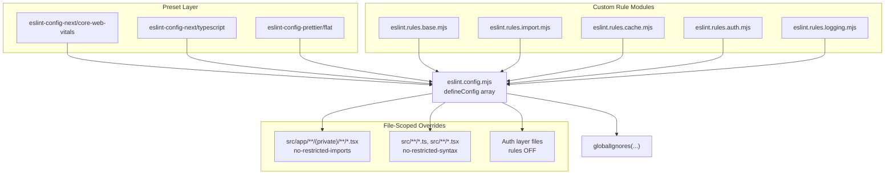

The repository enforces coding conventions through a composed ESLint flat config, Prettier formatting, and a set of custom rule modules that encode architectural invariants — authentication access, caching model, logging, and Tailwind usage. This page covers the static-analysis layer: the config structure, each custom module's purpose, and the gotchas that come from composing them. For the runtime implementations they constrain, see [Logging & Observability](../../operations/logging-observability/) and [Supabase Client Patterns](../../architecture/supabase-client-patterns/).

## Overview

| Convention | Enforced By | Rationale |
|-----------|-------------|-----------|
| No direct `supabase.auth.getUser()` / `getSession()` | `eslint.rules.auth.mjs` | Funnels auth reads through vetted helpers so validation and redirect logic is never bypassed |
| No `console.*` logging | `eslint.rules.logging.mjs` | All logging must go through LogTape-backed helpers |
| No unknown Tailwind classes | `eslint.rules.base.mjs` | Catches typos by checking classes against `src/styles/globals.css` |
| No `any`; underscore-prefixed unused vars allowed | `eslint.rules.base.mjs` | Strict typing with an escape hatch for intentionally-unused bindings |
| Private routes must not import the public Supabase client | `eslint.config.mjs` (`no-restricted-imports`) | Prevents cookie-less clients leaking into authenticated surfaces |
| No `force-dynamic`, `force-static`, `"use cache"`, `cacheTag`, `cacheLife`, `updateTag` | `eslint.rules.cache.mjs` | Project does not support `cacheComponents` yet |
| `import/order` | `eslint.rules.import.mjs` | Configured but set to `"off"` — import ordering is not enforced |

## Architecture



The ordering in the exported array is semantically important. Presets establish the baseline, then custom rule modules layer on top, then file-scoped overrides, then the auth-layer exception — which **must** come after the restricted-syntax block or the auth layer would fail to lint. Finally, `globalIgnores` excludes build output, generated files, and Supabase internals.

The key composition constraint: `no-restricted-syntax` accepts an array of selectors, so if two modules each exported a `{"no-restricted-syntax": [...]}` rules object and both were spread into one block, the later spread would silently overwrite the earlier one. The `cache` and `auth` modules therefore export **selector arrays**, composed explicitly in [`eslint.config.mjs`](https://github.com/ozeaon/ozeaon-v2/blob/0a4f1a95824db87782f1221a4108019d174df3d9/eslint.config.mjs):

```javascript
{
  files: ["src/**/*.ts", "src/**/*.tsx"],
  rules: {
    "no-restricted-syntax": ["error", ...cacheSelectors, ...authSelectors],
  },
},
```

## Base Rules

[`eslint.rules.base.mjs`](https://github.com/ozeaon/ozeaon-v2/blob/0a4f1a95824db87782f1221a4108019d174df3d9/eslint.rules.base.mjs) bundles the project's core TypeScript, React, and Tailwind conventions:

- **`better-tailwindcss/no-unknown-classes`** — validates class strings against `src/styles/globals.css`. A small ignore list covers third-party classes (`toaster`, `toast`, `g_id_signin`, `next-error-h1`) and custom global classes not discoverable from the entry point (`article-content-section`, `scroll-border-left`, `bn-heading`, `prose`, `collapsible-*`, `transition-3s`). Each ignored entry is a deliberate exception.
- **`@typescript-eslint/no-explicit-any`** is `"error"` — bare `any` is banned project-wide.
- **`@typescript-eslint/no-unused-vars`** allows underscore-prefixed names (`_arg`) to be intentionally unused.
- Several React hooks rules are `"off"` to allow intentional dependency omissions and set-state-in-effect patterns.

## Architectural Invariants: Authentication Read Restrictions

[`eslint.rules.auth.mjs`](https://github.com/ozeaon/ozeaon-v2/blob/0a4f1a95824db87782f1221a4108019d174df3d9/eslint.rules.auth.mjs) bans `supabase.auth.getUser()` and `supabase.auth.getSession()` via AST selectors on member-expression access patterns. The selectors key on property *names*, not on how the client variable is named, so the rule cannot be evaded by renaming the client.

```javascript
export default [
  {
    selector:
      "MemberExpression[object.property.name='auth'][property.name='getUser']",
    message:
      "Use withAuthUser() for route handlers, getAuthUser() for mid-function auth checks, or getAuthUserOrRedirect() in pages — all from @/lib/supabase/queries/auth.",
  },
  {
    selector:
      "MemberExpression[object.property.name='auth'][property.name='getSession']",
    message:
      "Don't read getSession() directly — it returns the UNVALIDATED local JWT. Use useAuth()/useActiveAccount() (SessionProvider) for client session state, or getAuthUser() server-side.",
  },
];
```

The prescribed replacements:

| Context | Approved Helper | Source |
|---------|----------------|--------|
| Route handlers | `withAuthUser()` | `@/lib/supabase/queries/auth` |
| Mid-function server checks | `getAuthUser()` | `@/lib/supabase/queries/auth` |
| Pages | `getAuthUserOrRedirect()` | `@/lib/supabase/queries/auth` |
| Client session state | `useAuth()` / `useActiveAccount()` | `SessionProvider` |

The `getSession` ban is especially important: reading it directly would allow the **unvalidated local JWT** to influence server logic.

## Auth-Layer Exception Contract

The restrictions would be impossible to implement if they applied to the auth module itself. A later `files`-scoped override disables both `no-restricted-syntax` and `no-restricted-imports` for exactly five files (the sanctioned funnel). It **must stay after** the restricted-syntax block — ESLint flat config applies later matching configs over earlier ones. Exceptions outside this list use inline `eslint-disable-next-line` with a reason.

## Caching Model Restrictions

[`eslint.rules.cache.mjs`](https://github.com/ozeaon/ozeaon-v2/blob/0a4f1a95824db87782f1221a4108019d174df3d9/eslint.rules.cache.mjs) bans:

- `export const dynamic = "force-dynamic"` and `"force-static"`
- `"use cache"` directive
- `cacheTag(...)`, `cacheLife(...)`, `updateTag(...)`

All carry the message "Project doesn't support cacheComponents yet." The rendering model today relies on `createClient()`'s internal `cookies()` call as the dynamic signal. Once `cacheComponents` is adopted this ruleset will be relaxed. See [SSR Rendering & Caching](../../architecture/ssr-rendering-and-caching/).

## Private-Route Import Restrictions

Authenticated route segments under `src/app/**/(private)/` are forbidden from importing `@/lib/supabase/public`. This ties the filesystem convention to an enforceable invariant: a private route cannot accidentally render data with an unauthenticated client.

## Logging Convention Enforcement

[`eslint.rules.logging.mjs`](https://github.com/ozeaon/ozeaon-v2/blob/0a4f1a95824db87782f1221a4108019d174df3d9/eslint.rules.logging.mjs) sets `"no-console": "error"` scoped to `src/**/*.ts` and `src/**/*.tsx`. All logging must go through the LogTape-backed helpers documented in [Logging & Observability](../../operations/logging-observability/). Build scripts and config files outside `src/` can still use `console`.

## Tooling Commands

| Script | Purpose |
|--------|---------|
| `pnpm lint` | Lint the whole repository |
| `pnpm lint:fix` | Lint and auto-apply fixable corrections |
| `pnpm check` | Type-check without emitting output (`tsc --noEmit`) |
| `pnpm format` | Write Prettier formatting over `src` |
| `pnpm format:check` | Verify formatting without modifying files |
| `pnpm typegen` | Generate Next.js route types + Cloudflare env types |

ESLint owns code-quality and architectural rules; Prettier owns formatting. `prettierRecommended` in the ESLint config disables any ESLint rule that would fight Prettier. Running `pnpm lint:fix` fixes rule violations but does not reformat; `pnpm format` reformats but does not fix violations — both are needed for a clean tree.

Prettier is also used after type generation: `db:types` pipes `supabase gen types typescript` output through `prettier --write` so the committed artifact matches project style.

## Global Ignores

`globalIgnores` in [`eslint.config.mjs`](https://github.com/ozeaon/ozeaon-v2/blob/0a4f1a95824db87782f1221a4108019d174df3d9/eslint.config.mjs) excludes three categories:

- **Build and tool output:** `.next`, `out`, `build`, `dist`, `.turbo`, `.cache`, `.open-next`, `.wrangler`
- **Generated type declarations:** `*.d.ts`
- **Supabase internals:** `supabase/functions/*` (Deno edge functions), `.branches`, `.temp`, `.snippets`

## Failure Modes & Edge Cases

| Scenario | Behavior | Mitigation |
|----------|----------|------------|
| Two modules target `no-restricted-syntax` | Later spread silently overwrites the earlier array | `auth` and `cache` export selector arrays; `eslint.config.mjs` merges them explicitly |
| Auth-layer exception placed before the restriction block | Restrictions re-enable over the auth layer | The override block is documented as "Must stay after the block above" |
| A new sanctioned auth helper is added elsewhere | It will fail lint | Use `eslint-disable-next-line` with a reason; do not grow the allowlist |
| A legitimate non-Tailwind class is used | `no-unknown-classes` reports an error | Add it to the `ignore` array in `eslint.rules.base.mjs` |
| Developer uses `any` | Lint error | Use a precise type; there is no blanket exemption |
| Intentional unused parameter | Flagged as unused | Name it with a leading underscore (`_arg`) |

## Extension Points

Adding a new project-wide convention follows an established pattern: create `eslint.rules.<concern>.mjs` (plain rule object, or a selector array for `no-restricted-syntax`), import it into `eslint.config.mjs`, compose it into the appropriate block, and add a later `files`-scoped override with a comment if the rule needs an exception for a sanctioned layer. The `ignore` array in `eslint.rules.base.mjs` is the designated extension point for undiscoverable Tailwind classes.

## Related Links

- [Logging & Observability](../../operations/logging-observability/) — LogTape helpers that `no-console` funnels into
- [Supabase Client Patterns](../../architecture/supabase-client-patterns/) — auth helpers banned by `eslint.rules.auth.mjs`
- [SSR Rendering & Caching](../../architecture/ssr-rendering-and-caching/) — caching model behind `eslint.rules.cache.mjs`
- [Adding a Feature](../adding-a-feature/) — how these rules affect the feature development workflow
- [eslint.config.mjs](https://github.com/ozeaon/ozeaon-v2/blob/0a4f1a95824db87782f1221a4108019d174df3d9/eslint.config.mjs), [eslint.rules.base.mjs](https://github.com/ozeaon/ozeaon-v2/blob/0a4f1a95824db87782f1221a4108019d174df3d9/eslint.rules.base.mjs), [eslint.rules.auth.mjs](https://github.com/ozeaon/ozeaon-v2/blob/0a4f1a95824db87782f1221a4108019d174df3d9/eslint.rules.auth.mjs), [eslint.rules.cache.mjs](https://github.com/ozeaon/ozeaon-v2/blob/0a4f1a95824db87782f1221a4108019d174df3d9/eslint.rules.cache.mjs), [eslint.rules.logging.mjs](https://github.com/ozeaon/ozeaon-v2/blob/0a4f1a95824db87782f1221a4108019d174df3d9/eslint.rules.logging.mjs)
