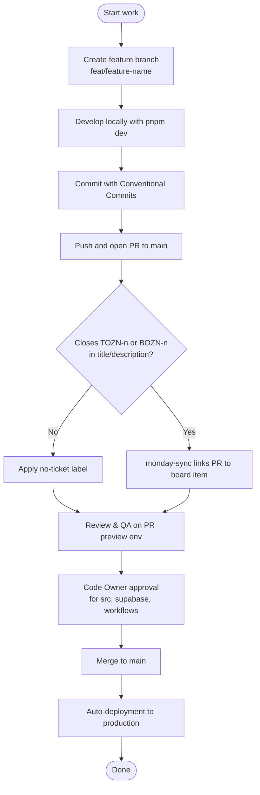
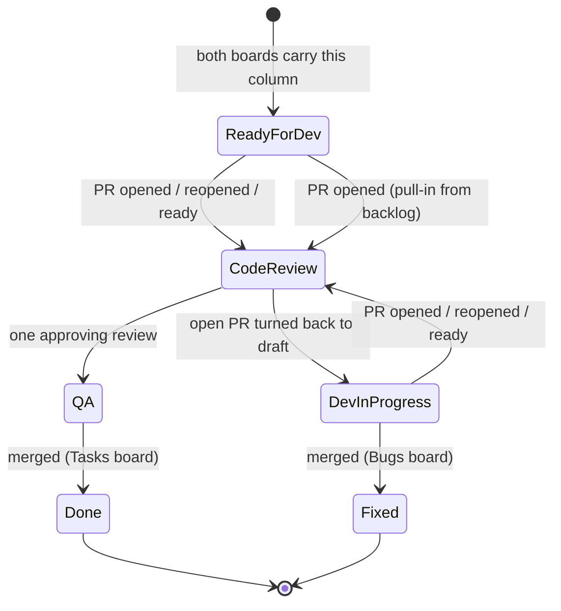
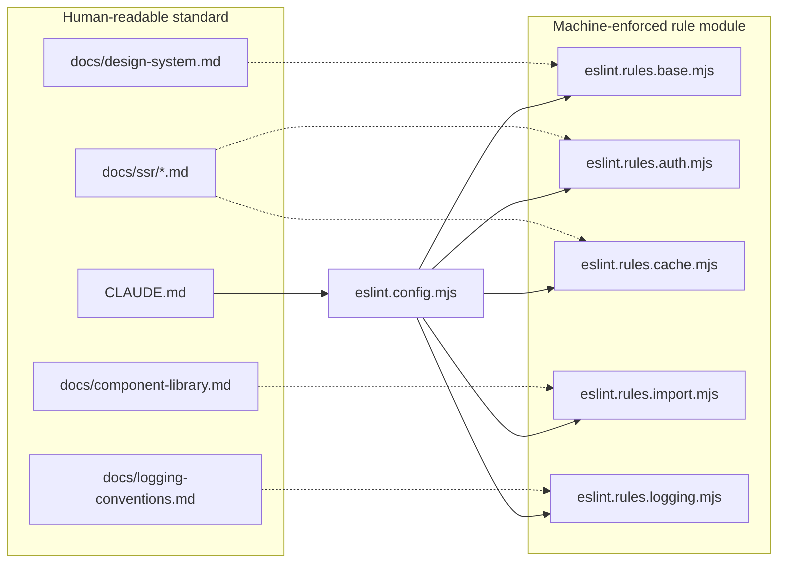

This page is the entry point for contributors to OZEAON V2: it maps the repository's documentation set, workflows, commands, and coding conventions that every contributor must follow before touching the codebase.

## Purpose and Scope

This page serves as the meta-index for the OZEAON V2 repository. It covers:

- Where repository documentation lives and what each document is responsible for (`README.md`, `CLAUDE.md`, `docs/*`).
- The contributor workflow: branch naming, Conventional Commits, PR requirements, and Monday ticket linkage.
- The canonical command reference and the conventions (Supabase clients, import paths, type derivation, component reuse, design tokens) that repository-wide rule files encode.
- How architectural rules are enforced mechanically through ESLint rule modules.

It intentionally does **not** re-document subsystem behavior. Deep topics have dedicated sibling pages:

- For the component primitive catalog and RHF wrappers, see **Component Library**.
- For the deployment pipeline, environments, and Cloudflare Workers configuration, see **Deployment & Operations**.
- For the design token system and typography scale, see **Design System**.
- For local Supabase setup and database workflow, see **Supabase Local Setup**.
- For the SSR auth/session model and rendering rules, see the **SSR & Caching** pages.

## Overview

OZEAON V2 is a full-stack ocean conservation platform built on Next.js (App Router, React Server Components), Supabase, TypeScript (strict), and Tailwind CSS, deployed to Cloudflare Workers via OpenNext + Wrangler. Because the system spans 30+ database tables, edge deployment, multiple Supabase client modes, and a large component library, the project deliberately treats **documentation as executable guidance**: several documents are referenced directly from agent/contributor instruction files, and a set of architectural invariants are enforced by dedicated ESLint rule files rather than being left to review discipline.

There are two distinct classes of documentation in this repository:

| Class | Location | Audience | Nature |
|-------|----------|----------|--------|
| Orientation & guidelines | `README.md`, `CLAUDE.md` | New contributors, agents | Onboarding, stack summary, rules index |
| Reference documents | `docs/*.md` | Contributors working in a subsystem | Deep, per-topic rules and patterns |

The documentation index is intentionally shallow — it points to the reference documents rather than duplicating them, so that a rule has exactly one authoritative location. When a convention changes, it changes in the reference document, and the index link continues to resolve.

## Architecture

The documentation set is organized as a layered index: a top-level entry point fans out to reference documents, and reference documents are cross-linked from the agent guideline file so that neither humans nor tooling can silently skip a rule.

```mermaid
flowchart TD
    subgraph sg_Entry["Repository Entry Points"]
        README["README.md<br/>Project overview, stack, quick start"]
        CLAUDE["CLAUDE.md<br/>Contributor & agent guidelines"]
    end

    subgraph sg_Index["Documentation Index"]
        DocsDir["docs/ directory"]
    end

    subgraph sg_Workflow["Workflow References"]
        Workflows["docs/workflows.md<br/>CI/CD, commits, PRs, Monday tickets"]
        OpsDeploy["docs/ops-deployment.md<br/>Deployment guide"]
    end

    subgraph sg_Standards["Engineering Standards"]
        CompLib["docs/component-library.md<br/>UI primitives & forms"]
        DesignSys["docs/design-system.md<br/>Tokens & typography"]
        Logging["docs/logging-conventions.md"]
        ArticleForm["docs/article-form/article-form-reference.md"]
        HookForm["docs/hook-form-components.md"]
    end

    subgraph sg_Infra["Infrastructure References"]
        R2["docs/r2-storage.md<br/>StorageAdapter patterns"]
        SupabaseLocal["docs/supabase-local.md"]
        Previews["docs/deployment-previews.md"]
    end

    subgraph sg_SSR["SSR References"]
        SSRIndex["docs/ssr/*.md<br/>auth-session, cache-components, rendering"]
    end

    subgraph sg_Rules["Enforced Rules"]
        ESLintBase["eslint.rules.base.mjs"]
        ESLintAuth["eslint.rules.auth.mjs"]
        ESLintCache["eslint.rules.cache.mjs"]
        ESLintImport["eslint.rules.import.mjs"]
        ESLintLogging["eslint.rules.logging.mjs"]
    end

    README --> DocsDir
    CLAUDE --> DocsDir
    DocsDir --> Workflows
    DocsDir --> OpsDeploy
    DocsDir --> CompLib
    DocsDir --> DesignSys
    DocsDir --> Logging
    DocsDir --> ArticleForm
    DocsDir --> HookForm
    DocsDir --> R2
    DocsDir --> SupabaseLocal
    DocsDir --> Previews
    DocsDir --> SSRIndex

    CompLib -.-> ESLintImport
    DesignSys -.-> ESLintBase
    Logging -.-> ESLintLogging
    SSRIndex -.-> ESLintCache
    SSRIndex -.-> ESLintAuth
```



**Why this shape:** `CLAUDE.md` is the single file that agents and contributors are told to read, and it embeds direct links to the reference documents rather than summarizing them. That makes the index a routing table, not a duplicate source of truth. The dotted edges show where a human-readable standard in `docs/` has a machine-enforced counterpart in an ESLint rule module — the two must be kept in agreement, and the rule module wins when they disagree (a lint failure is unambiguous, prose is not).

## Documentation Set

The repository maintains documentation at two levels. Everything below is verified from the actual files present in the tree.

### Top-level orientation files

| File | Responsibility |
|------|----------------|
| [`README.md`](https://github.com/ozeaon/ozeaon-v2/blob/0a4f1a95824db87782f1221a4108019d174df3d9/README.md) | Project mission, feature overview by persona (organizations, projects, educational hub, community, DAO governance), **technology stack and versions**, quick start prerequisites, and a links block pointing at the docs, deployment guide, workflow guide, and local Supabase setup. |
| [`CLAUDE.md`](https://github.com/ozeaon/ozeaon-v2/blob/0a4f1a95824db87782f1221a4108019d174df3d9/CLAUDE.md) | Contributor/agent guidelines: project overview, SSR constraints, workflow rules, TypeScript rules, stack versions, the **commands reference table**, Supabase client patterns, R2 storage patterns, API & server action patterns, import conventions, type system rules, component library policy, and typography/color policy. |
| [`DESIGN-CONSISTENCY-PLAN.md`](https://github.com/ozeaon/ozeaon-v2/blob/0a4f1a95824db87782f1221a4108019d174df3d9/DESIGN-CONSISTENCY-PLAN.md) | A planning document tracking design-consistency work across the UI. |

### Reference documents under `docs/`

The `docs/` directory is the canonical reference layer. The files present are:

| Document | Topic |
|----------|-------|
| [`docs/component-library.md`](https://github.com/ozeaon/ozeaon-v2/blob/0a4f1a95824db87782f1221a4108019d174df3d9/docs/component-library.md) | Primitive list from `@/components/ui`, infinite-feed pattern, skeletons, the `useAsyncAction` hook, and the React Hook Form wrapper table. |
| [`docs/design-system.md`](https://github.com/ozeaon/ozeaon-v2/blob/0a4f1a95824db87782f1221a4108019d174df3d9/docs/design-system.md) | Type scale, text color and background token tables. |
| [`docs/hook-form-components.md`](https://github.com/ozeaon/ozeaon-v2/blob/0a4f1a95824db87782f1221a4108019d174df3d9/docs/hook-form-components.md) | React Hook Form component usage. |
| [`docs/workflows.md`](https://github.com/ozeaon/ozeaon-v2/blob/0a4f1a95824db87782f1221a4108019d174df3d9/docs/workflows.md) | CI/CD deployment flow, commit conventions, branch naming, PR requirements, and Monday ticket automation. |
| [`docs/ops-deployment.md`](https://github.com/ozeaon/ozeaon-v2/blob/0a4f1a95824db87782f1221a4108019d174df3d9/docs/ops-deployment.md) | Deployment guide referenced from `README.md`. |
| [`docs/deployment-previews.md`](https://github.com/ozeaon/ozeaon-v2/blob/0a4f1a95824db87782f1221a4108019d174df3d9/docs/deployment-previews.md) | Preview environments per PR. |
| [`docs/logging-conventions.md`](https://github.com/ozeaon/ozeaon-v2/blob/0a4f1a95824db87782f1221a4108019d174df3d9/docs/logging-conventions.md) | Logging rules (mirrored by `eslint.rules.logging.mjs`). |
| [`docs/r2-storage.md`](https://github.com/ozeaon/ozeaon-v2/blob/0a4f1a95824db87782f1221a4108019d174df3d9/docs/r2-storage.md) | R2 upload/URL/delete patterns through `StorageAdapter`, plus image-caching notes. |
| [`docs/supabase-local.md`](https://github.com/ozeaon/ozeaon-v2/blob/0a4f1a95824db87782f1221a4108019d174df3d9/docs/supabase-local.md) | Local Supabase setup. |
| [`docs/article-form/article-form-reference.md`](https://github.com/ozeaon/ozeaon-v2/blob/0a4f1a95824db87782f1221a4108019d174df3d9/docs/article-form/article-form-reference.md) | The multi-step article form reference. |
| [`docs/ssr/auth-session-refactor.md`](https://github.com/ozeaon/ozeaon-v2/blob/0a4f1a95824db87782f1221a4108019d174df3d9/docs/ssr/auth-session-refactor.md) | SSR auth/session model. |
| [`docs/ssr/cache-components-model.md`](https://github.com/ozeaon/ozeaon-v2/blob/0a4f1a95824db87782f1221a4108019d174df3d9/docs/ssr/cache-components-model.md) | The future `cacheComponents` caching model. |
| [`docs/ssr/rendering-rules-today.md`](https://github.com/ozeaon/ozeaon-v2/blob/0a4f1a95824db87782f1221a4108019d174df3d9/docs/ssr/rendering-rules-today.md) | Current rendering rules. |

### Component-level READMEs

Three directories carry their own README files, keeping locally-scoped conventions next to the code they govern:

- [`src/components/README.md`](https://github.com/ozeaon/ozeaon-v2/blob/0a4f1a95824db87782f1221a4108019d174df3d9/src/components/README.md)
- [`src/components/tiptap/README.md`](https://github.com/ozeaon/ozeaon-v2/blob/0a4f1a95824db87782f1221a4108019d174df3d9/src/components/tiptap/README.md)
- [`src/components/ui/inputs/README.md`](https://github.com/ozeaon/ozeaon-v2/blob/0a4f1a95824db87782f1221a4108019d174df3d9/src/components/ui/inputs/README.md)

This is the correct pattern for this repository: repository-wide rules live in `docs/` and `CLAUDE.md`; rules that only make sense inside one subtree live in that subtree's README.

## Contributor Workflow

The end-to-end contribution flow is defined in `docs/workflows.md`. It is a short, linear path with two gates (review and ticket linkage).



### Branch naming

Branch names follow a fixed vocabulary. The ticket-suffixed form (`feat/tozn-051`) exists purely for human legibility — it is explicitly **not** what links a ticket, as explained below.

```text
feat/short-description      - New features
feat/tozn-051               - Ticket related feature, for human legibility only
fix/issue-number-description - Bug fixes
chore/task-description      - Maintenance
release/v1.2.0              - Release preparation
```

> Source: [workflows.md](https://github.com/ozeaon/ozeaon-v2/blob/0a4f1a95824db87782f1221a4108019d174df3d9/docs/workflows.md#L47-L53)

### Commit conventions

Commits use Conventional Commits with the form `<type>(<scope>): <description>`, plus optional body and footer. The documented types map directly to release impact: `feat` produces a minor version bump, `fix` produces a patch bump, and `docs`, `chore`, `ci`, and `refactor` are non-release types.

```text
<type>(<scope>): <description>

[optional body]

[optional footer]
```

Example from the repository guide:

```text
feat(auth): add Google OAuth login

Implements OAuth2 flow with Google provider.
Uses @supabase/ssr for server-side auth.

Closes #123
```

> Source: [workflows.md](https://github.com/ozeaon/ozeaon-v2/blob/0a4f1a95824db87782f1221a4108019d174df3d9/docs/workflows.md#L38-L45)

Note the important subtlety documented immediately after this example: the `Closes #123` footer in a commit message is **GitHub issue syntax and is unrelated** to the project's Monday ticket linkage. It is not read by the sync automation at all.

### Pull request requirements

A PR has six documented requirements:

1. **Title** matching the commit format.
2. **Description** covering what changed, why it changed, and how to test.
3. **Ticket** — `Closes TOZN-<n>` or `Closes BOZN-<n>` in the title or description, or the `no-ticket` label.
4. **Tags** in metadata.
5. **Review** — a Code Owner's approval is required for `src/`, `supabase/`, and `.github/workflows/` via `.github/CODEOWNERS`. No approval *count* is enforced, so a PR touching none of those paths can merge unreviewed.
6. **Checks** — no status check is required on `main`, so a red check blocks nothing; contributors are told to read them before merging.

Requirements 5 and 6 are the two most operationally significant guarantees on this page, because they define what the automation will *not* stop. Both are stated as explicit limitations rather than aspirational policy.

> Source: [workflows.md](https://github.com/ozeaon/ozeaon-v2/blob/0a4f1a95824db87782f1221a4108019d174df3d9/docs/workflows.md#L55-L65)

## Monday Ticket Automation

The repository links pull requests to project-management items on Monday boards through a dedicated workflow and a shared parsing module. This is documentation-relevant because the *rule for what counts as a ticket link* interacts directly with how documentation is written.

### Files involved

| File | Role |
|------|------|
| `.github/workflows/monday-sync.yml` | Links a PR to its Monday item and moves the item as the PR progresses. |
| `.github/scripts/monday-ticket.mjs` | Decides what counts as a link; shared by both jobs in the workflow. |

### What counts as a link

A ticket is linked **only** by an explicit closes line appearing in the PR **title or description**:

| | |
| --- | --- |
| Links | `Closes TOZN-402`, `closes bozn-235`, several in one PR |
| Ignored | an id in the branch name, a bare id with no `Closes`, anything inside backticks or a fenced block |
| Not read at all | commit messages — the `Closes #123` footer is GitHub issue syntax, unrelated |

> Source: [workflows.md](https://github.com/ozeaon/ozeaon-v2/blob/0a4f1a95824db87782f1221a4108019d174df3d9/docs/workflows.md#L72-L78)

**Design intent:** ids inside backticks are ignored so that *documenting the syntax cannot move a real ticket*. The guide records that a description explaining the rule in prose once moved five live tickets — which is precisely why the escaping rule exists. This is a documentation-safety property: writing a guide about the automation must be a no-op with respect to the automation. Any contributor editing this page's sibling content must therefore wrap example ticket syntax in backticks or fenced blocks.

### State machine of a linked ticket

Ticket movement depends on the board (Tasks vs Bugs Queue), the event, and the ticket's *current* column. Moves are forward-only along the documented order.



The mapping documented per event:

| Event | Tasks | Bugs Queue |
| --- | --- | --- |
| PR opened, reopened or marked ready | Code Review | Code Review |
| One approving review | QA | QA |
| Open PR turned back into a draft | Dev In Progress | Fixing |
| Merged | Done | Fixed |

> Source: [workflows.md](https://github.com/ozeaon/ozeaon-v2/blob/0a4f1a95824db87782f1221a4108019d174df3d9/docs/workflows.md#L83-L90)

Key behavioral guarantees stated in the guide:

- **Forward-only:** an edit, a reopen, or a second approval cannot drag a ticket back out of QA. The single exception is the draft return, and it applies **only while the ticket is still in Code Review**.
- **Bug tickets** additionally get the PR URL written into their GitHub Link field.
- **Statuses left untouched:** Backlog, Stuck, Change Request, Phase 2, Clarification, the design track's own states, and closed bugs. Any status added to either board later defaults to untouched, and the run logs a warning saying so.
- **In-range statuses:** the automation only acts on tickets already inside the dev pipeline — **Dev In Progress**, **Fixing**, **Code Review**, **QA**, **Done**, **Fixed** — plus pull-in from **Ready for Dev**.

### Bidirectional reporting

Each move is reported in both directions: the ticket's Updates feed receives the PR link, what happened, and who did it; the PR receives a comment naming the ticket, the column it landed in, and the board it is on. A run that moves nothing says nothing in either place — silence is meaningful here, since it indicates the ticket was outside the pipeline or the status was not automatable.

### The Monday token and its documented risk

The sync job runs with `MONDAY_API_TOKEN` in its environment on every PR event. The guide states the exposure plainly: a same-repo PR runs **its own copy** of the workflow file, so anyone with push access can already run code with that token without review. Pinning the checkout to the base commit does not fix this, and would stop the workflow from running on any PR that edits `monday-ticket.mjs`. The documented remedy is to move the sync to `pull_request_target`, which always executes the base branch's copy. Until then, the exposure is bounded by keeping the token scoped to the two boards.

> Source: [workflows.md](https://github.com/ozeaon/ozeaon-v2/blob/0a4f1a95824db87782f1221a4108019d174df3d9/docs/workflows.md#L114-L121)

This is an example of the repository's documentation style: state the residual risk and the bounded mitigation rather than implying the automation is airtight.

### The Ticket ID check

A PR with no closes line fails the **Ticket ID** check, which posts a comment saying so. Applying the `no-ticket` label clears the check immediately with no new commit required, and the comment deletes itself. Draft PRs and bot PRs are skipped.

> Source: [workflows.md](https://github.com/ozeaon/ozeaon-v2/blob/0a4f1a95824db87782f1221a4108019d174df3d9/docs/workflows.md#L123-L127)

## Commands Reference

`CLAUDE.md` carries the canonical command table. These are the commands contributors are expected to use instead of ad-hoc invocations.

| Command | Description |
| --- | --- |
| `pnpm dev` | Start dev server with Turbopack (localhost:3000) |
| `pnpm build` | Production Next.js build |
| `pnpm lint` | Run ESLint |
| `pnpm lint:fix` | Run ESLint with auto-fix |
| `pnpm check` | Type check (`tsc --noEmit`) |
| `pnpm format` | Format with Prettier |
| `pnpm typegen` | Generate Next.js route types + Cloudflare env types |
| `pnpm db:gen` | Generate Supabase DB schema types (run after migrations) |
| `pnpm db:seed-dump` | Dump remote data to `supabase/seed.sql` |
| `pnpm db:reset-real` | Load the real dump instead of the preview fixture |
| `pnpm preview` | Preview Cloudflare deployment locally |
| `pnpm ci:build` | Production build with Cloudflare adapter |
| `pnpm ci:deploy` | Deploy to Cloudflare |
| `pnpm clean-cache` | Clean all build caches |

> Source: [CLAUDE.md](https://github.com/ozeaon/ozeaon-v2/blob/0a4f1a95824db87782f1221a4108019d174df3d9/CLAUDE.md#L61-L79)

The deployment subset is repeated in `docs/workflows.md` with the same intent, where rollback is documented as `wrangler rollback`.

```bash
pnpm run preview      # Local preview
pnpm run ci:build     # Build for Cloudflare
pnpm run ci:deploy    # Deploy to production
wrangler rollback     # Rollback
```

> Source: [workflows.md](https://github.com/ozeaon/ozeaon-v2/blob/0a4f1a95824db87782f1221a4108019d174df3d9/docs/workflows.md#L129-L153)

**Why `db:gen` matters to contributors:** generated Supabase types under `@/types/supabase` are the source of truth for the type system. The type rules in `CLAUDE.md` forbid hand-rolling database shapes, so a schema change is not complete until `pnpm db:gen` has been run and the derived types are used.

## Coding Conventions Enforced Repository-Wide

`CLAUDE.md` is not advisory prose — it encodes invariants that are partly backed by dedicated ESLint rule modules. The separation is deliberate: prose explains *why*, the rule module makes violations fail the build.



The rule modules are consumed by `eslint.config.mjs`; each named module corresponds to a documented convention domain.

### Supabase client selection

The single most consequential convention: which Supabase client to import is determined by where the code runs.

| Client | Import | Use In |
| --- | --- | --- |
| Server | `@/lib/supabase/server` | Server Components, Server Actions, API routes |
| Browser | `@/lib/supabase/client` | Client Components (`"use client"`) — create fresh per call |
| Admin | `@/lib/supabase/admin` | API routes bypassing RLS (use sparingly) |
| Public | `@/lib/supabase/public` | Unauthenticated public queries |

> Source: [CLAUDE.md](https://github.com/ozeaon/ozeaon-v2/blob/0a4f1a95824db87782f1221a4108019d174df3d9/CLAUDE.md#L84-L89)

The server client must be awaited:

```typescript
// Server Component / API route
import { createClient } from "@/lib/supabase/server";

const supabase = await createClient();
```

> Source: [CLAUDE.md](https://github.com/ozeaon/ozeaon-v2/blob/0a4f1a95824db87782f1221a4108019d174df3d9/CLAUDE.md#L91-L96)

**Rule: never call `createClient()` after `getAuthUser()` or `getAuthUserOrRedirect()`.** Both helpers already return a `supabase` client memoized by React `cache()` for the request, so calling `createClient()` again creates a second client unnecessarily.

```typescript
// ❌ Wrong — two clients for one request
const supabase = await createClient();
const { user } = await getAuthUserOrRedirect();

// ✅ Correct — reuse the client from auth
const { user, supabase } = await getAuthUserOrRedirect();
```

> Source: [CLAUDE.md](https://github.com/ozeaon/ozeaon-v2/blob/0a4f1a95824db87782f1221a4108019d174df3d9/CLAUDE.md#L100-L107)

Route handlers using `withAuthUser` receive `supabase` via ctx, and must not re-create it:

```typescript
// ❌ Wrong
export const POST = withAuthUser(async (req, { user }) => {
  const supabase = await createClient();
  ...
});

// ✅ Correct
export const POST = withAuthUser(async (req, { user, supabase }) => {
  ...
});
```

> Source: [CLAUDE.md](https://github.com/ozeaon/ozeaon-v2/blob/0a4f1a95824db87782f1221a4108019d174df3d9/CLAUDE.md#L111-L122)

The browser client follows the opposite lifecycle rule — created fresh per call, never globally cached:

```typescript
// Client Component
"use client";
// ⚠️ Create fresh per request, never cache globally
import { createClient } from "@/lib/supabase/client";

const supabase = createClient();
```

> Source: [CLAUDE.md](https://github.com/ozeaon/ozeaon-v2/blob/0a4f1a95824db87782f1221a4108019d174df3d9/CLAUDE.md#L124-L131)

**Design intent:** the asymmetry exists because the server client's `cookies()` call both signals dynamic rendering *and* memoizes per request, while a browser-side singleton would leak session state across navigations.

### SSR and rendering constraints

`CLAUDE.md` states the SSR constraint at the top of the file and treats it as a hard rule: never use browser APIs (`document`, `window`) in server components or at module level.

The current rendering model is explained by the interaction between `cacheComponents` and `createClient()`:

- The project will adopt `cacheComponents` — the newer Next.js 16 cache model — once features are stable with the Cloudflare adapter.
- Legacy model directives (`export const dynamic` / `revalidate` / `fetchCache` / `runtime`) are **prohibited**.
- With `cacheComponents: false`, `await createClient()` internally calls `cookies()`, which automatically opts the route into dynamic rendering — so any component that goes through `createClient()` → `cookies()` is safe without any manual declaration.

The three safety rules that follow from this:

1. Always use `createClient()` (server client) for user-specific data — the `cookies()` call is the dynamic signal.
2. Never use `createPublicClient()` or the admin client in a component that also renders user-specific state.
3. Public pages (articles, profiles) using only `createPublicClient()` will correctly prerender statically.

> Source: [CLAUDE.md](https://github.com/ozeaon/ozeaon-v2/blob/0a4f1a95824db87782f1221a4108019d174df3d9/CLAUDE.md#L9-L21)

Contributors are directed to read the vendored Next.js documentation before touching routes, layouts, metadata, caching, or Supabase-in-SSR code:

- `node_modules/next/dist/docs/index.md`
- `node_modules/next/dist/docs/01-app`
- `node_modules/next/dist/docs/03-architecture`

> Source: [CLAUDE.md](https://github.com/ozeaon/ozeaon-v2/blob/0a4f1a95824db87782f1221a4108019d174df3d9/CLAUDE.md#L23-L27)

### Import conventions

The import table is the reason `eslint.rules.import.mjs` exists — barrel exports are the sanctioned path for hooks, config, and utils, while Supabase clients are deliberately imported explicitly.

```typescript
import { useAuth } from "@/hooks"; // barrel exports
import { env, IMAGE_CONFIG } from "@/config";
import { validateFileType, generateUniqueKey } from "@/utils";
import { createClient } from "@/lib/supabase/server"; // explicit Supabase client imports
import { cn } from "@/utils/shadcn/utils";
import type { Tables, TablesInsert, TablesUpdate } from "@/types/supabase";
```

> Source: [CLAUDE.md](https://github.com/ozeaon/ozeaon-v2/blob/0a4f1a95824db87782f1221a4108019d174df3d9/CLAUDE.md#L150-L157)

Domain cards import from the domain's `cards/` subdirectory (`@/components/posts/cards`, `@/components/articles/cards`).

### Type system rules

Types are always derived from generated Supabase types, never hand-rolled, and domain types live in `src/types/` — never inside component files.

```typescript
type Project = Tables<"projects">; // full row
type Slug = Pick<Tables<"resource_subcategories">, "id" | "name" | "slug">; // projection
type Comment = Tables<"comments"> & { author: UserProfileForJoin }; // join
type Article = Omit<Tables<"articles">, "article_type"> & {
  // FK override
  article_type: { id: number; type: string } | null;
};
const insert: TablesInsert<"projects"> = { title, slug, created_by: user.id }; // mutation
```

> Source: [CLAUDE.md](https://github.com/ozeaon/ozeaon-v2/blob/0a4f1a95824db87782f1221a4108019d174df3d9/CLAUDE.md#L168-L177)

The four documented derivation patterns are: full row, projection via `Pick`, join via intersection, and FK override via `Omit` + re-declaration.

### Component and styling policy

- **Component reuse:** never reinvent a primitive that already exists. Check `docs/component-library.md` first. The primitives most often reinvented as raw markup are `EmptyState` (never a raw centered `<div>`), `GridLayout` (never raw `grid` classes), `Button`/`LoadingButton` (icons via `iconLeft`/`iconRight` props, never JSX children), and `ConfirmDialog` (never `window.confirm()`).
- **Typography & color:** never use raw Tailwind size or color utilities; use the token tables in `docs/design-system.md`. Tokens are defined in `src/styles/typography.css` and `src/styles/globals.css`.

> Source: [CLAUDE.md](https://github.com/ozeaon/ozeaon-v2/blob/0a4f1a95824db87782f1221a4108019d174df3d9/CLAUDE.md#L183-L197)

## Usage Examples

The examples below are extracted verbatim from the repository's own guideline documents, and demonstrate the correct/incorrect patterns contributors must follow.

### Choosing the right Supabase client per environment

```typescript
// Server Component / API route
import { createClient } from "@/lib/supabase/server";

const supabase = await createClient();
```

```typescript
// Client Component
"use client";
import { createClient } from "@/lib/supabase/client";

const supabase = createClient();
```

> Sources:
> - [CLAUDE.md](https://github.com/ozeaon/ozeaon-v2/blob/0a4f1a95824db87782f1221a4108019d174df3d9/CLAUDE.md#L91-L96)
> - [CLAUDE.md](https://github.com/ozeaon/ozeaon-v2/blob/0a4f1a95824db87782f1221a4108019d174df3d9/CLAUDE.md#L124-L131)

### Reusing the memoized auth client

The `✅` variant below is the required form in any Server Component or Server Action that needs both the user and the database client.

```typescript
// ✅ Correct — reuse the client from auth
const { user, supabase } = await getAuthUserOrRedirect();
```

> Source: [CLAUDE.md](https://github.com/ozeaon/ozeaon-v2/blob/0a4f1a95824db87782f1221a4108019d174df3d9/CLAUDE.md#L105-L107)

### Adopting an existing primitive instead of raw markup

The feeds section of the component library shows the SSR-first pattern: render the first page on the server and pass it as `initial`, letting the component own scroll-loading. The guide explicitly forbids wrapping it in `<Suspense>` because the feed renders its own loading state.

```tsx
// Server Component
const posts = await getFeedPosts(supabase, {
  limit: 5,
  offset: 0,
  userIds: [profileId],
});
return (
  <PostsInfiniteFeed
    initialPosts={posts}
    likedPosts={liked}
    repostedPosts={reposted}
    userId={profileId}
  />
);
```

> Source: [component-library.md](https://github.com/ozeaon/ozeaon-v2/blob/0a4f1a95824db87782f1221a4108019d174df3d9/docs/component-library.md#L30-L45)

`userId` filters the feed to a specific user (profile tabs); omitting it yields the global feed.

### Collapsing async state handling into a hook

`useAsyncAction` replaces the manual `useState + try/catch + toast` triad, which is the pattern the library wants removed from the codebase.

```typescript
const { execute: handleFollow, isLoading } = useAsyncAction(
  () => followUser(targetUserId),
  { successMessage: "Followed!", errorMessage: "Failed to follow" },
);
```

> Source: [component-library.md](https://github.com/ozeaon/ozeaon-v2/blob/0a4f1a95824db87782f1221a4108019d174df3d9/docs/component-library.md#L57-L62)

### Adding a shadcn component

shadcn files must be added through the CLI — never written manually, and `@radix-ui/react-*` packages must never be installed directly.

```bash
pnpm dlx shadcn@latest add <component-name>
```

> Source: [component-library.md](https://github.com/ozeaon/ozeaon-v2/blob/0a4f1a95824db87782f1221a4108019d174df3d9/docs/component-library.md#L84-L88)

### Opening a pull request that links its ticket

```text
feat(auth): add Google OAuth login

Implements OAuth2 flow with Google provider.
Uses @supabase/ssr for server-side auth.
```

With `Closes TOZN-402` (or `Closes BOZN-235`) added to the **title or description**, the Monday automation links and moves the ticket. Note that documenting ticket syntax in prose requires backticks, per the escaping rule described above.

> Source: [workflows.md](https://github.com/ozeaon/ozeaon-v2/blob/0a4f1a95824db87782f1221a4108019d174df3d9/docs/workflows.md#L38-L45)

## Configuration Options

The repository's contributor-facing configuration is concentrated in three places: environment variables, lint rule modules, and Next.js/Cloudflare build config.

### Environment variables

Required for development (from `docs/workflows.md`):

| Variable | Required | Purpose |
| --- | --- | --- |
| `NEXT_PUBLIC_SUPABASE_URL` | Yes | Supabase project URL |
| `NEXT_PUBLIC_SUPABASE_ANON_KEY` | Yes | Supabase anonymous key |

> Source: [workflows.md](https://github.com/ozeaon/ozeaon-v2/blob/0a4f1a95824db87782f1221a4108019d174df3d9/docs/workflows.md#L155-L160)

Additional runtime secrets referenced by documentation and workflows include the Cloudflare R2 credentials (see `docs/r2-storage.md`, which directs all storage access through `StorageAdapter` in `@/lib/storage/adapter`) and `MONDAY_API_TOKEN` for the ticket sync job.

### Lint rule modules

| File | Domain enforced |
| --- | --- |
| [`eslint.config.mjs`](https://github.com/ozeaon/ozeaon-v2/blob/0a4f1a95824db87782f1221a4108019d174df3d9/eslint.config.mjs) | Aggregates the rule modules into the ESLint flat config |
| [`eslint.rules.base.mjs`](https://github.com/ozeaon/ozeaon-v2/blob/0a4f1a95824db87782f1221a4108019d174df3d9/eslint.rules.base.mjs) | Base rules (design/token-related conventions) |
| [`eslint.rules.auth.mjs`](https://github.com/ozeaon/ozeaon-v2/blob/0a4f1a95824db87782f1221a4108019d174df3d9/eslint.rules.auth.mjs) | Auth guidance (see `docs/ssr/auth-session-refactor.md`) |
| [`eslint.rules.cache.mjs`](https://github.com/ozeaon/ozeaon-v2/blob/0a4f1a95824db87782f1221a4108019d174df3d9/eslint.rules.cache.mjs) | Caching rules, aligned with the SSR cache model |
| [`eslint.rules.import.mjs`](https://github.com/ozeaon/ozeaon-v2/blob/0a4f1a95824db87782f1221a4108019d174df3d9/eslint.rules.import.mjs) | Import conventions (barrel exports, explicit Supabase imports) |
| [`eslint.rules.logging.mjs`](https://github.com/ozeaon/ozeaon-v2/blob/0a4f1a95824db87782f1221a4108019d174df3d9/eslint.rules.logging.mjs) | Logging conventions (see `docs/logging-conventions.md`) |

### Build and deployment configuration files

| File | Purpose |
| --- | --- |
| [`next.config.ts`](https://github.com/ozeaon/ozeaon-v2/blob/0a4f1a95824db87782f1221a4108019d174df3d9/next.config.ts) | Next.js configuration |
| [`open-next.config.ts`](https://github.com/ozeaon/ozeaon-v2/blob/0a4f1a95824db87782f1221a4108019d174df3d9/open-next.config.ts) | OpenNext adapter configuration for Cloudflare |
| [`wrangler.jsonc`](https://github.com/ozeaon/ozeaon-v2/blob/0a4f1a95824db87782f1221a4108019d174df3d9/wrangler.jsonc) | Cloudflare Workers deployment configuration |
| [`components.json`](https://github.com/ozeaon/ozeaon-v2/blob/0a4f1a95824db87782f1221a4108019d174df3d9/components.json) | shadcn CLI component registry configuration |
| [`tsconfig.json`](https://github.com/ozeaon/ozeaon-v2/blob/0a4f1a95824db87782f1221a4108019d174df3d9/tsconfig.json) | TypeScript strict-mode compiler configuration |

### Package manager

`pnpm` is mandatory — the guide states "**pnpm only** — never `npm` or `yarn`". The workspace is defined by [`pnpm-workspace.yaml`](https://github.com/ozeaon/ozeaon-v2/blob/0a4f1a95824db87782f1221a4108019d174df3d9/pnpm-workspace.yaml) and locked by [`pnpm-lock.yaml`](https://github.com/ozeaon/ozeaon-v2/blob/0a4f1a95824db87782f1221a4108019d174df3d9/pnpm-lock.yaml). `README.md` pins the prerequisite to `pnpm` 11.9.0 and Node.js 24+.

## API Reference

This page documents repository conventions rather than a runtime API. The contributor-facing "API" is the set of helper contracts referenced throughout the guidelines. These are described here by their documented contract; the implementations live in `src/lib`.

### `createClient()` — server client

- **Import:** `@/lib/supabase/server`
- **Nature:** async factory; returns a request-scoped Supabase client.
- **Call:** `const supabase = await createClient();`
- **Constraint:** internally calls `cookies()`, which opts the route into dynamic rendering. Must not be called in a component that also renders user-specific state *and* uses the public/admin client.

### `createClient()` — browser client

- **Import:** `@/lib/supabase/client`
- **Nature:** synchronous factory; must be invoked fresh per client component instance.
- **Constraint:** never cache the result globally.

### `getAuthUser()` / `getAuthUserOrRedirect()`

- **Nature:** auth helpers that return both the user and a `supabase` client memoized by React `cache()` for the request.
- **Constraint:** after calling either, **never** call `createClient()` again — reuse the returned `supabase`.
- **Return:** `{ user, supabase }` (destructured in the documented correct form). `getAuthUserOrRedirect()` additionally redirects when unauthenticated.

> Source: [CLAUDE.md](https://github.com/ozeaon/ozeaon-v2/blob/0a4f1a95824db87782f1221a4108019d174df3d9/CLAUDE.md#L98-L107)

### `withAuthUser(handler)`

- **Nature:** route-handler wrapper that supplies `{ user, supabase }` on `ctx`.
- **Constraint:** never call `createClient()` inside a `withAuthUser` handler.

> Source: [CLAUDE.md](https://github.com/ozeaon/ozeaon-v2/blob/0a4f1a95824db87782f1221a4108019d174df3d9/CLAUDE.md#L109-L122)

### `useAsyncAction(action, options)`

- **Import:** `@/hooks` (documented in the component library under Hooks)
- **Parameters:**
  - `action`: the async operation to execute.
  - `options`: an object with `successMessage` and `errorMessage` strings.
- **Returns:** `{ execute, isLoading }` — where `execute` is the wrapped action and `isLoading` is the pending flag.
- **Purpose:** replaces manual `useState + try/catch + toast`.

> Source: [component-library.md](https://github.com/ozeaon/ozeaon-v2/blob/0a4f1a95824db87782f1221a4108019d174df3d9/docs/component-library.md#L53-L62)

### Type aliases from `@/types/supabase`

- `Tables<"table">` — full row type.
- `TablesInsert<"table">` — insert shape for mutations.
- `TablesUpdate<"table">` — update shape.
- Derived forms: `Pick<...>` for projections, intersection for joins, `Omit<...> & {...}` for FK overrides.

> Source: [CLAUDE.md](https://github.com/ozeaon/ozeaon-v2/blob/0a4f1a95824db87782f1221a4108019d174df3d9/CLAUDE.md#L156-L177)
