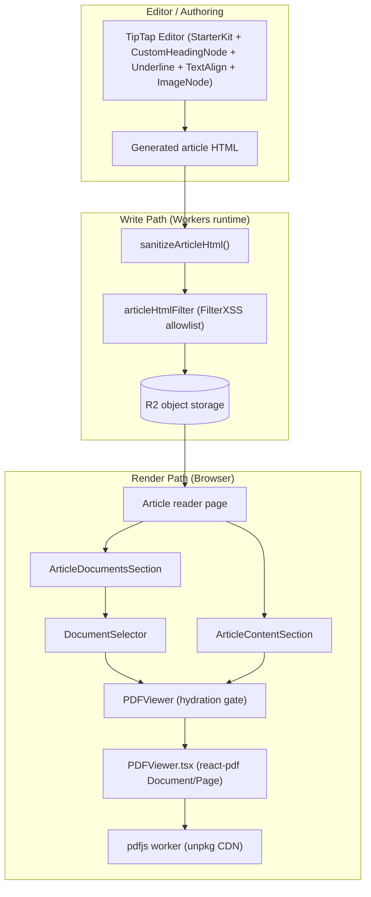
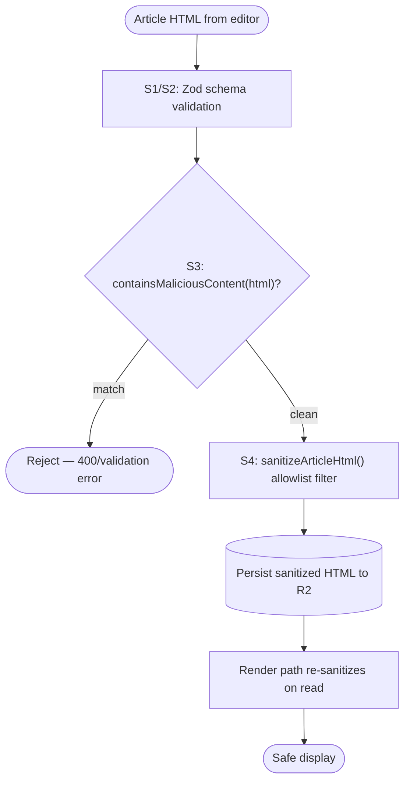
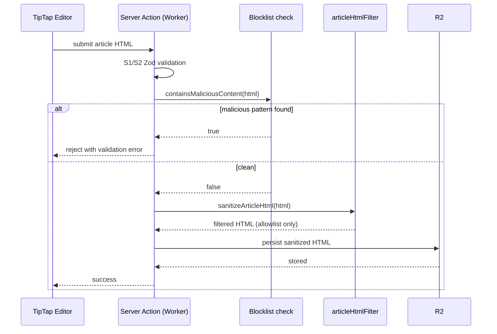
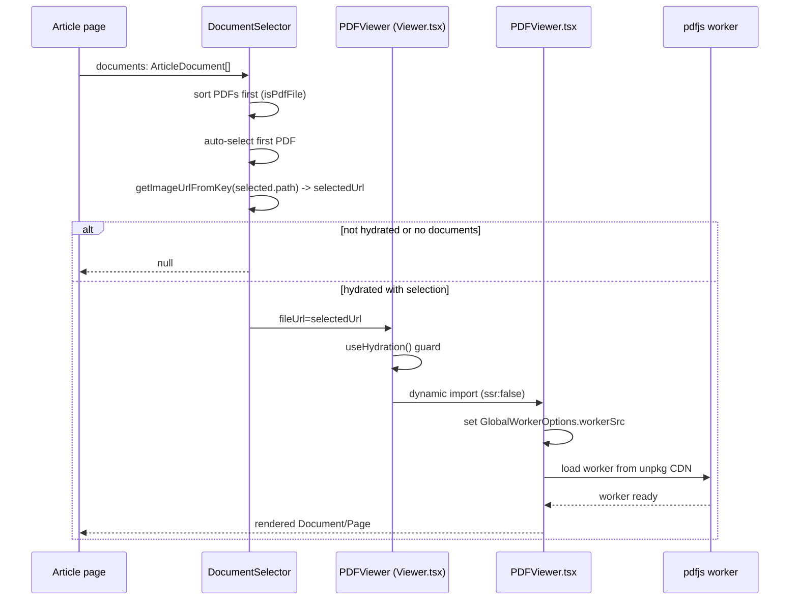

This page documents how the platform stores, validates, sanitizes and renders document content — the allowlist HTML sanitizer used for TipTap-generated article bodies, the attachment/document metadata model, and the client-side PDF viewing stack built on `react-pdf` + `pdfjs-dist`.

## Purpose and Scope

This page covers two related, source-backed capabilities:

1. **Sanitization** — `src/utils/sanitize.ts`, the allowlist HTML filter (`FilterXSS` from the `xss` package) that runs on both the Worker write path and the browser render path for TipTap-generated article HTML.
2. **PDF Viewing** — the `PDFViewer` / `DocumentSelector` components under `src/components/ui/display/PDFViewer/`, their dynamic-import/hydration gating, the `react-pdf` script loading, and how article pages wire papers/documents into them (`ArticleContentSection`, `ArticleDocumentsSection`).

Related topics intentionally left to sibling pages:

- For the full article authoring form, validation stages (S1–S4) and Zod schemas, see [Article Form Reference](https://github.com/ozeaon/ozeaon-v2/blob/0a4f1a95824db87782f1221a4108019d174df3d9/article-form/article-form-reference.md).
- For the media/attachment storage pipeline (R2 buckets, key generation, `getImageUrl`), see the media and storage pages under `editor-and-documents`.
- For the design-system tokens used by viewer chrome, see [Design System](https://github.com/ozeaon/ozeaon-v2/blob/0a4f1a95824db87782f1221a4108019d174df3d9/design-system.md).

## Overview

The editor produces rich HTML using TipTap extensions (`StarterKit` + `CustomHeadingNode` + `Underline` + `TextAlign` + `ImageNode`). That HTML is user-controlled, so it must never be trusted verbatim: a marker-based blocklist alone is insufficient, and the platform therefore applies a strict **allowlist** filter that only permits the exact tag/attribute vocabulary the editor itself can emit.

Separately, articles carry binary attachments ("documents"), the most important of which are PDFs. PDFs are rendered in-browser with `react-pdf`, which in turn wraps `pdfjs-dist`. Because `pdfjs` requires a browser environment and a web worker, the viewer is dynamically imported with `ssr: false` and gated behind a hydration hook so nothing PDF-related is attempted during server rendering.

Key concepts:

| Concept | Meaning |
| --- | --- |
| Allowlist sanitisation | Only explicitly whitelisted tags/attributes survive; everything else is stripped |
| `articleHtmlFilter` | The singleton `FilterXSS` instance configured for editor output |
| `StripIgnoreTagBody` | For dangerous containers (`script`, `style`, `iframe`, `object`, `embed`) the body is removed too, not just the tag |
| Hydration gating | `useHydration()` guards so PDF rendering only happens client-side after mount |
| Dynamic import | `_Viewer = dynamic(() => import("./PDFViewer"), { ssr: false })` keeps `pdfjs` out of the server bundle |
| `DocumentSelector` | Component that lists attachments, sorts PDFs first, and drives the viewer's selected URL |

## Architecture



The architecture separates **two trust boundaries**:

- The **write path** sanitizes before persistence, so R2 only ever holds filtered HTML.
- The **render path** re-runs the same sanitizer semantics (the same `xss`-based allowlist logic is shared through `src/utils`), so even data that predates a rule change is filtered at display time. The comment in the source makes this dual-runtime intent explicit: "Runs on both the Workers runtime (write path) and the browser (render path)."

On the viewer side, the split between `Viewer.tsx` (lightweight, hydration-aware wrapper) and `PDFViewer.tsx` (heavy, `ssr: false`) is a deliberate bundle-size and SSR-safety decision — see [Main Content](#the-pdf-viewer-stack) below.

> Sources:
> - [sanitize.ts](https://github.com/ozeaon/ozeaon-v2/blob/0a4f1a95824db87782f1221a4108019d174df3d9/src/utils/sanitize.ts#L3-L8)
> - [Viewer.tsx](https://github.com/ozeaon/ozeaon-v2/blob/0a4f1a95824db87782f1221a4108019d174df3d9/src/components/ui/display/PDFViewer/Viewer.tsx#L15-L34)

## Allowlist HTML Sanitization

### Design intent

The sanitizer is described in its own header comment as an "Allowlist sanitiser for TipTap-generated article HTML" that "Mirrors the exact output of the editor extensions ... anything outside that vocabulary is stripped." This is a **whitelist** model, not a blocklist: rather than trying to enumerate every XSS vector, the filter starts from a known-good set of tags/attributes and drops everything unknown. That is far more robust against novel payloads because the failure mode is "content is lost" rather than "content is executed."

### The filter configuration

The entire filter is a single module-level `FilterXSS` instance created from the `xss` package:

```typescript
import { FilterXSS } from "xss";

/**
 * Allowlist sanitiser for TipTap-generated article HTML. Mirrors the exact
 * output of the editor extensions (StarterKit + CustomHeadingNode + Underline
 * + TextAlign + ImageNode) — anything outside that vocabulary is stripped.
 * Runs on both the Workers runtime (write path) and the browser (render path).
 */
const articleHtmlFilter = new FilterXSS({
  whiteList: {
    p: ["style"],
    h2: ["class", "style"],
    h3: ["class", "style"],
    h4: ["class", "style"],
    strong: [],
    b: [],
    em: [],
    i: [],
    s: [],
    u: [],
    blockquote: [],
    ul: [],
    ol: [],
    li: [],
    br: [],
    a: ["href", "target", "rel"],
    img: [
      "src",
      "alt",
      "width",
      "height",
      "data-image-id",
      "data-name",
      "data-extension",
      "data-size",
      "data-natural-width",
      "data-natural-height",
    ],
  },
  css: {
    whiteList: { "text-align": true },
  },
  stripIgnoreTag: true,
  stripIgnoreTagBody: ["script", "style", "iframe", "object", "embed"],
});
```

> Source: [sanitize.ts](https://github.com/ozeaon/ozeaon-v2/blob/0a4f1a95824db87782f1221a4108019d174df3d9/src/utils/sanitize.ts#L1-L45)

Several details are worth calling out:

| Setting | Value | Why it matters |
| --- | --- | --- |
| `whiteList.p` | `["style"]` | Paragraphs only carry the alignment style produced by `TextAlign` |
| `whiteList.h2/h3/h4` | `["class", "style"]` | `CustomHeadingNode` emits `class` for heading styling |
| `strong/b/em/i/s/u` | `[]` | Inline emphasis tags — no attributes permitted at all |
| `a` | `href`, `target`, `rel` | Link anchors retain navigation + `rel` (e.g. `noopener`) |
| `img` | `src`, `alt`, plus `data-*` | The `data-*` attributes carry `ImageNode` metadata: image id, original name, extension, byte size, and natural dimensions |
| `css.whiteList` | `{ "text-align": true }` | Inline `style` attributes are only allowed to declare `text-align`; any other CSS property is dropped |
| `stripIgnoreTag` | `true` | Unknown tags are removed (but their text content is kept where safe) |
| `stripIgnoreTagBody` | `["script","style","iframe","object","embed"]` | For these dangerous containers, the **entire body is removed**, preventing script/style text from leaking into the output |

The `stripIgnoreTagBody` list is the most security-relevant line: without it, `<script>alert(1)</script>` could leave `alert(1)` as inert text; with it, the whole element including its contents disappears. The same applies to `iframe`, `object` and `embed`, which could otherwise be used to embed external content.

### The exported entry point

Consumers never touch the `FilterXSS` instance directly; they call the single exported function:

```typescript
export function sanitizeArticleHtml(html: string): string {
  return articleHtmlFilter.process(html);
}
```

> Source: [sanitize.ts](https://github.com/ozeaon/ozeaon-v2/blob/0a4f1a95824db87782f1221a4108019d174df3d9/src/utils/sanitize.ts#L47-L49)

Returning a plain `string` (rather than, say, a branded type) keeps the function usable in any context — Workers server actions and React components alike. It is re-exported from the utils barrel so callers import from `@/utils`:

```typescript
export * from "./fetch-with-retry";
export * from "./sanitize";
export * from "./toast";
```

> Source: [index.ts](https://github.com/ozeaon/ozeaon-v2/blob/0a4f1a95824db87782f1221a4108019d174df3d9/src/utils/index.ts#L9-L11)

### Where sanitization sits in the pipeline

The sanitizer is stage **S4** of the article save pipeline, described in the article form reference as running "**after** the S3 malicious-pattern check, before anything is persisted to R2". The documented order is:

1. S1–S2 — Zod schema validation of the payload shape.
2. S3 — `containsMaliciousContent(html)` blocklist check against raw HTML; rejects on match.
3. S4 — `sanitizeArticleHtml()` allowlist filter; only editor-vocabulary markup survives.

This ordering is intentional: the cheap blocklist rejection happens before the more permissive filter, so obviously malicious payloads fail fast, while the allowlist guarantees that anything the blocklist misses is still neutralised before persistence.



> Source: [article-form-reference.md](https://github.com/ozeaon/ozeaon-v2/blob/0a4f1a95824db87782f1221a4108019d174df3d9/docs/article-form/article-form-reference.md#L544-L546)

## The PDF Viewer Stack

### Two-layer component design

The viewer is split across two files to reconcile two competing requirements: the public component must be safe to import anywhere (including server components and pre-hydration renders), while `pdfjs` is a large, browser-only dependency that must never enter the server bundle.

The outer layer, `Viewer.tsx`, performs a `dynamic()` import with `ssr: false`:

```typescript
const _Viewer = dynamic(() => import("./PDFViewer"), {
  ssr: false,
});

type ViewerProps = {
  fileUrl: string | null;
  fileName?: string;
  allowDownload?: boolean;
};
function PDFViewer({ fileUrl, fileName, allowDownload }: ViewerProps) {
  const hydrated = useHydration();
  if (!hydrated || !fileUrl) return null;
  return (
    <_Viewer
      fileUrl={fileUrl}
      fileName={fileName}
      allowDownload={allowDownload}
    />
  );
}
```

> Source: [Viewer.tsx](https://github.com/ozeaon/ozeaon-v2/blob/0a4f1a95824db87782f1221a4108019d174df3d9/src/components/ui/display/PDFViewer/Viewer.tsx#L15-L34)

The guard `if (!hydrated || !fileUrl) return null;` is the crucial detail: the component renders **nothing** on the server, on the first client render before hydration completes, and whenever `fileUrl` is absent. Only once `useHydration()` reports `true` (and a URL exists) is the inner viewer mounted. This avoids hydration mismatches — the server output and the first client output are both `null`.

The inner layer, `PDFViewer.tsx`, is the actual `react-pdf` implementation. It imports the `react-pdf` primitives and configures the pdf.js worker:

```typescript
import { Document, Page, pdfjs, DocumentProps } from "react-pdf";
import { useResizeObserver } from "@wojtekmaj/react-hooks";
// ...
import "react-pdf/dist/Page/TextLayer.css";
import "@/components/ui/display/PDFViewer/viewer.custom.css";

pdfjs.GlobalWorkerOptions.workerSrc = `//unpkg.com/pdfjs-dist@${pdfjs.version}/build/pdf.worker.min.mjs`;
```

> Sources:
> - [PDFViewer.tsx](https://github.com/ozeaon/ozeaon-v2/blob/0a4f1a95824db87782f1221a4108019d174df3d9/src/components/ui/display/PDFViewer/PDFViewer.tsx#L14-L25)

Two configuration facts follow from this code:

1. **Worker source is the unpkg CDN.** The worker URL is pinned to the *installed* `pdfjs.version`, so the worker binary always matches the API version shipped with the package. This requires a network fetch at view time.
2. **`pdfjs-dist` is server-externalised.** In `next.config.ts`, `serverExternalPackages: ["pdfjs-dist"]` keeps pdf.js out of the server bundling/transpilation step, and `pnpm-workspace.yaml` sets `publicHoistPattern: ['pdfjs-dist']` so the worker resolution is unambiguous in a hoisted workspace.

```typescript
serverExternalPackages: ["pdfjs-dist"],
enablePrerenderSourceMaps: false,
```

> Source: [next.config.ts](https://github.com/ozeaon/ozeaon-v2/blob/0a4f1a95824db87782f1221a4108019d174df3d9/next.config.ts#L103-L104)

```yaml
publicHoistPattern:
  - 'pdfjs-dist'
```

> Source: [pnpm-workspace.yaml](https://github.com/ozeaon/ozeaon-v2/blob/0a4f1a95824db87782f1221a4108019d174df3d9/pnpm-workspace.yaml#L9-L10)

### `DocumentSelector`: attachment list + document chooser

`DocumentSelector` is the orchestrating component for articles with multiple attachments. It takes the article's `ArticleDocument[]`, sorts PDFs to the top, auto-selects the first PDF, resolves its R2 key to a URL, and feeds that URL into `PDFViewer`.

```typescript
const isPdfFile = (doc: ArticleDocument) =>
  doc.document.type?.extension === "pdf";

// ...
function DocumentSelector({ documents }: { documents: ArticleDocument[] }) {
  const hydrated = useHydration();

  const docs = useMemo(
    () => documents.sort((a, b) => (isPdfFile(a) && !isPdfFile(b) ? -1 : 1)),
    [documents],
  );

  const [selected, setSelected] = useState<SelectedState>(null);
  const [selectedUrl, setSelectedUrl] = useState<string | null>(null);

  useEffect(() => {
    if (docs.length) {
      const firstPdf = docs.find(isPdfFile);
      if (firstPdf) setSelected(firstPdf.document);
    }
  }, [docs]);

  useEffect(() => {
    if (selected) {
      setSelectedUrl(getImageUrlFromKey(selected.path));
    }
  }, [selected]);

  if (!hydrated || !docs.length) return null;
```

> Source: [Viewer.tsx](https://github.com/ozeaon/ozeaon-v2/blob/0a4f1a95824db87782f1221a4108019d174df3d9/src/components/ui/display/PDFViewer/Viewer.tsx#L12-L62)

Behavioural notes verified from the source:

- **PDF-first ordering.** The comparator returns `-1` when `a` is a PDF and `b` is not, `1` otherwise, so PDFs bubble to the front. The result is memoized on `documents`.
- **Auto-selection.** On the first effect after `docs` is computed, the first PDF is auto-selected so the viewer shows something immediately without a click.
- **Two-stage state.** `selected` holds the `document` object; `selectedUrl` is derived from it via `getImageUrlFromKey(selected.path)`. Keeping them separate means the URL resolution happens only when `selected` changes.
- **Hydration + emptiness gate.** Like the outer viewer, the whole selector returns `null` until hydrated or while there are no documents.

Each attachment renders as an `AttachedItemCard` with icons, and metadata:

```tsx
{docs.map(({ document: doc }) => (
  <AttachedItemCard
    key={doc.id}
    icon={File}
    title={doc.filename}
    onClick={() => {
      if (doc.type?.extension === "pdf") {
        setSelected(doc);
      }
    }}
    onDownload={() =>
      downloadFile(getImageUrlFromKey(doc.path), doc.filename)
    }
    // ...
  >
    <DocumentMetadata
      attachmentType={doc.type?.extension?.toUpperCase() ?? "FILE"}
      fileSizeBytes={doc.file_size_bytes}
      pageCount={doc.page_count}
      // ...
    />
  </AttachedItemCard>
))}
```

> Source: [Viewer.tsx](https://github.com/ozeaon/ozeaon-v2/blob/0a4f1a95824db87782f1221a4108019d174df3d9/src/components/ui/display/PDFViewer/Viewer.tsx#L74-L101)

Only PDFs are clickable (`onClick` sets `selected` only when `extension === "pdf"`); non-PDFs are styled `cursor-not-allowed`. This reflects the current scope of the inline viewer: non-PDF attachments are downloadable but not previewable in place. `DocumentMetadata` surfaces the extension, `file_size_bytes` and `page_count`.

### Wiring into article pages

The viewer is consumed in two distinct places on the article reader:

**Paper section** — `ArticleContentSection` renders a dedicated "Paper" heading and passes the resolved PDF URL directly:

```tsx
import { PDFViewer } from "@/components/ui/display/PDFViewer/Viewer";
// ...
<h2 className="font-h3 md:font-h2 text-primary">Paper</h2>
<PDFViewer
  fileUrl={getImageUrl(pdfFile.path)}
  // ...
/>
```

> Source: [ArticleContentSection.tsx](https://github.com/ozeaon/ozeaon-v2/blob/0a4f1a95824db87782f1221a4108019d174df3d9/src/components/articles/pages/ArticleContentSection.tsx#L2-L48)

**Documents section** — `ArticleDocumentsSection` delegates the whole attachment list to `DocumentSelector`:

```tsx
import { DocumentSelector } from "@/components/ui/display/PDFViewer/Viewer";
import { ArticleDocument } from "@/types";
```

> Source: [ArticleDocumentsSection.tsx](https://github.com/ozeaon/ozeaon-v2/blob/0a4f1a95824db87782f1221a4108019d174df3d9/src/components/articles/pages/ArticleDocumentsSection.tsx#L1-L2)

This gives two usage modes: a single fixed paper (no selector chrome, viewer only) and a multi-attachment chooser (list + viewer).

## Core Flow

The two flows below cover sanitization at write time and PDF rendering at read time.

### Sanitization + persistence flow



### PDF render flow



## Configuration Options

### Sanitizer configuration (`articleHtmlFilter`)

| Option | Type | Value | Description |
| --- | --- | --- | --- |
| `whiteList` | object | tag → attribute array | The complete set of allowed tags and their permitted attributes; anything else is stripped |
| `css.whiteList` | object | `{ "text-align": true }` | The only inline CSS property permitted in `style` attributes |
| `stripIgnoreTag` | boolean | `true` | Removes unknown tags rather than escaping them |
| `stripIgnoreTagBody` | string[] | `["script","style","iframe","object","embed"]` | Removes the element **and** its body for these dangerous containers |

> Source: [sanitize.ts](https://github.com/ozeaon/ozeaon-v2/blob/0a4f1a95824db87782f1221a4108019d174df3d9/src/utils/sanitize.ts#L9-L45)

### Viewer props

| Prop | Type | Default | Description |
| --- | --- | --- | --- |
| `fileUrl` | `string \| null` | — | Resolved R2 URL of the PDF; `null` renders nothing |
| `fileName` | `string` (optional) | `undefined` | Display name / download name |
| `allowDownload` | `boolean` (optional) | `undefined` | Enables the download affordance (set by `DocumentSelector`) |

> Source: [Viewer.tsx](https://github.com/ozeaon/ozeaon-v2/blob/0a4f1a95824db87782f1221a4108019d174df3d9/src/components/ui/display/PDFViewer/Viewer.tsx#L19-L23)

### Build / package configuration

| Setting | Location | Value | Purpose |
| --- | --- | --- | --- |
| `serverExternalPackages` | `next.config.ts` | `["pdfjs-dist"]` | Keep pdf.js out of server bundling |
| `publicHoistPattern` | `pnpm-workspace.yaml` | `['pdfjs-dist']` | Ensure the worker resolves unambiguously |
| `react-pdf` dependency | `package.json` | `^10.5.0` | React bindings for pdf.js |
| `pdfjs-dist` (transitive) | `pnpm-lock.yaml` | `5.4.296` | The pdf.js engine version used by the worker |

> Sources:
> - [next.config.ts](https://github.com/ozeaon/ozeaon-v2/blob/0a4f1a95824db87782f1221a4108019d174df3d9/next.config.ts#L103)
> - [pnpm-workspace.yaml](https://github.com/ozeaon/ozeaon-v2/blob/0a4f1a95824db87782f1221a4108019d174df3d9/pnpm-workspace.yaml#L10)
> - [package.json](https://github.com/ozeaon/ozeaon-v2/blob/0a4f1a95824db87782f1221a4108019d174df3d9/package.json#L82)

## API Reference

### `sanitizeArticleHtml(html: string): string`

Runs the allowlist HTML filter over the given HTML and returns the sanitized markup.

**Parameters:**
- `html` (`string`): Raw HTML produced by the TipTap editor (or any HTML to be made safe).

**Returns:** A `string` containing only allowlisted tags/attributes; disallowed elements are stripped, and the bodies of `script`/`style`/`iframe`/`object`/`embed` are removed entirely.

**Throws:** Delegates to `FilterXSS.process`, which does not throw for well-formed string input.

> Source: [sanitize.ts](https://github.com/ozeaon/ozeaon-v2/blob/0a4f1a95824db87782f1221a4108019d174df3d9/src/utils/sanitize.ts#L47-L49)

### `PDFViewer({ fileUrl, fileName, allowDownload }: ViewerProps)`

Hydration-gated wrapper that lazily mounts the client-only pdf.js viewer.

**Parameters:**
- `fileUrl` (`string | null`): URL of the PDF to render; while `null` (or before hydration) the component returns `null`.
- `fileName` (`string?`): Optional display/download name.
- `allowDownload` (`boolean?`): Optional download toggle.

**Returns:** The rendered viewer, or `null` when not hydrated or `fileUrl` is absent.

> Source: [Viewer.tsx](https://github.com/ozeaon/ozeaon-v2/blob/0a4f1a95824db87782f1221a4108019d174df3d9/src/components/ui/display/PDFViewer/Viewer.tsx#L19-L34)

### `DocumentSelector({ documents }: { documents: ArticleDocument[] })`

Attachment chooser that filters PDFs to the top, auto-selects the first PDF, resolves its R2 key to a URL, and renders both the list and the `PDFViewer`.

**Parameters:**
- `documents` (`ArticleDocument[]`): The article's attachments; each carries `document.id`, `document.filename`, `document.path`, `document.type?.extension`, `document.file_size_bytes`, and `document.page_count`.

**Returns:** The list-plus-viewer UI, or `null` when not hydrated or `documents` is empty.

**Behaviour:**
- Comparison via `isPdfFile` (`doc.document.type?.extension === "pdf"`) re-orders PDFs first.
- `onClick` selects only PDF documents; non-PDFs are non-selectable.
- Download uses `downloadFile(getImageUrlFromKey(doc.path), doc.filename)`.

> Source: [Viewer.tsx](https://github.com/ozeaon/ozeaon-v2/blob/0a4f1a95824db87782f1221a4108019d174df3d9/src/components/ui/display/PDFViewer/Viewer.tsx#L12-L112)

## Failure Modes, Edge Cases & Concurrency

| Scenario | Behaviour | Source |
| --- | --- | --- |
| HTML contains `<script>`/`<iframe>`/etc. | Tag **and** body removed by `stripIgnoreTagBody`; not merely escaped | [sanitize.ts](https://github.com/ozeaon/ozeaon-v2/blob/0a4f1a95824db87782f1221a4108019d174df3d9/src/utils/sanitize.ts#L44) |
| HTML contains an unknown tag | Stripped by `stripIgnoreTag`; safe inner content preserved | [sanitize.ts](https://github.com/ozeaon/ozeaon-v2/blob/0a4f1a95824db87782f1221a4108019d174df3d9/src/utils/sanitize.ts#L43) |
| Inline CSS other than `text-align` | Dropped by the CSS whitelist | [sanitize.ts](https://github.com/ozeaon/ozeaon-v2/blob/0a4f1a95824db87782f1221a4108019d174df3d9/src/utils/sanitize.ts#L40-L42) |
| `fileUrl` is `null` | `PDFViewer` returns `null` — no viewer, no crash | [Viewer.tsx](https://github.com/ozeaon/ozeaon-v2/blob/0a4f1a95824db87782f1221a4108019d174df3d9/src/components/ui/display/PDFViewer/Viewer.tsx#L26) |
| Server render / pre-hydration | Both `PDFViewer` and `DocumentSelector` return `null` via `useHydration()` | [Viewer.tsx](https://github.com/ozeaon/ozeaon-v2/blob/0a4f1a95824db87782f1221a4108019d174df3d9/src/components/ui/display/PDFViewer/Viewer.tsx#L25-L26) |
| Document list empty | `DocumentSelector` returns `null` (`!docs.length`) | [Viewer.tsx](https://github.com/ozeaon/ozeaon-v2/blob/0a4f1a95824db87782f1221a4108019d174df3d9/src/components/ui/display/PDFViewer/Viewer.tsx#L62) |
| No PDFs in a non-empty list | No auto-selection occurs (`docs.find(isPdfFile)` is `undefined`), viewer stays empty | [Viewer.tsx](https://github.com/ozeaon/ozeaon-v2/blob/0a4f1a95824db87782f1221a4108019d174df3d9/src/components/ui/display/PDFViewer/Viewer.tsx#L49-L54) |
| Non-PDF attachment clicked | No state change; card is styled `cursor-not-allowed` | [Viewer.tsx](https://github.com/ozeaon/ozeaon-v2/blob/0a4f1a95824db87782f1221a4108019d174df3d9/src/components/ui/display/PDFViewer/Viewer.tsx#L80-L91) |
| Worker CDN unreachable | pdf.js cannot fetch its worker; rendering fails client-side | [PDFViewer.tsx](https://github.com/ozeaon/ozeaon-v2/blob/0a4f1a95824db87782f1221a4108019d174df3d9/src/components/ui/display/PDFViewer/PDFViewer.tsx#L25) |

**Concurrency / consistency notes:**

- `articleHtmlFilter` is a **module-level singleton**. `FilterXSS.process` is stateless per call, so concurrent requests on the Workers runtime share it safely without per-request construction cost.
- `documents.sort(...)` inside `useMemo` **mutates the input array in place** (JavaScript `Array.prototype.sort` is in-place). Because the result is memoized on `documents`, the reorder persists in the array reference; callers should not rely on the original ordering of the prop array afterwards.
- `react-pdf`'s `Document` loading is asynchronous and driven by the worker; the page count in `DocumentMetadata` (from `document.page_count`) is server-authoritative metadata, independent of what the client eventually renders — so the two can disagree if a stored PDF is later replaced.

## Performance & Operational Considerations

- **Bundle isolation.** `ssr: false` + dynamic import means the large `pdfjs-dist` engine is only fetched when a viewer actually mounts, keeping it out of the initial page bundle. Combined with `serverExternalPackages: ["pdfjs-dist"]`, it also stays out of server bundling.
- **Hydration-gated mount.** Rendering nothing until hydration avoids both SSR cost for PDFs and hydration mismatches.
- **Worker from CDN.** `GlobalWorkerOptions.workerSrc` points at `//unpkg.com/pdfjs-dist@<version>/...`, so the worker is a runtime network dependency. Version-pinning via `pdfjs.version` prevents API/worker drift but means the worker requires outbound network access in the client environment.
- **Select-then-resolve.** `DocumentSelector` computes the R2 URL only when `selected` changes, avoiding repeated URL derivation on unrelated re-renders.
- **Re-filtering on read.** Sanitizing on both write and render paths means display-time filtering is not skipped for legacy content, at the cost of running the filter once more per read.

## Extension Points

- **Widen/narrow the editor vocabulary.** Add or remove entries in `articleHtmlFilter.whiteList` (and `css.whiteList`) to match new TipTap extensions. Because the filter literal mirrors the editor's output, it is the single place to update when an extension's emitted tags change.
- **New sanitized content types.** `sanitizeArticleHtml` is the only public surface of `src/utils/sanitize.ts`; a second filter instance can be added alongside it for a different content vocabulary without touching existing callers.
- **Alternative viewer chrome.** `Viewer.tsx` exports both `PDFViewer` and `DocumentSelector`; `ArticleContentSection` uses the bare viewer while `ArticleDocumentsSection` uses the selector — either can be swapped independently. The `ViewerToolbar`/`ViewerToolbarButton` components provide the zoom/download/fullscreen controls for the viewer chrome.
- **Non-PDF preview support.** Currently `DocumentSelector` only allows selecting `pdf` extensions; extending `isPdfFile`/the click guard would open other extensions to inline rendering.

## Related Links

- [Sanitizer source — src/utils/sanitize.ts](https://github.com/ozeaon/ozeaon-v2/blob/0a4f1a95824db87782f1221a4108019d174df3d9/src/utils/sanitize.ts)
- [Viewer wrapper & selector — src/components/ui/display/PDFViewer/Viewer.tsx](https://github.com/ozeaon/ozeaon-v2/blob/0a4f1a95824db87782f1221a4108019d174df3d9/src/components/ui/display/PDFViewer/Viewer.tsx)
- [PDF viewer implementation — src/components/ui/display/PDFViewer/PDFViewer.tsx](https://github.com/ozeaon/ozeaon-v2/blob/0a4f1a95824db87782f1221a4108019d174df3d9/src/components/ui/display/PDFViewer/PDFViewer.tsx)
- [Article content section — src/components/articles/pages/ArticleContentSection.tsx](https://github.com/ozeaon/ozeaon-v2/blob/0a4f1a95824db87782f1221a4108019d174df3d9/src/components/articles/pages/ArticleContentSection.tsx)
- [Article documents section — src/components/articles/pages/ArticleDocumentsSection.tsx](https://github.com/ozeaon/ozeaon-v2/blob/0a4f1a95824db87782f1221a4108019d174df3d9/src/components/articles/pages/ArticleDocumentsSection.tsx)
- [Article Form Reference (validation stages S1–S4)](https://github.com/ozeaon/ozeaon-v2/blob/0a4f1a95824db87782f1221a4108019d174df3d9/article-form/article-form-reference.md)
- [Design System (viewer chrome tokens)](https://github.com/ozeaon/ozeaon-v2/blob/0a4f1a95824db87782f1221a4108019d174df3d9/design-system.md)
