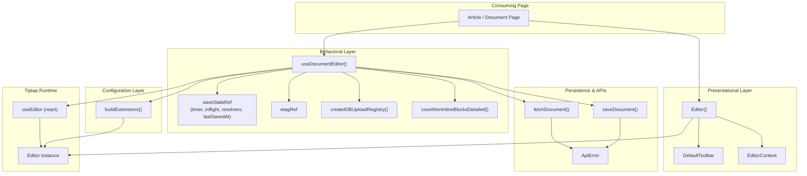
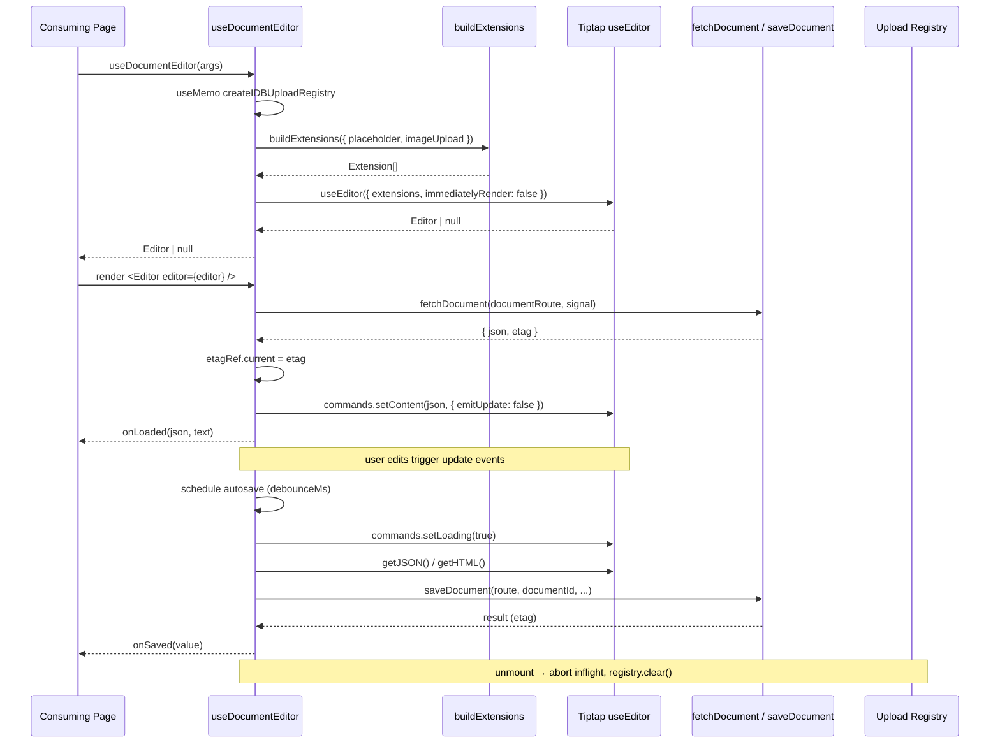
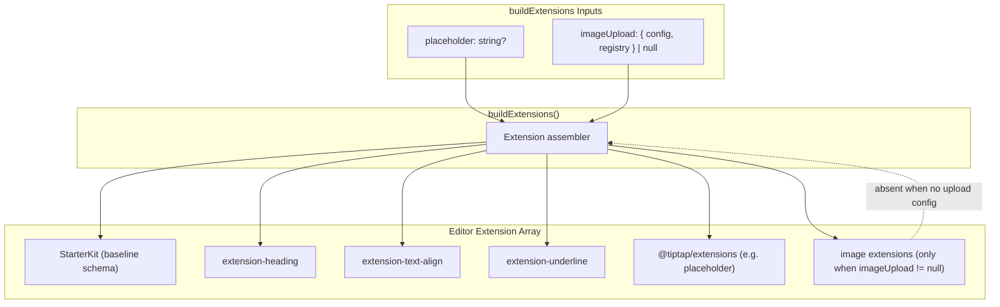
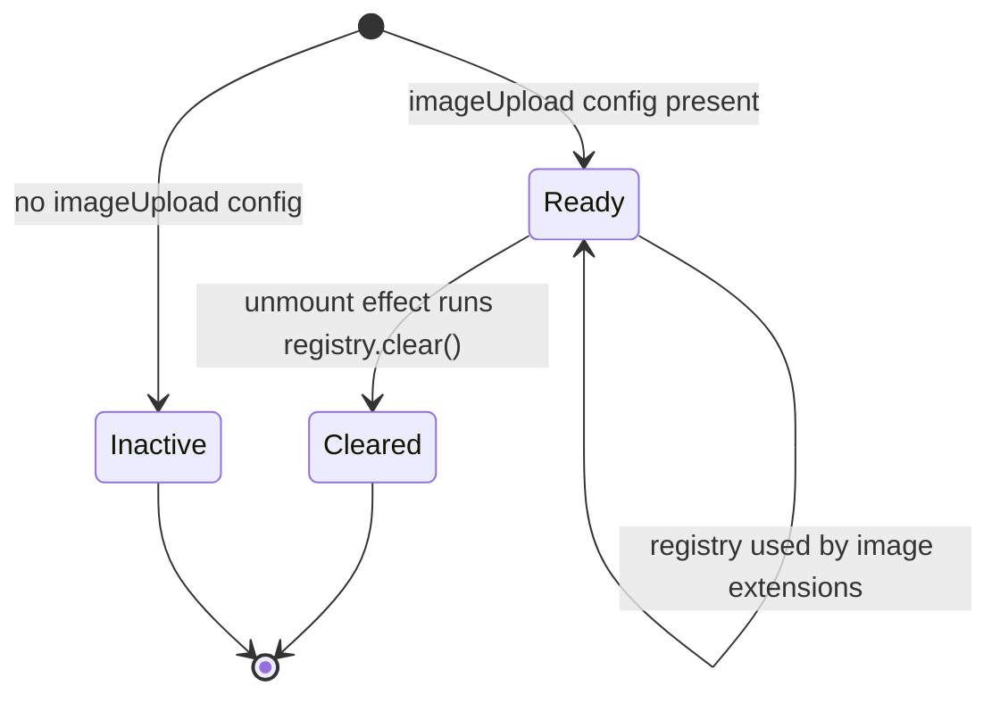
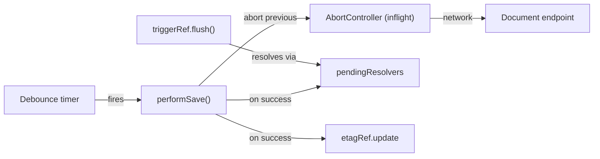

A React-based rich text editing subsystem built on Tiptap 3, combining a presentational `<Editor>` wrapper, a lifecycle-owning `useDocumentEditor` hook, and a modular extension builder that supports optional image uploads with IndexedDB-backed registry state.

## Purpose and Scope

This page documents the architecture of the Tiptap-based rich text editor that powers in-app document authoring across `ozeaon-v2`. It covers:

- The split between the **presentational** `Editor` component and the **behavioral** `useDocumentEditor` hook.
- The **extension pipeline** (`buildExtensions`) that assembles the Tiptap extension list from configuration.
- The **document lifecycle**: initial fetch → editor init → debounced autosave → teardown.
- **Autosave** semantics: debounce window, ETag-based skip-on-no-change, max-length gating, and the flush trigger exposed to parents.
- **Image upload** configuration and the IndexedDB upload registry.
- Error surfacing through `EditorErrorHandler` and the `ApiError` contract.

**Out of scope / sibling pages.** The concrete toolbar UI, document list pages, and the specific persistence endpoints (e.g. article content routes) are separate concerns. For the surrounding authoring pages and the API routes the editor talks to, see the sibling pages under the **Editor & Documents** section of this wiki. This page references those routes only as opaque `documentRoute` strings, since `useDocumentEditor` treats them as configuration rather than implementation.

## Overview

The editor is deliberately split into three cooperating layers, each with a narrow responsibility:

| Layer | Artifact | Responsibility |
|-------|----------|----------------|
| Presentational | `Editor.tsx` | Render toolbar + `EditorContent`, handle loading skeleton, accept toolbar overrides |
| Behavioral | `hooks/use-document-editor.ts` | Own the editor lifecycle: fetch, init, autosave, teardown, error reporting |
| Configuration | `extensions/BuildExtensions.tsx` | Compose the ordered extension list from runtime options |

The design intent is stated directly in the source: the `Editor` component is meant to *rarely change*, and extending the editor is done by adding extensions/nodes rather than modifying the component.

> "Presentational component. All behaviour lives in the editor instance and the hook that built it. This file should rarely change — extending the editor means adding extensions/nodes, not modifying this component."

The consuming page typically does two things: call the hook (`const editor = useDocumentEditor({...})`) and pass the result to the component (`<Editor editor={editor} />`). Everything else — toolbar state, save scheduling, upload state — is read from the editor instance itself via `useEditorState` + selectors, which keeps the component tree free of prop drilling.

Key concepts and terminology used throughout:

- **`Editor` (Tiptap)** — the imperative editor instance returned by `@tiptap/react`'s `useEditor`. All commands (`setContent`, `getJSON`, `setLoading`, `setEditable`) live here.
- **Extension** — a Tiptap plugin/node/mark that contributes schema, commands, and ProseMirror plugins. The editor's capabilities are *entirely* determined by the extension array.
- **`documentRoute`** — the full path to the document endpoint (e.g. `/api/articles/123/content`). Treated as an opaque string by the hook.
- **`documentId`** — reserved identifier forwarded to the save endpoint. The source notes it is currently forwarded but the persistence model may evolve (POST↔PATCH semantics).
- **ETag** — returned by the last successful save; used to skip redundant writes.
- **Upload registry** — an IndexedDB-backed store keyed per editor instance, cleared on unmount, that tracks in-flight/completed image blobs.

## Architecture

The subsystem connects a consuming page to Tiptap's React bindings, with the hook orchestrating persistence and uploads.



**Why this shape.** The hook is the single owner of the Tiptap instance, which means:

1. The `Editor` component can be rendered anywhere (modal, sidebar, full-screen) without duplicating lifecycle logic.
2. Save scheduling can read the *latest* editor state at save time via `editorInstance.getJSON()` rather than relying on React state that may be stale.
3. React re-renders caused by typing do not tear down and rebuild the editor, because the editor instance identity is managed by `useEditor`, whose dependency array is deliberately minimal (`[objectId, documentRoute, Boolean(imageUpload)]`).

### Loading Skeleton as an Explicit Interface State

When `editor` is `null` (i.e. before `useEditor` has produced an instance), the `Editor` component renders a fixed skeleton matching the final layout (a 12-unit toolbar bar plus a pulsing body). This is not a generic spinner; it mirrors the eventual geometry so the page does not shift when the editor mounts.

```tsx
if (!editor) {
  return (
    <div className={cn("overflow-hidden rounded-sm border", className)}>
      <div className="bg-bg-subtle h-12 border-b p-6" />
      <div className="bg-bg-subtle min-h-75 animate-pulse" />
    </div>
  );
}
```

> Source: [Editor.tsx](https://github.com/ozeaon/ozeaon-v2/blob/0a4f1a95824db87782f1221a4108019d174df3d9/src/components/tiptap/Editor.tsx#L31-L38)

### Toolbar Override Contract

The `toolbar` prop is a three-state switch rather than a simple boolean, which lets consumers opt into three behaviors without forking the component:

```tsx
type Props = {
  editor: TiptapEditor | null;
  /**
   * Override the default toolbar. Pass a ReactNode to render in its place,
   * or `false` to render no toolbar at all. When omitted, the default
   * toolbar is rendered.
   */
  toolbar?: ReactNode | false;
  className?: string;
  fullScreenToggle?: () => void;
};
```

> Source: [Editor.tsx](https://github.com/ozeaon/ozeaon-v2/blob/0a4f1a95824db87782f1221a4108019d174df3d9/src/components/tiptap/Editor.tsx#L8-L18)

The rendering logic resolves the tri-state in a single expression: `toolbar === false` renders nothing, a provided `ReactNode` replaces the default, and `undefined` falls through to `DefaultToolbar`. The `fullScreenToggle` callback is threaded into the default toolbar so full-screen control stays in the consumer's hands while the button lives in the toolbar.

```tsx
{toolbar === false
  ? null
  : (toolbar ?? (
      <DefaultToolbar
        toggleFullScreen={fullScreenToggle}
        editor={editor}
      />
    ))}
<EditorContent editor={editor} className="max-h-150 overflow-scroll" />
```

> Source: [Editor.tsx](https://github.com/ozeaon/ozeaon-v2/blob/0a4f1a95824db87782f1221a4108019d174df3d9/src/components/tiptap/Editor.tsx#L47-L55)

## Core Flow: Document Lifecycle

`useDocumentEditor` owns the full lifecycle "fetch → init → autosave → teardown". The flow below follows the actual sequencing in the source: instance creation, editable sync, initial load, and the debounced save scheduler.



### Editor Construction and SSR Safety

The editor is built with an explicit, minimal dependency array so that typing does not recreate the instance. `immediatelyRender: false` is required for Next.js server rendering — without it, Tiptap would attempt to render synchronously during SSR.

```tsx
// Build the editor. `immediatelyRender: false` is required for Next.js SSR.
const editor = useEditor(
  {
    extensions,
    content: "",
    immediatelyRender: false,
    editable: !disabled,
    onBlur: (e) => {
      if (isValidLength(e.editor.getText({ blockSeparator: " " }))) {
        onBlur?.(e.event as unknown as React.FocusEvent<HTMLInputElement>);
      }
    },
    editorProps: {
      attributes: {
        role: "textbox",
        "aria-label": "Rich Text Editor",
        "aria-multiline": "true",
        class:
          "max-w-none focus:outline-none min-h-80 px-6 py-4 prose prose-sm article-content-section",
      },
    },
  },
  [objectId, documentRoute, Boolean(imageUpload)],
);
```

> Source: [use-document-editor.ts](https://github.com/ozeaon/ozeaon-v2/blob/0a4f1a95824db87782f1221a4108019d174df3d9/src/components/tiptap/hooks/use-document-editor.ts#L152-L175)

Two details carry design intent:

- **`content: ""`** — the editor starts empty and is populated exclusively by the initial fetch. This avoids the classic controlled-content flicker/stale-content problems and ensures the loaded payload is the single source of truth on mount.
- **Accessibility attributes are set on the ProseMirror root**, not on a wrapper: `role="textbox"`, `aria-multiline="true"`, and a stable `aria-label`. The class list also attaches Tailwind Typography (`prose prose-sm`) plus an application-specific `article-content-section` hook used for document-scoped styling.

### Editable State Synchronization

`disabled` is a *live* property, so it is applied through a dedicated effect rather than being baked into the constructor. Flipping `disabled` re-runs the effect and calls `editor.setEditable(...)`, avoiding a full editor rebuild.

```tsx
useEffect(() => {
  if (!editor) return;
  editor.setEditable(!disabled);
}, [editor, disabled]);
```

> Source: [use-document-editor.ts](https://github.com/ozeaon/ozeaon-v2/blob/0a4f1a95824db87782f1221a4108019d174df3d9/src/components/tiptap/hooks/use-document-editor.ts#L177-L180)

### Initial Fetch and the "Not Dirty" Contract

The load effect creates its own `AbortController`, guards against cancellation and destroyed editors, and — critically — uses `onLoaded` rather than `onChanged` when populating content. The rationale is documented inline: syncing from the server must not mark the field dirty, otherwise autosave would fire on a document the user has not touched.

```tsx
const result = await fetchDocument(documentRoute, ctrl.signal);
if (cancelled || editor.isDestroyed) return;
etagRef.current = result.etag;
editor.commands.setContent(result.json, { emitUpdate: false });
// Use onLoaded (not onChanged) here — this is a sync from the server,
// not a user edit, and must not mark the field dirty.
onLoadedRef.current?.(
  result.json,
  editor.getText({ blockSeparator: " " }),
);
```

> Source: [use-document-editor.ts](https://github.com/ozeaon/ozeaon-v2/blob/0a4f1a95824db87782f1221a4108019d174df3d9/src/components/tiptap/hooks/use-document-editor.ts#L189-L198)

The `{ emitUpdate: false }` option is the second half of the same contract: the programmatic content set does not emit an `update` event, so the autosave scheduler is never armed by a load.

**Error handling on load** distinguishes three cases explicitly:

```tsx
} catch (e) {
  if (cancelled || (e as Error).name === "AbortError") return;
  // A 404 means no content has been saved yet — leave the editor empty.
  if (e instanceof ApiError && e.isNotFound) return;
  const msg = e instanceof Error ? e.message : "Failed to load document";
  const details = e instanceof ApiError ? e.details : undefined;
  reportError("document", msg, details);
}
```

> Source: [use-document-editor.ts](https://github.com/ozeaon/ozeaon-v2/blob/0a4f1a95824db87782f1221a4108019d174df3d9/src/components/tiptap/hooks/use-document-editor.ts#L199-L206)

- `AbortError` and the `cancelled` flag are silent (expected teardown/route change).
- `ApiError.isNotFound` is silent and leaves the editor empty — a first-time document has no content yet, which is not an error condition.
- Everything else is surfaced through `reportError`, which prefers an injected `onError` handler and falls back to a `sonner` toast.

Cleanup aborts the request and flips `cancelled` so a late response cannot write into a destroyed editor.

```tsx
return () => {
  cancelled = true;
  ctrl.abort();
};
```

> Source: [use-document-editor.ts](https://github.com/ozeaon/ozeaon-v2/blob/0a4f1a95824db87782f1221a4108019d174df3d9/src/components/tiptap/hooks/use-document-editor.ts#L208-L211)

## Autosave Engine

Autosave state is kept in a ref, not React state, precisely so the scheduler can be mutated without triggering re-renders — and so the debounce timer survives renders.

```tsx
// Refs for values the save scheduler needs without re-creating the editor.
const saveStateRef = useRef<{
  timer: ReturnType<typeof setTimeout> | null;
  inflight: AbortController | null;
  pendingResolvers: Array<() => void>;
  lastSavedAt: number;
}>({ timer: null, inflight: null, pendingResolvers: [], lastSavedAt: 0 });

// Tracks the etag returned by the last successful save to enable skip-on-no-change.
const etagRef = useRef<string | undefined>(undefined);
```

> Source: [use-document-editor.ts](https://github.com/ozeaon/ozeaon-v2/blob/0a4f1a95824db87782f1221a4108019d174df3d9/src/components/tiptap/hooks/use-document-editor.ts#L102-L111)

Each field encodes a specific concern:

| Field | Purpose |
|-------|---------|
| `timer` | The debounce handle; cleared/replaced on each keystroke |
| `inflight` | The `AbortController` of the currently running save, aborted before starting a newer one |
| `pendingResolvers` | Callbacks waiting for the round-trip to finish — how `triggerRef` resolves |
| `lastSavedAt` | Timestamp of the last successful save (bookkeeping/throttling) |
| `etagRef` | ETag of the last saved revision, enabling skip-on-no-change |

### performSave: Abort-Previous, Then Write

The actual save always reads the latest content from the live editor at call time, aborts any in-flight save, and sets the editor to a loading state for the duration of the round-trip.

```tsx
const performSave = useCallback(
  async (editorInstance: Editor, routeOverride?: string): Promise<void> => {
    logger.info("Saving rich text content...");
    const state = saveStateRef.current;
    state.inflight?.abort();
    const ctrl = new AbortController();
    state.inflight = ctrl;
    try {
      editorInstance.commands.setLoading(true);
      const json = editorInstance.getJSON();
      const html = editorInstance.getHTML();
      // The etag tracks the document at `documentRoute`, so it means nothing to
      // an override route pointing at a different record.
      const result = await saveDocument(
        routeOverride ?? documentRoute,
        documentId,
        // ... (see source for full argument list)
      );
      // ... (continues: etag update, onSaved callback, loading reset)
```

> Source: [use-document-editor.ts](https://github.com/ozeaon/ozeaon-v2/blob/0a4f1a95824db87782f1221a4108019d174df3d9/src/components/tiptap/hooks/use-document-editor.ts#L224-L240)

Design points worth calling out:

1. **Latest-state read**: `getJSON()` and `getHTML()` are called inside the save, not captured earlier. This means a save always serializes the newest document, even if the debounce fired while the user kept typing.
2. **Cancel-and-replace**: `state.inflight?.abort()` before creating the new controller guarantees at most one write is in flight, which prevents out-of-order writes racing to the same route.
3. **Route override semantics**: `routeOverride ?? documentRoute` exists so a caller can flush to a different route (e.g. publishing), but the inline comment warns that the stored ETag applies to `documentRoute` only — an override route has no valid ETag baseline, so skip-on-no-change must not be applied there.
4. **Both representations are sent**: JSON (canonical, for re-editing) and HTML (for rendering/SEO), so consumers don't need to re-serialize.

### Length Gating: Max Blocks the Save, Min Does Not

Autosave is gated by `isValidLength`, which enforces **max length only**. The accompanying comment explains the asymmetry: a minimum length is a *publish-time* constraint enforced in the article schema, so short work-in-progress drafts must still autosave.

```tsx
// Gates autosave on max length only — oversized content never reaches the server.
// Min length is a publish-time constraint (enforced in the article schema), not a
// save constraint, so short work-in-progress drafts still autosave.
const isValidLength = useCallback(
  (text: string) =>
    maxLength === undefined || text.trim().length <= maxLength,
  [maxLength],
);
```

> Source: [use-document-editor.ts](https://github.com/ozeaon/ozeaon-v2/blob/0a4f1a95824db87782f1221a4108019d174df3d9/src/components/tiptap/hooks/use-document-editor.ts#L133-L140)

The same predicate guards the `onBlur` callback, so blur is not reported for oversized content either.

### Teardown and Blob Hygiene

Unmounting cancels the debounce timer, aborts any in-flight save, and clears the upload registry (which is responsible for revoking/cleaning IndexedDB-backed blob state).

```tsx
// Cleanup on unmount: cancel inflight save, drop blob URLs.
useEffect(() => {
  const state = saveStateRef.current;
  return () => {
    if (state.timer) clearTimeout(state.timer);
    state.inflight?.abort();
    registry?.clear();
  };
}, [registry]);
```

> Source: [use-document-editor.ts](https://github.com/ozeaon/ozeaon-v2/blob/0a4f1a95824db87782f1221a4108019d174df3d9/src/components/tiptap/hooks/use-document-editor.ts#L214-L222)

### Stable Callbacks via Refs

Every consumer callback (`onError`, `onSaved`, `onChanged`, `onLoaded`) is mirrored into a ref that is refreshed on *every* render without a dependency array. This is the standard "latest ref" pattern and exists so the save scheduler can invoke current callbacks without being recreated (and without entering any dependency array that would rebuild the editor).

```tsx
const onErrorRef = useRef(onError);
// ...
useEffect(() => {
  onErrorRef.current = onError;
  onSavedRef.current = onSaved;
  onChangedRef.current = onChanged;
  onLoadedRef.current = onLoaded;
});
```

> Source: [use-document-editor.ts](https://github.com/ozeaon/ozeaon-v2/blob/0a4f1a95824db87782f1221a4108019d174df3d9/src/components/tiptap/hooks/use-document-editor.ts#L113-L122)

## Extension Pipeline

Editor capabilities come entirely from the extension array produced by `buildExtensions`, which is memoized on the inputs that actually change it. This is the designated extension point: to add an editor capability, add an extension here rather than editing the view or the hook.

```tsx
const extensions = useMemo(
  () =>
    buildExtensions({
      placeholder,
      imageUpload:
        imageUpload && registry ? { config: imageUpload, registry } : null,
    }),
  [imageUpload, registry, placeholder],
);
```

> Source: [use-document-editor.ts](https://github.com/ozeaon/ozeaon-v2/blob/0a4f1a95824db87782f1221a4108019d174df3d9/src/components/tiptap/hooks/use-document-editor.ts#L142-L150)

Two behaviors are encoded in this short block:

- **Image upload is conditional.** If no `imageUpload` config is supplied, or the registry could not be created, `imageUpload` is passed as `null` and the image extensions are omitted entirely. The editor is therefore fully functional without any upload backend.
- **All three inputs are memo dependencies.** `placeholder` changes the option object; `imageUpload` and `registry` are listed as separate deps even though `registry` is derived from `imageUpload`, because both participate in the construction of the upload option.

The package dependencies confirm the extension-based composition. Tiptap is pinned to `^3.31.3` across the ecosystem:

```json
"@tiptap/core": "^3.31.3",
"@tiptap/extension-heading": "^3.31.3",
"@tiptap/extension-text-align": "^3.31.3",
"@tiptap/extension-underline": "^3.31.3",
"@tiptap/extensions": "^3.31.3",
"@tiptap/react": "^3.31.3",
"@tiptap/starter-kit": "^3.31.3",
```

> Source: [package.json](https://github.com/ozeaon/ozeaon-v2/blob/0a4f1a95824db87782f1221a4108019d174df3d9/package.json#L56-L62)

`@tiptap/starter-kit` provides the baseline schema (paragraphs, bold/italic, lists, blockquotes, code, history, etc.), while `extension-heading`, `extension-text-align`, and `extension-underline` add the specific formatting capabilities the application exposes. `@tiptap/extensions` is the aggregate package for Tiptap's first-party add-ons (e.g. placeholder, character count), and `@tiptap/pm` supplies the underlying ProseMirror libraries that `@tiptap/core` builds on.

### Extension Composition Diagram



The dotted edge signals the conditional inclusion: when `imageUpload` resolves to `null`, the image extensions are not part of the returned array, so no upload commands or registry dependencies exist at runtime.

### Adding an Extension

Because the extension array is the only lever, adding capability is a localized change:

1. Add the dependency to `package.json` at the same `^3.31.3` line as the rest of the Tiptap packages.
2. Include it in `buildExtensions`, conditionally if it depends on runtime config (as image upload does).
3. If it needs configuration that varies per consumer, thread a new option from `UseDocumentEditorArgs` through the memoized `buildExtensions` call.
4. If it exposes toolbar controls, read their state in the toolbar via `useEditorState` + selectors rather than adding props to `Editor`.

## Image Upload Configuration

Image upload is optional and supplied through `imageUpload?: ImageUploadConfig`. The hook derives a per-instance IndexedDB registry from that config:

```tsx
// Stable upload registry per editor instance. Cleared on unmount.
const registry = useMemo(
  () =>
    imageUpload ? createIDBUploadRegistry("OZNArticleImagesDatabase") : null,
  [imageUpload],
);
```

> Source: [use-document-editor.ts](https://github.com/ozeaon/ozeaon-v2/blob/0a4f1a95824db87782f1221a4108019d174df3d9/src/components/tiptap/hooks/use-document-editor.ts#L95-L100)

Design intent:

- **Per-instance registry.** The registry is tied to the hook instance and cleared in the unmount effect. Two editors open simultaneously (e.g. side-by-side drafts) do not share upload bookkeeping.
- **Scoped database name.** `"OZNArticleImagesDatabase"` names the IndexedDB store, so upload state survives across editor remounts but remains isolated from other browser-stored state.
- **`useMemo` keyed on `imageUpload`** means the registry is recreated only when the config object identity changes — which is why the type documentation insists the reference must be stable.

### Upload Registry Lifecycle



The `Ready → Cleared` transition is the only teardown path, and it runs unconditionally in the unmount cleanup alongside timer cancellation and save abortion.

## API Reference

### `useDocumentEditor(args: UseDocumentEditorArgs): Editor | null`

Owns the editor lifecycle: fetch → init → autosave → teardown. Returns the Tiptap `Editor` instance, or `null` while the instance has not yet been produced (the `Editor` component renders its skeleton in this case).

> Source: [use-document-editor.ts](https://github.com/ozeaon/ozeaon-v2/blob/0a4f1a95824db87782f1221a4108019d174df3d9/src/components/tiptap/hooks/use-document-editor.ts#L69-L76)

**Parameters** (all on `UseDocumentEditorArgs`):

| Parameter | Type | Default | Description |
|-----------|------|---------|-------------|
| `disabled` | `boolean` | — | Applied via `editor.setEditable(!disabled)`; live-updates without rebuilding |
| `objectId` | `string` | — | Owner record ID (e.g. `articleId`). Encoded into `documentRoute` by the consumer |
| `documentId` | `string` | *(required)* | Forwarded to the save endpoint; reserved for future routing/revision semantics and POST↔PATCH switching |
| `documentRoute` | `string` | *(required)* | Full path to the document endpoint, e.g. `/api/articles/123/content` |
| `imageUpload` | `ImageUploadConfig` | — | Image upload config. **Reference must be stable** |
| `debounceMs` | `number` | `30000` | Debounce window for autosave; tuned for object-storage rewrites |
| `saveMethod` | `"POST" \| "PATCH"` | `"PATCH"` | Method used by autosave once the doc exists; use `"POST"` for first save |
| `onSaved` | `(value: unknown) => void` | — | Called after every successful debounced save |
| `onLoaded` | `(value: unknown, text: string) => void` | — | Called after initial document load |
| `onChanged` | `(value: string \| null) => void` | — | Called after every editor `update` event |
| `onBlur` | `React.FocusEventHandler<HTMLInputElement>` | — | Forwarded blur handler, gated on length validity |
| `onError` | `EditorErrorHandler` | — | Surfaces fetch/save/upload/delete errors. Defaults to `notify.error` |
| `triggerRef` | `RefObject<SaveTrigger \| null>` | — | Parent-held ref to force-flush the pending save (e.g. on form submit); resolves once the round-trip completes |
| `placeholder` | `string` | — | Passed into `buildExtensions` |
| `minLength` | `number` | — | Minimum trimmed text length required to persist a save (autosave and flush) |
| `maxLength` | `number` | — | Maximum trimmed text length allowed to persist a save (autosave and flush) |

> Source: [use-document-editor.ts](https://github.com/ozeaon/ozeaon-v2/blob/0a4f1a95824db87782f1221a4108019d174df3d9/src/components/tiptap/hooks/use-document-editor.ts#L26-L65)

**Returns:** `Editor | null` — the Tiptap editor instance, or `null` before it exists.

**Notes on defaults:** `debounceMs` defaults to `30000` ms (30 seconds), explicitly "tuned for object storage rewrites" — a longer window amortizes the cost of writing whole-object content. `saveMethod` defaults to `"PATCH"`, with `"POST"` intended for the first save of a document that does not yet exist.

### `Editor(props)` component

```tsx
export function Editor({
  editor,
  toolbar,
  className,
  fullScreenToggle,
}: Props) {
```

> Source: [Editor.tsx](https://github.com/ozeaon/ozeaon-v2/blob/0a4f1a95824db87782f1221a4108019d174df3d9/src/components/tiptap/Editor.tsx#L25-L30)

| Prop | Type | Default | Description |
|------|------|---------|-------------|
| `editor` | `TiptapEditor \| null` | *(required)* | The instance from `useDocumentEditor`. `null` renders the loading skeleton |
| `toolbar` | `ReactNode \| false` | *omitted* | Provide a node to replace `DefaultToolbar`, `false` to render none, omit for the default |
| `className` | `string` | — | Merged onto the outer container via `cn(...)` |
| `fullScreenToggle` | `() => void` | — | Threaded into `DefaultToolbar` as `toggleFullScreen` |

## Failure Modes, Edge Cases & Concurrency

### Error Reporting Contract

`reportError` centralizes error surfacing with a two-tier fallback: an injected `onError` handler wins; otherwise a `sonner` toast is shown. The `scope` parameter distinguishes document-level from image-level failures, letting consumers route them differently (e.g. inline field error vs. toast).

```tsx
const reportError = (
  scope: "document" | "image",
  message: string,
  description?: string,
) => {
  if (onErrorRef.current) onErrorRef.current({ scope, message, description });
  else toast.error(message, { description });
};
```

> Source: [use-document-editor.ts](https://github.com/ozeaon/ozeaon-v2/blob/0a4f1a95824db87782f1221a4108019d174df3d9/src/components/tiptap/hooks/use-document-editor.ts#L124-L131)

Because `onErrorRef` is refreshed every render, `reportError` always calls the current handler even though it is defined before the callback props are updated.

### Failure Mode Matrix

| Condition | Handling | Where |
|-----------|----------|-------|
| Load request aborted (route change / unmount) | Silent return via `cancelled` flag or `AbortError` name check | load effect |
| Load returns 404 | Silent; editor stays empty (no content saved yet) | load effect |
| Editor destroyed before load resolves | Guarded by `editor.isDestroyed` | load effect |
| Oversized content on blur | `onBlur` not invoked (`isValidLength` fails) | editor config |
| Oversized content on autosave | Save not persisted | `isValidLength` gate |
| Save already in flight | Previous save aborted before new one starts | `performSave` |
| Unmount with pending debounce | `clearTimeout(state.timer)` | cleanup effect |
| Unmount with in-flight save | `state.inflight?.abort()` | cleanup effect |
| Unmount with image uploads | `registry.clear()` | cleanup effect |
| No `imageUpload` provided | Image extensions omitted; editor still functional | `buildExtensions` call |

### Concurrency Model

There are three concurrent actors to reason about:



1. **Autosave vs. autosave** — serialized by abort-and-replace. A newer save wins; the older write is cancelled rather than allowed to complete out of order.
2. **Autosave vs. load** — separated by lifecycle phase: the load effect runs once on `[editor, documentRoute, objectId]`, and the load sets content with `emitUpdate: false` so it cannot arm the autosave scheduler.
3. **Autosave vs. flush** — `pendingResolvers` collects callbacks that resolve when the round-trip completes, which is how `triggerRef` (used on form submit) can await the save without polling.

### Edge Cases to Handle When Consuming

- **First save needs `saveMethod: "POST"`.** The default `"PATCH"` assumes the document exists; consumers creating new documents must override, or rely on the 404-tolerant load path and change the method once a document is created.
- **`imageUpload` identity must be stable.** A new object literal each render recreates the registry and forces extension rebuilds. Alias it with `useMemo`/module constant.
- **Blur is suppressed for invalid length**, so consumers must not rely on `onBlur` as a guaranteed dirty-marking signal for oversized content.
- **Route override loses ETag semantics.** If you flush to a different route, the skip-on-no-change optimization based on `etagRef` is not valid for that route.

## Performance & Operational Notes

- **30-second debounce.** `debounceMs = 30000` is deliberately long. Combined with ETag-based skip-on-no-change, the editor minimizes whole-object rewrite traffic, which matters when document content is stored in object storage.
- **No re-render on save scheduling.** All scheduler state lives in refs (`saveStateRef`, `etagRef`), so typing and save bookkeeping do not trigger React renders.
- **Callback stability.** The latest-ref pattern for `onLoaded`/`onChanged`/`onSaved`/`onError` prevents consumer callbacks from being added to dependency arrays, which would otherwise rebuild the editor.
- **Bounded editor rebuilds.** The `useEditor` dependency array is only `[objectId, documentRoute, Boolean(imageUpload)]` — note the Boolean coercion, so passing a new-but-equivalent upload object does not rebuild the editor even though it does recreate the registry.
- **Loading indicator instead of blocking.** `editorInstance.commands.setLoading(true)` marks the editor as busy during a save rather than disabling input, so typing remains responsive through the round-trip.
- **Scroll and size containment.** The editor content area is capped at `max-h-150 overflow-scroll`, and the outer container is `w-full max-w-full overflow-hidden` so long documents scroll internally rather than growing the page.

## Extension Points Summary

| Extension Point | Mechanism | Safe Change |
|-----------------|-----------|-------------|
| New editor capability | Add extension to `buildExtensions` | ✅ Designed for this |
| Configurable capability | Thread option through `UseDocumentEditorArgs` → `buildExtensions` | ✅ Follow the `imageUpload` pattern |
| Custom toolbar | `toolbar` prop (`ReactNode` or `false`) | ✅ Explicitly supported |
| Blocking toolbar props | `Editor` renders whatever node is passed | ✅ No hook changes needed |
| Custom save errors | `onError: EditorErrorHandler` | ✅ Overrides toast fallback |
| Force save on submit | `triggerRef` (`SaveTrigger`) | ✅ Resolves after round-trip |
| Changing `Editor.tsx` | — | ⚠️ Source explicitly states this file should rarely change |

## Related Links

- [Editor.tsx](https://github.com/ozeaon/ozeaon-v2/blob/0a4f1a95824db87782f1221a4108019d174df3d9/src/components/tiptap/Editor.tsx) — presentational editor wrapper
- [use-document-editor.ts](https://github.com/ozeaon/ozeaon-v2/blob/0a4f1a95824db87782f1221a4108019d174df3d9/src/components/tiptap/hooks/use-document-editor.ts) — lifecycle hook (fetch, init, autosave, teardown)
- [BuildExtensions.tsx](https://github.com/ozeaon/ozeaon-v2/blob/0a4f1a95824db87782f1221a4108019d174df3d9/src/components/tiptap/extensions/BuildExtensions.tsx) — extension composition pipeline
- [Toolbar.tsx](https://github.com/ozeaon/ozeaon-v2/blob/0a4f1a95824db87782f1221a4108019d174df3d9/src/components/tiptap/toolbar/Toolbar.tsx) — `DefaultToolbar` implementation
- [package.json](https://github.com/ozeaon/ozeaon-v2/blob/0a4f1a95824db87782f1221a4108019d174df3d9/package.json#L56-L62) — Tiptap 3.31.3 dependency set

> Note: `lib/api` (`fetchDocument`, `saveDocument`), `lib/types` (`EditorErrorHandler`, `ImageUploadConfig`, `SaveTrigger`), `hooks/upload-registry`, and `hooks/block-counter` are referenced by the hook but were not read within this page's source budget. Their behavior is described only to the extent evidenced by call sites on this page.
