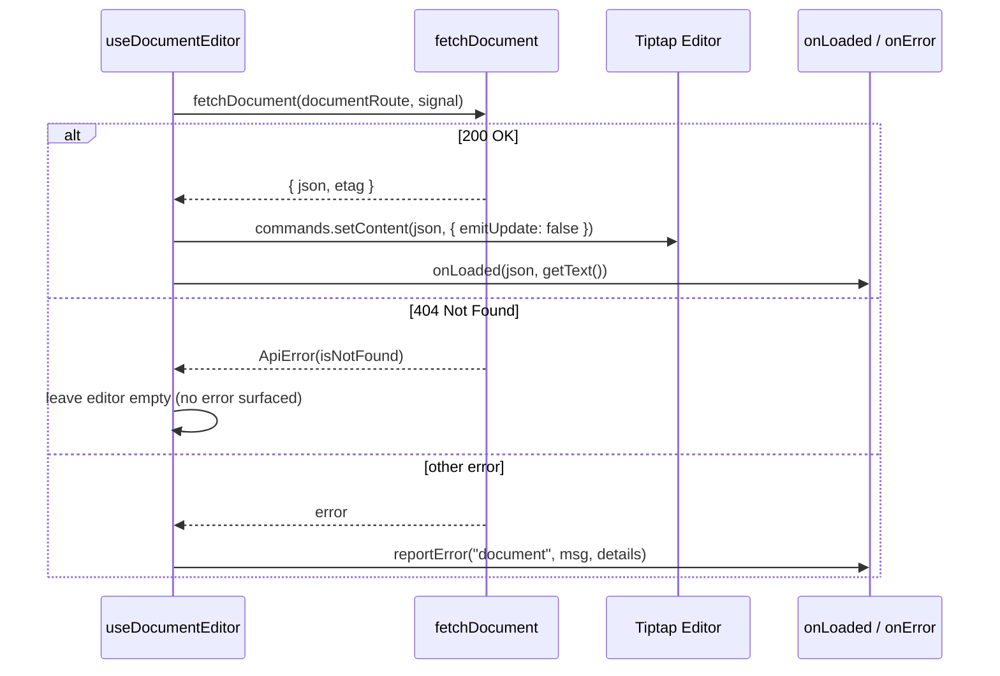

The rich-text editing subsystem is built on Tiptap 3.x (`@tiptap/core`, `@tiptap/react`, `@tiptap/starter-kit`) with a custom extension layer for headings, images, uploads, drag/paste handling, and loading state. The public entry point is `src/components/tiptap/index.ts`. For the toolbar, selectors, and upload registry, see [Toolbar, Upload Registry & Editor API](../toolbar-and-api/); for the app consumer, see [components/tiptap](../../components/tiptap/).

## Overview

The subsystem is split into three responsibilities so each can evolve independently:

| Layer | Artifact | Responsibility |
|---|---|---|
| **Engine** | `useDocumentEditor` | Owns the Tiptap lifecycle: build → init → autosave → teardown |
| **Composition** | `buildExtensions` | Builds the immutable extension array for a given session mode |
| **Presentation** | `Editor` | Renders `EditorContent` plus a toolbar slot; contains no behaviour |

The design intent stated in the shell component: "extending the editor means adding extensions/nodes, not modifying this component." New capability arrives through `buildExtensions`, not by editing render code. The `Editor` component has no dependency on `buildExtensions` — the render shell is unaware of which extensions exist.

Two concepts recur throughout the subsystem:

1. **Session mode for images.** The `imageUpload` argument to `buildExtensions` is a three-state discriminant: `{ config, registry }` (uploads enabled), `"render"` (SSR/read-only serialization), or `null` (editor mode with uploads disabled). This tri-state lets a single builder serve all three paths without branching inside node definitions.
2. **Stable references as correctness.** The upload registry is `useMemo`-stabilized, the extension array depends only on `[imageUpload, registry, placeholder]`, and the editor is recreated only on `[objectId, documentRoute, Boolean(imageUpload)]`.

## Architecture

The consumer ([`InputContent`](https://github.com/ozeaon/ozeaon-v2/blob/0a4f1a95824db87782f1221a4108019d174df3d9/src/components/ui/forms/hook-form/InputContent.tsx), the one app call site) never touches Tiptap directly. It passes the editor instance produced by `useDocumentEditor` to the `Editor` component; the toolbar reads state from that same instance.

Custom artefacts live under `extensions/` in three Tiptap taxonomy categories:

| Category | Artefacts |
|---|---|
| Nodes | `CustomHeadingNode`, `ImageNode` / `ImageNodeView`, `ImageUploadNode` / `ImageUploadNodeView` |
| Plugins | `ImageDropPaste` |
| Extensions | `LoadingState` |

The node/view split is conventional Tiptap: each interactive node declares a NodeView component so the node's rendered DOM is a React component rather than a ProseMirror-generated element.

## Extension Composition — `buildExtensions`

[`buildExtensions`](https://github.com/ozeaon/ozeaon-v2/blob/0a4f1a95824db87782f1221a4108019d174df3d9/src/components/tiptap/extensions/BuildExtensions.ts) is a pure function that returns `AnyExtension[]` from session mode and placeholder text. It configures StarterKit to drop capabilities it owns itself:

- **`heading: false` + `CustomHeadingNode`** — limits heading levels to 2, 3, and 4 (note: the doc comment says 1–3; the code configures `[2, 3, 4]`). A heading with an unsupported level falls back to h2. Disabling the built-in and registering a custom node keeps the schema authoritative.
- **`underline: false` + explicit `Underline`** — makes the mark's presence explicit at the composition site; it survives StarterKit default changes.
- **`code`, `codeBlock`, `horizontalRule`, `trailingNode: false`** — schema-level guarantees, not UI-level restrictions. Content containing these cannot be authored.
- **`dropcursor`** — restyled to `var(--text-primary)` at 1px so the drag affordance matches the theme.
- **`TextAlign`** — applied only to `heading` and `paragraph`, so container nodes never receive alignment attributes. `defaultAlignment: undefined` keeps serialized JSON minimal.

`ImageNode` is always registered. `ImageUploadNode` and `ImageDropPaste` register only when `imageUpload` is a non-`"render"` object. A document saved with images therefore always deserializes correctly in all three session modes, while the upload machinery is never instantiated in render-only or upload-less paths.

## Editor Lifecycle — `useDocumentEditor`

[`useDocumentEditor`](https://github.com/ozeaon/ozeaon-v2/blob/0a4f1a95824db87782f1221a4108019d174df3d9/src/components/tiptap/hooks/use-document-editor.ts) owns fetch → init → autosave → teardown and returns `Editor | null`. Key decisions:

- **`immediatelyRender: false`** — required for Next.js SSR; ProseMirror needs a live DOM.
- **`content: ""`** — the editor always starts empty and hydrates asynchronously via `setContent(..., { emitUpdate: false })`, preventing the hydration from triggering autosave.
- **Dependency array `[objectId, documentRoute, Boolean(imageUpload)]`** — the editor is rebuilt only on document identity or upload availability changes. Callback freshness is handled by ref-mirroring in an effect with no dependency array, so inline arrow functions do not tear down the editor.
- **`editable` is updated separately** via `setEditable(!disabled)` so toggling `disabled` does not rebuild the editor.
- **Upload registry** is created as `createIDBUploadRegistry("OZNArticleImagesDatabase")`. All editor instances share that database name, and `clear()` on unmount wipes the store for all of them.

## Initial Document Load

Content hydration runs in a separate effect from editor construction, keeping the build synchronous and the fetch cancellable:

Four correctness concerns encoded here: double-guard against staleness (`cancelled` boolean + `editor.isDestroyed`); `emitUpdate: false` to prevent autosave loops on load; 404 treated as "empty document" not an error; `onLoaded` not `onChanged` so the form field is not marked dirty.

## Save Path

The debounce default is 30 s, tuned for object-storage whole-document rewrites. Each save captures both `getJSON()` (canonical, re-editable) and `getHTML()` (for read paths). The scheduler state lives in `saveStateRef` so scheduling never re-creates the editor.

Key behaviours:

- **Latest-state-at-call-time** — the editor JSON is read when the save runs, so a burst of edits collapses to a single current write.
- **Abort-previous** — any prior in-flight save is aborted before starting a new one; at most one save is in flight at a time, so requests cannot arrive out of order.
- **`setLoading(true)`** is a `LoadingState` command, so the editor's own state drives the in-flight indicator rather than an external React flag.
- **`maxLength` gates saves; `minLength` does not** — oversized content never reaches the server. `minLength` is declared on `UseDocumentEditorArgs` but is not read by the hook; minimum length is enforced by the article schema at publish time.
- **`flush(routeOverride)`** — clears the timer, waits for any in-flight save, then saves to `routeOverride` without using the etag. This is how `InputContent.save(id)` persists a body for a record created after the editor mounted.
- **ETag skip-on-no-change** — the etag from the last successful save is sent on subsequent saves. Whether the server skips the write is up to the server; the hook does not guarantee a skip.

## Teardown

On unmount: clears the debounce timer, aborts any in-flight request, and calls `registry.clear()`. The cleanup also runs when the registry identity changes (a session-mode switch).

## Failure Modes & Edge Cases

- **Stale fetch** — both `cancelled` boolean and `editor.isDestroyed` are checked before calling `setContent`.
- **Hydration loop** — `emitUpdate: false` prevents autosave from firing on load.
- **Concurrent saves** — `state.inflight?.abort()` before each new save; newest write wins.
- **Unmount during debounce** — `clearTimeout(state.timer)` discards the pending save.
- **Registry leaks** — `registry.clear()` releases IndexedDB storage and blob URLs on unmount and on registry identity change.
- **No `onError` supplied** — `reportError` falls back to `toast.error`; errors always surface somewhere.
- **Partial config** — if `imageUpload` is set but the registry failed, the builder receives `null` and degrades to upload-less mode.
- **Image deletion is server-gated** — `imageDeleteRequested` fires on Backspace/Delete, the node view shows a confirmation overlay, and the node is removed only after the server DELETE succeeds.

## Extension Points

1. **Add an extension to `buildExtensions`** — the primary path; no UI changes required. Register nodes before plugins that depend on them.
2. **Swap a StarterKit feature** — `StarterKit.configure({ <feature>: false })` plus an explicit import, as done for `heading` and `underline`.
3. **Override the toolbar** — pass a `ReactNode` to `<Editor toolbar={...} />`, or `false` for no toolbar.
4. **Inject error handling per scope** — `onError` receives `{ scope: "document" | "image" }` so consumers can route failures differently.
5. **Session-conditional capability** — express new conditional behaviour as a state of the `imageUpload` discriminant rather than branching inside a node, to keep SSR and read-only paths free of transient nodes.
6. **External commands** — expose callable behaviour through a standalone Tiptap command extension (the `LoadingState` / `setLoading` pattern), not as a prop threaded through `Editor`.

## Related Links

- [Editor.tsx](https://github.com/ozeaon/ozeaon-v2/blob/0a4f1a95824db87782f1221a4108019d174df3d9/src/components/tiptap/Editor.tsx)
- [BuildExtensions.ts](https://github.com/ozeaon/ozeaon-v2/blob/0a4f1a95824db87782f1221a4108019d174df3d9/src/components/tiptap/extensions/BuildExtensions.ts)
- [use-document-editor.ts](https://github.com/ozeaon/ozeaon-v2/blob/0a4f1a95824db87782f1221a4108019d174df3d9/src/components/tiptap/hooks/use-document-editor.ts)
- [CustomHeadingNode.ts](https://github.com/ozeaon/ozeaon-v2/blob/0a4f1a95824db87782f1221a4108019d174df3d9/src/components/tiptap/extensions/nodes/CustomHeadingNode.ts), [ImageNode.ts](https://github.com/ozeaon/ozeaon-v2/blob/0a4f1a95824db87782f1221a4108019d174df3d9/src/components/tiptap/extensions/nodes/ImageNode.ts), [ImageUploadNode.ts](https://github.com/ozeaon/ozeaon-v2/blob/0a4f1a95824db87782f1221a4108019d174df3d9/src/components/tiptap/extensions/nodes/ImageUploadNode.ts)
- [ImageNodeView.tsx](https://github.com/ozeaon/ozeaon-v2/blob/0a4f1a95824db87782f1221a4108019d174df3d9/src/components/tiptap/extensions/nodes/ImageNodeView.tsx), [ImageUploadNodeView.tsx](https://github.com/ozeaon/ozeaon-v2/blob/0a4f1a95824db87782f1221a4108019d174df3d9/src/components/tiptap/extensions/nodes/ImageUploadNodeView.tsx)
- [ImageDropPaste.ts](https://github.com/ozeaon/ozeaon-v2/blob/0a4f1a95824db87782f1221a4108019d174df3d9/src/components/tiptap/extensions/plugins/ImageDropPaste.ts), [LoadingState.ts](https://github.com/ozeaon/ozeaon-v2/blob/0a4f1a95824db87782f1221a4108019d174df3d9/src/components/tiptap/extensions/extensions/LoadingState.ts)
- [upload-registry.ts](https://github.com/ozeaon/ozeaon-v2/blob/0a4f1a95824db87782f1221a4108019d174df3d9/src/components/tiptap/hooks/upload-registry.ts), [api.ts](https://github.com/ozeaon/ozeaon-v2/blob/0a4f1a95824db87782f1221a4108019d174df3d9/src/components/tiptap/lib/api.ts), [types.ts](https://github.com/ozeaon/ozeaon-v2/blob/0a4f1a95824db87782f1221a4108019d174df3d9/src/components/tiptap/lib/types.ts)
- [README.md](https://github.com/ozeaon/ozeaon-v2/blob/0a4f1a95824db87782f1221a4108019d174df3d9/src/components/tiptap/README.md)
- Toolbar, selectors, upload registry — [Toolbar, Upload Registry & Editor API](../toolbar-and-api/)
- App consumer — [components/tiptap](../../components/tiptap/)
