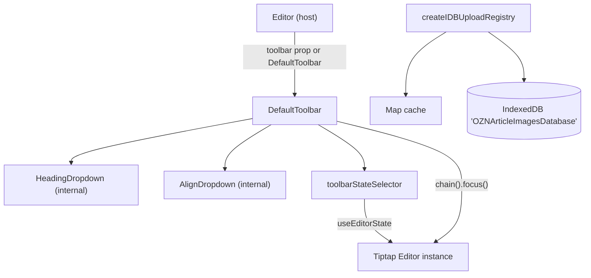

The consumer-facing tooling layer of the Tiptap editor package: the default toolbar and its sub-components, the aggregate state selectors that drive it, the IndexedDB-backed upload registry that keeps `File` objects out of ProseMirror state, and the curated public API exported from [`src/components/tiptap/index.ts`](https://github.com/ozeaon/ozeaon-v2/blob/0a4f1a95824db87782f1221a4108019d174df3d9/src/components/tiptap/index.ts). For the editor lifecycle and extension architecture, see [Tiptap Editor Core & Extensions](../tiptap-core/); for the app consumer, see [components/tiptap](../../components/tiptap/).

## Overview

Two design themes dominate this layer:

1. **Single-subscription state aggregation.** Rather than each toolbar button subscribing independently (which would cause N re-renders per keystroke for N buttons), the toolbar uses one `useEditorState` call with `toolbarStateSelector`, returning a flat object of primitives.
2. **Serialization discipline for binary data.** `File` objects cannot survive ProseMirror node attributes or JSON snapshots, so the upload registry externalizes them behind string `tempId` handles with precise object-URL lifecycle management.

The barrel comment at the top of `index.ts` makes the stability contract explicit: "Public surface. Keep this list curated — anything not exported here is internal and may change without notice."

## Architecture

## Toolbar

[`DefaultToolbar`](https://github.com/ozeaon/ozeaon-v2/blob/0a4f1a95824db87782f1221a4108019d174df3d9/src/components/tiptap/toolbar/Toolbar.tsx) renders `role="toolbar"` with `aria-label="Editor toolbar"`. It contains a heading dropdown (paragraph, H2, H3, H4), undo/redo, bold/italic/underline/strikethrough, an alignment dropdown (left/center/right/justify), blockquote, bullet list, ordered list, an "Add image" button (shown only when `imagesEnable`), an optional full-screen toggle, and a spinner driven by the `loadingStateChange` event.

Every command goes through `editor.chain().focus()`. The `.focus()` call is what guarantees the command applies at the document selection even after the pointer moved onto a toolbar button and blurred the editor.

Loading state is tracked via `useEffect` / `editor.on("loadingStateChange", ...)` rather than through `toolbarStateSelector`, because it is event-driven rather than derived from document state.

Both `active` and `disabled` on undo/redo bind to the same `canUndo`/`canRedo` flag, so a button is never styled active while unclickable.

`HeadingDropdown` and `AlignDropdown` are internal sub-components. Level `0` in `HeadingDropdown` calls `setParagraph()`, so the dropdown doubles as a body-text reset without a separate button. `AlignDropdown` gates on both `!editor.isEditable` and `!state.canAlign`; its alignment argument type is derived from the live schema (`typeof editor.schema.marks.textAlign`) rather than hard-coded, so the type stays consistent with the installed extension. Passing `undefined` as the alignment switches to `unsetTextAlign()`.

[`ToolbarButton`](https://github.com/ozeaon/ozeaon-v2/blob/0a4f1a95824db87782f1221a4108019d174df3d9/src/components/tiptap/toolbar/ToolbarButton.tsx) is a styled shadcn `Button` that sets `aria-label`, `title`, and `aria-pressed` from its `label` and `active` props. `ToolbarSeparator` is a 1px vertical divider with no props.

The `Editor` host component accepts a `toolbar` prop with three states: a `ReactNode` to replace `DefaultToolbar`, `false` to suppress the toolbar entirely, or `undefined` (omitted) to use `DefaultToolbar`. The code tests `=== false` before the `??` fallback to keep the `false` and `undefined` cases distinct.

## Toolbar Selectors

[`toolbarStateSelector`](https://github.com/ozeaon/ozeaon-v2/blob/0a4f1a95824db87782f1221a4108019d174df3d9/src/components/tiptap/toolbar/selectors.ts) returns a fixed-shape object of primitives — booleans, numbers — so `useEditorState`'s shallow comparison skips re-renders when nothing changed. Nested objects or arrays would compare by reference and cause false-positive re-renders on every transaction.

The object distinguishes two Tiptap query mechanisms:

- **Active state** (`e.isActive(...)`) — whether a mark/node is currently applied at the selection: `bold`, `italic`, `h2`, `alignLeft`, `isAligned`, etc.
- **Capability** (`e.can().chain()....run()`) — whether a command would succeed without dispatching: `canUndo`, `canBold`, `canAlign`, etc.

`imagesEnable` is a guarded capability probe: it first checks that `insertImageUploadEmpty` exists on the chain before invoking it. Because the selector runs on every editor transaction, an unguarded call to a missing command would crash the toolbar for any editor built without the image extension. This defensiveness is a direct consequence of `buildExtensions` being exported so consumers can compose their own kit.

`characterCount` reads `e.storage.characterCount?.characters()` via optional chaining. `buildExtensions` does not register a CharacterCount extension, so this value is always `undefined`.

`ToolbarState` is `ReturnType<typeof toolbarStateSelector>`, so the type stays automatically in sync with the selector body.

Three composable factory selectors are exported for custom toolbars:

- **`isMarkActive(mark)`** — returns a selector for `editor.isActive(mark)`.
- **`isNodeActive(node, attrs?)`** — accepts optional attribute constraints, e.g. `{ level: 2 }` to check a specific heading level.
- **`canRunChain(fn)`** — `fn` receives a simulation chain (`editor.can().chain().focus()`) and is wrapped in `try/catch`, returning `false` if the command throws. This keeps a missing-extension command from breaking toolbar rendering.

## Upload Registry

ProseMirror node attrs cannot hold `File` objects — they must serialize to JSON. Instead, each upload node carries a `tempId` string and the file lives in [`upload-registry.ts`](https://github.com/ozeaon/ozeaon-v2/blob/0a4f1a95824db87782f1221a4108019d174df3d9/src/components/tiptap/hooks/upload-registry.ts): an IndexedDB object store (`uploads`) with an in-memory `Map` cache of `{ file, previewUrl }`.

The registry is created once per editor session with a hard-coded database name: `createIDBUploadRegistry("OZNArticleImagesDatabase")`. Because every editor instance shares that name, `clear()` on unmount wipes the store for all simultaneously-open editors.

Key behaviours:

- **`set(tempId, file)`** — creates the object URL and writes the cache entry before awaiting IndexedDB, so an immediate `get` hits the cache and does not create a duplicate URL.
- **`get(tempId)`** — cache-first; on a miss it reconstructs the entry from IndexedDB and creates a new object URL. This is what enables restoring upload state after a page reload.
- **`release(tempId)`** — revokes the URL, removes the cache entry, and deletes the IDB record.
- **`clear()`** — revokes all cached URLs and clears the store; called on editor unmount.
- **`keys()`** — returns all persisted `tempId`s. This method is currently unused; reload recovery is not wired up.

`createTempId()` returns `tmp_{base36 timestamp}_{base36 counter}`. The module-level counter guarantees uniqueness for multiple files added in the same millisecond; the timestamp component keeps ids loosely ordered for debugging.

## Failure Modes & Edge Cases

- **Absent extension** — `canRunChain` wraps in `try/catch`; `characterCount` uses optional chaining. Both degrade to `false`/`undefined` rather than throwing during a transaction.
- **Object URL lifetime** — `get` on a cache miss creates a new URL and caches it, so `release`/`clear` can revoke it. Any URL not held in the cache is unreachable and unrevocable — which is why `get` always stores what it creates.
- **IndexedDB failure** — a failed `indexedDB.open` rejects `ready`, which rejects all subsequent operations. There is no automatic retry.
- **Shared database** — all editors share `"OZNArticleImagesDatabase"`. Unmounting one editor calls `clear()` and wipes pending uploads for any other simultaneously open editor.

## Operational Notes

- Flat primitive values in `toolbarStateSelector` make shallow comparison cheap and correct; every toolbar control avoids an independent subscription.
- `File` blobs are stored structurally in IndexedDB (which supports `Blob`/`File` natively), avoiding base64 inflation.
- `editor.can().chain()` simulates without dispatching; capability probes are always side-effect free.

## Extension Points

- Replace the toolbar: `<Editor toolbar={<MyToolbar />} />`.
- Suppress the toolbar: `<Editor toolbar={false} />`.
- Custom state subscriptions: import `isMarkActive`, `isNodeActive`, `canRunChain`, or `toolbarStateSelector` from `@/components/tiptap`.
- Custom extension kit: import `buildExtensions` from `@/components/tiptap` and pass your own array.
- Per-scope upload storage: pass a distinct `dbName` to `createIDBUploadRegistry` (noting the shared-store gotcha above).

## Related Links

- [index.ts](https://github.com/ozeaon/ozeaon-v2/blob/0a4f1a95824db87782f1221a4108019d174df3d9/src/components/tiptap/index.ts) — curated public API
- [Toolbar.tsx](https://github.com/ozeaon/ozeaon-v2/blob/0a4f1a95824db87782f1221a4108019d174df3d9/src/components/tiptap/toolbar/Toolbar.tsx), [ToolbarButton.tsx](https://github.com/ozeaon/ozeaon-v2/blob/0a4f1a95824db87782f1221a4108019d174df3d9/src/components/tiptap/toolbar/ToolbarButton.tsx), [selectors.ts](https://github.com/ozeaon/ozeaon-v2/blob/0a4f1a95824db87782f1221a4108019d174df3d9/src/components/tiptap/toolbar/selectors.ts)
- [upload-registry.ts](https://github.com/ozeaon/ozeaon-v2/blob/0a4f1a95824db87782f1221a4108019d174df3d9/src/components/tiptap/hooks/upload-registry.ts)
- Editor lifecycle and extensions — [Tiptap Editor Core & Extensions](../tiptap-core/)
- App consumer — [components/tiptap](../../components/tiptap/)
