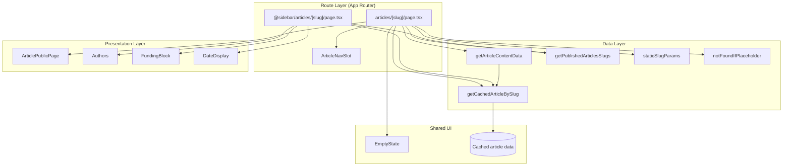
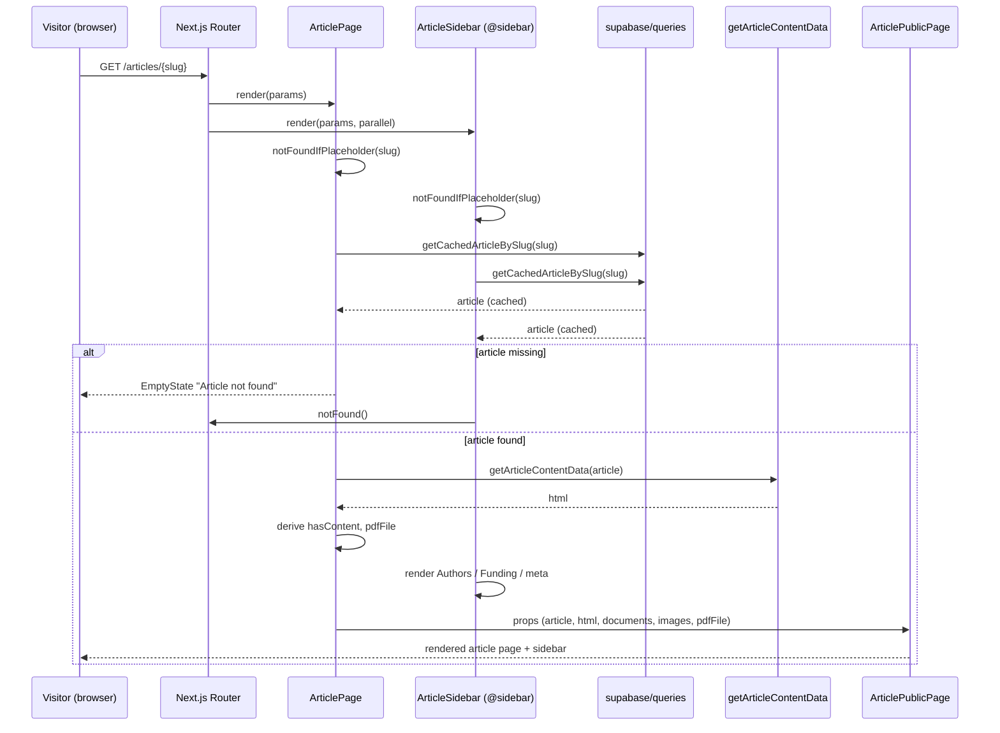
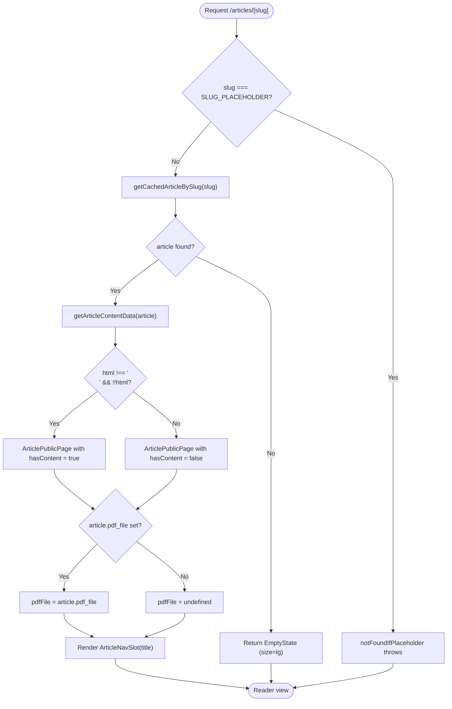
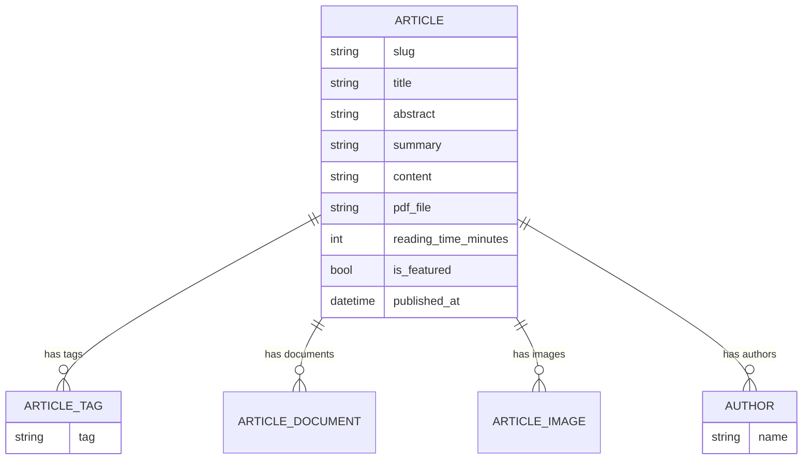
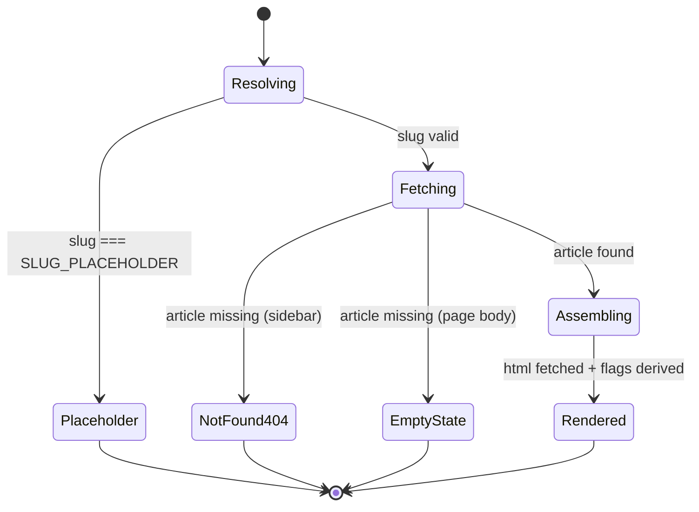

The reader experience is the public-facing surface where a visitor opens a published article, reads its rendered HTML content, and consumes its attachments, bylines, funding context, and metadata. This page documents the server-rendered article reader route, its parallel sidebar slot, the navigation slot, and the data pipeline that assembles an article for display.

## Purpose and Scope

This page covers the **read path** of the Articles capability: how a published article is resolved from a slug, how its content is transformed into displayable HTML, and how the reader route composes content, sidebar metadata, and navigation.

It focuses on:

- The Next.js App Router route `(main)/(reader)/articles/[slug]` and its parallel `@sidebar` slot.
- Static generation and metadata (`generateStaticParams`, `generateMetadata`).
- The data-assembly step performed by `getArticleContentData`, `getCachedArticleBySlug`, and `getPublishedArticlesSlugs`.
- The `ArticlePublicPage` and `ArticleNavSlot` composition components and the sidebar parts (`Authors`, `FundingBlock`, `DateDisplay`).

Intentionally left to sibling pages:

- **Article authoring / the Article Form** (create, edit, attachment upload, slug sync) — see the sibling *Articles: Authoring* page and `docs/article-form/article-form-reference.md`.
- **The articles feed** (browsing lists of articles, infinite scroll) — see the sibling *Articles: Feed* page and `src/components/articles/ArticlesInfiniteFeed.tsx`.
- **Comments** — the reader route composes an `ArticleCommentsSection`; the comment subsystem itself is documented separately.
- **Articles API routes** under `src/app/api/articles/**` (content, images, attachments, comments, search) are referenced here only where the reader consumes their output.

## Overview

The Articles feature in this repository follows a strict server-first rendering model. The reader route is an **async React Server Component** that runs entirely on the server: it resolves the article by slug, fetches and sanitizes its content into an HTML string, then hands the finished payload to presentational components.

Key concepts and terminology:

| Term | Meaning in this codebase |
| --- | --- |
| `slug` | Human-readable URL identifier for a published article; used as the route parameter and as the cache/lookup key. |
| `SLUG_PLACEHOLDER` | Sentinel slug used during static generation to emit a placeholder page that is replaced by real slugs at build time. |
| `ArticlePublicPage` | The presentational component that renders the whole reader view (content, documents, images, PDF). |
| `ArticleNavSlot` | Component rendered inside the page that drives reader-scoped navigation (title-aware). |
| `@sidebar` slot | Next.js parallel route segment supplying the entity-specific right rail (Authors, Funding, published date). |
| `reading_time_minutes` | Precomputed reading-time metadata stored on the article and shown in the sidebar. |
| `hasContent` | Boolean derived from the fetched HTML indicating whether the article has meaningful body content. |

**When it matters:** any change to how a published article is rendered, cached, indexed for SEO, or how its sidebar context is displayed will typically touch one of the files described below.

## Architecture

The reader experience is composed of three cooperating layers: the **route layer** (Next.js App Router segments), the **data layer** (`@/lib/supabase/queries` and content transformation), and the **presentation layer** (`@/components/articles/pages/*` and shared UI primitives).



The routing layer is deliberately thin: each `page.tsx` performs data fetching and control-flow decisions (placeholder detection, not-found handling), then delegates rendering. The data layer exposes cache-aware query helpers so that the page and the sidebar resolve **the same article object** without duplicate work. The presentation layer contains no data access, which keeps it trivially reusable and testable.

The `@sidebar` parallel slot is significant: it means the right rail is resolved by a **separate async server component** running in parallel with the main page, not nested inside it. This lets the rail render independently and keeps entity-specific context (Authors, Funding) out of the main content component.

## Reader Route Implementation

The main reader page lives at `src/app/(main)/(reader)/articles/[slug]/page.tsx`. It is an async server component that exports three things: `generateStaticParams`, `generateMetadata`, and the default `ArticlePage`.

### Static Generation

The route is statically generated from the set of published article slugs:

```tsx
export async function generateStaticParams() {
  return await staticSlugParams(getPublishedArticlesSlugs);
}
```

> Source: [src/app/(main)/(reader)/articles/[slug]/page.tsx](https://github.com/ozeaon/ozeaon-v2/blob/0a4f1a95824db87782f1221a4108019d174df3d9/src/app/(main)/(reader)/articles/[slug]/page.tsx#L17-L19)

`staticSlugParams` is a generator utility (from `@/utils/generators`) that adapts a slug-fetching function into the `{ slug: string }[]` shape Next.js expects. It is paired with `SLUG_PLACEHOLDER` and `notFoundIfPlaceholder`, forming a small toolkit for handling the placeholder-slug pattern. The placeholder exists so the build can emit a valid dynamic route even when the slug list cannot be enumerated at build time; at request time, `notFoundIfPlaceholder` rejects the placeholder so it never renders as a real article.

### Metadata and SEO

`generateMetadata` derives per-article SEO fields directly from the cached article record:

```tsx
export async function generateMetadata({
  params,
}: PageProps<"/articles/[slug]">): Promise<Metadata> {
  const { slug } = await params;
  if (slug === SLUG_PLACEHOLDER) return {};

  const { data: article } = await getCachedArticleBySlug(slug);
  if (!article) return {};

  return {
    title: article.title,
    abstract: article.abstract,
    description: article.summary,
    keywords: article.article_tags?.map((item) => item.tag),
  };
}
```

> Source: [src/app/(main)/(reader)/articles/[slug]/page.tsx](https://github.com/ozeaon/ozeaon-v2/blob/0a4f1a95824db87782f1221a4108019d174df3d9/src/app/(main)/(reader)/articles/[slug]/page.tsx#L21-L36)

Design notes worth observing:

- **`params` is awaited.** This matches Next.js 15+ async `params` semantics and the typed `PageProps<"/articles/[slug]">` helper, meaning route params are validated against generated types.
- **Two early returns** guard the placeholder slug and the missing article, returning an empty `Metadata` object rather than throwing.
- **`abstract` vs `description`** are distinct article fields mapped to distinct metadata slots, and `keywords` is flattened from the `article_tags` join relation (`article_tags?.map((item) => item.tag)`), which is optional-chained because tags may be absent.

### Page Composition and the Content Pipeline

The default export performs the actual read-path assembly:

```tsx
export default async function ArticlePage({
  params,
}: PageProps<"/articles/[slug]">) {
  const { slug } = await params;
  notFoundIfPlaceholder(slug);

  const { data: article } = await getCachedArticleBySlug(slug);
  if (!article)
    return (
      <EmptyState
        title="Article not found"
        description="The article you are looking for does not exist or is not published."
        size="lg"
      />
    );

  const html = await getArticleContentData(article);
  const hasContent = html !== "<p></p>" && !!html;
  const pdfFile = !!article.pdf_file ? article.pdf_file : undefined;

  return (
    <>
      <ArticleNavSlot title={article.title} />
      <ArticlePublicPage
        article={article}
        hasContent={hasContent}
        documents={article.article_documents}
        images={article.article_images}
        pdfFile={pdfFile}
        html={html}
      />
    </>
  );
}
```

> Source: [src/app/(main)/(reader)/articles/[slug]/page.tsx](https://github.com/ozeaon/ozeaon-v2/blob/0a4f1a95824db87782f1221a4108019d174df3d9/src/app/(main)/(reader)/articles/[slug]/page.tsx#L38-L71)

This block is the heart of the reader experience. Several implementation decisions are encoded here:

1. **Placeholder rejection happens first** (`notFoundIfPlaceholder(slug)`), before any data fetch, so placeholder traffic short-circuits immediately.
2. **Not-found rendering is a soft `EmptyState`, not `notFound()`.** Unlike the sidebar slot (which calls `notFound()`), the main page renders a friendly `EmptyState` with `size="lg"`. This is a deliberate UX choice: a missing article on the page shows a readable "not found" panel, while the parallel sidebar route signals a hard 404.
3. **Content is fetched through `getArticleContentData(article)`**, which takes the already-resolved article object rather than the slug. This avoids a second lookup and lets the content transformer access article fields (such as the raw content and any stored URLs) it needs.
4. **`hasContent` is a derived sentinel check** — the string literal `"<p></p>"` is treated as "empty rich text". This is necessary because rich-text editors commonly emit an empty paragraph wrapper for blank content, so `!!html` alone would incorrectly report content.
5. **`pdfFile` is normalized to `undefined`** when falsy (`!!article.pdf_file ? article.pdf_file : undefined`), so downstream consumers can rely on a clean optional rather than empty strings.
6. **Relations are passed straight through** — `article.article_documents` and `article.article_images` are forwarded as `documents` and `images` props without transformation, keeping the page purely compositional.

### The Navigation Slot

`ArticleNavSlot` is rendered above `ArticlePublicPage` and receives the article `title`. It lives in the same presentation package as `ArticlePublicPage`:

```tsx
import { ArticlePublicPage } from "@/components/articles/pages/ArticlePublicPage";
import { ArticleNavSlot } from "@/components/articles/pages/ArticleNavSlot";
```

> Source: [src/app/(main)/(reader)/articles/[slug]/page.tsx](https://github.com/ozeaon/ozeaon-v2/blob/0a4f1a95824db87782f1221a4108019d174df3d9/src/app/(main)/(reader)/articles/[slug]/page.tsx#L1-L3)

Passing the resolved `title` into the nav slot lets the reader-scoped navigation display article-aware context even though the slot is a sibling of the page body rather than a parent.

## Sidebar Slot Implementation

The right rail is served by the parallel route `(main)/(reader)/@sidebar/articles/[slug]/page.tsx`. It is an independent async server component:

```tsx
export async function generateStaticParams() {
  return staticSlugParams(getPublishedArticlesSlugs);
}

export default async function ArticleSidebar({
  params,
}: {
  params: Promise<{ slug: string }>;
}) {
  const { slug } = await params;
  notFoundIfPlaceholder(slug);

  const { data: article } = await getCachedArticleBySlug(slug);
  if (!article) notFound();

  return (
    <div className="flex w-58 shrink-0 flex-col gap-4 p-6">
      <Authors authors={article.authors} />

      <FundingBlock article={article} />

      <div className="mt-4 flex flex-col gap-2 px-2">
        <p className="font-caption text-placeholder">
          Published <DateDisplay date={article.published_at} format="short" />
        </p>
        {article.reading_time_minutes && (
          <span className="font-caption text-placeholder">
            {article.reading_time_minutes} min read
          </span>
        )}
        {article.is_featured && (
          <span className="font-label text-inverse bg-primary w-fit rounded px-2 py-1">
            Featured
          </span>
        )}
      </div>
    </div>
  );
}
```

> Source: [src/app/(main)/(reader)/@sidebar/articles/[slug]/page.tsx](https://github.com/ozeaon/ozeaon-v2/blob/0a4f1a95824db87782f1221a4108019d174df3d9/src/app/(main)/(reader)/@sidebar/articles/[slug]/page.tsx#L10-L48)

Key implementation details:

- **Mirror static params.** The sidebar repeats `generateStaticParams` with the same `staticSlugParams(getPublishedArticlesSlugs)` call so both segments are statically generated for the same slug set.
- **Hard 404 vs soft empty state.** Where the main page renders `EmptyState`, the sidebar calls `notFound()` from `next/navigation`. Because the two segments are resolved in parallel, a genuinely missing article short-circuits the whole route with a 404.
- **`w-58 shrink-0` column.** The rail is a fixed-width flex column that does not shrink, guaranteeing horizontal stability for the reader layout alongside the page body.
- **Section order is semantic:** byline (`Authors`) → funding context (`FundingBlock`) → publishing metadata (date, reading time, featured badge).
- **Conditional badges.** `reading_time_minutes` and `is_featured` are both guarded, so a missing reading time or a non-featured article simply omits that row instead of rendering an empty placeholder.
- **Presentation-only.** The sidebar contains no transformation logic — it forwards `article.authors` and the whole `article` object into `FundingBlock`, delegating formatting to those components and to `DateDisplay` (`format="short"`).

The sidebar parts are imported from a barrel module:

```tsx
import { Authors, FundingBlock } from "@/components/articles/pages/parts";
import { DateDisplay } from "@/components/ui";
```

> Source: [src/app/(main)/(reader)/@sidebar/articles/[slug]/page.tsx](https://github.com/ozeaon/ozeaon-v2/blob/0a4f1a95824db87782f1221a4108019d174df3d9/src/app/(main)/(reader)/@sidebar/articles/[slug]/page.tsx#L1-L3)

## Core Flow

The reader request resolves the page body and the sidebar in parallel, sharing a cached article lookup. The sequence below traces a request for `/articles/[slug]` end to end.



Three properties of this flow are worth calling out:

- **Parallel resolution.** The page and the `@sidebar` slot are separate server components; the router schedules both from the same route params. This is why both files duplicate `generateStaticParams` and both call `notFoundIfPlaceholder`.
- **Shared cached lookup.** Both call sites use `getCachedArticleBySlug`, so within a single render pass the article is fetched once and reused. This is the reason the content transformer takes an `article` object rather than a slug.
- **Divergent failure behavior.** The main page degrades to an `EmptyState`; the sidebar escalates to `notFound()`. Understanding this asymmetry is essential when debugging "the rail disappeared but the page rendered" style reports.

### Content Assembly Decision Flow

The per-request decisions that shape what the reader sees:



## Data Model Surface

The reader consumes a single denormalized article object resolved by `getCachedArticleBySlug`. The following fields are read directly by the reader components documented on this page:



Field usage in the reader surface:

| Field | Read by | Purpose |
| --- | --- | --- |
| `title` | `generateMetadata`, `ArticleNavSlot`, `ArticlePublicPage` | Page title, nav context, heading |
| `abstract` | `generateMetadata` | Metadata `abstract` slot |
| `summary` | `generateMetadata` | Metadata `description` slot |
| `article_tags[].tag` | `generateMetadata`, `ArticlePublicPage` | SEO keywords list |
| `content` / transformed HTML | `getArticleContentData`, `ArticlePublicPage` | Rendered body |
| `pdf_file` | `ArticlePage` | Optional PDF document link |
| `article_documents` | `ArticlePage` → `ArticlePublicPage` | Attached documents list |
| `article_images` | `ArticlePage` → `ArticlePublicPage` | Gallery images |
| `authors` | `ArticleSidebar` → `Authors` | Byline |
| `published_at` | `ArticleSidebar` → `DateDisplay` | Publication date (`format="short"`) |
| `reading_time_minutes` | `ArticleSidebar` | "N min read" label |
| `is_featured` | `ArticleSidebar` | "Featured" badge |

## Configuration Options

The reader route itself has no dedicated config file; its behavior is governed by build-time Next.js configuration and route conventions.

| Option | Type | Default | Description |
| --- | --- | --- | --- |
| `generateStaticParams` | function | `staticSlugParams(getPublishedArticlesSlugs)` | Enumerates published slugs for static generation of both the page and sidebar segments. |
| `SLUG_PLACEHOLDER` | string sentinel | exported by `@/utils/generators` | Slug value used during build to emit a placeholder page; always rejected at request time. |
| `DateDisplay format` | union | `"short"` | Date rendering format used in the sidebar publication line. |
| `EmptyState size` | union | `"lg"` | Size of the not-found panel rendered by `ArticlePage`. |
| `sidebar width` | Tailwind class | `w-58 shrink-0` | Fixed, non-shrinking width of the reader right rail. |

> Sources:
> - [src/app/(main)/(reader)/articles/[slug]/page.tsx](https://github.com/ozeaon/ozeaon-v2/blob/0a4f1a95824db87782f1221a4108019d174df3d9/src/app/(main)/(reader)/articles/[slug]/page.tsx#L17-L19)
> - [src/app/(main)/(reader)/@sidebar/articles/[slug]/page.tsx](https://github.com/ozeaon/ozeaon-v2/blob/0a4f1a95824db87782f1221a4108019d174df3d9/src/app/(main)/(reader)/@sidebar/articles/[slug]/page.tsx#L26-L44)

## API Reference

### `generateStaticParams(): Promise<{ slug: string }[]>`

Enumerates the published article slugs to pre-render the reader route and its sidebar segment. Shown in both the page ([L17–L19](https://github.com/ozeaon/ozeaon-v2/blob/0a4f1a95824db87782f1221a4108019d174df3d9/src/app/(main)/(reader)/articles/[slug]/page.tsx#L17-L19)) and the sidebar ([L10–L12](https://github.com/ozeaon/ozeaon-v2/blob/0a4f1a95824db87782f1221a4108019d174df3d9/src/app/(main)/(reader)/@sidebar/articles/[slug]/page.tsx#L10-L12)).

**Returns:** An array of `{ slug }` objects produced by `staticSlugParams(getPublishedArticlesSlugs)`.

### `generateMetadata({ params }): Promise<Metadata>`

Builds per-article SEO metadata. Signature: `PageProps<"/articles/[slug]">`.

**Parameters:**
- `params`: `Promise<{ slug: string }>` — must be awaited.

**Returns:** `Metadata` with `title`, `abstract`, `description`, and `keywords` (mapped from `article.article_tags`). Returns an empty object `{}` for the placeholder slug or when the article is not found.

> Source: [src/app/(main)/(reader)/articles/[slug]/page.tsx](https://github.com/ozeaon/ozeaon-v2/blob/0a4f1a95824db87782f1221a4108019d174df3d9/src/app/(main)/(reader)/articles/[slug]/page.tsx#L21-L36)

### `ArticlePage({ params }): Promise<JSX.Element>`

The default reader page component.

**Parameters:**
- `params`: `Promise<{ slug: string }>`.

**Returns:** A fragment containing `<ArticleNavSlot title={article.title} />` and `<ArticlePublicPage ... />`, or an `<EmptyState>` when the article is missing.

> Source: [src/app/(main)/(reader)/articles/[slug]/page.tsx](https://github.com/ozeaon/ozeaon-v2/blob/0a4f1a95824db87782f1221a4108019d174df3d9/src/app/(main)/(reader)/articles/[slug]/page.tsx#L38-L71)

### `ArticleSidebar({ params }): Promise<JSX.Element>`

The default `@sidebar` segment component.

**Parameters:**
- `params`: `Promise<{ slug: string }>`.

**Returns:** A fixed-width flex column containing `Authors`, `FundingBlock`, and the metadata block. Calls `notFound()` when the article cannot be resolved.

> Source: [src/app/(main)/(reader)/@sidebar/articles/[slug]/page.tsx](https://github.com/ozeaon/ozeaon-v2/blob/0a4f1a95824db87782f1221a4108019d174df3d9/src/app/(main)/(reader)/@sidebar/articles/[slug]/page.tsx#L14-L48)

### Data helpers consumed by the reader

| Helper | Imported from | Role in the reader |
| --- | --- | --- |
| `getCachedArticleBySlug(slug)` | `@/lib/supabase/queries` | Cache-aware article lookup by slug; called by both the page and the sidebar. |
| `getArticleContentData(article)` | `@/lib/supabase/queries` | Transforms the resolved article into displayable HTML. |
| `getPublishedArticlesSlugs` | `@/lib/supabase/queries` | Supplies the slug set for `generateStaticParams`. |
| `staticSlugParams` | `@/utils/generators` | Adapts a slug source into Next.js `generateStaticParams` output. |
| `notFoundIfPlaceholder(slug)` | `@/utils/generators` | Rejects the `SLUG_PLACEHOLDER` sentinel at request time. |

> Source: [src/app/(main)/(reader)/articles/[slug]/page.tsx](https://github.com/ozeaon/ozeaon-v2/blob/0a4f1a95824db87782f1221a4108019d174df3d9/src/app/(main)/(reader)/articles/[slug]/page.tsx#L5-L14)

## Usage Examples

### Rendering the reader page body

The canonical example of the reader read path — resolve, transform, compose:

```tsx
const { slug } = await params;
notFoundIfPlaceholder(slug);

const { data: article } = await getCachedArticleBySlug(slug);
if (!article)
  return (
    <EmptyState
      title="Article not found"
      description="The article you are looking for does not exist or is not published."
      size="lg"
    />
  );

const html = await getArticleContentData(article);
const hasContent = html !== "<p></p>" && !!html;
const pdfFile = !!article.pdf_file ? article.pdf_file : undefined;
```

> Source: [src/app/(main)/(reader)/articles/[slug]/page.tsx](https://github.com/ozeaon/ozeaon-v2/blob/0a4f1a95824db87782f1221a4108019d174df3d9/src/app/(main)/(reader)/articles/[slug]/page.tsx#L41-L56)

This snippet is the reference implementation for adding a new reader-shaped route: guard the placeholder, resolve the entity, derive display flags, and normalize optional fields before handing them to presentation components.

### Passing relations through to the view

```tsx
<ArticleNavSlot title={article.title} />
<ArticlePublicPage
  article={article}
  hasContent={hasContent}
  documents={article.article_documents}
  images={article.article_images}
  pdfFile={pdfFile}
  html={html}
/>
```

> Source: [src/app/(main)/(reader)/articles/[slug]/page.tsx](https://github.com/ozeaon/ozeaon-v2/blob/0a4f1a95824db87782f1221a4108019d174df3d9/src/app/(main)/(reader)/articles/[slug]/page.tsx#L60-L68)

Note that `article_documents` and `article_images` are renamed to `documents` and `images` at the boundary, decoupling the view's prop names from the database relation names.

### Sidebar metadata block with conditional rows

```tsx
<div className="mt-4 flex flex-col gap-2 px-2">
  <p className="font-caption text-placeholder">
    Published <DateDisplay date={article.published_at} format="short" />
  </p>
  {article.reading_time_minutes && (
    <span className="font-caption text-placeholder">
      {article.reading_time_minutes} min read
    </span>
  )}
  {article.is_featured && (
    <span className="font-label text-inverse bg-primary w-fit rounded px-2 py-1">
      Featured
    </span>
  )}
</div>
```

> Source: [src/app/(main)/(reader)/@sidebar/articles/[slug]/page.tsx](https://github.com/ozeaon/ozeaon-v2/blob/0a4f1a95824db87782f1221a4108019d174df3d9/src/app/(main)/(reader)/@sidebar/articles/[slug]/page.tsx#L31-L45)

This is the pattern to follow when adding new optional sidebar metadata: guard the value, render inside the shared `flex flex-col gap-2 px-2` container, and use the `font-caption text-placeholder` typography tokens for secondary text.

### Deriving SEO metadata from the article

```tsx
return {
  title: article.title,
  abstract: article.abstract,
  description: article.summary,
  keywords: article.article_tags?.map((item) => item.tag),
};
```

> Source: [src/app/(main)/(reader)/articles/[slug]/page.tsx](https://github.com/ozeaon/ozeaon-v2/blob/0a4f1a95824db87782f1221a4108019d174df3d9/src/app/(main)/(reader)/articles/[slug]/page.tsx#L30-L35)

## Failure Modes, Edge Cases & Concurrency

The reader path has several explicitly handled failure modes. Understanding them prevents both accidental regressions and misdiagnosis of reported bugs.

| Condition | Detection point | Behavior | Rationale |
| --- | --- | --- | --- |
| Placeholder slug | `notFoundIfPlaceholder(slug)` at the top of both segments | Route resolution aborted before any data fetch | The placeholder is a build-time artifact only; it must never render as content. |
| Article not found (page body) | `if (!article)` in `ArticlePage` | Renders `EmptyState` with `size="lg"` | Friendly degradation for the primary content area. |
| Article not found (sidebar) | `if (!article) notFound()` in `ArticleSidebar` | Raises a hard Next.js 404 | The rail has no meaningful degraded state without an entity. |
| Empty rich text | `html !== "<p></p>" && !!html` | `hasContent = false` | Guards against editors emitting an empty paragraph wrapper. |
| No PDF attached | `!!article.pdf_file ? ... : undefined` | `pdfFile = undefined` | Normalizes falsy values so consumers can rely on a clean optional. |
| No reading time | `article.reading_time_minutes &&` guard | Row omitted | Avoids rendering "0 min read" or an empty label. |
| No tags | `article.article_tags?.map(...)` optional chain | `keywords` is `undefined` | Tolerates articles with no tag relations. |

**Concurrency and consistency.** Both the page and the sidebar call `getCachedArticleBySlug`, which is the cache-aware variant of the lookup. Because the two segments resolve in parallel within the same request, the cached helper is what guarantees a single consistent article snapshot is used by both — without it, the rail and the body could theoretically observe different revisions. There is no client-side state mutation in the reader path; it is a purely read-only, server-rendered surface, so no locking or optimistic-update concerns apply.

**Edge case: divergent not-found behavior.** Because the body renders an `EmptyState` while the sidebar calls `notFound()`, an unpublished-but-existing article can produce a rendered body alongside a 404-triggering rail. This asymmetry is intentional but is the most common source of confusing symptoms when debugging the reader route.



## Performance & Operational Considerations

- **Static generation first.** Both route segments export `generateStaticParams`, so published article pages are pre-rendered at build time. This keeps the hot read path off the dynamic server for known slugs and is the primary performance lever for the reader.
- **Cache-aware lookups.** The `Cached` prefix on `getCachedArticleBySlug` indicates memoization; calling it from both parallel segments is cheap by design. When adding a new reader-adjacent segment, use the cached variant rather than a fresh query.
- **Placeholder short-circuit.** `notFoundIfPlaceholder` runs before any fetch, so placeholder traffic costs essentially nothing.
- **Derived-flag pattern.** `hasContent` and `pdfFile` are computed once on the server and passed as primitives, so the presentation layer never re-derives them and never performs optional-chaining checks on raw relation data.
- **Relation pass-through.** `article_documents` and `article_images` are forwarded as-is; any heavy transformation of those collections belongs in `ArticlePublicPage`, not on the route, to keep the route's server work minimal.

## Extension Points

The reader experience is extended at three well-defined seams:

1. **New metadata fields.** Add to `generateMetadata`'s returned object to expose more SEO data. Every field you add is sourced from the same cached article object.
2. **New sidebar context.** Add a component to the sidebar's flex column (alongside `Authors` and `FundingBlock`) and import it from `@/components/articles/pages/parts`. New rails sections are pure presentation and require no route changes.
3. **New reader attachments.** Extend `ArticlePublicPage`'s prop surface (currently `article`, `hasContent`, `documents`, `images`, `pdfFile`, `html`) and pass the corresponding `article` relation from `ArticlePage`. This keeps the page component's contract explicit.

**Boundary constraint:** per `DESIGN-CONSISTENCY-PLAN.md`, the reader is a "single-entity" page type that intentionally retains its parallel `@sidebar` route slot for entity-specific context, while feed/settings/editor pages are two-column. Removing or restructuring the reader right rail is explicitly out of scope for the current layout work, so extension should happen *inside* the existing slot rather than by relocating the rail.

## Related Links

- [Articles: Authoring](../articles-authoring/) — the article form, attachments, and slug handling (`ArticleForm`).
- Route source: [src/app/(main)/(reader)/articles/[slug]/page.tsx](https://github.com/ozeaon/ozeaon-v2/blob/0a4f1a95824db87782f1221a4108019d174df3d9/src/app/(main)/(reader)/articles/[slug]/page.tsx)
- Sidebar source: [src/app/(main)/(reader)/@sidebar/articles/[slug]/page.tsx](https://github.com/ozeaon/ozeaon-v2/blob/0a4f1a95824db87782f1221a4108019d174df3d9/src/app/(main)/(reader)/@sidebar/articles/[slug]/page.tsx)
- Presentation components: [src/components/articles/pages/](https://github.com/ozeaon/ozeaon-v2/blob/0a4f1a95824db87782f1221a4108019d174df3d9/src/components/articles/pages)
- Layout conventions: [DESIGN-CONSISTENCY-PLAN.md](https://github.com/ozeaon/ozeaon-v2/blob/0a4f1a95824db87782f1221a4108019d174df3d9/DESIGN-CONSISTENCY-PLAN.md)
