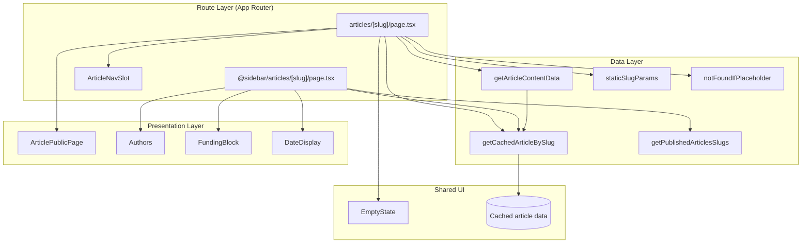
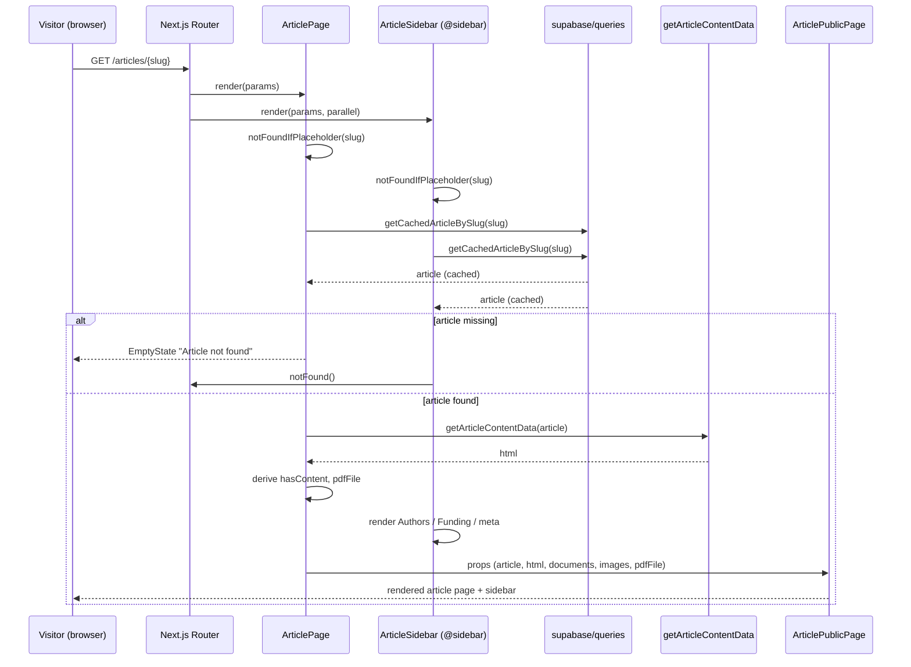

The reader experience is the public-facing surface where a visitor opens a published article and reads its rendered HTML content, attachments, bylines, and metadata. This page covers the server-rendered reader route at `(main)/(reader)/articles/[slug]`, its parallel `@sidebar` slot, and the data pipeline that assembles an article for display. For authoring and the draft/publish flow, see [Article Authoring & Publishing](../articles-authoring/).

## Overview

The reader route is an async React Server Component that runs entirely on the server: it resolves the article by slug, fetches and sanitizes its content into an HTML string, then hands the finished payload to presentational components. The `@sidebar` parallel slot runs as a separate async server component in parallel with the main page, rendering the article's Authors, funding context, and publishing metadata independently.

The sidebar renders `FundingBlock`, which shows the article's declared `funding_source` and `funding_details` — provenance metadata about who funded the underlying work. Project funding, tipping and payment flows are on the roadmap.

## Architecture

Three cooperating layers: the **route layer** (Next.js App Router segments), the **data layer** (`queries/` and content transformation), and the **presentation layer** (`components/articles/pages/*`).



The routing layer is deliberately thin: each `page.tsx` performs data fetching and control-flow decisions (placeholder detection, not-found handling), then delegates rendering. The data layer exposes cache-aware query helpers so the page and the sidebar resolve **the same article object** without duplicate work. The presentation layer contains no data access.

The `@sidebar` parallel slot is significant: it resolves by a **separate async server component** running in parallel with the main page, not nested inside it, so the right rail can render independently.

## Core Flow



Three properties of this flow matter:

- **Parallel resolution.** The page and sidebar are separate server components scheduled from the same route params. Both files duplicate `generateStaticParams` and `notFoundIfPlaceholder` for exactly this reason.
- **Shared cached lookup.** Both call `getCachedArticleBySlug`, so the article is fetched once per request. This is why the content transformer takes an already-resolved `article` object rather than a slug.
- **Divergent failure behavior.** The main page renders `EmptyState` when the article is missing; the sidebar calls `notFound()`. Understanding this asymmetry is essential when debugging "the rail disappeared but the page rendered" reports.

The key content-assembly decisions in `ArticlePage` ([source](https://github.com/ozeaon/ozeaon-v2/blob/0a4f1a95824db87782f1221a4108019d174df3d9/src/app/%28main%29/%28reader%29/articles/%5Bslug%5D/page.tsx)):

```tsx
const html = await getArticleContentData(article);
const hasContent = html !== "<p></p>" && !!html;
const pdfFile = !!article.pdf_file ? article.pdf_file : undefined;
```

`hasContent` checks against the literal `"<p></p>"` because rich-text editors commonly emit an empty paragraph wrapper for blank content, so `!!html` alone would incorrectly report content. `pdfFile` is normalized to `undefined` so downstream consumers rely on a clean optional rather than empty strings.

Both route segments export `generateStaticParams` using `staticSlugParams(getPublishedArticlesSlugs)` so both the page and the sidebar are pre-rendered for the same published slug set. The `SLUG_PLACEHOLDER` sentinel lets the build emit a valid dynamic route even when the slug list cannot be enumerated at build time; `notFoundIfPlaceholder` rejects it at request time before any data fetch.

## Failure Modes & Edge Cases

| Condition | Detection | Behavior |
| --- | --- | --- |
| Placeholder slug | `notFoundIfPlaceholder(slug)` at the top of both segments | Route aborted before any data fetch |
| Article not found (page) | `if (!article)` in `ArticlePage` | Renders `EmptyState` with `size="lg"` |
| Article not found (sidebar) | `if (!article) notFound()` in `ArticleSidebar` | Hard Next.js 404 |
| Empty rich text | `html !== "<p></p>" && !!html` | `hasContent = false` |
| No PDF attached | `!!article.pdf_file ? ... : undefined` | `pdfFile = undefined` |
| No reading time | `article.reading_time_minutes &&` guard | Row omitted from sidebar |
| No tags | `article.article_tags?.map(...)` optional chain | `keywords` is `undefined` in metadata |

## Operational Notes

- **Static generation first.** Both segments export `generateStaticParams`, so published article pages are pre-rendered at build time. This is the primary performance lever for the reader.
- **Cache-aware lookups.** `getCachedArticleBySlug` is memoized; calling it from both parallel segments is cheap by design. When adding a new reader-adjacent segment, use the cached variant rather than a fresh query.
- **Derived-flag pattern.** `hasContent` and `pdfFile` are computed once on the server and passed as primitives, so the presentation layer never re-derives them or performs optional-chaining checks on raw relation data.
- **Relation pass-through.** `article_documents` and `article_images` are forwarded as-is from the route to `ArticlePublicPage`. Any heavy transformation of those collections belongs in `ArticlePublicPage`, not on the route.

## Extension Points

1. **New metadata fields.** Add to `generateMetadata`'s returned object. Every field is sourced from the same cached article object.
2. **New sidebar context.** Add a component to the sidebar's flex column alongside `Authors` and `FundingBlock`, imported from `@/components/articles/pages/parts`. New rail sections are pure presentation and require no route changes.
3. **New reader attachments.** Extend `ArticlePublicPage`'s prop surface (currently `article`, `hasContent`, `documents`, `images`, `pdfFile`, `html`) and pass the corresponding `article` relation from `ArticlePage`.

Per `DESIGN-CONSISTENCY-PLAN.md`, the reader retains its parallel `@sidebar` route slot for entity-specific context. Extension should happen inside the existing slot rather than by relocating the rail.

## Related Links

- [Article Authoring & Publishing](../articles-authoring/) — the article form, attachments, and slug handling
- [src/app/(main)/(reader)/articles/\[slug\]/page.tsx](https://github.com/ozeaon/ozeaon-v2/blob/0a4f1a95824db87782f1221a4108019d174df3d9/src/app/%28main%29/%28reader%29/articles/%5Bslug%5D/page.tsx)
- [src/app/(main)/(reader)/@sidebar/articles/\[slug\]/page.tsx](https://github.com/ozeaon/ozeaon-v2/blob/0a4f1a95824db87782f1221a4108019d174df3d9/src/app/%28main%29/%28reader%29/%40sidebar/articles/%5Bslug%5D/page.tsx)
- [src/components/articles/pages/](https://github.com/ozeaon/ozeaon-v2/tree/0a4f1a95824db87782f1221a4108019d174df3d9/src/components/articles/pages) — presentation components (`ArticlePublicPage`, `ArticleNavSlot`, parts)
- [DESIGN-CONSISTENCY-PLAN.md](https://github.com/ozeaon/ozeaon-v2/blob/0a4f1a95824db87782f1221a4108019d174df3d9/DESIGN-CONSISTENCY-PLAN.md)
