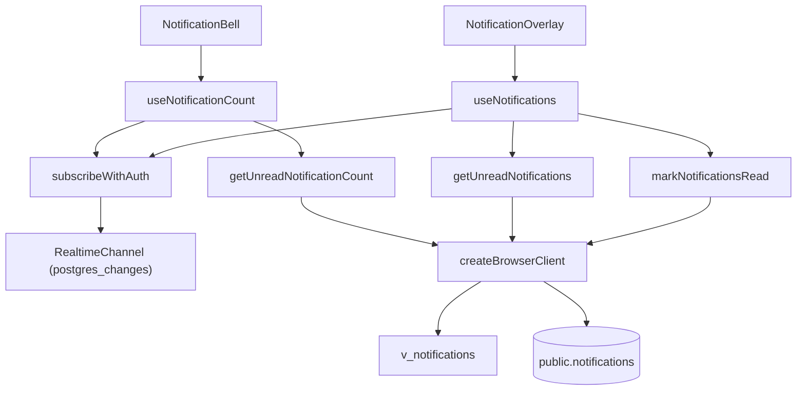

The notifications subsystem delivers per-user, account-scoped notification events to the app's notification bell and overlay, keeping unread counts and the unread list live through Supabase Realtime.

:::note[Status: in progress (first release)]
The entire feature is behind the `NEXT_PUBLIC_FEATURE_NOTIFICATIONS` flag (`env.features.notifications`). When the flag is off, `NotificationBell` does not render and the `/posts/[id]` permalink returns 404. There is no `/notifications` page yet. Grouping, per-type settings and digests belong to the planned second pass.
:::

## Overview

Notifications are row-based and event-backed. A domain event causes a database trigger to insert one row per recipient into `public.notifications`; the frontend only reads, groups and marks rows read.

The 18 triggers in [20260921000000_notifications_triggers.sql](https://github.com/ozeaon/ozeaon-v2/blob/0a4f1a95824db87782f1221a4108019d174df3d9/supabase/migrations/20260921000000_notifications_triggers.sql) cover: post created; post, project and article comments; post and post-comment reactions; project and article changes; team member and article author added; related project and article links; and org invite created, invite answered, join requested, request reviewed, role changed and member removed.

The client feature has three concerns:

1. A query layer ([notifications.ts](https://github.com/ozeaon/ozeaon-v2/blob/0a4f1a95824db87782f1221a4108019d174df3d9/src/lib/supabase/queries/notifications.ts)) that reads and writes via the browser client — deliberately not `"use server"` so the bell works without a server round trip.
2. Two state hooks: `useNotificationCount` powers the bell badge by seeding from a server-rendered count and re-reading on realtime events; `useNotifications` powers the overlay's unread batch, loading on open and staying current while open.
3. A realtime subscription helper (`subscribeWithAuth` in [realtime.ts](https://github.com/ozeaon/ozeaon-v2/blob/0a4f1a95824db87782f1221a4108019d174df3d9/src/lib/supabase/realtime.ts)) that guarantees a channel only joins after the socket carries the session JWT, because an anonymous channel is silently dropped by Row Level Security.

The core design trade-off is **re-read instead of patch**: one extra read buys a list that is correct for an arrival, a read in another session and a delete — without three reconciliation paths. Because Realtime sends one event per row, re-reads are debounced so a multi-row write costs a single read.

## Architecture

Both hooks translate the reactive account scope (from `useActiveAccount`) into a concrete `scopeOrgId` via `notificationScopeOrgId`, then call the query layer. Realtime callbacks do not carry data into state — they trigger a re-read.

### Account scoping

Every read is scoped to the account the user is currently acting as. `null` means the individual-account copy; a UUID means an organization account. The two branches (`.eq("recipient_org_id", scopeOrgId)` vs `.is("recipient_org_id", null)`) can never overlap.

Scoping is **display-only**. The real security boundary is the `recipient_user_id` RLS predicate on the base table, because the acting-as cookie is unsigned.

### Why scope is held in a ref

Both hooks keep the current scope in a `useRef`. The realtime callback must read the *current* scope without the subscription tearing down and rebuilding on every account switch. If `scopeOrgId` were a subscription dependency, switching accounts would drop and re-establish the WebSocket channel unnecessarily. The ref is synced in a separate effect declared before the load effect, so it is current by the time the load reads it.

### Realtime channels

The bell subscribes to `INSERT`, `UPDATE` and `DELETE` on channel `notifications-{userId}`, always. The overlay subscribes to all events on `notifications-overlay-{userId}`, only while open. Both use the filter `recipient_user_id=eq.{userId}` — Realtime permits only one filter per subscription, so account scope is resolved client-side. A row addressed to another of the user's accounts arrives and is discarded without touching state.

Deletes always trigger a re-read regardless of scope, because the table has `REPLICA IDENTITY FULL` but clients still receive only the key on `DELETE`, so scope cannot be read from the payload.

### Mark-as-read

`markNotificationsRead` uses `.eq("recipient_user_id", userId).is("read_at", null)` — you can only mark your own unread rows. The hook drops rows from local state optimistically before the write lands, then schedules a re-read to settle the list. There is no rollback: if the write fails, a `toast.error` is shown and the re-read restores the rows.

### Read path

The overlay list reads up to `NOTIFICATION_BATCH_SIZE` rows from `v_notifications` (which joins the destination path), ordered by `last_event_at DESC` (index-backed). The count query uses `head: true, count: "exact"` and never transfers rows. Because every view column is nullable to the type system, `toListItem` filters out rows missing `id`, `type`, `actor_name` or `last_event_at`; `event_count` defaults to 1 for ungrouped rows.

## Failure Modes & Edge Cases

- **Query error on the bell:** logged, previous count left in place; no failed state on the badge.
- **Query error on the overlay:** logged; `hasFailed` is set only when the scope has not changed since the read started. The UI exposes `hasFailed` and `retry`.
- **`markNotificationsRead` failure:** logged, `toast.error` shown; the scheduled re-read restores the dropped rows.
- **`subscribeWithAuth` failure:** `"Failed to authorise realtime channel"` is logged; the channel is never created and no events arrive.
- **Stale read after account switch:** the scope captured at call time is compared to the ref before setting state; a mismatched result is discarded.
- **Realtime event storms:** `NOTIFICATION_REREAD_DEBOUNCE_MS` collapses bursts to one re-read. The timer is cleared on overlay close so no stray fetch fires after unmount.
- **Cross-session read race:** `.is("read_at", null)` means a second session marking the same row read matches zero rows and cannot move an already-set timestamp.

## Operational Notes

- The bell starts from a server-rendered count (`initialCount`), so its first paint is correct with no client fetch.
- The overlay's channel is created on open and removed on close or unmount, preventing leaked channels.
- Constants `NOTIFICATION_BATCH_SIZE` and `NOTIFICATION_REREAD_DEBOUNCE_MS` live in [config/constants/notifications.ts](https://github.com/ozeaon/ozeaon-v2/blob/0a4f1a95824db87782f1221a4108019d174df3d9/src/config/constants/notifications.ts).
- The `notifications` table is in the `supabase_realtime` publication with `REPLICA IDENTITY FULL`, set in [20260918000000_notifications_foundation.sql](https://github.com/ozeaon/ozeaon-v2/blob/0a4f1a95824db87782f1221a4108019d174df3d9/supabase/migrations/20260918000000_notifications_foundation.sql).

## Extension Points

- **New event types:** add a trigger that inserts a row with the right `type` and `destination_path`. The `event_count` and `last_event_at` columns are already in place for grouped notifications (the UI renders them); a grouping producer can write grouped rows without frontend changes.
- **New destination targets:** `destination_path` flows through `v_notifications` into `NotificationListItem`, so new types can point anywhere by populating that column.
- **Additional realtime consumers:** reuse `subscribeWithAuth` to obtain an authenticated channel without reimplementing the JWT-before-join dance.
- **Second pass (planned):** per-type notification settings, grouping and digest emails.

## Related Links

- [notifications.ts query layer](https://github.com/ozeaon/ozeaon-v2/blob/0a4f1a95824db87782f1221a4108019d174df3d9/src/lib/supabase/queries/notifications.ts)
- [realtime.ts](https://github.com/ozeaon/ozeaon-v2/blob/0a4f1a95824db87782f1221a4108019d174df3d9/src/lib/supabase/realtime.ts)
- [use-notifications.ts](https://github.com/ozeaon/ozeaon-v2/blob/0a4f1a95824db87782f1221a4108019d174df3d9/src/hooks/use-notifications.ts)
- [use-notification-count.ts](https://github.com/ozeaon/ozeaon-v2/blob/0a4f1a95824db87782f1221a4108019d174df3d9/src/hooks/use-notification-count.ts)
- [config/constants/notifications.ts](https://github.com/ozeaon/ozeaon-v2/blob/0a4f1a95824db87782f1221a4108019d174df3d9/src/config/constants/notifications.ts)
- [NotificationBell.tsx](https://github.com/ozeaon/ozeaon-v2/blob/0a4f1a95824db87782f1221a4108019d174df3d9/src/components/nav/components/NotificationBell.tsx)
- [NotificationOverlay.tsx](https://github.com/ozeaon/ozeaon-v2/blob/0a4f1a95824db87782f1221a4108019d174df3d9/src/components/notifications/NotificationOverlay.tsx)
- [notifications_foundation.sql](https://github.com/ozeaon/ozeaon-v2/blob/0a4f1a95824db87782f1221a4108019d174df3d9/supabase/migrations/20260918000000_notifications_foundation.sql)
- [notifications_triggers.sql](https://github.com/ozeaon/ozeaon-v2/blob/0a4f1a95824db87782f1221a4108019d174df3d9/supabase/migrations/20260921000000_notifications_triggers.sql)
