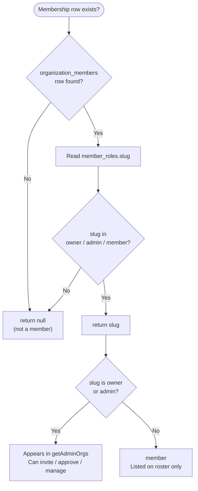
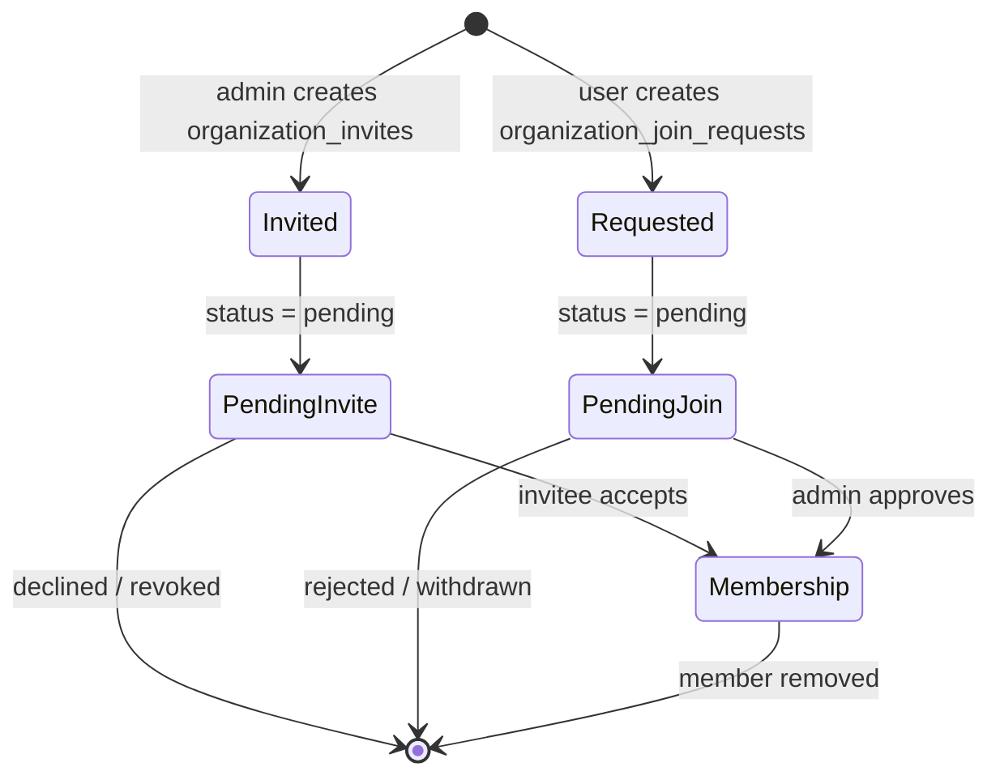
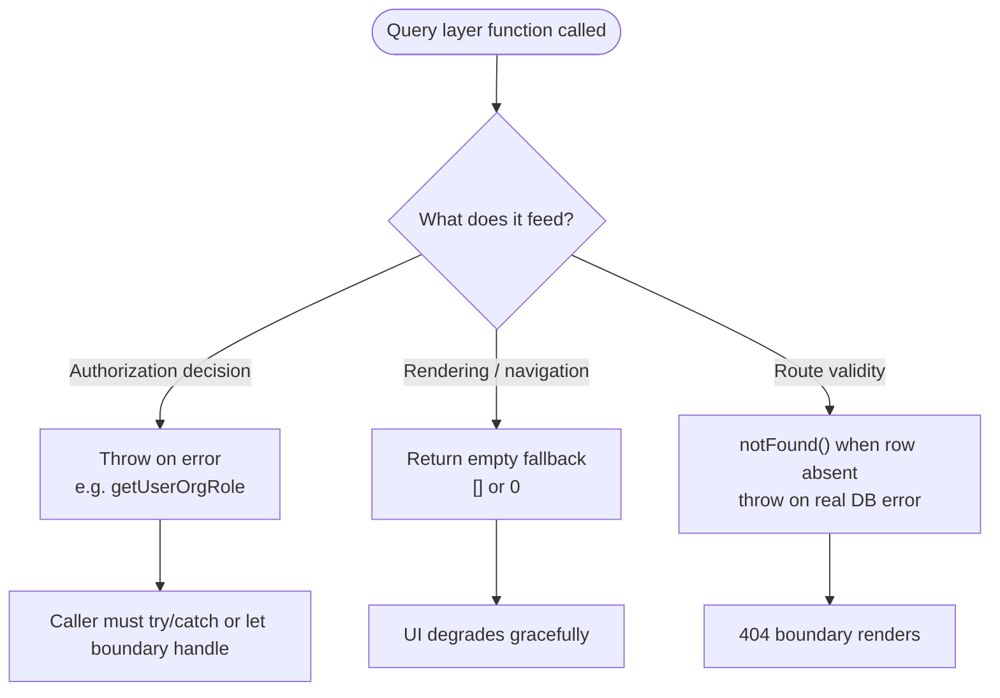

Organizations are first-class public entities with slug-addressable pages, a role-backed membership graph, and an invite/join-request workflow. This page covers the query layer in [`src/lib/supabase/queries/organizations.ts`](https://github.com/ozeaon/ozeaon-v2/blob/0a4f1a95824db87782f1221a4108019d174df3d9/src/lib/supabase/queries/organizations.ts), role resolution, membership lifecycle, and the validation constants that govern organization data.

## Overview

An organization has a `slug`-addressable public page, branding images (`logo_image`, `cover_image`), a `mission` and `description`, contact and social links, and denormalized counters (`member_count`, `project_count`, `article_count`). A `verified` flag exists but is currently only a flag — [migration 20260720164149](https://github.com/ozeaon/ozeaon-v2/blob/0a4f1a95824db87782f1221a4108019d174df3d9/supabase/migrations/20260720164149_unverify_all_organizations.sql) reset it to false for all organizations. Org verification and paid subscriptions are on the roadmap.

Membership is a many-to-many graph between `user_profiles` and `organizations`, mediated by `organization_members`. Each row carries a `role_id` into `member_roles` (a lookup table; the application interprets only the slugs `owner`, `admin`, `member`), a free-text `title` for that member within the org, and a `joined_at` timestamp for stable roster ordering.

Two asymmetric flows bring users into membership: admins create **invitations** (`organization_invites`) targeting a specific user and role; users submit **join requests** (`organization_join_requests`) with an optional message. In addition, `POST /api/organizations/[id]/members` ([route](https://github.com/ozeaon/ozeaon-v2/blob/0a4f1a95824db87782f1221a4108019d174df3d9/src/app/api/organizations/%5Bid%5D/members/route.ts)) lets an owner or admin insert any user directly, and lets an invitee self-insert against a pending invite.

`ORG_LATEST_SELECT` joins in `organization_follows`, but organization follows have no UI — `organization_follows` is only read in that select fragment. Follows fall under the connections roadmap item.

## Architecture

The subsystem is layered: Supabase Postgres at the bottom, a typed query layer in [`queries/organizations.ts`](https://github.com/ozeaon/ozeaon-v2/blob/0a4f1a95824db87782f1221a4108019d174df3d9/src/lib/supabase/queries/organizations.ts), domain types in [`types/organizations.ts`](https://github.com/ozeaon/ozeaon-v2/blob/0a4f1a95824db87782f1221a4108019d174df3d9/src/types/organizations.ts), validation constants in [`config/constants/organizations.ts`](https://github.com/ozeaon/ozeaon-v2/blob/0a4f1a95824db87782f1221a4108019d174df3d9/src/config/constants/organizations.ts), and React components and hooks on top.

Every query function returns a `{ data, error }` tuple rather than throwing, letting server components render partial pages without exception boundaries. `notFound()` is called only where absence is genuinely fatal for the route. Read models use `Pick<>`-based narrow selects rather than `select("*")`.

The feed type `OrgFeedRow` embeds `viewer_role` — the viewing user's role slug — so feed cards can render the correct affordance ("Join", "Member", "Manage") in a single server round trip with no N+1 role lookups.

## Roles & Authorization

Role resolution answers one question: what role does this user hold in this organization? `getUserOrgRole` ([source](https://github.com/ozeaon/ozeaon-v2/blob/0a4f1a95824db87782f1221a4108019d174df3d9/src/lib/supabase/queries/organizations.ts#L211-L230)) returns `"owner" | "admin" | "member" | null` with four properties worth internalizing:

- Only the `slug` is fetched — not `id` or `name`. The authorization decision needs the machine identifier.
- `maybeSingle()` encodes the invariant that a user has at most one membership per organization.
- The comparison is an **allow-list**: an unrecognized role slug resolves to `null` (fail closed). A typo'd or newly seeded role in `member_roles` will not be treated as privileged.
- Errors **throw** here. Because this function feeds authorization decisions, silent failure is not acceptable.

`getAdminOrgs` ([source](https://github.com/ozeaon/ozeaon-v2/blob/0a4f1a95824db87782f1221a4108019d174df3d9/src/lib/supabase/queries/organizations.ts#L39-L74)) answers "which organizations can I manage?" with different semantics:

- **`cache()` wrapped** (React's request-scoped cache) — deduplicated across the nav, switcher, and layout guard within one render.
- **Single query, client-side filter** for `owner`/`admin`. Membership counts per user are small; filtering in code avoids a second lookup.
- **Returns `[]` on error** — navigation degrades gracefully. The opposite of `getUserOrgRole`'s throw, and the difference is intentional: navigation is cosmetic, authorization is not.

## Membership Lifecycle

Server actions for invite and request resolution live in [`settings/(organizations)/members/actions.ts`](https://github.com/ozeaon/ozeaon-v2/blob/0a4f1a95824db87782f1221a4108019d174df3d9/src/app/%28main%29/%28dashboard%29/settings/%28organizations%29/members/actions.ts).

## Invitations and Join Requests

Pending invites are ordered newest-first (`created_at DESC`) — the org settings members page shows the most recent invite at the top. Join requests are ordered oldest-first (`created_at ASC`) so admins work the backlog in FIFO order.

Three count queries (`getPendingOrgInviteCount`, `getPendingOrgJoinRequestCount`, `getPendingInviteCountForUser`) use `{ count: "exact", head: true }`, which asks Postgres for a count without transferring rows. These drive pending-count badges in org settings without hydrating full card graphs.

## Counters

`organizations` carries `member_count`, `project_count` and `article_count` as denormalized columns maintained by database triggers and migrations. Application code must not write these columns directly.

- [`20260520000000_organization_add_member_triggers.sql`](https://github.com/ozeaon/ozeaon-v2/blob/0a4f1a95824db87782f1221a4108019d174df3d9/supabase/migrations/20260520000000_organization_add_member_triggers.sql) — fires on membership insertion; stamps the originating invite or join request row. `member_count` is reconciled by a separate `reconcile_stats_function`, not by this trigger.
- [`20260805223000_organization_article_count.sql`](https://github.com/ozeaon/ozeaon-v2/blob/0a4f1a95824db87782f1221a4108019d174df3d9/supabase/migrations/20260805223000_organization_article_count.sql) — maintains `article_count` on article inserts.
- [`20260511000000_projects_linked_organization_id.sql`](https://github.com/ozeaon/ozeaon-v2/blob/0a4f1a95824db87782f1221a4108019d174df3d9/supabase/migrations/20260511000000_projects_linked_organization_id.sql) — attaches `organization_id` to content tables and maintains `project_count`.

When adding new denormalized fields, follow the corrective-migration pattern established by [`20260720164149_unverify_all_organizations.sql`](https://github.com/ozeaon/ozeaon-v2/blob/0a4f1a95824db87782f1221a4108019d174df3d9/supabase/migrations/20260720164149_unverify_all_organizations.sql).

## Validation & Field Limits

Field limits and required-field validation messages live in [`src/config/constants/organizations.ts`](https://github.com/ozeaon/ozeaon-v2/blob/0a4f1a95824db87782f1221a4108019d174df3d9/src/config/constants/organizations.ts). `ORG_REQUIRED_FIELDS` is derived from `ORG_REQUIRED_FIELD_MESSAGES` so the required-field list and its user-facing messages cannot drift apart.

## Failure Modes & Edge Cases

The module is intentionally inconsistent about error handling. Understanding the rule is essential for extending it safely:

- Slug not found on a route → `notFound()` via `getOrgIdBySlugOrNotFound`; placeholder slugs are rejected before any DB call.
- Organization deleted mid-session → `null` payload from `getOrgForEdit` (`maybeSingle`).
- Unknown or typo'd role slug → resolves to `null` (fail closed) in `getUserOrgRole`.
- Query error loading admin orgs → returns `[]`; navigation degrades gracefully.
- Activity widget count error → logged via `logError`, counts fall back to `0`.
- Empty member roster → normalized to `[]` via `?? []`.
- Duplicate pending records → nothing in the query layer prevents a user from holding both a pending invite and a pending join request for the same org; de-duplication must happen in the write path or via a database constraint.
- `maybeSingle()` on role lookups assumes at most one membership per `(organization_id, user_id)`; a schema-level uniqueness constraint on that pair is the implied companion.

## Operational Notes

- `getAdminOrgs` and `getOrganizationActivityCounts` are wrapped with React's `cache()` to deduplicate within a single request. `getUserOrgRole` is intentionally not cached — it is a cheap single-row lookup that feeds authorization decisions.
- `getOrganizationActivityCounts` issues six head-only count queries concurrently via `Promise.all`, so widget latency is the slowest single count rather than their sum.
- Roster reads order by `joined_at ASC` and pending-invite reads by `created_at DESC` — stable, deterministic orders that do not shuffle between server and client renders.

## Extension Points

1. **Adding a new role.** Insert a row into `member_roles`. `getUserOrgRole` will not recognize it until you extend both `OrgMemberRole` in [`src/types/organizations.ts`](https://github.com/ozeaon/ozeaon-v2/blob/0a4f1a95824db87782f1221a4108019d174df3d9/src/types/organizations.ts) and the allow-list comparison in `getUserOrgRole`.
2. **Adding a column to a read model.** Update the `Pick<>`-based type and the corresponding select fragment (e.g. `ORG_MEMBER_SELECT`). All consumers of that shape get the field automatically.
3. **New projection surfaces.** Named fragments (`ORG_PUBLIC_SELECT`, `ORG_LATEST_SELECT`, `ORG_PROJECTS_SELECT`, `ORG_ARTICLES_SELECT`) are the reuse mechanism. Add a surface by adding a named fragment rather than inlining a select.
4. **New validation rules.** Extend `ORG_FIELD_LIMITS` and `ORG_REQUIRED_FIELD_MESSAGES`. `ORG_REQUIRED_FIELDS` derives automatically.
5. **New denormalized counter.** Follow the trigger-migration pattern of [`20260805223000_organization_article_count.sql`](https://github.com/ozeaon/ozeaon-v2/blob/0a4f1a95824db87782f1221a4108019d174df3d9/supabase/migrations/20260805223000_organization_article_count.sql) and include a corrective data migration.

## Related Links

- [src/types/organizations.ts](https://github.com/ozeaon/ozeaon-v2/blob/0a4f1a95824db87782f1221a4108019d174df3d9/src/types/organizations.ts) — domain types (`OrganizationMember`, `OrgMemberRole`, `OrgFeedRow`, `OrgInvite`, `OrgJoinRequest`, `OrganizationForLayout`, …)
- [src/config/constants/organizations.ts](https://github.com/ozeaon/ozeaon-v2/blob/0a4f1a95824db87782f1221a4108019d174df3d9/src/config/constants/organizations.ts) — field limits and required-field definitions
- [src/lib/supabase/queries/organizations.ts](https://github.com/ozeaon/ozeaon-v2/blob/0a4f1a95824db87782f1221a4108019d174df3d9/src/lib/supabase/queries/organizations.ts) — organization, member, role, invite and join-request reads
- [src/lib/supabase/queries/profile-reads.ts](https://github.com/ozeaon/ozeaon-v2/blob/0a4f1a95824db87782f1221a4108019d174df3d9/src/lib/supabase/queries/profile-reads.ts) — provides `USER_CARD_SELECT` used to hydrate member and invitee cards
- [src/app/api/organizations/\[id\]/members/route.ts](https://github.com/ozeaon/ozeaon-v2/blob/0a4f1a95824db87782f1221a4108019d174df3d9/src/app/api/organizations/%5Bid%5D/members/route.ts) — direct member insertion endpoint
- [src/app/(main)/(dashboard)/settings/(organizations)/members/actions.ts](https://github.com/ozeaon/ozeaon-v2/blob/0a4f1a95824db87782f1221a4108019d174df3d9/src/app/%28main%29/%28dashboard%29/settings/%28organizations%29/members/actions.ts) — invite and request resolution server actions
- [src/components/organizations/](https://github.com/ozeaon/ozeaon-v2/tree/0a4f1a95824db87782f1221a4108019d174df3d9/src/components/organizations) — UI components (OrganizationForm, OrganizationCard, OrganizationsInfiniteFeed, …)
- [supabase/migrations/20260507000000_add_organization_id_to_content_tables.sql](https://github.com/ozeaon/ozeaon-v2/blob/0a4f1a95824db87782f1221a4108019d174df3d9/supabase/migrations/20260507000000_add_organization_id_to_content_tables.sql)
- [supabase/migrations/20260520000000_organization_add_member_triggers.sql](https://github.com/ozeaon/ozeaon-v2/blob/0a4f1a95824db87782f1221a4108019d174df3d9/supabase/migrations/20260520000000_organization_add_member_triggers.sql)
- [supabase/migrations/20260720164149_unverify_all_organizations.sql](https://github.com/ozeaon/ozeaon-v2/blob/0a4f1a95824db87782f1221a4108019d174df3d9/supabase/migrations/20260720164149_unverify_all_organizations.sql)
- [supabase/migrations/20260805223000_organization_article_count.sql](https://github.com/ozeaon/ozeaon-v2/blob/0a4f1a95824db87782f1221a4108019d174df3d9/supabase/migrations/20260805223000_organization_article_count.sql)
