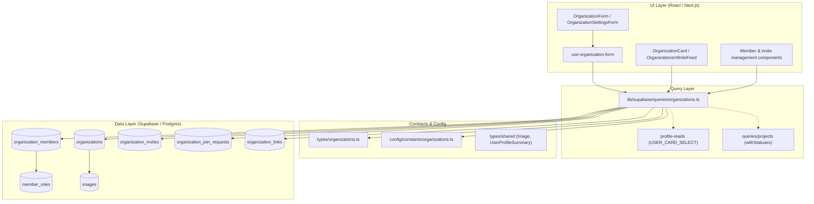
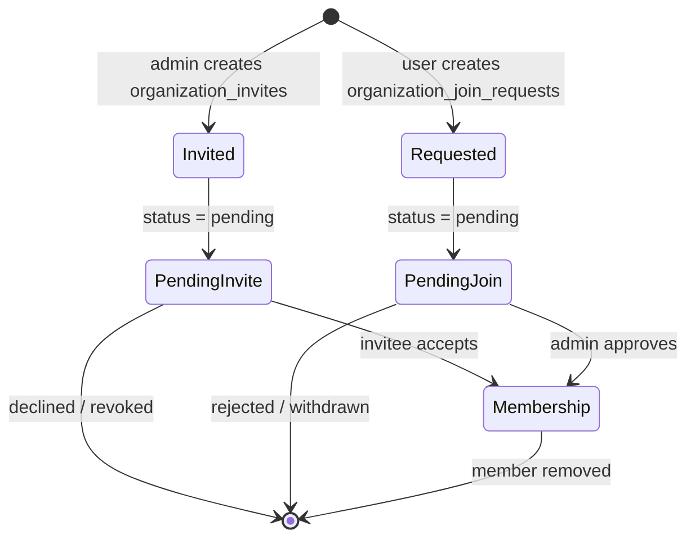
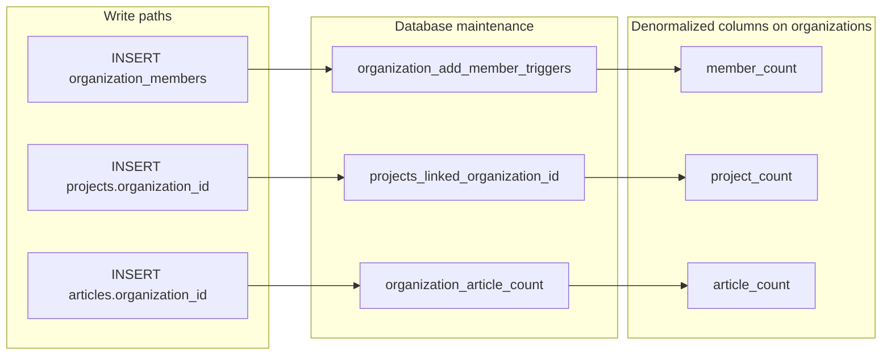

The Organizations subsystem models curated public-facing entities (organizations) with rich profiles, a membership graph backed by configurable roles, and an invitation/join-request workflow that governs how users become members.

## Purpose and Scope

This page documents the **organization profile + membership + role** capability: how organization records are shaped and read, how members are attached to organizations through the `organization_members` join table and `member_roles` lookup, how roles (`owner` / `admin` / `member`) are resolved and enforced, and how invites and join requests move users into membership.

Concretely, this page covers:

- The TypeScript type contracts that define the organization domain (`src/types/organizations.ts`).
- The read/query layer for organizations, members, invites and join requests (`src/lib/supabase/queries/organizations.ts`).
- Role resolution helpers (`getUserOrgRole`, `getAdminOrgs`) and permission-relevant conventions.
- Field validation constants (`src/config/constants/organizations.ts`).
- The database tables that back all of this (`organizations`, `organization_members`, `member_roles`, `organization_invites`, `organization_join_requests`, `organization_links`) and the triggers/migrations that keep counts in sync.

**Out of scope (sibling pages):** Organization *content* surfaces such as projects, articles and posts authored on behalf of an organization are covered by their own feature pages; project authorization and publication flows belong to the Projects pages as well. General profile/account handling for individual `user_profiles` is covered by the user profile pages. This page references those entities only where they must be joined into organization queries.

## Overview

An **organization** is a first-class entity in the platform with `slug`-addressable public pages, branding images (`logo_image`, `cover_image`), a `mission` and `description`, contact/social links, verification state (`verified`, `has_alpha_badge`), and denormalized counters (`member_count`, `project_count`, `article_count`).

Membership is modeled as a **many-to-many graph** between `user_profiles` and `organizations`, mediated by the `organization_members` table. Each membership row carries:

- `user_id` → the member's profile
- `organization_id` → the organization
- `role_id` → a foreign key into `member_roles`, a lookup table holding a human-readable `name` and a machine `slug`
- `title` → an organization-specific job title for that member
- `joined_at` → the join timestamp, used for stable ordering of rosters

Roles are deliberately stored in a **lookup table rather than as an enum on the membership row**. The application only ever interprets the `slug` values `owner`, `admin`, and `member` — this is codified in `OrgMemberRole`, the union type `"owner" | "admin" | "member"`. Storing the role as a row means new roles can be added in data without a schema migration, while the application's authorization logic narrows to the three slugs it understands.

Membership is not granted directly by users. Instead two asymmetric request flows exist:

1. **Invitations** (`organization_invites`): an org admin selects a user and a role; the invite sits in `status = 'pending'` until the invitee accepts.
2. **Join requests** (`organization_join_requests`): a user asks to join with an optional `message`; the request sits `pending` until an admin approves it.

Both flows are surfaced through paired queries: an *org-centric* view (what is pending for this organization) and a *user-centric* view (what is pending for me across all organizations).

## Architecture

The subsystem follows a layered design: Supabase Postgres tables at the bottom, a thin typed query layer in `src/lib/supabase/queries/organizations.ts`, TypeScript domain types in `src/types/organizations.ts`, validation constants in `src/config/constants/organizations.ts`, and React components/hooks on top.



**Why this shape:** the query layer is intentionally thin and declarative — every function issues a single Supabase `select()` with an embedded join graph and returns a `{ data, error }` tuple instead of throwing. That convention lets React Server Components render partial pages (e.g. an empty roster) without exception boundaries, while `notFound()` is called only where the absence of the entity is genuinely fatal for the route.

## Domain Type Contracts

All organization domain types are derived from the generated Supabase `Tables<>` helper, so the TypeScript surface stays in lockstep with the database schema. Read models use `Pick<>` to select exactly the columns a surface needs, which keeps query payloads narrow and makes it obvious which columns a component depends on.

```typescript
export type OrganizationMember = Pick<
  Tables<"organization_members">,
  "id" | "role_id" | "title" | "joined_at"
> & {
  member_role: Pick<Tables<"member_roles">, "id" | "name" | "slug"> | null;
  user_profile: UserProfileSummary | null;
};
```

> Source: [organizations.ts](https://github.com/ozeaon/ozeaon-v2/blob/0a4f1a95824db87782f1221a4108019d174df3d9/src/types/organizations.ts#L11-L17)

Key observations about this contract:

- `member_role` is **nullable**. A membership can exist whose `role_id` does not resolve to a row (or the embedded join was not requested). Every consumer must therefore handle a missing role rather than assuming `owner`/`admin`/`member`.
- `user_profile` is likewise nullable and is typed as `UserProfileSummary`, the shared compact profile shape — so the roster can render avatars and names without pulling a full profile graph.
- `title` is a free-text organization-scoped label, distinct from the global `member_roles.name`. This is what shows up as a person's job title inside the org.

The role slugs understood by the application are pinned by a union type:

```typescript
export type OrgMemberRole = "owner" | "admin" | "member";
```

> Source: [organizations.ts](https://github.com/ozeaon/ozeaon-v2/blob/0a4f1a95824db87782f1221a4108019d174df3d9/src/types/organizations.ts#L163)

Types are also split by *rendering context* rather than by table. For example:

| Type | Populated relations | Used for |
|------|--------------------|----------|
| `OrganizationForLayout` | `logo_image`, `cover_image`, `links` | Shared org page layout/header |
| `OrgForEdit` | image IDs + joined `logo_image`/`cover_image`/`links` | The edit/settings form |
| `OrganizationLinksData` | `links` + contact fields | Sidebar link rendering |
| `OrganizationForSidebar` | just `id` + links | Activity sidebar |
| `OrganizationWithRelations` | images, links, `members`, `projects`, `articles` | Full detail view |
| `OrgFeedRow` | `logo_image`, `viewer_role` | Infinite feed cards |

> Source: [organizations.ts](https://github.com/ozeaon/ozeaon-v2/blob/0a4f1a95824db87782f1221a4108019d174df3d9/src/types/organizations.ts#L60-L177)

The feed type is notable because it carries the **viewer's own relationship to the organization**:

```typescript
export type OrgFeedRow = Pick<
  Tables<"organizations">,
  | "id"
  | "slug"
  | "name"
  | "mission"
  | "member_count"
  | "project_count"
  | "article_count"
> & {
  logo_image: Pick<Tables<"images">, "path" | "alt"> | null;
  viewer_role: OrgMemberRole | null;
};
```

> Source: [organizations.ts](https://github.com/ozeaon/ozeaon-v2/blob/0a4f1a95824db87782f1221a4108019d174df3d9/src/types/organizations.ts#L165-L177)

`viewer_role` being part of the *feed row* — rather than resolved per-card on the client — is a deliberate design choice: it lets the feed render the correct affordance ("Join", "Member", "Manage") in a single server round trip with no N+1 role lookups.

## Query Layer: Organization Reads

The query layer lives in a single module and is organized by *access pattern*, not by table. Every reader uses one of two Supabase clients: `createPublicClient()` for anonymous/公开 data, or an injected `SupabaseClient` (typically a user-scoped, cookie-bound client) for anything that depends on the caller's identity.

### Slug resolution and 404 semantics

The public route layer resolves a slug to an id before doing anything else, and this is the one place where absence is fatal:

```typescript
export async function getOrgIdBySlugOrNotFound(slug: string): Promise<string> {
  notFoundIfPlaceholder(slug);
  const supabase = createPublicClient();
  const { data, error } = await supabase
    .from("organizations")
    .select("id")
    .eq("slug", slug)
    .maybeSingle();

  if (error) throw new Error(error.message);
  if (!data) notFound();
  return data.id;
}
```

> Source: [organizations.ts](https://github.com/ozeaon/ozeaon-v2/blob/0a4f1a95824db87782f1221a4108019d174df3d9/src/lib/supabase/queries/organizations.ts#L82-L94)

Three distinct behaviors are layered here, in order:

1. `notFoundIfPlaceholder(slug)` short-circuits placeholder/demo slugs **before** touching the database, so no unnecessary round trip is made for known non-entities.
2. `maybeSingle()` is used instead of `single()` so that "no row" is a `null` value, not a `PGRST116` error. Database errors still propagate as thrown `Error`s — genuine failures are not swallowed.
3. Only a confirmed missing row calls Next.js's `notFound()`, which renders the nearest `not-found` boundary.

The same `maybeSingle()` idiom is reused for the edit read, with an explicit rationale in the source:

```typescript
    .eq("slug", slug)
    // maybeSingle, so a deleted organisation is a null the caller can handle
    // rather than a PGRST116 thrown at whatever rendered it.
    .maybeSingle();
```

> Source: [organizations.ts](https://github.com/ozeaon/ozeaon-v2/blob/0a4f1a95824db87782f1221a4108019d174df3d9/src/lib/supabase/queries/organizations.ts#L248-L251)

This distinction matters operationally: `getOrgIdBySlugOrNotFound` is used for routes where a missing org means the URL is invalid, while `getOrgForEdit` returns a `null` payload so an edit page can show a graceful "no longer exists" state instead of crashing.

### Layout vs. edit projections

`getOrganizationLayout` returns exactly the columns the shared org layout needs, including verified/badge flags and both counters:

```typescript
    .select(
      `
      id, slug, name, verified, has_alpha_badge, mission, member_count, project_count,
      contact_email, website_url, linkedin_url,
      logo_image:images!logo_image_id(path, alt),
      cover_image:images!cover_image_id(path, alt),
      links:organization_links(id, label, url)
    `,
    )
    .eq("slug", slug)
    .single();
```

> Source: [organizations.ts](https://github.com/ozeaon/ozeaon-v2/blob/0a4f1a95824db87782f1221a4108019d174df3d9/src/lib/supabase/queries/organizations.ts#L102-L112)

Note the mixed use of `.single()` here versus `.maybeSingle()` in the edit path: the layout query is only ever reached after the route has already resolved the organization, so a missing row at this point *is* an error condition.

### Member roster reads

Member reads use a shared, reusable selection fragment so that every consumer of a roster gets an identical shape. This is the single source of truth for how a member row is hydrated:

```typescript
const ORG_MEMBER_SELECT = `
  id, role_id, title, joined_at,
  member_role:member_roles!role_id(id, name, slug),
  user_profile:user_profiles!user_id(${USER_CARD_SELECT})
`;
```

> Source: [organizations.ts](https://github.com/ozeaon/ozeaon-v2/blob/0a4f1a95824db87782f1221a4108019d174df3d9/src/lib/supabase/queries/organizations.ts#L76-L80)

The `member_roles!role_id` and `user_profiles!user_id` syntax is PostgREST's *foreign-key-disambiguated embed*: because `organization_members` has multiple foreign keys pointing at `user_profiles` and into lookup tables, the constraint name is given explicitly so PostgREST knows which relationship to follow. `USER_CARD_SELECT` pulls in the compact profile card fields as a nested projection.

Two read entry points are exposed, distinguished by whether the caller has a slug or an id:

```typescript
export async function getOrganizationMembers(
  supabase: SupabaseClient,
  slug: string,
): Promise<{ data: OrganizationMember[]; error: Error | null }> {
  const { data, error } = await supabase
    .from("organizations")
    .select(`members:organization_members(${ORG_MEMBER_SELECT})`)
    .eq("slug", slug)
    .maybeSingle();

  return {
    data: (data as { members: OrganizationMember[] } | null)?.members ?? [],
    error: error as Error | null,
  };
}
```

> Source: [organizations.ts](https://github.com/ozeaon/ozeaon-v2/blob/0a4f1a95824db87782f1221a4108019d174df3d9/src/lib/supabase/queries/organizations.ts#L259-L273)

`getOrganizationMembers` traverses *from* `organizations` and joins *down* into members, which returns `[]` rather than `null` when the join yields nothing — the `?? []` normalizes that. `getOrganizationMembersById` inverts the direction and applies an ordering guarantee:

```typescript
export async function getOrganizationMembersById(
  supabase: SupabaseClient,
  orgId: string,
): Promise<{ data: OrganizationMember[]; error: Error | null }> {
  const { data, error } = await supabase
    .from("organization_members")
    .select(ORG_MEMBER_SELECT)
    .eq("organization_id", orgId)
    .order("joined_at", { ascending: true });

  return {
    data: (data as OrganizationMember[] | null) ?? [],
    error: error as Error | null,
  };
}
```

> Source: [organizations.ts](https://github.com/ozeaon/ozeaon-v2/blob/0a4f1a95824db87782f1221a4108019d174df3d9/src/lib/supabase/queries/organizations.ts#L275-L289)

Ordering by `joined_at` ascending means the roster reads as **seniority order** — founders and earliest members appear first. This is a stable ordering, which matters for server-rendered lists that must not shuffle between requests.

### Composite select fragments

Beyond single-row reads, the module exports named select fragments that other query modules and surfaces can reuse, so a full organization graph is described in exactly one place:

| Fragment | Contents | Notes |
|----------|----------|-------|
| `ORG_PUBLIC_SELECT` | `*` + images + links + `members` | Full public org detail graph |
| `ORG_LATEST_SELECT` | core fields + images + links + `follows` + `sdgs` | "Latest organizations" listings with follow and SDG relations |
| `ORG_PROJECTS_SELECT` | project cards + subcategories + `authoring_org` | Projects attributed to the org |
| `ORG_ARTICLES_SELECT` | article cards + author + `authoring_org` + `linked_organization` | Articles authored *or* linked to the org |

> Source: [organizations.ts](https://github.com/ozeaon/ozeaon-v2/blob/0a4f1a95824db87782f1221a4108019d174df3d9/src/lib/supabase/queries/organizations.ts#L291-L326)

The distinction between `authoring_org` and `linked_organization` on articles is meaningful: an article can be *authored by* the org's editors (`organization_id`) or merely *linked to* it (`linked_organization_id`), and the select fragment preserves both so the UI can present them differently.

## Roles & Authorization

### Resolving a viewer's role

Authorization is expressed as a single question: *what role does this user hold in this organization?* That is answered by `getUserOrgRole`, which returns a narrow union or `null`:

```typescript
export async function getUserOrgRole(
  supabase: SupabaseClient,
  orgId: string,
  userId: string,
): Promise<"owner" | "admin" | "member" | null> {
  const { data, error } = await supabase
    .from("organization_members")
    .select("member_roles!role_id(slug)")
    .eq("organization_id", orgId)
    .eq("user_id", userId)
    .maybeSingle();

  if (error) throw error;

  const slug = (
    data as { member_roles: Pick<Tables<"member_roles">, "slug"> | null } | null
  )?.member_roles?.slug;
  if (slug === "owner" || slug === "admin" || slug === "member") return slug;
  return null;
}
```

> Source: [organizations.ts](https://github.com/ozeaon/ozeaon-v2/blob/0a4f1a95824db87782f1221a4108019d174df3d9/src/lib/supabase/queries/organizations.ts#L211-L230)

Design notes worth internalizing:

- **Only the `slug` is fetched** for the role — not `id` or `name`. The authorization decision needs the machine identifier, so the select is minimized accordingly.
- The `(organization_id, user_id)` pair is queried with `maybeSingle()`, which encodes the invariant that a user has **at most one membership per organization**. If the schema ever allowed duplicates, this call would surface an error rather than silently picking one.
- The final comparison is an **allow-list**, not a pass-through. An unrecognized role slug resolves to `null` (no role), so a typo'd or newly seeded role in `member_roles` fails closed rather than being treated as privileged.
- Errors **throw** here, in contrast to the `{ data, error }` convention used by read models. Because this function feeds authorization decisions, a silent failure is not acceptable — the caller must abort.

### Aggregating admin capabilities across organizations

For navigation and org-switcher UI, the platform needs to know every organization a user can administer. `getAdminOrgs` fetches all memberships and filters in-process:

```typescript
export const getAdminOrgs = cache(
  async (supabase: SupabaseClient, userId: string): Promise<AdminOrg[]> => {
    const { data, error } = await supabase
      .from("organization_members")
      .select(
        `
      role:member_roles!role_id(slug),
      organization:organizations!organization_id(
        id, name, slug,
        logo_image:images!logo_image_id(path)
      )
    `,
      )
      .eq("user_id", userId);

    if (error || !data) return [];

    return (data as unknown as AdminMembershipRow[])
      .filter((m) => {
        const slug = m.role?.slug;
        return slug === "owner" || slug === "admin";
      })
      .flatMap((m) => {
        const org = m.organization;
        if (!org) return [];
        return [
          {
            id: org.id,
            name: org.name,
            slug: org.slug,
            logo_path: org.logo_image?.path ?? null,
          },
        ];
      });
  },
);
```

> Source: [organizations.ts](https://github.com/ozeaon/ozeaon-v2/blob/0a4f1a95824db87782f1221a4108019d174df3d9/src/lib/supabase/queries/organizations.ts#L39-L74)

Critical design properties:

- **`cache()` wrapping.** This is React's request-scoped `cache`, not a persistent cache. The same user's admin list is frequently needed by several components in one render (nav, switcher, layout guard); wrapping deduplicates those calls to a single database round trip *within a request* and memoizes across them.
- **Single query, client-side filter.** Rather than issuing two queries with `.in("role_id", ...)`, it fetches the user's memberships once and filters for `owner`/`admin`. This avoids a second lookup of role ids and is safe because membership counts per user are small.
- **`member` is deliberately excluded.** `getAdminOrgs` answers "which orgs can I manage", so a plain member role is not included.
- **Failure is graceful.** On error it returns `[]`, so a transient failure degrades to "no admin organizations shown" instead of breaking the whole navigation. This is the opposite of `getUserOrgRole`'s throw-on-error, and the difference is intentional: navigation is cosmetic, authorization is not.
- Only `logo_image.path` is fetched (not `alt`), because the switcher renders a small icon.

### The role model at a glance


## Invitations and Join Requests

Membership growth is handled by two tables with symmetric lifecycles. Each has a `status` column and a `created_at`, plus a `pending` state that drives every "waiting on you" surface.

### Invitations (`organization_invites`)

An invitation is *org-initiated*: an org admin picks a role and an invitee (`invitee_user_id`). The org-centric read returns pending invites with the target role and invitee card:

```typescript
const PENDING_ORG_INVITES_SELECT = `
  id, status, created_at,
  role:member_roles!role_id(name, slug),
  invitee:user_profiles!invitee_user_id(
    id, username, display_name, avatar_image_id,
    avatar_image:images!avatar_image_id(id, path, alt)
  )
`;

export async function getPendingOrgInvites(
  supabase: SupabaseClient,
  orgId: string,
): Promise<{ data: OrgInvite[]; error: Error | null }> {
  const { data, error } = await supabase
    .from("organization_invites")
    .select(PENDING_ORG_INVITES_SELECT)
    .eq("organization_id", orgId)
    .eq("status", "pending")
    .order("created_at", { ascending: false });

  return {
    data: (data as OrgInvite[] | null) ?? [],
    error: error as Error | null,
  };
}
```

> Source: [organizations.ts](https://github.com/ozeaon/ozeaon-v2/blob/0a4f1a95824db87782f1221a4108019d174df3d9/src/lib/supabase/queries/organizations.ts#L328-L352)

`created_at` is ordered **descending** here — the admin console shows newest invites first. Contrast this with join requests, which order ascending (below).

The user-centric mirror answers "what have I been invited to?" across all organizations:

```typescript
export async function getPendingInvitesForUser(
  supabase: SupabaseClient,
  userId: string,
): Promise<{ data: UserInvite[]; error: Error | null }> {
  const { data, error } = await supabase
    .from("organization_invites")
    .select(PENDING_USER_INVITES_SELECT)
    .eq("invitee_user_id", userId)
    .eq("status", "pending")
    .order("created_at", { ascending: false });

  return {
    data: (data as UserInvite[] | null) ?? [],
    error: error as Error | null,
  };
}
```

> Source: [organizations.ts](https://github.com/ozeaon/ozeaon-v2/blob/0a4f1a95824db87782f1221a4108019d174df3d9/src/lib/supabase/queries/organizations.ts#L414-L429)

Note that the invited user sees only the **role name** (not slug) and a compact organization card — they need to read "Admin", not reason about a slug.

### Join requests (`organization_join_requests`)

A join request is *user-initiated* and carries an optional free-text `message`:

```typescript
export async function getPendingOrgJoinRequests(
  supabase: SupabaseClient,
  orgId: string,
): Promise<{ data: OrgJoinRequest[]; error: Error | null }> {
  const { data, error } = await supabase
    .from("organization_join_requests")
    .select(PENDING_ORG_JOIN_REQUESTS_SELECT)
    .eq("organization_id", orgId)
    .eq("status", "pending")
    .order("created_at", { ascending: true });

  return {
    data: (data as OrgJoinRequest[] | null) ?? [],
    error: error as Error | null,
  };
}
```

> Source: [organizations.ts](https://github.com/ozeaon/ozeaon-v2/blob/0a4f1a95824db87782f1221a4108019d174df3d9/src/lib/supabase/queries/organizations.ts#L375-L390)

The ascending order is a deliberate fairness/queueing choice: the oldest unanswered request appears first so admins work the backlog in FIFO order.

### Count queries for badge indicators

Alongside each list query there is a head-only count query. These are cheap because they use `{ count: "exact", head: true }`, which asks Postgres for a count without transferring rows:

```typescript
export async function getPendingOrgInviteCount(
  supabase: SupabaseClient,
  orgId: string,
): Promise<{ count: number; error: Error | null }> {
  const { count, error } = await supabase
    .from("organization_invites")
    .select("id", { count: "exact", head: true })
    .eq("organization_id", orgId)
    .eq("status", "pending");

  return { count: count ?? 0, error: error as Error | null };
}
```

> Source: [organizations.ts](https://github.com/ozeaon/ozeaon-v2/blob/0a4f1a95824db87782f1221a4108019d174df3d9/src/lib/supabase/queries/organizations.ts#L354-L365)

The four count functions form a predictable family, each returning `{ count, error }` with `count` defaulted to `0`:

| Function | Scope | Filter |
|----------|-------|--------|
| `getPendingOrgInviteCount` | one org | `organization_id`, `status = pending` |
| `getPendingOrgJoinRequestCount` | one org | `organization_id`, `status = pending` |
| `getPendingInviteCountForUser` | one user | `invitee_user_id`, `status = pending` |

> Source: [organizations.ts](https://github.com/ozeaon/ozeaon-v2/blob/0a4f1a95824db87782f1221a4108019d174df3d9/src/lib/supabase/queries/organizations.ts#L354-L403) and [organizations.ts](https://github.com/ozeaon/ozeaon-v2/blob/0a4f1a95824db87782f1221a4108019d174df3d9/src/lib/supabase/queries/organizations.ts#L431-L439)

Separating counts from lists is what allows badges (e.g. a nav bell showing "3 pending") to update cheaply without hydrating full card graphs.

## Membership Lifecycle

Combining the pieces above, the membership lifecycle is a state machine with two ingestion paths and one terminal state.



The corresponding end-to-end interaction, from the perspective of a prospective member and an org admin:

```mermaid
sequenceDiagram
    participant U as User
    participant V as Org Admin
    participant Q as Query Layer
    participant DB as Supabase Postgres

    V->>Q: getOrgForEdit(supabase, slug)
    Q->>DB: organizations select where slug
    DB-->>Q: OrgForEdit row
    V->>Q: getPendingOrgJoinRequests(supabase, orgId)
    Q->>DB: organization_join_requests status=pending order joined asc
    DB-->>Q: OrgJoinRequest[]
    Q-->>V: pending queue
    V->>Q: getUserOrgRole(supabase, orgId, adminUserId)
    Q->>DB: organization_members + member_roles!role_id
    DB-->>Q: slug = admin
    Q-->>V: "admin"
    Note over V,DB: Admin approves; row inserted into organization_members with role_id
    U->>Q: getPendingInvitesForUser(supabase, userId)
    Q->>DB: organization_invites invitee_user_id, status=pending
    DB-->>Q: UserInvite[]
    Q-->>U: invitation list with org cards
```

Notice that every write to `organization_members` ultimately comes from resolving one of these two states — there is no direct "add member" read path exposed by this query module, which keeps the membership graph and the request tables consistent by construction.

## Counters: Denormalized Aggregates

`organizations` carries `member_count`, `project_count` and `article_count` as denormalized columns. These are not computed by the query layer; they are maintained by database triggers and migrations so that feed cards and layouts can display counts without aggregate queries.



Evidence for these maintenance mechanisms exists as dedicated migrations, which is itself important context: the counters are **schema-managed, not application-managed**, so application code must not write them directly:

- `supabase/migrations/20260520000000_organization_add_member_triggers.sql` — trigger(s) that react to membership insertion.
- `supabase/migrations/20260805223000_organization_article_count.sql` — maintains `article_count`.
- `supabase/migrations/20260511000000_projects_linked_organization_id.sql` and `20260507000000_add_organization_id_to_content_tables.sql` — attach `organization_id` to content tables so attribution and counting are possible.
- `supabase/migrations/20260720164149_unverify_all_organizations.sql` — a one-off data operation resetting the `verified` flag.

Because counters can drift if a migration is applied against an already-populated database, `verified` history shows the project is willing to run corrective data migrations — a pattern to follow when adding new denormalized fields.

## Activity Metrics

Beyond stored counters, the module computes **time-windowed activity** for an organization, including a month-over-month trend indicator. This is the only place in the module that performs aggregate counting in application code:

```typescript
    const [projectsTotal, projectsThisMonth, projectsLastMonth, ...] =
      await Promise.all([
        projectsBase(),
        projectsBase().gte("published_at", thisMonthStart),
        projectsBase()
          .gte("published_at", lastMonthStart)
          .lt("published_at", thisMonthStart),
        // ...articles equivalents
      ]);
```

> Source: [organizations.ts](https://github.com/ozeaon/ozeaon-v2/blob/0a4f1a95824db87782f1221a4108019d174df3d9/src/lib/supabase/queries/organizations.ts#L164-L182)

The trend itself is computed by a small pure function with carefully defined boundary behavior:

```typescript
function computeOrgTrend(thisMonth: number, lastMonth: number) {
  if (lastMonth > 0) {
    const pct = Math.round(((thisMonth - lastMonth) / lastMonth) * 100);
    return { value: `${pct >= 0 ? "+" : ""}${pct}%`, positive: pct >= 0 };
  }
  if (thisMonth > 0) return { value: "+100%", positive: true };
  return { value: "+0%", positive: true };
}
```

> Source: [organizations.ts](https://github.com/ozeaon/ozeaon-v2/blob/0a4f1a95824db87782f1221a4108019d174df3d9/src/lib/supabase/queries/organizations.ts#L126-L133)

Edge cases are handled explicitly rather than left to produce `Infinity` or `NaN`:

| `lastMonth` | `thisMonth` | Result | Rationale |
|-------------|-------------|--------|-----------|
| `> 0` | any | Rounded percentage, signed | Normal case |
| `0` | `> 0` | `"+100%"` | Growth from zero is not a percentage — clamp |
| `0` | `0` | `"+0%"` | No activity; reported as neutral-positive |

The function is `cache()`d per `orgId`, and its six parallel queries are all head-only counts on `published` rows, so the cost is six index counts rather than row transfers. Errors are **logged but not thrown**:

```typescript
    if (errors.length > 0) {
      logError(logger, "getOrganizationActivityCounts failed", errors[0], {
        orgId,
      });
    }
```

> Source: [organizations.ts](https://github.com/ozeaon/ozeaon-v2/blob/0a4f1a95824db87782f1221a4108019d174df3d9/src/lib/supabase/queries/organizations.ts#L192-L196)

Falling through to zero-valued counts on error means the activity widget degrades gracefully rather than taking down the page. The logger is scoped with `getLogger(["lib", "supabase"])` for structured filtering.

## Validation & Field Limits

Organization form validation is driven by a single constants module so that clients and servers agree on limits and required fields:

```typescript
export const ORG_FIELD_LIMITS = {
  name: { max: 120 },
  slug: { max: 120 },
  mission: { max: 120 },
  description: { max: 3000 },
};

/** Single source of truth for which organisation fields are required. */
export const ORG_REQUIRED_FIELD_MESSAGES = {
  name: "Please fill in the Organisation Name",
  slug: "Please fill in the Organisation Slug",
  organization_type_id: "Please fill in the Organisation Type",
  mission: "Please fill in the Mission",
} as const;

export const ORG_REQUIRED_FIELDS = Object.keys(
  ORG_REQUIRED_FIELD_MESSAGES,
) as (keyof typeof ORG_REQUIRED_FIELD_MESSAGES)[];
```

> Source: [organizations.ts](https://github.com/ozeaon/ozeaon-v2/blob/0a4f1a95824db87782f1221a4108019d174df3d9/src/config/constants/organizations.ts#L1-L26)

Design rationale: `ORG_REQUIRED_FIELDS` is **derived** from the message map rather than declared separately, so the required-field list and its user-facing messages can never drift apart. The `as const` on the message object preserves literal key types, and the cast on `Object.keys` re-narrows the result to `keyof typeof ORG_REQUIRED_FIELD_MESSAGES`.

| Field | Max length | Required |
|-------|-----------|----------|
| `name` | 120 | ✅ |
| `slug` | 120 | ✅ |
| `mission` | 120 | ✅ |
| `organization_type_id` | — | ✅ |
| `description` | 3000 | ❌ |

The asymmetry is intentional: `mission` is a one-line tagline (120 chars, rendered in cards and headers) while `description` is long-form body copy (3000 chars). Both `name` and `slug` are capped at 120, matching the practical limit for a URL segment and a display title.

## API Reference

### Query functions (`src/lib/supabase/queries/organizations.ts`)

| Function | Params | Returns | Notes |
|----------|--------|---------|-------|
| `getOrgIdBySlugOrNotFound(slug)` | `slug: string` | `Promise<string>` | Calls `notFound()` when the slug is missing; throws on DB error. Uses `createPublicClient()`. |
| `getOrganizationLayout(slug)` | `slug: string` | `Promise<{ data: OrganizationForLayout \| null; error: Error \| null }>` | Uses `.single()`; layout projection with images, links, counters, badges. |
| `getOrgForEdit(supabase, slug)` | `supabase: SupabaseClient`, `slug: string` | `Promise<{ data: OrgForEdit \| null; error: Error \| null }>` | Uses `.maybeSingle()` so deleted orgs become `null`. |
| `getOrganizationMembers(supabase, slug)` | `supabase`, `slug` | `Promise<{ data: OrganizationMember[]; error }>` | Traverses from `organizations`; returns `[]` when empty. |
| `getOrganizationMembersById(supabase, orgId)` | `supabase`, `orgId` | `Promise<{ data: OrganizationMember[]; error }>` | Ordered by `joined_at` ascending. |
| `getUserOrgRole(supabase, orgId, userId)` | `supabase`, `orgId`, `userId` | `Promise<"owner" \| "admin" \| "member" \| null>` | **Throws** on error; allow-lists known slugs. |
| `getAdminOrgs(supabase, userId)` | `supabase`, `userId` | `Promise<AdminOrg[]>` | `cache()`d; returns `[]` on error; filters to `owner`/`admin`. |
| `getOrganizationActivityCounts(orgId)` | `orgId` | `Promise<OrganizationActivityCounts>` | `cache()`d; six parallel head counts; logs errors. |
| `getPendingOrgInvites(supabase, orgId)` | `supabase`, `orgId` | `Promise<{ data: OrgInvite[]; error }>` | `status = pending`, newest first. |
| `getPendingOrgInviteCount(supabase, orgId)` | `supabase`, `orgId` | `Promise<{ count: number; error }>` | Head-only count. |
| `getPendingOrgJoinRequests(supabase, orgId)` | `supabase`, `orgId` | `Promise<{ data: OrgJoinRequest[]; error }>` | `status = pending`, oldest first (FIFO). |
| `getPendingOrgJoinRequestCount(supabase, orgId)` | `supabase`, `orgId` | `Promise<{ count: number; error }>` | Head-only count. |
| `getPendingInvitesForUser(supabase, userId)` | `supabase`, `userId` | `Promise<{ data: UserInvite[]; error }>` | All orgs, newest first. |
| `getPendingInviteCountForUser(supabase, userId)` | `supabase`, `userId` | `Promise<{ count: number; error }>` | Head-only count. |

Exported helper types from the same module:

- `AdminOrg` — `{ id, name, slug, logo_path }` used by the org switcher.
- `AdminMembershipRow` — the raw embedded shape returned by `getAdminOrgs` before filtering.
- `OrganizationActivityCounts` — `{ projectCount, articleCount, trend: { value, positive } }`.
- Select fragments `ORG_LATEST_SELECT`, `ORG_PUBLIC_SELECT`, plus internal `ORG_MEMBER_SELECT`, `ORG_PROJECTS_SELECT`, `ORG_ARTICLES_SELECT`, `PENDING_*_SELECT`.

### Constants (`src/config/constants/organizations.ts`)

| Export | Type | Purpose |
|--------|------|---------|
| `ORG_FIELD_LIMITS` | `{ name, slug, mission, description: { max: number } }` | Client/server length caps |
| `ORG_REQUIRED_FIELD_MESSAGES` | `Record<field, string>` (`as const`) | Required fields → validation messages |
| `ORG_REQUIRED_FIELDS` | `(keyof typeof ORG_REQUIRED_FIELD_MESSAGES)[]` | Derived required-field list |

## Failure Modes, Edge Cases & Consistency

The module is inconsistent about error handling **on purpose**, and understanding the rule is essential for extending it safely.


| Failure mode | Handling | Where |
|--------------|----------|-------|
| Slug not found on a route | `notFound()` → 404 boundary | `getOrgIdBySlugOrNotFound` |
| Placeholder/demo slug | `notFoundIfPlaceholder()` before any DB call | `getOrgIdBySlugOrNotFound` |
| Organization deleted mid-session | `null` payload (`maybeSingle`) | `getOrgForEdit` |
| Membership row missing | `null` role, treated as non-member | `getUserOrgRole` |
| Unknown role slug in `member_roles` | Resolves to `null` (fail closed) | `getUserOrgRole` allow-list |
| Query error loading admin orgs | Returns `[]` (nav degrades) | `getAdminOrgs` |
| Count query error in activity widget | Logged via `logError`, counts fall back to `0` | `getOrganizationActivityCounts` |
| Empty member roster | `?? []` normalization | `getOrganizationMembers`, `getOrganizationMembersById` |
| `role_id` not resolving to a row | `member_role` is `null` in the type | `OrganizationMember` |
| `last_month` count is zero | `computeOrgTrend` clamps to `"+100%"` / `"+0%"` | `computeOrgTrend` |

**Concurrency and consistency considerations:**

- **Invariants enforced by `maybeSingle()`.** `getUserOrgRole` assumes at most one membership per `(organization_id, user_id)`. Reaching for `maybeSingle()` makes a violation surface as an error instead of silently selecting an arbitrary row — a schema-level uniqueness constraint on that pair is the implied companion requirement.
- **Denormalized counters are eventually consistent.** `member_count`, `project_count` and `article_count` are maintained by triggers/migrations, not transactions in the application. Code that reads a count immediately after inserting a membership should not assume it has already incremented within the same statement batch; the trigger migration (`20260520000000_organization_add_member_triggers.sql`) exists precisely to close that gap at the database level.
- **Duplicate pending requests.** Because invites and join requests are separate tables with independent `status` columns, nothing in the query layer prevents a user from holding both a pending invite *and* a pending join request for the same org. Any de-duplication must happen in the write path or via a database constraint.
- **Request-scoped caching.** `cache()` on `getAdminOrgs` and `getOrganizationActivityCounts` deduplicates work *within a single request only*. It provides no cross-request invalidation, so a newly approved member will see updated admin-org lists on their next request, not immediately within the current render.

## Performance & Operational Notes

**Payload minimization.** Every read model uses `Pick<>`-style narrow selects and explicit column lists rather than `select("*")` at the top level. `getUserOrgRole` fetches only `member_roles.slug`; `getAdminOrgs` fetches only `logo_image.path`. This keeps JSON payloads small, which matters most on list endpoints such as the infinite feed.

**List vs. count separation.** Pending-work surfaces use two distinct calls: a full list for the management page and a head-only `count: "exact", head: true` call for badges. The count query transfers zero rows, so rendering a badge costs an index count rather than a card graph hydration.

**Parallel aggregate queries.** `getOrganizationActivityCounts` issues all six count queries concurrently via `Promise.all` instead of awaiting sequentially, so the widget's latency is governed by the slowest single count rather than their sum.

**Single round trip for viewer context.** `OrgFeedRow.viewer_role` embeds the viewer's role into each feed row, avoiding per-card role lookups and the N+1 pattern that would otherwise dominate feed rendering.

**`cache()` as request memoization.** React's `cache` is applied to the two functions whose results are reused within a single render tree (`getAdminOrgs`, `getOrganizationActivityCounts`). It is intentionally *not* applied to the identity-dependent readers like `getUserOrgRole`, which are cheap single-row lookups.

**Ordering guarantees.** Roster reads use `.order("joined_at", { ascending: true })` and pending-invite reads use descending `created_at`. These are stable, deterministic orders — important for server-rendered lists that must not shuffle between requests or between the server render and a client re-render.

**Structured logging.** The module obtains a scoped logger via `getLogger(["lib", "supabase"])` and reports failures through `logError(logger, message, error, context)` with `{ orgId }` context. This makes organization-specific failures filterable in logs.

## Extension Points

Based on the structure of the module, the following are the natural extension seams:

1. **Adding a new role.** Insert a row into `member_roles` with a new `name`/`slug`. Note that `getUserOrgRole` **will not recognize it** — it allow-lists `owner`, `admin`, `member`. To make a new role meaningful for authorization you must extend both the `OrgMemberRole` union in `src/types/organizations.ts` and the comparison in `getUserOrgRole`.
2. **Adding a column to a read model.** Because read models are `Pick<>`-based, adding a field requires updating the type in `src/types/organizations.ts` and the corresponding select in the query fragment (e.g. `ORG_MEMBER_SELECT`), so all consumers of that shape get it consistently.
3. **New projection surfaces.** Composite fragments (`ORG_PUBLIC_SELECT`, `ORG_LATEST_SELECT`, `ORG_PROJECTS_SELECT`, `ORG_ARTICLES_SELECT`) are the intended reuse mechanism. Adding a new surface should mean adding a named fragment rather than inlining a select.
4. **New validation rules.** Extend `ORG_FIELD_LIMITS` and, for required fields, `ORG_REQUIRED_FIELD_MESSAGES`. `ORG_REQUIRED_FIELDS` derives automatically.
5. **New denormalized counter.** Follow the established trigger-migration pattern (as in `20260805223000_organization_article_count.sql`) and add a corrective data migration, as was done for `verified` in `20260720164149_unverify_all_organizations.sql`.

## Related Links

### Domain contracts and configuration

- [src/types/organizations.ts](https://github.com/ozeaon/ozeaon-v2/blob/0a4f1a95824db87782f1221a4108019d174df3d9/src/types/organizations.ts) — all organization domain types (`OrganizationMember`, `OrgMemberRole`, `OrganizationWithRelations`, `OrgInvite`, `OrgJoinRequest`, `UserMembership`, `OrgFeedRow`, …)
- [src/config/constants/organizations.ts](https://github.com/ozeaon/ozeaon-v2/blob/0a4f1a95824db87782f1221a4108019d174df3d9/src/config/constants/organizations.ts) — field limits and required-field definitions

### Query layer

- [src/lib/supabase/queries/organizations.ts](https://github.com/ozeaon/ozeaon-v2/blob/0a4f1a95824db87782f1221a4108019d174df3d9/src/lib/supabase/queries/organizations.ts) — organization, member, role, invite and join-request reads
- [src/lib/supabase/queries/profile-reads.ts](https://github.com/ozeaon/ozeaon-v2/blob/0a4f1a95824db87782f1221a4108019d174df3d9/src/lib/supabase/queries/profile-reads.ts) — provides `USER_CARD_SELECT` used to hydrate member/invitee cards

### UI surfaces

- [src/components/organizations/form/OrganizationForm.tsx](https://github.com/ozeaon/ozeaon-v2/blob/0a4f1a95824db87782f1221a4108019d174df3d9/src/components/organizations/form/OrganizationForm.tsx)
- [src/components/organizations/form/OrganizationSettingsForm.tsx](https://github.com/ozeaon/ozeaon-v2/blob/0a4f1a95824db87782f1221a4108019d174df3d9/src/components/organizations/form/OrganizationSettingsForm.tsx)
- [src/components/organizations/cards/OrganizationCard.tsx](https://github.com/ozeaon/ozeaon-v2/blob/0a4f1a95824db87782f1221a4108019d174df3d9/src/components/organizations/cards/OrganizationCard.tsx)
- [src/components/organizations/OrganizationsInfiniteFeed.tsx](https://github.com/ozeaon/ozeaon-v2/blob/0a4f1a95824db87782f1221a4108019d174df3d9/src/components/organizations/OrganizationsInfiniteFeed.tsx)
- [src/components/organizations/OrganizationsTabs.tsx](https://github.com/ozeaon/ozeaon-v2/blob/0a4f1a95824db87782f1221a4108019d174df3d9/src/components/organizations/OrganizationsTabs.tsx)
- [src/components/profiles/organizations/OrganizationActions.tsx](https://github.com/ozeaon/ozeaon-v2/blob/0a4f1a95824db87782f1221a4108019d174df3d9/src/components/profiles/organizations/OrganizationActions.tsx)
- [src/components/profiles/organizations/OrganizationDataSlot.tsx](https://github.com/ozeaon/ozeaon-v2/blob/0a4f1a95824db87782f1221a4108019d174df3d9/src/components/profiles/organizations/OrganizationDataSlot.tsx)
- [src/components/profiles/organizations/OrganizationActivitySidebar.tsx](https://github.com/ozeaon/ozeaon-v2/blob/0a4f1a95824db87782f1221a4108019d174df3d9/src/components/profiles/organizations/OrganizationActivitySidebar.tsx)
- [src/hooks/use-organization-form.ts](https://github.com/ozeaon/ozeaon-v2/blob/0a4f1a95824db87782f1221a4108019d174df3d9/src/hooks/use-organization-form.ts)

### Database migrations

- [supabase/migrations/20260507000000_add_organization_id_to_content_tables.sql](https://github.com/ozeaon/ozeaon-v2/blob/0a4f1a95824db87782f1221a4108019d174df3d9/supabase/migrations/20260507000000_add_organization_id_to_content_tables.sql)
- [supabase/migrations/20260511000000_projects_linked_organization_id.sql](https://github.com/ozeaon/ozeaon-v2/blob/0a4f1a95824db87782f1221a4108019d174df3d9/supabase/migrations/20260511000000_projects_linked_organization_id.sql)
- [supabase/migrations/20260520000000_organization_add_member_triggers.sql](https://github.com/ozeaon/ozeaon-v2/blob/0a4f1a95824db87782f1221a4108019d174df3d9/supabase/migrations/20260520000000_organization_add_member_triggers.sql)
- [supabase/migrations/20260720164149_unverify_all_organizations.sql](https://github.com/ozeaon/ozeaon-v2/blob/0a4f1a95824db87782f1221a4108019d174df3d9/supabase/migrations/20260720164149_unverify_all_organizations.sql)
- [supabase/migrations/20260805223000_organization_article_count.sql](https://github.com/ozeaon/ozeaon-v2/blob/0a4f1a95824db87782f1221a4108019d174df3d9/supabase/migrations/20260805223000_organization_article_count.sql)
