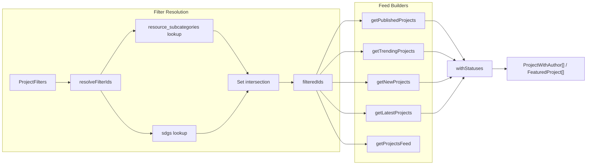
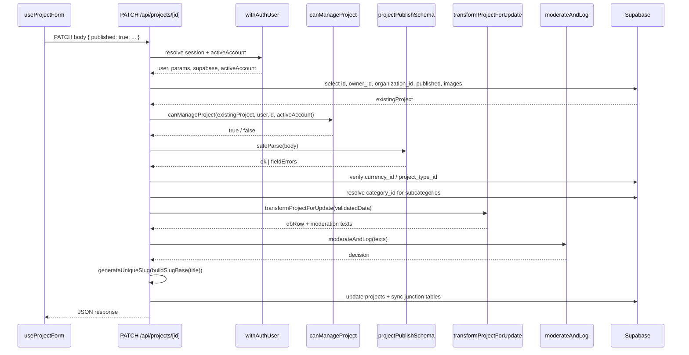
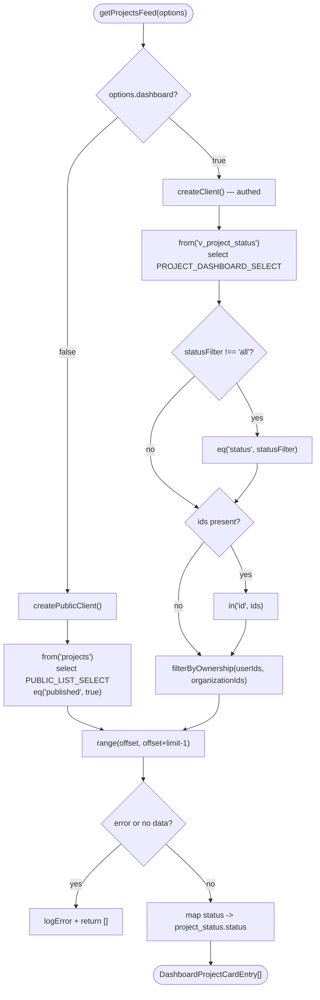
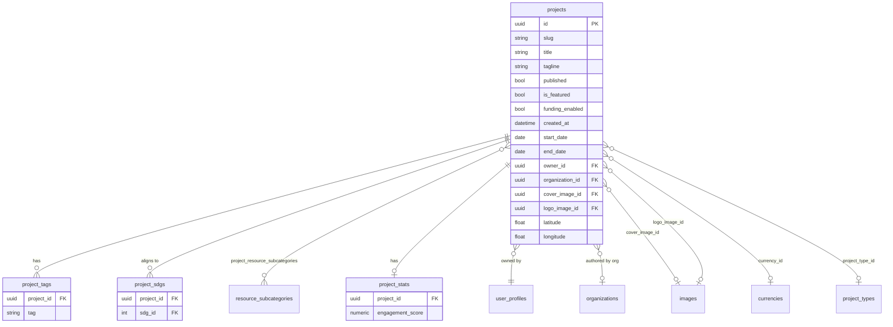

Projects are the primary long-form entity in Ozeaon. This page documents the full lifecycle — from draft creation through validation, slug generation, moderation and publication — and the discovery surfaces (for-you, latest, trending, and dashboard feeds) that decide which published projects a viewer sees.

## Purpose and Scope

This page covers the **project capability end-to-end**, as implemented across three layers:

- **Lifecycle / write path** — the REST endpoints under `/api/projects`, the dual Zod schemas (`projectDraftSchema` vs `projectPublishSchema`), ownership authorization (`canManageProject`), slug generation, junction-table synchronization, and moderation.
- **Discovery / read path** — the query helpers in `src/lib/supabase/queries/projects.ts` that back the public feed tabs (`for-you`, `latest`, `trending`) and the authenticated dashboard list.
- **Entry points** — the Next.js routes that render the editor, the feed, the profile/organization project tabs, and the reader view.

Related topics intentionally left to sibling pages:

- **Authentication and account context** (`withAuthUser`, `activeAccount`) — see the authentication/authorization pages.
- **Moderation internals** (`moderateAndLog`, the moderation queue) — see the moderation feature page; this page only documents how a project submission enters that pipeline.
- **Image upload and processing** (`deleteImageById`, the image route) — see the media/images page.
- **Global search and non-project content discovery** — see the search/feed pages.

## Overview

A *project* in Ozeaon is a structured, publishable record with rich metadata: a title and tagline, cover/logo imagery, SDG alignment, resource categories and subcategories, free-form tags, geographic coordinates, funding windows, and an owning account (either a user or an organization — never both).

The capability is deliberately split along a **draft/published** boundary:

| Concern | Draft | Published |
| --- | --- | --- |
| Schema | `projectDraftSchema` (partial, minimal validation) | `projectPublishSchema` (strict `superRefine` validations) |
| Visibility | Owner + organisation members only, via RLS | Public read path (`published = true`) |
| Discovery | Dashboard feed via `v_project_status` view | Public feed tabs (`for-you`, `latest`, `trending`) |
| Write endpoint | `PATCH /api/projects/[id]` with `published !== true` | `PATCH /api/projects/[id]` with `published === true` |

This dual-schema design is the central architectural decision of the feature: it lets the editor **autosave frequently** (small, cheap, forgiving writes) while guaranteeing that **publication is a hard gate** that cannot be satisfied by a half-filled record.

Discovery is intentionally split into two distinct query paths because the access requirements differ:

- The **public feed** uses `createPublicClient()` and filters `published = true`, so it needs no session.
- The **dashboard feed** uses the authenticated `createClient()` and queries the `v_project_status` view, which carries project columns *alongside* a server-computed status, allowing drafts to be listed and filtered with a single `.eq("status", ...)` predicate.

## Architecture

The following diagram maps the real modules involved, from the Next.js route handlers down to Supabase.

```mermaid
flowchart TD
    subgraph sg_Entry["Route Entry Points"]
        EditorNew["projects/new page"]
        EditorEdit["projects/[slug]/edit page"]
        FeedPage["projects feed tabs"]
        Dashboard["settings projects page"]
        Reader["projects/[slug] reader"]
    end

    subgraph sg_API["API Layer (src/app/api/projects)"]
        ApiId["/api/projects/[id] route.ts"]
        ApiImage["/api/projects/[id]/image"]
        ApiDocs["/api/projects/[id]/documents"]
        ApiComments["/api/projects/[id]/comments"]
    end

    subgraph sg_Logic["Domain Logic"]
        FormHook["useProjectForm hook"]
        ZodDraft["projectDraftSchema"]
        ZodPublish["projectPublishSchema"]
        Slug["buildSlugBase / generateUniqueSlug"]
        Z2D["transformProjectForUpdate"]
        Moderation["moderateAndLog"]
        Authz["canManageProject"]
    end

    subgraph sg_Data["Data Access"]
        Queries["lib/supabase/queries/projects.ts"]
        PublicClient["createPublicClient"]
        AuthClient["createClient (authed)"]
    end

    subgraph sg_DB["Supabase"]
        Projects[("projects")]
        Stats[("project_stats")]
        StatusView[("v_project_status")]
        Joins[("project_tags / project_sdgs")]
    end

    EditorNew --> FormHook
    EditorEdit --> FormHook
    FormHook --> ZodPublish
    FormHook --> ZodDraft
    FormHook --> ApiId
    ApiId --> ZodPublish
    ApiId --> ZodDraft
    ApiId --> Authz
    ApiId --> Slug
    ApiId --> Z2D
    ApiId --> Moderation
    ApiId --> Joins
    ApiId --> Projects
    FeedPage --> Queries
    Dashboard --> Queries
    Reader --> Queries
    Queries --> PublicClient
    Queries --> AuthClient
    PublicClient --> Projects
    PublicClient --> Stats
    AuthClient --> StatusView
    Queries --> Joins
```



**Why these boundaries:** the API routes own *validation and authorization*; the query module owns *shape and filtering* of read models; the `useProjectForm` hook owns *client-side form state and step gating*. Keeping slug generation and moderation in the API layer rather than the hook means a direct API caller gets the same guarantees as the UI.

## Lifecycle: From Draft to Published

### Stage 1 — Draft authoring and step gating

The editor is a multi-step form driven by `useProjectForm`, which exports from `src/hooks/use-project-form.ts`. It wires `react-hook-form` to `projectPublishSchema` as the resolver, while using the looser draft schema for saves:

```typescript
type ProjectFormValues = z.input<typeof projectPublishSchema>;
type ProjectFormOutput = z.output<typeof projectPublishSchema>;
```

> Source: [use-project-form.ts](https://github.com/ozeaon/ozeaon-v2/blob/0a4f1a95824db87782f1221a4108019d174df3d9/src/hooks/use-project-form.ts#L24-L25)

The hook imports four schemas, signalling that validation is layered by concern:

```typescript
import {
  projectDraftSchema,
  projectPublishSchema,
  projectStep1CompleteSchema,
  projectStep2CompleteSchema,
  projectStep3CompleteSchema,
} from "@/zod/projects";
```

> Source: [use-project-form.ts](https://github.com/ozeaon/ozeaon-v2/blob/0a4f1a95824db87782f1221a4108019d174df3d9/src/hooks/use-project-form.ts#L10-L16)

The `projectStepNCompleteSchema` variants are what enable incremental gating: a step can be considered "complete" before the whole record is publishable. The `Step5` module exports the `SectionItem` type used by the form:

```typescript
import type { SectionItem } from "@/zod/projects/step5";
import { updateDraftUrl } from "@/utils/project";
```

> Source: [use-project-form.ts](https://github.com/ozeaon/ozeaon-v2/blob/0a4f1a95824db87782f1221a4108019d174df3d9/src/hooks/use-project-form.ts#L17-L18)

### Stage 2 — Saving a draft

Saving a draft validates against the *draft* schema only:

```typescript
const draftResult = projectDraftSchema.safeParse(form.getValues());
```

> Source: [use-project-form.ts](https://github.com/ozeaon/ozeaon-v2/blob/0a4f1a95824db87782f1221a4108019d174df3d9/src/hooks/use-project-form.ts#L163)

Publishing, by contrast, runs the strict schema:

```typescript
const publishResult = projectPublishSchema.safeParse(form.getValues());
```

> Source: [use-project-form.ts](https://github.com/ozeaon/ozeaon-v2/blob/0a4f1a95824db87782f1221a4108019d174df3d9/src/hooks/use-project-form.ts#L217)

Design intent: `projectDraftSchema` is a *flat merged object with the same shape* as the publish schema but without the required-field refinements, so TypeScript resolves every field at both stages. The publish schema is described in its own source as:

> "Built as a flat merged object (same shape as `projectDraftSchema`) with stricter `superRefine` validations, so TypeScript resolves all fields at..."

> Source: [publish.ts](https://github.com/ozeaon/ozeaon-v2/blob/0a4f1a95824db87782f1221a4108019d174df3d9/src/zod/projects/publish.ts#L19-L20)

and is constructed by layering required-field validations over a date-normalising base:

```typescript
export const projectPublishSchema = applyRequiredValidations(
  publishSchemaWithDates,
```

> Source: [publish.ts](https://github.com/ozeaon/ozeaon-v2/blob/0a4f1a95824db87782f1221a4108019d174df3d9/src/zod/projects/publish.ts#L44-L45)

The exports are re-grouped by strictness in the barrel:

```typescript
// Draft schema (minimal validation)
export { projectDraftSchema, type ProjectDraft } from "./draft";

// Publish schema (strict validation)
export { projectPublishSchema, type ProjectPublish } from "./publish";
```

> Source: [index.ts](https://github.com/ozeaon/ozeaon-v2/blob/0a4f1a95824db87782f1221a4108019d174df3d9/src/zod/projects/index.ts#L1-L5)

### Stage 3 — Server-side update (`PATCH /api/projects/[id]`)

The PATCH handler is the single write path for both stages. It is wrapped in `withAuthUser`, so it receives an authenticated `user`, the routed `params`, a scoped `supabase` client, and the `activeAccount`.

```typescript
export const PATCH = withAuthUser<{ id: string }>(
  async (request, { user, params, supabase, activeAccount }) => {
```

> Source: [route.ts](https://github.com/ozeaon/ozeaon-v2/blob/0a4f1a95824db87782f1221a4108019d174df3d9/src/app/api/projects/[id]/route.ts#L99-L100)

The handler then performs a strict sequence of checks. **First, existence**: it selects the columns needed for authorization and image cleanup.

```typescript
const { data: existingProject, error: fetchError } = await supabase
  .from("projects")
  .select(
    "id, owner_id, organization_id, published, cover_image_id, logo_image_id",
  )
  .eq("id", id)
  .single();

if (fetchError || !existingProject) {
  return NextResponse.json(
    { error: "Project not found" },
    { status: 404 },
  );
}
```

> Source: [route.ts](https://github.com/ozeaon/ozeaon-v2/blob/0a4f1a95824db87782f1221a4108019d174df3d9/src/app/api/projects/[id]/route.ts#L104-L117)

**Second, authorization** — delegated to `canManageProject`, which takes the pre-fetched ownership columns plus the acting user and account:

```typescript
if (
  !(await canManageProject(
    supabase,
    existingProject,
    user.id,
    activeAccount,
  ))
) {
  return NextResponse.json(
    { error: "Not authorized to update this project" },
    { status: 403 },
  );
}
```

> Source: [route.ts](https://github.com/ozeaon/ozeaon-v2/blob/0a4f1a95824db87782f1221a4108019d174df3d9/src/app/api/projects/[id]/route.ts#L119-L131)

Passing the already-fetched `existingProject` into the authorization helper avoids a second round trip — the same row that proves existence proves ownership.

**Third, schema selection based on intent.** The `published === true` flag in the body is the *only* thing that promotes a request to strict validation:

```typescript
const body = (await request.json()) as Record<string, unknown>;

const isPublishing = body.published === true;
const schema = isPublishing ? projectPublishSchema : projectDraftSchema;

const result = schema.safeParse(body);

if (!result.success) {
  return NextResponse.json(
    {
      error: "Validation failed",
      errors: result.error.flatten().fieldErrors,
    },
    { status: 400 },
  );
}
```

> Source: [route.ts](https://github.com/ozeaon/ozeaon-v2/blob/0a4f1a95824db87782f1221a4108019d174df3d9/src/app/api/projects/[id]/route.ts#L133-L148)

Returning `result.error.flatten().fieldErrors` gives the client a field-keyed error map, which is exactly what `react-hook-form` can surface inline.

**Fourth, referential checks.** Currency and project type are validated against their lookup tables, because these are free-form IDs supplied by the client:

```typescript
if (validatedData.currency_id) {
  const { data: currencyRecord } = await supabase
    .from("currencies")
    .select("id")
    .eq("id", validatedData.currency_id)
    .single();

  if (!currencyRecord) {
    return NextResponse.json(
      {
        error: "Validation failed",
        errors: { currency_id: "Invalid currency ID" },
      },
      { status: 400 },
    );
  }
}
```

> Source: [route.ts](https://github.com/ozeaon/ozeaon-v2/blob/0a4f1a95824db87782f1221a4108019d174df3d9/src/app/api/projects/[id]/route.ts#L153-L169)

The identical pattern is applied to `project_type_id`:

```typescript
if (validatedData.project_type_id) {
  const { data: projectType } = await supabase
    .from("project_types")
    .select("id")
    .eq("id", validatedData.project_type_id)
    .single();

  if (!projectType) {
    return NextResponse.json(
      {
        error: "Validation failed",
        errors: { project_type_id: "Invalid project type ID" },
      },
      { status: 400 },
    );
  }
}
```

> Source: [route.ts](https://github.com/ozeaon/ozeaon-v2/blob/0a4f1a95824db87782f1221a4108019d174df3d9/src/app/api/projects/[id]/route.ts#L171-L187)

### Stage 4 — Junction-table synchronisation

Category alignment is derived, not trusted: the client sends *subcategory* IDs, and the handler resolves the parent `category_id` for each.

```typescript
const subcategoryIds: string[] = validatedData.subcategories || [];
let categoryIds: string[] = [];

if (subcategoryIds.length > 0) {
  const { data: subcategories, error: subcategoryError } = await supabase
    .from("resource_subcategories")
    .select("id, category_id")
    .in("id", subcategoryIds);
```

> Source: [route.ts](https://github.com/ozeaon/ozeaon-v2/blob/0a4f1a95824db87782f1221a4108019d174df3d9/src/app/api/projects/[id]/route.ts#L189-L196)

This is the write-side counterpart of the read-side `resolveFilterIds` intersection logic (see *Discovery* below). The handler converts the validated payload into database shape and collects moderation text via `transformProjectForUpdate` / `collectProjectModerationTexts`:

```typescript
import {
  collectProjectModerationTexts,
  transformProjectForUpdate,
} from "@/utils/zod-to-db";
import { moderateAndLog } from "@/lib/moderation";
```

> Source: [route.ts](https://github.com/ozeaon/ozeaon-v2/blob/0a4f1a95824db87782f1221a4108019d174df3d9/src/app/api/projects/[id]/route.ts#L14-L18)

Keeping the Zod→DB translation in `utils/zod-to-db` means the API handler never hand-maps fields, and moderation input is derived from the *same* transformed payload that will be persisted — so what is moderated is what is stored.

### Stage 5 — Slug generation

Slugs are generated server-side from the validated title, and uniqueness is resolved against the database:

```typescript
import { buildSlugBase } from "@/utils/generators/generate-slug";
import { generateUniqueSlug } from "@/lib/supabase/queries/generate-unique-slug";
```

> Source: [route.ts](https://github.com/ozeaon/ozeaon-v2/blob/0a4f1a95824db87782f1221a4108019d174df3d9/src/app/api/projects/[id]/route.ts#L19-L20)

**Why split into two functions:** `buildSlugBase` is a pure, synchronous transform (title → URL-safe base), while `generateUniqueSlug` must query the database for collisions and is therefore async. Separating them keeps the pure logic trivially testable and keeps database access out of the string utility.

## Discovery: Read Paths

All discovery helpers live in `src/lib/supabase/queries/projects.ts`. They share a filter model and a status-enrichment step.



### Filter resolution through intersection

When both subcategory and SDG filters are present, the helper builds a `Set` per filter and intersects them, so a project must match **all** active filters:

```typescript
if (subResult?.data)
  sets.push(new Set(subResult.data.map((r) => r.project_id)));
if (sdgResult?.data)
  sets.push(new Set(sdgResult.data.map((r) => r.project_id)));

if (!sets.length) return null;

const intersection = sets.reduce(
  (acc, set) => new Set([...acc].filter((id) => set.has(id))),
);
return [...intersection];
```

> Source: [projects.ts](https://github.com/ozeaon/ozeaon-v2/blob/0a4f1a95824db87782f1221a4108019d174df3d9/src/lib/supabase/queries/projects.ts#L520-L531)

The `null` return is semantically important: it means *"no filter applied"*, which is distinct from `[]` meaning *"filter applied, nothing matched"*. Every caller checks this distinction and short-circuits on the empty case:

```typescript
const filteredIds = await resolveFilterIds(supabase, filters);
if (filteredIds !== null && !filteredIds.length) return [];
```

> Source: [projects.ts](https://github.com/ozeaon/ozeaon-v2/blob/0a4f1a95824db87782f1221a4108019d174df3d9/src/lib/supabase/queries/projects.ts#L537-L538)

This avoids issuing a pointless `projects` query that is guaranteed to return nothing.

### `getPublishedProjects` — the default discovery feed

```typescript
export async function getPublishedProjects(
  supabase: SupabaseClient,
  filters: Partial<ProjectFilters> = {},
): Promise<ProjectWithAuthor[]> {
  const filteredIds = await resolveFilterIds(supabase, filters);
  if (filteredIds !== null && !filteredIds.length) return [];

  let query = supabase
    .from("projects")
    .select(PUBLIC_LIST_SELECT)
    .eq("published", true)
    .order("created_at", { ascending: false });

  if (filteredIds) query = query.in("id", filteredIds);
  if (filters.projectTypeIds?.length)
    query = query.in("project_type_id", filters.projectTypeIds);
  if (filters.from) query = query.gte("start_date", filters.from);
  if (filters.to) query = query.lte("end_date", `${filters.to}T23:59:59Z`);

  const { data, error } = await query;
  if (error || !data) return [];

  return (await withStatuses(supabase, data)) as unknown as ProjectWithAuthor[];
}
```

> Source: [projects.ts](https://github.com/ozeaon/ozeaon-v2/blob/0a4f1a95824db87782f1221a4108019d174df3d9/src/lib/supabase/queries/projects.ts#L533-L556)

Note the date filter asymmetry: `from` compares against `start_date` with `gte`, while `to` compares against `end_date` with `lte` **and appends `T23:59:59Z`**. Without that suffix, a project ending on the selected day would be excluded because `end_date` is a date, not a timestamp.

### `getTrendingProjects` — engagement-ranked

Trending orders by a precomputed `engagement_score` on the related `project_stats` table rather than computing a score at read time:

```typescript
let query = supabase
  .from("projects")
  .select(PUBLIC_LIST_SELECT)
  .eq("published", true)
  .order("engagement_score", {
    referencedTable: "project_stats",
    ascending: false,
  })
  .limit(20);
```

> Source: [projects.ts](https://github.com/ozeaon/ozeaon-v2/blob/0a4f1a95824db87782f1221a4108019d174df3d9/src/lib/supabase/queries/projects.ts#L565-L573)

Design intent: pushing the ranking into a materialised `engagement_score` column means trending is an index-ordered scan, not an aggregate over interactions. Trending is capped at 20 rows.

### `getNewProjects` — day-scoped freshness

"New" is defined as *created since UTC midnight today*, computed from the current date string:

```typescript
const todayStartUtc = new Date(
  new Date().toISOString().slice(0, 10) + "T00:00:00Z",
);

let query = supabase
  .from("projects")
  .select(PUBLIC_LIST_SELECT)
  .eq("published", true)
  .gte("created_at", todayStartUtc.toISOString())
  .order("created_at", { ascending: false })
  .limit(20);
```

> Source: [projects.ts](https://github.com/ozeaon/ozeaon-v2/blob/0a4f1a95824db87782f1221a4108019d174df3d9/src/lib/supabase/queries/projects.ts#L625-L635)

Truncating to `slice(0, 10)` before appending `T00:00:00Z` normalises to a UTC day boundary rather than the server's local midnight.

### `getLatestProjects` — lightweight fixed-size list

Unlike the other feeds, `getLatestProjects` uses a **dedicated, narrower select** (`LATEST_PROJECTS_SELECT`) and defaults to a small limit:

```typescript
export async function getLatestProjects(
  supabase: SupabaseClient,
  limit = 4,
): Promise<FeaturedProject[]> {
  const { data, error } = await supabase
    .from("projects")
    .select(LATEST_PROJECTS_SELECT)
    .eq("published", true)
    .order("created_at", { ascending: false })
    .limit(limit);

  if (error) {
    logError(logger, "getLatestProjects failed", error, { limit });
    return [];
  }

  return (await withStatuses(
    supabase,
    data ?? [],
  )) as unknown as FeaturedProject[];
}
```

> Source: [projects.ts](https://github.com/ozeaon/ozeaon-v2/blob/0a4f1a95824db87782f1221a4108019d174df3d9/src/lib/supabase/queries/projects.ts#L596-L616)

The dedicated select is important because it is **self-contained**: it embeds the cover image, author display name, authoring organisation (with logo), and subcategories-with-parent-category joins in a single request.

```typescript
const LATEST_PROJECTS_SELECT = `
  id, slug, title, tagline, published, is_featured, created_at,
  start_date, end_date, funding_enabled,
  cover_image:images!cover_image_id(id, path, alt),
  author:user_profiles!owner_id(display_name),
  authoring_org:organizations!projects_organization_id_fkey(id, name, slug, logo_image:images!logo_image_id(path)),
  resource_subcategories:resource_subcategories!project_resource_subcategories(id, name, category:resource_categories!inner(id, name, slug))
`;
```

> Source: [projects.ts](https://github.com/ozeaon/ozeaon-v2/blob/0a4f1a95824db87782f1221a4108019d174df3d9/src/lib/supabase/queries/projects.ts#L587-L594)

The `!project_resource_subcategories` and `!projects_organization_id_fkey` hints are explicit join-table/FK disambiguations — required because PostgREST would otherwise have to guess which relationship to traverse.

This is also the only feed that returns a distinct type (`FeaturedProject[]`) and the only one where a query error is **logged with context** before returning `[]`, because it is expected to render in a high-visibility slot.

### `getProjectsFeed` — the dual-mode feed

`getProjectsFeed` is overloaded so that TypeScript selects the return type from the `dashboard` flag:

```typescript
export async function getProjectsFeed(
  options: ProjectsFeedOptions & { dashboard: true },
): Promise<DashboardProjectCardEntry[]>;
export async function getProjectsFeed(
  options?: ProjectsFeedOptions & { dashboard?: false | undefined },
): Promise<ProjectWithAuthor[]>;
```

> Source: [projects.ts](https://github.com/ozeaon/ozeaon-v2/blob/0a4f1a95824db87782f1221a4108019d174df3d9/src/lib/supabase/queries/projects.ts#L694-L699)

The options type exposes the full discovery surface:

```typescript
type ProjectsFeedOptions = {
  limit?: number;
  offset?: number;
  ids?: string[];
  userIds?: string[];
  organizationIds?: string[];
  dashboard?: boolean;
  statusFilter?: ProjectStatusFilter;
};
```

> Source: [projects.ts](https://github.com/ozeaon/ozeaon-v2/blob/0a4f1a95824db87782f1221a4108019d174df3d9/src/lib/supabase/queries/projects.ts#L649-L657)

#### Dashboard branch

The dashboard branch reads from the `v_project_status` view with the **authenticated** client, so RLS on unpublished rows applies:

```typescript
if (dashboard) {
  // Dashboard queries include drafts; use the authed client so RLS on unpublished
  // projects applies. v_project_status carries the projects columns alongside the
  // computed status, so the card data and its status come back in one request and
  // filtering is a simple .eq() on a server-computed value.
  const supabase = await createClient();
  let query = supabase
    .from("v_project_status")
    .select(PROJECT_DASHBOARD_SELECT)
    .order("created_at", { ascending: false });

  if (statusFilter !== "all") {
    query = query.eq("status", statusFilter);
  }

  if (ids && ids.length > 0) {
    query = query.in("id", ids);
  }

  query = filterByOwnership(query, userIds, organizationIds);

  const { data, error } = await query.range(offset, offset + limit - 1);
```

> Source: [projects.ts](https://github.com/ozeaon/ozeaon-v2/blob/0a4f1a95824db87782f1221a4108019d174df3d9/src/lib/supabase/queries/projects.ts#L713-L734)

The view flattens status into a column, and the handler re-nests it into the shape the card component expects — a deliberate adaptation layer so the UI never sees the raw view shape:

```typescript
return (data as (DashboardProjectCardEntry & { status: string })[]).map(
  ({ status, ...rest }) => ({
    ...rest,
    project_status: { status: status as ProjectStatus },
  }),
) as unknown as DashboardProjectCardEntry[];
```

> Source: [projects.ts](https://github.com/ozeaon/ozeaon-v2/blob/0a4f1a95824db87782f1221a4108019d174df3d9/src/lib/supabase/queries/projects.ts#L744-L749)

#### Public branch

When `dashboard` is false, the function switches to the **public** client and hard-filters to published rows:

```typescript
// Public feed: published projects only, no auth required.
const supabase = createPublicClient();
let query = supabase
  .from("projects")
  .select(PUBLIC_LIST_SELECT)
  .eq("published", true)
  .order("created_at", { ascending: false });
```

> Source: [projects.ts](https://github.com/ozeaon/ozeaon-v2/blob/0a4f1a95824db87782f1221a4108019d174df3d9/src/lib/supabase/queries/projects.ts#L752-L758)

This is the key security property of the read path: **visibility is enforced in two independent places** — the explicit `.eq("published", true)` predicate and the anonymous client's lack of a session (so RLS can only grant public rows). The dashboard branch relies solely on RLS, which is acceptable because it always runs with a real session.

#### Ownership filtering — the OR requirement

`filterByOwnership` handles the fact that ownership is **exclusive**: a project belongs to a user *or* an organisation, never both.

```typescript
/**
 * Scope a project query to a set of owners, organisations, or both. Ownership is
 * exclusive — a project has an owner or an organisation, never both — so the two
 * filters have to be OR'd; AND-ing them matches nothing at all.
 *
 * Both id lists must already be uuids. The combined branch composes a raw
 * PostgREST `or(...)` expression, where an arbitrary string would be read as
 * filter grammar rather than a value. Request-supplied ids come through
 * `ownershipParamsSchema` in `/api/projects`; the page-level callers read theirs
 * from the database.
 */
function filterByOwnership<T extends OwnershipFilterable<T>>(
  query: T,
  userIds: string[] = [],
  organizationIds: string[] = [],
): T {
  if (userIds.length > 0 && organizationIds.length > 0) {
    return query.or(
      `owner_id.in.(${userIds.join(",")}),organization_id.in.(${organizationIds.join(",")})`,
    );
  }
  if (userIds.length > 0) return query.in("owner_id", userIds);
  if (organizationIds.length > 0)
    return query.in("organization_id", organizationIds);
  return query;
}
```

> Source: [projects.ts](https://github.com/ozeaon/ozeaon-v2/blob/0a4f1a95824db87782f1221a4108019d174df3d9/src/lib/supabase/queries/projects.ts#L667-L692)

Two design notes worth calling out:

1. **Structural typing, not the concrete builder.** The helper is constrained to `OwnershipFilterable<T>`, a structural interface with just `in` and `or`:

```typescript
// Structural rather than a PostgrestFilterBuilder: the builder's generics carry
// the row and relationship shape of whichever select it came from, and the two
// call sites below pass different ones.
type OwnershipFilterable<T> = {
  in(column: string, values: string[]): T;
  or(filters: string): T;
};
```

> Source: [projects.ts](https://github.com/ozeaon/ozeaon-v2/blob/0a4f1a95824db87782f1221a4108019d174df3d9/src/lib/supabase/queries/projects.ts#L659-L665)

This is a genuine generic-invariance workaround: `PostgrestFilterBuilder`'s type parameters encode the specific row/relationship shape, and the dashboard and public selects differ, so naming the concrete builder type would make the helper unusable at one of the two call sites.

2. **UUID precondition is a security boundary.** The combined branch interpolates IDs directly into a raw PostgREST `or(...)` expression. Because an arbitrary string there would be parsed as *filter grammar* rather than a value, the documented contract is that both lists must already be uuids — request-supplied IDs are validated by `ownershipParamsSchema` in `/api/projects` before reaching this function.

## Core Flow

### Publication flow



The ordering is not arbitrary. Authorization happens **before** parsing the body so an unauthorized caller cannot probe the validation schema for information about field constraints. Schema selection happens before referential checks so only structurally valid payloads trigger further database reads. Slug generation happens **after** validation so the slug always reflects the validated title.

### Feed retrieval flow (public vs dashboard)



## Data Model

The read model is assembled from `projects` plus several relationship tables. The joins visible in the selects and in the GET handler imply this structure:



### GET hydration of junction tables

`GET /api/projects/[id]` selects the parent row with three embedded relationships and then **flattens** them into plain arrays, because the client shape differs from the PostgREST response shape:

```typescript
const { data: rawProject, error } = await supabase
  .from("projects")
  .select(
    `
    *,
    resource_subcategories!project_resource_subcategories(id),
    sdgs!project_sdgs(id),
    project_tags(tag)
  `,
  )
  .eq("id", id)
  .single();
```

> Source: [route.ts](https://github.com/ozeaon/ozeaon-v2/blob/0a4f1a95824db87782f1221a4108019d174df3d9/src/app/api/projects/[id]/route.ts#L33-L44)

```typescript
type ProjectWithJoins = typeof rawProject & {
  resource_subcategories?: Array<{ id: string }>;
  sdgs?: Array<{ id: number }>;
  project_tags?: Array<{ tag: string }>;
};

const projectWithJoins = rawProject as ProjectWithJoins;

const subcategories =
  projectWithJoins.resource_subcategories?.map((item) => item.id) || [];
const sdgs = projectWithJoins.sdgs?.map((item) => item.id) || [];
const tags = projectWithJoins.project_tags?.map((item) => item.tag) || [];

const {
  resource_subcategories: _resource_subcategories,
  sdgs: _sdgs,
  project_tags: _project_tags,
  ...projectBase
} = projectWithJoins;

const data = {
  ...projectBase,
  subcategories,
  sdgs,
  tags,
};

return NextResponse.json({ data });
```

> Source: [route.ts](https://github.com/ozeaon/ozeaon-v2/blob/0a4f1a95824db87782f1221a4108019d174df3d9/src/app/api/projects/[id]/route.ts#L51-L78)

The destructure-and-rename pattern (`_resource_subcategories`, etc.) is how the embed objects are *removed* while the rest of the row is spread — the resulting `data` contains `subcategories`, `sdgs`, and `tags` as flat ID/string arrays, which is exactly the shape the Zod schemas consume on the way back in. **This makes GET and PATCH symmetric**: what GET returns is directly parseable by `projectDraftSchema`/`projectPublishSchema` as an edit payload.

Note also that `GET` uses `createClient()` **without** authentication wrapping — unlike `PATCH`, which is wrapped in `withAuthUser`. Public reads are permitted, and visibility is governed by RLS.

### Dashboard projection: `v_project_status`

The `v_project_status` view is where draft-vs-published *status* is computed server-side. This is a significant design choice: rather than deriving status in TypeScript from `published` plus date windows, the computation lives in the database, so:

- the dashboard can filter by status with a single indexed `.eq("status", statusFilter)`, and
- the same status value is consistent across every client.

The adaptation layer at the boundary (`{ status, ...rest } → { ...rest, project_status: { status } }`) keeps this view detail from leaking into component props.
