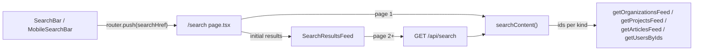

Search on Ozeaon is a keyword match by name or title over four kinds of entity: organizations, projects, articles and people. It has no search index. Each kind is matched with an `ilike` query that returns only ids and a date. The matches are merged newest-first and sliced to the requested page, and the surviving ids are then hydrated through the same feed queries that power the public feeds. Search results therefore render with the same cards as the feeds.

:::note[Roadmap status]
What has shipped is keyword search at `/search` over organization **name**, project **title**, article **title** and a profile's **display name or username**. Projects and articles also match when their owner or author matches the people query. It is not behind a feature flag. Posts, comments, body text, tags, SDGs, events and resources are not searched, and there is no relevance ranking. The roadmap's global search across every content type is still **planned**.
:::

## Overview

The feature is live in three places:

- **The results page.** [`/search`](https://github.com/ozeaon/ozeaon-v2/blob/0a4f1a95824db87782f1221a4108019d174df3d9/src/app/(main)/(feed)/(public)/search/page.tsx) reads `?q=`, server-renders the first page by calling `searchContent` directly, and is marked `noindex`.
- **Infinite scroll.** [`SearchResultsFeed`](https://github.com/ozeaon/ozeaon-v2/blob/0a4f1a95824db87782f1221a4108019d174df3d9/src/components/search/SearchResultsFeed.tsx) receives that first page as a prop. It fetches later pages from [`GET /api/search?q=&page=&limit=`](https://github.com/ozeaon/ozeaon-v2/blob/0a4f1a95824db87782f1221a4108019d174df3d9/src/app/api/search/route.ts) through `GenericInfiniteFeed`. The route caps `limit` at 50 and calls the same `searchContent`.
- **Entry points.** The desktop [`SearchBar`](https://github.com/ozeaon/ozeaon-v2/blob/0a4f1a95824db87782f1221a4108019d174df3d9/src/components/search/SearchBar.tsx) and `MobileSearchBar` sit in `TopNav`. [`MobileSearchTrigger`](https://github.com/ozeaon/ozeaon-v2/blob/0a4f1a95824db87782f1221a4108019d174df3d9/src/components/nav/components/MobileSearchTrigger.tsx) sits in `NavMobileActions`.

The per-entity endpoints `/api/articles/search`, `/api/users/search`, `/api/organizations/search`, `/api/projects/search` and `/api/locations/search` are autocomplete endpoints for form pickers, such as author, team member and related-project inputs. They are not part of this feature.

## Architecture



All of the query logic lives in [`queries/search.ts`](https://github.com/ozeaon/ozeaon-v2/blob/0a4f1a95824db87782f1221a4108019d174df3d9/src/lib/supabase/queries/search.ts). It runs against `createPublicClient()`, so it only sees what an anonymous visitor could see under RLS.

### Match

The raw term is trimmed, and `%` and `\` are stripped from it *before* the minimum-length check:

```typescript
// `%` and `\` are dropped before the length check, so a term of nothing but
// wildcards can't clear it and match every row. `_` stays: titles and display
// names contain it, and it only ever widens a match by a single character.
const trimmed = query.trim().replace(/[%\\]/g, "");
if (trimmed.length < SEARCH_MIN_QUERY_LENGTH) return [];
```

The term is then double-quoted, with any embedded `"` escaped, before it goes into a PostgREST `or()` list. Without the quoting, a term containing `,`, `(` or `)` would break the filter grammar.

People are matched first, on `display_name` or `username`, because their ids also let projects (`owner_id`) and articles (`author_id`) match by author. This people query is limited to `SEARCH_AUTHOR_MATCH_CAP` rather than to the current page, so the author set is the same on every page. Organizations, projects and articles are then matched in parallel. Each query selects only `id` and its own date aliased to `sorted_at`: `created_at` for organizations and people, and `published_at` for projects and articles. Projects and articles must also have `published = true`.

### Merge and Slice

Each kind is asked for `take = offset + limit` rows, not just one page's worth. The global newest-first window `[offset, offset + limit)` can only contain rows that fall within each kind's own top `take`, so this keeps paging exact. That only holds while every match predicate is page-independent, which is why the author set comes from a fixed cap.

The four match lists are concatenated and sorted by `byRecency`: newest first, missing dates last (matching the database's `nullsFirst: false`), with an id tiebreak so the ordering is total and pages never overlap or leave gaps. There is no relevance scoring.

### Hydrate

The page's ids are grouped by kind and passed to the normal feed queries. A kind with no ids on the page is skipped, because an empty `ids` filter on a feed query means *no filter* and would return the whole feed. The output is rebuilt by `flatMap` over the page slice, not over the hydration results, so the merged order is kept, and any id that hydration did not return is dropped.

The result type in [`types/search.ts`](https://github.com/ozeaon/ozeaon-v2/blob/0a4f1a95824db87782f1221a4108019d174df3d9/src/types/search.ts) is a union on `kind` that reuses each feed card's row type. `SearchResultsFeed` switches on `kind` and renders the same `OrganizationCard`, `ProjectCard`, `ArticleCard` or `UserCard` that the feeds use.

### URL Contract

The query lives in `?q=`, so results can be shared and bookmarked and work with back and forward. [`searchHref`](https://github.com/ozeaon/ozeaon-v2/blob/0a4f1a95824db87782f1221a4108019d174df3d9/src/utils/url/search.ts) trims and encodes the term and collapses an empty one to a bare `/search`. `SearchBar` seeds its value from `initialQuery`, then `?q=`, then the empty string. It only navigates; the results page runs the query. `SEARCH_PATHNAME` is also where the mobile nav docks its search field.

## Failure Modes & Edge Cases

- **Wildcard-only terms.** A query such as `%%%` collapses to an empty string and is rejected by the length check, rather than matching every row. As a side effect, nobody can search for a literal `%` or `\`.
- **People results stop at the cap.** People results are paged out of the same capped author set, so they run out at `SEARCH_AUTHOR_MATCH_CAP` however deep the user scrolls. Author-based matches on projects and articles are bounded by the same cap.
- **Partial failure.** Every match query goes through `toMatches`, which logs the error and returns `[]`. One failing kind just disappears from the results; nothing is thrown or shown to the user.
- **Empty `ids` hazard.** Hydration is skipped for kinds absent from the page (`getUsersByIds` returns early on an empty list), and an empty page returns before any hydration runs.
- **Id collisions.** The hydration map is keyed by bare id, not by `kind + id`, so it relies on UUIDs being unique across tables.
- **Concurrent writes.** This is offset pagination, so a row inserted between page requests can shift the ranking. A static dataset pages exactly.

## Operational Notes

- Each request makes two rounds. The first is the people query followed by the three parallel match queries. The second is up to four parallel hydrations.
- `%term%` patterns cannot use a btree index, so `ilike` cost grows with table size. The design relies on bounded `limit`s and id-only projections instead of indexing. There is no cache.
- `SEARCH_PAGE_LIMIT`, `SEARCH_MIN_QUERY_LENGTH` and `SEARCH_AUTHOR_MATCH_CAP` live in [`config/constants/feeds.ts`](https://github.com/ozeaon/ozeaon-v2/blob/0a4f1a95824db87782f1221a4108019d174df3d9/src/config/constants/feeds.ts). Raising the author cap widens both author matching and reachable people results, but it lengthens the `in.(...)` list on every search.

## Extension Points

To add a new kind of result:

1. Add a variant to `SearchResultItem` that wraps the entity's existing feed row type.
2. Add a match query to the parallel block, selecting `id, sorted_at:<date>` and using the shared `or()` helper. Add `byAuthor(...)` if the entity has an owner.
3. Add a hydration branch guarded by `ids.length > 0`, and a `renderResult` case in `SearchResultsFeed`.

`byRecency` and the final `flatMap` don't depend on kind, so the ordering logic needs no changes. Searchable columns are declared per query, so no central list needs updating.

## Related Links

- [Search components](../../components/search/)
- [Articles reader](../articles-reader/), [Projects](../projects/) and [Organizations](../organizations/) for the feed queries reused during hydration
- [API routes](../../api-layer/api-routes/)
- [`queries/search.ts`](https://github.com/ozeaon/ozeaon-v2/blob/0a4f1a95824db87782f1221a4108019d174df3d9/src/lib/supabase/queries/search.ts), [`app/api/search/route.ts`](https://github.com/ozeaon/ozeaon-v2/blob/0a4f1a95824db87782f1221a4108019d174df3d9/src/app/api/search/route.ts), [`components/search/`](https://github.com/ozeaon/ozeaon-v2/tree/0a4f1a95824db87782f1221a4108019d174df3d9/src/components/search)
