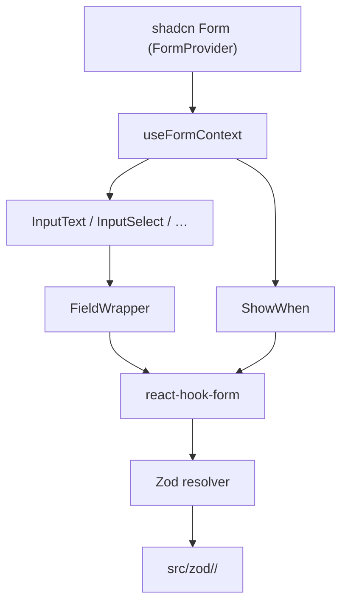

Ozeaon's form layer combines React Hook Form, Zod, and shadcn primitives into a family of context-consuming field wrappers. The core contract is simple: every wrapper calls `useFormContext` internally, so a developer renders `<InputText name="title" label="Title" />` anywhere under a `<Form>` (which wraps `FormProvider`) and gets labelling, error styling, and cross-field hooks for free — without threading a `control` prop through intermediate components.

## Overview

Three layers cooperate. The state engine is React Hook Form: it holds values, dirty/touched state, and validation triggering. The schema layer is Zod with `@hookform/resolvers`: each domain form supplies a resolver. The presentation layer is `src/components/ui/forms/hook-form/` — thin wrappers that read the nearest `FormProvider` context and delegate layout, description, and error treatment to `FieldWrapper`.

The wrappers are re-exported from the [barrel](https://github.com/ozeaon/ozeaon-v2/blob/0a4f1a95824db87782f1221a4108019d174df3d9/src/components/ui/forms/hook-form/index.ts). The barrel also exports `RequiredFieldsProvider`/`useRequiredFields` from [`RequiredFieldsContext.tsx`](https://github.com/ozeaon/ozeaon-v2/blob/0a4f1a95824db87782f1221a4108019d174df3d9/src/components/ui/forms/hook-form/RequiredFieldsContext.tsx), which lets a form surface a set of required field names to a label renderer without prop drilling.

For per-component props see the [Forms components catalogue](../../components/ui/forms/). For how the wrappers fit into the big editor forms, see [Form Architecture](../form-architecture/).

## Architecture

Each wrapper's only job is to translate a `name` path into the RHF context, render the appropriate Radix/shadcn primitive, and let `FieldWrapper` apply the uniform label/description/error treatment. `ShowWhen` is the one member that renders nothing — it gates its children on form state.



The domain form passes a resolver; the wrappers stay schema-agnostic.

## FormProvider Contract

Every wrapper:

- Consumes the nearest `FormProvider` context (`useFormContext`).
- Never accepts a `control` prop.
- Must be rendered inside a shadcn `<Form>`, which wraps `FormProvider`.

All three editor forms set `shouldUnregister: false` in `useForm`. This is required. `ShowWhen` mounts and unmounts fields, and without it a hidden field's value would be discarded, defeating the point of keeping a joined object in sync with its FK. It also lets `useWatch` read fields that have no mounted input, such as the article `slug`.

## Field Wrappers

The wrappers live in [`src/components/ui/forms/hook-form/`](https://github.com/ozeaon/ozeaon-v2/tree/0a4f1a95824db87782f1221a4108019d174df3d9/src/components/ui/forms/hook-form). Entries:

- **`InputText`** — single-line. For `type="number"`, normalises empty to `undefined` rather than `NaN`.
- **`InputTextarea`** — multi-line with a progressive character counter (appears at ≤ 50 remaining or at limit, unless `showRemaining` is set; default `maxLength` 3000).
- **`InputSelect`** — single-select on Radix `Select`. When the selected option has a `description` field, it replaces the static `description` prop below the input.
- **`InputMultiSelect`** — multi-select with Command-palette search and grouped options via `group` on each option object.
- **`InputGridSelect`** — card-grid single or multi select; renders every option as a tappable card with an optional per-option description.
- **`InputInlineSelect`** — compact inline variant.
- **`InputBoolean`** — toggle switch.
- **`InputCheckbox`** / **`InputCheckboxGroup`** / **`InputRadioGroup`** / **`InputRadioTiles`** — boolean and choice families.
- **`InputDate`** — date picker.
- **`InputTags`** — free-form tag entry.
- **`InputPassword`** — password with show/hide toggle.
- **`InputSearchSelect`** / **`InputSearchSelectWithChip`** / **`InputSearchLocation`** — async-search variants.
- **`OtpInput`** — OTP input; exported from the barrel but not RHF-bound. It lives in `hook-form/` for co-location but uses imperative controlled state for focus advancement across digits.
- **`InputContent`** — Tiptap rich text editor, imported by path (`@/components/ui/forms/hook-form/InputContent`). The barrel exports only its handle type, not the component itself, because it is a heavy async import.
- **`ShowWhen`** — conditional wrapper, not a field (see below).
- **`FieldWrapper`** — the shared layout/state primitive that every other wrapper renders through.
- **`CharacterCount`** — the remaining-character indicator used by `InputTextarea`.

## Cross-Field Derivation with `updates`

Available on `InputText`, `InputTextarea`, `InputSelect`, and `InputBoolean`. When the field value changes, each entry in `updates` fires its `map` function and writes the result into the named target field.

```tsx
<InputSelect
  label="Article Type"
  name="article_type_id"
  options={articleTypeOptions}
  updates={[{
    name: "article_type",
    map: (id) => articleTypes.find((t) => t.id === id),
  }]}
/>
```

The target `name` is typed as `string`, not as a keyof the form type. Typing it generically would force TypeScript to infer the form type from two positions on the same JSX element simultaneously, causing inference to collapse. The intentional trade-off is losing dot-notation type-checking on the target path in exchange for ergonomic wrappers.

The FK-plus-joined-object pattern (`article_type_id` + `article_type`) is why the `updates` mechanism exists: `ShowWhen` can then read `article_type.code` to gate downstream fields without the form having to re-derive the object from the option list at render time.

## Cross-Field Re-Validation with `validates`

Available on `InputText` and `InputBoolean`. Lists sibling field names to re-trigger via `control.trigger(name)` on blur or change — useful when one field's validity depends on another and RHF would not re-validate the sibling on its own.

## Conditional Fields with `ShowWhen`

`ShowWhen` reads a field value with `useWatch` and mounts or unmounts its children based on a `check` predicate. Without `check` it shows when `!!value`, or when `!value` with `invert`. Because the forms use `shouldUnregister: false`, a hidden field **keeps its value** and is still submitted and validated. Conditional required-ness belongs in the schema (for example a `superRefine` keyed on `article_type.code`), not in whether the input is mounted.

```tsx
<ShowWhen
  field="article_type.code"
  check={(value) => value === ArticleTypeCode.project_log}
  unregisterFields={["linked_project_id"]}
>
  <InputSearchSelectWithChip name="linked_project_id" label="Linked Project" … />
</ShowWhen>
```

The `unregisterFields` prop sets the listed fields to `null` (marking them dirty) and then calls `unregister` when the predicate goes false. Use it when a hidden value must not be saved, such as a linked project left over after the article type changes. It only fires on the visible → hidden transition, and it doesn't restore anything when the field reappears.\n\n`ShowWhen` is used throughout the article sections (type-specific fields, embargo dates, attachments) and in the project Configuration section.

## Error State & Description Styling

`FieldWrapper` applies `border-destructive bg-error-surface` when `fieldState.invalid` is true. The `description` text is suppressed while an error is active — `FormMessage` takes its place — so the field shows exactly one message and its vertical height stays stable.

## Required Field Markers

A field's label shows a required marker when its `name` is in the nearest [`RequiredFieldsProvider`](https://github.com/ozeaon/ozeaon-v2/blob/0a4f1a95824db87782f1221a4108019d174df3d9/src/components/ui/forms/hook-form/RequiredFieldsContext.tsx)'s `fields` list. `FieldWrapper`'s label checks both the exact name and a version with inner array indexes removed (`.0.` → `.`). Listing `faqs.question` therefore marks every `faqs.<n>.question`. A trailing index, as in `tags.0`, is not removed.

The list is maintained by hand, separately from the Zod schema:

- projects: `Object.keys(REQUIRED_FIELD_MESSAGES)` from `config/constants/projects.ts`
- organisations: `ORG_REQUIRED_FIELDS` from `config/constants/organizations.ts`
- articles and profile settings: their own lists

Providers nest. The project `ContentSectionCard` wraps a required content block in its own provider listing `sections.<index>.intro` and `sections.<index>.body`. The inner provider **replaces** the outer set rather than adding to it, which is fine there because the block contains no other fields.

## Failure Modes & Edge Cases

A wrapper rendered outside a `<Form>` will throw at `useFormContext` — every wrapper must be inside a shadcn `<Form>`. An empty numeric `InputText` passes `undefined`, not `NaN`, so Zod `.optional()` behaves correctly. Two fields deriving from each other via `updates` would race; designs should give each derived path exactly one writer.

## Extension Points

- New field wrapper: create a component in `src/components/ui/forms/hook-form/`, call `useFormContext`, render through `FieldWrapper`, and re-export from `index.ts`. Error/description styling is automatic.
- New cross-field rule: prefer `updates` (derivation) or `validates` (re-validation) at the call site; reach for `useEffect` only when neither suffices.
- New validation rule: add it to the Zod schema in `src/zod/`, not to a component.
- New domain form: see [Form Architecture](../form-architecture/#extension-points).
- shadcn primitives: always add via `pnpm dlx shadcn@latest add <component-name>`; never install `@radix-ui/react-*` directly.

## Related Links

- [hook-form barrel](https://github.com/ozeaon/ozeaon-v2/blob/0a4f1a95824db87782f1221a4108019d174df3d9/src/components/ui/forms/hook-form/index.ts)
- [ShowWhen](https://github.com/ozeaon/ozeaon-v2/blob/0a4f1a95824db87782f1221a4108019d174df3d9/src/components/ui/forms/hook-form/ShowWhen.tsx)
- [FieldWrapper](https://github.com/ozeaon/ozeaon-v2/blob/0a4f1a95824db87782f1221a4108019d174df3d9/src/components/ui/forms/hook-form/FieldWrapper.tsx)
- [RequiredFieldsContext](https://github.com/ozeaon/ozeaon-v2/blob/0a4f1a95824db87782f1221a4108019d174df3d9/src/components/ui/forms/hook-form/RequiredFieldsContext.tsx)
- [Zod Schemas](../zod-schemas/): schema conventions
- [Forms components catalogue](../../components/ui/forms/): per-component props
- [UI Primitives](../../design-system/ui-primitives/)
