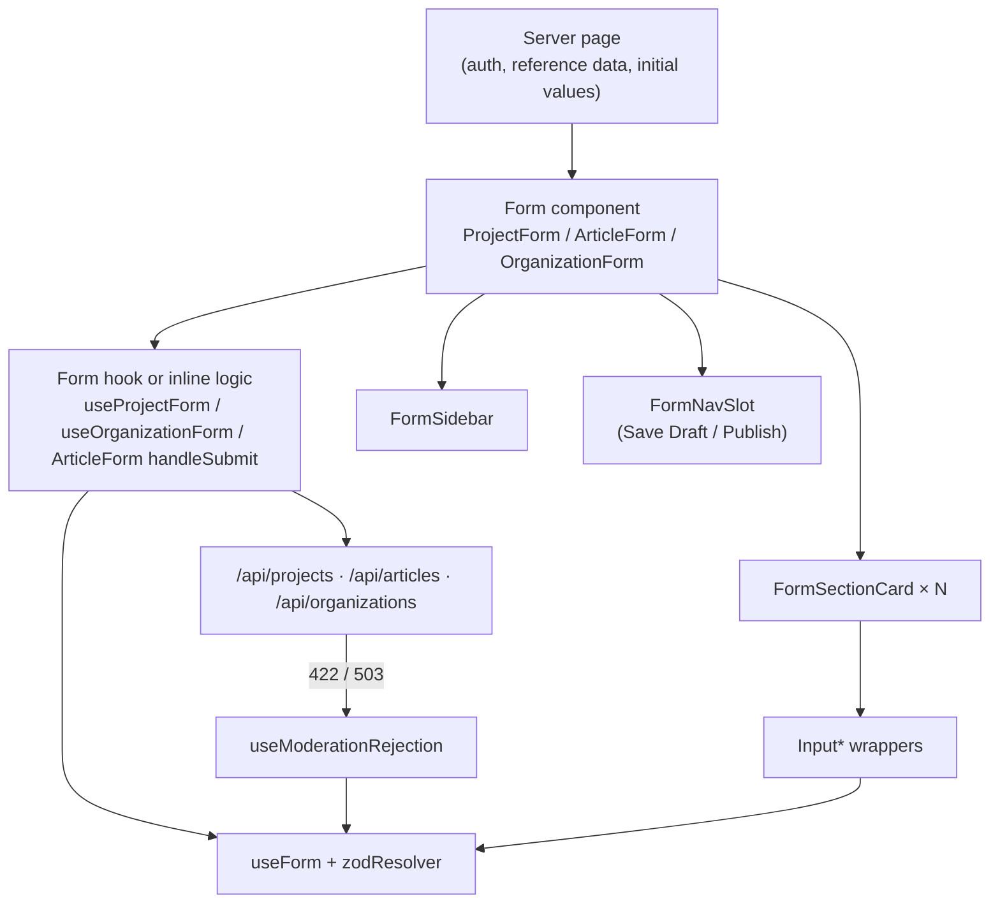

Three forms do most of the heavy lifting: the project editor, the article editor and the organisation creator. Each is a **long single-page form split into numbered sections**, with a sticky progress sidebar on the left and Save Draft / Publish buttons in the top nav bar. They aren't wizards. Every section is mounted at once, and the "steps" you'll see in file names (`step1.ts`, `projectStep3CompleteSchema`) are Zod fragments that line up with sections, not pages.

All three are built from the same parts, but each wires them together by hand. There is no shared `useEditorForm` abstraction, so a fix in one form usually needs repeating in the others. The pages in this section document each layer:

- [Field Wrappers & Conditional Fields](../field-wrappers/): the `Input*` components, `ShowWhen`, required markers
- [Zod Schemas](../zod-schemas/): how schemas are split into step fragments and recombined into draft and publish schemas
- [Sections, Progress & Completion](../sections-and-progress/): the sidebar, section cards, completion ticks and active-section tracking
- [Drafts, Saving & Publishing](../saving-and-publishing/): the save pipeline, implicit drafts for uploads, URL rewriting and leave guards
- [Server Errors & Moderation](../server-errors-and-moderation/): mapping API and moderation failures back onto fields

## The Layers

- **The server page** resolves auth, loads option lists (types, categories, SDGs, licences) and, when editing, the existing row mapped to form values with `mapApiDataToFormData`. Everything arrives as props.
- **The form component** owns layout: the sidebar, the section cards, the nav slot, dialogs and the `beforeunload` guard.
- **The form hook** owns state and saving: `useForm`, completion tracking, the save and publish handlers, and error mapping. Projects and organisations have a dedicated hook. Articles keep all of it inline in `ArticleForm.tsx`, which is why that file is over 1,000 lines.
- **The API route** re-validates the body with the same Zod schema, checks permissions, runs moderation and writes the rows. Client validation is a convenience; the route is the authority.

## The Three Forms

| | Projects | Articles | Organisations (create) |
| --- | --- | --- | --- |
| Route | `/projects/new`, `/projects/new?draft=<id>`, `/projects/[slug]/edit` | `/articles/new`, `/articles/new?articleId=<id>` | `/organizations/new` |
| Component | [`ProjectForm`](https://github.com/ozeaon/ozeaon-v2/blob/0a4f1a95824db87782f1221a4108019d174df3d9/src/components/projects/form/ProjectForm.tsx) | [`ArticleForm`](https://github.com/ozeaon/ozeaon-v2/blob/0a4f1a95824db87782f1221a4108019d174df3d9/src/components/articles/form/ArticleForm.tsx) | [`OrganizationForm`](https://github.com/ozeaon/ozeaon-v2/blob/0a4f1a95824db87782f1221a4108019d174df3d9/src/components/organizations/form/OrganizationForm.tsx) |
| State hook | [`useProjectForm`](https://github.com/ozeaon/ozeaon-v2/blob/0a4f1a95824db87782f1221a4108019d174df3d9/src/hooks/use-project-form.ts) | inline in `ArticleForm` | [`useOrganizationForm`](https://github.com/ozeaon/ozeaon-v2/blob/0a4f1a95824db87782f1221a4108019d174df3d9/src/hooks/use-organization-form.ts) |
| Sections | 11 (project type → comments) | 7, plus Deletion once saved | 3 (identity, media, links) |
| Resolver | `projectPublishSchema` | `articleDraftSchema` | `organizationSchema` |
| Validation mode | `onBlur` | `onBlur` when editing, `onSubmit` when new | `onBlur` |
| Drafts | Yes | Yes | No, create only |
| Completion ticks | Step `Complete` schemas plus ad-hoc checks | `useArticleValidation` (hand-written rules) | `organizationStep1CompleteSchema` plus ad-hoc checks |

The resolver differs per form and matters. Projects resolve against the strict publish schema, so blur errors show publish requirements even while drafting. Articles resolve against the lenient draft schema and only check the publish schema inside the submit handler. See [Drafts, Saving & Publishing](../saving-and-publishing/).

Settings-style forms ([`OrganizationSettingsForm`](https://github.com/ozeaon/ozeaon-v2/blob/0a4f1a95824db87782f1221a4108019d174df3d9/src/components/organizations/form/OrganizationSettingsForm.tsx) and [`ProfileSettings`](https://github.com/ozeaon/ozeaon-v2/blob/0a4f1a95824db87782f1221a4108019d174df3d9/src/components/account/ProfileSettings.tsx)) are simpler: one schema, `onBlur`, a single Save button and `form.reset` to the saved values. `OrganizationSettingsForm` is the only form using [`useUnsavedChangesGuard`](../saving-and-publishing/#leaving-with-unsaved-changes).

## Shared Building Blocks

| Piece | What it does | Used by |
| --- | --- | --- |
| [`FormSectionCard`](https://github.com/ozeaon/ozeaon-v2/blob/0a4f1a95824db87782f1221a4108019d174df3d9/src/components/ui/forms/FormSectionCard.tsx) | Collapsible numbered `<fieldset>`; its `id` is the sidebar's scroll target, and it disables itself when the form is disabled | all three |
| [`FormSidebar`](https://github.com/ozeaon/ozeaon-v2/blob/0a4f1a95824db87782f1221a4108019d174df3d9/src/components/ui/forms/FormSidebar.tsx) | Presentational list of sections with completion colour and "Last Saved"; desktop only (`lg:`) | all three |
| [`FormNavSlot`](https://github.com/ozeaon/ozeaon-v2/blob/0a4f1a95824db87782f1221a4108019d174df3d9/src/components/nav/slots/FormNavSlot.tsx) | Puts the back button, title, saving state and action buttons into the top nav bar | all three (articles via `ArticleFormNav`) |
| [`RequiredFieldsProvider`](https://github.com/ozeaon/ozeaon-v2/blob/0a4f1a95824db87782f1221a4108019d174df3d9/src/components/ui/forms/hook-form/RequiredFieldsContext.tsx) | Tells field labels which names to mark as required | all forms, including settings |
| [`useModerationRejection`](https://github.com/ozeaon/ozeaon-v2/blob/0a4f1a95824db87782f1221a4108019d174df3d9/src/hooks/use-moderation-rejection.ts) | Maps 422/503 moderation responses onto fields and a page banner | all three |
| [`ApiError`](https://github.com/ozeaon/ozeaon-v2/blob/0a4f1a95824db87782f1221a4108019d174df3d9/src/utils/api-error.ts) | Typed error thrown from `fetch` responses | all three |

`FormStepAccordion`, `StepIndicator` and `TabMenu` are exported from `@/components/ui/forms` but no form uses them. They are leftovers from a true multi-step design. Don't assume they reflect how the forms work.

## Why the Buttons Live Outside the Form

Save Draft and Publish render in the top nav bar through `FormNavSlot`, which is outside the `<form>` element. So:

- they are `type="button"` and call the handlers directly rather than submitting the form
- projects and organisations run `form.trigger(undefined, { shouldFocus: true })` when publish validation fails, because there is no native submit to focus the first error. Articles wrap their handlers in `form.handleSubmit(...)` instead, which focuses errors itself but only knows about the draft resolver.
- the handlers are kept in refs updated in `useLayoutEffect`, so the memoised slot content always calls the latest closure without re-rendering the nav on every keystroke

If you add a button to the nav slot, follow the same ref pattern ([`ArticleFormNav`](https://github.com/ozeaon/ozeaon-v2/blob/0a4f1a95824db87782f1221a4108019d174df3d9/src/components/articles/form/ArticleFormNav.tsx) is the clearest example).

## Failure Modes & Edge Cases

- **Three copies of the same logic.** Active-section tracking, `beforeunload` guards and error mapping are written separately in each form and have drifted (see [Sections, Progress & Completion](../sections-and-progress/)). Check all three when fixing a bug in one.
- **`FormSidebar` is hidden below `lg`.** On mobile there is no progress indicator and no section navigation.
- **The form can be disabled wholesale.** An article published more than `EDIT_GRACE_DAYS` (7) ago is passed `disabled` to `useForm`, and every `FormSectionCard` fieldset follows. See [Drafts, Saving & Publishing](../saving-and-publishing/#the-edit-grace-period).

## Extension Points

**Adding a new editor form:**

1. Write the schema as step fragments plus draft and publish schemas ([Zod Schemas](../zod-schemas/#step-files)).
2. Create a `use<Thing>Form` hook modelled on `useProjectForm`: `useForm`, `completedSections`, `handleSaveDraft`, `handlePublish`, `saveDraftSilent` if the form has uploads, and `useModerationRejection`.
3. Build the shell from `FormSidebar`, `FormSectionCard` and `FormNavSlot`, wrapped in `RequiredFieldsProvider`.
4. Make the API route `safeParse` with the same draft/publish schemas, and return errors in the [`ApiErrorBody`](../server-errors-and-moderation/#the-error-contract) shape.
5. Add a leave guard. Prefer `useUnsavedChangesGuard` over a bare `beforeunload` listener, because it also catches in-app links and Back.

**Adding a section to an existing form:** add a `FormSectionCard` with a stable `id`, add the same `id` to the form's `SIDEBAR_SECTIONS` (or `ALL_SECTIONS` for articles), and add a `completedSections` entry. A section without one never shows as complete.

## Related Links

- [Forms components catalogue](../../components/ui/forms/): per-component props for layout, upload and field components
- [Projects](../../projects/projects/), [Article Authoring](../../articles/articles-authoring/), [Organisations](../../organisations/organisations/): the domain side of each form
- [Moderation](../../moderation/moderation/): what the server checks before a publish succeeds
