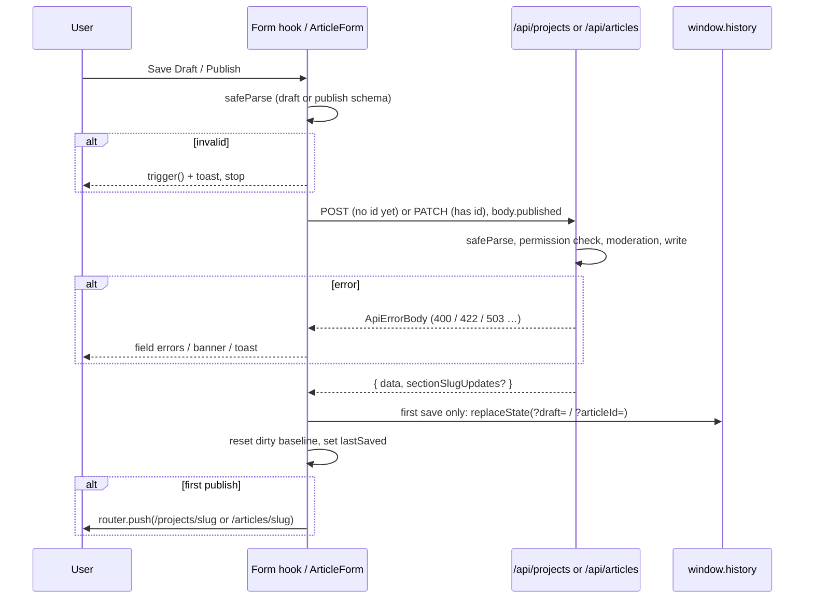

Projects and articles can be saved as a draft many times, then published. Organisations are created in one go and have no draft state. This page covers the two draft-capable forms. The code lives in [`useProjectForm`](https://github.com/ozeaon/ozeaon-v2/blob/0a4f1a95824db87782f1221a4108019d174df3d9/src/hooks/use-project-form.ts) (`performSave`, `handleSaveDraft`, `handlePublish`, `saveDraftSilent`) and inline in [`ArticleForm`](https://github.com/ozeaon/ozeaon-v2/blob/0a4f1a95824db87782f1221a4108019d174df3d9/src/components/articles/form/ArticleForm.tsx) (`handleSubmit(publish, silent)`, `saveDraftSilent`).

## Draft vs Publish Validation

Every save is validated twice, once in the browser and once in the API route, and both pick a schema the same way:

| Action | Client check | Server check |
| --- | --- | --- |
| Save Draft | `…DraftSchema.safeParse(values)`: title (and tagline for projects, type for articles) required, everything else optional | `body.published !== true` → draft schema |
| Publish / Update | `…PublishSchema.safeParse(values)`: all publish requirements | `body.published === true` → publish schema |

In projects, a failed draft parse triggers only the failing paths (`form.trigger(failedPaths)`) and shows a toast. A failed publish parse triggers the whole form with `shouldFocus: true`. Articles turn a failed parse into an `ApiError(400)` inside the handler and map its issues onto fields, the same way as a server 400. Either way, the request is never sent.

The two forms differ in what the resolver does between saves:

- **Projects** resolve against `projectPublishSchema`. Blurring an empty required field shows its publish error even if the author only intends to save a draft. Drafts save regardless, because Save Draft calls `projectDraftSchema` directly rather than `handleSubmit`.
- **Articles** resolve against `articleDraftSchema`. Both buttons go through `form.handleSubmit`, so the draft rules gate every submit. Publish rules are checked inside the handler with `articlePublishSchema.transform(coerceEmptySchemaObject).safeParse(data)`. That transform strips `undefined` keys before parsing. Despite its doc comment, it keeps `null`s. Articles also run a separate `articleTextFieldsSchema` check (`validateTextFields`) that maps `content_text` errors onto the `content` field.

Once something is published, Save Draft disappears (`isEditingPublished` for projects, `published` for articles). There is no way back to draft from the form.

## The Save Pipeline

### First Save Creates the Row

Until the first successful save there is no database row, and the form state holds no id. The first save POSTs, and the response id is stored (`setProjectId`, or `meta.articleId` plus `createdArticleIdRef`). Then the URL is rewritten in place with `history.replaceState`:

- projects: `/projects/new?draft=<id>` ([`updateDraftUrl`](https://github.com/ozeaon/ozeaon-v2/blob/0a4f1a95824db87782f1221a4108019d174df3d9/src/utils/project.ts))
- articles: `/articles/new?articleId=<id>` (a local `updateDraftUrl` in `ArticleForm`)

The page doesn't reload, so a refresh lands back on the same draft. Every later save PATCHes that id.

### Resetting the Dirty Baseline

After a successful save the form's dirty state must be cleared, or the leave guard keeps firing:

- **Projects:** `form.reset(form.getValues())`. The current values become the new defaults.
- **Articles:** `form.resetDefaultValues(...)` from the **server response**, so server-generated fields (slug, `published_at`, `attribution_text`) become the baseline. `content` and `content_text` are kept from the form, because the editor owns them.

### Server-Assigned Section Slugs

Project content blocks the author adds themselves get a temporary client slug. On save, the project PATCH route creates a `project_section_types` row for each new custom block and returns `sectionSlugUpdates: { [clientSlug]: serverSlug }`. `performSave` writes each server slug back into `sections[i].slug` with `shouldDirty: false`. Without this, the next save would try to create the custom section type again.

### Article Bodies and the Two-Step Publish

The article body is a Tiptap document stored in R2, keyed by article id, not in the form payload (see [Tiptap Core](../../editor/tiptap-core/)). While drafting, the editor autosaves the body on a 5-second debounce once the article has an id. Published articles don't autosave (`debounceMs={0}`), so the submit handler's flush is their only save path. That creates some ordering rules in `handleSubmit`:

1. Validate first. The body is only flushed to R2 (`richTextRef.current.save(articleId)`) **after** validation passes, so a rejected publish can't persist under-length content to a live article.
2. A brand-new article can't store its body until the row exists. So "publish" on a never-saved article with body content is a **deferred publish**: POST as a draft, save the body against the new id, then PATCH `published: true`. A live article never exists without its body.
3. If the body write fails after the POST, the URL is still rewritten (in a `finally`), so the author keeps a reachable draft rather than an orphan row. `createdArticleIdRef` makes the retry PATCH that row instead of creating a second article.

### After Publishing

- **First publish** redirects to the public page. Articles set `isRedirecting` first, which disarms the `beforeunload` guard and keeps the buttons busy until navigation completes.
- **Updating a published article** keeps the author on the form, for the rest of the edit grace period.
- **Updating a published project** redirects every time.

## Implicit Drafts for Uploads

Images, attachments and documents upload to storage under the row's id, so they need a row first. Upload components receive a `saveDraftSilent()` callback that returns the existing id, or creates a draft and returns the new one.

| | Projects | Articles |
| --- | --- | --- |
| Precondition | title **and** tagline, else `trigger` them and toast | title, else `trigger` it and toast |
| Validation | none beyond the precondition (calls `performSave(false)` directly) | goes through `handleSubmit(false, true)`, the full draft path |
| Toast | none on success | `silent` suppresses "Draft saved", because the upload reports itself |
| Concurrent uploads | **not de-duplicated** | shared via `createdDraftRef ??= …` |

Projects pass `saveDraftSilent` to the identity images, content block images and documents. Articles pass it to the attachments section.

:::caution[Parallel uploads on a new project]
Article uploads started before the first save share one in-flight create through `createdDraftRef`. Projects have no equivalent. Two uploads started at the same moment on a never-saved project can each POST and create two draft projects. If you touch `useProjectForm.saveDraftSilent`, port the article pattern.
:::

## The Edit Grace Period

A published article can be edited for `EDIT_GRACE_DAYS` (7, in [`config/constants/attachments.ts`](https://github.com/ozeaon/ozeaon-v2/blob/0a4f1a95824db87782f1221a4108019d174df3d9/src/config/constants/attachments.ts)) after `published_at`. After that:

- `useForm` is created with `disabled: true`, which every `FormSectionCard` fieldset follows
- `meta.editGracePeriodEnded` disables the Publish/Update button in `ArticleFormNav`

The slug field also locks as soon as an article is published, showing the full public URL instead of a preview ("Url is locked after publishing to maintain URL stability"). Projects have no grace period.

## Leaving With Unsaved Changes

There are two mechanisms, and the editor forms use the weaker one:

- **Bare `beforeunload` listeners** in `ProjectForm` (on `hasUnsavedChanges`) and `ArticleForm` (on `isDirty` with a non-empty `dirtyFields`, disarmed while redirecting). These only catch tab close and refresh. Clicking an in-app link or pressing Back leaves without warning. The Cancel button opens a confirm dialog instead.
- **[`useUnsavedChangesGuard(isDirty, onDiscard)`](https://github.com/ozeaon/ozeaon-v2/blob/0a4f1a95824db87782f1221a4108019d174df3d9/src/hooks/use-unsaved-changes-guard.ts)**, used only by `OrganizationSettingsForm`. It covers tab close, intercepts same-origin `<a>` clicks in the capture phase, and absorbs Back with a sentinel history entry. It returns `{ isPrompting, cancel, confirm }` to drive a `ConfirmDialog`. On confirm it calls `onDiscard` (typically `form.reset(savedValues)`), then `router.replace`s to the target or goes back two entries.

New forms should use `useUnsavedChangesGuard`. Its sentinel bookkeeping is subtle; read the comments in the hook before changing it.

## Failure Modes & Edge Cases

- **Projects send raw form values.** `performSave` posts `form.getValues()`, including UI-only fields such as `organizationConnectMode`, not the parsed output. The server schema strips them.
- **Validation errors on a project draft save from the server** fall through to a generic error toast. See [Server Errors & Moderation](../server-errors-and-moderation/).
- **Changing project type then saving** permanently removes content blocks the new type doesn't allow ([Sections, Progress & Completion](../sections-and-progress/#sections-that-depend-on-other-fields)).
- **Article ticks and `lastSaved`** only update on success, so a failed save leaves the sidebar showing the previous save.
- **`z.coerce.boolean()` on article licence flags** turns the string `"false"` into `true` ([Zod Schemas](../zod-schemas/#failure-modes--edge-cases)).

## Extension Points

- **New uploadable field:** take `saveDraftSilent` as a prop, `await` it for the id, and bail if it returns `null`. Don't create rows from the upload component.
- **New server-generated field:** for articles, include it in the response so `resetDefaultValues` adopts it. For projects, write it back with `setValue(..., { shouldDirty: false })` before the `reset`, as `sectionSlugUpdates` does.
- **New publish requirement:** add it to the publish schema (enforced on both client and server), the `RequiredFieldsProvider` list, and, for articles, `useArticleValidation`.

## Related Links

- [Form Architecture](../form-architecture/)
- [Server Errors & Moderation](../server-errors-and-moderation/)
- [Projects](../../projects/projects/): what the project routes do with a save
- [Article Authoring](../../articles/articles-authoring/): the article state model and routes
- [Tiptap Core](../../editor/tiptap-core/): body autosave, `flush` and `InputContent.save`
