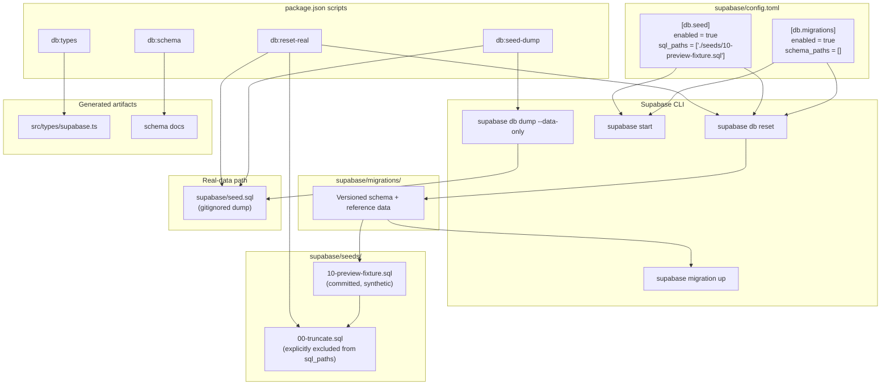
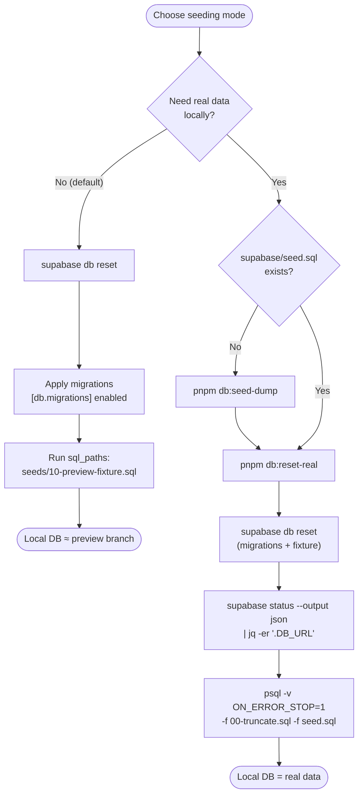
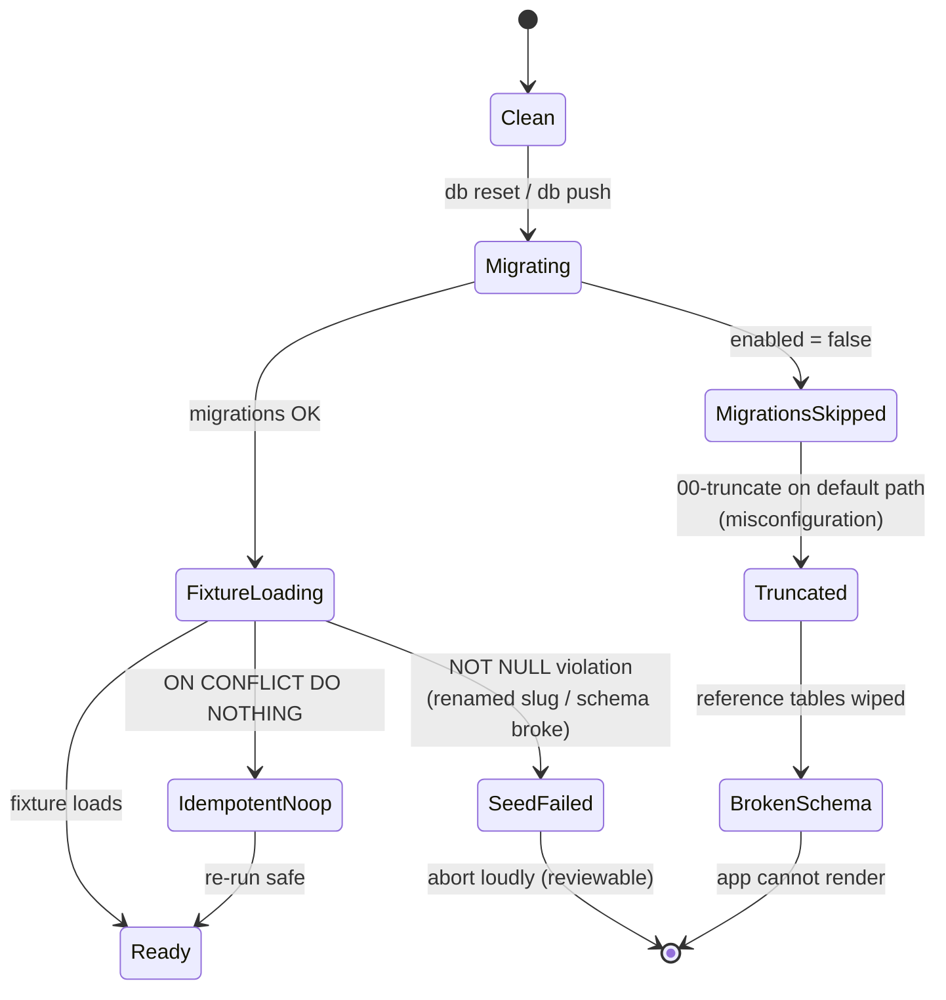

How ozeaon-v2 provisions its local Supabase stack: applying migrations, loading the ordered seed files, and choosing between the committed synthetic preview fixture and the gitignored dump of real data.

## Purpose and Scope

This page documents the database bootstrap and seeding mechanism of ozeaon-v2: the `supabase/config.toml` `[db.migrations]` and `[db.seed]` settings, the ordered list of seed SQL files, the pnpm scripts that drive them (`db:seed-dump`, `db:reset-real`, `db:schema`, `db:types`), and the design rationale behind the split between the committed preview fixture and the real-data dump.

It covers:

- How migrations and seeds are wired together at the configuration level.
- The order and selection rules for seed files (`sql_paths`, glob support, explicit exclusions).
- Two seeding modes: fixture-based (`supabase db reset`) and real-dump-based (`pnpm db:reset-real`).
- The generated artifacts consumed by the app (`src/types/supabase.ts`, schema docs).
- The failure modes baked into the fixture (unset token columns, unguarded subqueries, NOT NULL guards).

Related topics intentionally left to sibling pages:

- For the overall project setup, dependency install, and Next.js/Cloudflare dev loop, see the Getting Started overview pages.
- For Cloudflare Workers deployment, PR preview environments, and the Supabase branch integration, see the Deployment / Preview Environments page. This page only references that integration where it constrains seeding.
- For application-level data access patterns (Supabase client usage, RLS policies, triggers), see the relevant data-access and database-conventions pages.

## Overview

ozeaon-v2 uses Supabase (PostgreSQL 17) as its database, with two artifacts feeding the local stack:

1. **Migrations** — versioned SQL under `supabase/migrations/`, applied in order by the Supabase CLI. Migrations create the schema *and* populate ~25 reference tables (`member_roles`, `sdgs`, `article_types`, `resource_categories`, `project_types`, `project_section_types`, and so on). The ids in those reference rows are generated with `gen_random_uuid()`, which makes them unpredictable across rebuilds.

2. **Seeds** — data-only SQL applied *after* migrations during `supabase start` or `supabase db reset`. There are two families:
   - `supabase/seeds/10-preview-fixture.sql` — committed, synthetic, no real data. This is the default `sql_paths` entry.
   - `supabase/seed.sql` — a gitignored dump of real data, produced by `pnpm db:seed-dump`.

The core design decision is that **the committed fixture, not the real dump, is the default**. The reason is structural: `seed.sql` is gitignored, so the Supabase GitHub branch integration cannot read it and each PR preview branch would come up seeded with nothing. Committing a synthetic fixture gives every preview branch a working, renderable dataset while keeping real user data out of git.

Two further design choices fall out of that:

- The fixture **does not truncate**. Truncating would wipe the reference rows that migrations create — rows the fixture depends on and the app needs to render. Truncation is instead a separate, explicitly-invoked file (`seeds/00-truncate.sql`) used only when loading the real dump.
- The fixture **resolves reference rows by subquery** rather than hardcoding UUIDs, precisely because migration-generated ids are not stable.

## Architecture

The diagram below shows the real components and their wiring from configuration through execution to artifacts.



Reading the diagram: `supabase/config.toml` is the single source of truth for *what runs*. The CLI reads `[db.migrations]` and `[db.seed]` and applies them in sequence during `reset`/`start`. The committed fixture flows through `sql_paths`; the truncate file and the real dump are reachable only via explicitly different commands (`db:reset-real`), never via the default path. The `db:gen` script's two halves (`db:schema`, `db:types`) produce artifacts the TypeScript app compiles against.

## Configuration: `supabase/config.toml`

The database behavior is driven entirely by two TOML sections. Both migration and seed application are gated by `enabled` flags, and the seed file list is an explicit, ordered array rather than a wildcard.

### `[db.migrations]`

```toml
[db.migrations]
# If disabled, migrations will be skipped during a db push or reset.
enabled = true
# Specifies an ordered list of schema files that describe your database.
# Supports glob patterns relative to supabase directory: "./schemas/*.sql"
schema_paths = []
```

> Source: [config.toml](https://github.com/ozeaon/ozeaon-v2/blob/0a4f1a95824db87782f1221a4108019d174df3d9/supabase/config.toml#L51-L56)

`schema_paths` is empty, which means the database definition comes from the ordered files in `supabase/migrations/` rather than from a declarative schema directory. `enabled = true` ensures migrations are *not* skipped during `db push` or `db reset` — critical, because the fixture depends on the reference rows those migrations insert.

### `[db.seed]`

```toml
[db.seed]
# If enabled, seeds the database after migrations during a db reset.
enabled = true
# Specifies an ordered list of seed files to load during db reset.
# Supports glob patterns relative to supabase directory: "./seeds/*.sql"
# Synthetic fixture only. seed.sql (the real-data dump) is gitignored, so the
# Supabase GitHub integration cannot see it and preview branches came up empty.
#
# 00-truncate.sql is deliberately NOT listed: it exists to stop migration-inserted
# rows colliding with that dump, and without the dump it just destroys the
# reference data migrations create (member_roles, sdgs, article_types,
# resource_categories, project_types...), which the fixture depends on.
#
# To load the real dump locally instead:
#   psql "$DB" -f supabase/seeds/00-truncate.sql -f supabase/seed.sql
sql_paths = ["./seeds/10-preview-fixture.sql"]
```

> Source: [config.toml](https://github.com/ozeaon/ozeaon-v2/blob/0a4f1a95824db87782f1221a4108019d174df3d9/supabase/config.toml#L58-L73)

This block encodes three separate decisions worth unpacking:

| Decision | Why |
|---|---|
| `sql_paths` names exactly one file, not a glob | A glob (`./seeds/*.sql`) would also pick up `00-truncate.sql`. The exclusion is *structural*, not commented-out — the truncate file cannot accidentally run on the default path. |
| `seed.sql` is not listed | It is gitignored; listing a non-existent file would break seeding in any environment (notably the GitHub integration) that does not have the dump. |
| The truncate-then-dump recipe is documented inline | Operators who need real data get the exact `psql` invocation in the config itself, so the alternative path is discoverable without leaving the config. |

### Other database-relevant settings

```toml
[db]
# Port to use for the local database URL.
port = 54322
# Port used by db diff command to initialize the shadow database.
shadow_port = 54320
# The database major version to use. This has to be the same as your remote database's.
major_version = 17
```

> Source: [config.toml](https://github.com/ozeaon/ozeaon-v2/blob/0a4f1a95824db87782f1221a4108019d174df3d9/supabase/config.toml#L27-L34)

`major_version = 17` is a hard constraint, not a preference: the comment states it must match the remote database's `SHOW server_version;`. If local and remote drift, a dump taken from one may not restore cleanly into the other — which directly affects the real-data path.

## Seed Files

### `supabase/seeds/10-preview-fixture.sql` — the default

This is the only file listed in `sql_paths`. Its header comment is effectively the design spec for the whole seeding strategy:

```sql
-- Synthetic seed data for preview branches and local `supabase db reset`.
--
-- supabase/seed.sql — the dump of real data — is gitignored, so the Supabase
-- GitHub integration cannot see it and preview branches came up empty. This
-- file is committed and contains no real data.
--
-- Deliberately does NOT truncate. Migrations populate ~25 reference tables
-- (sdgs, article_types, member_roles, resource_categories, project_section_types
-- and so on); wiping them leaves a schema the app cannot render. Every lookup
-- below resolves those by subquery rather than a hardcoded UUID, because
-- migrations generate their ids with gen_random_uuid().
--
-- Those subqueries are deliberately unguarded. A `WHERE EXISTS (... WHERE slug
-- = ...)` around them turns a renamed slug into a silent no-op, which seeds a
-- preview with blank sections and a green check; without it the NOT NULL column
-- rejects the row and the seed fails where the schema actually broke.
--
-- All accounts share the password `ozeaon-preview`.
```

> Source: [10-preview-fixture.sql](https://github.com/ozeaon/ozeaon-v2/blob/0a4f1a95824db87782f1221a4108019d174df3d9/supabase/seeds/10-preview-fixture.sql#L1-L18)

The "unguarded subquery" rule is the most subtle part of the fixture and is worth stating as a principle: **fail loudly, never silently**. A guarded lookup (`WHERE EXISTS ...`) would convert a schema regression into an empty-but-green preview. By leaving the subquery unguarded, a renamed slug causes a `NOT NULL` violation at seed time, so the failure surfaces at the point where the schema actually broke.

### The `search_path` bootstrap

```sql
-- pgcrypto lives in `extensions` on Supabase; `public` covers a local stack.
SET search_path = extensions, public;
```

> Source: [10-preview-fixture.sql](https://github.com/ozeaon/ozeaon-v2/blob/0a4f1a95824db87782f1221a4108019d174df3d9/supabase/seeds/10-preview-fixture.sql#L20-L21)

The fixture needs `gen_salt()` and `crypt()` from pgcrypto. On a hosted Supabase stack that extension lives in the `extensions` schema; on a local stack it may be in `public`. Setting `search_path` to `extensions, public` makes the same file work in both, which matters because this one file serves both CI/preview and local `db reset`.

### Seeding `auth.users` directly

The most fragile part of seeding by hand is the `auth` schema, which the GoTrue auth service reads with strict expectations:

```sql
-- The token columns must be '' rather than NULL. GoTrue scans them into Go
-- strings, which cannot hold NULL, so a NULL there fails the schema query with
-- "Database error querying schema" before the password is ever compared — and
-- the sign-in form reports that as "Invalid email or password". Postgres
-- defaults them to NULL, so seeding auth.users by hand has to set them.
INSERT INTO auth.users (
  id, instance_id, aud, role, email, encrypted_password,
  email_confirmed_at, raw_app_meta_data, raw_user_meta_data,
  created_at, updated_at,
  confirmation_token, recovery_token,
  email_change, email_change_token_new, email_change_token_current,
  phone_change, phone_change_token, reauthentication_token
)
SELECT
  u.id, '00000000-0000-0000-0000-000000000000', 'authenticated', 'authenticated',
  u.email, crypt('ozeaon-preview', gen_salt('bf')),
  now(), '{"provider":"email","providers":["email"]}'::jsonb,
  jsonb_build_object('full_name', u.display_name),
  now(), now(),
  '', '', '', '', '', '', '', ''
FROM (VALUES
  ('11111111-1111-4111-8111-111111111111'::uuid, 'alpha@ozeaon.com',        'Alpha Preview',      'alpha',    'Marine biologist'),
  ('22222222-2222-4222-8222-222222222222'::uuid, 'bravo@ozeaon.com',        'Bravo Preview',      'bravo',    'Reef ecologist'),
  ('33333333-3333-4333-8333-333333333333'::uuid, 'charlie@ozeaon.com',      'Charlie Preview',    'charlie',  'Ocean policy lead'),
  ('44444444-0000-4000-8000-000000000004'::uuid, 'delta@ozeaon.com',        'Delta Preview',      'delta',    'Fisheries scientist'),
  ('44444444-0000-4000-8000-000000000005'::uuid, 'echo@ozeaon.com',         'Echo Preview',       'echo',     'Coastal engineer'),
  ('44444444-0000-4000-8000-000000000006'::uuid, 'foxtrot@ozeaon.com',      'Foxtrot Preview',    'foxtrot',  'Marine spatial planner'),
  ('44444444-0000-4000-8000-000000000007'::uuid, 'golf@ozeaon.com',         'Golf Preview',       'golf',     'Plastics researcher'),
  ('44444444-0000-4000-8000-000000000008'::uuid, 'hotel@ozeaon.com',        'Hotel Preview',      'hotel',    'Aquaculture specialist'),
  ('44444444-0000-4000-8000-000000000009'::uuid, 'india@ozeaon.com',        'India Preview',      'india',    'Coral geneticist'),
  ('44444444-0000-4000-8000-000000000010'::uuid, 'juliett@ozeaon.com',      'Juliett Preview',    'juliett',  'Seabird ecologist'),
  ('44444444-0000-4000-8000-000000000011'::uuid, 'kilo@ozeaon.com',         'Kilo Preview',       'kilo',     'Ocean data analyst'),
  ('44444444-0000-4000-8000-000000000012'::uuid, 'lima@ozeaon.com',         'Lima Preview',       'lima',     'Mangrove restoration lead'),
  ('44444444-0000-4000-8000-000000000013'::uuid, 'mike@ozeaon.com',         'Mike Preview',       'mike',     'Fisheries observer'),
  ('44444444-0000-4000-8000-000000000014'::uuid, 'november@ozeaon.com',     'November Preview',   'november', 'Deep-sea biologist'),
  ('44444444-0000-4000-8000-000000000015'::uuid, 'oscar@ozeaon.com',        'Oscar Preview',      'oscar',    'Blue carbon analyst'),
  ('44444444-0000-4000-8000-000000000016'::uuid, 'papa@ozeaon.com',         'Papa Preview',       'papa',     'Community outreach lead'),
  ('44444444-0000-4000-8000-000000000017'::uuid, 'quebec@ozeaon.com',       'Quebec Preview',     'quebec',   'Marine policy adviser'),
  ('44444444-0000-4000-8000-000000000018'::uuid, 'romeo@ozeaon.com',        'Romeo Preview',      'romeo',    'Remote sensing specialist'),
  ('44444444-0000-4000-8000-000000000019'::uuid, 'sierra@ozeaon.com',       'Sierra Preview',     'sierra',   'Kelp forest ecologist'),
  ('44444444-0000-4000-8000-000000000020'::uuid, 'tango@ozeaon.com',        'Tango Preview',      'tango',     'Marine mammal researcher')
) AS u(id, email, display_name, username, role_descriptor)
ON CONFLICT (id) DO NOTHING;
```

> Source: [10-preview-fixture.sql](https://github.com/ozeaon/ozeaon-v2/blob/0a4f1a95824db87782f1221a4108019d174df3d9/supabase/seeds/10-preview-fixture.sql#L23-L66)

Three implementation details are load-bearing here:

1. **Token columns are `''`, never `NULL`.** GoTrue scans these into Go `string` values, which cannot hold `NULL`. A `NULL` makes GoTrue's schema query fail with `Database error querying schema` *before* the password comparison, and the sign-in UI surfaces that as the misleading `Invalid email or password`. Since Postgres defaults these columns to `NULL`, hand-written `auth.users` inserts must set them explicitly.
2. **Passwords are hashed in SQL** with `crypt(..., gen_salt('bf'))` — bcrypt — matching what GoTrue expects. All 20 preview accounts share the password `ozeaon-preview`.
3. **`ON CONFLICT (id) DO NOTHING`** makes the fixture idempotent, so re-running `db reset` (or seeding a branch that already has rows) does not fail on duplicate primary keys.

The account fixtures model a range of roles and disciplines (marine biologist, reef ecologist, ocean policy lead, …) so preview branches exercise role-dependent and content-dependent rendering rather than a single anonymous user.

### `supabase/seeds/00-truncate.sql` — real-dump only, explicitly excluded

`00-truncate.sql` exists solely to clear tables before the real dump is restored, so that migration-inserted rows cannot collide with rows the dump re-inserts. It is **deliberately not in `sql_paths`**. Without the dump alongside it, truncating would destroy the reference data that migrations create — `<code>member_roles</code>, <code>sdgs</code>, <code>article_types</code>, <code>resource_categories</code>, <code>project_types</code>` — which the fixture then depends on. In other words, running truncate on the default path would leave a schema the app cannot render.

## Core Flow: Two Seeding Modes

There are exactly two supported ways to bring a local database up, and they deliberately do not overlap. The default path loads the committed fixture; the real-data path is an explicit, separate command.



> Sources:
> - [package.json](https://github.com/ozeaon/ozeaon-v2/blob/0a4f1a95824db87782f1221a4108019d174df3d9/package.json#L23-L27)
> - [config.toml](https://github.com/ozeaon/ozeaon-v2/blob/0a4f1a95824db87782f1221a4108019d174df3d9/supabase/config.toml#L58-L73)

Walking the real path in order:

1. `supabase db reset` rebuilds the database from migrations and applies the fixture (`sql_paths`). This guarantees a known schema.
2. `supabase status --output json | jq -er '.DB_URL'` extracts the live connection string. The `-e` flag on `jq` is significant: it makes `jq` **exit non-zero when the expression yields `null` or `false`**, so if the local stack is not running the script aborts instead of proceeding with an empty `DB_URL`.
3. `psql "$DB_URL" -v ON_ERROR_STOP=1 -f 00-truncate.sql -f seed.sql` runs both files in one session, in order. `ON_ERROR_STOP=1` makes `psql` abort on the first SQL error rather than continuing and leaving a half-restored database. Passing both `-f` flags in one invocation ensures truncate and restore are a single transaction-like sequence with a shared connection.

### The command definitions

The two database-lifecycle scripts, verbatim from `package.json`:

```json
"db:seed-dump": "supabase db dump --data-only -f supabase/seed.sql",
"db:reset-real": "supabase db reset && DB_URL=$(supabase status --output json | jq -er '.DB_URL') && psql \"$DB_URL\" -v ON_ERROR_STOP=1 -f supabase/seeds/00-truncate.sql -f supabase/seed.sql"
```

> Source: [package.json](https://github.com/ozeaon/ozeaon-v2/blob/0a4f1a95824db87782f1221a4108019d174df3d9/package.json#L26-L27)

Note the `&&` chaining in `db:reset-real`: each stage must succeed before the next runs. Combined with `jq -er` and `psql -v ON_ERROR_STOP=1`, every step of the real-data path is fail-fast.

### Generated artifacts: `db:gen`

The schema and its TypeScript types are generated, not hand-written:

```json
"db:schema": "node scripts/schema/generate.mjs",
"db:types": "supabase gen types typescript --local > src/types/supabase.ts && prettier --write src/types/supabase.ts",
"db:gen": "pnpm db:schema && pnpm db:types",
```

> Source: [package.json](https://github.com/ozeaon/ozeaon-v2/blob/0a4f1a95824db87782f1221a4108019d174df3d9/package.json#L23-L25)

`db:gen` is the composite entry point. `db:types` introspects the **local** database (`--local`) and writes `src/types/supabase.ts`, then formats it with Prettier. This means **types reflect whatever is in the local database at the moment you run it** — after a migration is added, `db:gen` must be re-run for the app to see new tables and columns. Because it reads the local stack, `supabase start` (or a reset) must have run first.

## Command Reference

| Command | What it does | When to use |
|---|---|---|
| `supabase db reset` | Drops and rebuilds the local DB: applies all migrations, then runs `sql_paths` (the fixture). | First setup; after adding/modifying migrations; to match preview-branch state. |
| `supabase start` | Starts the local stack; seeds run on first start. | Daily local development. |
| `supabase migration up` | Applies only *new* migrations, without dropping data. | Day-to-day after pulling new migrations. |
| `supabase db push` | Pushes migrations to a linked remote (respects `[db.migrations] enabled`). | Promoting schema to a remote instance. |
| `pnpm db:seed-dump` | `supabase db dump --data-only` → `supabase/seed.sql` (gitignored). | Before a `db:reset-real`, to refresh the real-data snapshot. |
| `pnpm db:reset-real` | Reset + truncate + load `seed.sql`. Requires the local stack running and `jq`/`psql` on `PATH`. | Reproducing real data locally. |
| `pnpm db:gen` | Regenerates schema docs (`db:schema`) and `src/types/supabase.ts` (`db:types`). | After any migration change. |

> Sources:
> - [package.json](https://github.com/ozeaon/ozeaon-v2/blob/0a4f1a95824db87782f1221a4108019d174df3d9/package.json#L23-L27)
> - [CLAUDE.md](https://github.com/ozeaon/ozeaon-v2/blob/0a4f1a95824db87782f1221a4108019d174df3d9/CLAUDE.md#L72-L74)
> - [README.md](https://github.com/ozeaon/ozeaon-v2/blob/0a4f1a95824db87782f1221a4108019d174df3d9/README.md#L251-L252)

## Usage Examples

### Default local setup (fixture)

```bash
supabase db reset
pnpm db:reset-real     # truncate + supabase/seed.sql
```

> Source: [deployment-previews.md](https://github.com/ozeaon/ozeaon-v2/blob/0a4f1a95824db87782f1221a4108019d174df3d9/docs/deployment-previews.md#L52-L54)

Use `supabase db reset` for the fixture (which matches what preview branches get), and reserve `pnpm db:reset-real` for when you specifically need real data.

### Day-to-day migration workflow

```bash
supabase migration up # apply new migrations — use this most of the time
supabase db reset # rebuild local DB
```

> Source: [supabase-local.md](https://github.com/ozeaon/ozeaon-v2/blob/0a4f1a95824db87782f1221a4108019d174df3d9/docs/supabase-local.md#L85-L86)

### Refreshing and loading the real dump

Seeds only run on `supabase start` or `supabase db reset`, so the dump must exist *before* that step:

```bash
supabase db reset
```

> Source: [supabase-local.md](https://github.com/ozeaon/ozeaon-v2/blob/0a4f1a95824db87782f1221a4108019d174df3d9/docs/supabase-local.md#L60-L63)

The `db:seed-dump` script produces the dump that `db:reset-real` then consumes:

```json
"db:seed-dump": "supabase db dump --data-only -f supabase/seed.sql",
```

> Source: [package.json](https://github.com/ozeaon/ozeaon-v2/blob/0a4f1a95824db87782f1221a4108019d174df3d9/package.json#L26)

## Failure Modes, Edge Cases & Guardrails

The seeding design is built around a small number of failure scenarios that have already been encountered and explicitly defended against.



| Failure mode | Trigger | Defense in the source |
|---|---|---|
| Preview branches seed to nothing | `seed.sql` gitignored → GitHub integration cannot read it | The committed fixture is what `sql_paths` points at. |
| Schema destroyed by truncate on default path | `00-truncate.sql` listed in `sql_paths` | It is *deliberately not listed*; the exclusion is a structural fact, not a comment. |
| Silent empty preview | A guarded `WHERE EXISTS` lookup turns a renamed slug into a no-op | Lookups are deliberately unguarded so a `NOT NULL` violation fails the seed at the real point of breakage. |
| `"Invalid email or password"` on a valid account | `auth.users` token columns are `NULL` | Fixture sets them to `''`, because GoTrue scans them into Go `string`s. |
| Duplicate-key failure on re-seed | Fixture re-run against existing rows | `ON CONFLICT (id) DO NOTHING` makes inserts idempotent. |
| `db:reset-real` connects to the wrong server | Local stack not running | `jq -er '.DB_URL'` exits non-zero when the value is null, so `psql` never runs with an empty URL. |
| Half-restored database | An error mid-restore | `psql -v ON_ERROR_STOP=1` aborts on the first SQL error. |
| Reference data missing | Wiping ~25 migration-populated lookup tables | Fixture does not truncate; truncate only runs alongside the real dump. |

### Migration/seed coupling (documented constraint)

There is an explicit rule that a migration changing what the fixture writes **requires the fixture to be updated in the same PR**:

> Every PR into `main` also gets its own Worker and Supabase branch, seeded from `supabase/seeds/10-preview-fixture.sql`. A migration that changes what the fixture writes to needs the fixture updated in the same PR.

> Source: [CLAUDE.md](https://github.com/ozeaon/ozeaon-v2/blob/0a4f1a95824db87782f1221a4108019d174df3d9/CLAUDE.md#L231-L233)

This is what keeps the "unguarded subquery, fail loudly" strategy workable: the fixture is treated as part of the migration, so schema drift is caught in CI rather than in a broken preview.

### Why the real dump is never the default

`seed.sql` is gitignored because it contains **real user data** and should never be committed:

> `seed.sql` is gitignored — it contains real user data and should never be committed.

> Source: [supabase-local.md](https://github.com/ozeaon/ozeaon-v2/blob/0a4f1a95824db87782f1221a4108019d174df3d9/docs/supabase-local.md#L56)

Because it is untracked, a dump is a moving snapshot that always *lags the schema*. The trade-off is deliberate: the fixture ships *with* migrations and is therefore updated rather than worked around.

> Source: [deployment-previews.md](https://github.com/ozeaon/ozeaon-v2/blob/0a4f1a95824db87782f1221a4108019d174df3d9/docs/deployment-previews.md#L46-L48)

## Operational Notes & Extension Points

**Ordering convention.** Seed files are numbered (`00-truncate.sql`, `10-preview-fixture.sql`). Because `sql_paths` supports glob patterns and an explicit ordered list, numeric prefixes are the extension mechanism: a new seed file with a higher prefix (e.g. `20-*.sql`) can be appended to `sql_paths` and will run after the fixture. The truncate file's `00-` prefix encodes that it must run *before* any data load — which is precisely why it is only reachable on the real-dump path.

**Version coupling.** `[db] major_version = 17` must match the remote database. `db:types` uses `--local`, so the generated `src/types/supabase.ts` describes your local schema — regenerate (`pnpm db:gen`) after any migration, or components will compile against stale types.

**Tool prerequisites.** `db:reset-real` shells out to `jq` and `psql` and stops if the local stack is not running, rather than letting `psql` fall through to whatever server is listening on the default port.

> Source: [deployment-previews.md](https://github.com/ozeaon/ozeaon-v2/blob/0a4f1a95824db87782f1221a4108019d174df3d9/docs/deployment-previews.md#L57-L58)

**Reset discipline.** `db reset` is meant to be used sparingly. After initial setup, `supabase migration up` is the safe day-to-day command; only use `db reset` right after exporting a seed dump, and only when local migrations match the remote the dump came from (or at least when locally-added migrations do not alter data structures that would make the seed fail).

> Source: [supabase-local.md](https://github.com/ozeaon/ozeaon-v2/blob/0a4f1a95824db87782f1221a4108019d174df3d9/docs/supabase-local.md#L66-L67)

## Related Links

- [supabase/config.toml](https://github.com/ozeaon/ozeaon-v2/blob/0a4f1a95824db87782f1221a4108019d174df3d9/supabase/config.toml) — `[db.migrations]`, `[db.seed]`, `[db]` settings
- [supabase/seeds/10-preview-fixture.sql](https://github.com/ozeaon/ozeaon-v2/blob/0a4f1a95824db87782f1221a4108019d174df3d9/supabase/seeds/10-preview-fixture.sql) — committed synthetic seed
- [package.json](https://github.com/ozeaon/ozeaon-v2/blob/0a4f1a95824db87782f1221a4108019d174df3d9/package.json#L23-L27) — `db:*` scripts
- [docs/deployment-previews.md](https://github.com/ozeaon/ozeaon-v2/blob/0a4f1a95824db87782f1221a4108019d174df3d9/docs/deployment-previews.md) — preview branches and the fixture
- [docs/supabase-local.md](https://github.com/ozeaon/ozeaon-v2/blob/0a4f1a95824db87782f1221a4108019d174df3d9/docs/supabase-local.md) — local Supabase workflow and the real dump
- [CLAUDE.md](https://github.com/ozeaon/ozeaon-v2/blob/0a4f1a95824db87782f1221a4108019d174df3d9/CLAUDE.md#L72-L74) — database command summary and migration/fixture coupling rule
- [README.md](https://github.com/ozeaon/ozeaon-v2/blob/0a4f1a95824db87782f1221a4108019d174df3d9/README.md#L251-L252) — command table
