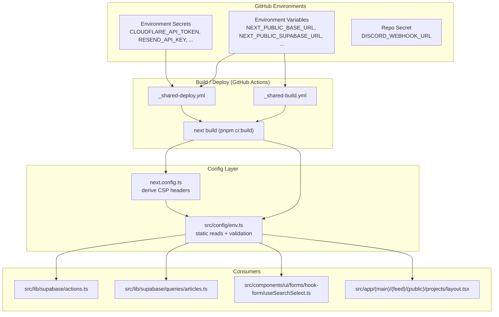
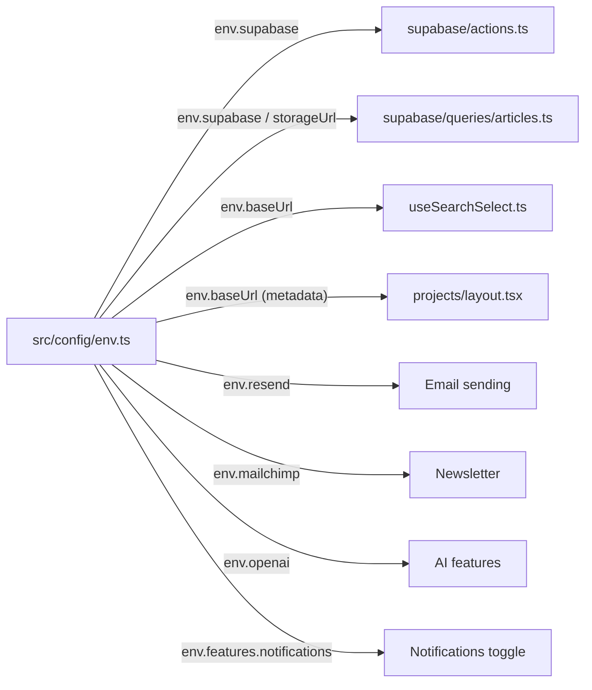
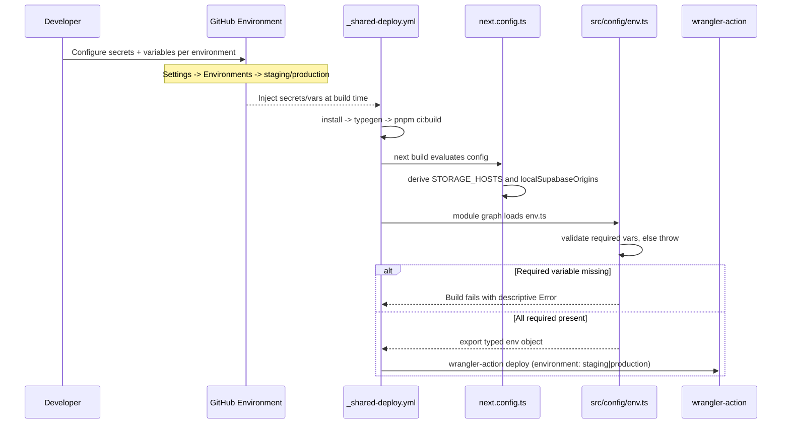

Environment configuration in ozeaon-v2 is centralized in a single validated module, `src/config/env.ts`, which reads `process.env` at build time and exposes a typed, grouped `env` object to the rest of the application.

## Purpose and Scope

This page documents how environment variables are defined, validated, and consumed in the ozeaon-v2 codebase. It covers:

- The `src/config/env.ts` accessor module and its static-reference design.
- The distinction between `NEXT_PUBLIC_*` (client-exposed) and server-only secrets.
- The build-time validation contract and how missing variables fail the build.
- How environment variables propagate into deployment (Cloudflare Workers via GitHub Actions).
- How `next.config.ts` derives runtime security headers from environment variables.

This page intentionally does **not** cover the Cloudflare/OpenNext deployment pipeline mechanics, the GitHub Actions workflow topology, or the database schema. For those, see the sibling pages on Deployment and Operations. References to `wrangler.jsonc` and workflow files are included here only to explain how environment values cross the build/deploy boundary.

## Overview

ozeaon-v2 is a Next.js application deployed to Cloudflare Workers through OpenNext. This runtime imposes a hard constraint that shapes the entire environment strategy: **there is no Node.js runtime available in production**. As documented in the operations guide, "No Node.js APIs (`fs`, `path`, `Buffer`) at runtime. Use Web-standard APIs only (`fetch`, `Request`/`Response`, `crypto`). `process.env` is build-time only — use `src/config/env.ts`."

This has three important consequences:

1. **`process.env` is not a runtime lookup.** Values are inlined during `next build`. Reading `process.env.SOMETHING` inside a request handler would not work reliably on Workers, so all access is funneled through a module that performs the reads at module-evaluation time.
2. **Client vs. server exposure is enforced by the `NEXT_PUBLIC_` prefix.** Next.js inlines only `NEXT_PUBLIC_*` variables into the browser bundle. The `env.ts` module deliberately documents that anything without that prefix "stays server-only because nothing without a `NEXT_PUBLIC_` prefix is exposed to the browser bundle."
3. **Validation is a build-time gate.** Required variables are checked at module load. Because the module is imported from the auth actions, queries, and UI code, a missing required variable surfaces as a build/typegen failure rather than a silent runtime `undefined`.

### Key terminology

| Term | Meaning in this codebase |
|------|--------------------------|
| `NEXT_PUBLIC_*` | Inlined into both server and client bundles at build time |
| Server secret | A variable without the `NEXT_PUBLIC_` prefix; only readable in server code |
| Build-time inlining | Next.js replaces `process.env.X` with a literal during `next build` |
| CI-pinned toolchain | pnpm/Node/Wrangler versions set in the workflow `env:` blocks |
| GitHub Environment | Where per-environment secrets and variables are configured |

## Architecture

The environment system has four layers: the source of truth (GitHub Environments), the build-time inlining step, the typed accessor module, and the consumers.



The design intent behind this layering is **build-time enforcement and a single access point**. GitHub Environments own the values so that no secret ever lives on a developer machine; the workflow injects them into `next build`; and every consumer imports the same typed `env` object rather than touching `process.env` directly.

## The `src/config/env.ts` Accessor Module

The entire runtime configuration surface is defined by a single module. It has a deliberate two-phase structure: **static capture** of every variable, then **validation**, then **export**.

### Phase 1 — Static capture

The module first hoists every environment read into a module-scope `const`. This is not incidental: Next.js can only inline `NEXT_PUBLIC_*` values when it can statically see the property access on `process.env`. Destructuring `process.env` or indexing it dynamically would defeat the inlining.

```typescript
// Env access with static references so Next.js can inline the NEXT_PUBLIC_ values at build time.
// Server secrets live here too - they stay server-only because nothing without a NEXT_PUBLIC_
// prefix is exposed to the browser bundle. Never read one of them from a client component.
const SUPABASE_URL = process.env.NEXT_PUBLIC_SUPABASE_URL;
const SUPABASE_PUBLISHABLE_KEY =
  process.env.NEXT_PUBLIC_SUPABASE_PUBLISHABLE_KEY;
const GOOGLE_CLIENT_ID = process.env.NEXT_PUBLIC_GOOGLE_CLIENT_ID;
const BASE_URL = process.env.NEXT_PUBLIC_BASE_URL;
const STORAGE_URL = process.env.NEXT_PUBLIC_STORAGE_URL;
const RESEND_API_KEY = process.env.RESEND_API_KEY;
const RESEND_SENDER_EMAIL = process.env.RESEND_SENDER_EMAIL;
const MAILCHIMP_API_KEY = process.env.MAILCHIMP_API_KEY;
const MAILCHIMP_AUDIENCE_ID = process.env.MAILCHIMP_AUDIENCE_ID;
const ACCESS_TOKEN = process.env.ACCESS_TOKEN;
const OPENAI_API_KEY = process.env.OPENAI_API_KEY;
const FEATURE_NOTIFICATIONS = process.env.NEXT_PUBLIC_FEATURE_NOTIFICATIONS;
```

> Source: [env.ts](https://github.com/ozeaon/ozeaon-v2/blob/0a4f1a95824db87782f1221a4108019d174df3d9/src/config/env.ts#L1-L16)

### Phase 2 — Build-time validation of required variables

Only two variables are treated as hard requirements: the Supabase URL and publishable key. Everything else is optional and falls back to an empty string or a sane default. This is a deliberate asymmetry — Supabase is the persistence backbone, so the app cannot function without it, while integrations like Resend, Mailchimp, and OpenAI degrade gracefully.

```typescript
if (!SUPABASE_URL) {
  throw new Error(
    "Missing required environment variable: NEXT_PUBLIC_SUPABASE_URL",
  );
}
if (!SUPABASE_PUBLISHABLE_KEY) {
  throw new Error(
    "Missing required environment variable: NEXT_PUBLIC_SUPABASE_PUBLISHABLE_KEY",
  );
}
```

> Source: [env.ts](https://github.com/ozeaon/ozeaon-v2/blob/0a4f1a95824db87782f1221a4108019d174df3d9/src/config/env.ts#L18-L27)

Because the module is imported by server actions, data queries, and client hooks, this `throw` executes during `next build`'s module graph traversal. That converts a misconfigured deployment into a failed CI build instead of a production 500. The operations guide reinforces this: "`process.env` is build-time only" and required variables are "validated at build time via `src/config/env.ts`."

### Phase 3 — The exported `env` object

The exported object is namespaced by concern (`supabase`, `resend`, `mailchimp`, `openai`, `google`, `features`) with a few top-level scalars. This grouping makes call sites self-documenting and gives a single place to change a default.

```typescript
export const env = {
  supabase: {
    url: SUPABASE_URL,
    pubKey: SUPABASE_PUBLISHABLE_KEY,
  },
  resend: {
    apiKey: RESEND_API_KEY || "",
    email: RESEND_SENDER_EMAIL || "",
  },
  mailchimp: {
    apiKey: MAILCHIMP_API_KEY || "",
    audienceId: MAILCHIMP_AUDIENCE_ID || "",
  },
  openai: {
    apiKey: OPENAI_API_KEY || "",
  },
  google: {
    clientId: GOOGLE_CLIENT_ID || "",
  },
  features: {
    // Short-lived release toggle, removed with the last notifications ticket.
    // Optional and off when absent, so builds that never set it still pass.
    notifications: FEATURE_NOTIFICATIONS === "true",
  },
  accessToken: ACCESS_TOKEN || "",
  baseUrl: BASE_URL || "http://localhost:3000",
  storageUrl: STORAGE_URL,
  isDevelopment: process.env.NODE_ENV === "development",
  isProduction: process.env.NODE_ENV === "production",
};
```

> Source: [env.ts](https://github.com/ozeaon/ozeaon-v2/blob/0a4f1a95824db87782f1221a4108019d174df3d9/src/config/env.ts#L29-L58)

Two design details stand out:

- **`storageUrl: STORAGE_URL` is the only value exported without a default.** Every other optional field uses `|| ""`. This preserves the distinction between "unset" (`undefined`) and "set to empty" for the storage URL, which is meaningful because `next.config.ts` branches on its presence.
- **`features.notifications` is a boolean flag, not a string.** The comparison `=== "true"` means any other value (unset, `"false"`, `"1"`) evaluates to `false`. The inline comment explains the intent: a "short-lived release toggle" that is "optional and off when absent, so builds that never set it still pass." This is a feature-flag-via-env pattern that avoids a hard dependency on a flag service.
- **`isDevelopment` / `isProduction`** are derived from `NODE_ENV`, not separately configured, so they cannot drift from Next.js's own mode.

### Variable classification

| Variable | Prefix | Required | Used for |
|----------|--------|----------|----------|
| `NEXT_PUBLIC_SUPABASE_URL` | public | ✅ Yes | Supabase client + CSP origin derivation |
| `NEXT_PUBLIC_SUPABASE_PUBLISHABLE_KEY` | public | ✅ Yes | Supabase client auth |
| `NEXT_PUBLIC_GOOGLE_CLIENT_ID` | public | No | Google OAuth button |
| `NEXT_PUBLIC_BASE_URL` | public | No (default `http://localhost:3000`) | Absolute URL generation / metadata |
| `NEXT_PUBLIC_STORAGE_URL` | public | No | R2 storage host + CSP `img-src`/`connect-src` |
| `NEXT_PUBLIC_FEATURE_NOTIFICATIONS` | public | No (`false`) | Notifications release toggle |
| `RESEND_API_KEY` | server | No | Transactional email |
| `RESEND_SENDER_EMAIL` | server | No | Email `from` address |
| `MAILCHIMP_API_KEY` | server | No | Newsletter integration |
| `MAILCHIMP_AUDIENCE_ID` | server | No | Newsletter audience |
| `OPENAI_API_KEY` | server | No | AI features |
| `ACCESS_TOKEN` | server | No | Internal/administrative access guard |

The split is security-critical: only the five `NEXT_PUBLIC_*` values are inlined into the browser bundle. The six server secrets (`RESEND_*`, `MAILCHIMP_*`, `OPENAI_API_KEY`, `ACCESS_TOKEN`) never reach a client component. The module's header comment states this explicitly — "Never read one of them from a client component."

## Environment Variables Imported into `next.config.ts`

`next.config.ts` reads `process.env` directly for a different purpose than `env.ts`: it derives **Content Security Policy headers** at config time. The environment is therefore not just credentials — it also shapes the security posture of the deployed response headers.

```typescript
const isDev = process.env.NODE_ENV === "development";
const storageHost = (() => {
  const url = process.env.NEXT_PUBLIC_STORAGE_URL;
  if (!url) return "";
  try {
    return new URL(url).host;
  } catch {
    return "";
  }
})();
```

> Source: [next.config.ts](https://github.com/ozeaon/ozeaon-v2/blob/0a4f1a95824db87782f1221a4108019d174df3d9/next.config.ts#L14-L23)

The comment above `STORAGE_HOSTS` explains the design intent for allow-listing multiple hosts: "Article content and attachments store absolute URLs against whichever environment uploaded them, so both storage hosts must be allowed regardless of which one this deployment writes to — for images (`img-src`) and for the XHR reads pdf.js and document downloads perform (`connect-src`)."

```typescript
const STORAGE_HOSTS = [
  ...new Set(
    ["storage-r2.ozeaon.com", "storage-r2.ozeaon.dev", storageHost].filter(
      Boolean,
    ),
  ),
].join(" ");
```

> Source: [next.config.ts](https://github.com/ozeaon/ozeaon-v2/blob/0a4f1a95824db87782f1221a4108019d174df3d9/next.config.ts#L31-L37)

Supabase origins are also derived from the environment — but notably **from the configured URL rather than `NODE_ENV`**, so that `pnpm preview` and `pnpm ci:build` (which emit production headers while still pointing at localhost) remain functional:

```typescript
const localSupabaseOrigins = (() => {
  const url = process.env.NEXT_PUBLIC_SUPABASE_URL;
  if (!url) return "";
  try {
    const { host, hostname } = new URL(url);
    if (hostname !== "127.0.0.1" && hostname !== "localhost") return "";
    return `http://${host} ws://${host}`;
  } catch {
    return "";
  }
})();
```

> Source: [next.config.ts](https://github.com/ozeaon/ozeaon-v2/blob/0a4f1a95824db87782f1221a4108019d174df3d9/next.config.ts#L45-L55)

Design takeaways:

- Both derivations are **defensive**: malformed URLs fall into `catch` and resolve to `""` rather than crashing the build.
- The CSP is composed by string interpolation of `${STORAGE_HOSTS}` and `${localSupabaseOrigins}` into the policy body, so setting or unsetting these variables changes the emitted headers.
- A deployment that forgets to set `NEXT_PUBLIC_STORAGE_URL` still yields a valid CSP — it simply omits the dynamic host, relying on the two hard-coded production/dev hosts.

## Where Configuration Is Consumed

`env` is imported via the `@/config/env` path alias across server actions, data queries, and client components:

```typescript
import { env } from "@/config/env";
```

> Sources:
> - [actions.ts](https://github.com/ozeaon/ozeaon-v2/blob/0a4f1a95824db87782f1221a4108019d174df3d9/src/lib/supabase/actions.ts#L24)
> - [articles.ts](https://github.com/ozeaon/ozeaon-v2/blob/0a4f1a95824db87782f1221a4108019d174df3d9/src/lib/supabase/queries/articles.ts#L1)
> - [useSearchSelect.ts](https://github.com/ozeaon/ozeaon-v2/blob/0a4f1a95824db87782f1221a4108019d174df3d9/src/components/ui/forms/hook-form/useSearchSelect.ts#L5)
> - [layout.tsx](https://github.com/ozeaon/ozeaon-v2/blob/0a4f1a95824db87782f1221a4108019d174df3d9/src/app/(main)/(feed)/(public)/projects/layout.tsx#L7)

This uniform import path is what makes the build-time validation reachable from every corner of the app. If a single module that transitively imports `env.ts` is in the build graph, the required-variable check runs.



## Core Flow: From Configuration to Deployment

The lifecycle of an environment variable crosses a GitHub Environment, a CI workflow, and the Cloudflare build. The sequence below reflects the steps documented in the operations guide for `_shared-deploy.yml`.



The parse order matters: `next.config.ts` is evaluated before the module graph, so header derivation happens first; the `env.ts` validation then gates the build; only a successful build reaches the deploy step.

### Local development

For local work, variables live in `.env.local`. The operations guide lists the required set for that file:

```dotenv
NEXT_PUBLIC_SUPABASE_URL=
NEXT_PUBLIC_SUPABASE_PUBLISHABLE_KEY=
SUPABASE_SERVICE_ROLE_KEY=
RESEND_API_KEY=
RESEND_SENDER_EMAIL=
NEXT_PUBLIC_STORAGE_URL=
```

> Source: [ops-deployment.md](https://github.com/ozeaon/ozeaon-v2/blob/0a4f1a95824db87782f1221a4108019d174df3d9/docs/ops-deployment.md#L5-L14)

`next.config.ts` conditionally initializes Cloudflare bindings only in development, skipping typegen/build CLI invocations to avoid stalling:

```typescript
if (process.env.NODE_ENV === "development") {
  initOpenNextCloudflareForDev();
}
```

> Source: [next.config.ts](https://github.com/ozeaon/ozeaon-v2/blob/0a4f1a95824db87782f1221a4108019d174df3d9/next.config.ts#L6-L8)

## Configuration Reference

### Application variables (`src/config/env.ts`)

| Option (env var) | Type | Default | Description |
|------------------|------|---------|-------------|
| `NEXT_PUBLIC_SUPABASE_URL` | string | — (**required**) | Supabase project URL. Throws at module load if unset. Also drives CSP Supabase origins. |
| `NEXT_PUBLIC_SUPABASE_PUBLISHABLE_KEY` | string | — (**required**) | Supabase publishable/anon key. Throws at module load if unset. |
| `NEXT_PUBLIC_GOOGLE_CLIENT_ID` | string | `""` | Google OAuth client ID for the sign-in button. |
| `NEXT_PUBLIC_BASE_URL` | string | `"http://localhost:3000"` | Canonical app base URL for absolute links and metadata. |
| `NEXT_PUBLIC_STORAGE_URL` | string \| undefined | `undefined` | R2 storage base URL. Exported **without** a fallback so `next.config.ts` can distinguish set vs. unset. |
| `NEXT_PUBLIC_FEATURE_NOTIFICATIONS` | string → boolean | `false` | Release toggle; only the literal `"true"` enables it. |
| `RESEND_API_KEY` | string (server) | `""` | Resend transactional email API key. |
| `RESEND_SENDER_EMAIL` | string (server) | `""` | `from` address for outgoing email. |
| `MAILCHIMP_API_KEY` | string (server) | `""` | Mailchimp API key. |
| `MAILCHIMP_AUDIENCE_ID` | string (server) | `""` | Mailchimp audience/list ID. |
| `OPENAI_API_KEY` | string (server) | `""` | OpenAI API key. |
| `ACCESS_TOKEN` | string (server) | `""` | Internal/administrative access token. |
| `NODE_ENV` | string | framework-managed | Derives `isDevelopment` and `isProduction`. |

### Deployment-only variables (GitHub Environments)

These are consumed by the CI workflows rather than by `env.ts`, and are configured per environment under **Settings → Environments → `staging` / `production`**.

```dotenv
# Secrets
CLOUDFLARE_API_TOKEN      # Workers Scripts (Edit) + Account Settings (Read)
CLOUDFLARE_ACCOUNT_ID
RESEND_API_KEY
RESEND_SENDER_EMAIL

# Variables
NEXT_PUBLIC_BASE_URL              # e.g. https://staging.ozeaon.com
NEXT_PUBLIC_SUPABASE_URL
NEXT_PUBLIC_SUPABASE_PUBLISHABLE_KEY
```

> Source: [ops-deployment.md](https://github.com/ozeaon/ozeaon-v2/blob/0a4f1a95824db87782f1221a4108019d174df3d9/docs/ops-deployment.md#L124-L137)

A repo-level secret, `DISCORD_WEBHOOK_URL`, is used by `staging.yml`, `production.yml`, and `pr-monitoring.yml`. Notifications are `continue-on-error` and silently skip if unset. `pr-monitoring.yml` additionally reads `.github/discord-user-map.json` to map GitHub logins to Discord user IDs for @-mentions.

> Source: [ops-deployment.md](https://github.com/ozeaon/ozeaon-v2/blob/0a4f1a95824db87782f1221a4108019d174df3d9/docs/ops-deployment.md#L139-L141)

### CI-pinned toolchain

Workflows set tool versions in their own `env:` blocks, independent of local `package.json` ranges: pnpm `11.9.0`, Node `24.18.0`, Wrangler `4.114.0`.

> Source: [ops-deployment.md](https://github.com/ozeaon/ozeaon-v2/blob/0a4f1a95824db87782f1221a4108019d174df3d9/docs/ops-deployment.md#L113-L114)

The application declares `dotenv` as a dev dependency (`^17.4.2`) for type-safe script execution with environment variables.

> Source: [package.json](https://github.com/ozeaon/ozeaon-v2/blob/0a4f1a95824db87782f1221a4108019d174df3d9/package.json#L107)

## Failure Modes and Edge Cases

Because validation happens at module load, the failure behavior is deterministic and loud rather than silent.

| Scenario | Behavior | Where |
|----------|----------|-------|
| `NEXT_PUBLIC_SUPABASE_URL` unset | `throw new Error("Missing required environment variable: NEXT_PUBLIC_SUPABASE_URL")` at module evaluation → build fails | [env.ts](https://github.com/ozeaon/ozeaon-v2/blob/0a4f1a95824db87782f1221a4108019d174df3d9/src/config/env.ts#L18-L22) |
| `NEXT_PUBLIC_SUPABASE_PUBLISHABLE_KEY` unset | `throw new Error("Missing required environment variable: NEXT_PUBLIC_SUPABASE_PUBLISHABLE_KEY")` → build fails | [env.ts](https://github.com/ozeaon/ozeaon-v2/blob/0a4f1a95824db87782f1221a4108019d174df3d9/src/config/env.ts#L23-L27) |
| Optional integration key unset | Field resolves to `""`; calling code must handle gracefully | [env.ts](https://github.com/ozeaon/ozeaon-v2/blob/0a4f1a95824db87782f1221a4108019d174df3d9/src/config/env.ts#L34-L47) |
| `NEXT_PUBLIC_BASE_URL` unset | Falls back to `http://localhost:3000` | [env.ts](https://github.com/ozeaon/ozeaon-v2/blob/0a4f1a95824db87782f1221a4108019d174df3d9/src/config/env.ts#L54) |
| `NEXT_PUBLIC_FEATURE_NOTIFICATIONS` set to `"1"` or `"TRUE"` | Evaluates to `false` — only exact lowercase `"true"` enables it | [env.ts](https://github.com/ozeaon/ozeaon-v2/blob/0a4f1a95824db87782f1221a4108019d174df3d9/src/config/env.ts#L51) |
| `NEXT_PUBLIC_STORAGE_URL` malformed | `new URL()` throws; caught and resolved to `""`, so the host is omitted from CSP | [next.config.ts](https://github.com/ozeaon/ozeaon-v2/blob/0a4f1a95824db87782f1221a4108019d174df3d9/next.config.ts#L18-L22) |
| `NEXT_PUBLIC_SUPABASE_URL` malformed | Same defensive `catch` → `""`; CSP omits local Supabase origins | [next.config.ts](https://github.com/ozeaon/ozeaon-v2/blob/0a4f1a95824db87782f1221a4108019d174df3d9/next.config.ts#L48-L54) |
| Server secret read from a client component | Value is `undefined` in the browser because only `NEXT_PUBLIC_*` values are inlined | Documented in [env.ts](https://github.com/ozeaon/ozeaon-v2/blob/0a4f1a95824db87782f1221a4108019d174df3d9/src/config/env.ts#L1-L3) |
| A hand-run `wrangler deploy` without `--env` | Breaks the `WORKER_SELF_REFERENCE` binding; the top-level config has no `services` block | [ops-deployment.md](https://github.com/ozeaon/ozeaon-v2/blob/0a4f1a95824db87782f1221a4108019d174df3d9/docs/ops-deployment.md#L29-L32) |

### Edge cases worth knowing

- **`NODE_ENV` is not the only signal.** The comment in `next.config.ts` warns that `pnpm preview` and `pnpm ci:build` "emit production headers while still pointing at localhost." This is why local-Supabase origins are derived from the URL value instead of `NODE_ENV`. Misclassifying on `NODE_ENV` alone would produce a CSP that blocks local Supabase connections during preview.
- **Empty-string vs. undefined for storage.** `storageUrl: STORAGE_URL` has no `|| ""` fallback. Code that checks `env.storageUrl` can therefore distinguish "not configured" from "configured as empty."
- **Two hard-coded storage hosts.** `storage-r2.ozeaon.com` and `storage-r2.ozeaon.dev` are always allow-listed, so cross-environment article content still renders. The deduplication via `Set` prevents duplicate entries if `NEXT_PUBLIC_STORAGE_URL` points at one of them.

## Operational Considerations

### Secrets never live on local machines

The operations guide is emphatic: "Deployment happens exclusively through GitHub Actions — never run `pnpm ci:deploy` from a local machine." Merging to `staging` or `main` (or a manual `workflow_dispatch`) is the only supported path to a live environment, because it "keeps secrets off local machines and every deploy tied to a reviewed commit."

> Source: [ops-deployment.md](https://github.com/ozeaon/ozeaon-v2/blob/0a4f1a95824db87782f1221a4108019d174df3d9/docs/ops-deployment.md#L18-L20)

Configure env vars/secrets in the GitHub repo (**Settings → Environments**), not in the Cloudflare dashboard directly — the workflows inject them at build/deploy time.

> Source: [ops-deployment.md](https://github.com/ozeaon/ozeaon-v2/blob/0a4f1a95824db87782f1221a4108019d174df3d9/docs/ops-deployment.md#L34-L36)

### Environment topology

- ✅ Staging — auto-deploy on merge to `staging`, manual dispatch supported
- ✅ Production — auto-deploy on merge to `main`, manual dispatch supported
- ⏳ Preview (per-PR) — not implemented; `pr-number` is threaded through for future use

> Source: [ops-deployment.md](https://github.com/ozeaon/ozeaon-v2/blob/0a4f1a95824db87782f1221a4108019d174df3d9/docs/ops-deployment.md#L116-L120)

Worker names follow the environment: `staging-app-ozeaon` (env `staging`) and `production-app-ozeaon` (env `production`).

> Source: [ops-deployment.md](https://github.com/ozeaon/ozeaon-v2/blob/0a4f1a95824db87782f1221a4108019d174df3d9/docs/ops-deployment.md#L71)

### Recommended protection rules

Require ≥1 reviewer other than the author, with an optional wait timer — this ensures no environment variable or secret change reaches a live environment unreviewed.

> Source: [ops-deployment.md](https://github.com/ozeaon/ozeaon-v2/blob/0a4f1a95824db87782f1221a4108019d174df3d9/docs/ops-deployment.md#L143)

### Troubleshooting

| Symptom | Remedy | Source |
|---------|--------|--------|
| Build errors after dependency/config churn | `pnpm clean-cache && rm -rf node_modules pnpm-lock.yaml && pnpm install` | [ops-deployment.md](https://github.com/ozeaon/ozeaon-v2/blob/0a4f1a95824db87782f1221a4108019d174df3d9/docs/ops-deployment.md#L158) |
| TypeScript errors from stale Supabase types | `pnpm db:gen` (not `typegen` — that regenerates a different set) | [ops-deployment.md](https://github.com/ozeaon/ozeaon-v2/blob/0a4f1a95824db87782f1221a4108019d174df3d9/docs/ops-deployment.md#L160) |
| `Missing required environment variable` at build | Set `NEXT_PUBLIC_SUPABASE_URL` and `NEXT_PUBLIC_SUPABASE_PUBLISHABLE_KEY` in the target GitHub Environment | [env.ts](https://github.com/ozeaon/ozeaon-v2/blob/0a4f1a95824db87782f1221a4108019d174df3d9/src/config/env.ts#L18-L27) |
| CSP blocks storage/attachment reads | Verify `NEXT_PUBLIC_STORAGE_URL` is set for that environment | [next.config.ts](https://github.com/ozeaon/ozeaon-v2/blob/0a4f1a95824db87782f1221a4108019d174df3d9/next.config.ts#L31-L37) |

## Extension Points

Adding a new configuration value follows a fixed, low-risk recipe because the module already defines the pattern:

1. **Classify it.** If it must reach the browser, prefix with `NEXT_PUBLIC_`; otherwise keep it server-only. The header comment in `env.ts` is the contract to respect.
2. **Hoist a static read.** Add a module-scope `const MY_VAR = process.env.MY_VAR;` — do not destructure or index `process.env`, or Next.js cannot inline it.
3. **Choose fail-loud or fail-soft.** Add a `throw` block if absence must break the build (the Supabase precedent), or an `|| ""` fallback if the integration is optional.
4. **Group it in the exported object.** Add it to an existing namespace (`resend`, `mailchimp`, `openai`, `google`) or introduce a new one, so call sites stay readable.
5. **Wire it into `next.config.ts` only if it affects headers** — the CSP derivation is the only place config values leak into security policy.
6. **Document it in the GitHub Environment** for every environment that needs it, per the setup reference.

Two extension patterns already exist in the codebase and can be reused directly:

- **Boolean feature flag** — model it as `process.env.X === "true"` with an `|| ""`-style default of off, as `features.notifications` does. This keeps builds green for environments that never set the flag.
- **URL-derived allow-list** — if the new value is a URL that browsers or XHR will contact, derive its host with a `try/catch` around `new URL()` and interpolate it into the CSP, exactly as `storageHost` and `localSupabaseOrigins` do.

## Related Links

- [src/config/env.ts](https://github.com/ozeaon/ozeaon-v2/blob/0a4f1a95824db87782f1221a4108019d174df3d9/src/config/env.ts) — the typed environment accessor and validation gate
- [next.config.ts](https://github.com/ozeaon/ozeaon-v2/blob/0a4f1a95824db87782f1221a4108019d174df3d9/next.config.ts) — CSP derivation from environment variables
- [docs/ops-deployment.md](https://github.com/ozeaon/ozeaon-v2/blob/0a4f1a95824db87782f1221a4108019d174df3d9/docs/ops-deployment.md) — full deployment, CI/CD workflows, and troubleshooting guide
- [package.json](https://github.com/ozeaon/ozeaon-v2/blob/0a4f1a95824db87782f1221a4108019d174df3d9/package.json) — `dotenv` dependency and script definitions
- [src/lib/supabase/actions.ts](https://github.com/ozeaon/ozeaon-v2/blob/0a4f1a95824db87782f1221a4108019d174df3d9/src/lib/supabase/actions.ts) — server action consuming `env`
- [src/lib/supabase/queries/articles.ts](https://github.com/ozeaon/ozeaon-v2/blob/0a4f1a95824db87782f1221a4108019d174df3d9/src/lib/supabase/queries/articles.ts) — data query consuming `env`
- [src/components/ui/forms/hook-form/useSearchSelect.ts](https://github.com/ozeaon/ozeaon-v2/blob/0a4f1a95824db87782f1221a4108019d174df3d9/src/components/ui/forms/hook-form/useSearchSelect.ts) — client hook consuming `env`
- [src/app/(main)/(feed)/(public)/projects/layout.tsx](https://github.com/ozeaon/ozeaon-v2/blob/0a4f1a95824db87782f1221a4108019d174df3d9/src/app/(main)/(feed)/(public)/projects/layout.tsx) — route metadata consuming `env`
