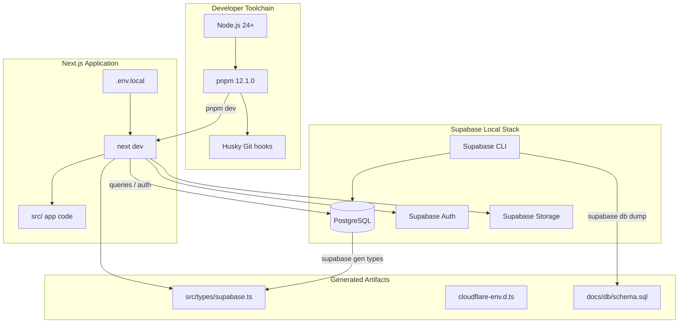
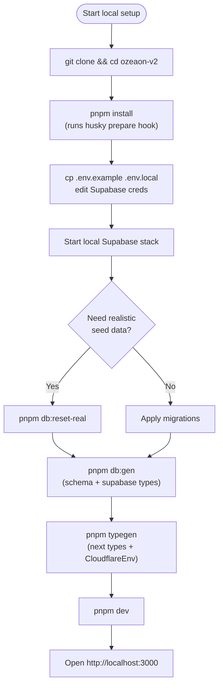
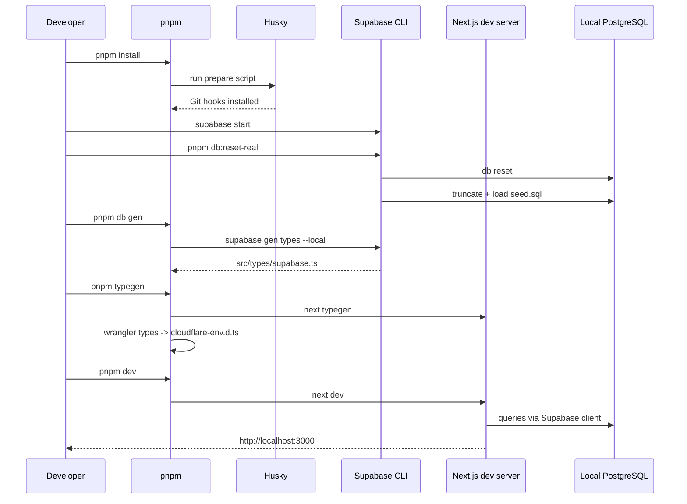

This page documents how to prepare a local development environment for the OZEAON V2 platform: the required toolchain, dependency installation, environment variable configuration, database bootstrapping, and the npm scripts used for day-to-day local work.

## Purpose and Scope

This page covers everything needed to get OZEAON V2 running on a developer machine:

- Toolchain prerequisites (Node.js, pnpm, Supabase)
- Dependency installation and workspace layout
- Environment file configuration (`.env.local`) and each variable's role
- Type and schema generation (`typegen`, `db:gen`)
- Local Supabase database lifecycle (reset, seed, seed dump)
- The developer command surface defined in `package.json`
- Common startup, formatting, linting, and type-checking workflows

**Intentionally left to sibling pages:**

- Production and staging deployment (Cloudflare Workers / OpenNext) — see the deployment documentation, since `ci:build`, `ci:deploy`, and `preview` scripts belong to the deployment pipeline rather than local setup.
- Database schema design and table relationships — see the data model / database documentation; this page only covers the *commands* that generate schema artifacts and TypeScript types locally.
- Development workflow conventions (branching, PRs, review process) — see the workflows documentation referenced from the README.
- SSR, authentication, caching, and rendering architecture — see the respective `docs/ssr/*` and design-system documentation.

## Overview

OZEAON V2 is a full-stack web application built on **Next.js 16 (React 19)** with **Supabase** (PostgreSQL + Auth + Storage) as the backend, styled with **Tailwind CSS 4** and Radix UI, and deployed to **Cloudflare Workers** at the edge.

Local development therefore requires three cooperating pieces:

1. **A Node.js/pnpm toolchain** to install and run the Next.js dev server.
2. **A Supabase instance** — either a local Supabase stack or a hosted project — to provide the PostgreSQL database, authentication, and storage services the application queries at runtime.
3. **Environment configuration** connecting the Next.js process to that Supabase instance and declaring the site base URL.

The `package.json` scripts are the single source of truth for how these pieces are wired together locally. They split into four functional groups:

| Group | Scripts | Purpose |
|-------|---------|---------|
| Development | `dev`, `start` | Run the Next.js dev server / production server |
| Quality gates | `lint`, `lint:fix`, `format`, `format:check`, `check` | ESLint, Prettier, and TypeScript type checking |
| Type generation | `typegen`, `db:types`, `db:schema`, `db:gen` | Generate Next.js route types, Wrangler `CloudflareEnv` types, Supabase database types, and schema artifacts |
| Database lifecycle | `db:seed-dump`, `db:reset-real` | Dump seed data and reset the local Supabase database with deterministic seed content |
| Maintenance | `clean-cache`, `prepare` | Clear build caches; install Husky Git hooks |

## Architecture

The local development environment has four interacting layers: the developer's shell/toolchain, the Next.js application process, the Supabase local stack, and the generated type/schema artifacts that keep the application type-safe against the database.



**Why this shape:** the Next.js server never talks to Supabase directly through custom SQL plumbing — it consumes generated TypeScript types (`src/types/supabase.ts`) produced from the live local schema. This means the *first* thing a new developer must do after configuring the environment is run `pnpm typegen`, because both the Next.js route types and the Cloudflare environment interface are missing until generation runs.

## Prerequisites

The README specifies the exact tooling baseline. Pinning these versions matters because `package.json` declares both a `packageManager` and a `devEngines.runtime` constraint.

| Requirement | Version | Notes |
|-------------|---------|-------|
| Node.js | 24+ | `devEngines.runtime` declares `node@24.20.0` with `onFail: "download"` |
| pnpm | 11.9.0 / 12.1.0 | README installs `pnpm@11.9.0`; `package.json` declares `packageManager: pnpm@12.1.0` |
| Supabase account | — | Required for a hosted project; a local stack can be used instead |

> Note: the README's Quick Start instructs `npm install -g pnpm@11.9.0`, while `package.json` pins `"packageManager": "pnpm@12.1.0"`. When Corepack/`pnpm` respects the `packageManager` field, the pinned 12.1.0 will be used. Developers should be aware of this discrepancy.

## Installation

The README's Quick Start defines the canonical five-step bootstrap sequence.

```bash
# 1️⃣ Clone the repository
git clone https://github.com/your-org/ozeaon-v2.git
cd ozeaon-v2

# 2️⃣ Install dependencies
pnpm install

# 3️⃣ Set up environment variables
cp .env.example .env.local
# Edit .env.local with your Supabase credentials

# 4️⃣ Generate types
pnpm typegen

# 5️⃣ Start development server
pnpm dev
```

> Source: [README.md](https://github.com/ozeaon/ozeaon-v2/blob/0a4f1a95824db87782f1221a4108019d174df3d9/README.md#L193-L210)

Step 4 (`pnpm typegen`) is not optional. It is defined as a chained script:

```json
"typegen": "next typegen && wrangler types --env-interface CloudflareEnv cloudflare-env.d.ts"
```

> Source: [package.json](https://github.com/ozeaon/ozeaon-v2/blob/0a4f1a95824db87782f1221a4108019d174df3d9/package.json#L18)

This command performs two generations in sequence:

1. `next typegen` — generates Next.js framework types (route/segment types used by the App Router).
2. `wrangler types --env-interface CloudflareEnv cloudflare-env.d.ts` — introspects the Wrangler configuration and emits a `CloudflareEnv` interface, matching the runtime binding shape used when the app executes on Cloudflare Workers.

The `&&` chaining is significant: if `next typegen` fails, the Wrangler types are never generated, and the application will fail type-checking wherever `CloudflareEnv` bindings are referenced.

`pnpm install` also triggers the `prepare` script, which installs Husky Git hooks:

```json
"prepare": "husky"
```

> Source: [package.json](https://github.com/ozeaon/ozeaon-v2/blob/0a4f1a95824db87782f1221a4108019d174df3d9/package.json#L15)

Because `prepare` runs automatically after install, a fresh clone immediately gets the pre-commit formatting hooks described in the README's Development Tools section.

## Environment Configuration

Local configuration lives in `.env.local`, created by copying `.env.example`. The README documents the required and optional variables.

```env
# Required
NEXT_PUBLIC_BASE_URL=http://localhost:3000
NEXT_PUBLIC_SUPABASE_URL=https://your-project.supabase.co
NEXT_PUBLIC_SUPABASE_PUBLISHABLE_KEY=your-anon-key

# Required for edge env server components, set up using workflow on deployment
SITE_URL=http://localhost:3000

# Optional - Supabase Service Role Key (server-side only)
SUPABASE_SERVICE_ROLE_KEY=your-service-role-key

# Optional - Google OAuth
NEXT_PUBLIC_GOOGLE_CLIENT_ID=your-client-id
SUPABASE_AUTH_EXTERNAL_GOOGLE_CLIENT_SECRET=your-secret
```

> Source: [README.md](https://github.com/ozeaon/ozeaon-v2/blob/0a4f1a95824db87782f1221a4108019d174df3d9/README.md#L218-L233)

### Environment Variable Reference

| Variable | Required | `NEXT_PUBLIC_` exposed | Purpose |
|----------|----------|------------------------|---------|
| `NEXT_PUBLIC_BASE_URL` | Yes | Yes (client bundle) | Canonical base URL of the app; `http://localhost:3000` locally |
| `NEXT_PUBLIC_SUPABASE_URL` | Yes | Yes (client bundle) | Supabase project URL used by the browser and server clients |
| `NEXT_PUBLIC_SUPABASE_PUBLISHABLE_KEY` | Yes | Yes (client bundle) | Publishable/anon key; safe to ship to the browser, constrained by Row Level Security |
| `SITE_URL` | Yes | No | Base URL required for edge-environment server components; in deployment this is wired "using workflow on deployment" |
| `SUPABASE_SERVICE_ROLE_KEY` | Optional | No | Server-only privileged key that bypasses Row Level Security — must never be exposed to the client |
| `NEXT_PUBLIC_GOOGLE_CLIENT_ID` | Optional | Yes (client bundle) | Google OAuth client ID for the Google sign-in flow |
| `SUPABASE_AUTH_EXTERNAL_GOOGLE_CLIENT_SECRET` | Optional | No | Secret paired with the Google client ID for the external Supabase auth provider |

**Design intent behind the split:** variables prefixed `NEXT_PUBLIC_` are inlined into the client JavaScript bundle by Next.js and are therefore public by definition. Consequently only the *publishable* Supabase key uses that prefix. The `SUPABASE_SERVICE_ROLE_KEY` deliberately omits the prefix so it can only be read in server contexts — an intentional guardrail, since a leaked service-role key would defeat every Row Level Security policy in the database.

`SITE_URL` is separated from `NEXT_PUBLIC_BASE_URL` because server components running in the edge environment need an absolute origin, while the public base URL is used for client-visible links. The README notes that in deployment `SITE_URL` is provisioned by the deployment workflow rather than committed.

## Database Lifecycle and Type Generation

Because the application is typed against the real database schema, the local database and the generated types must stay in sync. The scripts split this responsibility into four commands.

```json
"db:schema": "node scripts/schema/generate.mjs",
"db:types": "supabase gen types typescript --local > src/types/supabase.ts && prettier --write src/types/supabase.ts",
"db:gen": "pnpm db:schema && pnpm db:types",
"db:seed-dump": "supabase db dump --data-only -f supabase/seed.sql",
"db:reset-real": "supabase db reset && DB_URL=$(supabase status --output json | jq -er '.DB_URL') && psql \"$DB_URL\" -v ON_ERROR_STOP=1 -f supabase/seeds/00-truncate.sql -f supabase/seed.sql"
```

> Source: [package.json](https://github.com/ozeaon/ozeaon-v2/blob/0a4f1a95824db87782f1221a4108019d174df3d9/package.json#L23-L27)

### Command-by-Command Analysis

| Script | Command chain | What it does |
|--------|---------------|--------------|
| `db:schema` | `node scripts/schema/generate.mjs` | Runs a repository-local Node script that produces schema artifacts (the documented output target being `docs/db/schema.sql`). |
| `db:types` | `supabase gen types typescript --local > src/types/supabase.ts && prettier --write src/types/supabase.ts` | Introspects the **local** Supabase database and writes TypeScript types, then reformats them with Prettier so generated output stays consistent with formatted source. |
| `db:gen` | `pnpm db:schema && pnpm db:types` | Convenience aggregator: schema artifacts and TypeScript types are regenerated together. This is the command to run after any migration. |
| `db:seed-dump` | `supabase db dump --data-only -f supabase/seed.sql` | Exports **data only** (no DDL) from the current local database into `supabase/seed.sql`, capturing a real dataset as the reusable seed. |
| `db:reset-real` | `supabase db reset && DB_URL=$(supabase status --output json \| jq -er '.DB_URL') && psql "$DB_URL" ...` | Resets the local database, extracts the connection URL from `supabase status`, then truncates and re-loads it with the dumped seed. |

**Why `db:types` pipes through Prettier:** `supabase gen types` emits machine-formatted TypeScript. Running `prettier --write` immediately afterwards guarantees generated types satisfy the repo's `format:check` gate, so generated code does not break CI formatting checks.

**Why `db:reset-real` uses `jq -er`:** the `-e` flag makes `jq` exit non-zero when the extracted value is null or false, and `-r` emits a raw string. Combined with `&&` chaining, this means that if `supabase status` cannot produce a `DB_URL`, the whole command fails loudly instead of running `psql` against an empty or incorrect connection string. The `-v ON_ERROR_STOP=1` flag passed to `psql` similarly aborts on the first SQL error.

**Ordering is intentional in `db:reset-real`:** the truncation script runs *before* the seed load, so re-running the command is idempotent — the database is emptied then repopulated rather than accumulating duplicate rows.



## Core Flow: From Fresh Clone to Running App

The following sequence shows the exact order of operations a developer performs, and which component each step touches.



Each step is ordered by dependency: hooks require `node_modules`; type generation requires a running database; the dev server requires generated types to type-check. Skipping an intermediate step produces type errors rather than runtime failures, which is why the README places `typegen` before `dev`.

## Developer Command Surface

The following table enumerates every script declared in `package.json`, grouped by purpose. These are the commands a developer runs locally.

### Application Scripts

| Command | Script definition | Description |
|---------|-------------------|-------------|
| `pnpm dev` | `next dev` | Starts the Next.js development server (Turbopack is used per the README's Development Tools list). |
| `pnpm build` | `next build` | Produces a production build. |
| `pnpm start` | `next start` | Serves an existing production build. |

> Source: [package.json](https://github.com/ozeaon/ozeaon-v2/blob/0a4f1a95824db87782f1221a4108019d174df3d9/package.json#L9-L19)

### Quality Gate Scripts

| Command | Script definition | Description |
|---------|-------------------|-------------|
| `pnpm lint` | `eslint .` | Runs ESLint across the repository. |
| `pnpm lint:fix` | `eslint . --fix` | Runs ESLint and applies automatic fixes. |
| `pnpm format` | `prettier -w -c src` | Formats files under `src`. |
| `pnpm format:check` | `prettier -c src` | Check-only Prettier run, suitable for CI. |
| `pnpm check` | `tsc --noEmit` | TypeScript type checking with no emitted output. |

> Source: [package.json](https://github.com/ozeaon/ozeaon-v2/blob/0a4f1a95824db87782f1221a4108019d174df3d9/package.json#L10-L16)

Note the asymmetry between `format` and `format:check`: both pass `-c` (check) but `format` additionally passes `-w` (write). Both are scoped to `src`, meaning formatting rules deliberately do not cover repository-root configuration files.

### Maintenance Scripts

| Command | Script definition | Description |
|---------|-------------------|-------------|
| `pnpm clean-cache` | `rm -rf .next .turbo node_modules/.cache .open-next .wrangler` | Removes Next.js, Turbopack, Node, OpenNext, and Wrangler build caches. |
| `pnpm prepare` | `husky` | Installs Husky Git hooks; invoked automatically after `pnpm install`. |
| `pnpm typegen` | `next typegen && wrangler types --env-interface CloudflareEnv cloudflare-env.d.ts` | Generates Next.js types plus the `CloudflareEnv` binding interface. |
| `pnpm db:gen` | `pnpm db:schema && pnpm db:types` | Regenerates database schema artifacts and Supabase TypeScript types. |
| `pnpm db:seed-dump` | `supabase db dump --data-only -f supabase/seed.sql` | Dumps data-only seed from the local database. |
| `pnpm db:reset-real` | `supabase db reset && ... psql ...` | Resets the local DB and reloads the truncate + seed scripts. |

> Source: [package.json](https://github.com/ozeaon/ozeaon-v2/blob/0a4f1a95824db87782f1221a4108019d174df3d9/package.json#L17-L27)

**Why `clean-cache` exists:** the list of removed directories (`.next`, `.turbo`, `node_modules/.cache`, `.open-next`, `.wrangler`) shows the project accumulates *five distinct* caches across two build systems (Next.js/Turbopack and OpenNext/Wrangler). When local builds behave inconsistently, this command is the recovery step. The presence of `.open-next` and `.wrangler` in a developer-facing cleanup script reflects the fact that the Cloudflare/edge toolchain is part of local work, not just deployment.

## Toolchain and Dependency Notes

### Package Manager and Runtime Pinning

```json
"packageManager": "pnpm@12.1.0",
"devEngines": {
  "runtime": {
    "name": "node",
    "version": "24.20.0",
    "onFail": "download"
  }
}
```

> Source: [package.json](https://github.com/ozeaon/ozeaon-v2/blob/0a4f1a95824db87782f1221a4108019d174df3d9/package.json#L124-L131)

The `devEngines.runtime` block with `"onFail": "download"` instructs the package manager to download the required Node.js runtime if the active one does not satisfy `24.20.0`. This removes "works on my version of Node" drift: a contributor with an older Node receives an automatic download attempt rather than a confusing build failure.

### TypeScript Distribution

```json
"@typescript/native": "npm:typescript@^7.0.2",
"typescript": "npm:@typescript/typescript6@^6.0.2",
"@types/node": "26.5.0"
```

> Source: [package.json](https://github.com/ozeaon/ozeaon-v2/blob/0a4f1a95824db87782f1221a4108019d174df3d9/package.json#L100-L104)

`typescript` resolves through the `@typescript/typescript6` package rather than the classic `typescript` package, and `@typescript/native` aliases `typescript@^7`. This means the local type-checking (`pnpm check` → `tsc --noEmit`) runs against a pinned, non-default TypeScript 6 distribution. Contributors seeing unexpected type errors should verify which TypeScript distribution is resolving in their `node_modules`.

### Selected Runtime Dependencies Relevant to Local Setup

| Dependency | Version | Role in local development |
|------------|---------|---------------------------|
| `next` | `16.3.5` | Application framework and dev server |
| `react` / `react-dom` | `^19.3.0` | UI runtime |
| `@supabase/supabase-js` | `^2.116.0` | Browser/server Supabase client |
| `@supabase/ssr` | `^0.12.7` | Server-side Supabase client for SSR cookie handling |
| `supabase` | `^2.117.0` | Supabase CLI used by `db:*` scripts |
| `wrangler` | `^4.131.1` | Cloudflare CLI used by `typegen` / `preview` |
| `@opennextjs/cloudflare` | `^1.20.6` | OpenNext adapter used by `preview` / `ci:*` |
| `tsx` | `^4.23.13` | Type-safe script execution used for `scripts/schema/generate.mjs` tooling |
| `dotenv` | `^17.4.2` | Environment loading for standalone scripts |
| `husky` | `^9.1.7` | Git hooks installed via `prepare` |
| `prettier` | `^3.9.6` | Formatting invoked by `format*` and by `db:types` |
| `tailwindcss` | `^4.3.3` | Styling; `@tailwindcss/postcss` drives the PostCSS pipeline |

> Source: [package.json](https://github.com/ozeaon/ozeaon-v2/blob/0a4f1a95824db87782f1221a4108019d174df3d9/package.json#L37-L122)

### External CLI Requirements

`db:reset-real` depends on two binaries beyond the project's own dependencies:

- **`jq`** — used as `jq -er '.DB_URL'` to parse `supabase status --output json`.
- **`psql`** — the PostgreSQL client used to execute the truncate and seed SQL files.

Both must be installed on the developer's machine; neither is an npm dependency. This is an implicit prerequisite that the scripts make hard to miss — the command fails at the `jq` stage if `jq` is absent.

## Usage Examples

### Example 1: Full Bootstrap from a Fresh Clone

The canonical sequence combining installation, environment setup, type generation, and server start.

```bash
# 1️⃣ Clone the repository
git clone https://github.com/your-org/ozeaon-v2.git
cd ozeaon-v2

# 2️⃣ Install dependencies
pnpm install

# 3️⃣ Set up environment variables
cp .env.example .env.local
# Edit .env.local with your Supabase credentials

# 4️⃣ Generate types
pnpm typegen

# 5️⃣ Start development server
pnpm dev
```

> Source: [README.md](https://github.com/ozeaon/ozeaon-v2/blob/0a4f1a95824db87782f1221a4108019d174df3d9/README.md#L193-L210)

### Example 2: Resetting the Local Database with Realistic Seed Data

Run this after schema changes or whenever the local data has drifted. It resets the database, then atomically truncates and reloads the seed.

```json
"db:seed-dump": "supabase db dump --data-only -f supabase/seed.sql",
"db:reset-real": "supabase db reset && DB_URL=$(supabase status --output json | jq -er '.DB_URL') && psql \"$DB_URL\" -v ON_ERROR_STOP=1 -f supabase/seeds/00-truncate.sql -f supabase/seed.sql"
```

> Source: [package.json](https://github.com/ozeaon/ozeaon-v2/blob/0a4f1a95824db87782f1221a4108019d174df3d9/package.json#L26-L27)

Executing it:

```bash
# Rebuild the local DB from migrations, then load the archived seed dataset
pnpm db:reset-real

# After capturing new data you want to preserve as the shared seed:
pnpm db:seed-dump
```

### Example 3: Regenerating Types After a Migration

Any time the local database schema changes, both the schema artifacts and the TypeScript types must be regenerated before `pnpm check` will pass.

```bash
# Regenerate schema artifacts AND Supabase TypeScript types in one step
pnpm db:gen

# Separately regenerate Next.js route types + the CloudflareEnv binding interface
pnpm typegen

# Verify everything type-checks
pnpm check
```

> Sources:
> - [package.json](https://github.com/ozeaon/ozeaon-v2/blob/0a4f1a95824db87782f1221a4108019d174df3d9/package.json#L18)
> - [package.json](https://github.com/ozeaon/ozeaon-v2/blob/0a4f1a95824db87782f1221a4108019d174df3d9/package.json#L25)

### Example 4: Pre-Commit Quality Gates

Husky hooks are installed automatically by `prepare`, but the same gates can — and should — be run manually before pushing.

```bash
pnpm lint          # ESLint over the whole repo
pnpm format:check  # Prettier check on src/ (CI-compatible)
pnpm check         # tsc --noEmit type check
```

> Source: [package.json](https://github.com/ozeaon/ozeaon-v2/blob/0a4f1a95824db87782f1221a4108019d174df3d9/package.json#L10-L16)

### Example 5: Recovering from a Corrupted Local Build

When the dev server or edge preview behaves inexplicably, all caches can be cleared with a single command.

```bash
pnpm clean-cache   # rm -rf .next .turbo node_modules/.cache .open-next .wrangler
```

> Source: [package.json](https://github.com/ozeaon/ozeaon-v2/blob/0a4f1a95824db87782f1221a4108019d174df3d9/package.json#L17)

## Configuration Options

### Environment Variables

| Option | Type | Default (local) | Description |
|--------|------|-----------------|-------------|
| `NEXT_PUBLIC_BASE_URL` | string (URL) | `http://localhost:3000` | Required. Public base URL inlined into the client bundle. |
| `NEXT_PUBLIC_SUPABASE_URL` | string (URL) | `https://your-project.supabase.co` | Required. Supabase project endpoint for browser and server clients. |
| `NEXT_PUBLIC_SUPABASE_PUBLISHABLE_KEY` | string | `your-anon-key` | Required. Publishable/anon key, protected by Row Level Security. |
| `SITE_URL` | string (URL) | `http://localhost:3000` | Required for edge-environment server components; supplied by the deployment workflow in hosted environments. |
| `SUPABASE_SERVICE_ROLE_KEY` | string | *(unset)* | Optional, **server-side only**. Privileged key that bypasses RLS. |
| `NEXT_PUBLIC_GOOGLE_CLIENT_ID` | string | *(unset)* | Optional. Enables Google OAuth sign-in. |
| `SUPABASE_AUTH_EXTERNAL_GOOGLE_CLIENT_SECRET` | string | *(unset)* | Optional, server-side. Secret for the external Google auth provider. |

> Source: [README.md](https://github.com/ozeaon/ozeaon-v2/blob/0a4f1a95824db87782f1221a4108019d174df3d9/README.md#L218-L233)

### Package Manager and Runtime Constraints

| Option | Type | Value | Description |
|--------|------|-------|-------------|
| `packageManager` | string | `pnpm@12.1.0` | Pins the pnpm version for Corepack-managed installs. |
| `devEngines.runtime.name` | string | `node` | Declares the required runtime. |
| `devEngines.runtime.version` | string | `24.20.0` | Exact Node.js version expected. |
| `devEngines.runtime.onFail` | string | `download` | Instructs an automatic runtime download instead of failing. |
| `devEngines.runtime` (README) | string | `Node.js 24+` | The README's documented minimum. |

> Sources:
> - [package.json](https://github.com/ozeaon/ozeaon-v2/blob/0a4f1a95824db87782f1221a4108019d174df3d9/package.json#L124-L131)
> - [README.md](https://github.com/ozeaon/ozeaon-v2/blob/0a4f1a95824db87782f1221a4108019d174df3d9/README.md#L187-L189)

## Failure Modes and Edge Cases

The following failure modes are directly inferable from the script definitions and documentation.

| Failure | Root cause | Symptom | Recovery |
|---------|-----------|---------|----------|
| Missing `cloudflare-env.d.ts` | `pnpm typegen` was never run | Type errors on `CloudflareEnv` bindings | Run `pnpm typegen` |
| Stale Supabase types | Schema changed without `db:gen` | `pnpm check` fails against new/changed columns | Run `pnpm db:types` or `pnpm db:gen` |
| `jq` not installed | `db:reset-real` shells out to `jq` | Script aborts before `psql` runs | Install `jq` |
| `psql` not installed | `db:reset-real` shells out to `psql` | Script aborts at the seed-load stage | Install the PostgreSQL client |
| Formatting check fails on generated types | `supabase gen types` output not formatted | `pnpm format:check` fails | `db:types` already pipes through `prettier --write`; rerun it |
| Local Supabase not running | `supabase gen types --local` targets a live local instance | Type generation fails or returns nothing | Start the local Supabase stack first |
| Inconsistent builds | Stale Next.js/Turbopack/OpenNext/Wrangler caches | Unexplained build or dev-server behavior | `pnpm clean-cache` |
| Version mismatch confusion | README says `pnpm@11.9.0`; `package.json` pins `12.1.0` | Unexpected pnpm behavior | Follow `packageManager` in `package.json` |

**Ordering hazard:** `db:reset-real` chains with `&&`, so any failure in `supabase db reset`, the `jq` parse, or `psql` stops the entire pipeline. This is deliberate fail-fast behavior — partial resets are prevented rather than silently tolerated. Similarly, `-v ON_ERROR_STOP=1` ensures the seed SQL is applied transactionally rather than with errors ignored.

**Secret-handling hazard:** `SUPABASE_SERVICE_ROLE_KEY` is documented as "server-side only" and lacks the `NEXT_PUBLIC_` prefix. Accidentally adding that prefix would inline a privilege-escalating key into the client bundle. Any `.env.local` containing this key must remain git-ignored.

## Performance and Operational Notes

- **Turbopack** is listed in the README's Development Tools as the dev-build engine ("Ultra-fast development builds"), used by `next dev`. The `.turbo` directory targeted by `clean-cache` confirms Turbopack cache usage locally.
- **Type generation cost** is paid twice: `pnpm typegen` runs both `next typegen` and `wrangler types`. Because these are independent generators covering different surfaces (framework route types vs. runtime binding interface), they cannot be collapsed into a single command without losing coverage.
- **Seeding is destructive.** `db:reset-real` begins with `supabase db reset` and an explicit truncate script, so any local-only data is discarded. Capture work-in-progress data with `pnpm db:seed-dump` before resetting if it should be preserved — but note that this overwrites `supabase/seed.sql`, the shared seed artifact.
- **Cache isolation:** `clean-cache` enumerates caches explicitly rather than deleting `node_modules`, making it fast and safe for repeated use during debugging without a full reinstall.

## Extension Points

| Extension | How to do it |
|-----------|--------------|
| Add an environment variable | Add it to `.env.example`, document it in the README's Environment Configuration block, and prefix with `NEXT_PUBLIC_` only if it is genuinely safe to expose to browsers. |
| Add a schema-generation output | Modify `scripts/schema/generate.mjs`, which is invoked by `db:schema` and therefore also by `db:gen`. |
| Change seed content | Edit `supabase/seed.sql` directly, or regenerate it from live data with `pnpm db:seed-dump`. The truncate step lives in `supabase/seeds/00-truncate.sql`. |
| Add a quality gate | Add a script to `package.json` alongside `lint` / `format:check` / `check`, and reference it from the Husky hook. |
| Adjust lint behavior | The repository ships modular ESLint rule files at the root (`eslint.config.mjs` plus `eslint.rules.auth.mjs`, `eslint.rules.base.mjs`, `eslint.rules.cache.mjs`, `eslint.rules.import.mjs`, `eslint.rules.logging.mjs`), so rule categories can be extended per concern. |

## Related Links

- [Repository README — Quick Start and Environment Configuration](https://github.com/ozeaon/ozeaon-v2/blob/0a4f1a95824db87782f1221a4108019d174df3d9/README.md#L183-L233)
- [package.json — all developer scripts](https://github.com/ozeaon/ozeaon-v2/blob/0a4f1a95824db87782f1221a4108019d174df3d9/package.json#L8-L28)
- [Local Supabase setup guide](https://github.com/ozeaon/ozeaon-v2/blob/0a4f1a95824db87782f1221a4108019d174df3d9/docs/supabase-local.md)
- [Development workflow guide](https://github.com/ozeaon/ozeaon-v2/blob/0a4f1a95824db87782f1221a4108019d174df3d9/docs/workflows.md)
- [Deployment guide](https://github.com/ozeaon/ozeaon-v2/blob/0a4f1a95824db87782f1221a4108019d174df3d9/docs/ops-deployment.md)
- [Deployment previews](https://github.com/ozeaon/ozeaon-v2/blob/0a4f1a95824db87782f1221a4108019d174df3d9/docs/deployment-previews.md)
- [Database schema reference](https://github.com/ozeaon/ozeaon-v2/blob/0a4f1a95824db87782f1221a4108019d174df3d9/docs/db/schema.sql)
- [R2 storage notes](https://github.com/ozeaon/ozeaon-v2/blob/0a4f1a95824db87782f1221a4108019d174df3d9/docs/r2-storage.md)
- [Logging conventions](https://github.com/ozeaon/ozeaon-v2/blob/0a4f1a95824db87782f1221a4108019d174df3d9/docs/logging-conventions.md)
- [SSR architecture docs](https://github.com/ozeaon/ozeaon-v2/blob/0a4f1a95824db87782f1221a4108019d174df3d9/docs/ssr/auth-session-refactor.md)
- [Project contributor guidance (CLAUDE.md)](https://github.com/ozeaon/ozeaon-v2/blob/0a4f1a95824db87782f1221a4108019d174df3d9/CLAUDE.md)
