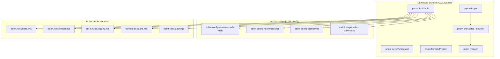
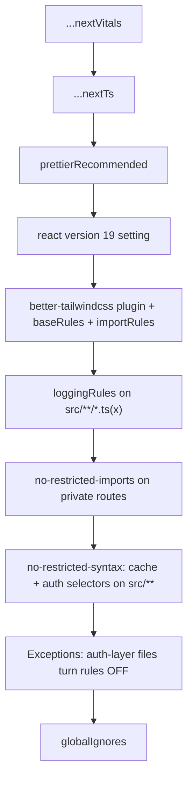
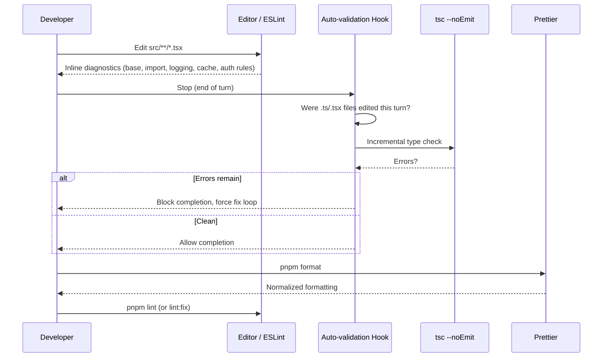

This page documents the developer workflow commands, ESLint configuration architecture, Prettier integration, and code-quality guardrails that govern daily work in OZEAON V2.

## Purpose and Scope

This page covers the **developer-facing toolchain**: the command set defined in [`CLAUDE.md`](https://github.com/ozeaon/ozeaon-v2/blob/0a4f1a95824db87782f1221a4108019d174df3d9/CLAUDE.md), the layered ESLint configuration in [`eslint.config.mjs`](https://github.com/ozeaon/ozeaon-v2/blob/0a4f1a95824db87782f1221a4108019d174df3d9/eslint.config.mjs), the per-domain rule modules it composes, and the TypeScript/formatting conventions that keep the codebase consistent.

It intentionally stays on the **local development and static-analysis** boundary. Related topics are covered by sibling pages:

- For CI/CD pipelines, Cloudflare build/deploy jobs, and preview deployments, see the deployment documentation (referenced from [`docs/ops-deployment.md`](https://github.com/ozeaon/ozeaon-v2/blob/0a4f1a95824db87782f1221a4108019d174df3d9/docs/ops-deployment.md) and [`docs/deployment-previews.md`](https://github.com/ozeaon/ozeaon-v2/blob/0a4f1a95824db87782f1221a4108019d174df3d9/docs/deployment-previews.md)).
- For the rendering/caching model that several lint rules enforce, see the SSR docs ([`docs/ssr/rendering-rules-today.md`](https://github.com/ozeaon/ozeaon-v2/blob/0a4f1a95824db87782f1221a4108019d174df3d9/docs/ssr/rendering-rules-today.md), [`docs/ssr/cache-components-model.md`](https://github.com/ozeaon/ozeaon-v2/blob/0a4f1a95824db87782f1221a4108019d174df3d9/docs/ssr/cache-components-model.md)).
- For structured logging conventions enforced by the logging lint module, see [`docs/logging-conventions.md`](https://github.com/ozeaon/ozeaon-v2/blob/0a4f1a95824db87782f1221a4108019d174df3d9/docs/logging-conventions.md).
- For Supabase client usage patterns (which the auth lint selectors protect), see the Supabase-related pages.

## Overview

OZEAON V2 is a Next.js App Router / TypeScript / Tailwind / Supabase project managed with **pnpm only**. Because the runtime relies on subtle framework semantics — React Server Components, dynamic rendering triggered by `cookies()`, React `cache()` memoization, and RLS-scoped Supabase clients — the project treats **lint rules as executable architecture documentation**. Instead of relying on prose alone, narrow ESLint selectors forbid the specific code shapes that would silently break SSR, auth isolation, or caching.

The quality strategy has three pillars:

1. **A single command surface** (`pnpm lint`, `pnpm check`, `pnpm format`, plus a hook-driven `tsc`) so contributors never guess the right tool invocation.
2. **A composable, flat ESLint config** that layers Next.js presets, Prettier compatibility, Tailwind correctness, and project-specific restriction modules.
3. **Framework-aware restriction rules** written as `no-restricted-syntax` selectors and `no-restricted-imports` paths, each aimed at a concrete architectural invariant (auth reads funnel through one module, private routes cannot use the public Supabase client, caching directives follow the new model).

The design intent is **fail fast at the editor, not at runtime**: a rule violation surfaces the architectural mistake before it can be merged, and the rule modules are named after the subsystem they protect (`auth`, `cache`, `logging`, `import`, `base`).

## Architecture



The diagram shows how the single `pnpm lint` entry point fans out into a composition of presets and project rule modules, while `pnpm check` (type checking) is coupled with code generation commands (`typegen`, `db:gen`) that must run before types are valid.

**Why this shape:** the flat config is an ordered array, so each layer's scope is controlled by `files` globs and ordering. Broad presets come first; project restrictions narrow onto `src/**`; and the final exception block deliberately re-enables rules for the exact files that *are* the auth layer — a design choice that forces all auth reads to funnel through one module rather than letting each call site invent its own bypass.

## Core Configuration: `eslint.config.mjs`

The config uses ESLint's flat-config API via `defineConfig` and `globalIgnores`:

```javascript
import { defineConfig, globalIgnores } from "eslint/config";
import nextVitals from "eslint-config-next/core-web-vitals";
import nextTs from "eslint-config-next/typescript";
import prettierRecommended from "eslint-config-prettier/flat";
import tailwindcss from "eslint-plugin-better-tailwindcss";
import baseRules from "./eslint.rules.base.mjs";
import cacheSelectors from "./eslint.rules.cache.mjs";
import importRules from "./eslint.rules.import.mjs";
import authSelectors from "./eslint.rules.auth.mjs";
import loggingRules from "./eslint.rules.logging.mjs";
```

> Source: [eslint.config.mjs](https://github.com/ozeaon/ozeaon-v2/blob/0a4f1a95824db87782f1221a4108019d174df3d9/eslint.config.mjs#L1-L10)

The imports reveal the composition strategy: two Next.js presets for framework correctness, `eslint-config-prettier/flat` to *disable* stylistic rules that would conflict with Prettier, and five project-authored modules (`base`, `cache`, `import`, `auth`, `logging`) that encode OZEAON-specific invariants.

### Rule Composition Order



Each step in this chain is source-verified below. The order matters because later config objects override earlier ones for overlapping rules — the comment in the config makes this explicit for the syntax selectors.

### Scoping Rules to Source Files

The base and import rules are grouped under the Tailwind plugin config so the plugin is registered once, while the logging rules are applied only to TypeScript sources:

```javascript
{
  plugins: { "better-tailwindcss": tailwindcss },
  rules: {
    ...baseRules,
    ...importRules,
  },
},
{
  files: ["src/**/*.ts", "src/**/*.tsx"],
  rules: {
    ...loggingRules,
  },
},
```

> Source: [eslint.config.mjs](https://github.com/ozeaon/ozeaon-v2/blob/0a4f1a95824db87782f1221a4108019d174df3d9/eslint.config.mjs#L23-L35)

Applying `loggingRules` only to `src/**` keeps console-log bans out of config files, scripts, and the ESLint modules themselves — a targeted scope rather than a global ban.

### Import Restrictions on Private Routes

```javascript
{
  files: ["src/app/**/(private)/**/*.tsx"],
  rules: {
    "no-restricted-imports": [
      "error",
      {
        paths: [
          {
            name: "@/lib/supabase/public",
            message: "Use createClient() in private routes.",
          },
        ],
      },
    ],
  },
},
```

> Source: [eslint.config.mjs](https://github.com/ozeaon/ozeaon-v2/blob/0a4f1a95824db87782f1221a4108019d174df3d9/eslint.config.mjs#L36-L51)

This encodes a concrete SSR/auth invariant: under the `(private)` route group, components must obtain a request-scoped client via `createClient()` (which internally calls `cookies()` and thus signals dynamic rendering) rather than the public client, which would static-render user-specific data. The rule message itself is the remediation instruction — a deliberate pattern where the lint error teaches the fix.

### Funneling Auth Reads Through One Module

```javascript
{
  files: ["src/**/*.ts", "src/**/*.tsx"],
  rules: {
    "no-restricted-syntax": ["error", ...cacheSelectors, ...authSelectors],
  },
},
{
  // Must stay after the block above: this is the auth layer those selectors
  // funnel everything else into. Anywhere else needing a one-off exception
  // uses an inline eslint-disable-next-line with a reason, not this list.
  files: [
    "src/lib/supabase/queries/auth.ts",
    "src/lib/supabase/queries/reactions.ts",
    "src/lib/supabase/middleware.ts",
    "src/lib/supabase/actions.ts",
    "src/lib/supabase/auth.ts",
  ],
  rules: {
    "no-restricted-syntax": "off",
    "no-restricted-imports": "off",
  },
},
```

> Source: [eslint.config.mjs](https://github.com/ozeaon/ozeaon-v2/blob/0a4f1a95824db87782f1221a4108019d174df3d9/eslint.config.mjs#L52-L73)

This is the most architecturally significant part of the config. The syntax selectors (cache + auth) apply to **all** `src/**` TypeScript, but the five files listed above are the auth/cache layer the selectors funnel everything toward — so the rules are switched off there. The inline comment states the override policy precisely: this list is not a general escape hatch; one-off exceptions must use `eslint-disable-next-line` **with a reason**. The constraint that this block "must stay after the block above" is a real ordering dependency in flat config, because a later object's `rules` replaces the earlier value for the same rule key.

### Global Ignores

```javascript
globalIgnores([
  ".claude/**",
  ".next/**",
  "out/**",
  "build/**",
  "dist/**",
  "node_modules/**",
  ".turbo/**",
  ".cache/**",
  ".open-next/**",
  ".wrangler/**",
  "*.d.ts",
  "supabase/functions/*",
  "supabase/.branches/*",
  "supabase/.temp/*",
  "supabase/.snippets/*",
]),
```

> Source: [eslint.config.mjs](https://github.com/ozeaon/ozeaon-v2/blob/0a4f1a95824db87782f1221a4108019d174df3d9/eslint.config.mjs#L74-L90)

The ignore list mirrors the project's build and infrastructure surface: Next.js output (`.next`, `out`), Cloudflare adapter output (`.open-next`, `.wrangler`), Turbopack/PNPM caches (`.turbo`, `.cache`), generated declaration files (`*.d.ts`), and tool-managed Supabase directories. Ignoring `.wrangler/**` and `.open-next/**` prevents linting generated Cloudflare Worker bundles, and ignoring `*.d.ts` avoids linting generated route/env types.

## Project Rule Modules

`eslint.config.mjs` composes five project-authored modules. Their naming is intentional: each module is scoped to one architectural concern.

| Module | Composed As | Consumer Rule | Protection Goal |
|--------|-------------|---------------|-----------------|
| `eslint.rules.base.mjs` | `baseRules` spread into `rules` | `@typescript-eslint/*`, core rules | Baseline TypeScript strictness and unused-var handling |
| `eslint.rules.import.mjs` | `importRules` spread into `rules` | `no-restricted-imports` (project set) | Enforce import conventions / barrel usage |
| `eslint.rules.logging.mjs` | `loggingRules`, scoped to `src/**` | console-usage restrictions | Ban `console.*`; force LogTape helpers |
| `eslint.rules.cache.mjs` | `cacheSelectors` in `no-restricted-syntax` | selector objects | Enforce the new rendering/caching model |
| `eslint.rules.auth.mjs` | `authSelectors` in `no-restricted-syntax` | selector objects | Funnel auth reads through the auth module |

Both `eslint.rules.cache.mjs` and `eslint.rules.auth.mjs` document the same composition contract in their headers — they export **selector objects, not a rules object**, because `no-restricted-syntax` can only be configured once:

```javascript
 * Composed with the other selector sets in `eslint.config.mjs` — a rule can
 * only be configured once, so these must not be spread as a rules object.
```

> Source: [eslint.rules.auth.mjs](https://github.com/ozeaon/ozeaon-v2/blob/0a4f1a95824db87782f1221a4108019d174df3d9/eslint.rules.auth.mjs#L2-L4)

This is a genuine constraint of flat config rather than a stylistic choice: spreading two modules as rules objects would have the second silently overwrite the first's `no-restricted-syntax` value. By exporting **arrays of selectors** and concatenating them (`["error", ...cacheSelectors, ...authSelectors]`), both rule sets coexist under a single rule configuration.

### Base Rules: TypeScript Strictness

The base module configures TypeScript-aware variants of core rules and disables the ones the TypeScript version supersedes:

```javascript
  "no-unused-vars": "off", // "off" because we use the typescript version below
  "@typescript-eslint/no-unused-vars": [
    "error",
```

> Source: [eslint.rules.base.mjs](https://github.com/ozeaon/ozeaon-v2/blob/0a4f1a95824db87782f1221a4108019d174df3d9/eslint.rules.base.mjs#L24-L26)

```javascript
  "@typescript-eslint/no-empty-object-type": "off",
  "@typescript-eslint/no-explicit-any": "error",
```

> Source: [eslint.rules.base.mjs](https://github.com/ozeaon/ozeaon-v2/blob/0a4f1a95824db87782f1221a4108019d174df3d9/eslint.rules.base.mjs#L29-L30)

**Design intent:** the project permits empty object types (commonly needed in generic constraint patterns and placeholder prop types) but bans `any` outright. This aligns with the TypeScript guidance in [`CLAUDE.md`](https://github.com/ozeaon/ozeaon-v2/blob/0a4f1a95824db87782f1221a4108019d174df3d9/CLAUDE.md) that field names must match exactly between Zod schemas, DB types, and props — `any` would erase the type information that makes those mismatches detectable.

### Logging Rules: No Console

`loggingRules` bans the entire `console` family in `src/**`:

> Structured logging via [LogTape](https://logtape.org/). Console logging (`console.log`/`error`/`warn`/`debug`/`info`) is banned by ESLint (`eslint.rules.logging.mjs`) — every path must go through the helpers documented here.

> Source: [docs/logging-conventions.md](https://github.com/ozeaon/ozeaon-v2/blob/0a4f1a95824db87782f1221a4108019d174df3d9/docs/logging-conventions.md#L1-L3)

**Design intent:** in a Cloudflare Workers deployment target, unstructured `console` output is not queryable. Routing all logging through LogTape helpers means production logs carry structure (levels, categories, fields) that can be filtered in the Workers log pipeline. The lint rule is the enforcement mechanism that keeps developers from reintroducing ad-hoc logging under deadline pressure.

## TypeScript & Auto-Validation Workflow

Beyond ESLint, the project runs an automatic type-check loop driven by a hook rather than by manual invocation:

> **Auto-validation hook**: On Stop, if any `.ts`/`.tsx` files were edited this turn, runs incremental `tsc --noEmit` and **blocks completion** if errors remain, forcing a fix loop. No need to run tsc manually.

> Source: [CLAUDE.md](https://github.com/ozeaon/ozeaon-v2/blob/0a4f1a95824db87782f1221a4108019d174df3d9/CLAUDE.md#L42)

**Why this matters:** the hook inverts the usual "remember to run the type checker" discipline. Because the check is incremental and scoped to the turn's edited files, it stays fast enough to run on every stop, and because it *blocks* completion, a type error cannot be left as "will fix later." This is the type-safety counterpart to the lint-as-architecture-documentation approach.

The strictness that makes this useful is reinforced by the guidance that async operations must always be awaited:

> - Always await async operations. Never leave promises unawaited.

> Source: [CLAUDE.md](https://github.com/ozeaon/ozeaon-v2/blob/0a4f1a95824db87782f1221a4108019d174df3d9/CLAUDE.md#L41)

## Core Flow: From Edit to Verified Code



The flow captures two independent gates: **ESLint** gives continuous editor-time feedback on architectural rules, while the **hook** provides a turn-boundary type-safety gate that cannot be skipped. `pnpm format` runs last because `eslint-config-prettier/flat` deliberately disables ESLint's stylistic rules, making Prettier the single source of truth for formatting — there is no formatting conflict to resolve manually.

## Commands Reference

| Command | Description |
|---------|-------------|
| `pnpm dev` | Start dev server with Turbopack (localhost:3000) |
| `pnpm build` | Production Next.js build |
| `pnpm lint` | Run ESLint |
| `pnpm lint:fix` | Run ESLint with auto-fix |
| `pnpm check` | Type check (`tsc --noEmit`) |
| `pnpm format` | Format with Prettier |
| `pnpm typegen` | Generate Next.js route types + Cloudflare env types |
| `pnpm db:gen` | Generate Supabase DB schema types (run after migrations) |
| `pnpm db:seed-dump` | Dump remote data to `supabase/seed.sql` |
| `pnpm db:reset-real` | Load the real dump instead of the preview fixture |
| `pnpm preview` | Preview Cloudflare deployment locally |
| `pnpm ci:build` | Production build with Cloudflare adapter |
| `pnpm ci:deploy` | Deploy to Cloudflare |
| `pnpm clean-cache` | Clean all build caches |

> Source: [CLAUDE.md](https://github.com/ozeaon/ozeaon-v2/blob/0a4f1a95824db87782f1221a4108019d174df3d9/CLAUDE.md#L63-L78)

**Ordering dependencies worth noting:** `pnpm db:gen` must run *after* migrations so generated Supabase types match the live schema, and `pnpm typegen` produces the Next.js route types plus Cloudflare env types that `pnpm check` depends on. Running `pnpm check` before `pnpm typegen` on a fresh checkout will surface spurious errors for generated types.

**Package manager constraint:** this project is **pnpm only** — never `npm` or `yarn`. This is a hard rule, not a preference, because the lockfile format and dependency resolution differ.

## Workflow Rules and Import Conventions

The project defines explicit process rules that complement the automated gates:

> - Diagnose root cause before editing files. If asked to 'understand', 'analyze', 'explore', 'check' or 'review', provide analysis first.
> - For 4+ file changes, use parallel task agents. Ask before proceeding sequentially on large refactors.

> Source: [CLAUDE.md](https://github.com/ozeaon/ozeaon-v2/blob/0a4f1a95824db87782f1221a4108019d174df3d9/CLAUDE.md#L33-L34)

**Design intent:** the first rule prevents speculative edits before the failure mode is understood — the same discipline the lint rules enforce mechanically. The second rule encodes a throughput heuristic for large refactors: parallel agent tasks for 4+ file changes, with an explicit check-in before lengthy sequential work.

Import conventions are standardized so that barrel exports and explicit Supabase client paths are used consistently:

```typescript
import { useAuth } from "@/hooks"; // barrel exports
import { env, IMAGE_CONFIG } from "@/config";
import { validateFileType, generateUniqueKey } from "@/utils";
import { createClient } from "@/lib/supabase/server"; // explicit Supabase client imports
import { cn } from "@/utils/shadcn/utils";
import type { Tables, TablesInsert, TablesUpdate } from "@/types/supabase";
```

> Source: [CLAUDE.md](https://github.com/ozeaon/ozeaon-v2/blob/0a4f1a95824db87782f1221a4108019d174df3d9/CLAUDE.md#L150-L157)

Notice the deliberate asymmetry: hooks, config, and utils use **barrel exports**, while Supabase clients use **explicit module paths** (`@/lib/supabase/server`). The explicit paths are what the `no-restricted-imports` rule reasons about — you cannot restrict `@/lib/supabase/public` in private routes if clients were re-exported through an opaque barrel. Supabase client selection is further governed by a table mapping each client to its permitted contexts (Server, Browser, Admin, Public).

## Failure Modes and Edge Cases

| Scenario | Behavior | Source |
|----------|----------|--------|
| `cacheSelectors` and `authSelectors` both needed | Exported as **arrays**, concatenated into one `no-restricted-syntax` config — spreading as rules objects would silently drop one set | [eslint.config.mjs#L55](https://github.com/ozeaon/ozeaon-v2/blob/0a4f1a95824db87782f1221a4108019d174df3d9/eslint.config.mjs#L52-L57) |
| Exception block ordered before the restriction block | Exception would be overwritten; the config explicitly requires the exception block to stay after | [eslint.config.mjs#L59-L61](https://github.com/ozeaon/ozeaon-v2/blob/0a4f1a95824db87782f1221a4108019d174df3d9/eslint.config.mjs#L59-L61) |
| Need a one-off auth exception outside the five allowed files | Must use inline `eslint-disable-next-line` **with a reason**; adding the file to the exception list is not permitted | [eslint.config.mjs#L59-L61](https://github.com/ozeaon/ozeaon-v2/blob/0a4f1a95824db87782f1221a4108019d174df3d9/eslint.config.mjs#L59-L61) |
| Type error introduced in a turn | Auto-validation hook blocks completion, forcing a fix loop | [CLAUDE.md#L42](https://github.com/ozeaon/ozeaon-v2/blob/0a4f1a95824db87782f1221a4108019d174df3d9/CLAUDE.md#L42) |
| `console.log` added in `src/**` | Logging rule fails; must use LogTape helpers | [docs/logging-conventions.md#L1-L3](https://github.com/ozeaon/ozeaon-v2/blob/0a4f1a95824db87782f1221a4108019d174df3d9/docs/logging-conventions.md#L1-L3) |
| `any` used in a type position | `@typescript-eslint/no-explicit-any` fails with `"error"` | [eslint.rules.base.mjs#L30](https://github.com/ozeaon/ozeaon-v2/blob/0a4f1a95824db87782f1221a4108019d174df3d9/eslint.rules.base.mjs#L29-L30) |
| Private route imports `@/lib/supabase/public` | `no-restricted-imports` fails with message "Use createClient() in private routes." | [eslint.config.mjs#L36-L51](https://github.com/ozeaon/ozeaon-v2/blob/0a4f1a95824db87782f1221a4108019d174df3d9/eslint.config.mjs#L36-L51) |
| Import order / formatting concerns | Handled by Prettier, not ESLint, because `eslint-config-prettier/flat` disables stylistic rules | [eslint.config.mjs#L15](https://github.com/ozeaon/ozeaon-v2/blob/0a4f1a95824db87782f1221a4108019d174df3d9/eslint.config.mjs#L15) |

**Empty object types are explicitly allowed** while `any` is banned — an intentional asymmetry for generic constraint patterns, configured as `"@typescript-eslint/no-empty-object-type": "off"`.

## Extension Points

The config is structured to make additions low-risk:

1. **Add a new domain rule module.** Create `eslint.rules.<domain>.mjs` following the established pattern. If it needs to express restrictions via `no-restricted-syntax`, export an **array of selectors** (not a rules object) and concatenate it into the existing `no-restricted-syntax` config, per the documented contract in [`eslint.rules.auth.mjs`](https://github.com/ozeaon/ozeaon-v2/blob/0a4f1a95824db87782f1221a4108019d174df3d9/eslint.rules.auth.mjs#L2-L4).
2. **Retarget a restriction to a route group.** Add an object with a `files` glob such as `src/app/**/(private)/**/*.tsx` and its own `rules`. This is the established mechanism for route-scoped constraints.
3. **Widen or narrow the ignore set.** Update `globalIgnores` when new build tooling introduces generated output directories (for example, a new adapter's output folder).
4. **Prune the Tailwind scope.** `eslint-plugin-better-tailwindcss` is registered alongside base/import rules; to scope Tailwind checks to only component files, split those rules into a `files`-scoped block.

## Related Links

- [CLAUDE.md](https://github.com/ozeaon/ozeaon-v2/blob/0a4f1a95824db87782f1221a4108019d174df3d9/CLAUDE.md) — project workflow rules, command reference, and coding conventions
- [eslint.config.mjs](https://github.com/ozeaon/ozeaon-v2/blob/0a4f1a95824db87782f1221a4108019d174df3d9/eslint.config.mjs) — the flat ESLint configuration
- [eslint.rules.base.mjs](https://github.com/ozeaon/ozeaon-v2/blob/0a4f1a95824db87782f1221a4108019d174df3d9/eslint.rules.base.mjs) — base TypeScript strictness rules
- [eslint.rules.auth.mjs](https://github.com/ozeaon/ozeaon-v2/blob/0a4f1a95824db87782f1221a4108019d174df3d9/eslint.rules.auth.mjs) — auth-read restriction selectors
- [eslint.rules.cache.mjs](https://github.com/ozeaon/ozeaon-v2/blob/0a4f1a95824db87782f1221a4108019d174df3d9/eslint.rules.cache.mjs) — rendering/caching restriction selectors
- [docs/logging-conventions.md](https://github.com/ozeaon/ozeaon-v2/blob/0a4f1a95824db87782f1221a4108019d174df3d9/docs/logging-conventions.md) — LogTape logging conventions enforced by lint
- [docs/ops-deployment.md](https://github.com/ozeaon/ozeaon-v2/blob/0a4f1a95824db87782f1221a4108019d174df3d9/docs/ops-deployment.md) — CI pipeline (install → typegen → lint → `ci:build`)
- [docs/deployment-previews.md](https://github.com/ozeaon/ozeaon-v2/blob/0a4f1a95824db87782f1221a4108019d174df3d9/docs/deployment-previews.md) — preview deployment workflow
- [docs/ssr/rendering-rules-today.md](https://github.com/ozeaon/ozeaon-v2/blob/0a4f1a95824db87782f1221a4108019d174df3d9/docs/ssr/rendering-rules-today.md) — the rendering model the cache selectors protect
- [docs/ssr/cache-components-model.md](https://github.com/ozeaon/ozeaon-v2/blob/0a4f1a95824db87782f1221a4108019d174df3d9/docs/ssr/cache-components-model.md) — the future `cacheComponents` model
