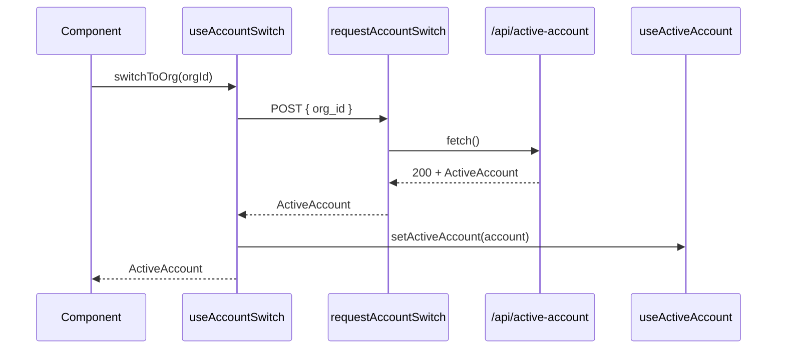
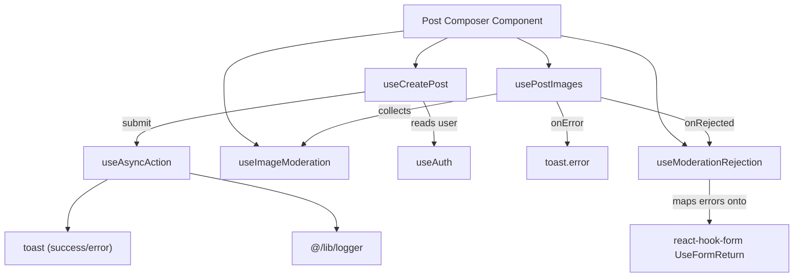

A reference catalog of the React custom hooks in `src/hooks/` that encapsulate session/account state, async action lifecycle, notifications, media moderation, and form orchestration across the application.

## Purpose and Scope

This page documents the **custom React hooks** that live in `src/hooks/` and are re-exported through the `src/hooks/index.ts` barrel. It explains what each hook does, how the shared hooks compose on top of the session/auth providers, and how the common async-lifecycle pattern works.

The page focuses on the hooks subsystem itself:

- The barrel export surface and the conventions every hook follows (all marked `"use client"`, callback-stable, single-source state).
- The **async action pattern** (`useAsyncAction`) that many action hooks delegate to.
- The **session/account** hooks (`useAuth`, `useActiveAccount`, `useSessionInfo`, `useAccountSwitch`) as the shared dependency that other hooks build on.
- The per-domain action hooks exposed by the barrel (notifications, comments, posts, moderation, projects/organizations).

Related topics are intentionally left to sibling pages:

- For the **server-side API routes** that these hooks call (e.g. `/api/active-account`), see the API/routes documentation.
- For the **session provider implementation** internals (cookie/account persistence), see the authentication and accounts pages — this page documents the hooks' public contract, not the provider's storage details.
- For **utilities and helper modules** under `src/lib/`, see the utilities catalog.

## Overview

The `src/hooks/` directory is the single place where cross-component React state and side-effect logic is centralized. Rather than duplicating `fetch` calls, toast handling, and loading flags across pages, the codebase exposes **custom hooks** that:

1. **Own one responsibility each.** `useAccountSwitch` owns account switching; `useNotificationCount` owns the unread count; `usePostImages` owns image selection state.
2. **Compose on shared providers.** Hooks like `useNotificationCount` and `useNotifications` read the active account from `useActiveAccount()`, which comes from the `SessionProvider`.
3. **Expose stable callbacks.** Mutating actions are wrapped in `useCallback` so they can be safely passed to child components and effect dependency arrays.
4. **Standardize async UX.** `useAsyncAction` centralizes loading state, success/error toasts, result unwrapping, and structured logging so every action behaves consistently.

### Key concepts

| Concept | Meaning |
|---------|---------|
| Barrel export | `src/hooks/index.ts` re-exports every public hook so consumers import from `@/hooks` instead of deep paths. |
| `"use client"` | Every hook file starts with the Next.js client directive; hooks rely on `useState`, `useCallback`, and browser APIs. |
| Single source of truth | Comment in `use-account-switch.ts`: "one fetch, one error parse, one client-state update." |
| Result unwrapping | `useAsyncAction` inspects the resolved value for a `{ success: false, error }` shape and rethrows it as an `Error`. |
| Context-backed hooks | Session/account/repost hooks read and write context state via providers exported alongside them. |

## Architecture

The hooks split into three layers: a **primitive** async-lifecycle hook, a **session/account** layer backed by a React context provider, and **domain** hooks that compose both.

```mermaid
flowchart TD
    subgraph sg_Barrel["Barrel Export (src/hooks/index.ts)"]
        Index["index.ts"]
    end

    subgraph sg_Primitives["Shared Primitives"]
        AsyncAction["useAsyncAction"]
        Hydration["useHydration"]
        IsMobile["useIsMobile"]
    end

    subgraph sg_Session["Session / Account Layer"]
        SessionProvider["SessionProvider"]
        UseSessionInfo["useSessionInfo"]
        UseAuth["useAuth"]
        UseActiveAccount["useActiveAccount"]
        AccountSwitch["useAccountSwitch"]
    end

    subgraph sg_Domain["Domain Hooks"]
        Notifications["useNotifications"]
        NotifCount["useNotificationCount"]
        CommentIdentity["useCommentIdentity"]
        ThreadComments["useThreadComments"]
        CreatePost["useCreatePost"]
        PostImages["usePostImages"]
        Moderation["useImageModeration"]
        ModRejection["useModerationRejection"]
        DeleteArticle["useDeleteArticle"]
        Repost["useRepost"]
        ProjectForm["useProjectForm"]
        OrgForm["useOrganizationForm"]
    end

    subgraph sg_Infra["Infrastructure"]
        Logger["@/lib/logger"]
        Toast["sonner toast"]
        Api["/api/* route handlers"]
    end

    Index --> Primitives
    Index --> Session
    Index --> Domain
    asyncAction["useAsyncAction"] --> Logger
    asyncAction --> Toast
    AsyncAction --> Logger
    AsyncAction --> Toast
    AccountSwitch --> UseActiveAccount
    AccountSwitch --> Api
    NotifCount --> UseActiveAccount
    Notifications --> UseActiveAccount
    CommentIdentity --> UseSessionInfo
    CreatePost --> UseAuth
    Moderation --> Api
    Notifications --> Api
    AsyncAction --> Api
```



**Reading the diagram:** the barrel re-exports all three layers. `useAsyncAction` is the primitive that standardizes side-effect UX (toasts + logging). Session hooks depend on `SessionProvider` context and one server route (`/api/active-account`). Domain hooks depend on session context and/or API routes. The `Logger` and `toast` infrastructure is consumed by the async primitive, not by individual hooks — this is what keeps error handling uniform.

### Why this layering

- **Testability and reuse** — placing loading/toast/logging logic in `useAsyncAction` means a new action hook only needs to define its `action` function and pass an `actionName`, avoiding duplicated `try/catch/finally` blocks.
- **Consistent account scoping** — because domain hooks read `activeAccount` from context, they automatically re-scope when the user switches accounts via `useAccountSwitch`.
- **Stable identity** — every action is `useCallback`-wrapped, so passing `switchToOrg`, `execute`, etc. into dependency arrays does not trigger render loops.

## The Async Action Pattern (`useAsyncAction`)

`useAsyncAction` is the most reused hook in the catalog and defines the contract every mutation follows. It accepts an async function plus display/logging options and returns an `execute` wrapper and an `isLoading` flag.

### Options and return contract

```typescript
interface UseAsyncActionOptions<T = void> {
  onSuccess?: (result: T) => void;
  successMessage?: string;
  errorMessage?: string;
  /**
   * Identifies this action in logs. `action.name` is empty for the inline
   * arrow functions every call site passes, so without this every failure
   * logs as the same unattributable "Async action error".
   */
  actionName?: string;
}

interface UseAsyncActionReturn<T = void> {
  execute: (...args: unknown[]) => Promise<T | undefined>;
  isLoading: boolean;
}
```

> Source: [use-async-action.ts](https://github.com/ozeaon/ozeaon-v2/blob/0a4f1a95824db87782f1221a4108019d174df3d9/src/hooks/use-async-action.ts#L9-L24)

### The `execute` implementation

```typescript
const execute = useCallback(
  async (...args: unknown[]): Promise<T | undefined> => {
    setIsLoading(true);
    try {
      const result = (await action(...args)) as T;

      if (
        result &&
        typeof result === "object" &&
        "success" in result &&
        result.success === false
      ) {
        const errorResult = result as { success: false; error?: string };
        throw new Error(errorResult.error || "Action failed");
      }

      if (successMessage) {
        toast.success(successMessage);
      }

      onSuccess?.(result);
      return result;
    } catch (error) {
      logError(logger, "Async action error", error, {
        action: actionName || action.name || "unknown",
      });
      const message =
        error instanceof Error
          ? error.message
          : errorMessage || "Action failed";
      toast.error(message);
    } finally {
      setIsLoading(false);
    }
  },
  [action, onSuccess, successMessage, errorMessage, actionName],
);
```

> Source: [use-async-action.ts](https://github.com/ozeaon/ozeaon-v2/blob/0a4f1a95824db87782f1221a4108019d174df3d9/src/hooks/use-async-action.ts#L33-L69)

### Behavior walkthrough

1. **Loading is set immediately** — `setIsLoading(true)` runs before the action, so UIs can disable buttons while in flight.
2. **The action is awaited** and its result cast to the generic `T`. Call sites may return a typed payload.
3. **Envelope unwrapping** — if the resolved value is an object carrying `success: false`, the hook throws an `Error` built from `error`. This lets API helpers return a discriminated result object *or* throw, and the hook treats both as failures identically.
4. **Success path** — `toast.success(successMessage)` fires only when a message is configured; then `onSuccess(result)` runs; then the result is returned to the caller.
5. **Failure path** — errors are logged via `logError` with a structured `action` field. The user-facing message is the `Error.message` when available, otherwise the configured `errorMessage`, otherwise the literal `"Action failed"`.
6. **`finally`** — `setIsLoading(false)` always runs, so the loading flag cannot get stuck on a throw.

### Design intent

- **`actionName` exists because of unnamed arrow functions.** The inline comment explains that `action.name` is empty for the arrow functions passed by every call site, so without an explicit `actionName` all failures collapse into the same unattributable log line. This is a deliberate observability affordance.
- **`success`-envelope awareness** means server helpers can encode business failures (e.g. moderation rejection) as data instead of exceptions, and the hook still surfaces them as errors without each call site re-implementing that check.
- **Errors are swallowed, not re-thrown.** `execute` resolves to `undefined` on failure. Callers must therefore branch on the return value (`if (!result) return;`) rather than wrapping `execute` in their own `try/catch`. This is the key contract to respect when composing with this hook.

### Logging setup

```typescript
const logger = getLogger(["hooks", "use-async-action"]);
```

> Source: [use-async-action.ts](https://github.com/ozeaon/ozeaon-v2/blob/0a4f1a95824db87782f1221a4108019d174df3d9/src/hooks/use-async-action.ts#L7)

The logger is namespaced with `["hooks", "use-async-action"]`, allowing log output to be filtered by subsystem and by hook name. `getLogger` and `logError` are imported from `@/lib/logger`.

## Session and Account Hooks

The session layer is the shared dependency of nearly every domain hook. It is provided by `SessionProvider` and consumed through three context readers plus one mutation hook.

### `useAccountSwitch`

`useAccountSwitch` is the canonical example of the "single source" convention. Its file comment states the intent explicitly: *"Single source of the account switch: one fetch, one error parse, one client-state update."* It exposes two `useCallback`-stable mutations:

```typescript
export function useAccountSwitch() {
  const { setActiveAccount } = useActiveAccount();

  const switchToOrg = useCallback(
    async (orgId: string): Promise<ActiveAccount> => {
      const account = await requestAccountSwitch({
        method: "POST",
        headers: { "Content-Type": "application/json" },
        body: JSON.stringify({ org_id: orgId }),
      });
      setActiveAccount(account);
      return account;
    },
    [setActiveAccount],
  );

  const switchToUser = useCallback(async (): Promise<ActiveAccount> => {
    const account = await requestAccountSwitch({ method: "DELETE" });
    setActiveAccount(account);
    return account;
  }, [setActiveAccount]);

  return { switchToOrg, switchToUser };
}
```

> Source: [use-account-switch.ts](https://github.com/ozeaon/ozeaon-v2/blob/0a4f1a95824db87782f1221a4108019d174df3d9/src/hooks/use-account-switch.ts#L17-L39)

**Server contract (`requestAccountSwitch`):**

```typescript
async function requestAccountSwitch(init: RequestInit): Promise<ActiveAccount> {
  const res = await fetch("/api/active-account", init);
  if (!res.ok) {
    const body = (await res.json().catch(() => ({}))) as { error?: string };
    throw new Error(body.error ?? "Failed to switch account");
  }
  return (await res.json()) as ActiveAccount;
}
```

> Source: [use-account-switch.ts](https://github.com/ozeaon/ozeaon-v2/blob/0a4f1a95824db87782f1221a4108019d174df3d9/src/hooks/use-account-switch.ts#L7-L14)

Design notes:

- **Personal vs organizational scope is expressed by HTTP verb.** `POST /api/active-account` with `{ org_id }` switches to an organization; `DELETE /api/active-account` reverts to the personal user account. This is a REST-ish encoding of "set the active org" / "clear the active org".
- **Typed result.** Both paths resolve to `ActiveAccount` (imported as a type from `@/types/account`), so downstream `setActiveAccount` receives a strongly typed payload.
- **Defensive error parsing.** `res.json().catch(() => ({}))` prevents a malformed or empty error body from throwing a *second*, unrelated exception; the fallback message `"Failed to switch account"` is used instead.



> Source: [use-account-switch.ts](https://github.com/ozeaon/ozeaon-v2/blob/0a4f1a95824db87782f1221a4108019d174df3d9/src/hooks/use-account-switch.ts#L7-L39)

### Account-scoped hooks

`useNotificationCount(userId, initialCount)` and `useNotifications(userId, open)` both read `activeAccount` from `useActiveAccount()` in addition to taking a `userId` and their own controls (an `initialCount` seed, or an `open` boolean). This mirrors the SSR pattern: the server renders an initial count, and the client hook re-fetches when the relevant account scope or UI state changes.

**Signatures (from the barrel and declarations):**

| Hook | Signature | Notes |
|------|-----------|-------|
| `useNotificationCount` | `useNotificationCount(userId: string, initialCount: number)` | Seeds from server-rendered count; depends on `activeAccount`. |
| `useNotifications` | `useNotifications(userId: string, open: boolean)` | `open` gates fetching so the list loads only when the panel is visible. |
| `useCommentIdentity` | `useCommentIdentity()` | Derives comment author identity from `user` and `activeAccount` via `useSessionInfo()`. |

> Sources:
> - [index.ts](https://github.com/ozeaon/ozeaon-v2/blob/0a4f1a95824db87782f1221a4108019d174df3d9/src/hooks/index.ts#L12-L13)
> - [use-notification-count.ts](https://github.com/ozeaon/ozeaon-v2/blob/0a4f1a95824db87782f1221a4108019d174df3d9/src/hooks/use-notification-count.ts#L26-L27)
> - [use-notifications.ts](https://github.com/ozeaon/ozeaon-v2/blob/0a4f1a95824db87782f1221a4108019d174df3d9/src/hooks/use-notifications.ts#L35-L36)
> - [use-comment-identity.ts](https://github.com/ozeaon/ozeaon-v2/blob/0a4f1a95824db87782f1221a4108019d174df3d9/src/hooks/use-comment-identity.ts#L12-L13)

## Domain Hooks

Beyond the session layer, the barrel exposes a set of task-specific hooks. Each one owns a single flow and (where it performs a mutation) delegates to the async-action pattern.

### Catalog of exported hooks

Every entry below is a real export from `src/hooks/index.ts`.

| Hook | Export kind | Domain | Consumer-facing purpose |
|------|-------------|--------|-------------------------|
| `SessionProvider` | Component | Session | Provides session/account context to the tree. |
| `useSessionInfo` | Hook | Session | Reads combined `user` + `activeAccount` session info. |
| `useAuth` | Hook | Auth | Reads the authenticated `user`. |
| `useActiveAccount` | Hook | Account | Reads/sets the `activeAccount` and `setActiveAccount`. |
| `useAccountSwitch` | Hook | Account | `switchToOrg` / `switchToUser` mutations. |
| `useHydration` | Hook | Platform | Hydration-safe external store read. |
| `useIsMobile` | Hook | Platform | Viewport/mobile detection via external store. |
| `useCommentIdentity` | Hook | Comments | Author identity for comment composition. |
| `useThreadComments` | Hook | Comments | Thread comment data/actions. |
| `useNotificationCount` | Hook | Notifications | Unread count, account-scoped. |
| `useNotifications` | Hook | Notifications | Notification list, gated by `open`. |
| `useProjectForm` | Hook | Projects | Project form state/submission. |
| `useModerationRejection` | Hook | Moderation | Maps moderation rejections onto a form. |
| `useRepost` / `RepostProvider` | Hook + Component | Feed | Repost state and its provider. |
| `useAsyncAction` | Hook | Primitives | Generic async lifecycle wrapper. |
| `useDeleteArticle` | Hook | Articles | Delete-article action. |
| `useImageModeration` | Hook | Moderation | Image moderation categories. |
| `useProfileImageUpload` | Hook | Profile | Profile image upload flow. |
| `useTransitionRouter` | Hook | Navigation | Router with transitions. |
| `useUnsavedChangesGuard` | Hook | Forms | Blocks navigation with unsaved changes. |
| `useCreatePost` | Hook | Posts | Post composer state + submit. |
| `usePostImages` | Hook | Posts | Post image list management. |
| `useArticleValidation` | Hook | Articles | Article validation helper. |
| `useOrganizationForm` | Hook | Organizations | Organization form flow. |

> Source: [index.ts](https://github.com/ozeaon/ozeaon-v2/blob/0a4f1a95824db87782f1221a4108019d174df3d9/src/hooks/index.ts#L1-L26)

### Type re-exports

The barrel re-exports both hooks and their public types, so consumers never reach into implementation files:

```typescript
export { useCreatePost } from "./use-create-post";
export type { ComposerForm, UseCreatePostReturn } from "./use-create-post";
export { usePostImages } from "./use-post-images";
export type { PostImage, PostImageError } from "./use-post-images";
```

> Source: [index.ts](https://github.com/ozeaon/ozeaon-v2/blob/0a4f1a95824db87782f1221a4108019d174df3d9/src/hooks/index.ts#L23-L26)

This pattern matters because it keeps the hook's **implementation file private** while exposing only the hook function and the types callers need (`ComposerForm`, `UseCreatePostReturn`, `PostImage`, `PostImageError`). Note that `index.ts` also exports hooks that appear in the barrel but whose definitions live in files not duplicated above (e.g. `use-transition-router`, `use-unsaved-changes-guard`, `use-article-validation`) — confirming the barrel is the authoritative public surface.

### Generic typing conventions

Several hooks are wrapped around the generic async primitive or are declared generic themselves:

- `useAsyncAction<T = void>` — the generic parameter types the resolved action result and therefore `onSuccess` and `execute`. The default `void` covers fire-and-forget actions.
- `useModerationRejection<TFieldValues extends FieldValues>` — a generic constrained to react-hook-form's `FieldValues`, so it can map moderation errors onto **any** form schema while remaining type-checked. It receives a `UseFormReturn<TFieldValues>` as its first argument.
- `usePostImages({ onError, onRejected }: UsePostImagesArgs)` — takes a named-argument object with `onError` and `onRejected` callbacks, letting the hook report both generic failures and moderation rejections to the caller without owning the feedback UI.

> Sources:
> - [use-async-action.ts](https://github.com/ozeaon/ozeaon-v2/blob/0a4f1a95824db87782f1221a4108019d174df3d9/src/hooks/use-async-action.ts#L26-L29)
> - [use-moderation-rejection.ts](https://github.com/ozeaon/ozeaon-v2/blob/0a4f1a95824db87782f1221a4108019d174df3d9/src/hooks/use-moderation-rejection.ts#L32-L33)
> - [use-post-images.ts](https://github.com/ozeaon/ozeaon-v2/blob/0a4f1a95824db87782f1221a4108019d174df3d9/src/hooks/use-post-images.ts#L48)

### Post composition flow

`useCreatePost`, `usePostImages`, and `useModerationRejection` combine into the composer flow. `useCreatePost` reads the authenticated user via `useAuth()`, `usePostImages` manages the `PostImage[]` list and reports `onRejected` images, and `useModerationRejection` applies any rejection onto the react-hook-form state.



> Sources:
> - [use-create-post.ts](https://github.com/ozeaon/ozeaon-v2/blob/0a4f1a95824db87782f1221a4108019d174df3d9/src/hooks/use-create-post.ts#L51-L52)
> - [use-post-images.ts](https://github.com/ozeaon/ozeaon-v2/blob/0a4f1a95824db87782f1221a4108019d174df3d9/src/hooks/use-post-images.ts#L48-L49)
> - [use-moderation-rejection.ts](https://github.com/ozeaon/ozeaon-v2/blob/0a4f1a95824db87782f1221a4108019d174df3d9/src/hooks/use-moderation-rejection.ts#L32-L33)
> - [use-image-moderation.ts](https://github.com/ozeaon/ozeaon-v2/blob/0a4f1a95824db87782f1221a4108019d174df3d9/src/hooks/use-image-moderation.ts#L11-L12)

### Image moderation state

`useImageModeration` holds its result in local state seeded to `null`, which encodes "not yet loaded" distinctly from an empty list:

```typescript
export function useImageModeration() {
  const [categories, setCategories] = useState<string[] | null>(null);
```

> Source: [use-image-moderation.ts](https://github.com/ozeaon/ozeaon-v2/blob/0a4f1a95824db87782f1221a4108019d174df3d9/src/hooks/use-image-moderation.ts#L11-L12)

Using `string[] | null` (rather than `string[]` with an empty default) lets UI code distinguish *"no categories fetched yet"* from *"fetched, and there are none"* — a small but important detail for loading states.

## Usage Examples

### Example 1 — Consuming the async primitive

Wrap any server-mutating function with `useAsyncAction`, naming it for observability and providing user feedback:

```typescript
export function useAsyncAction<T = void>(
  action: (...args: unknown[]) => Promise<T>,
  options: UseAsyncActionOptions<T> = {},
): UseAsyncActionReturn<T> {
  const { onSuccess, successMessage, errorMessage, actionName } = options;
  const [isLoading, setIsLoading] = useState(false);
  // ...execute implementation
  return { execute, isLoading };
}
```

> Source: [use-async-action.ts](https://github.com/ozeaon/ozeaon-v2/blob/0a4f1a95824db87782f1221a4108019d174df3d9/src/hooks/use-async-action.ts#L26-L31)

Callers pass an `actionName` because the inline arrow functions they supply have an empty `.name`, which the hook's own comment calls out as the reason the field exists.

### Example 2 — Switching account scope

```typescript
const { switchToOrg, switchToUser } = useAccountSwitch();
// switch to an organization workspace
const account = await switchToOrg(orgId);
// revert to the personal account
await switchToUser();
```

> Source: [use-account-switch.ts](https://github.com/ozeaon/ozeaon-v2/blob/0a4f1a95824db87782f1221a4108019d174df3d9/src/hooks/use-account-switch.ts#L20-L37)

Both callbacks are `useCallback`-stable (dependencies: `[setActiveAccount]`), so they can be listed safely in effect dependencies.

### Example 3 — Account-scoped data hook

```typescript
export function useNotifications(userId: string, open: boolean) {
  const { activeAccount } = useActiveAccount();
```

> Source: [use-notifications.ts](https://github.com/ozeaon/ozeaon-v2/blob/0a4f1a95824db87782f1221a4108019d174df3d9/src/hooks/use-notifications.ts#L35-L36)

The hook is parameterized by both the `userId` and an `open` flag, and internally reads `activeAccount`, so the same hook re-scopes across user/org switches.

### Example 4 — Migrating away from deep imports

```typescript
// Prefer the barrel
import { useAccountSwitch, useAsyncAction } from "@/hooks";

// Not the deep path
// import { useAccountSwitch } from "@/hooks/use-account-switch";
```

> Source: [index.ts](https://github.com/ozeaon/ozeaon-v2/blob/0a4f1a95824db87782f1221a4108019d174df3d9/src/hooks/index.ts#L1-L26)

The barrel is the contract; deep imports bypass the type re-exports and couple callers to file layout.

## API Reference

### `useAsyncAction<T = void>(action, options?)`

Wraps an async function with loading state, toast feedback, structured logging, and result unwrapping.

**Parameters:**
- `action` (`(...args: unknown[]) => Promise<T>`): The async operation to run. Any arguments passed to `execute` are forwarded here.
- `options` (`UseAsyncActionOptions<T>`, optional, default `{}`):
  - `onSuccess?: (result: T) => void` — invoked after a successful run.
  - `successMessage?: string` — shown via `toast.success` on success.
  - `errorMessage?: string` — fallback user message when the thrown value is not an `Error`.
  - `actionName?: string` — log tag; falls back to `action.name` then `"unknown"`.

**Returns:** `UseAsyncActionReturn<T>`
- `execute: (...args: unknown[]) => Promise<T | undefined>` — runs the action. Resolves to the result on success, or `undefined` on failure (errors are caught, not re-thrown).
- `isLoading: boolean` — `true` while the action is in flight.

**Throws:** Never throws to the caller; failures are converted into `toast.error` and a logged error.

> Source: [use-async-action.ts](https://github.com/ozeaon/ozeaon-v2/blob/0a4f1a95824db87782f1221a4108019d174df3d9/src/hooks/use-async-action.ts#L26-L71)

### `useAccountSwitch()`

**Parameters:** none.

**Returns:** `{ switchToOrg: (orgId: string) => Promise<ActiveAccount>; switchToUser: () => Promise<ActiveAccount> }`

- `switchToOrg(orgId)` — `POST /api/active-account` with `{ org_id: orgId }`; updates client state and returns the new `ActiveAccount`.
- `switchToUser()` — `DELETE /api/active-account`; updates client state and returns the new `ActiveAccount`.

**Throws:** `Error` when the response is not `ok`. The message is the server's `body.error`, falling back to `"Failed to switch account"`.

> Source: [use-account-switch.ts](https://github.com/ozeaon/ozeaon-v2/blob/0a4f1a95824db87782f1221a4108019d174df3d9/src/hooks/use-account-switch.ts#L7-L39)

### `useNotificationCount(userId: string, initialCount: number)`

**Returns:** the notification count, seeded by the server-rendered `initialCount`, re-scoped by `activeAccount`.

> Source: [use-notification-count.ts](https://github.com/ozeaon/ozeaon-v2/blob/0a4f1a95824db87782f1221a4108019d174df3d9/src/hooks/use-notification-count.ts#L26-L27)

### `useNotifications(userId: string, open: boolean)`

**Returns:** the notification collection; fetching is gated by `open` so the list is only loaded when its panel is visible.

> Source: [use-notifications.ts](https://github.com/ozeaon/ozeaon-v2/blob/0a4f1a95824db87782f1221a4108019d174df3d9/src/hooks/use-notifications.ts#L35-L36)

### `useImageModeration()`

**Returns:** moderation categories held as `string[] | null` — `null` meaning "not loaded yet".

> Source: [use-image-moderation.ts](https://github.com/ozeaon/ozeaon-v2/blob/0a4f1a95824db87782f1221a4108019d174df3d9/src/hooks/use-image-moderation.ts#L11-L12)

### `usePostImages({ onError, onRejected }: UsePostImagesArgs)`

**Parameters:**
- `onError` — called when image handling fails.
- `onRejected` — called for each rejected image, typically forwarded to `useModerationRejection`.

**Returns:** the `PostImage[]` list and mutation helpers.

> Source: [use-post-images.ts](https://github.com/ozeaon/ozeaon-v2/blob/0a4f1a95824db87782f1221a4108019d174df3d9/src/hooks/use-post-images.ts#L48-L49)

### `useModerationRejection<TFieldValues extends FieldValues>(form: UseFormReturn<TFieldValues>, ...)`

**Parameters:**
- `form` (`UseFormReturn<TFieldValues>`) — the react-hook-form return object to apply errors onto.

**Returns:** a rejection handler that maps moderation failures onto the given form's fields.

> Source: [use-moderation-rejection.ts](https://github.com/ozeaon/ozeaon-v2/blob/0a4f1a95824db87782f1221a4108019d174df3d9/src/hooks/use-moderation-rejection.ts#L32-L33)

## Failure Modes, Edge Cases & Concurrency

| Scenario | Where handled | Behavior |
|----------|---------------|----------|
| Action returns `{ success: false, error }` | `useAsyncAction.execute` | The envelope is detected and rethrown as `new Error(error ?? "Action failed")`, then surfaced as an error toast. |
| Action throws a non-`Error` value | `useAsyncAction` catch block | The `errorMessage` option (or the literal `"Action failed"`) is shown instead of an unhelpful value. |
| Server returns non-OK on account switch | `requestAccountSwitch` | `res.json().catch(() => ({}))` guards against an empty/invalid body, then throws a typed `Error`. |
| Failure occurs mid-action | `useAsyncAction` `finally` | `setIsLoading(false)` always runs, so the loading flag cannot remain stuck. |
| Multiple rapid invocations | `useAsyncAction` | `isLoading` is a single boolean; concurrent calls will each toggle it, so consumers should guard with a disabled state where re-entrancy matters. |
| Unnamed action function | `useAsyncAction` logging | Without `actionName`, `action.name` is empty; logs fall back to `"unknown"`, which is why `actionName` is recommended. |
| Account switch re-scoping | Domain hooks | Hooks reading `activeAccount` re-run when the account changes, avoiding stale cross-account data. |
| Not-yet-loaded moderation data | `useImageModeration` | `null` distinguishes "loading" from "empty list". |

> Sources:
> - [use-async-action.ts](https://github.com/ozeaon/ozeaon-v2/blob/0a4f1a95824db87782f1221a4108019d174df3d9/src/hooks/use-async-action.ts#L33-L69)
> - [use-account-switch.ts](https://github.com/ozeaon/ozeaon-v2/blob/0a4f1a95824db87782f1221a4108019d174df3d9/src/hooks/use-account-switch.ts#L7-L14)
> - [use-image-moderation.ts](https://github.com/ozeaon/ozeaon-v2/blob/0a4f1a95824db87782f1221a4108019d174df3d9/src/hooks/use-image-moderation.ts#L11-L12)

### Concurrency & consistency notes

- **Single boolean loading flag.** Because `isLoading` is a plain `useState<boolean>`, overlapping `execute` calls race on the flag; the last `finally` to run wins. For flows where double-submission is a risk, disable the trigger while `isLoading` is `true`.
- **Client-state update is synchronous after the server call.** `switchToOrg`/`switchToUser` call `setActiveAccount(account)` only after `requestAccountSwitch` resolves, so context state never diverges from the server's authoritative response.
- **Stable callback identity is a correctness requirement, not an optimization.** `useCallback` dependencies are explicit; changing the `action` identity passed to `useAsyncAction` recreates `execute`, which is expected and should be accounted for in effect arrays.

## Performance & Operational Notes

- **Server-seeded initial values.** `useNotificationCount(userId, initialCount)` takes the initial count from the server, enabling correct first paint and avoiding a loading flash — a deliberate SSR hydration pattern.
- **Gated fetching.** `useNotifications(userId, open)` uses `open` to defer work until the panel is visible, reducing background requests.
- **External-store reads.** `useHydration` is implemented with `useSyncExternalStore` (per its declaration at `src/hooks/use-hydration.tsx#L5-L6`), which is the React-recommended way to read browser state without hydration mismatches. `useIsMobile` follows the same external-store approach.
- **Centralized logging.** The `useAsyncAction` logger is namespaced `["hooks", "use-async-action"]` via `getLogger`, so failures can be filtered per-subsystem in log aggregation.

## Extension Points

1. **Add a new action hook** by writing a function that calls `useAsyncAction(yourAction, { actionName: "your-action", successMessage, errorMessage })` and returning `{ execute, isLoading }` plus any local state. Always pass `actionName` for log attribution.
2. **Add a new session-scoped hook** by depending on `useActiveAccount()` / `useSessionInfo()` / `useAuth()` so it automatically re-scopes on account switch.
3. **Extend the public surface** by adding an export line to `src/hooks/index.ts`; re-export any consumer-facing types with `export type { ... }` as `useCreatePost` and `usePostImages` do.
4. **Customize feedback** without forking the primitive: pass `successMessage`, `errorMessage`, and `onSuccess` to `useAsyncAction` rather than duplicating toast logic.

## Related Links

- Barrel export surface: [src/hooks/index.ts](https://github.com/ozeaon/ozeaon-v2/blob/0a4f1a95824db87782f1221a4108019d174df3d9/src/hooks/index.ts)
- Async primitive: [src/hooks/use-async-action.ts](https://github.com/ozeaon/ozeaon-v2/blob/0a4f1a95824db87782f1221a4108019d174df3d9/src/hooks/use-async-action.ts)
- Session context: [src/hooks/use-auth.tsx](https://github.com/ozeaon/ozeaon-v2/blob/0a4f1a95824db87782f1221a4108019d174df3d9/src/hooks/use-auth.tsx)
- Account switching: [src/hooks/use-account-switch.ts](https://github.com/ozeaon/ozeaon-v2/blob/0a4f1a95824db87782f1221a4108019d174df3d9/src/hooks/use-account-switch.ts)
- Hydration helper: [src/hooks/use-hydration.tsx](https://github.com/ozeaon/ozeaon-v2/blob/0a4f1a95824db87782f1221a4108019d174df3d9/src/hooks/use-hydration.tsx)
- Mobile detection: [src/hooks/use-is-mobile.tsx](https://github.com/ozeaon/ozeaon-v2/blob/0a4f1a95824db87782f1221a4108019d174df3d9/src/hooks/use-is-mobile.tsx)
- Notifications: [src/hooks/use-notifications.ts](https://github.com/ozeaon/ozeaon-v2/blob/0a4f1a95824db87782f1221a4108019d174df3d9/src/hooks/use-notifications.ts), [src/hooks/use-notification-count.ts](https://github.com/ozeaon/ozeaon-v2/blob/0a4f1a95824db87782f1221a4108019d174df3d9/src/hooks/use-notification-count.ts)
- Post composition: [src/hooks/use-create-post.ts](https://github.com/ozeaon/ozeaon-v2/blob/0a4f1a95824db87782f1221a4108019d174df3d9/src/hooks/use-create-post.ts), [src/hooks/use-post-images.ts](https://github.com/ozeaon/ozeaon-v2/blob/0a4f1a95824db87782f1221a4108019d174df3d9/src/hooks/use-post-images.ts)
- Moderation: [src/hooks/use-image-moderation.ts](https://github.com/ozeaon/ozeaon-v2/blob/0a4f1a95824db87782f1221a4108019d174df3d9/src/hooks/use-image-moderation.ts), [src/hooks/use-moderation-rejection.ts](https://github.com/ozeaon/ozeaon-v2/blob/0a4f1a95824db87782f1221a4108019d174df3d9/src/hooks/use-moderation-rejection.ts)
