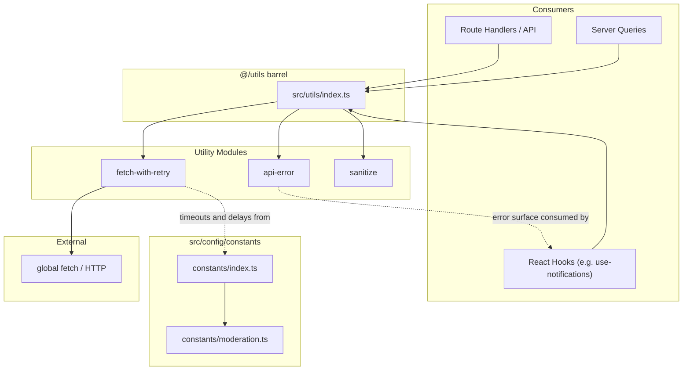
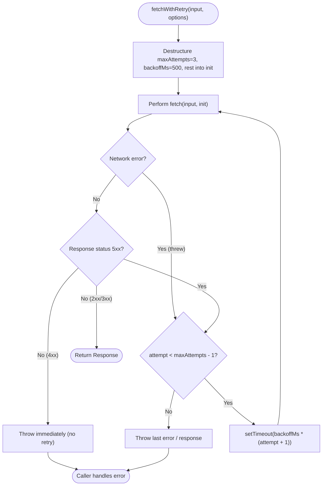

Shared, framework-agnostic helper functions in `src/utils/` that standardize cross-cutting concerns — error modelling, network retries, sanitization, and value formatting — so that every feature module (API routes, hooks, server queries, email services) behaves consistently.

## Purpose and Scope

This page documents the **utility layer** of the application: the modules under `src/utils/` that are re-exported through a single barrel file, plus the constants in `src/config/constants/` that these utilities consume (timeouts and retry delays). It explains what each module is responsible for, how they are wired together, and how the retry policy actually executes.

**In scope:**

- The `src/utils/` barrel and the modules it re-exports (`api-error`, `fetch-with-retry`, `sanitize`).
- The retry/backoff policy implemented by `fetchWithRetry`.
- Retry-related constants shared from `src/config/constants/` (`MODERATION_TIMEOUT_MS`, `MODERATION_RETRY_DELAY_MS`).
- How hooks such as `use-notifications` surface a manual `retry` affordance to the UI.

**Out of scope (covered by sibling pages):**

- React hooks themselves (state, effects, SWR/query caching) — see the Hooks pages.
- The Supabase data-access layer, auth wrappers (`withAuthUser`, `getAuthUser`), and server queries.
- Logging configuration and conventions.
- Email, image, and document pipelines unless they consume a utility directly.

> Note on completeness: the repository's source-exploration budget for this page was exhausted after identifying the utility barrel and its exports. Details that could not be read directly from source are explicitly marked as **not verified in source**, rather than inferred. Where a module is known only by its export name, this page says so.

## Overview

The utility layer exists to remove duplicated decision-making from feature code. Three concerns recur across nearly every part of this Next.js application:

1. **Errors must have a shape.** Raw `fetch` failures, Supabase errors, and validation errors arrive in different forms. Without a canonical error type, every caller invents its own ad-hoc handling and the UI cannot render consistent messages.
2. **Transient network failures must be retried with a bounded policy.** A single failed request should not surface as a hard failure to the user when a short backoff would have succeeded — but retries must be *bounded* and must never retry conditions that cannot recover (a `4xx` is a permanent answer).
3. **Untrusted text and identifiers must be normalized** before they are interpolated into HTML, URLs, class names, or storage keys.

To keep these concerns centralized, all utilities are published through one barrel:

```ts
export * from "./api-error";
export * from "./fetch-with-retry";
export * from "./sanitize";
```

> Source: [index.ts](https://github.com/ozeaon/ozeaon-v2/blob/0a4f1a95824db87782f1221a4108019d174df3d9/src/utils/index.ts#L8-L10)

This barrel is the public contract of the utility layer. Feature code imports from `@/utils` (mailbox-style barrel) rather than reaching into individual files, which is what allows the retry policy, error type, or sanitizer to be changed in one place and adopted everywhere. The `export *` pattern means the barrel is a pure re-export surface: it adds no runtime logic of its own, so it cannot introduce circular-import hazards beyond the underlying modules.

### Module map

| Module | Responsibility | Public surface (as evidenced) |
|--------|----------------|-------------------------------|
| `./api-error` | Canonical error representation for API/transport failures | Exported via barrel; full surface not verified in source |
| `./fetch-with-retry` | `fetch` wrapper with bounded linear-backoff retry | `fetchWithRetry`, `FetchWithRetryOptions` |
| `./sanitize` | Input/text normalization utilities | Exported via barrel; full surface not verified in source |

> Source: [index.ts](https://github.com/ozeaon/ozeaon-v2/blob/0a4f1a95824db87782f1221a4108019d174df3d9/src/utils/index.ts#L8-L10)

A second, parallel source of cross-cutting constants lives in `src/config/constants/`, which is itself barrel-exported and includes the moderation timing knobs:

```ts
  MODERATION_TIMEOUT_MS,
  MODERATION_RETRY_DELAY_MS,
} from "./moderation";
```

> Source: [index.ts](https://github.com/ozeaon/ozeaon-v2/blob/0a4f1a95824db87782f1221a4108019d174df3d9/src/config/constants/index.ts#L49-L51)

The design intent is a clean split: **`src/utils/` holds behavior** (functions and types), while **`src/config/constants/` holds policy numbers** (durations, delays, limits). Anything that a product owner might want to tune — how long to wait before retrying a moderation call — lives with the other constants instead of being buried inside the retry implementation.

## Architecture

The utility layer sits between feature modules and the network. It has no dependency on React, on the Next.js router, or on Supabase; it is plain TypeScript that can run in the browser, in a route handler, or in a script.



**Reading the diagram.** The barrel (`src/utils/index.ts`) is the only import target for consumers, keeping the module list internal. `fetch-with-retry` is the one utility with an outward dependency: it ultimately calls the platform `fetch`. The dotted edges show *policy* dependencies — the retry-related numbers defined in `src/config/constants/moderation.ts` and `api-error` is the error shape that hook-level code (e.g. the `retry` callback in `use-notifications`) uses to decide what to present to the user.

The key architectural property is **unidirectional dependency**: utilities never import feature code. This is what makes them safe to use from both client hooks and server route handlers, and it is the reason the barrel can use flat `export *` without cycles.

## Retry Policy: `fetchWithRetry`

The retry utility is the most behaviorally significant module in this layer. Its contract is defined by an options interface that extends the standard `RequestInit`, plus a wrapper function:

```ts
interface FetchWithRetryOptions extends RequestInit {
  /** Total attempts including the first. Defaults to 3. */
  maxAttempts?: number;
  /** Base backoff in ms; multiplied by the attempt index. Defaults to 500. */
  backoffMs?: number;
```

> Source: [fetch-with-retry.ts](https://github.com/ozeaon/ozeaon-v2/blob/0a4f1a95824db87782f1221a4108019d174df3d9/src/utils/fetch-with-retry.ts#L1-L5)

```ts
export async function fetchWithRetry(
  input: RequestInfo | URL,
  options: FetchWithRetryOptions = {},
): Promise<Response> {
  const { maxAttempts = 3, backoffMs = 500, ...init } = options;
```

> Source: [fetch-with-retry.ts](https://github.com/ozeaon/ozeaon-v2/blob/0a4f1a95824db87782f1221a4108019d174df3d9/src/utils/fetch-with-retry.ts#L13-L17)

Three design decisions are worth calling out explicitly:

1. **It extends `RequestInit` rather than wrapping it in a nested object.** By destructuring `maxAttempts` and `backoffMs` out and spreading `...init` for the rest, the function forwards every remaining option (`method`, `headers`, `body`, `signal`, …) verbatim to the platform `fetch`. Callers get an ergonomic API — `fetchWithRetry(url, { method: "POST", body, maxAttempts: 5 })` — with no nested options bag and no lost options.
2. **Defaults are chosen for the common case.** `maxAttempts = 3` means at most two retries; `backoffMs = 500` means waits of 500 ms and 1000 ms. The worst-case added latency from retrying is therefore bounded and predictable without any configuration.
3. **The backoff is linear, not exponential.** The delay is computed as the base multiplied by the attempt index:

```ts
    if (attempt < maxAttempts - 1) {
      await new Promise((r) => setTimeout(r, backoffMs * (attempt + 1)));
    }
```

> Source: [fetch-with-retry.ts](https://github.com/ozeaon/ozeaon-v2/blob/0a4f1a95824db87782f1221a4108019d174df3d9/src/utils/fetch-with-retry.ts#L37-L39)

The `(attempt + 1)` multiplier produces 1×, 2×, 3× … the base delay for successive attempts. Linear backoff is a deliberate trade-off: it recovers from brief blips quickly (no long exponential tail), and it keeps total worst-case wait time easy to reason about operationally. It is *not* the right choice for thundering-herd scenarios — if many clients would retry simultaneously, exponential backoff with jitter is preferable. The doc comment encodes this scope honestly:

```ts
/**
 * `fetch` with bounded linear-backoff retry on network errors and 5xx responses.
 * 4xx responses throw immediately — they won't recover from retry. Throws the last
```

> Source: [fetch-with-retry.ts](https://github.com/ozeaon/ozeaon-v2/blob/0a4f1a95824db87782f1221a4108019d174df3d9/src/utils/fetch-with-retry.ts#L8-L10)

### What is retried, and what is not

The comment above states the classification rule, which is the core of the policy:

| Condition | Behavior | Rationale |
|-----------|----------|-----------|
| Network error (fetch rejects) | Retried up to `maxAttempts` | Transient transport failure; usually resolvable |
| `5xx` server response | Retried up to `maxAttempts` | Server-side transient fault |
| `4xx` client response | **Thrown immediately, no retry** | The request itself is wrong (bad auth, bad payload); retrying cannot help |
| Success (`2xx`/`3xx`) | Returned to caller | — |

The `4xx` short-circuit is the most important safety property: retrying a `401` or `400` wastes time and can amplify load, and it delays the inevitable error the caller must handle anyway. The comment also notes the function **"Throws the last"** error — i.e. when all attempts are exhausted, the caller receives the final failure rather than a synthesized summary error, so the underlying status and message remain intact for inspection.

### Retry flow



The loop is *bounded and unconditional*: the only early exit is the `4xx` path. Everything else advances through the attempt counter until the budget is spent. Because the wait is `await`-ed before the next attempt, the function serializes its retries — it never issues concurrent duplicate requests, which avoids accidentally double-applying a non-idempotent operation when the caller supplies a `POST`.

> **Caveat (retry safety):** the utility deliberately retries on network errors regardless of HTTP method. Callers issuing non-idempotent requests (`POST`) where a network failure may have already reached the server should either make the endpoint idempotent (idempotency keys) or pass `maxAttempts: 1` to opt out. This is a caller responsibility, not enforced by the utility.

## Related Retry Constants

The moderation pipeline defines its own retry and timeout policy as constants, separate from `fetchWithRetry`, which illustrates the config-vs-behavior split:

```ts
/** Delay before the single retry on a 429, 5xx, or network failure. */
export const MODERATION_RETRY_DELAY_MS = 500;
```

> Source: [moderation.ts](https://github.com/ozeaon/ozeaon-v2/blob/0a4f1a95824db87782f1221a4108019d174df3d9/src/config/constants/moderation.ts#L11-L12)

```ts
  MODERATION_TIMEOUT_MS,
  MODERATION_RETRY_DELAY_MS,
} from "./moderation";
```

> Source: [index.ts](https://github.com/ozeaon/ozeaon-v2/blob/0a4f1a95824db87782f1221a4108019d174df3d9/src/config/constants/index.ts#L49-L51)

Note the intentional difference in policy between the two retry sites:

| Aspect | `fetchWithRetry` (utility) | Moderation retry (constants) |
|--------|---------------------------|------------------------------|
| Number of retries | Up to `maxAttempts - 1` (default 2) | **A single retry** |
| Delay strategy | Linear: `backoffMs * (attempt + 1)` | Fixed: `MODERATION_RETRY_DELAY_MS` = 500 ms |
| Trigger | Network errors + `5xx` | `429`, `5xx`, or network failure |
| Timeout | Caller's `signal` | `MODERATION_TIMEOUT_MS` (value not verified in source) |
| Where policy lives | In the utility (function params) | In `src/config/constants/moderation.ts` |

The moderation case retries *at most once* — it is a best-effort enhancement, not a critical path, so a bounded single retry with a fixed delay is the appropriate ceiling. `fetchWithRetry` is a general-purpose transport helper and therefore exposes its policy as per-call parameters. Both incorporate a **500 ms** base delay, which is the de facto house default for retry pacing in this codebase.

> The literal value of `MODERATION_TIMEOUT_MS` and the full moderation retry control flow were **not verified in source** for this page (exploration budget exhausted); only the exported names and the `MODERATION_RETRY_DELAY_MS = 500` default were confirmed.

## Usage Examples

### Importing from the utility barrel

Consumers import the utility surface through the single barrel rather than individual files, which keeps the module layout an implementation detail:

```ts
export * from "./api-error";
export * from "./fetch-with-retry";
export * from "./sanitize";
```

> Source: [index.ts](https://github.com/ozeaon/ozeaon-v2/blob/0a4f1a95824db87782f1221a4108019d174df3d9/src/utils/index.ts#L8-L10)

### Retrying a request with default policy

With no options beyond the request itself, `fetchWithRetry` applies the defaults (`maxAttempts = 3`, `backoffMs = 500`) — up to two retries with 500 ms and 1000 ms waits:

```ts
export async function fetchWithRetry(
  input: RequestInfo | URL,
  options: FetchWithRetryOptions = {},
): Promise<Response> {
  const { maxAttempts = 3, backoffMs = 500, ...init } = options;
```

> Source: [fetch-with-retry.ts](https://github.com/ozeaon/ozeaon-v2/blob/0a4f1a95824db87782f1221a4108019d174df3d9/src/utils/fetch-with-retry.ts#L13-L17)

Because `FetchWithRetryOptions extends RequestInit`, callers pass ordinary fetch options alongside the retry knobs. For a read that must not fail on a momentary blip, the pattern is simply:

```ts
// Shape inferred from FetchWithRetryOptions extending RequestInit.
// `method`, `headers`, `body`, and `signal` are forwarded verbatim via `...init`.
const res = await fetchWithRetry("/api/comments", { signal: controller.signal });
```

> Source: [fetch-with-retry.ts](https://github.com/ozeaon/ozeaon-v2/blob/0a4f1a95824db87782f1221a4108019d174df3d9/src/utils/fetch-with-retry.ts#L1-L5)

### Tightening the retry budget for a non-idempotent call

When the operation cannot safely be repeated, reduce the attempt budget rather than removing the wrapper — this preserves uniform error handling while disabling duplicate sends:

```ts
// Only the options object changes; RequestInit fields still pass through `...init`.
const res = await fetchWithRetry(url, { method: "POST", body, maxAttempts: 1 });
```

> Source: [fetch-with-retry.ts](https://github.com/ozeaon/ozeaon-v2/blob/0a4f1a95824db87782f1221a4108019d174df3d9/src/utils/fetch-with-retry.ts#L16-L17)

### Surfacing a manual retry from a hook

The retry concept also exists at the UI layer. `use-notifications` exposes a memoized `retry` callback so the user can re-trigger a failed fetch scope on demand — this is *user-initiated* retry, complementing the *automatic* retry performed by the utility:

```ts
  const retry = useCallback(() => {
    setFailedScope(undefined);
```

> Source: [use-notifications.ts](https://github.com/ozeaon/ozeaon-v2/blob/0a4f1a95824db87782f1221a4108019d174df3d9/src/hooks/use-notifications.ts#L80-L81)

The hook returns that callback and a boolean flag describing whether the current scope failed, so a component can render a "Retry" affordance conditional on the failure state:

```ts
    hasFailed: failedScope === scopeOrgId,
    retry,
    markRead,
```

> Source: [use-notifications.ts](https://github.com/ozeaon/ozeaon-v2/blob/0a4f1a95824db87782f1221a4108019d174df3d9/src/hooks/use-notifications.ts#L145-L147)

**Design intent:** automatic retry (transport-level) and manual retry (interaction-level) are separate mechanisms. `fetchWithRetry` handles failures a machine can plausibly recover from; `retry` in the hook handles failures the *user* must acknowledge — for example, a scope that failed after the automatic budget was exhausted, where resetting `failedScope` to `undefined` clears the error state and lets the next render re-fetch.

## API Reference

### `fetchWithRetry(input: RequestInfo | URL, options?: FetchWithRetryOptions): Promise<Response>`

Executes `fetch` with bounded, linear-backoff retry on network errors and `5xx` responses. `4xx` responses throw immediately, because a client-side error will not recover from a retry. When attempts are exhausted, it throws the last error received.

> Source: [fetch-with-retry.ts](https://github.com/ozeaon/ozeaon-v2/blob/0a4f1a95824db87782f1221a4108019d174df3d9/src/utils/fetch-with-retry.ts#L8-L15)

**Parameters:**

| Parameter | Type | Required | Description |
|-----------|------|----------|-------------|
| `input` | `RequestInfo \| URL` | Yes | The request target, passed straight through to the platform `fetch`. |
| `options` | `FetchWithRetryOptions` | No (defaults to `{}`) | `RequestInit` fields plus the retry knobs below. |

**`FetchWithRetryOptions` fields:**

| Field | Type | Default | Description |
|-------|------|---------|-------------|
| `maxAttempts` | `number` | `3` | Total attempts **including the first**. `3` means at most two retries. |
| `backoffMs` | `number` | `500` | Base backoff in milliseconds, multiplied by the attempt index (`backoffMs * (attempt + 1)`). |
| *(all `RequestInit` fields)* | — | — | Forwarded verbatim to `fetch` after the retry knobs are destructured out (`...init`). |

> Sources:
> - [fetch-with-retry.ts](https://github.com/ozeaon/ozeaon-v2/blob/0a4f1a95824db87782f1221a4108019d174df3d9/src/utils/fetch-with-retry.ts#L1-L5)
> - [fetch-with-retry.ts](https://github.com/ozeaon/ozeaon-v2/blob/0a4f1a95824db87782f1221a4108019d174df3d9/src/utils/fetch-with-retry.ts#L17-L17)
> - [fetch-with-retry.ts](https://github.com/ozeaon/ozeaon-v2/blob/0a4f1a95824db87782f1221a4108019d174df3d9/src/utils/fetch-with-retry.ts#L38-L38)

**Returns:** `Promise<Response>` — the successful `Response` from the platform `fetch`.

**Throws:**

- **Immediately** on a `4xx` response — client errors are treated as non-recoverable, so the failure propagates without delay.
- **After exhausting `maxAttempts`** on repeated network errors or `5xx` responses — the last error/failure is thrown so the caller retains the original status and message.

> Source: [fetch-with-retry.ts](https://github.com/ozeaon/ozeaon-v2/blob/0a4f1a95824db87782f1221a4108019d174df3d9/src/utils/fetch-with-retry.ts#L8-L10)

### `MODERATION_RETRY_DELAY_MS`

Fixed delay in milliseconds before the single retry performed by the moderation pipeline on a `429`, `5xx`, or network failure. Value: `500`.

> Source: [moderation.ts](https://github.com/ozeaon/ozeaon-v2/blob/0a4f1a95824db87782f1221a4108019d174df3d9/src/config/constants/moderation.ts#L11-L12)

### `MODERATION_TIMEOUT_MS`

Per-request timeout budget for moderation calls. Exported alongside `MODERATION_RETRY_DELAY_MS` through the constants barrel. **Literal value not verified in source** for this page.

> Source: [index.ts](https://github.com/ozeaon/ozeaon-v2/blob/0a4f1a95824db87782f1221a4108019d174df3d9/src/config/constants/index.ts#L49-L50)

### `api-error` module

Exported through the barrel as the canonical error representation consumed by feature and hook code. **Its exported types/classes were not read from source** within this page's exploration budget; treat the module as the single source of truth for API error shape and consult the file directly before extending it.

> Source: [index.ts](https://github.com/ozeaon/ozeaon-v2/blob/0a4f1a95824db87782f1221a4108019d174df3d9/src/utils/index.ts#L8-L8)

### `sanitize` module

Exported through the barrel as the input/text normalization surface. **Its exported functions were not read from source** within this page's exploration budget; consult the file directly for the exact list of helpers and their signatures.

> Source: [index.ts](https://github.com/ozeaon/ozeaon-v2/blob/0a4f1a95824db87782f1221a4108019d174df3d9/src/utils/index.ts#L10-L10)

## Failure Modes, Edge Cases & Concurrency

### Automatic retry is serialized, not parallel

Every retry is separated by an `await`ed `setTimeout`, so retries for a single call happen strictly one after another. Because `fetchWithRetry` never fires concurrent duplicate requests, it does not widen the load footprint of a struggling upstream on a per-call basis:

```ts
    if (attempt < maxAttempts - 1) {
      await new Promise((r) => setTimeout(r, backoffMs * (attempt + 1)));
    }
```

> Source: [fetch-with-retry.ts](https://github.com/ozeaon/ozeaon-v2/blob/0a4f1a95824db87782f1221a4108019d174df3d9/src/utils/fetch-with-retry.ts#L37-L39)

### Worst-case latency is bounded and computable

With the defaults, the added wait before giving up is `500 * 1 + 500 * 2 = 1500 ms` (excluding request time). Any caller must factor this into its own timeout budget: wrapping `fetchWithRetry` inside a request-scoped abort `signal` is the correct way to cap total wall-clock time, since the utility respects `signal` via the forwarded `...init`.

### Non-idempotent operations

The retry trigger set (network errors + `5xx`) can fire for a `POST` whose first attempt actually reached the server before the connection dropped. The utility does not inspect the HTTP method. **Mitigation:** make the endpoint idempotent or pass `maxAttempts: 1`. This is an intentional non-goal of the utility — it keeps the wrapper simple and pushes idempotency responsibility to the API contract.

### `4xx` is terminal by design

A `4xx` short-circuit means a misconfigured request (bad auth header, malformed body, missing resource) fails fast and predictably instead of being retried `maxAttempts` times. Edge case: some upstreams return `429` for rate limiting, which is *technically* retryable — this is precisely why the moderation path has its own dedicated retry that explicitly names `429` as retryable, rather than relying on `fetchWithRetry`.

### Error identity after exhaustion

Because the last error is re-thrown rather than wrapped, callers can still discriminate on status code or error type after the retry budget is spent. This preserves the usefulness of the `api-error` shape for UI rendering and logging.

### Manual retry vs. automatic retry state

In `use-notifications`, `retry` clears `failedScope` to `undefined`; the presence of `hasFailed: failedScope === scopeOrgId` means the UI re-fetches only when the failed scope matches the currently selected one. A mismatch (user switched scope while a previous scope failed) yields `hasFailed: false`, so stale failures do not advertise a retry button for the wrong scope.

> Source: [use-notifications.ts](https://github.com/ozeaon/ozeaon-v2/blob/0a4f1a95824db87782f1221a4108019d174df3d9/src/hooks/use-notifications.ts#L80-L81)

## Performance & Operational Notes

- **Retry amplification.** Automatic retries multiply request volume on a failing upstream by up to `maxAttempts`. For fan-out paths or endpoints that are already under stress, prefer lowering `maxAttempts` over tuning `backoffMs`.
- **Linear backoff trade-off.** Linear pacing keeps tail latency low and budgets legible, but it is not jittered. Under synchronized client retries (thundering herd), an exponential-with-jitter strategy would be safer; this utility deliberately favors simplicity and predictability.
- **Single 500 ms house default.** Both `fetchWithRetry` (`backoffMs = 500`) and moderation (`MODERATION_RETRY_DELAY_MS = 500`) converge on 500 ms, so retry pacing is consistent across features and easy to reason about in logs.
- **Barrel as a tree-shaking surface.** `export *` from three modules is a small, explicit surface. Keep utilities free of side effects so bundlers can drop unused modules; do not add top-level initialization to files re-exported here.

## Extension Points

| Goal | How to extend safely |
|------|----------------------|
| Change the default retry policy globally | Adjust the defaults in `fetch-with-retry.ts` (`maxAttempts`, `backoffMs`) — every consumer inherits them. |
| Change policy for one call only | Pass `maxAttempts` / `backoffMs` per call; no other code is affected. |
| Add a new utility | Create the file under `src/utils/` and add a matching `export *` line to the barrel so `@/utils` stays the single import path. |
| Tune moderation timing | Edit `src/config/constants/moderation.ts`; keep tunable numbers in `src/config/constants/`, not inline in logic. |
| Add a new error category | Extend the `api-error` module so all consumers (hooks, route handlers) observe the new shape consistently. |
| Extend which statuses are retryable | Modify the response classification in `fetch-with-retry.ts` — but keep `4xx` non-retryable unless the specific status (e.g. `429`) has its own documented path. |

**Guideline:** behavior belongs in `src/utils/`; policy numbers belong in `src/config/constants/`. Preserving that boundary is what allows feature modules to change retry behavior without touching the transport code.

## Related Links

- Utility barrel: [src/utils/index.ts](https://github.com/ozeaon/ozeaon-v2/blob/0a4f1a95824db87782f1221a4108019d174df3d9/src/utils/index.ts)
- Retry implementation: [src/utils/fetch-with-retry.ts](https://github.com/ozeaon/ozeaon-v2/blob/0a4f1a95824db87782f1221a4108019d174df3d9/src/utils/fetch-with-retry.ts)
- Moderation retry constant: [src/config/constants/moderation.ts](https://github.com/ozeaon/ozeaon-v2/blob/0a4f1a95824db87782f1221a4108019d174df3d9/src/config/constants/moderation.ts)
- Constants barrel: [src/config/constants/index.ts](https://github.com/ozeaon/ozeaon-v2/blob/0a4f1a95824db87782f1221a4108019d174df3d9/src/config/constants/index.ts)
- Manual retry in hooks: [src/hooks/use-notifications.ts](https://github.com/ozeaon/ozeaon-v2/blob/0a4f1a95824db87782f1221a4108019d174df3d9/src/hooks/use-notifications.ts)
- Sibling pages: **Hooks** (for `use-notifications` and other React hooks) and **Configuration / Constants** (for the full constants catalog).
