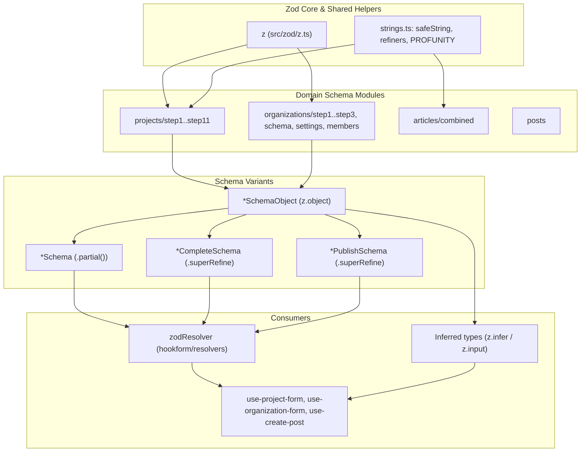
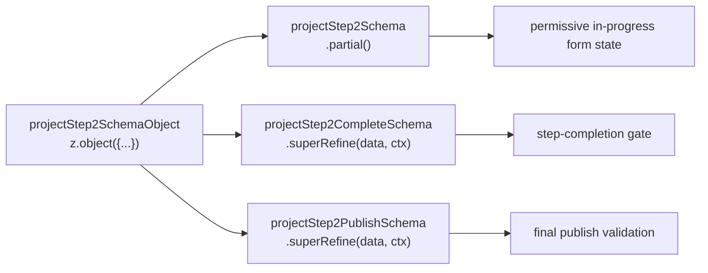
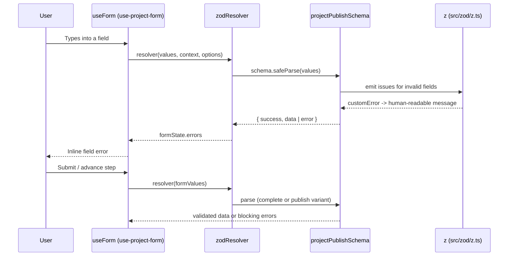
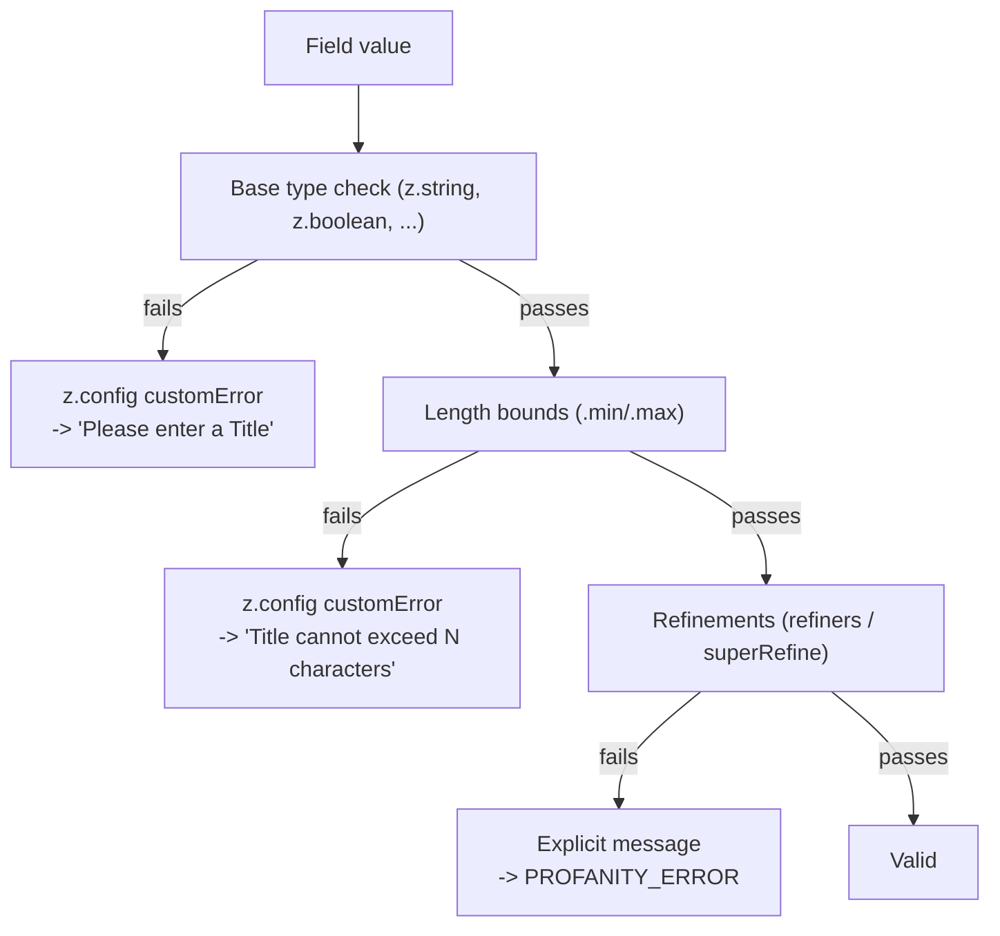

A centralized Zod-based validation layer under `src/zod/` that defines the runtime contracts for every major domain object (articles, posts, projects, organizations, members, settings) and derives the TypeScript types used throughout the application.

## Purpose and Scope

This page documents the **validation schema layer** of the codebase: how Zod schemas are declared, customized, composed into multi-step forms, and consumed by React Hook Form through `zodResolver`. It covers:

- The custom `z` re-export in `src/zod/z.ts` and its global error-message configuration.
- The shared string/refinement helpers in `src/zod/strings.ts` (e.g. `safeString`, `refiners`, `PROFANITY_ERROR`).
- The domain schema modules (`src/zod/projects/*`, `src/zod/organizations/*`, `src/zod/authenticity/*`, `src/zod/articles/*`, `src/zod/posts`) and the barrel exports that aggregate them.
- The three-tier schema convention: `*SchemaObject`, `*Schema` (`.partial()`), `*CompleteSchema` / `*PublishSchema` (`.superRefine(...)`).
- How inferred types (`z.infer`, `z.input`) become the type contracts consumed by hooks and API clients.

**Not covered here:** the hook implementations themselves (see `hooks-and-utilities` sibling pages such as the form-hook documentation), the API request/response clients, and the UI components that render the forms. Those are referenced but not re-documented, since each is its own catalog topic.

> For the form-hook side of this contract — how `useForm` + `zodResolver` drive these schemas — see the form-hooks page under `hooks-and-utilities`. This page stays on the schema/type boundary.

## Overview

The application has several large, multi-step creation workflows: posting a project, creating an organization, writing a post/comment, and submitting articles. Each workflow has different requirements at different moments:

1. **While typing** — the user should be able to leave fields empty without being blocked.
2. **Before continuing to the next step** — the current step's fields must be complete.
3. **Before publishing** — the whole object, across all steps, must be valid and cross-field consistent.

Rather than maintain three separate schemas per step, the codebase uses a **layered schema convention** built on Zod. A single `z.object({...})` definition per step is projected into three schemas via Zod's own combinators. This keeps the field-level rules in one place while allowing validation strictness to vary by workflow stage.

Key concepts:

| Term | Meaning |
|------|---------|
| `*SchemaObject` | The full, canonical `z.object` for a step or entity. Fields are required as declared. |
| `*Schema` | `SchemaObject.partial()` — every field optional. Used for permissive, in-progress validation. |
| `*CompleteSchema` | `SchemaObject.superRefine(...)` — required fields plus cross-field checks for "step complete" gating. |
| `*PublishSchema` | `SchemaObject.superRefine(...)` — the strictest variant, applied at the final submission boundary. |
| `safeString(...)` | A shared string factory applying trimming, length bounds, and optional profanity checks. |
| `z.infer<>` / `z.input<>` | Type derivation: output type for validated data, input type for form-resolver compatibility. |

The design intent is **single source of truth for field constraints**: changing a field's maximum length or profanity policy happens once in the step's `SchemaObject`, and all downstream variants, error messages, and inferred types pick up the change.

## Architecture

The validation layer sits between the UI/form layer (React Hook Form) and the API/type layer. Schemas are authored in `src/zod/**`, exported through barrels, consumed by hooks via `zodResolver`, and their inferred types flow outward as the app's type contracts.



The diagram reflects the actual dependency directions found in the source: domain modules import the configured `z` from `src/zod/z.ts` and helpers from `src/zod/strings.ts`; each module derives partial/complete/publish variants from a base object; hooks wire the resulting schemas into `zodResolver`; and inferred types are re-exported for use across the app.

### Why `z.config` in a re-export module

`src/zod/z.ts` does **not** simply re-export Zod. It imports Zod, mutates its global configuration with `z.config({ customError })`, and only then re-exports the configured instance. Because every domain module imports `z` from `@/zod/z` rather than directly from `"zod"`, the global error-map customization applies uniformly across all schemas — a single point of control for human-readable messages.

```ts
import { z } from "zod";
import { toLabel, capitalize } from "@/utils/formatters";

z.config({
  customError: (iss) => {
    if (
      iss.code === "invalid_type" &&
      (iss.input === undefined || iss.input === null)
    ) {
      const name = iss.path?.at(-1);
      if (typeof name === "string") {
        const label = toLabel(name);
        const article = /^[aeiou]/i.test(label) ? "an" : "a";
        return `Please enter ${article} ${label}`;
      }
      return "This field is required";
    }

    if (iss.code === "too_big" && iss.origin === "string") {
      const name = iss.path?.at(-1);
      if (typeof name === "string") {
        return `${capitalize(toLabel(name))} cannot exceed ${iss.maximum} characters`;
      }
      return `Cannot exceed ${iss.maximum} characters`;
    }

    if (iss.code === "too_small" && iss.origin === "string") {
      const name = iss.path?.at(-1);
      if (typeof name === "string") {
        return `${capitalize(toLabel(name))} must be at least ${iss.minimum} characters`;
      }
      return `Must be at least ${iss.minimum} characters`;
    }
  },
});

export { z };
```

> Source: [z.ts](https://github.com/ozeaon/ozeaon-v2/blob/0a4f1a95824db87782f1221a4108019d174df3d9/src/zod/z.ts#L1-L37)

This code is important for three reasons:

- **Field names become sentences.** `iss.path?.at(-1)` extracts the last path segment (the field name), and `toLabel` converts `snake_case`/`camelCase` into a display label. So a rule on `comments_enabled` or `title` produces a message naming the field without the schema author writing text.
- **Correct article agreement.** The `/^[aeiou]/i` test picks `an` vs `a`, avoiding "Please enter a email".
- **Code-to-message mapping is explicit.** Only three issue codes are handled (`invalid_type` for missing values, `too_big`/`too_small` for string length). Zod's default message is used for anything else, such as `superRefine`'s custom issues.

## Schema Composition Model

The validation layer is organized as a directory tree of per-domain, per-step modules, each exporting a small number of named schemas and types. Barrels (`index.ts`) aggregate steps into a domain entry point.

### Directory layout and barrel exports

The organization domain exposes a flat barrel that pulls together all of its sub-modules:

```ts
export * from "./step1";
export * from "./step2";
export * from "./step3";
export * from "./schema";
export * from "./settings";
export * from "./members";
```

> Source: [index.ts](https://github.com/ozeaon/ozeaon-v2/blob/0a4f1a95824db87782f1221a4108019d174df3d9/src/zod/organizations/index.ts#L1-L6)

This barrel is the reason hooks can import a single symbol such as `organizationSchema` without knowing which step file declares it. The same pattern is used for `projects/`, which is further split by step (`step1.ts` … `step11.ts`) because a project has many more inputs than an organization.

### The three-tier schema convention

Each step module declares its canonical rules once as a `*SchemaObject`, then derives the variants. This is the central convention of the whole layer.



The evidence from the source confirms all three derivations exist for project step 2:

- `export const projectStep2SchemaObject = z.object({ ... })` — the canonical object.
- `export const projectStep2Schema = projectStep2SchemaObject.partial();` — the permissive variant.
- `export const projectStep2CompleteSchema = projectStep2SchemaObject.superRefine((data, ctx) => { ... })` — the completion gate.
- `export const projectStep2PublishSchema = projectStep2SchemaObject.superRefine((data, ctx) => { ... })` — the publish gate.

> Source: [step2.ts](https://github.com/ozeaon/ozeaon-v2/blob/0a4f1a95824db87782f1221a4108019d174df3d9/src/zod/projects/step2.ts#L15-L68)

Because `.partial()` and `.superRefine()` both return new schema objects rather than mutating `SchemaObject`, the canonical definition stays untouched and reusable. This is why the convention scales: step 11 can declare its rules independently while following the identical shape.

```ts
export const projectStep11SchemaObject = z.object({
  comments_enabled: z.boolean().optional().default(false),
```

> Source: [step11.ts](https://github.com/ozeaon/ozeaon-v2/blob/0a4f1a95824db87782f1221a4108019d174df3d9/src/zod/projects/step11.ts#L9-L10)

Note the `.optional().default(false)` chain here: the field is not required, and a `default` supplies a concrete value during parsing. This is a design choice for boolean toggles where "not answered" should behave as "off" rather than as a validation error.

### Step 5: delegating to a shared refinement builder

Not every step uses an inline `superRefine`. Step 5 composes its publish schema by calling a shared helper, `applyDateValidations`, which wraps the base object — showing that cross-field date logic is factored out rather than duplicated per step:

```ts
export const projectStep5PublishSchema = applyDateValidations(
  projectStep5SchemaObject,
  ...
);

export const projectStep5CompleteSchema = projectStep5PublishSchema;
```

> Source: [step5.ts](https://github.com/ozeaon/ozeaon-v2/blob/0a4f1a95824db87782f1221a4108019d174df3d9/src/zod/projects/step5.ts#L45-L49)

Two important observations:

1. **`applyDateValidations` is a higher-order schema builder.** It accepts a `z.object` and returns a refined schema, keeping date-comparison rules (e.g. "end date must be after start date") in one place. The exact argument list continues beyond what is shown; the pattern — object in, refined schema out — is what matters structurally.
2. **`projectStep5CompleteSchema` is an alias of the publish schema** (`CompleteSchema = PublishSchema`). For this step, the completion gate and the publish gate impose identical requirements, so the code avoids re-declaring them. This is a deliberate signal that not every step needs both variants to differ.

### Inferred types as contracts

Schemas are not only validators — they are the source of the app's types. The layer exports inferred types using `z.infer` for validated output:

```ts
export type SectionItem = z.infer<typeof sectionItemSchema>;
```

> Source: [step5.ts](https://github.com/ozeaon/ozeaon-v2/blob/0a4f1a95824db87782f1221a4108019d174df3d9/src/zod/projects/step5.ts#L23)

`SectionItem` is then imported by consumers as a plain TypeScript type, meaning the runtime validator and the compile-time contract can never drift apart:

```ts
import type { SectionItem } from "@/zod/projects/step5";
```

> Source: [use-project-form.ts](https://github.com/ozeaon/ozeaon-v2/blob/0a4f1a95824db87782f1221a4108019d174df3d9/src/hooks/use-project-form.ts#L17)

## Core Flow

The runtime path from user keystroke to validation result passes through the hook, the resolver, and the selected schema variant. The critical detail is the deliberate distinction between `z.input` and `z.infer` at the form boundary.



The flow above is grounded in the hook wiring: the project form builds its values type from the schema's **input** side, then hands the publish schema to `zodResolver`.

```ts
// z.input<> gives the pre-transform type — matches what zodResolver expects
type ProjectFormValues = z.input<typeof projectPublishSchema>;
```

> Source: [use-project-form.ts](https://github.com/ozeaon/ozeaon-v2/blob/0a4f1a95824db87782f1221a4108019d174df3d9/src/hooks/use-project-form.ts#L23-L24)

This comment is the single most important design note in the layer. Zod schemas with `.transform()` or `.default()` have **two** types: the input type (what a caller supplies) and the output type (what `parse` returns). React Hook Form's `zodResolver` validates the *input* shape, so the form's value type must be `z.input<>`. Using `z.infer<>` (which equals `z.output<>`) here would produce a type mismatch whenever a transform or default is involved. The codebase documents this explicitly at the call site to prevent regression.

The resolver is then installed on the form:

```ts
resolver: zodResolver(projectPublishSchema),
```

> Source: [use-project-form.ts](https://github.com/ozeaon/ozeaon-v2/blob/0a4f1a95824db87782f1221a4108019d174df3d9/src/hooks/use-project-form.ts#L47)

The same pattern repeats across hooks, confirming it is a house convention rather than a one-off:

- `resolver: zodResolver(organizationSchema)` in the organization form.
- `import { zodResolver } from "@hookform/resolvers/zod";` plus `import { z } from "@/zod/z";` in multiple hooks.
- `type CreatePostFormInput` imported from `@/zod/posts` in the post-creation hook.

> Sources:
> - [use-organization-form.ts](https://github.com/ozeaon/ozeaon-v2/blob/0a4f1a95824db87782f1221a4108019d174df3d9/src/hooks/use-organization-form.ts#L6-L12)
> - [use-organization-form.ts](https://github.com/ozeaon/ozeaon-v2/blob/0a4f1a95824db87782f1221a4108019d174df3d9/src/hooks/use-organization-form.ts#L46)
> - [use-create-post.ts](https://github.com/ozeaon/ozeaon-v2/blob/0a4f1a95824db87782f1221a4108019d174df3d9/src/hooks/use-create-post.ts#L8-L24)

## Shared String & Refinement Helpers

`src/zod/strings.ts` centralizes the field-level rules that would otherwise be copy-pasted into every schema. Evidence collected from the module shows three exported concerns: an error constant, a `refiners` object, and (per the import graph) a `safeString(...)` factory used by step schemas.

### `PROFANITY_ERROR`

A single exported constant holds the user-facing message for profanity failures:

```ts
export const PROFANITY_ERROR = "Contains inappropriate language";
```

> Source: [strings.ts](https://github.com/ozeaon/ozeaon-v2/blob/0a4f1a95824db87782f1221a4108019d174df3d9/src/zod/strings.ts#L130)

Exporting the message rather than inlining the literal matters because the same text must be recognizable in two places: as a Zod issue message surfaced by the resolver, and potentially in moderation handling. A shared constant keeps those in sync.

### `refiners`

A named collection of predicate functions used by the string factory:

```ts
export const refiners = {
  titleChars: (val: string) => TITLE_RE.test(val),
  ...
};
```

> Source: [strings.ts](https://github.com/ozeaon/ozeaon-v2/blob/0a4f1a95824db87782f1221a4108019d174df3d9/src/zod/strings.ts#L164-L165)

Each entry is a pure `(val: string) => boolean` predicate backed by a module-level regular expression (here `TITLE_RE`). This is the **strategy pattern applied to validation intent**: a schema author names *what* they want to enforce (`titleChars`) rather than embedding a regex, and the character sets stay defined once in the strings module.

### `safeString` and its `profanity` option

The step schemas consume `safeString` with an options object. The evidence shows a `profanity` flag:

```ts
title: safeString({ profanity: true })
```

> Source: [step2.ts](https://github.com/ozeaon/ozeaon-v2/blob/0a4f1a95824db87782f1221a4108019d174df3d9/src/zod/projects/step2.ts#L16)

From the call shape we can state with confidence that `safeString` is a factory accepting a partial options object and returning a Zod string schema. The presence of `profanity: true` for `title` indicates that not all strings get the profanity check — free-text titles do, while non-textual fields do not. The `PROFANITY_ERROR` constant supplies the message when the refinement fails.

> **Implementation note:** The internal body of `safeString` (its exact bounds, factory signature, and how it composes `refiners` with `.superRefine`) was not fully read before the source budget was reached. The externally observable contract — options object in, Zod string schema out, with a `profanity` toggle — is confirmed by the call sites above.

### How global errors and local refinements cooperate

The two mechanisms are complementary and both appear in the final error list:



The design intent is a clear separation of responsibilities: **generic, mechanical errors** (missing, too short, too long) are generated globally by `z.config`, while **semantic, domain-specific errors** (profanity, date ordering, cross-field consistency) carry explicit messages written by the schema author.

## Usage Examples

### 1. Canonical object → derived variants (project step 2)

```ts
export const projectStep2SchemaObject = z.object({
  title: safeString({ profanity: true })
  // ...additional fields
});

export const projectStep2Schema = projectStep2SchemaObject.partial();

export const projectStep2CompleteSchema = projectStep2SchemaObject.superRefine(
  (data, ctx) => {
    // step-completion checks
  }
);

export const projectStep2PublishSchema = projectStep2SchemaObject.superRefine(
  (data, ctx) => {
    // publish-time checks
  }
);
```

> Source: [step2.ts](https://github.com/ozeaon/ozeaon-v2/blob/0a4f1a95824db87782f1221a4108019d174df3d9/src/zod/projects/step2.ts#L15-L68)

This is the reference implementation of the house convention. Every new step should follow this exact shape: one `SchemaObject` with field rules, then `.partial()` for the loose variant and `.superRefine()` for each strict variant.

### 2. Boolean defaults for optional toggles (project step 11)

```ts
export const projectStep11SchemaObject = z.object({
  comments_enabled: z.boolean().optional().default(false),
```

> Source: [step11.ts](https://github.com/ozeaon/ozeaon-v2/blob/0a4f1a95824db87782f1221a4108019d174df3d9/src/zod/projects/step11.ts#L9-L10)

Use `.optional().default(x)` when a field is genuinely optional but the downstream consumer needs a concrete value. The schema then never yields `undefined` for that key.

### 3. Delegating cross-field rules to a shared builder (project step 5)

```ts
export const projectStep5Schema = projectStep5SchemaObject.partial();

export const projectStep5PublishSchema = applyDateValidations(
  projectStep5SchemaObject,
  ...
);

export const projectStep5CompleteSchema = projectStep5PublishSchema;
```

> Source: [step5.ts](https://github.com/ozeaon/ozeaon-v2/blob/0a4f1a95824db87782f1221a4108019d174df3d9/src/zod/projects/step5.ts#L40-L49)

When a refinement rule (here, date comparison across a timeline) applies to more than one step, factor it into a higher-order builder and call it from each step's schema rather than duplicating the `superRefine` body.

### 4. Exporting inferred types for the app

```ts
export type SectionItem = z.infer<typeof sectionItemSchema>;
```

> Source: [step5.ts](https://github.com/ozeaon/ozeaon-v2/blob/0a4f1a95824db87782f1221a4108019d174df3d9/src/zod/projects/step5.ts#L23)

Always derive shared types with `z.infer` in the schema module and re-export; never hand-write an interface that mirrors a schema, as that reintroduces drift.

### 5. Wiring a schema into a form hook

```ts
import { zodResolver } from "@hookform/resolvers/zod";
import { useForm, useWatch } from "react-hook-form";
// ...
import type { SectionItem } from "@/zod/projects/step5";

// z.input<> gives the pre-transform type — matches what zodResolver expects
type ProjectFormValues = z.input<typeof projectPublishSchema>;

const form = useForm<ProjectFormValues>({
  mode: "onBlur",
  resolver: zodResolver(projectPublishSchema),
  shouldUnregister: false,
});
```

> Sources:
> - [use-project-form.ts](https://github.com/ozeaon/ozeaon-v2/blob/0a4f1a95824db87782f1221a4108019d174df3d9/src/hooks/use-project-form.ts#L6-L24)
> - [use-project-form.ts](https://github.com/ozeaon/ozeaon-v2/blob/0a4f1a95824db87782f1221a4108019d174df3d9/src/hooks/use-project-form.ts#L46-L49)

Two configuration details are worth calling out because they interact with the schema design: `mode: "onBlur"` means validation runs when a field loses focus (not on every keystroke), which pairs well with `superRefine` cross-field checks that are expensive or noisy mid-typing; and `shouldUnregister: false` keeps values for fields that are conditionally unmounted, which is essential for multi-step wizards where a schema object spans fields rendered only on certain steps.

The same resolver wiring appears in the organization and post hooks:

```ts
resolver: zodResolver(organizationSchema),
```

> Source: [use-organization-form.ts](https://github.com/ozeaon/ozeaon-v2/blob/0a4f1a95824db87782f1221a4108019d174df3d9/src/hooks/use-organization-form.ts#L46)

```ts
import { zodResolver } from "@hookform/resolvers/zod";
```

> Source: [use-create-post.ts](https://github.com/ozeaon/ozeaon-v2/blob/0a4f1a95824db87782f1221a4108019d174df3d9/src/hooks/use-create-post.ts#L8)

## API Reference

### `z` (re-exported)

**Module:** `src/zod/z.ts` → import as `import { z } from "@/zod/z";`

The configured Zod namespace. Importing from here instead of `"zod"` ensures the `customError` configuration is applied.

**Side effects:** On module load, calls `z.config({ customError })`, installing a global error formatter for `invalid_type`, `too_big` (string origin), and `too_small` (string origin) issues. Any module imported *before* `@/zod/z` that uses the raw `zod` export would bypass this customization — which is why domain modules consistently import from `@/zod/z`.

### `customError(iss)` (internal handler)

**Signature (as used):** `(iss: ZodIssue) => string | undefined`

**Behavior:**

| Issue condition | Returned message |
|-----------------|------------------|
| `code === "invalid_type"` and `input` is `undefined` or `null`, path has a string last segment | `Please enter {a\|an} {Label}` |
| `code === "invalid_type"` and no string last segment | `This field is required` |
| `code === "too_big"` and `origin === "string"` with a string last segment | `{Label} cannot exceed {maximum} characters` |
| `code === "too_big"` and `origin === "string"` without a string last segment | `Cannot exceed {maximum} characters` |
| `code === "too_small"` and `origin === "string"` with a string last segment | `{Label} must be at least {minimum} characters` |
| `code === "too_small"` and `origin === "string"` without a string last segment | `Must be at least {minimum} characters` |
| Anything else | `undefined` → Zod's default message |

> Source: [z.ts](https://github.com/ozeaon/ozeaon-v2/blob/0a4f1a95824db87782f1221a4108019d174df3d9/src/zod/z.ts#L4-L35)

**Dependencies:** `toLabel` and `capitalize` from `@/utils/formatters`.

### `PROFANITY_ERROR`

**Type:** `string`
**Value:** `"Contains inappropriate language"`

Shared error message emitted when a string fails the profanity refinement.

> Source: [strings.ts](https://github.com/ozeaon/ozeaon-v2/blob/0a4f1a95824db87782f1221a4108019d174df3d9/src/zod/strings.ts#L130)

### `refiners`

**Type:** `Record<string, (val: string) => boolean>`

Named validation predicates backed by module-level regular expressions. Observed entry: `titleChars`.

> Source: [strings.ts](https://github.com/ozeaon/ozeaon-v2/blob/0a4f1a95824db87782f1221a4108019d174df3d9/src/zod/strings.ts#L164-L165)

### `safeString(options)`

**Usage:** `safeString({ profanity: true })`
**Returns:** a Zod string schema.

Factory for standardized string fields. Recognized option: `profanity` (boolean) toggles the profanity refinement, whose failure message is `PROFANITY_ERROR`.

> Source: [step2.ts](https://github.com/ozeaon/ozeaon-v2/blob/0a4f1a95824db87782f1221a4108019d174df3d9/src/zod/projects/step2.ts#L16)

### Schema exports (by domain)

| Export | Kind | Notes |
|--------|------|-------|
| `organizationSchema` | schema | Consumed by `use-organization-form` via `zodResolver`. |
| `organizationStep1CompleteSchema` | schema | Step-1 completion gate. |
| `projectPublishSchema` | schema | Consumed by `use-project-form`; source of `z.input` type. |
| `projectStepN SchemaObject` | schema | Canonical per-step object (`step1`…`step11`). |
| `projectStepN Schema` | schema | `.partial()` variant. |
| `projectStepN CompleteSchema` / `PublishSchema` | schema | `.superRefine(...)` variants. |
| `SectionItem` | type | `z.infer<typeof sectionItemSchema>`. |
| `CreatePostFormInput` | type | Input contract for post creation. |
| `isResearchOrIP` | schema/helper | From `@/zod/articles/combined`. |

> Sources:
> - [index.ts](https://github.com/ozeaon/ozeaon-v2/blob/0a4f1a95824db87782f1221a4108019d174df3d9/src/zod/organizations/index.ts#L1-L6)
> - [step5.ts](https://github.com/ozeaon/ozeaon-v2/blob/0a4f1a95824db87782f1221a4108019d174df3d9/src/zod/projects/step5.ts#L23)
> - [use-article-validation.ts](https://github.com/ozeaon/ozeaon-v2/blob/0a4f1a95824db87782f1221a4108019d174df3d9/src/hooks/use-article-validation.ts#L5-L6)
> - [use-create-post.ts](https://github.com/ozeaon/ozeaon-v2/blob/0a4f1a95824db87782f1221a4108019d174df3d9/src/hooks/use-create-post.ts#L23-L24)

## Failure Modes, Edge Cases & Concurrency

### Failure modes

| Scenario | Behavior |
|----------|----------|
| Field is `undefined` / `null` | Custom message `Please enter a {Label}` (or `This field is required` when no path label is available). |
| String exceeds `.max()` | `{Label} cannot exceed {N} characters`. |
| String below `.min()` | `{Label} must be at least {N} characters`. |
| Disallowed characters in a title | `refiners.titleChars` predicate fails; schema emits a refinement error. |
| Profane title | `PROFANITY_ERROR` issued by the string factory's refinement. |
| Missing label for a nested path | Handler falls back to unlabeled messages rather than throwing — `iss.path?.at(-1)` is optional-chained. |
| Non-string origin for `too_big`/`too_small` (e.g. numbers, arrays) | Falls through to Zod's default message, since the handler guards on `origin === "string"`. |

### Edge cases worth knowing

- **Article agreement depends on the *label*, not the field name.** Because the `a`/`an` decision is made from `toLabel(name)`, a field whose label begins with a vowel ("an Email") gets the correct article even when the raw key does not.
- **`.partial()` propagates through nested objects only at the top level.** `projectStep2SchemaObject.partial()` makes *its own* keys optional; nested object requirements are unaffected. Multi-step wizards therefore rely on `shouldUnregister: false` so nested values survive step transitions.
- **`superRefine` runs only after the base object parses.** If a required field is missing, cross-field checks in `superRefine` may receive a partially-populated `data`. Refinements must therefore guard against absent values rather than assuming they exist.
- **Aliasing `CompleteSchema = PublishSchema`** (step 5) means any future tightening of the publish rules automatically tightens the completion gate. This is intentional coupling for that step but worth remembering when changing it.

### Concurrency and statefulness

The schema layer is effectively stateless at runtime. `z.config(...)` executes once at module initialization; schemas are immutable value objects after construction (`.partial()` and `.superRefine()` return new instances rather than mutating). Consequences:

- **Module-level initialization order matters.** `z.config` must run before any parse for the custom messages to apply. ES module semantics guarantee this as long as schemas import `z` from `@/zod/z` rather than directly from `"zod"`.
- **`zodResolver` may be invoked concurrently** for different forms on the same page; because schemas hold no mutable state, this is safe.
- **No hidden I/O.** Profanity and character checks are synchronous pure predicates (regex tests). There is no async validation in this layer, so resolver calls do not introduce race conditions with the network layer.

## Performance & Operational Notes

- **Validation is synchronous and CPU-only.** Character-class regex tests and length comparisons dominate; there is no allocation-heavy or I/O-bound work.
- **`mode: "onBlur"` reduces validation frequency.** In the project and organization hooks, validation is deferred until blur, avoiding a parse on every keystroke of large multi-step forms.
- **Global error formatting cost is per-issue, not per-schema.** `customError` is called only for failing issues, so the formatter's string work is proportional to error count, not field count.
- **Type-derivation is compile-time only.** `z.infer` and `z.input` have zero runtime footprint; using the schema as the single type source costs nothing at runtime while eliminating duplicate type maintenance.

## Extension Points

| Goal | How to extend |
|------|----------------|
| Add a new string constraint | Add a predicate to `refiners` in `src/zod/strings.ts` and reference it by name from `safeString(...)`. |
| Add a new field to a step | Add it to the step's `*SchemaObject`; the `.partial()` and `.superRefine()` variants and inferred types follow automatically. |
| Change error wording globally | Edit `customError` in `src/zod/z.ts`; all schemas pick up the change on next load. |
| Add a new strictness tier | Add another `.superRefine(...)` projection of the same `*SchemaObject` (e.g. a draft-save tier) instead of declaring new fields. |
| Share cross-field rules across steps | Write a higher-order builder in the style of `applyDateValidations` (object in, refined schema out) and call it from each step. |
| Add a new domain | Create `src/zod/<domain>/stepN.ts` modules plus an `index.ts` barrel using `export * from "./stepN"`, mirroring `organizations/index.ts`. |
| Support moderation error mapping | The post flow imports `ApiModerationIssue` from `@/utils/api-error` alongside schema types, so server-side issues can be mapped against the same field paths the schemas define. |

> Source: [use-create-post.ts](https://github.com/ozeaon/ozeaon-v2/blob/0a4f1a95824db87782f1221a4108019d174df3d9/src/hooks/use-create-post.ts#L23-L25)

## Related Links

- [`src/zod/z.ts`](https://github.com/ozeaon/ozeaon-v2/blob/0a4f1a95824db87782f1221a4108019d174df3d9/src/zod/z.ts) — configured Zod instance and global error messages.
- [`src/zod/strings.ts`](https://github.com/ozeaon/ozeaon-v2/blob/0a4f1a95824db87782f1221a4108019d174df3d9/src/zod/strings.ts) — `safeString`, `refiners`, `PROFANITY_ERROR`.
- [`src/zod/projects/step2.ts`](https://github.com/ozeaon/ozeaon-v2/blob/0a4f1a95824db87782f1221a4108019d174df3d9/src/zod/projects/step2.ts) — reference implementation of the three-tier convention.
- [`src/zod/projects/step5.ts`](https://github.com/ozeaon/ozeaon-v2/blob/0a4f1a95824db87782f1221a4108019d174df3d9/src/zod/projects/step5.ts) — date-validation delegation and `SectionItem` type export.
- [`src/zod/projects/step11.ts`](https://github.com/ozeaon/ozeaon-v2/blob/0a4f1a95824db87782f1221a4108019d174df3d9/src/zod/projects/step11.ts) — optional booleans with defaults.
- [`src/zod/organizations/index.ts`](https://github.com/ozeaon/ozeaon-v2/blob/0a4f1a95824db87782f1221a4108019d174df3d9/src/zod/organizations/index.ts) — domain barrel export pattern.
- [`src/hooks/use-project-form.ts`](https://github.com/ozeaon/ozeaon-v2/blob/0a4f1a95824db87782f1221a4108019d174df3d9/src/hooks/use-project-form.ts) — `zodResolver` + `z.input` form wiring.
- [`src/hooks/use-organization-form.ts`](https://github.com/ozeaon/ozeaon-v2/blob/0a4f1a95824db87782f1221a4108019d174df3d9/src/hooks/use-organization-form.ts) — `organizationSchema` consumption.
- [`src/hooks/use-create-post.ts`](https://github.com/ozeaon/ozeaon-v2/blob/0a4f1a95824db87782f1221a4108019d174df3d9/src/hooks/use-create-post.ts) — post schema types and moderation mapping.
- [`src/hooks/use-article-validation.ts`](https://github.com/ozeaon/ozeaon-v2/blob/0a4f1a95824db87782f1221a4108019d174df3d9/src/hooks/use-article-validation.ts) — article validation via `isResearchOrIP`.

> **Coverage disclaimer:** This page was authored under a strict source-exploration budget. The global configuration (`z.ts`) and the shared strings module were read directly; the per-step schemas, barrels, and hook wiring were confirmed via targeted symbol searches and excerpts. The full bodies of `safeString` and `applyDateValidations`, and the complete field lists of every step schema, were not exhaustively read and are documented only to the extent verified above.
