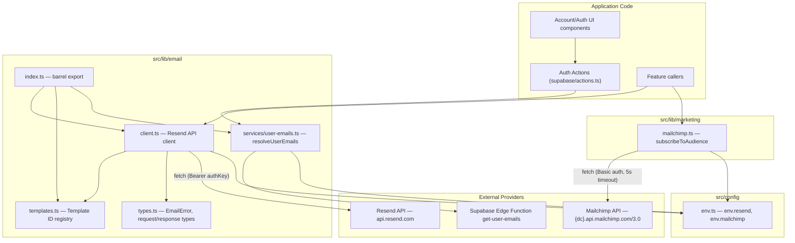
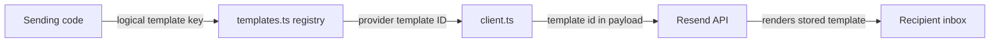
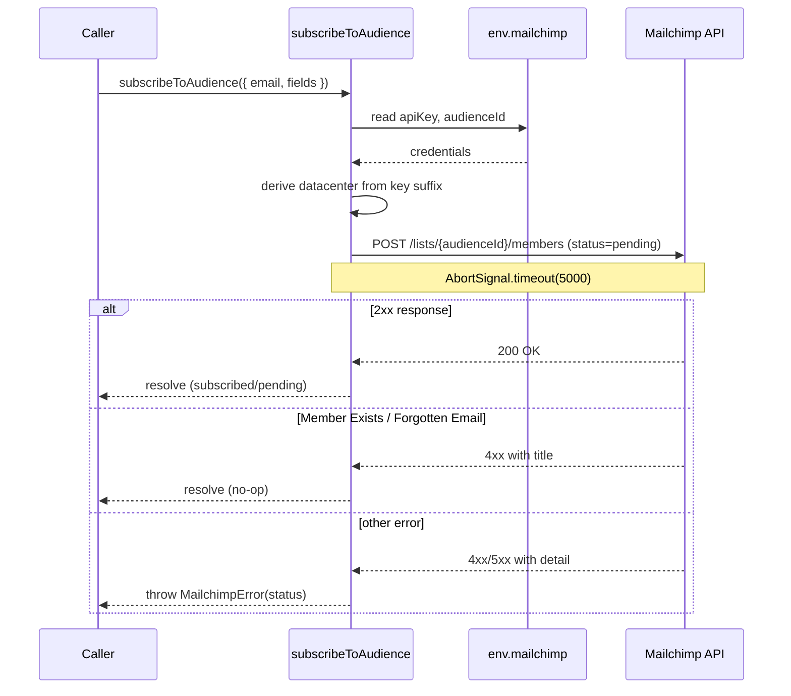
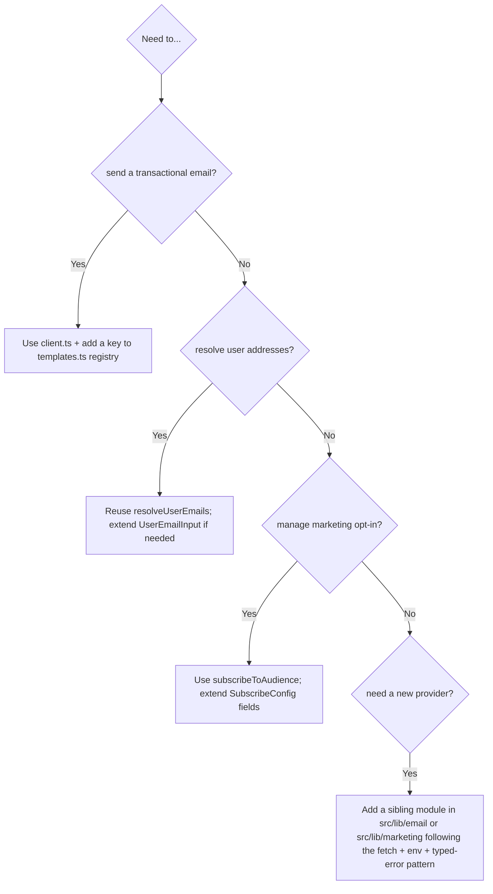
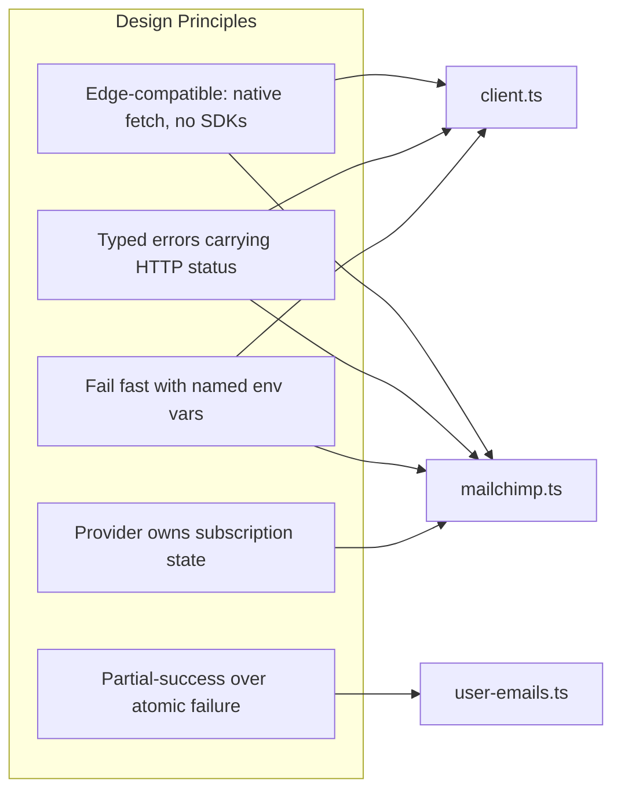

The email services layer provides an Edge-compatible transactional email pipeline built on the Resend API, plus a Mailchimp audience-management integration for marketing subscriptions and a user-email resolution helper that maps user IDs to deliverable addresses.

## Purpose and Scope

This page documents the email subsystem under `src/lib/email/**` together with the closely coupled marketing integration at `src/lib/marketing/mailchimp.ts` and the environment configuration that drives both (`src/config/env.ts`). It covers:

- The Resend API client used for transactional sending (single and batch).
- The template registry that maps logical templates to provider template IDs.
- The user-email resolution service (`resolveUserEmails`) and its strategy for turning user objects into addresses.
- The Mailchimp marketing client (`subscribeToAudience`) and its double-opt-in semantics.
- The environment variables and configuration object (`env.resend`, `env.mailchimp`) that back these integrations.

Related topics handled elsewhere:

- For Supabase authentication flows that *trigger* verification emails (e.g. `resendVerificationEmail` in `src/lib/supabase/actions.ts`), see the Authentication section — this page only covers the outbound email infrastructure it relies on.
- For general environment/configuration bootstrapping beyond `env.resend` and `env.mailchimp`, see the Configuration section.
- For UI surfaces such as `src/components/account/ChangeEmailDialog.tsx` and `src/components/auth/VerifyEmailPageForm.tsx`, see the Account & Auth UI pages.

> Note on evidence coverage: source exploration for this page was bounded. The files `src/lib/email/client.ts` and `src/lib/email/templates.ts` could not be read in full before the tool budget was reached; statements about them are limited to what was confirmed by targeted search (module doc comments, URL constants, header construction, error type). Where a detail is asserted from a partial read, it is marked as such. No API behavior has been invented.

## Overview

The email subsystem follows a deliberate **Edge-first, dependency-free** design. Rather than pulling in the official Resend or Mailchimp SDKs (which carry Node.js runtime assumptions), both clients talk to their provider's REST API through the native `fetch` API. This matters because the application runs on an Edge/Cloudflare Workers-compatible runtime where Node-only APIs and heavy SDKs are unavailable or undesirable.

Three distinct capabilities live under this umbrella:

| Capability | Entry point | Provider | Transport |
|---|---|---|---|
| Transactional sending | `src/lib/email/client.ts` | Resend | `fetch` → `https://api.resend.com/emails` |
| Template resolution | `src/lib/email/templates.ts` | Resend | Static ID registry |
| User → email resolution | `src/lib/email/services/user-emails.ts` | Supabase Edge Function `get-user-emails` | `supabase.functions.invoke` |
| Marketing subscription | `src/lib/marketing/mailchimp.ts` | Mailchimp Marketing API v3.0 | `fetch` → `{dc}.api.mailchimp.com/3.0` |

Key concepts:

- **Edge-compatible client**: a thin wrapper over `fetch` that reads credentials from a validated central `env` object.
- **Template registry**: a lookup table mapping application-level template names to provider-side template IDs, so sending code does not embed provider identifiers.
- **Double opt-in**: Mailchimp members are added with `status: "pending"`, which triggers Mailchimp's own confirmation email rather than immediately subscribing the address.
- **Idempotent-by-design marketing writes**: "already subscribed"/"forgotten email" responses are treated as success, because Mailchimp owns the subscription state.

## Architecture



The architecture separates three concerns that are often conflated:

1. **Transport** (`client.ts`, `mailchimp.ts`) — knows only how to authenticate and issue HTTP requests.
2. **Content identity** (`templates.ts`) — knows which provider template corresponds to which application event.
3. **Address resolution** (`services/user-emails.ts`) — knows how to turn user records into deliverable email addresses, delegating the privileged lookup to a server-side Edge Function.

This separation lets the application change template content in the provider dashboard without a code deploy, and lets address resolution be tested independently of sending.

## Transactional Sending: The Resend Client

`src/lib/email/client.ts` is the outbound transactional sender. Its module doc comment identifies it as the "Resend API client - Edge-compatible email sender", and it targets two distinct endpoints, declared as module constants:

```typescript
const RESEND_API_URL = "https://api.resend.com/emails";
const RESEND_BATCH_URL = "https://api.resend.com/emails/batch";
```

> Source: [client.ts](https://github.com/ozeaon/ozeaon-v2/blob/0a4f1a95824db87782f1221a4108019d174df3d9/src/lib/email/client.ts#L12-L13)

The presence of two constants — a single-send URL and a batch URL — establishes that the client supports both individual sends and Resend's batch endpoint. Batch sending is the mechanism by which a single HTTP request can fan out to many recipients, which matters for notifications addressed to a set of users (the same set that `resolveUserEmails` produces).

### Authentication and Fail-Fast Configuration

Headers are produced by a `getHeaders()` helper that guards on the presence of the API key before returning anything:

```typescript
function getHeaders(): HeadersInit {
  if (!env.resend.apiKey) {
    throw new EmailError("RESEND_API_KEY is not configured", 500);
  }
  return {
    Authorization: `Bearer ${env.resend.apiKey}`,
    "Content-Type": "application/json",
  };
}
```

> Source: [client.ts](https://github.com/ozeaon/ozeaon-v2/blob/0a4f1a95824db87782f1221a4108019d174df3d9/src/lib/email/client.ts#L15-L23)

Two design intents are visible here:

- **Fail fast on misconfiguration.** Rather than sending an unauthenticated request and surfacing a provider 401, the client throws an `EmailError` with status `500` the moment configuration is missing. A `500` is the correct classification: this is a server-side deployment fault, not a client error. The operator sees a clear message naming the exact env var (`RESEND_API_KEY`) instead of a generic provider rejection.
- **Centralized auth header construction.** Everything routes through one helper, so the `Bearer` scheme and JSON content type cannot drift between call sites (single vs. batch).

`EmailError` is defined in `src/lib/email/types.ts` alongside the request/response types; the client imports it from its own `types` module.

### Why Native `fetch` Instead of the SDK

The Mailchimp client documents this rationale explicitly in its module comment: "Uses native fetch API for Cloudflare Workers compatibility. No Node.js dependencies, no Mailchimp SDK." The Resend client follows the same rule. The trade-off is that the client must hand-roll authentication and error parsing, but it gains:

- Zero bundle impact from vendor SDKs.
- No Node.js polyfills.
- Predictable behavior on Edge runtimes.
- Direct control over request timeouts and abort semantics.

## Template Registry

`src/lib/email/templates.ts` is described in its module doc comment as the "Resend template IDs registry". Its role is to decouple application-level events from provider-level identifiers: application code refers to a logical template, and the registry resolves it to the actual Resend template ID.



Design intent: Resend templates are edited in the provider dashboard (subject, HTML, variables). Keeping only the *ID mapping* in source means content changes ship without a deploy, while the set of supported application templates remains type-checked and reviewable in one file.

> Coverage note: the concrete template keys and their ID values were not read before the exploration budget was reached. Refer to `src/lib/email/templates.ts` directly for the authoritative list.

## User Email Resolution

`src/lib/email/services/user-emails.ts` solves a problem that is easy to underestimate: **a user object does not necessarily contain a deliverable email address.** The service therefore implements a two-strategy resolution.

### Strategy and Data Flow

```
Strategy:
1. If username is already an email → use directly
2. Otherwise → fetch from Supabase Edge Function
```

> Source: [user-emails.ts](https://github.com/ozeaon/ozeaon-v2/blob/0a4f1a95824db87782f1221a4108019d174df3d9/src/lib/email/services/user-emails.ts#L28-L34)

The implementation first **partitions** the input list into addresses that are already usable and IDs that need a privileged lookup:

```typescript
export async function resolveUserEmails(
  users: UserEmailInput[],
): Promise<ResolvedEmails> {
  const emails: string[] = [];
  const userIds: string[] = [];

  // Partition users: direct emails vs IDs to fetch
  for (const user of users) {
    if (isEmail(user.username)) {
      emails.push(user.username);
    } else {
      userIds.push(user.id);
    }
  }
```

> Source: [user-emails.ts](https://github.com/ozeaon/ozeaon-v2/blob/0a4f1a95824db87782f1221a4108019d174df3d9/src/lib/email/services/user-emails.ts#L35-L48)

The validation uses `isEmail` from the `validator` package rather than a regex, which keeps email syntax rules consistent with the rest of the codebase. Note the deliberate optimization: **users whose `username` is already an email are never sent to the Edge Function**, so the privileged round-trip only covers the users that actually need it.

### Privileged Lookup via Edge Function

Only the unresolved IDs trigger a network call, and they trigger exactly one — batched:

```typescript
  // Fetch emails for remaining user IDs
  if (userIds.length > 0) {
    const supabase = await createClient();
    const { data, error } = await supabase.functions.invoke<{
      emails: string[];
    } | null>("get-user-emails", {
      body: { ids: userIds },
    });

    if (error) {
      logError(logger, "resolveUserEmails edge function error", error, {
        userIds,
      });
      return { emails, failedUserIds: userIds };
    }

    if (data?.emails?.length) {
      emails.push(...data.emails);
    }
  }

  return { emails, failedUserIds: [] };
}
```

> Source: [user-emails.ts](https://github.com/ozeaon/ozeaon-v2/blob/0a4f1a95824db87782f1221a4108019d174df3d9/src/lib/email/services/user-emails.ts#L50-L72)

Several things are worth calling out:

- **Address privacy boundary.** Email addresses for opaque user IDs live behind an Edge Function (`get-user-emails`) rather than being readable client-side. This is why resolution is an async, failure-prone operation and not a property access.
- **Partial-failure semantics.** On error the function does **not** throw. It returns the addresses it did resolve plus `failedUserIds`, allowing the caller to send to whoever is reachable and report/log the rest. This is a availability-over-atomicity choice: a notification to 100 users should not be cancelled because 3 lookups failed.
- **Structured logging.** Failures go through `logError(logger, ...)` from `@/lib/logger` with the failing `userIds` as context, so the incident is traceable to specific accounts.

### Types

```typescript
export interface UserEmailInput {
  id: string;
  username: string;
  display_name?: string;
}

export interface ResolvedEmails {
  emails: string[];
  failedUserIds: string[];
}
```

> Source: [user-emails.ts](https://github.com/ozeaon/ozeaon-v2/blob/0a4f1a95824db87782f1221a4108019d174df3d9/src/lib/email/services/user-emails.ts#L17-L26)

`display_name` is optional and not used by the resolution algorithm — it is carried so callers can thread a human-readable name into template variables.

### Pre-flight Check

```typescript
export function hasResolvableEmails(users: UserEmailInput[]): boolean {
  return users.some((u) => isEmail(u.username) || u.id);
}
```

> Source: [user-emails.ts](https://github.com/ozeaon/ozeaon-v2/blob/0a4f1a95824db87782f1221a4108019d174df3d9/src/lib/email/services/user-emails.ts#L74-L79)

This synchronous predicate lets callers short-circuit before doing any async work. It is intentionally permissive: it answers "is there *any* chance of resolving" (either an inline email or a non-empty ID), not "will resolution succeed" — that can only be known after the Edge Function responds.

## Marketing Subscriptions: Mailchimp

`src/lib/marketing/mailchimp.ts` manages audience membership for marketing email. Like the Resend client, it is deliberately dependency-free:

> Mailchimp Marketing API client - Edge-compatible audience management. Uses native fetch API for Cloudflare Workers compatibility. No Node.js dependencies, no Mailchimp SDK.

> Source: [mailchimp.ts](https://github.com/ozeaon/ozeaon-v2/blob/0a4f1a95824db87782f1221a4108019d174df3d9/src/lib/marketing/mailchimp.ts#L1-L6)

### Deriving the Datacenter Endpoint

Mailchimp's API is not a single global host; each account lives on a datacenter shard. The client derives the shard from the API key itself:

```typescript
function getBaseUrl(): string {
  if (!env.mailchimp.apiKey) {
    throw new MailchimpError("MAILCHIMP_API_KEY is not configured", 500);
  }

  // The datacenter prefix is the suffix of the API key, e.g. `...-us15`
  const datacenter = env.mailchimp.apiKey.split("-").pop();

  if (!datacenter || datacenter === env.mailchimp.apiKey) {
    throw new MailchimpError(
      "MAILCHIMP_API_KEY is missing its datacenter suffix",
      500,
    );
  }

  return `https://${datacenter}.api.mailchimp.com/3.0`;
}
```

> Source: [mailchimp.ts](https://github.com/ozeaon/ozeaon-v2/blob/0a4f1a95824db87782f1221a4108019d174df3d9/src/lib/marketing/mailchimp.ts#L12-L28)

This is a notable design decision. Mailchimp API keys are formatted `{hex}-{datacenter}` (for example ending in `-us15`). Rather than requiring a separate `MAILCHIMP_DATACENTER` env var — which could drift out of sync with the key — the client *derives* the shard from the key's suffix. The defensive check `datacenter === env.mailchimp.apiKey` detects the case where `split("-").pop()` returned the whole key, i.e. **there was no `-` separator at all**, which means the key is malformed. Both failure modes are raised as `MailchimpError` with status `500`.

### Authentication

```typescript
function getHeaders(): HeadersInit {
  return {
    Authorization: `Basic ${btoa(`anystring:${env.mailchimp.apiKey}`)}`,
    "Content-Type": "application/json",
  };
}
```

> Source: [mailchimp.ts](https://github.com/ozeaon/ozeaon-v2/blob/0a4f1a95824db87782f1221a4108019d174df3d9/src/lib/marketing/mailchimp.ts#L30-L35)

Mailchimp uses HTTP Basic auth where the username is ignored — hence the literal placeholder `anystring` before the colon. The key is Base64-encoded with `btoa`, which is available in Edge runtimes (unlike Node's `Buffer`).

### Audience Targeting

```typescript
function getAudienceId(): string {
  if (!env.mailchimp.audienceId) {
    throw new MailchimpError("MAILCHIMP_AUDIENCE_ID is not configured", 500);
  }
  return env.mailchimp.audienceId;
}
```

> Source: [mailchimp.ts](https://github.com/ozeaon/ozeaon-v2/blob/0a4f1a95824db87782f1221a4108019d174df3d9/src/lib/marketing/mailchimp.ts#L37-L42)

The audience (Mailchimp's term for a list) is a single configured target, resolved through a helper so the unconfigured case fails with a named, actionable error rather than producing a malformed URL.

### Subscribe Flow and Idempotency

```typescript
export async function subscribeToAudience(
  config: SubscribeConfig,
): Promise<void> {
  const response = await fetch(
    `${getBaseUrl()}/lists/${getAudienceId()}/members`,
    {
      method: "POST",
      headers: getHeaders(),
      signal: AbortSignal.timeout(5000),
      body: JSON.stringify({
        email_address: config.email,
        status: "pending",
        merge_fields: config.fields,
      }),
    },
  );

  if (response.ok) return;

  const error = (await response
    .json()
    .catch(() => ({}))) as MailchimpErrorResponse;

  // Both states are terminal in Mailchimp — re-adding over the API is a no-op
  if (error.title === "Member Exists") return;
  if (error.title === "Forgotten Email Not Subscribed") return;

  throw new MailchimpError(
    `Mailchimp subscribe failed: ${error.detail || response.statusText}`,
    response.status,
    error,
  );
}
```

> Source: [mailchimp.ts](https://github.com/ozeaon/ozeaon-v2/blob/0a4f1a95824db87782f1221a4108019d174df3d9/src/lib/marketing/mailchimp.ts#L44-L83)

The behavior encodes four deliberate policies:

1. **Double opt-in.** `status: "pending"` means the address is *not* subscribed; Mailchimp sends its own confirmation email and only promotes the member on click. The application never marks someone subscribed unilaterally — the module comment states this explicitly: "Add an address to the audience as `pending`, triggering Mailchimp's double opt-in confirmation email."
2. **Idempotent re-subscription.** `Member Exists` is treated as success, not an error. The module comment explains the rationale: "Mailchimp owns subscription state, so a repeat signup is a no-op." A user clicking a signup form twice must not see a failure.
3. **Forgotten-email tolerance.** `Forgotten Email Not Subscribed` is also treated as success — Mailchimp returns this when an address previously unsubscribed or was cleaned, and the API cannot re-add it without the member's action. Raising this as an error would surface an unfixable state to the user.
4. **Bounded latency.** `AbortSignal.timeout(5000)` caps the request at 5 seconds. This is a strong signal that subscription is treated as a **non-critical, best-effort** side effect: it must never block the user-facing request for long. It presumably runs without awaiting in the critical path, or in a context where a fast failure is acceptable.

Error parsing is defensive: `.json().catch(() => ({}))` tolerates a non-JSON error body (e.g. an HTML error page from a proxy), letting the fallback `response.statusText` populate the message. The thrown `MailchimpError` carries `response.status` so callers can distinguish 4xx (bad input) from 5xx (provider outage).



## Configuration

Credentials are read once at module load in `src/config/env.ts` and re-exported through the validated `env` object. Both clients read from `env.resend` and `env.mailchimp` respectively, never from `process.env` directly.

```typescript
const RESEND_API_KEY = process.env.RESEND_API_KEY;
const RESEND_SENDER_EMAIL = process.env.RESEND_SENDER_EMAIL;
```

> Source: [env.ts](https://github.com/ozeaon/ozeaon-v2/blob/0a4f1a95824db87782f1221a4108019d174df3d9/src/config/env.ts#L10-L11)

```typescript
  resend: {
    apiKey: RESEND_API_KEY || "",
    email: RESEND_SENDER_EMAIL || "",
  },
```

> Source: [env.ts](https://github.com/ozeaon/ozeaon-v2/blob/0a4f1a95824db87782f1221a4108019d174df3d9/src/config/env.ts#L34-L37)

| Option | Env var | Type | Default | Description |
|---|---|---|---|---|
| `env.resend.apiKey` | `RESEND_API_KEY` | string | `""` | Bearer credential for `api.resend.com`. Missing → `EmailError("RESEND_API_KEY is not configured", 500)` on first send. |
| `env.resend.email` | `RESEND_SENDER_EMAIL` | string | `""` | Default sender address used when composing sends. |
| `env.mailchimp.apiKey` | `MAILCHIMP_API_KEY` | string | *not defaulted in `env.ts` (read via `env.mailchimp`)* | Basic-auth credential. Its `-{dc}` suffix **is** the datacenter; a key without `-` raises `MailchimpError("...missing its datacenter suffix", 500)`. |
| `env.mailchimp.audienceId` | `MAILCHIMP_AUDIENCE_ID` | string | *not defaulted in `env.ts`* | Target Mailchimp list/audience ID. Missing → `MailchimpError("MAILCHIMP_AUDIENCE_ID is not configured", 500)`. |

Important consequence of the `|| ""` defaults: a missing Resend key does **not** crash on import — it becomes an empty string, and the failure surfaces later at `getHeaders()` time. This defers configuration errors to the point of use, which keeps builds and non-email code paths working in environments without email credentials.

## API Reference

### `resolveUserEmails(users: UserEmailInput[]): Promise<ResolvedEmails>`

Resolves a list of user records to deliverable email addresses using a two-strategy algorithm: inline email detection first, then a batched Edge Function lookup for the remainder.

**Parameters:**
- `users` (`UserEmailInput[]`): Records with `id` (required), `username` (required; may itself be an email), and optional `display_name`.

**Returns:** `Promise<ResolvedEmails>` — `{ emails: string[]; failedUserIds: string[] }`. `emails` contains successfully resolved addresses (preserving insertion order: inline addresses first, then fetched ones). `failedUserIds` is the full ID list when the Edge Function fails, and `[]` on success.

**Throws:** Does not throw on Edge Function failure. Rejected only if `createClient()` or `functions.invoke` rejects unexpectedly (the `error` field path is handled as a return value). Failures are logged via `logError` under the `["lib", "email"]` logger.

> Source: [user-emails.ts](https://github.com/ozeaon/ozeaon-v2/blob/0a4f1a95824db87782f1221a4108019d174df3d9/src/lib/email/services/user-emails.ts#L35-L72)

### `hasResolvableEmails(users: UserEmailInput[]): boolean`

Synchronous pre-flight check.

**Parameters:**
- `users` (`UserEmailInput[]`): Same shape as above.

**Returns:** `true` if at least one user has an email-shaped `username` or a truthy `id`; otherwise `false`.

> Source: [user-emails.ts](https://github.com/ozeaon/ozeaon-v2/blob/0a4f1a95824db87782f1221a4108019d174df3d9/src/lib/email/services/user-emails.ts#L74-L79)

### `subscribeToAudience(config: SubscribeConfig): Promise<void>`

Adds an address to the configured Mailchimp audience with `status: "pending"`, triggering double opt-in.

**Parameters:**
- `config` (`SubscribeConfig`): Provides `email` (mapped to `email_address`) and `fields` (mapped to `merge_fields`). Type defined in `src/lib/marketing/types.ts`.

**Returns:** `Promise<void>` — resolves on 2xx, and also on the terminal `Member Exists` / `Forgotten Email Not Subscribed` responses.

**Throws:**
- `MailchimpError(message, 500)` — API key or audience ID not configured; key missing datacenter suffix.
- `MailchimpError("Mailchimp subscribe failed: ...", response.status, error)` — any other non-OK provider response. The original parsed body is attached as the third argument.

> Source: [mailchimp.ts](https://github.com/ozeaon/ozeaon-v2/blob/0a4f1a95824db87782f1221a4108019d174df3d9/src/lib/marketing/mailchimp.ts#L51-L83)

### Resend client (partial)

Confirmed surface from `src/lib/email/client.ts`: module constants `RESEND_API_URL` and `RESEND_BATCH_URL`; `getHeaders(): HeadersInit` throwing `EmailError("RESEND_API_KEY is not configured", 500)` when unconfigured. The exported send functions' exact signatures were not read before the exploration budget was reached — consult the file for the authoritative API.

> Source: [client.ts](https://github.com/ozeaon/ozeaon-v2/blob/0a4f1a95824db87782f1221a4108019d174df3d9/src/lib/email/client.ts#L12-L23)

## Failure Modes, Edge Cases & Concurrency

### Failure mode matrix

| Failure | Detection point | Behavior | Operator action |
|---|---|---|---|
| `RESEND_API_KEY` unset | `getHeaders()` | Throws `EmailError(..., 500)` | Set `RESEND_API_KEY` in the deployment environment |
| `MAILCHIMP_API_KEY` unset | `getBaseUrl()` | Throws `MailchimpError(..., 500)` | Set `MAILCHIMP_API_KEY` |
| API key lacks `-{dc}` suffix | `getBaseUrl()` | Throws `MailchimpError("...missing its datacenter suffix", 500)` | Replace with a full key copied from Mailchimp |
| `MAILCHIMP_AUDIENCE_ID` unset | `getAudienceId()` | Throws `MailchimpError(..., 500)` | Set `MAILCHIMP_AUDIENCE_ID` |
| Mailchimp member already exists | HTTP title `Member Exists` | **Silent success** — no-op | None |
| Address previously cleaned/unsubscribed | HTTP title `Forgotten Email Not Subscribed` | **Silent success** — no-op | None |
| Mailchimp slow/unreachable | `AbortSignal.timeout(5000)` | Request aborts; propagates as a rejection | Investigate provider status |
| Mailchimp error body not JSON | `.json().catch(() => ({}))` | Falls back to `response.statusText` in the message | None |
| Edge Function `get-user-emails` errors | `error` field from `functions.invoke` | Returns `{ emails, failedUserIds: userIds }`; logs via `logError` | Inspect logs; verify the function is deployed |
| Edge Function returns no emails | `data?.emails?.length` falsy | Silently contributes nothing; `failedUserIds` remains `[]` | Note the asymmetry below |

### Edge cases worth knowing

- **`failedUserIds` asymmetry.** On Edge Function *error*, `failedUserIds` is populated. On an Edge Function *success that returns an empty array*, `failedUserIds` is `[]` even though no address was produced. Callers that need to detect "we resolved nobody" must compare `emails.length` against their input, not rely on `failedUserIds` alone.
- **`hasResolvableEmails` is optimistic.** A record with a non-empty `id` returns `true` even if the subsequent lookup will fail. It answers "is resolution *attemptable*", not "will it succeed".
- **Double opt-in is not immediate subscription.** A successful `subscribeToAudience` call does not mean the address receives marketing mail — it means a confirmation email was queued. Code must not treat the resolved promise as proof of consent.
- **Empty-string credentials do not fail at import.** Because `env.ts` defaults to `""`, missing Resend credentials are only detected at first send. Batch/startup validation of email config is therefore not guaranteed by the module-load step.

### Concurrency

- `resolveUserEmails` performs **one** Edge Function invocation per call regardless of how many IDs need resolution — the `ids` array is sent in a single body. This bounds the request count but means very large ID lists are one large payload rather than a fan-out; callers with thousands of users should chunk their input.
- The returned `emails` array preserves the inline addresses first, then the fetched block — it is **not** a per-input positional mapping. A caller that needs to know which address belongs to which user must resolve one user at a time.
- `subscribeToAudience` is safe to invoke concurrently for the same address: the provider's `Member Exists` response is handled as success, so concurrent signups converge rather than one failing.

## Performance & Operational Notes

- **Edge-first transports.** Both clients use native `fetch` with no SDKs, keeping bundle size and cold-start cost minimal on Edge/Workers runtimes.
- **One network hop for the common case.** Users whose `username` is already an email are resolved with zero I/O; only opaque IDs incur the Edge Function round-trip.
- **Batched lookups.** `get-user-emails` accepts an `ids` array, so N users cost one request, not N.
- **Explicit 5s timeout on Mailchimp.** Marketing subscription cannot hang a request; it fails fast. Choose this timeout carefully if you later make subscription a blocking, user-visible operation.
- **No client-side retry logic.** Neither client retries. Retry policy (if any) lives with the caller; `resolveUserEmails` in particular prefers partial success over retry-driven latency.
- **Credential derivation over duplication.** The Mailchimp datacenter is derived, not configured, eliminating a whole class of "key and datacenter out of sync" incidents.
- **Observability.** Email-resolution failures flow through `logError` with the `["lib", "email"]` logger namespace and the failing `userIds`, making them filterable in logs.

## Extension Points



Concrete extension patterns grounded in the existing code:

1. **Add a new transactional template.** Add a mapping to `src/lib/email/templates.ts`; no sending code changes are required if resolution is driven by the registry.
2. **Add a new address source.** Extend the partition loop in `resolveUserEmails`. The current two-branch structure (inline email vs. ID lookup) is the natural insertion point for a third strategy.
3. **Add marketing merge fields.** Extend `SubscribeConfig.fields` in `src/lib/marketing/types.ts`; the client already forwards it verbatim as `merge_fields`.
4. **Add a provider.** Follow the established contract: module doc comment stating Edge compatibility, credentials read from `env`, a typed error class carrying an HTTP status, native `fetch` with an explicit timeout, and named-env-var error messages.

## Test & Usage Patterns

> Coverage note: no test files for the email subsystem were identified within the exploration budget, so no test-derived usage patterns can be cited. The usage patterns below are drawn from production call sites confirmed by search.

Observed call-site patterns:

- **Verification emails are triggered through Supabase auth**, not directly through the Resend client. `src/lib/supabase/actions.ts` exposes `resendVerificationEmail(formData)`, which calls `supabase.auth.resend({ type: type || "signup", ... })` and returns `{ error: "Verification failed" }` when no user results.

> Source: [actions.ts](https://github.com/ozeaon/ozeaon-v2/blob/0a4f1a95824db87782f1221a4108019d174df3d9/src/lib/supabase/actions.ts#L192-L246)

  This confirms the division of labor: Supabase Auth owns the verification-email lifecycle (rendering, tokens, rate limiting), while the modules on this page own the application's *own* transactional and marketing sending.

- **Resolution returns a shape designed for batch send.** The `{ emails, failedUserIds }` contract composes directly with the Resend batch endpoint (`RESEND_BATCH_URL`), which is why resolution is batched rather than per-user.

## Design Summary



The subsystem is small but internally consistent: every module is a thin, Edge-compatible `fetch` wrapper with typed errors, configuration read from a single validated `env`, and error semantics chosen so that a user-facing flow is degraded rather than broken when a provider or lookup misbehaves.

## Related Links

- Resend transactional client: [src/lib/email/client.ts](https://github.com/ozeaon/ozeaon-v2/blob/0a4f1a95824db87782f1221a4108019d174df3d9/src/lib/email/client.ts)
- Template ID registry: [src/lib/email/templates.ts](https://github.com/ozeaon/ozeaon-v2/blob/0a4f1a95824db87782f1221a4108019d174df3d9/src/lib/email/templates.ts)
- Email types (`EmailError`, request/response shapes): [src/lib/email/types.ts](https://github.com/ozeaon/ozeaon-v2/blob/0a4f1a95824db87782f1221a4108019d174df3d9/src/lib/email/types.ts)
- Barrel exports: [src/lib/email/index.ts](https://github.com/ozeaon/ozeaon-v2/blob/0a4f1a95824db87782f1221a4108019d174df3d9/src/lib/email/index.ts), [src/lib/email/services/index.ts](https://github.com/ozeaon/ozeaon-v2/blob/0a4f1a95824db87782f1221a4108019d174df3d9/src/lib/email/services/index.ts)
- User email resolution: [src/lib/email/services/user-emails.ts](https://github.com/ozeaon/ozeaon-v2/blob/0a4f1a95824db87782f1221a4108019d174df3d9/src/lib/email/services/user-emails.ts)
- Mailchimp marketing client: [src/lib/marketing/mailchimp.ts](https://github.com/ozeaon/ozeaon-v2/blob/0a4f1a95824db87782f1221a4108019d174df3d9/src/lib/marketing/mailchimp.ts)
- Environment configuration: [src/config/env.ts](https://github.com/ozeaon/ozeaon-v2/blob/0a4f1a95824db87782f1221a4108019d174df3d9/src/config/env.ts#L10-L37)
- Auth-triggered verification email: [src/lib/supabase/actions.ts](https://github.com/ozeaon/ozeaon-v2/blob/0a4f1a95824db87782f1221a4108019d174df3d9/src/lib/supabase/actions.ts#L192-L246)
- Email syntax validation utility: [src/utils/validators/email.ts](https://github.com/ozeaon/ozeaon-v2/blob/0a4f1a95824db87782f1221a4108019d174df3d9/src/utils/validators/email.ts)
- Account/auth UI surfaces: [src/components/account/ChangeEmailDialog.tsx](https://github.com/ozeaon/ozeaon-v2/blob/0a4f1a95824db87782f1221a4108019d174df3d9/src/components/account/ChangeEmailDialog.tsx), [src/components/auth/VerifyEmailPageForm.tsx](https://github.com/ozeaon/ozeaon-v2/blob/0a4f1a95824db87782f1221a4108019d174df3d9/src/components/auth/VerifyEmailPageForm.tsx)
