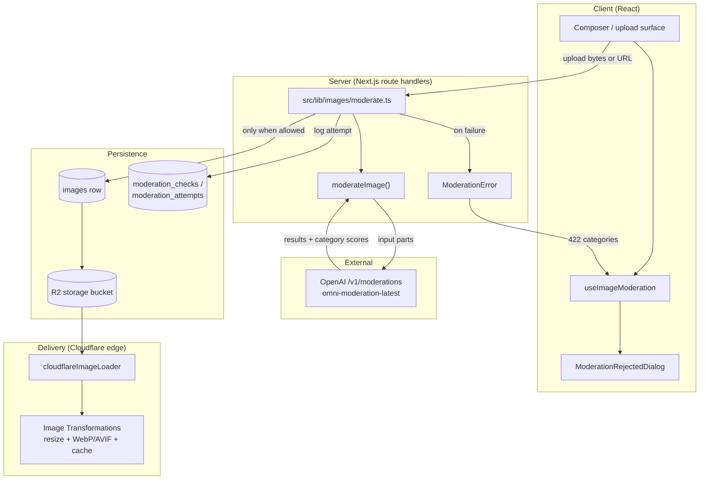
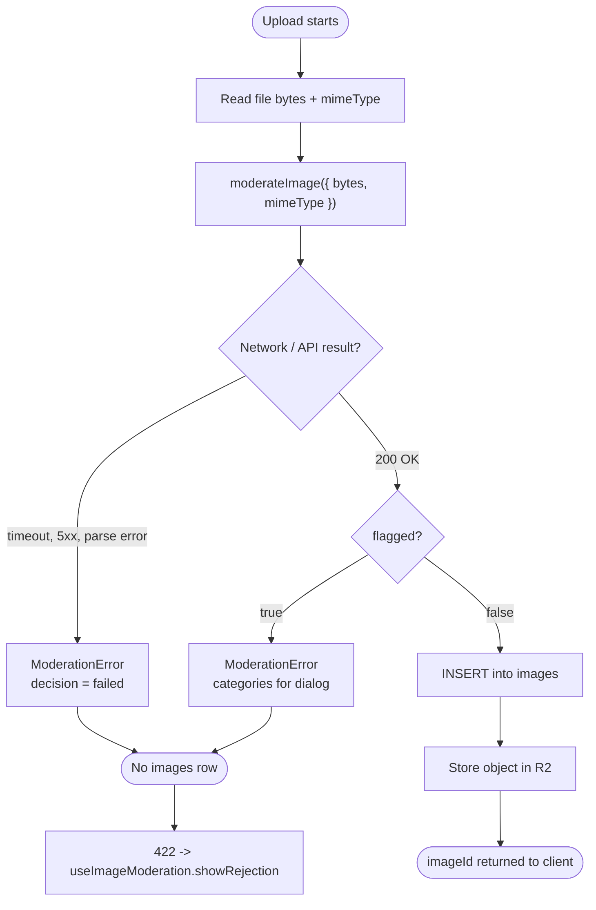
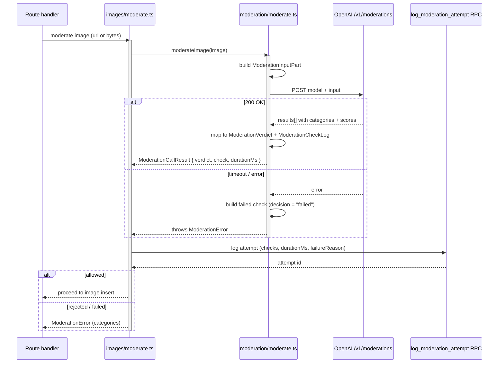
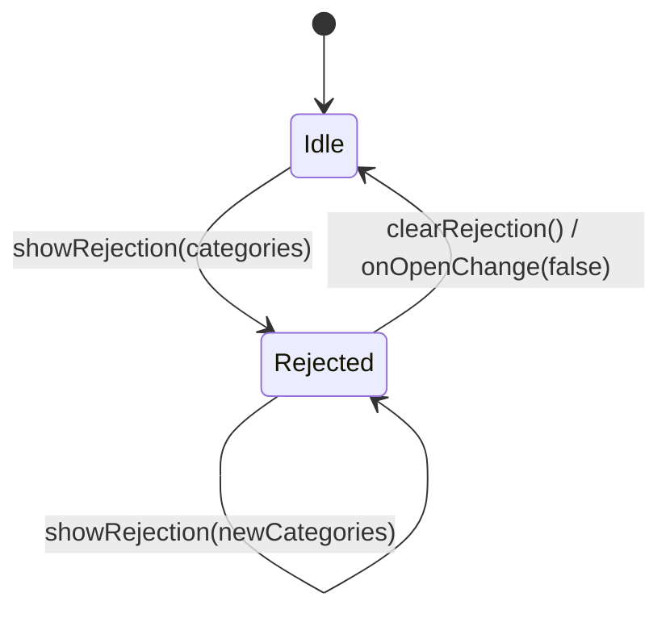
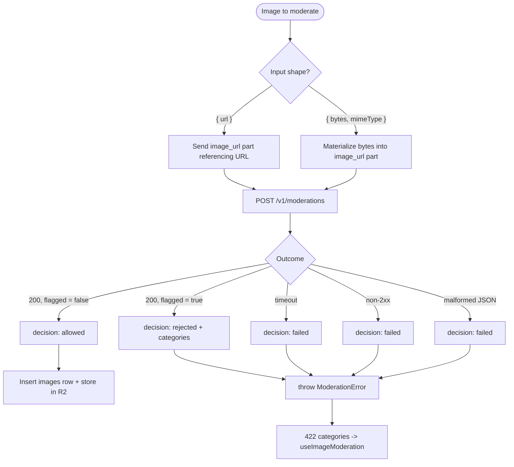

Image Processing & Moderation covers how images flow through Ozeaon: they are transformed and edge-cached for delivery by Cloudflare Image Transformations, and they are content-moderated through OpenAI's `/v1/moderations` endpoint before they can be persisted or published.

## Purpose and Scope

This page documents the image-specific half of the moderation stack together with the image delivery pipeline:

- **Image moderation primitives** — `moderateImage` in `src/lib/moderation/moderate.ts`, its request/response types in `src/types/moderation.ts`, and the model constant it targets.
- **Image moderation orchestration** — `src/lib/images/moderate.ts`, which wraps `moderateImage` and logs attempts, and `src/lib/moderation/error.ts` for failure signaling.
- **Client-side rejection UX** — `useImageModeration` and its dialog contract, which is how an image rejection surfaces in the UI.
- **Image URL transformation for delivery** — `src/lib/image-loader.ts`, the Next.js custom image loader that hands width/quality/format work to Cloudflare.
- **Upload-time moderation semantics** — the ordering guarantee that an `images` row only exists if its moderation check passed.

It intentionally does **not** re-document the general moderation subsystem. For the shared request/response contract, the database-backed `moderation_checks` schema, the attempt logging RPC, and text-field moderation (`moderateField`, `moderateSubmission`), see the sibling moderation page. For the composer/editor that consumes these hooks, see the post creation and profile editing pages. This page stays inside the image boundary and references those pages instead of absorbing them.

## Overview

Ozeaon treats images as **two independent concerns** that never touch each other:

| Concern | Owner | Runtime | Trigger |
|---|---|---|---|
| Moderation (safety) | `moderateImage` + `src/lib/images/moderate.ts` | Server (route handlers) | Upload time, before persistence |
| Transformation (delivery) | `cloudflareImageLoader` | Edge (Cloudflare Image Transformations) | Render time, per `<Image>` request |

Keeping them separate is deliberate. Moderation is a *gate* — it decides whether an image is allowed to exist. Transformation is a *derivative* — it decides how an already-allowed image is encoded and cached. Because a rejected image never produces an `images` row (see the ordering guarantee below), the transformation path can assume every object it sees in R2 is already cleared.

### Key concepts

- **`ModerationImage`** — a union that accepts either a remote `{ url }` or raw `{ bytes, mimeType }`. This lets a moderator accept an already-stored R2 URL *or* an in-flight browser upload with nothing persisted yet.
- **`ModerationVerdict`** — a discriminated union: either `{ decision: "allowed" }` or `{ decision: "rejected"; categories: string[] }`. Categories are display-name strings, not raw enum keys, because they go straight into UI copy.
- **`ModerationCallResult`** — what one `moderateImage` call returns: the verdict, one `ModerationCheckLog`, and `durationMs`.
- **`ModerationSurface`** — where the check originated (post, profile, project, article, …). Owned by the database enum and re-exported, so TS types cannot drift from what the DB will accept.
- **Transform URL** — the `/cdn-cgi/image/width=…,quality=…,format=auto/…` path that Cloudflare intercepts on the storage domain.

The single supporting model is fixed in a constant, with a comment recording exactly why:

```typescript
/** Only model that supports image inputs on the /v1/moderations endpoint. */
export const MODERATION_MODEL = "omni-moderation-latest";
```

> Source: [moderation.ts](https://github.com/ozeaon/ozeaon-v2/blob/0a4f1a95824db87782f1221a4108019d174df3d9/src/config/constants/moderation.ts#L5-L6)

## Architecture



The diagram reflects the real layering: the React hook never calls OpenAI directly — it only renders the rejection state. The server orchestrator is the only place that both calls the model and writes logs, which keeps the timing and failure-reason fields of a `moderation_attempts` row consistent (they are logged once per attempt, not per check). Delivery is a fully separate branch that starts from an R2 key which, by construction, belongs to an allowed image.

## Image Moderation: Types and Data Contracts

The type module is explicit that the closed-domain unions are **owned by the database** and merely re-exported, so the TypeScript layer can never drift from what `moderation_checks` / `moderation_check_categories` can physically store:

```typescript
import type { Enums } from "@/types/supabase";

export type ModerationCategoryKey = Enums<"moderation_category">;
export type ModerationFailureReason = Enums<"moderation_failure_reason">;
export type ModerationSurface = Enums<"moderation_surface">;
export type ModerationAppliedInputType = Enums<"moderation_input_type">;
export type ModerationDecision = Enums<"moderation_decision">;
```

> Source: [moderation.ts](https://github.com/ozeaon/ozeaon-v2/blob/0a4f1a95824db87782f1221a4108019d174df3d9/src/types/moderation.ts#L11-L17)

This is the most important design decision on this page: adding a new moderation category is a **migration**, not a code change. The generated `Enums` helper is the single source of truth; the app-facing aliases are conveniences.

### The image input union

```typescript
/** The union `moderateImage` and each `moderateSubmission` image entry accept. */
export type ModerationImage =
  { url: string } | { bytes: ArrayBuffer; mimeType: string };
```

> Source: [moderation.ts](https://github.com/ozeaon/ozeaon-v2/blob/0a4f1a95824db87782f1221a4108019d174df3d9/src/types/moderation.ts#L19-L21)

Two shapes exist because the same primitive is used in two very different moments:

1. **`{ url }`** — re-checking an image that already lives at an address (e.g. an imported remote asset, or a re-validation of a stored R2 object).
2. **`{ bytes, mimeType }`** — checking the freshly-read body of a browser upload *before* anything is written to storage. The `mimeType` is required because the bytes alone are not self-describing to the request builder, which must emit a data/URL part the endpoint understands.

Correspondingly, the wire format sent to the endpoint is:

```typescript
export type ModerationInputPart =
  | { type: "text"; text: string }
  | { type: "image_url"; image_url: { url: string } };
```

> Source: [moderation.ts](https://github.com/ozeaon/ozeaon-v2/blob/0a4f1a95824db87782f1221a4108019d174df3d9/src/types/moderation.ts#L23-L25)

Note that the endpoint only accepts an image as `image_url`, even for raw bytes — the byte form has to be materialized into a URL form before it goes on the wire. The `ModerationInputPart` union keeps text and image parts distinguishable, which is what allows one `moderateSubmission` call to carry a mixed payload of text fields and images.

### The response shape

```typescript
export interface ModerationResult {
  flagged: boolean;
  categories: ModerationCategories;
  category_scores: ModerationCategoryScores;
  category_applied_input_types: Record<
    ModerationCategoryKey,
    ModerationAppliedInputType[]
  >;
}
```

> Source: [moderation.ts](https://github.com/ozeaon/ozeaon-v2/blob/0a4f1a95824db87782f1221a4108019d174df3d9/src/types/moderation.ts#L30-L38)

`category_applied_input_types` is the field that makes image moderation diagnosable: it records, per category, **which input type triggered it**. Without it you could not tell whether an image was flagged on its pixels or on adjacent text in the same call. The `ModerationCheckLog` type has an `inputType` field for exactly the same reason.

### Verdicts vs. checks

```typescript
/** One API call's outcome - allowed, or rejected with display-name categories. */
export type ModerationVerdict =
  { decision: "allowed" } | { decision: "rejected"; categories: string[] };
```

> Source: [moderation.ts](https://github.com/ozeaon/ozeaon-v2/blob/0a4f1a95824db87782f1221a4108019d174df3d9/src/types/moderation.ts#L46-L48)

The verdict carries **display-name category strings**. These flow, unmodified, into the UI dialog — the hook stores them as-is and spreads them into `ModerationRejectedDialog`. This is why the union carries `string[]` rather than `ModerationCategoryKey[]`: the boundary between "machine category" and "human-readable label" is resolved on the server, once.

The per-attempt log entry separates what is *per-check* from what is *per-attempt*:

```typescript
export interface ModerationCheckLog {
  field: string | null;
  inputType: ModerationAppliedInputType;
  inputText: string | null;
  model: string;
  decision: ModerationDecision;
  /** All thirteen categories; empty for a failed check. */
  categories: ModerationCheckCategory[];
}
```

> Source: [moderation.ts](https://github.com/ozeaon/ozeaon-v2/blob/0a4f1a95824db87782f1221a4108019d174df3d9/src/types/moderation.ts#L73-L81)

The accompanying comment spells out the trade-off: *"Timing and failure reason are not here — every check in one `p_checks` array shares the one call's timing and, on failure, its one reason, so both are logged once on the attempt instead."* For images this is accurate: one `moderateImage` call is one HTTP round-trip, so `durationMs` is a property of the call, not of any individual category.

**Edge case worth noting:** for an image, `field` is `null` and `inputText` is `null` — an image contributes no form field and no text. Those two `null` slots are what distinguish an image check from a text-field check in the same log table.

### Why images carry no direct link target

```typescript
export interface ModerationAttemptTarget {
  kind: Exclude<ModerationSurface, "post" | "profile">;
  id: string;
}
```

> Source: [moderation.ts](https://github.com/ozeaon/ozeaon-v2/blob/0a4f1a95824db87782f1221a4108019d174df3d9/src/types/moderation.ts#L111-L114)

The doc comment above this interface records the reasoning for images specifically: *"Images take none either — an `images` row already implies 'allowed', so an image check is attributed by its parent entity's surface only, never linked directly."* This is a direct consequence of the upload-time ordering guarantee described next, and it is why image checks are attributed through `ModerationSurface` rather than through a foreign key.

## Upload-Time Ordering Guarantee

The migrations document the invariant that makes the whole image design work:

```sql
-- WHY NO IMAGE LINK TABLE
--   Image uploads are moderated before the images row is inserted, so a rejected
--   image never reaches the insert. The existence of an images row therefore
```

> Source: [20260826000000_moderation_checks.sql](https://github.com/ozeaon/ozeaon-v2/blob/0a4f1a95824db87782f1221a4108019d174df3d9/supabase/migrations/20260826000000_moderation_checks.sql#L76-L78)



This ordering is the load-bearing invariant of the entire feature. Three things follow from it:

1. **Rejections are free.** A rejected image costs one API call and nothing else — no orphaned R2 objects, no orphaned rows, no cleanup job. There is no intermediate "pending" state to reconcile.
2. **No image link table is needed.** Because an `images` row implies "moderation passed", the check log does not need a foreign key to the image. The *absence* of a row is the rejection record from the data model's point of view; the *log* is the rejection record from the audit point of view.
3. **The client cannot publish a half-moderated image.** The composer tracks `imageId` as "the `images` row id, once the upload and its moderation check passed":

```typescript
previewUrl: string;
/** The `images` row id, once the upload and its moderation check passed. */
imageId: string | null;
```

> Source: [use-post-images.ts](https://github.com/ozeaon/ozeaon-v2/blob/0a4f1a95824db87782f1221a4108019d174df3d9/src/hooks/use-post-images.ts#L23-L25)

A `null` `imageId` is the client-side encoding of "not yet moderated". Publishing while any `imageId` is still `null` would drop that image, so the publish action is blocked until every entry is resolved — the hook's own comment states this: *"Publishing before every image has cleared moderation would drop the ones still in flight from the post."*

## Delivery: Cloudflare Image Transformations

Transformation is deliberately kept out of the application server. `cloudflareImageLoader` is a Next.js custom loader whose entire job is to rewrite a `src` into a Cloudflare transformation URL:

```typescript
const R2_ORIGIN = "https://storage-r2.ozeaon.com";

export default function cloudflareImageLoader({
  src,
  width,
  quality,
}: ImageLoaderProps): string {
  if (src.startsWith(`${R2_ORIGIN}/`)) {
    const path = src.slice(R2_ORIGIN.length + 1);
    return `${R2_ORIGIN}/cdn-cgi/image/width=${width},quality=${quality ?? 75},format=auto/${path}`;
  }

  // Local dev serves R2 through /api/storage; pass the width hint through
  if (src.startsWith("/api/storage")) {
    // Base URL is only used for parsing, not in the final output
    const url = new URL(src, "https://localhost");
    url.searchParams.set("w", width.toString());
    url.searchParams.set("q", (quality ?? 75).toString());
    return url.pathname + url.search;
  }

  return src;
}
```

> Source: [image-loader.ts](https://github.com/ozeaon/ozeaon-v2/blob/0a4f1a95824db87782f1221a4108019d174df3d9/src/lib/image-loader.ts#L10-L31)

### Branch behaviour

| `src` prefix | Behaviour | Output |
|---|---|---|
| `https://storage-r2.ozeaon.com/` | Full Cloudflare transform | `…/cdn-cgi/image/width=W,quality=Q,format=auto/<path>` |
| `/api/storage` (local dev) | Width/quality hints as query params | `/api/storage/…?w=W&q=Q` |
| anything else | Passthrough | `src` unchanged |

Three design details matter here:

- **`format=auto`** is what gets you WebP/AVIF without any code change. The loader never names a format; the edge negotiates it from `Accept`. This is why there is no image-encoding dependency in the project.
- **`quality ?? 75` is the default in both branches.** The same fallback appears twice so that a caller passing `undefined` gets identical output whether running locally or in production — the two branches stay behaviourally aligned.
- **The passthrough branch is the safety valve.** Any non-R2 source (a data URL, an external CDN, a Next.js static asset) is returned verbatim. This means the loader can be applied globally as the app's `images.loader` without risk of mangling assets that Cloudflare does not serve — it degrades to identity rather than breaking the URL.
- **The `https://localhost` base URL is parsing scaffolding only**, and the code comments this explicitly. It exists because `URL` requires an absolute base; the returned value is `url.pathname + url.search`, so the fake host never leaks into the output.

### Why the loader lives client/server-agnostic

`ImageLoaderProps` is imported as a **type-only** import from `next/image`, and the module has no `"use client"` directive and no server-only APIs. That means the same pure function is usable by both the Next.js image optimizer configuration and any client component that renders a transformed URL by hand — no runtime coupling, and no accidental bundle cost.

## Orchestration: `src/lib/images/moderate.ts`

The server-side orchestrator is the composition point that turns the raw primitive into a logged, auditable, error-signaling operation. Its import surface reveals the three collaborators it stitches together:

```typescript
  logModerationAttempt,
  moderateImage,
  ModerationError,
```

> Source: [moderate.ts](https://github.com/ozeaon/ozeaon-v2/blob/0a4f1a95824db87782f1221a4108019d174df3d9/src/lib/images/moderate.ts#L4-L6)

The call itself is wrapped so that both success and failure paths produce a log entry:

```typescript
  try {
    const result = await moderateImage(image);
```

> Source: [moderate.ts](https://github.com/ozeaon/ozeaon-v2/blob/0a4f1a95824db87782f1221a4108019d174df3d9/src/lib/images/moderate.ts#L60-L61)

`moderateImage` itself is signatured to return the richer `ModerationCallResult`, not a bare verdict:

```typescript
export async function moderateImage(
  image: ModerationImage,
```

> Source: [moderate.ts](https://github.com/ozeaon/ozeaon-v2/blob/0a4f1a95824db87782f1221a4108019d174df3d9/src/lib/moderation/moderate.ts#L126-L127)

This signature choice — returning `{ verdict, check, durationMs }` rather than just allowed/rejected — is what makes the orchestrator trivial. The `check` object is already in the exact shape `log_moderation_attempt`'s `p_checks` array expects, so the orchestrator never has to reshape data. The types document that contract directly: *"Everything one field/image contributes to a `moderation_checks` row — the exact shape `log_moderation_attempt`'s `p_checks` array wants, one entry per check."*

### The check log for a successful image call

Both the success and failure builders in `moderate.ts` set the same discriminating fields for images:

```typescript
      inputText: null,
      model: MODERATION_MODEL,
      decision: verdict.decision,
```

> Source: [moderate.ts](https://github.com/ozeaon/ozeaon-v2/blob/0a4f1a95824db87782f1221a4108019d174df3d9/src/lib/moderation/moderate.ts#L138-L140)

And the failure path builds from a shared base that pins the model and the decision:

```typescript
  const base = {
    model: MODERATION_MODEL,
    decision: "failed" as const,
```

> Source: [moderate.ts](https://github.com/ozeaon/ozeaon-v2/blob/0a4f1a95824db87782f1221a4108019d174df3d9/src/lib/moderation/moderate.ts#L76-L78)

The `"failed"` decision is a first-class distinct value from `"allowed"`/`"rejected"`. This matters operationally: a network timeout must **not** be recorded as "allowed". Failing closed is the default policy — a check that could not complete produces `decision: "failed"` and an empty `categories` array (the type notes: *"All thirteen categories; empty for a failed check."*), and the orchestrator raises `ModerationError` rather than persisting the image.

### Timing and failure attribution

Because `moderation_attempts` stores `durationMs` and `failureReason` **once per attempt** rather than per check, and because the check-log type deliberately excludes both, the orchestrator is the only place that can supply them (via `logModerationAttempt`'s own `durationMs`/`failureReason` params). The split is:



The key sequencing point: **logging happens in the orchestrator, after the primitive returns or throws**. This is what allows one attempt row to own many per-category checks without duplicating timing information thirteen times.

## Client-Side Rejection UX

The client never sees categories until the server has decided. `useImageModeration` is a deliberately minimal state machine whose only job is to hold a nullable array:

```typescript
export function useImageModeration() {
  const [categories, setCategories] = useState<string[] | null>(null);

  const clearRejection = useCallback(() => setCategories(null), []);

  /** Call with the categories a 422 reported. */
  const showRejection = useCallback(
    (rejected: string[]) => setCategories(rejected),
    [],
  );
```

> Source: [use-image-moderation.ts](https://github.com/ozeaon/ozeaon-v2/blob/0a4f1a95824db87782f1221a4108019d174df3d9/src/hooks/use-image-moderation.ts#L11-L20)

The hook's doc comment states the design intent precisely: every upload surface should *"announce a rejection the same way a rejected publish does."* Sharing this hook is what guarantees that an image rejected in the post composer, in an article editor, or on a profile produces an identical dialog — the consistency is enforced by code reuse, not by convention.

### Why images get their own hook

The comment also draws the boundary: *"Text rejections belong to `useModerationRejection` instead — those map onto form fields, an image has none."* This is the cleanest expression of the image/text split in the codebase. A rejected text field can point at the offending `<input>`; a rejected image has no field to highlight, so the only coherent affordance is a dialog listing categories.

### The state machine



Because the state is a single `string[] | null`, "is a dialog open?" is derived rather than stored — `open: categories !== null`. There is no second boolean that could fall out of sync with the payload.

### The dialog contract

```typescript
  return {
    showRejection,
    clearRejection,
    /** Spread onto `ModerationRejectedDialog`. */
    dialogProps: {
      open: categories !== null,
      onOpenChange: (open: boolean) => {
        if (!open) clearRejection();
      },
      categories: categories ?? [],
      kind: "image" as const,
    },
  };
```

> Source: [use-image-moderation.ts](https://github.com/ozeaon/ozeaon-v2/blob/0a4f1a95824db87782f1221a4108019d174df3d9/src/hooks/use-image-moderation.ts#L22-L34)

Two details are load-bearing:

- **`kind: "image" as const`** — the `as const` preserves the literal type so the dialog can discriminate between image and text rejection presentations. The hook hardcodes this rather than accepting it as a parameter, because the hook *is* the image variant; a parameter would allow a caller to produce a text-shaped dialog for an image rejection.
- **`categories: categories ?? []`** — the fallback exists purely to keep the prop type non-nullable. It is only ever observed in the same render where `open` is `false`, so an empty array here is never user-visible. This is a small but load-bearing detail: it means the dialog component never has to handle `categories: null`.

`clearRejection` is exposed separately from `dialogProps.onOpenChange` so a caller can reset the state without a dialog interaction — useful when navigating away from the surface that owns the dialog.

## Usage Examples

### Announcing an image rejection

```typescript
const { showRejection, clearRejection, dialogProps } = useImageModeration();

// After an upload endpoint responds 422 with the rejected categories:
showRejection(["Violence", "Harassment"]);

// Render:
// <ModerationRejectedDialog {...dialogProps} />
```

> Source: [use-image-moderation.ts](https://github.com/ozeaon/ozeaon-v2/blob/0a4f1a95824db87782f1221a4108019d174df3d9/src/hooks/use-image-moderation.ts#L17-L33)

### Composer integration — gating publish on moderation

The composer resets the image state and the moderation state together, which keeps a rejection from leaking across composer sessions:

```typescript
}, [resetImages, form, moderation, setRepostPost, setPostFormOpen]);
```

> Source: [use-create-post.ts](https://github.com/ozeaon/ozeaon-v2/blob/0a4f1a95824db87782f1221a4108019d174df3d9/src/hooks/use-create-post.ts#L178)

And the publish path documents why the image ids matter:

```typescript
      // Each id is an image already uploaded, moderated and stored while the
      // composer was open, so publishing only has to link them.
```

> Source: [use-create-post.ts](https://github.com/ozeaon/ozeaon-v2/blob/0a4f1a95824db87782f1221a4108019d174df3d9/src/hooks/use-create-post.ts#L205-L206)

```typescript
  // Publishing before every image has cleared moderation would drop the ones
  // still in flight from the post.
```

> Source: [use-create-post.ts](https://github.com/ozeaon/ozeaon-v2/blob/0a4f1a95824db87782f1221a4108019d174df3d9/src/hooks/use-create-post.ts#L331-L332)

The ownership of the per-image lifecycle sits in `use-post-images`, described in its own header comment:

```typescript
 * Owns the composer's images: selection, the object-URL preview lifecycle,
 * and the per-image upload that moderates each one as it is added — the same
 * upload-time check projects and articles run, so a rejection names the image
```

> Source: [use-post-images.ts](https://github.com/ozeaon/ozeaon-v2/blob/0a4f1a95824db87782f1221a4108019d174df3d9/src/hooks/use-post-images.ts#L43-L45)

Three things this excerpt establishes:

- **Per-image, incremental moderation.** Images are moderated *as they are added*, not batched at publish time. A rejection therefore names the specific image, and the user gets feedback immediately instead of after composing the rest of the post.
- **One shared upload path across surfaces.** The comment explicitly says the check is "the same upload-time check projects and articles run". Post images, project images and article images all converge on the same orchestrator — this is why the moderation model constant is centralized rather than duplicated per surface.
- **The object-URL preview lifecycle is deliberately separate from the persisted image.** A blob preview can render before moderation resolves; only `imageId` (the persisted row) is gated. This gives instant local feedback without weakening the gate.

## Configuration Options

### Moderation constants

| Option | Type | Default | Description |
|---|---|---|---|
| `MODERATION_MODEL` | `string` | `"omni-moderation-latest"` | Model sent in the `/v1/moderations` request body. Fixed because it is the only model on the endpoint that accepts image inputs. |

Additional moderation constants are re-exported from the barrel alongside the model:

```typescript
  MODERATION_REPORT_URL,
  MODERATION_MODEL,
  MODERATION_TIMEOUT_MS,
```

> Source: [index.ts](https://github.com/ozeaon/ozeaon-v2/blob/0a4f1a95824db87782f1221a4108019d174df3d9/src/config/constants/index.ts#L47-L49)

`MODERATION_TIMEOUT_MS` is the abort deadline for the moderation request. When it elapses, the check resolves as `decision: "failed"` rather than hanging the upload — which is why a slow moderation endpoint degrades into a rejection rather than into a stuck request. `MODERATION_REPORT_URL` is the reporting endpoint used when a user disputes or reports a moderation outcome.

### Image loader constants

| Option | Type | Default | Description |
|---|---|---|---|
| `R2_ORIGIN` | `string` (module constant) | `"https://storage-r2.ozeaon.com"` | The storage host whose URLs are rewritten into Cloudflare transformation paths. Not configurable via env — it is a hardcoded domain, and only URLs starting with this exact prefix are transformed. |
| `quality` | `number \| undefined` | `75` | Next.js `ImageLoaderProps.quality`. Callers omitting it get 75, applied identically in the R2 and local-dev branches. |
| `width` | `number` | — | Required by `ImageLoaderProps`; always emitted as `width=W` (remote) or `w=W` (local dev). |
| `format` | — | `auto` | Not a parameter: the loader always emits `format=auto`, letting the edge negotiate WebP/AVIF from the request's `Accept` header. |
| local-dev query params | `w`, `q` | — | The `/api/storage` branch's equivalents of `width` and `quality`. |

## API Reference

### `moderateImage(image: ModerationImage): Promise<ModerationCallResult>`

Moderates a single image through the `/v1/moderations` endpoint.

**Parameters:**
- `image` (`ModerationImage`): Either `{ url: string }` for a remote/stored image, or `{ bytes: ArrayBuffer; mimeType: string }` for an in-flight upload with nothing persisted.

**Returns:** `Promise<ModerationCallResult>` — containing:
- `verdict`: `{ decision: "allowed" }` or `{ decision: "rejected"; categories: string[] }`
- `check` (`ModerationCheckLog`): the row-shaped log entry for `moderation_checks`, with `inputText: null`, `inputType` set from `category_applied_input_types`, and `categories` populated (empty when the check failed).
- `durationMs`: wall-clock duration of the API call.

**Throws:**
- `ModerationError`: on network failure, timeout (`MODERATION_TIMEOUT_MS` exhausted), non-2xx response, or unparseable body. The failed check carries `decision: "failed"` and an empty `categories` array.

Declared in [moderate.ts](https://github.com/ozeaon/ozeaon-v2/blob/0a4f1a95824db87782f1221a4108019d174df3d9/src/lib/moderation/moderate.ts#L126-L127); image log shape assembled at [moderate.ts](https://github.com/ozeaon/ozeaon-v2/blob/0a4f1a95824db87782f1221a4108019d174df3d9/src/lib/moderation/moderate.ts#L138-L140); shared failed-check base at [moderate.ts](https://github.com/ozeaon/ozeaon-v2/blob/0a4f1a95824db87782f1221a4108019d174df3d9/src/lib/moderation/moderate.ts#L76-L78).

### `cloudflareImageLoader(props: ImageLoaderProps): string`

Next.js custom image loader. Pure, synchronous, side-effect free.

**Parameters:**
- `src` (`string`): The image source URL.
- `width` (`number`): Target width.
- `quality` (`number | undefined`): Optional target quality; defaults to 75.

**Returns:** `string` — the transformed URL. Never throws; unrecognized `src` values are returned unchanged.

**Behaviour by input:**

| Input `src` | Returns |
|---|---|
| `https://storage-r2.ozeaon.com/<path>` | `https://storage-r2.ozeaon.com/cdn-cgi/image/width=W,quality=Q,format=auto/<path>` |
| `/api/storage/<path>?<existing>` | `/api/storage/<path>?<existing>&w=W&q=Q` |
| anything else | `src` unmodified |

Declared at [image-loader.ts](https://github.com/ozeaon/ozeaon-v2/blob/0a4f1a95824db87782f1221a4108019d174df3d9/src/lib/image-loader.ts#L12-L31).

### `useImageModeration(): { showRejection, clearRejection, dialogProps }`

Client hook holding the rejected-image dialog state.

**Returns:**
- `showRejection(rejected: string[]): void` — sets the rejection categories; the caller passes "the categories a 422 reported".
- `clearRejection(): void` — resets to idle.
- `dialogProps` — spread onto `ModerationRejectedDialog`: `{ open, onOpenChange, categories, kind: "image" }`.

Note that a subsequent `showRejection` call **replaces** the categories rather than appending; the hook models one active rejection at a time. Declared at [use-image-moderation.ts](https://github.com/ozeaon/ozeaon-v2/blob/0a4f1a95824db87782f1221a4108019d174df3d9/src/hooks/use-image-moderation.ts#L11-L34).

### `logModerationAttempt(...)`

Database RPC invoked by the orchestrator to write a `moderation_attempts` row plus its `p_checks` array. It takes `durationMs` and `failureReason` explicitly (once per attempt), while the `p_checks` array carries the per-field/per-image `ModerationCheckLog` entries — with `durationMs` and `failureReason` deliberately absent from that array. Imported at [moderate.ts](https://github.com/ozeaon/ozeaon-v2/blob/0a4f1a95824db87782f1221a4108019d174df3d9/src/lib/images/moderate.ts#L4).

## Failure Modes, Edge Cases & Concurrency



### Failure modes

| Failure | Detection | Outcome | Consequence |
|---|---|---|---|
| Model flags the image | `flagged: true` on the result | `ModerationError` with display-name categories | No `images` row; dialog shown via `useImageModeration` |
| Request timeout | `MODERATION_TIMEOUT_MS` exceeded | `decision: "failed"`, empty `categories` | Upload rejected (fail-closed); logged with a failure reason |
| Non-2xx response | HTTP status check | `decision: "failed"` | Upload rejected; logged |
| Malformed response | JSON/shape parsing failure | `decision: "failed"` | Upload rejected; logged |
| Unrecognized `src` in delivery | Prefix check in `cloudflareImageLoader` | Passthrough, no throw | Image renders untransformed and uncached |

The unifying policy is **fail-closed**. There is no code path in which an incomplete or errored moderation call results in an image being persisted. This is a deliberate trade-off: it converts moderation outages into upload outages rather than into a moderation bypass, which is the correct direction for a safety control.

### Edge cases

- **`"failed"` is a distinct decision from `"rejected"`.** The `ModerationDecision` enum includes it as its own value. Analysts can therefore separate "the user submitted a disallowed image" from "we could not check", which are completely different signals.
- **Batches and partial failures.** `SubmissionModerationResult` — the multi-input variant — reports `fields: Array<{ field: string; categories: string[] }>` so a mixed submission identifies *which* fields failed. An image contributes one such entry. This exists so a single bad image does not force the user to re-check the entire submission blindly.
- **Two images rejected in the same composer session.** The hook holds only the latest `categories` array; the dialog is a single-instance, last-write-wins surface.
- **Local dev is not identical to production.** The `/api/storage` branch sets `w`/`q` query params instead of a `/cdn-cgi/image/` path, so local rendering exercises a different code path in the serving layer even though the loader's *defaults* are aligned.

### Concurrency and consistency

- **Per-image, not per-post.** Moderation runs for each image independently as it is added. This makes ingest latency proportional to image count but keeps failures isolated — one rejected image does not invalidate the others.
- **The client can hold unmoderated images.** `imageId: null` is the explicit in-flight marker. The publish gate reads that marker, so a race between "user clicks publish" and "moderation resolves" cannot silently drop an image.
- **No cross-request coordination is needed.** Because the gate is enforced before insertion, there is no window in which two concurrent requests could both observe a "pending" image and both act on it.
- **Idempotent logging.** Each attempt writes its own attempt row with its own `durationMs`; a retry produces a new attempt rather than mutating the previous one, preserving an append-only audit trail.

## Performance & Operational Considerations

- **Moderation latency is additive to upload latency.** Every image costs one synchronous round-trip to the external moderation endpoint. The comment in `use-post-images.ts` makes the sequencing explicit: images are moderated "as each one is added", which parallelizes naturally across images that the user adds in quick succession, but each individual upload is blocked on its check.
- **Edge transformation removes server load entirely.** Because `cloudflareImageLoader` only rewrites URLs, no image bytes are re-encoded by the application. Resizing, format conversion (WebP/AVIF) and edge caching are all Cloudflare-side after the first request per variant.
- **The loader is O(1) string work.** It performs at most two prefix comparisons and one `URL` parse, and is invoked per image render. Cheap enough to be unconditional.
- **`quality ?? 75` bounds bandwidth by default.** An unset quality does not mean "uncompressed" — it means 75.
- **Cache key stability depends on the transform path.** The Cloudflare transformation URL is a deterministic function of `path + width + quality`, so identical requests hit the same edge cache entry and differing widths create distinct variants. This is why `width` must always be a real value and never a placeholder.
- **Operational signal lives in the log tables.** Because timing is recorded once per attempt, aggregate latency analysis is a straightforward query on `moderation_attempts.duration_ms`; per-category behaviour is a join against `moderation_checks`. The deliberate non-duplication of timing across the thirteen categories keeps the check table narrow.

## Extension Points

| Goal | Where to change | Notes |
|---|---|---|
| Add a moderation category | Database enum + migration | `ModerationCategoryKey` derives from `Enums<"moderation_category">`, so the type updates automatically. No application-type edit required. |
| Add a new moderation surface | `moderation_surface` enum + a `ModerationAttemptTarget.kind` | `kind` excludes `post` and `profile`; images are attributed via their parent entity's surface. |
| Accept an image in a new place | Reuse the shared upload path | The comment in `use-post-images.ts` confirms posts, projects and articles already share it. Reuse rather than reimplement. |
| Change model or endpoint tuning | `MODERATION_MODEL`, `MODERATION_TIMEOUT_MS` in `src/config/constants/moderation.ts` | Changing the model is risky: the comment records that only `omni-moderation-latest` supports image inputs on this endpoint. |
| Serve a new image host | `R2_ORIGIN` in `src/lib/image-loader.ts` | Note this is a single module constant, not an env var — supporting multiple origins would require changing the prefix logic, not just configuration. |
| Change default output quality | The `?? 75` fallback in `cloudflareImageLoader` | Must be changed in **both** branches to keep dev and prod aligned. |
| Add a new delivery format | Nothing to change | `format=auto` already negotiates. Forcing a format would *reduce* capability. |
| Change dialog presentation | `ModerationRejectedDialog` keyed on `kind` | `useImageModeration` always passes `kind: "image"`, so the image variant is selectable without touching this hook. |

## Related Links

- [General moderation subsystem](https://github.com/ozeaon/ozeaon-v2/blob/0a4f1a95824db87782f1221a4108019d174df3d9/./) — `moderateField`, `moderateSubmission`, and the text-rejection hook `useModerationRejection` (sibling page)
- [`src/types/moderation.ts`](https://github.com/ozeaon/ozeaon-v2/blob/0a4f1a95824db87782f1221a4108019d174df3d9/src/types/moderation.ts) — all moderation request/response and app-facing types
- [`src/lib/moderation/moderate.ts`](https://github.com/ozeaon/ozeaon-v2/blob/0a4f1a95824db87782f1221a4108019d174df3d9/src/lib/moderation/moderate.ts) — the `moderateImage` / `moderateField` / `moderateSubmission` primitives
- [`src/lib/moderation/error.ts`](https://github.com/ozeaon/ozeaon-v2/blob/0a4f1a95824db87782f1221a4108019d174df3d9/src/lib/moderation/error.ts) — `ModerationError`
- [`src/lib/images/moderate.ts`](https://github.com/ozeaon/ozeaon-v2/blob/0a4f1a95824db87782f1221a4108019d174df3d9/src/lib/images/moderate.ts) — image moderation orchestrator with logging
- [`src/lib/image-loader.ts`](https://github.com/ozeaon/ozeaon-v2/blob/0a4f1a95824db87782f1221a4108019d174df3d9/src/lib/image-loader.ts) — Cloudflare Image Transformations loader
- [`src/config/constants/moderation.ts`](https://github.com/ozeaon/ozeaon-v2/blob/0a4f1a95824db87782f1221a4108019d174df3d9/src/config/constants/moderation.ts) — model, timeout and report-URL constants
- [`src/hooks/use-image-moderation.ts`](https://github.com/ozeaon/ozeaon-v2/blob/0a4f1a95824db87782f1221a4108019d174df3d9/src/hooks/use-image-moderation.ts) — rejected-image dialog state
- [`src/hooks/use-post-images.ts`](https://github.com/ozeaon/ozeaon-v2/blob/0a4f1a95824db87782f1221a4108019d174df3d9/src/hooks/use-post-images.ts) — per-image upload, preview lifecycle and moderation gating
- [`src/hooks/use-create-post.ts`](https://github.com/ozeaon/ozeaon-v2/blob/0a4f1a95824db87782f1221a4108019d174df3d9/src/hooks/use-create-post.ts) — composer publish gate
- [`supabase/migrations/20260826000000_moderation_checks.sql`](https://github.com/ozeaon/ozeaon-v2/blob/0a4f1a95824db87782f1221a4108019d174df3d9/supabase/migrations/20260826000000_moderation_checks.sql) — the `moderation_checks` schema and the "no image link table" rationale
