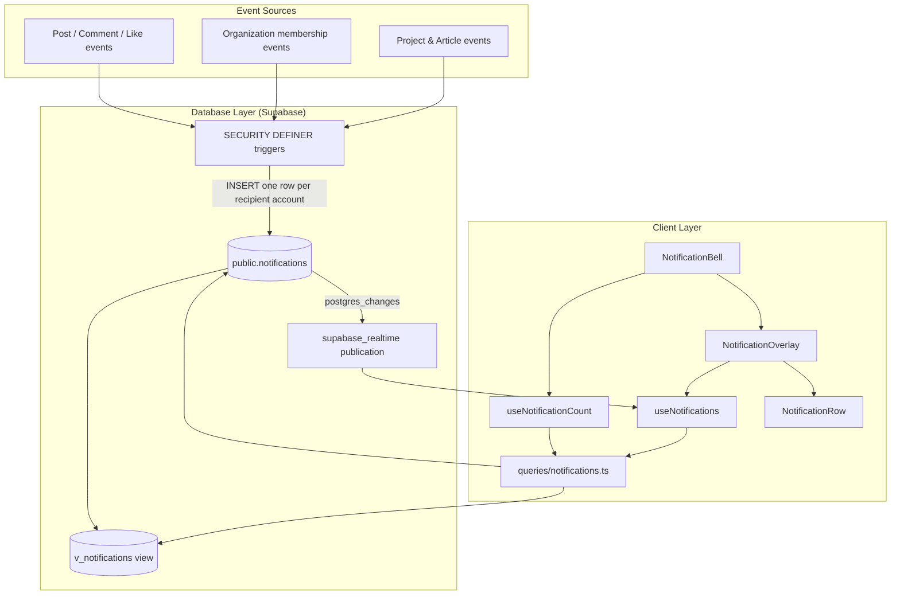
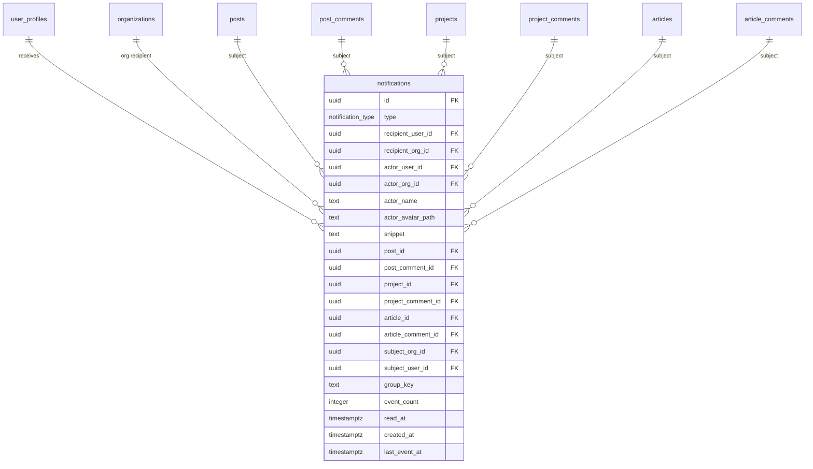
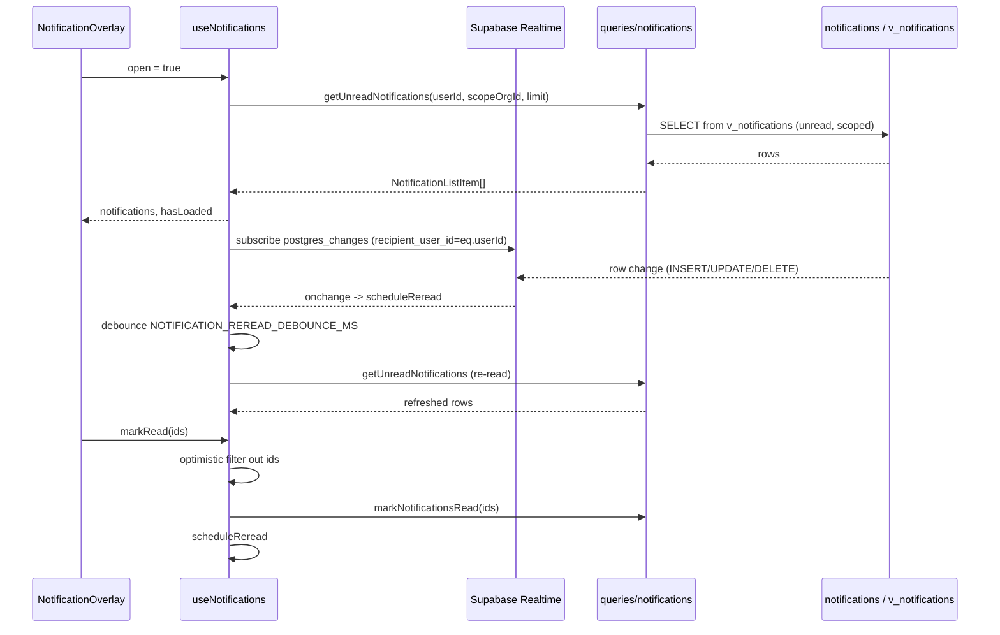
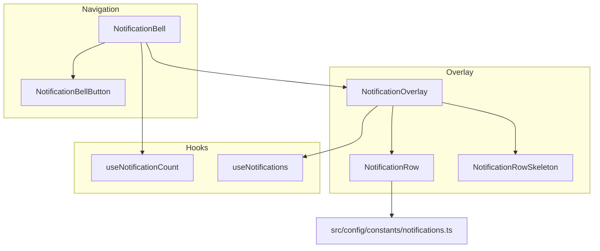
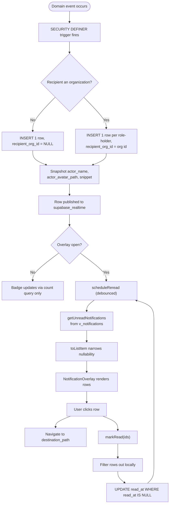
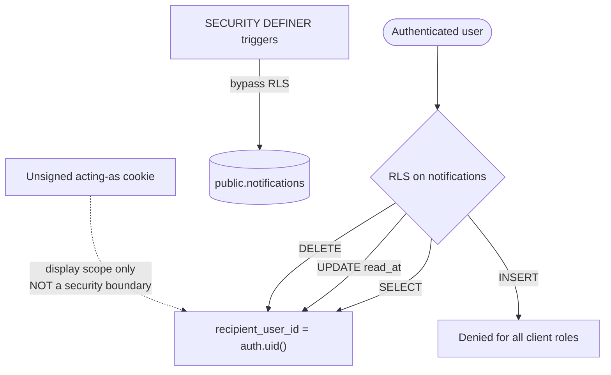

The Notifications System delivers per-account, per-role in-app notifications to users and organizations in ozeaon-v2, backed by a Supabase `notifications` table, a `v_notifications` view that resolves destinations, and a realtime-driven React overlay.

## Purpose and Scope

This page documents the end-to-end notification capability: the database foundation and schema (`notifications` table, `notification_type` enum, `v_notifications` view), the read/write query layer, the realtime-backed React hooks and UI components, and the trigger/RLS/security model that governs how notification rows are created and read.

In scope:

- The `notification_type` enum, one value per CONV-05 catalogue entry.
- The `public.notifications` table, its subject foreign keys, snapshot columns, and grouping columns.
- The `v_notifications` view and how it resolves destination paths.
- The client query layer in `src/lib/supabase/queries/notifications.ts`.
- The `useNotifications` / `useNotificationCount` hooks and their realtime re-read strategy.
- The `NotificationBell`, `NotificationBellButton`, `NotificationOverlay`, and `NotificationRow` UI components.
- Configuration constants in `src/config/constants/notifications.ts` and helpers in `src/utils/notifications.ts`.

Out of scope (covered by sibling pages):

- Authentication and active-account ("acting as") switching mechanics — see the auth and account pages; this page only documents how `notificationScopeOrgId` consumes `ActiveAccount`.
- The underlying post/comment/project/article entities and their moderation flows — see their own pages. This page only references their foreign keys.
- Realtime transport internals (`subscribeWithAuth`) — see the Supabase/realtime integration page.

## Overview

The notification system answers a single product question: "what happened while I was away, and what should I look at?" It is modeled as an **activity feed of immutable snapshotted rows**, not as a mail queue.

Three design principles shape the whole capability, and all three are documented directly in the migration header:

1. **One row per recipient account, not per event.** A user holds a *separate copy* of an organization event for each role they hold. `recipient_org_id = NULL` is the copy seen while acting as an individual; a non-null value is the copy seen while acting as that organization. This is why the read layer always takes a `scopeOrgId` argument.
2. **Display values are snapshotted, destinations are not.** `actor_name`, `actor_avatar_path`, and `snippet` are captured at creation and never updated — a later rename or avatar change does not reach back into old notifications. Destinations, by contrast, are *derived* from live subject foreign keys in `v_notifications`, because a frozen path would 404 after a rename.
3. **The catalogue is a closed set.** `notification_type` is a Postgres enum, not a lookup table, and the row stores the *type* plus field values — never a pre-rendered sentence. Wording changes therefore stay code changes instead of data migrations.

The client never inserts a notification. There is no INSERT path for any client role; rows arrive from `SECURITY DEFINER` triggers. The browser only ever reads, updates `read_at`, or deletes.



The architecture separates three concerns that each fail independently: **row creation** lives entirely in the database (triggers), **scope resolution** lives in the view plus the query layer, and **live freshness** lives in the realtime subscription driving a debounced re-read.

## Architecture

### Layered Responsibilities

| Layer | Artifacts | Responsibility |
|-------|-----------|----------------|
| Catalogue | `notification_type` enum + type comment | Closed set of event kinds, one value per CONV-05 row (A1–E4) |
| Persistence | `public.notifications` table | Per-account rows, snapshotted display values, subject FKs, read state, grouping columns |
| Derivation | `public.v_notifications` view | Resolves the destination path from subject foreign keys at read time |
| Security | RLS policies + `SECURITY DEFINER` triggers | No client INSERT; read/update/delete restricted to own copies |
| Query | `src/lib/supabase/queries/notifications.ts` | Scope resolution, count query, list query, mark-read mutation |
| State | `use-notifications.ts`, `use-notification-count.ts` | Loaded list, count, realtime re-read, optimistic removal |
| Presentation | `NotificationBell`, `NotificationOverlay`, `NotificationRow` | Bell badge, overlay list, per-row render, skeletons |

### Catalogue as an Enum

The catalogue is declared as a Postgres enum. The migration explicitly justifies the choice: "The catalogue is a closed set that application code branches on to pick a text template. A lookup table would force a join on every render to recover a value the code already switches over."

The enum carries a `COMMENT` that preserves the CONV-05 codes into schema dumps, so the mapping between app code and product spec survives outside the codebase:

```sql
CREATE TYPE public.notification_type AS ENUM (
  'post_org_tagged',
  'org_post_published',
  'post_commented',
  'comment_replied',
  'comment_liked',
  'post_liked',
  'post_reposted',
  'org_project_published',
  'project_org_connected',
  'project_team_added',
  'project_commented',
  'project_shared_in_post',
  'project_added_as_related',
  'org_article_published',
  'article_org_linked',
  'article_author_added',
  'article_commented',
  'article_shared_in_post',
  'article_added_as_related',
  'org_invite_received',
  'join_request_accepted',
  'join_request_declined',
  'org_membership_removed',
  'org_role_changed',
  'org_join_requested',
  'org_invite_accepted',
  'org_invite_declined',
  'org_member_left'
);
```

> Source: [20260918000000_notifications_foundation.sql](https://github.com/ozeaon/ozeaon-v2/blob/0a4f1a95824db87782f1221a4108019d174df3d9/supabase/migrations/20260918000000_notifications_foundation.sql#L82-L111)

The catalogue is grouped by domain in the enum comment: **A** post/comment/like types, **B** project types, **C** article types, **D** inbound membership types (organization → user), **E** outbound membership types (user → organization). Notably, the comment records that C5 ("a user left a review on my article") is **absent** because no table models article review — it is intentionally cut from scope rather than stubbed.

### Table Shape: Why Each Column Group Exists



> Source: [20260918000000_notifications_foundation.sql](https://github.com/ozeaon/ozeaon-v2/blob/0a4f1a95824db87782f1221a4108019d174df3d9/supabase/migrations/20260918000000_notifications_foundation.sql#L147-L219)

**Recipient columns.** `recipient_user_id uuid NOT NULL` identifies who owns the copy. `recipient_org_id uuid` is nullable: `NULL` is the individual copy, and a set value is the copy seen while acting as that organization. An organization event therefore produces one row per role-holder, each with its own read state. This is the direct implementation of CONV-05.2 and CONV-05.3.

**Actor columns.** `actor_user_id` and `actor_org_id` record who triggered the event; `actor_org_id` is set when the actor acted as an organization (CONV-05.16). Both use `ON DELETE CASCADE`, which delivers CONV-05.34.

**Snapshot columns.** `actor_name text NOT NULL`, `actor_avatar_path text`, and `snippet text`. The migration argues the trade-off explicitly: "a later rename, avatar change or comment edit does not reach back into old notifications... the alternative is fanning every rename out across historical rows, which is write amplification on hot paths plus a permanent correctness risk in the invalidation logic." It also notes that CONV-05.19 asks for the opposite and is being amended.

**Subject columns.** Eight nullable foreign keys (`post_id`, `post_comment_id`, `project_id`, `project_comment_id`, `article_id`, `article_comment_id`, `subject_org_id`, `subject_user_id`). The migration rejects a polymorphic `(subject_type, subject_id)` pair because "a pair cannot be a foreign key, so nothing keeps it honest" — and because separate FKs deliver CONV-05.33 (content deleted → notification deleted) through `ON DELETE CASCADE` with **no application code at all**.

**Grouping columns.** `group_key text`, `event_count integer DEFAULT 1 NOT NULL`, and `last_event_at timestamp with time zone`. These ship *inert* on purpose: `last_event_at` is already the list sort key and displayed timestamp, so building the overlay on it now avoids changing the sort column and covering index in already-merged read paths later.

**Read state.** `read_at timestamp with time zone` where `NULL` is unread. The migration explains this choice over a boolean: "a `read boolean` cannot express '30 days after it was read' (CONV-05.31)." The timestamp is what retention counting will measure from.

### Integrity Constraints

Three `CHECK` constraints encode domain invariants in the database rather than in application code:

```sql
  -- An organization never acts on its own; a person always acts for it.
  CONSTRAINT notifications_actor_org_needs_user_check
    CHECK (actor_org_id IS NULL OR actor_user_id IS NOT NULL),

  -- Every notification points at something (CONV-05.11). The membership types
  -- whose subject is the organization itself satisfy this through subject_org_id.
  CONSTRAINT notifications_subject_present_check CHECK (
    post_id IS NOT NULL
    OR post_comment_id IS NOT NULL
    OR project_id IS NOT NULL
    OR project_comment_id IS NOT NULL
    OR article_id IS NOT NULL
    OR article_comment_id IS NOT NULL
    OR subject_org_id IS NOT NULL
    OR subject_user_id IS NOT NULL
  ),

  CONSTRAINT notifications_event_count_check CHECK (event_count >= 1),
```

> Source: [20260918000000_notifications_foundation.sql](https://github.com/ozeaon/ozeaon-v2/blob/0a4f1a95824db87782f1221a4108019d174df3d9/supabase/migrations/20260918000000_notifications_foundation.sql#L221-L238)

`notifications_actor_org_needs_user_check` encodes the rule that an organization is never a legal actor by itself — a person always acts on its behalf. `notifications_subject_present_check` guarantees every notification links to something clickable, which is what makes the destination resolution in the view total. `notifications_event_count_check` enforces the grouping invariant (a grouped row counts events; an ungrouped one cannot).

### Legacy Table Replacement

The migration **drops** `public.notifications` and `public.notification_types` rather than altering them. The rationale is recorded in the header: both were created by the initial v2 schema (`20260310232125`) and never used — nothing in `src/` reads or writes them, and they are empty in every environment. More importantly, the old shape could not carry the current requirements: it had a single `user_id` with no way to separate an individual copy from an organization copy, a `read boolean`, and `title`/`message` columns holding a finished sentence — which "turns any wording change into a data migration over every row."

## Scope Resolution: The Individual vs. Organization Copy

The most subtle concept in the system is **scope**. Because each organization event fans out to one row per role-holder, a user acting as an individual and the same user acting as an organization see *different rows* for the same underlying event. The query layer encodes this in a single helper:

```typescript
/** NULL means the individual-account copy, which is how the rows are scoped. */
export function notificationScopeOrgId(
  activeAccount: ActiveAccount,
): string | null {
  return activeAccount.type === "org" ? activeAccount.id : null;
}
```

> Source: [notifications.ts](https://github.com/ozeaon/ozeaon-v2/blob/0a4f1a95824db87782f1221a4108019d174df3d9/src/lib/supabase/queries/notifications.ts#L12-L17)

Returning `null` for a personal account is load-bearing: it is not "no filter", it is the literal predicate `recipient_org_id IS NULL`. Every read path branches on this value to choose between `.eq("recipient_org_id", scopeOrgId)` and `.is("recipient_org_id", null)`.

Crucially, the header comment states that **scoping is display only** — it is not a security boundary:

> Scoping is display only - the security boundary is the recipient_user_id RLS predicate, because the acting-as cookie is unsigned.

This is a deliberate threat-model decision. The "acting as" cookie is unsigned, meaning a user could tamper with it. Because scoping merely selects *which* of the user's own rows to display, tampering only changes the view — it cannot expose another user's notifications. The actual boundary is row-level security keyed on `recipient_user_id`. Any future contributor adding a scope-based access check would be adding a redundant, weaker check while the real one already holds.

## Query Layer

`src/lib/supabase/queries/notifications.ts` is the single data-access surface. It is deliberately **not** marked `"use server"`:

```typescript
// No "use server" here: the bell's hook runs this against the browser client too.
type NotificationsClient = SupabaseClient<Database>;
```

> Source: [notifications.ts](https://github.com/ozeaon/ozeaon-v2/blob/0a4f1a95824db87782f1221a4108019d174df3d9/src/lib/supabase/queries/notifications.ts#L9-L10)

The functions accept a `SupabaseClient<Database>` injected by the caller, so the same code services both a server client and the browser client used by the realtime hook. This avoids duplicating the scope logic across a server and a client variant.

### Unread Count

```typescript
export async function getUnreadNotificationCount(
  supabase: NotificationsClient,
  userId: string,
  scopeOrgId: string | null,
): Promise<number> {
  const query = supabase
    .from("notifications")
    .select("id", { count: "exact", head: true })
    .eq("recipient_user_id", userId)
    .is("read_at", null);

  const { count } = await (scopeOrgId
    ? query.eq("recipient_org_id", scopeOrgId)
    : query.is("recipient_org_id", null));

  return count ?? 0;
}
```

> Source: [notifications.ts](https://github.com/ozeaon/ozeaon-v2/blob/0a4f1a95824db87782f1221a4108019d174df3d9/src/lib/supabase/queries/notifications.ts#L26-L42)

This powers the badge, so its performance characteristics matter. It selects only `id` with `head: true`, meaning PostgREST issues a `HEAD` request that returns counts without body rows. The filters are `recipient_user_id = userId AND read_at IS NULL` plus the scope predicate. `count ?? 0` normalizes a `null` count to zero so callers never branch on null.

### Unread Batch (The List Query)

```typescript
const LIST_ITEM_COLUMNS =
  "id, type, actor_name, actor_avatar_path, snippet, event_count, last_event_at, destination_path";

export async function getUnreadNotifications(
  supabase: NotificationsClient,
  userId: string,
  scopeOrgId: string | null,
  limit: number,
): Promise<NotificationListItem[]> {
  const query = supabase
    .from("v_notifications")
    .select(LIST_ITEM_COLUMNS)
    .eq("recipient_user_id", userId)
    .is("read_at", null)
    .order("last_event_at", { ascending: false })
    .limit(limit);

  const { data, error } = await (scopeOrgId
    ? query.eq("recipient_org_id", scopeOrgId)
    : query.is("recipient_org_id", null));

  if (error) throw error;

  return (data ?? []).flatMap(toListItem);
}
```

> Source: [notifications.ts](https://github.com/ozeaon/ozeaon-v2/blob/0a4f1a95824db87782f1221a4108019d174df3d9/src/lib/supabase/queries/notifications.ts#L44-L75)

Two details carry design intent:

- **It reads the view, not the table.** The destination path is only available through `v_notifications`, because destinations are derived from live subject foreign keys rather than snapshotted.
- **It orders on `last_event_at`, not `created_at`.** The comment explains: "Ordered on last_event_at rather than created_at so a grouped notification rises on its newest event (CONV-05.28) once TOZN-465 starts writing one; the covering index is on the same column." Ordering on the grouping column from day one means grouping can be switched on without a sort-key migration.

### Nullability Narrowing

Every column read through a Postgres view is typed as nullable, even where the base table declares `NOT NULL`. Rather than forcing every render site to re-check, the query layer narrows once:

```typescript
/** Every view column reads as nullable; the base table guarantees these five. */
function toListItem(
  row: Pick<NotificationWithDestination, keyof NotificationListItem>,
): NotificationListItem[] {
  if (!row.id || !row.type || !row.actor_name || !row.last_event_at) return [];

  return [
    {
      id: row.id,
      type: row.type,
      actor_name: row.actor_name,
      actor_avatar_path: row.actor_avatar_path,
      snippet: row.snippet,
      event_count: row.event_count ?? 1,
      last_event_at: row.last_event_at,
      destination_path: row.destination_path,
    },
  ];
}
```

> Source: [notifications.ts](https://github.com/ozeaon/ozeaon-v2/blob/0a4f1a95824db87782f1221a4108019d174df3d9/src/lib/supabase/queries/notifications.ts#L77-L95)

`toListItem` returns either a one-element array (well-formed row) or an empty array (malformed row), and `getUnreadNotifications` applies it via `flatMap`. This turns a defensive check into a filter: an impossible rows drops silently instead of crashing a render or requiring `!` assertions downstream. Note that `event_count` gets a `?? 1` fallback while the five guaranteed columns are treated as hard requirements — `id`, `type`, `actor_name`, and `last_event_at` are the four whose absence makes the row unrenderable.

### Mark as Read

```typescript
export async function markNotificationsRead(
  supabase: NotificationsClient,
  userId: string,
  ids: string[],
): Promise<void> {
  if (ids.length === 0) return;

  const { error } = await supabase
    .from("notifications")
    .update({ read_at: new Date().toISOString() })
    .in("id", ids)
    .eq("recipient_user_id", userId)
    .is("read_at", null);

  if (error) throw error;
}
```

> Source: [notifications.ts](https://github.com/ozeaon/ozeaon-v2/blob/0a4f1a95824db87782f1221a4108019d174df3d9/src/lib/supabase/queries/notifications.ts#L97-L117)

The `.is("read_at", null)` predicate is deliberate, and the doc comment explains why:

> Already-read rows are left alone so a reader racing another session does not move a timestamp CONV-05.31 counts from.

Since `read_at` is the anchor for retention counting, rewriting it on an already-read row would corrupt the retention window. Making the update idempotent at the SQL level means two concurrent sessions marking the same notification read produce no observable difference. The `.eq("recipient_user_id", userId)` predicate is a second guard ensuring a user can never mark another user's rows read, even if a caller passes a foreign ID.

## Realtime State Management

`useNotifications` is the heart of the client behavior. It is a client hook (`"use client"`) that loads the unread batch when the overlay opens and keeps it current while open.



### Re-read Instead of Patching

The hook makes an explicit architectural trade, documented in its header:

> Every realtime event re-reads the batch rather than patching the list in place, which is the same trade CommentThread makes: one extra read buys a list that is correct for an arrival (NO-US1-AC-05), a read in another session (NO-US2-AC-05) and a delete, without three reconciliation paths.

This is the key design decision of the client layer. Patching in place would require three separate reconciliation routines (insert, update, delete) and would still miss cross-session reads. A full re-read is one code path that is correct for all of them, at the cost of one extra query.

```typescript
  const refresh = useCallback(
    async (orgId: string | null) => {
      try {
        const rows = await getUnreadNotifications(
          createBrowserClient(),
          userId,
          orgId,
          NOTIFICATION_BATCH_SIZE,
        );
        // A read that started before an account switch belongs to the old scope.
        if (orgId !== scopeRef.current) return;
        setNotifications(rows);
        setLoadedScope(orgId);
        setFailedScope(undefined);
      } catch (err) {
        logError(logger, "Failed to read notifications", err);
        if (orgId === scopeRef.current) setFailedScope(orgId);
      }
    },
    [userId],
  );
```

> Source: [use-notifications.ts](https://github.com/ozeaon/ozeaon-v2/blob/0a4f1a95824db87782f1221a4108019d174df3d9/src/hooks/use-notifications.ts#L50-L70)

The `if (orgId !== scopeRef.current) return;` check is a race guard: an in-flight read that began before an account switch belongs to the *old* scope, so its results are discarded rather than painted over the new account's list. The same guard gates `setFailedScope` in the catch block, so a stale failure does not incorrectly mark the new scope as failed.

### Debounced Re-reads

```typescript
  const scheduleReread = useCallback(() => {
    clearTimeout(rereadTimer.current);
    rereadTimer.current = setTimeout(
      () => void refresh(scopeRef.current),
      NOTIFICATION_REREAD_DEBOUNCE_MS,
    );
  }, [refresh]);
```

> Source: [use-notifications.ts](https://github.com/ozeaon/ozeaon-v2/blob/0a4f1a95824db87782f1221a4108019d174df3d9/src/hooks/use-notifications.ts#L72-L78)

The debounce exists because, as the header notes, "Realtime sends one event per row, so re-reads are debounced and a multi-row write costs a single read." A fan-out write that creates 20 rows would otherwise trigger 20 reads; debouncing collapses them into one. Each new event clears and restarts the timer, so the read happens only after the burst settles. `scopeRef.current` is read at fire time rather than captured, ensuring the re-read always targets the current scope.

### Scope Tracking via Refs and State

The hook deliberately holds scope in **three** places, each serving a distinct purpose:

```typescript
  // The scope the list was last loaded or failed for. Tracking the scope rather
  // than a flag keeps the previous account's rows off screen after a switch.
  const [loadedScope, setLoadedScope] = useState<string | null>();
  const [failedScope, setFailedScope] = useState<string | null>();
  // Held in a ref so the realtime callback reads the current scope without the
  // subscription tearing down and rebuilding on every account switch.
  const scopeRef = useRef(scopeOrgId);
```

> Source: [use-notifications.ts](https://github.com/ozeaon/ozeaon-v2/blob/0a4f1a95824db87782f1221a4108019d174df3d9/src/hooks/use-notifications.ts#L41-L47)

The distinction between tracking *scopes* rather than boolean flags is important. If the hook tracked `hasLoaded: boolean`, then after switching accounts the stale rows from the previous account would remain on screen until the new read resolved, because the flag would still be `true`. By comparing `loadedScope === scopeOrgId`, the derived flags flip to `false` the moment the scope changes, so the overlay shows a loading state rather than the wrong account's notifications.

The exposed flags derive the comparison at render time:

```typescript
  return {
    notifications,
    hasLoaded: loadedScope === scopeOrgId,
    hasFailed: failedScope === scopeOrgId,
    retry,
    markRead,
  };
```

> Source: [use-notifications.ts](https://github.com/ozeaon/ozeaon-v2/blob/0a4f1a95824db87782f1221a4108019d174df3d9/src/hooks/use-notifications.ts#L142-L148)

The `scopeRef` serves a different purpose: it lets the realtime callback read the *current* scope without the subscription tearing down and rebuilding on every account switch. The subscription effect depends only on `[open, userId, scheduleReread]` — **not** on `scopeOrgId` — precisely because the scope is read through the ref at call time.

### Effect Ordering

```typescript
  // Declared before the load below so the ref is current by the time it reads.
  useEffect(() => {
    scopeRef.current = scopeOrgId;
  }, [scopeOrgId]);

  // Re-reads on a switch too: the rows are scoped to the account acting.
  useEffect(() => {
    if (!open) return;
    void refresh(scopeOrgId);
  }, [open, scopeOrgId, refresh]);
```

> Source: [use-notifications.ts](https://github.com/ozeaon/ozeaon-v2/blob/0a4f1a95824db87782f1221a4108019d174df3d9/src/hooks/use-notifications.ts#L85-L94)

Effects run in declaration order, so the ref-sync effect is declared first to guarantee `scopeRef.current` is already the new scope before the load effect runs. This ordering is explicitly commented because it is non-obvious and re-ordering the hooks would introduce a stale-scope read.

### Subscription Lifecycle

```typescript
  useEffect(() => {
    if (!open) return;

    const supabase = createBrowserClient();
    const unsubscribe = subscribeWithAuth(supabase, () =>
      supabase.channel(`notifications-overlay-${userId}`).on(
        "postgres_changes",
        {
          event: "*",
          schema: "public",
          table: "notifications",
          filter: `recipient_user_id=eq.${userId}`,
        },
        scheduleReread,
      ),
    );

    return () => {
      unsubscribe();
      clearTimeout(rereadTimer.current);
    };
  }, [open, userId, scheduleReread]);
```

> Source: [use-notifications.ts](https://github.com/ozeaon/ozeaon-v2/blob/0a4f1a95824db87782f1221a4108019d174df3d9/src/hooks/use-notifications.ts#L96-L117)

The subscription is created only while the overlay is open (`if (!open) return;`), so a closed overlay costs no realtime connection. Three details:

- **`event: "*"`** subscribes to INSERT, UPDATE, and DELETE, which is what makes the re-read strategy cover arrivals, cross-session reads, and deletes with one handler.
- **`filter: recipient_user_id=eq.${userId}`** is a server-side filter applied by Realtime, so the client is not woken by other users' notifications. It subscribes to the **table**, not the view, because Realtime publications are on the table.
- **`subscribeWithAuth`** wraps the channel creation so the subscription is established only with a valid auth token — important because the channel name is derived from `userId`.
- The cleanup both unsubscribes **and** clears the pending debounce timer, so a close mid-debounce does not fire a read after unmount.

### Optimistic Mark-Read

```typescript
  const markRead = useCallback(
    async (ids: string[]) => {
      if (ids.length === 0) return;
      const dropped = new Set(ids);
      setNotifications((current) => current.filter((n) => !dropped.has(n.id)));

      try {
        await markNotificationsRead(createBrowserClient(), userId, ids);
      } catch (err) {
        logError(logger, "Failed to mark notifications read", err);
        // The re-read below puts the rows back, so say why they returned.
        toast.error("Could not mark as read. Please try again.");
      }
      scheduleReread();
    },
    [userId, scheduleReread],
  );
```

> Source: [use-notifications.ts](https://github.com/ozeaon/ozeaon-v2/blob/0a4f1a95824db87782f1221a4108019d174df3d9/src/hooks/use-notifications.ts#L119-L140)

The doc comment states the intent: "Drops the rows locally before the write lands, so the row leaves under the pointer rather than a round trip later. The re-read that follows is what settles the list, including the next batch."

The `Set` construction gives O(1) membership checks for the filter. Notably, the re-read is scheduled **outside** the try/catch, so it runs on both success and failure paths — on failure it is what restores the optimistically removed rows, and the toast explains why they came back. On success it is what pulls up the next batch after "mark all as read" empties the current one (NO-US2-AC-04).

## Configuration and Utilities

The hook imports two tunables from `@/config` (re-exported from `src/config/constants/notifications.ts`):

| Constant | Imported by | Purpose |
|----------|-------------|---------|
| `NOTIFICATION_BATCH_SIZE` | `useNotifications` | Limit passed to `getUnreadNotifications` for the overlay batch |
| `NOTIFICATION_REREAD_DEBOUNCE_MS` | `useNotifications` | Debounce window collapsing bursts of realtime events into one read |

Both are referenced in [use-notifications.ts](https://github.com/ozeaon/ozeaon-v2/blob/0a4f1a95824db87782f1221a4108019d174df3d9/src/hooks/use-notifications.ts#L6-L9). Additional catalogue-adjacent configuration and rendering helpers live in:

- [src/config/constants/notifications.ts](https://github.com/ozeaon/ozeaon-v2/blob/0a4f1a95824db87782f1221a4108019d174df3d9/src/config/constants/notifications.ts) — notification constants and catalogue configuration.
- [src/utils/notifications.ts](https://github.com/ozeaon/ozeaon-v2/blob/0a4f1a95824db87782f1221a4108019d174df3d9/src/utils/notifications.ts) — notification rendering/formatting utilities (sentence assembly from the catalogue template, avatar fallback).
- [src/types/notifications.ts](https://github.com/ozeaon/ozeaon-v2/blob/0a4f1a95824db87782f1221a4108019d174df3d9/src/types/notifications.ts) — the `Notification`, `NotificationWithDestination`, `NotificationType`, `NotificationRealtimeRow`, and `NotificationListItem` types.

## Type Contracts

The types module is small but encodes several invariants:

```typescript
export type Notification = Tables<"notifications">;

export type NotificationWithDestination = Tables<"v_notifications">;

export type NotificationType = Database["public"]["Enums"]["notification_type"];

/** The columns the bell needs off a realtime payload to decide on scope. */
export type NotificationRealtimeRow = Pick<
  Notification,
  "id" | "recipient_org_id" | "read_at"
>;
```

> Source: [notifications.ts](https://github.com/ozeaon/ozeaon-v2/blob/0a4f1a95824db87782f1221a4108019d174df3d9/src/types/notifications.ts#L1-L13)

`Notification` and `NotificationWithDestination` are derived straight from the generated Supabase `Database` types, so schema drift surfaces as a type error rather than a runtime surprise. `NotificationType` is the enum union, which is what lets the UI `switch` exhaustively over event kinds.

`NotificationRealtimeRow` narrows to exactly the three columns the bell needs off a realtime payload to make a scope decision — a deliberate minimal projection that documents what the realtime path is allowed to depend on.

`NotificationListItem` is the hand-written narrowed shape:

```typescript
export type NotificationListItem = {
  id: string;
  type: NotificationType;
  actor_name: string;
  actor_avatar_path: string | null;
  snippet: string | null;
  event_count: number;
  last_event_at: string;
  destination_path: string | null;
};
```

> Source: [notifications.ts](https://github.com/ozeaon/ozeaon-v2/blob/0a4f1a95824db87782f1221a4108019d174df3d9/src/types/notifications.ts#L15-L29)

It documents the nullability contract: "Every column is nullable through a Postgres view even where the base table is NOT NULL, so the query narrows once here rather than leaving each render site to re-check." This type is the interface between the query layer's narrowing and the render layer's assumptions — the render layer can treat `id`, `type`, `actor_name`, and `last_event_at` as non-null because `toListItem` has already filtered anything else out.

## UI Components

The presentation layer consists of five components with a clear division between the bell (always mounted) and the overlay (mounted on demand).



| Component | Path | Role |
|-----------|------|------|
| `NotificationBell` | [NotificationBell.tsx](https://github.com/ozeaon/ozeaon-v2/blob/0a4f1a95824db87782f1221a4108019d174df3d9/src/components/nav/components/NotificationBell.tsx) | Nav entry point; owns open/closed state and wires the count hook to the overlay |
| `NotificationBellButton` | [NotificationBellButton.tsx](https://github.com/ozeaon/ozeaon-v2/blob/0a4f1a95824db87782f1221a4108019d174df3d9/src/components/nav/components/NotificationBellButton.tsx) | The visual bell affordance and unread badge |
| `NotificationOverlay` | [NotificationOverlay.tsx](https://github.com/ozeaon/ozeaon-v2/blob/0a4f1a95824db87782f1221a4108019d174df3d9/src/components/notifications/NotificationOverlay.tsx) | The list container; calls `useNotifications` |
| `NotificationRow` | [NotificationRow.tsx](https://github.com/ozeaon/ozeaon-v2/blob/0a4f1a95824db87782f1221a4108019d174df3d9/src/components/notifications/NotificationRow.tsx) | Renders one `NotificationListItem` (actor, snippet, sentence, destination) |
| `NotificationRowSkeleton` | [NotificationRowSkeleton.tsx](https://github.com/ozeaon/ozeaon-v2/blob/0a4f1a95824db87782f1221a4108019d174df3d9/src/components/notifications/NotificationRowSkeleton.tsx) | Loading placeholder rendered while `hasLoaded` is false |

The skeleton component exists specifically because of the scope-tracking design described earlier: when the account switches, `hasLoaded` flips to `false` and the overlay renders skeletons instead of the previous account's rows. The `hasLoaded` / `hasFailed` flags returned by `useNotifications` are what drive the three-way render choice (skeleton, error-with-retry, list).

## Core Flow: End-to-End

The following diagram traces a single notification from event to pixel, covering the trigger, the view, realtime, and the optimistic read path.



The `WHERE read_at IS NULL` guard on the final write is what makes the flow safe under double-click or two-tab scenarios: the second update matches zero rows and therefore cannot move the retention timestamp.

## Failure Modes, Edge Cases & Concurrency

| Scenario | Handling | Source evidence |
|----------|----------|-----------------|
| Read fails (network/RLS) | `refresh` catches, logs via `logError`, sets `failedScope`; `hasFailed` becomes true and exposes `retry` | [use-notifications.ts](https://github.com/ozeaon/ozeaon-v2/blob/0a4f1a95824db87782f1221a4108019d174df3d9/src/hooks/use-notifications.ts#L64-L67) |
| Mark-as-read write fails | Optimistic removal is rolled back by the scheduled re-read; a toast explains why rows returned | [use-notifications.ts](https://github.com/ozeaon/ozeaon-v2/blob/0a4f1a95824db87782f1221a4108019d174df3d9/src/hooks/use-notifications.ts#L132-L137) |
| Account switch during in-flight read | Result discarded when `orgId !== scopeRef.current` | [use-notifications.ts](https://github.com/ozeaon/ozeaon-v2/blob/0a4f1a95824db87782f1221a4108019d174df3d9/src/hooks/use-notifications.ts#L60) |
| Account switch while overlay open | `loadedScope === scopeOrgId` becomes false → skeletons, then a fresh scoped read | [use-notifications.ts](https://github.com/ozeaon/ozeaon-v2/blob/0a4f1a95824db87782f1221a4108019d174df3d9/src/hooks/use-notifications.ts#L90-L94) |
| Burst of realtime events (multi-row write) | Debounce collapses to a single read | [use-notifications.ts](https://github.com/ozeaon/ozeaon-v2/blob/0a4f1a95824db87782f1221a4108019d174df3d9/src/hooks/use-notifications.ts#L72-L78) |
| Two sessions mark the same notification read | `.is("read_at", null)` makes the second update a no-op; retention timestamp never moves | [notifications.ts](https://github.com/ozeaon/ozeaon-v2/blob/0a4f1a95824db87782f1221a4108019d174df3d9/src/lib/supabase/queries/notifications.ts#L114) |
| Row missing a required column via the view | `toListItem` drops the row instead of throwing | [notifications.ts](https://github.com/ozeaon/ozeaon-v2/blob/0a4f1a95824db87782f1221a4108019d174df3d9/src/lib/supabase/queries/notifications.ts#L81) |
| Subject content deleted | Subject FK `ON DELETE CASCADE` deletes the notification with no application code (CONV-05.33) | [20260918000000_notifications_foundation.sql](https://github.com/ozeaon/ozeaon-v2/blob/0a4f1a95824db87782f1221a4108019d174df3d9/supabase/migrations/20260918000000_notifications_foundation.sql#L204-L219) |
| Actor user or organization deleted | Actor FKs `ON DELETE CASCADE` (CONV-05.34) | [20260918000000_notifications_foundation.sql](https://github.com/ozeaon/ozeaon-v2/blob/0a4f1a95824db87782f1221a4108019d174df3d9/supabase/migrations/20260918000000_notifications_foundation.sql#L200-L203) |
| Organization deletes / recipient leaves | `recipient_org_id` and `recipient_user_id` FKs `ON DELETE CASCADE` clean up copies | [20260918000000_notifications_foundation.sql](https://github.com/ozeaon/ozeaon-v2/blob/0a4f1a95824db87782f1221a4108019d174df3d9/supabase/migrations/20260918000000_notifications_foundation.sql#L196-L199) |
| Content renamed after notification created | Destination is *derived*, not snapshotted, so the link stays valid; the displayed snapshot stays stale by design | Migration header, "WHY DESTINATIONS ARE NOT SNAPSHOTTED" |
| Overlay closed mid-debounce | Cleanup clears `rereadTimer.current` so no read fires after unsubscribe | [use-notifications.ts](https://github.com/ozeaon/ozeaon-v2/blob/0a4f1a95824db87782f1221a4108019d174df3d9/src/hooks/use-notifications.ts#L113-L116) |

### The Central Consistency Trade-off

The system accepts **eventual consistency between the client list and the database** in exchange for a single reconciliation path. Optimistic removal means the UI can briefly show a notification as gone before the write commits — but because every mark-read schedules a re-read *regardless of outcome*, the list converges to database truth. The comment "The re-read below puts the rows back, so say why they returned" documents that the toast is not a recovery mechanism; the re-read is, and the toast only explains the visible flicker.

### Why There Is No Client INSERT Path

The migration header states there is "No INSERT path for any client role; rows come from SECURITY DEFINER triggers." This is a security posture, not a convenience choice: if clients could insert, they could forge notifications attributed to arbitrary actors, and the snapshot semantics (values captured at creation) would be meaningless because the client would supply them. Routing all creation through `SECURITY DEFINER` triggers means the database itself decides recipients and snapshots values, and the client surface reduces to read/update/delete of its own rows.

## Security Model



The RLS predicate is `recipient_user_id`, and the query layer additionally repeats `.eq("recipient_user_id", userId)` on both the count and the mark-read paths. As documented in the query module header, the scope (`recipient_org_id`) filter is **display-only** and must never be relied upon for access control, because the acting-as cookie that produces it is unsigned. The database grants are additionally tightened by `20260924000000_notifications_revoke_default_grants.sql`, which revokes Supabase's default grants so the INSERT denial is enforced at the grant level as well as by the absence of an RLS policy.

## Performance & Operational Notes

- **Count query is a `HEAD` request.** `getUnreadNotificationCount` selects only `id` with `head: true`, so the badge costs a count without transferring rows.
- **Covering index on the sort column.** The migration notes the list sort uses `last_event_at` and "the covering index is on the same column," meaning the ordered scoped read does not need a separate sort step. Grouping (`TOZN-465`) will reuse the same index when `last_event_at` starts differing from `created_at`.
- **One read per burst.** Debouncing means the read cost scales with *bursts*, not with row count, which keeps fan-out writes (e.g. an organization with many members) from amplifying into N overlay reads.
- **Reads only happen while the overlay is open.** Both the load effect and the subscription early-return when `open` is false, so a closed bell costs a count query but no realtime connection and no batch reads.
- **Snippet is capped at 500 characters on write.** The migration states "Capped at 500 characters on write; display truncation is a render concern" — bounding row size in the database while leaving ellipsis/line-clamping to the UI.
- **Realtime channel name is per-user.** `notifications-overlay-${userId}` scopes the connection to one user, and `subscribeWithAuth` ensures the channel is established only with a valid token.

## Extension Points

| Extension | How | Where |
|-----------|-----|-------|
| New notification kind | Add a value to the `notification_type` enum and a catalogue template branch in TypeScript | `notification_type` enum + [src/utils/notifications.ts](https://github.com/ozeaon/ozeaon-v2/blob/0a4f1a95824db87782f1221a4108019d174df3d9/src/utils/notifications.ts) |
| Notification grouping | Write `group_key` and increment `event_count` / `last_event_at` (columns already exist and are read) | `public.notifications` grouping columns |
| New subject entity | Add a nullable FK with `ON DELETE CASCADE` and extend the `subject_present_check` constraint | [20260918000000_notifications_foundation.sql](https://github.com/ozeaon/ozeaon-v2/blob/0a4f1a95824db87782f1221a4108019d174df3d9/supabase/migrations/20260918000000_notifications_foundation.sql#L227-L236) |
| Retention window (CONV-05.31) | Keyed off `read_at`, which is why it is a timestamp rather than a boolean | `read_at` column |
| Batch size / debounce tuning | Adjust the constants | [src/config/constants/notifications.ts](https://github.com/ozeaon/ozeaon-v2/blob/0a4f1a95824db87782f1221a4108019d174df3d9/src/config/constants/notifications.ts) |

The system is designed so that **product wording changes never require a data migration**: the row stores `type` plus field values, and the sentence is assembled from the catalogue template in TypeScript. Adding a notification kind is therefore an enum migration plus a template branch, with no backfill over historical rows.

## Migration History

| Migration | Purpose |
|-----------|---------|
| `20260918000000_notifications_foundation.sql` | Drops legacy tables; creates `notification_type` enum, `public.notifications`, `v_notifications`, RLS, and adds the table to the `supabase_realtime` publication |
| `20260921000000_notifications_triggers.sql` | `SECURITY DEFINER` triggers that create notification rows from domain events |
| `20260922000000_notification_post_destinations.sql` | Destination-path resolution for post-related notification types in the view |
| `20260924000000_notifications_revoke_default_grants.sql` | Revokes default grants so the no-client-INSERT posture is enforced at the grant level |

## Related Links

- [Notification foundation migration](https://github.com/ozeaon/ozeaon-v2/blob/0a4f1a95824db87782f1221a4108019d174df3d9/supabase/migrations/20260918000000_notifications_foundation.sql) — schema, enum, constraints, RLS, and the full design rationale in the header comment
- [Notification triggers migration](https://github.com/ozeaon/ozeaon-v2/blob/0a4f1a95824db87782f1221a4108019d174df3d9/supabase/migrations/20260921000000_notifications_triggers.sql) — row creation via `SECURITY DEFINER`
- [Post destinations migration](https://github.com/ozeaon/ozeaon-v2/blob/0a4f1a95824db87782f1221a4108019d174df3d9/supabase/migrations/20260922000000_notification_post_destinations.sql) — destination resolution in `v_notifications`
- [Revoke default grants migration](https://github.com/ozeaon/ozeaon-v2/blob/0a4f1a95824db87782f1221a4108019d174df3d9/supabase/migrations/20260924000000_notifications_revoke_default_grants.sql) — grant hardening
- [Query layer](https://github.com/ozeaon/ozeaon-v2/blob/0a4f1a95824db87782f1221a4108019d174df3d9/src/lib/supabase/queries/notifications.ts) — scope resolution, count, list, mark-read
- [Types](https://github.com/ozeaon/ozeaon-v2/blob/0a4f1a95824db87782f1221a4108019d174df3d9/src/types/notifications.ts) — `NotificationType`, `NotificationListItem`, `NotificationRealtimeRow`
- [useNotifications hook](https://github.com/ozeaon/ozeaon-v2/blob/0a4f1a95824db87782f1221a4108019d174df3d9/src/hooks/use-notifications.ts) — realtime re-read and optimistic mark-read
- [useNotificationCount hook](https://github.com/ozeaon/ozeaon-v2/blob/0a4f1a95824db87782f1221a4108019d174df3d9/src/hooks/use-notification-count.ts) — badge count
- [Notification constants](https://github.com/ozeaon/ozeaon-v2/blob/0a4f1a95824db87782f1221a4108019d174df3d9/src/config/constants/notifications.ts) — batch size and debounce configuration
- [Notification utils](https://github.com/ozeaon/ozeaon-v2/blob/0a4f1a95824db87782f1221a4108019d174df3d9/src/utils/notifications.ts) — catalogue template and rendering helpers
- [NotificationBell](https://github.com/ozeaon/ozeaon-v2/blob/0a4f1a95824db87782f1221a4108019d174df3d9/src/components/nav/components/NotificationBell.tsx) · [NotificationBellButton](https://github.com/ozeaon/ozeaon-v2/blob/0a4f1a95824db87782f1221a4108019d174df3d9/src/components/nav/components/NotificationBellButton.tsx) · [NotificationOverlay](https://github.com/ozeaon/ozeaon-v2/blob/0a4f1a95824db87782f1221a4108019d174df3d9/src/components/notifications/NotificationOverlay.tsx) · [NotificationRow](https://github.com/ozeaon/ozeaon-v2/blob/0a4f1a95824db87782f1221a4108019d174df3d9/src/components/notifications/NotificationRow.tsx) · [NotificationRowSkeleton](https://github.com/ozeaon/ozeaon-v2/blob/0a4f1a95824db87782f1221a4108019d174df3d9/src/components/notifications/NotificationRowSkeleton.tsx)

For the acting-as / active account mechanism that produces the scope value, see the authentication and account documentation. For the realtime transport used by `subscribeWithAuth`, see the Supabase integration documentation.
