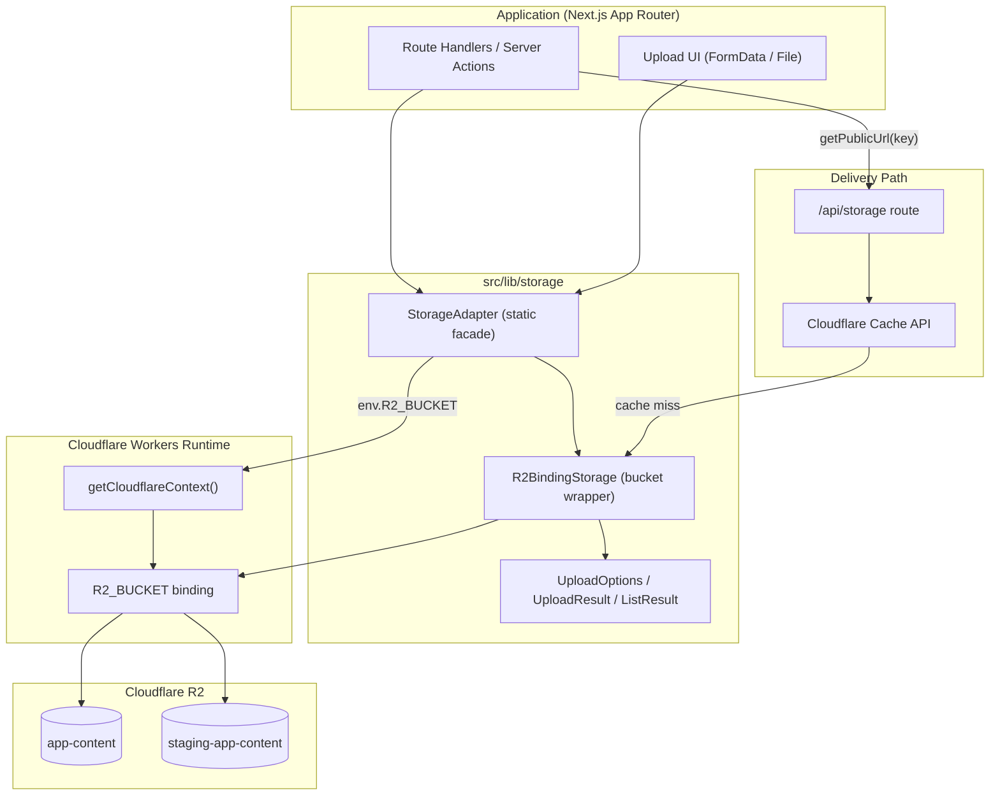
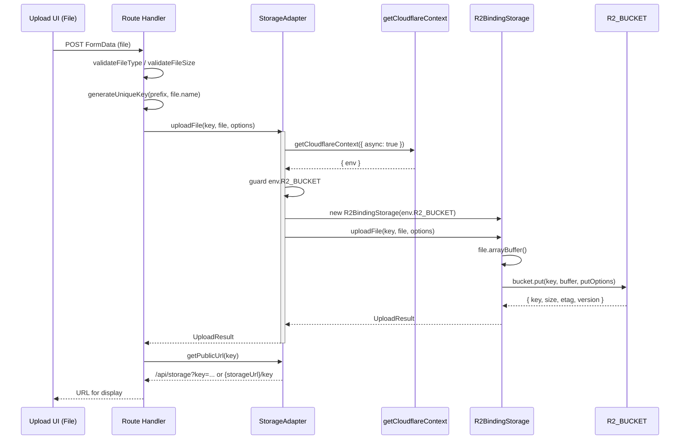
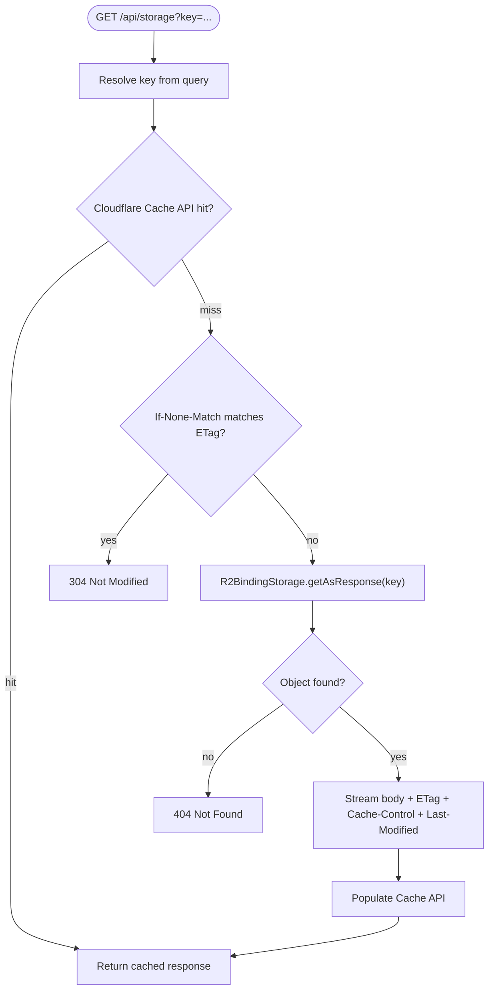
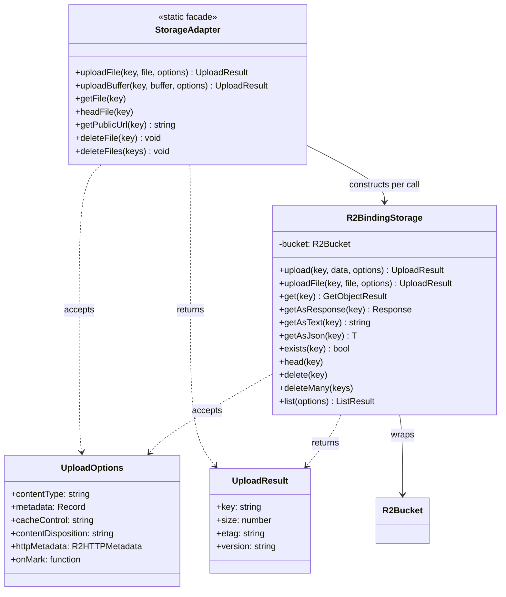

Cloudflare R2 object storage integration for the ozeaon-v2 platform, accessed exclusively through the `StorageAdapter` facade and backed by the Cloudflare Workers `R2_BUCKET` binding, with a cached public delivery path through `/api/storage`.

## Purpose and Scope

This page documents the object-storage subsystem of ozeaon-v2: how files are uploaded, read, listed, deleted, and served, and how the `R2_BUCKET` binding is wired across environments.

In scope:

- The `StorageAdapter` static facade in `src/lib/storage/adapter.ts` (the **only** sanctioned entry point).
- The low-level `R2BindingStorage` class and its type contracts (`UploadOptions`, `UploadResult`, `GetObjectResult`, `ListOptions`, `ListResult`) in `src/lib/storage/r2-binding.ts`.
- The R2 bucket bindings and environment configuration in `wrangler.jsonc`.
- The public-URL / media-serving behavior, including the `/api/storage` caching path.

Out of scope (see sibling pages):

- Authentication, RLS policies, and database schema — these belong to the Supabase integration pages.
- General Worker/OpenNext deployment mechanics beyond R2 bindings.
- UI components that consume media URLs.

## Overview

ozeaon-v2 stores binary content (user avatars, cover images, generated media, exports, and other attachments) in Cloudflare R2 rather than in the relational database. R2 is an S3-compatible object store that, when accessed through a Workers binding, requires **no S3 credentials and no HTTP round-trip to `r2.cloudflarestorage.com`** — the binding is an in-process handle to the bucket.

The design is deliberately layered:

1. **`StorageAdapter`** — a `static`-only class that resolves the Cloudflare context, validates that the `R2_BUCKET` binding exists, and delegates to a freshly constructed `R2BindingStorage`. Every caller in the application goes through this class.
2. **`R2BindingStorage`** — a thin, dependency-injected wrapper around a single `R2Bucket` instance, exposing typed `upload`, `get`, `head`, `delete`, `deleteMany`, and `list` operations plus convenience readers (`getAsResponse`, `getAsText`, `getAsJson`).
3. **The `R2_BUCKET` binding** — declared in `wrangler.jsonc` per environment, pointing at the bucket `app-content` (production) or `staging-app-content` (staging).

The explicit architectural rule stated in the project conventions is:

> Always go through `StorageAdapter` (`@/lib/storage/adapter`) — never the raw R2 binding or an S3-compatible client.

> Source: [CLAUDE.md](https://github.com/ozeaon/ozeaon-v2/blob/0a4f1a95824db87782f1221a4108019d174df3d9/CLAUDE.md#L133-L136)

This rule exists because the raw binding is only reachable from inside the Workers runtime. Routing everything through `StorageAdapter` keeps a single place where the Cloudflare context is resolved, where timing instrumentation is attached, and where future storage backends could be substituted without touching call sites.

## Architecture



**Component roles:**

| Component | File | Responsibility |
|-----------|------|----------------|
| `StorageAdapter` | [adapter.ts](https://github.com/ozeaon/ozeaon-v2/blob/0a4f1a95824db87782f1221a4108019d174df3d9/src/lib/storage/adapter.ts) | Static facade; resolves `getCloudflareContext()`, guards on `env.R2_BUCKET`, constructs `R2BindingStorage`, normalizes public URLs, batches deletes. |
| `R2BindingStorage` | [r2-binding.ts](https://github.com/ozeaon/ozeaon-v2/blob/0a4f1a95824db87782f1221a4108019d174df3d9/src/lib/storage/r2-binding.ts) | Thin typed wrapper over one `R2Bucket`; implements upload/get/head/delete/list variants. |
| Types (`UploadOptions`, `UploadResult`, `GetObjectResult`, `ListOptions`, `ListResult`) | [r2-binding.ts](https://github.com/ozeaon/ozeaon-v2/blob/0a4f1a95824db87782f1221a4108019d174df3d9/src/lib/storage/r2-binding.ts#L1-L46) | Contracts that decouple callers from R2 SDK shapes. |
| `R2_BUCKET` binding | [wrangler.jsonc](https://github.com/ozeaon/ozeaon-v2/blob/0a4f1a95824db87782f1221a4108019d174df3d9/wrangler.jsonc#L29-L33) | Binds the physical bucket into the Worker's `env`. |
| `/api/storage` | referenced from [docs/r2-storage.md](https://github.com/ozeaon/ozeaon-v2/blob/0a4f1a95824db87782f1221a4108019d174df3d9/docs/r2-storage.md#L26) | Public delivery endpoint with Cloudflare Cache API → ETag 304 → R2 fallback. |

## The `StorageAdapter` Facade

`StorageAdapter` is a class with no instances — every method is `static`. Its single responsibility is to bridge the Next.js / OpenNext execution model to the Workers `env` object.

### Context resolution and binding guard

Every method follows the same three-step preamble:

```typescript
const { env } = await getCloudflareContext({ async: true });
if (!env || !env.R2_BUCKET) {
  throw new Error("R2_BUCKET not available in Cloudflare context");
}
const storage = new R2BindingStorage(env.R2_BUCKET);
```

> Source: [adapter.ts](https://github.com/ozeaon/ozeaon-v2/blob/0a4f1a95824db87782f1221a4108019d174df3d9/src/lib/storage/adapter.ts#L60-L68)

Two things matter here:

- `getCloudflareContext({ async: true })` is awaited on **every call**. The async form is required because the adapter is used from asynchronous server code; the context is not guaranteed to be synchronously populated.
- The guard fails **loud and early**. If the binding is missing (misconfigured `wrangler.jsonc`, running outside Workers, or a local dev environment without the binding), the caller receives an explicit `Error` rather than an obscure runtime failure deeper in the bucket call. This fail-fast behavior converts deployment misconfiguration into an immediately actionable message.

Because a new `R2BindingStorage` is constructed per call, the adapter holds no mutable state and is inherently safe to use concurrently across requests. This is intentional: Workers isolate per-request, and a cached bucket handle would risk leaking state across requests or environments.

### Upload with instrumentation

`uploadFile` is the only method that instruments timings:

```typescript
const ctxStart = performance.now();
const { env } = await getCloudflareContext({ async: true });
options.onMark?.("ctx", performance.now() - ctxStart);

if (!env || !env.R2_BUCKET) {
  throw new Error("R2_BUCKET not available in Cloudflare context");
}

const storage = new R2BindingStorage(env.R2_BUCKET);
const putStart = performance.now();
const result = await storage.uploadFile(key, file, options);
options.onMark?.("r2_put", performance.now() - putStart);
return result;
```

> Source: [adapter.ts](https://github.com/ozeaon/ozeaon-v2/blob/0a4f1a95824db87782f1221a4108019d174df3d9/src/lib/storage/adapter.ts#L22-L40)

The `onMark` callback (part of `UploadOptions`) receives named duration measurements: `"ctx"` for context resolution and `"r2_put"` for the actual bucket write. This lets upload handlers report where time is spent — a common source of confusion is slow context resolution versus a slow R2 put, and these two marks separate the two.

### Public URL construction

```typescript
static getPublicUrl(key: string): string {
  if (!env.storageUrl) return `/api/storage?key=${encodeURIComponent(key)}`;
  // Encode per segment so the path separators survive but spaces and
  // non-ASCII characters in a filename do not break the URL.
  const encoded = key.split("/").map(encodeURIComponent).join("/");
  return `${env.storageUrl}/${encoded}`;
}
```

> Source: [adapter.ts](https://github.com/ozeaon/ozeaon-v2/blob/0a4f1a95824db87782f1221a4108019d174df3d9/src/lib/storage/adapter.ts#L70-L79)

This method encodes the two supported delivery topologies:

- **Custom domain configured** (`env.storageUrl` set): produce `${storageUrl}/<key>` with **per-segment encoding**. The whole key is *not* passed to `encodeURIComponent`, because that would escape the `/` separators and collapse the path into a single meaningless segment. Splitting on `/`, encoding each segment, and rejoining preserves directory structure while still safely handling spaces and non-ASCII characters inside filenames.
- **No custom domain**: fall back to the internal `/api/storage?key=...` route, where the entire key is encoded as a *query parameter* — appropriate, because in a query string the separators carry no structural meaning.

### Batched deletion

```typescript
const R2_DELETE_BATCH_SIZE = 1000;

static async deleteFiles(keys: string[]): Promise<void> {
  if (keys.length === 0) return;
  ...
  for (let i = 0; i < keys.length; i += R2_DELETE_BATCH_SIZE) {
    await storage.deleteMany(keys.slice(i, i + R2_DELETE_BATCH_SIZE));
  }
}
```

> Source: [adapter.ts](https://github.com/ozeaon/ozeaon-v2/blob/0a4f1a95824db87782f1221a4108019d174df3d9/src/lib/storage/adapter.ts#L16-L127)

The `1000` constant encodes a hard constraint of the R2 binding: bulk delete accepts at most 1000 keys per call. Rather than surfacing that limit to every caller, the adapter chunks the input and issues sequential batches. The early return on an empty array avoids a pointless context resolution when there is nothing to delete.

Note the batching is **sequential**, not parallel — batches are awaited one at a time inside the loop. This trades throughput for lower peak concurrency against R2.

## The `R2BindingStorage` Layer

`R2BindingStorage` is constructed with a single `R2Bucket` and wraps it in the project's own type vocabulary so callers never touch raw `R2ObjectBody`/`R2Object` shapes directly.

### Upload semantics

```typescript
async upload(
  key: string,
  data: string | ArrayBuffer | ArrayBufferView | ReadableStream | Blob | null,
  options: UploadOptions = {},
): Promise<UploadResult> {
  const putOptions: R2PutOptions = {};

  if (options.contentType || options.cacheControl || options.contentDisposition) {
    putOptions.httpMetadata = {
      contentType: options.contentType,
      cacheControl: options.cacheControl,
      contentDisposition: options.contentDisposition,
      ...options.httpMetadata,
    };
  } else if (options.httpMetadata) {
    putOptions.httpMetadata = options.httpMetadata;
  }

  if (options.metadata) {
    putOptions.customMetadata = options.metadata;
  }

  const result = await this.bucket.put(key, data, putOptions);

  return { key: result.key, size: result.size, etag: result.etag, version: result.version };
}
```

> Source: [r2-binding.ts](https://github.com/ozeaon/ozeaon-v2/blob/0a4f1a95824db87782f1221a4108019d174df3d9/src/lib/storage/r2-binding.ts#L73-L107)

Design notes:

- The optional-field merge (`contentType`/`cacheControl`/`contentDisposition` first, then spread `options.httpMetadata`) lets a caller pass either the flat convenience fields **or** a full `httpMetadata` object, and mixing is allowed with the explicit fields winning.
- `customMetadata` (`options.metadata`) is kept separate from `httpMetadata` because R2 stores them in different places: HTTP metadata affects response headers, custom metadata is application-visible key/value data returned on `head`/`get`.
- The result is normalized to `{ key, size, etag, version }`, dropping SDK-specific fields. `version` is optional because it is only populated on versioned buckets.

### `File` upload forces buffering

```typescript
async uploadFile(key: string, file: File, options: UploadOptions = {}): Promise<UploadResult> {
  // Convert File to ArrayBuffer - R2 requires known length for streams
  const arrayBuffer = await file.arrayBuffer();
  return this.upload(key, arrayBuffer, {
    contentType: file.type || options.contentType,
    ...options,
  });
}
```

> Source: [r2-binding.ts](https://github.com/ozeaon/ozeaon-v2/blob/0a4f1a95824db87782f1221a4108019d174df3d9/src/lib/storage/r2-binding.ts#L117-L128)

The comment states the reason directly: R2's `put` needs a **known content length** for streamed bodies. A `File` is not a plain stream with a reliable length in this position, so it is materialized into an `ArrayBuffer` first. This makes `uploadFile` memory-bound by the file size — a relevant limit for large uploads (see Failure Modes).

Note the `contentType` resolution order: `file.type || options.contentType`, and then `...options` is spread **after**, meaning an explicitly supplied `options.contentType` overrides `file.type`. When `options.contentType` is `undefined`, `file.type` is preserved.

### Reading an object

```typescript
async get(key: string): Promise<GetObjectResult | null> {
  const object = await this.bucket.get(key);
  if (!object) return null;

  const data = await object.arrayBuffer();

  return {
    data,
    contentType: object.httpMetadata?.contentType || "application/octet-stream",
    size: object.size,
    lastModified: object.uploaded,
    metadata: object.customMetadata || {},
    etag: object.etag,
    httpMetadata: object.httpMetadata,
  };
}
```

> Source: [r2-binding.ts](https://github.com/ozeaon/ozeaon-v2/blob/0a4f1a95824db87782f1221a4108019d174df3d9/src/lib/storage/r2-binding.ts#L146-L165)

`get` returns `null` for a missing key rather than throwing — absence is a normal outcome, not an error. The `contentType` falls back to `application/octet-stream`, which is the safe default for an untyped object. The R2 SDK's `uploaded` timestamp is exposed to callers as `lastModified`.

For streaming, `getAsResponse` builds a `Response` directly from `object.body` and maps HTTP metadata onto headers:

```typescript
headers.set("ETag", object.etag);
headers.set("Last-Modified", object.uploaded.toUTCString());
headers.set("Content-Length", object.size.toString());
return new Response(object.body, { headers });
```

> Source: [r2-binding.ts](https://github.com/ozeaon/ozeaon-v2/blob/0a4f1a95824db87782f1221a4108019d174df3d9/src/lib/storage/r2-binding.ts#L180-L205)

This is the path the `/api/storage` delivery route uses, because it avoids buffering the whole object into an `ArrayBuffer` and instead pipes the R2 stream to the client. It deliberately sets `ETag` and `Last-Modified`, which are the validators that enable conditional `304 Not Modified` responses.

## Core Flow: Uploading and Serving Media

The following sequence traces a typical upload followed by display, showing exactly which component handles each step.



### The canonical upload pattern

The documented end-to-end pattern combines key generation, type/size validation, upload, URL derivation, and deletion:

```typescript
import { StorageAdapter } from "@/lib/storage/adapter";
import { generateUniqueKey, validateFileType, validateFileSize } from "@/utils";
import { getImageUrl, getImageUrlFromKey } from "@/utils/url/image";

// Upload
const key = generateUniqueKey(`profiles/${userId}/covers`, file.name);
await StorageAdapter.uploadFile(key, file, {
  contentType: file.type,
  cacheControl: "public, max-age=31536000, immutable",
});

// Get URL & Delete
const url = StorageAdapter.getPublicUrl(key);
await StorageAdapter.deleteFile(key);

// Get URL to display/download file
const urlFromFile = getImageUrl({ path: key });

const urlFromPath_1 = getImageUrl(key);
const urlFromPath_2 = getImageUrlFromKey(key);
```

> Source: [docs/r2-storage.md](https://github.com/ozeaon/ozeaon-v2/blob/0a4f1a95824db87782f1221a4108019d174df3d9/docs/r2-storage.md#L3-L24)

Key observations about this pattern:

- **Key layout is namespaced by owner**: `profiles/${userId}/covers` means every user's media is isolated under a per-user prefix. This makes prefix-scoped listing (`list({ prefix })`) and bulk cleanup trivially scoped to a single user, and it prevents key collisions across users without a database lookup.
- **`generateUniqueKey(prefix, filename)`** derives a collision-resistant key from a logical prefix plus the original filename, keeping the original name discoverable while guaranteeing uniqueness.
- **Validation happens before upload** (`validateFileType`, `validateFileSize`), so invalid files never reach R2. This is the cheapest failure — it avoids paying for storage and a round-trip on a request that should be rejected.
- **Immutable caching is explicit**: `cacheControl: "public, max-age=31536000, immutable"` is set at *write* time. Because keys are unique per upload, content at a given key never changes, so the strongest cache directive is safe. This is the design intent behind unique keys: immutability unlocks aggressive edge caching.
- **Multiple URL helpers coexist**: `StorageAdapter.getPublicUrl` returns the raw storage URL, while `getImageUrl` / `getImageUrlFromKey` from `@/utils/url/image` are the image-specific helpers (accepting either `{ path }` or a raw key). Media rendering should use the image helpers; low-level or non-image links use `getPublicUrl`.

## Delivery and Caching Pipeline

Media is not always served directly from `getPublicUrl`. When no custom storage domain is configured, URLs point at `/api/storage?key=...`, which implements a three-tier read strategy:

> **File caching** (`/api/storage`): Cloudflare Cache API → ETag 304 → R2 read

> Source: [docs/r2-storage.md](https://github.com/ozeaon/ozeaon-v2/blob/0a4f1a95824db87782f1221a4108019d174df3d9/docs/r2-storage.md#L26)



This ladder is ordered from cheapest to most expensive:

1. **Cloudflare Cache API** — an in-edge cache lookup, no R2 involvement at all. Because uploads set `Cache-Control: immutable`, this tier answers the vast majority of reads for popular media.
2. **ETag revalidation** — on a cache miss or revalidation, the request's `If-None-Match` is compared against the object's `ETag`. A match short-circuits with `304 Not Modified`, which still avoids transferring the body. This works because `getAsResponse` always sets the `ETag` header from the R2 object.
3. **R2 read** — the authoritative fallback, streaming directly from `object.body`.

The layering is only possible because of two upstream decisions: unique keys make objects immutable (so aggressive caching is correct), and `getAsResponse` faithfully propagates HTTP metadata (so validators actually reach the client).

## Environment Configuration

The `R2_BUCKET` binding is declared per Worker environment in `wrangler.jsonc`. Each environment is a separate Worker with its own bucket, so staging can never write to production data.

| Environment | Worker name | Binding | Bucket name | Reference |
|-------------|-------------|---------|-------------|-----------|
| Top-level (default) | — | `R2_BUCKET` | `app-content` | [wrangler.jsonc](https://github.com/ozeaon/ozeaon-v2/blob/0a4f1a95824db87782f1221a4108019d174df3d9/wrangler.jsonc#L29-L33) |
| Staging (workers.dev) | — | `R2_BUCKET` | `staging-app-content` | [wrangler.jsonc](https://github.com/ozeaon/ozeaon-v2/blob/0a4f1a95824db87782f1221a4108019d174df3d9/wrangler.jsonc#L50-L53) |
| Staging (custom domain) | `staging-app-ozeaon` | `R2_BUCKET` | `staging-app-content` | [wrangler.jsonc](https://github.com/ozeaon/ozeaon-v2/blob/0a4f1a95824db87782f1221a4108019d174df3d9/wrangler.jsonc#L69-L72) |
| Production | `production-app-ozeaon` | `R2_BUCKET` | `app-content` | [wrangler.jsonc](https://github.com/ozeaon/ozeaon-v2/blob/0a4f1a95824db87782f1221a4108019d174df3d9/wrangler.jsonc#L85-L88) |

```jsonc
"r2_buckets": [
  {
    "binding": "R2_BUCKET",
    "bucket_name": "app-content",
  }
],
```

> Source: [wrangler.jsonc](https://github.com/ozeaon/ozeaon-v2/blob/0a4f1a95824db87782f1221a4108019d174df3d9/wrangler.jsonc#L29-L33)

Notable configuration characteristics:

- The binding name is **identical (`R2_BUCKET`) in every environment**. This is why the adapter guards on `env.R2_BUCKET` generically — the same code path works everywhere, and only the physical bucket differs.
- The bucket name is the *only* thing that changes between staging and production. There are no environment-specific code branches for storage.
- Staging is declared twice (a `workers_dev` entry and a named-Worker entry), both pointing at `staging-app-content`, so the workers.dev preview and the staging domain share the same bucket.

The `env.storageUrl` used by `getPublicUrl` comes from the application config module (`@/config`), not from `wrangler.jsonc` — it is the optional custom-domain base URL for public media delivery.

## API Reference

### `StorageAdapter` (static facade)

#### `StorageAdapter.uploadFile(key: string, file: File, options?: UploadOptions): Promise<UploadResult>`

Uploads a `File` object, instrumenting context resolution and the R2 put.

- **Parameters**: `key` — target object path; `file` — browser/FormData `File`; `options` — see `UploadOptions`.
- **Returns**: `UploadResult` (`key`, `size`, `etag`, optional `version`).
- **Throws**: `Error("R2_BUCKET not available in Cloudflare context")` when the binding is absent.
- **Instrumentation**: invokes `options.onMark("ctx", ms)` and `options.onMark("r2_put", ms)`.

> Source: [adapter.ts](https://github.com/ozeaon/ozeaon-v2/blob/0a4f1a95824db87782f1221a4108019d174df3d9/src/lib/storage/adapter.ts#L22-L40)

#### `StorageAdapter.uploadBuffer(key: string, buffer: ArrayBuffer, options?: UploadOptions): Promise<UploadResult>`

Uploads a raw `ArrayBuffer` — used for generated content (thumbnails, exports) rather than client-supplied files.

- **Throws**: same binding guard error as `uploadFile`.

> Source: [adapter.ts](https://github.com/ozeaon/ozeaon-v2/blob/0a4f1a95824db87782f1221a4108019d174df3d9/src/lib/storage/adapter.ts#L45-L58)

#### `StorageAdapter.getFile(key: string)`

Retrieves an object via `R2BindingStorage.get`. Returns `GetObjectResult | null` (null when the key does not exist).

> Source: [adapter.ts](https://github.com/ozeaon/ozeaon-v2/blob/0a4f1a95824db87782f1221a4108019d174df3d9/src/lib/storage/adapter.ts#L60-L69)

#### `StorageAdapter.headFile(key: string)`

Returns object metadata without downloading content; returns `null` when the object does not exist. Useful for existence checks and size/metadata inspection prior to a read.

> Source: [adapter.ts](https://github.com/ozeaon/ozeaon-v2/blob/0a4f1a95824db87782f1221a4108019d174df3d9/src/lib/storage/adapter.ts#L85-L94)

#### `StorageAdapter.getPublicUrl(key: string): string`

Returns a display URL for a key. Produces `${env.storageUrl}/<per-segment-encoded-key>` when `env.storageUrl` is set, otherwise `/api/storage?key=<fully-encoded-key>`.

- **Note**: This method does **not** throw on a missing binding — it only reads `env.storageUrl` and still returns the `/api/storage` fallback when no storage domain is configured.

> Source: [adapter.ts](https://github.com/ozeaon/ozeaon-v2/blob/0a4f1a95824db87782f1221a4108019d174df3d9/src/lib/storage/adapter.ts#L70-L79)

#### `StorageAdapter.deleteFile(key: string): Promise<void>`

Deletes a single object.

- **Throws**: binding guard error when `R2_BUCKET` is unavailable.

> Source: [adapter.ts](https://github.com/ozeaon/ozeaon-v2/blob/0a4f1a95824db87782f1221a4108019d174df3d9/src/lib/storage/adapter.ts#L96-L108)

#### `StorageAdapter.deleteFiles(keys: string[]): Promise<void>`

Deletes many objects, chunked into batches of `R2_DELETE_BATCH_SIZE` (1000) and awaited sequentially. Returns immediately for an empty array, without resolving the Cloudflare context.

> Source: [adapter.ts](https://github.com/ozeaon/ozeaon-v2/blob/0a4f1a95824db87782f1221a4108019d174df3d9/src/lib/storage/adapter.ts#L110-L127)

### `R2BindingStorage` (bucket wrapper)

#### `constructor(bucket: R2Bucket)`

Takes the raw binding. Callers should not construct this directly — obtain it through `StorageAdapter`.

#### `upload(key, data, options?): Promise<UploadResult>`

Accepts `string | ArrayBuffer | ArrayBufferView | ReadableStream | Blob | null`. Merges flat HTTP options with `options.httpMetadata` and maps `options.metadata` to `customMetadata`.

> Source: [r2-binding.ts](https://github.com/ozeaon/ozeaon-v2/blob/0a4f1a95824db87782f1221a4108019d174df3d9/src/lib/storage/r2-binding.ts#L73-L107)

#### `uploadFile(key, file, options?): Promise<UploadResult>`

Buffers the `File` to an `ArrayBuffer` (R2 requires a known length for streams) and delegates to `upload`. `contentType` resolves to `file.type`, overridable via `options.contentType`.

> Source: [r2-binding.ts](https://github.com/ozeaon/ozeaon-v2/blob/0a4f1a95824db87782f1221a4108019d174df3d9/src/lib/storage/r2-binding.ts#L117-L128)

#### `get(key): Promise<GetObjectResult | null>`

Returns the full object as an `ArrayBuffer` plus normalized metadata; `null` when absent.

> Source: [r2-binding.ts](https://github.com/ozeaon/ozeaon-v2/blob/0a4f1a95824db87782f1221a4108019d174df3d9/src/lib/storage/r2-binding.ts#L146-L165)

#### `getAsResponse(key): Promise<Response | null>`

Streams the object as a `Response`, setting `Content-Type`, `Cache-Control`, `Content-Disposition`, `ETag`, `Last-Modified`, and `Content-Length`. `null` when absent.

> Source: [r2-binding.ts](https://github.com/ozeaon/ozeaon-v2/blob/0a4f1a95824db87782f1221a4108019d174df3d9/src/lib/storage/r2-binding.ts#L180-L205)

#### `getAsText(key): Promise<string | null>`

Returns the object body as text, or `null` when absent.

> Source: [r2-binding.ts](https://github.com/ozeaon/ozeaon-v2/blob/0a4f1a95824db87782f1221a4108019d174df3d9/src/lib/storage/r2-binding.ts#L213-L217)

#### `getAsJson<T>(key): Promise<T | null>`

Reads the object as text and `JSON.parse`s it. Returns `null` when absent. Note: an object that exists but contains invalid JSON will throw from `JSON.parse` rather than returning `null`.

> Source: [r2-binding.ts](https://github.com/ozeaon/ozeaon-v2/blob/0a4f1a95824db87782f1221a4108019d174df3d9/src/lib/storage/r2-binding.ts#L225-L229)

#### `exists(key): Promise<boolean>`

Returns `true` when `bucket.head(key)` is non-null — a metadata-only existence check that avoids downloading the body.

> Source: [r2-binding.ts](https://github.com/ozeaon/ozeaon-v2/blob/0a4f1a95824db87782f1221a4108019d174df3d9/src/lib/storage/r2-binding.ts#L237-L240)

### Type Contracts

| Type | Fields | Purpose |
|------|--------|---------|
| `UploadOptions` | `contentType?`, `metadata?`, `cacheControl?`, `contentDisposition?`, `httpMetadata?`, `onMark?(name, durMs)` | Per-upload HTTP and custom metadata plus the instrumentation hook. |
| `UploadResult` | `key`, `size`, `etag`, `version?` | Normalized result of a write. |
| `GetObjectResult` | `data`, `contentType`, `size`, `lastModified`, `metadata`, `etag`, `httpMetadata?` | Denormalized read result. |
| `ListOptions` | `prefix?`, `limit?`, `cursor?`, `delimiter?`, `includeCustomMetadata?` | Pagination and prefix filtering for listing. |
| `ListResult` | `objects[]`, `delimitedPrefixes[]`, `truncated`, `cursor?` | Paginated list output with cursor continuation. |

> Source: [r2-binding.ts](https://github.com/ozeaon/ozeaon-v2/blob/0a4f1a95824db87782f1221a4108019d174df3d9/src/lib/storage/r2-binding.ts#L1-L46)

## Failure Modes, Edge Cases & Concurrency

### Missing binding fails fast

The single most common runtime failure is a missing `R2_BUCKET` binding. Every mutating/reading method in `StorageAdapter` guards identically and throws the same message:

```typescript
if (!env || !env.R2_BUCKET) {
  throw new Error("R2_BUCKET not available in Cloudflare context");
}
```

> Source: [adapter.ts](https://github.com/ozeaon/ozeaon-v2/blob/0a4f1a95824db87782f1221a4108019d174df3d9/src/lib/storage/adapter.ts#L31-L33)

This occurs when: the Worker runs outside the Cloudflare runtime (e.g. a plain Node test process without the OpenNext context shim), `wrangler.jsonc` lacks the `r2_buckets` entry for the active environment, or the binding name is renamed without updating the guard. The message intentionally names the binding so the fix location is obvious.

`getPublicUrl` is the deliberate exception: it performs **no** binding check, because it only derives a URL string and must remain callable even in contexts where the binding is unavailable.

### Missing objects are not errors

`get`, `getAsResponse`, `getAsText`, and `getAsJson` all return `null` for a non-existent key; `exists` returns `false`. Only `getAsJson` can additionally throw — from `JSON.parse` — when the object exists but is not valid JSON. Callers must therefore distinguish "absent" (`null`) from "malformed" (thrown parse error).

### Streaming-length constraint

`uploadFile` buffers the entire `File` into memory before the put:

```typescript
// Convert File to ArrayBuffer - R2 requires known length for streams
const arrayBuffer = await file.arrayBuffer();
```

> Source: [r2-binding.ts](https://github.com/ozeaon/ozeaon-v2/blob/0a4f1a95824db87782f1221a4108019d174df3d9/src/lib/storage/r2-binding.ts#L122-L123)

Consequences:

- **Large files scale memory linearly.** Uploading a very large file materializes it fully in the Worker's memory. Workers have a bounded memory budget, so extremely large uploads can fail. `validateFileSize` (used in the documented upload pattern) is the intended upstream guard that keeps files within a safe range.
- **`ReadableStream` bodies with unknown length** passed to the lower-level `upload` are also subject to this constraint; the `File` path exists precisely to sidestep the length ambiguity.

### Bulk-delete batching limit

`deleteMany` is capped at 1000 keys per call. `StorageAdapter.deleteFiles` enforces this by chunking:

```typescript
for (let i = 0; i < keys.length; i += R2_DELETE_BATCH_SIZE) {
  await storage.deleteMany(keys.slice(i, i + R2_DELETE_BATCH_SIZE));
}
```

> Source: [adapter.ts](https://github.com/ozeaon/ozeaon-v2/blob/0a4f1a95824db87782f1221a4108019d174df3d9/src/lib/storage/adapter.ts#L124-L126)

Edge cases:

- **Empty input** returns immediately without resolving the Cloudflare context — cheap no-op.
- **Partial failure**: batches are awaited sequentially and not wrapped in a transaction. If a middle batch throws, earlier batches have already been deleted and the loop aborts. Deletion is therefore *best-effort and non-atomic* — callers performing destructive cleanup should be idempotent or retry on failure rather than assuming all-or-nothing semantics.

### Concurrency characteristics

- **No shared mutable state**: every `StorageAdapter` call constructs a fresh `R2BindingStorage`, and the class holds no caches. Concurrent requests cannot interfere through the storage layer.
- **Per-request context**: `getCloudflareContext({ async: true })` is resolved per call, so it correctly reflects the invoking request's environment — important when staging and production Workers share code.
- **`getPublicUrl` is synchronous and pure**, safe to call anywhere, including inside render paths.

## Performance & Operational Considerations

| Concern | Design response | Evidence |
|---------|-----------------|----------|
| Repeated reads of the same media | `immutable` `Cache-Control` at write time + Cloudflare Cache API tier | [docs/r2-storage.md](https://github.com/ozeaon/ozeaon-v2/blob/0a4f1a95824db87782f1221a4108019d174df3d9/docs/r2-storage.md#L26) |
| Conditional revalidation | `ETag` and `Last-Modified` set on every streamed response | [r2-binding.ts](https://github.com/ozeaon/ozeaon-v2/blob/0a4f1a95824db87782f1221a4108019d174df3d9/src/lib/storage/r2-binding.ts#L200-L201) |
| Avoiding full-body reads for existence checks | `headFile` / `head` return metadata only | [adapter.ts](https://github.com/ozeaon/ozeaon-v2/blob/0a4f1a95824db87782f1221a4108019d174df3d9/src/lib/storage/adapter.ts#L85-L94) |
| Avoiding buffering on large reads | `getAsResponse` streams `object.body` without `arrayBuffer()` | [r2-binding.ts](https://github.com/ozeaon/ozeaon-v2/blob/0a4f1a95824db87782f1221a4108019d174df3d9/src/lib/storage/r2-binding.ts#L204) |
| Diagnosing slow uploads | `onMark("ctx")` vs `onMark("r2_put")` split timing | [adapter.ts](https://github.com/ozeaon/ozeaon-v2/blob/0a4f1a95824db87782f1221a4108019d174df3d9/src/lib/storage/adapter.ts#L27-L38) |
| Bulk cleanup without hitting binding limits | chunked 1000-key deletes | [adapter.ts](https://github.com/ozeaon/ozeaon-v2/blob/0a4f1a95824db87782f1221a4108019d174df3d9/src/lib/storage/adapter.ts#L16-L126) |
| Safe URL encoding of non-ASCII filenames | per-segment `encodeURIComponent` | [adapter.ts](https://github.com/ozeaon/ozeaon-v2/blob/0a4f1a95824db87782f1221a4108019d174df3d9/src/lib/storage/adapter.ts#L76-L78) |
| Environment isolation | separate buckets per environment, same binding name | [wrangler.jsonc](https://github.com/ozeaon/ozeaon-v2/blob/0a4f1a95824db87782f1221a4108019d174df3d9/wrangler.jsonc#L85-L88) |

The overarching performance strategy is **immutability-driven caching**: because `generateUniqueKey` produces a new key for every upload and uploads declare `immutable`, cached bytes at a key are always correct. This is what makes the Cache API tier safe to hit aggressiveley and what keeps R2 egress (and thus latency and cost) low for popular media.

Operational notes:

- **Environment selection is deployment-time only.** There is no runtime switch for the bucket; changing storage targets means changing `wrangler.jsonc` and redeploying.
- **Custom domain is optional.** Setting `env.storageUrl` shifts delivery from the internal `/api/storage` route to a direct domain. If that domain's CDN/edge behavior differs, the caching ladder described above may be partially bypassed (objects would be served from the custom domain rather than through the route), which is why `getPublicUrl` still exposes both modes explicitly.

## Extension Points

The layering is intentionally substitutable and extensible at three seams:

1. **Add storage operations.** `R2BindingStorage` is the right place for new primitive operations (e.g. copy, presigned-style flows, range reads). Adding a method there and a matching `static` delegate on `StorageAdapter` keeps the "never touch the raw binding" invariant intact.



2. **Add instrumentation.** The `onMark(name, durMs)` callback is a generic hook. New phases (e.g. validation time, downstream DB writes after upload) can report their own named marks without changing the storage API. `uploadBuffer` currently does not emit marks — adding them there would mirror `uploadFile`.

3. **Swap delivery strategy.** Callers consume URLs through `getPublicUrl` and the `@/utils/url/image` helpers, not by string-concatenating bucket paths. Changing the delivery topology (adding a custom domain, changing the caching route) is therefore localized to URL derivation rather than scattered across call sites.

4. **Prefix-scoped organization.** The `profiles/${userId}/...` key convention plus `ListOptions.prefix` means new media categories can adopt their own prefix hierarchy and gain scoped listing/deletion for free, without schema changes. —The `delimitedPrefixes` field in `ListResult` supports hierarchical browsing of such prefixes.

## Related Links

- [Storage adapter source](https://github.com/ozeaon/ozeaon-v2/blob/0a4f1a95824db87782f1221a4108019d174df3d9/src/lib/storage/adapter.ts) — the mandated entry point.
- [R2 binding wrapper source](https://github.com/ozeaon/ozeaon-v2/blob/0a4f1a95824db87782f1221a4108019d174df3d9/src/lib/storage/r2-binding.ts) — low-level operations and type contracts.
- [Storage audit module](https://github.com/ozeaon/ozeaon-v2/blob/0a4f1a95824db87782f1221a4108019d174df3d9/src/lib/storage/audit.ts) — companion module in `src/lib/storage`.
- [Storage index](https://github.com/ozeaon/ozeaon-v2/blob/0a4f1a95824db87782f1221a4108019d174df3d9/src/lib/storage/index.ts) — barrel exports for the storage module.
- [R2 storage patterns doc](https://github.com/ozeaon/ozeaon-v2/blob/0a4f1a95824db87782f1221a4108019d174df3d9/docs/r2-storage.md) — canonical upload/URL/delete snippet and caching ladder.
- [Wrangler configuration](https://github.com/ozeaon/ozeaon-v2/blob/0a4f1a95824db87782f1221a4108019d174df3d9/wrangler.jsonc) — `R2_BUCKET` bindings per environment.
- [Project conventions](https://github.com/ozeaon/ozeaon-v2/blob/0a4f1a95824db87782f1221a4108019d174df3d9/CLAUDE.md#L133-L136) — the "always go through `StorageAdapter`" rule.
