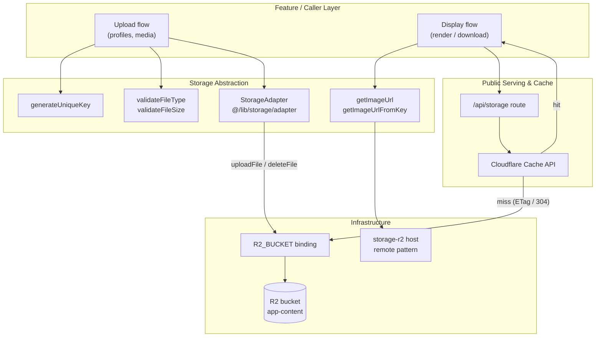
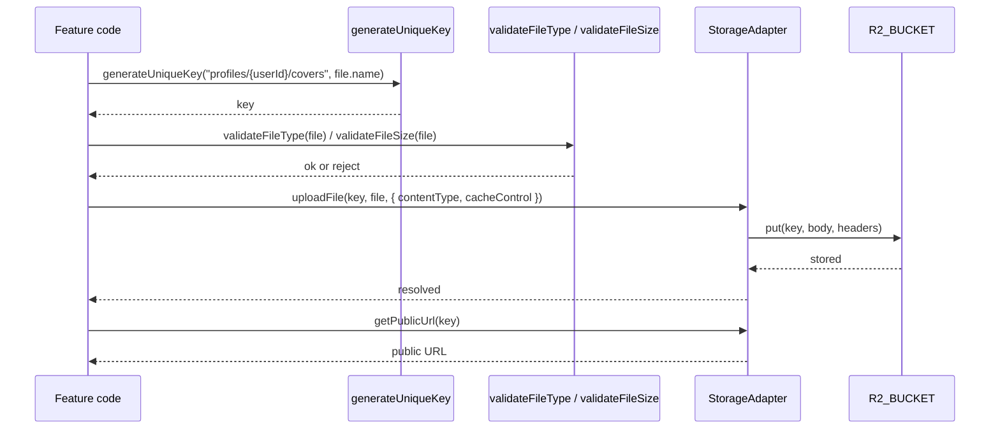
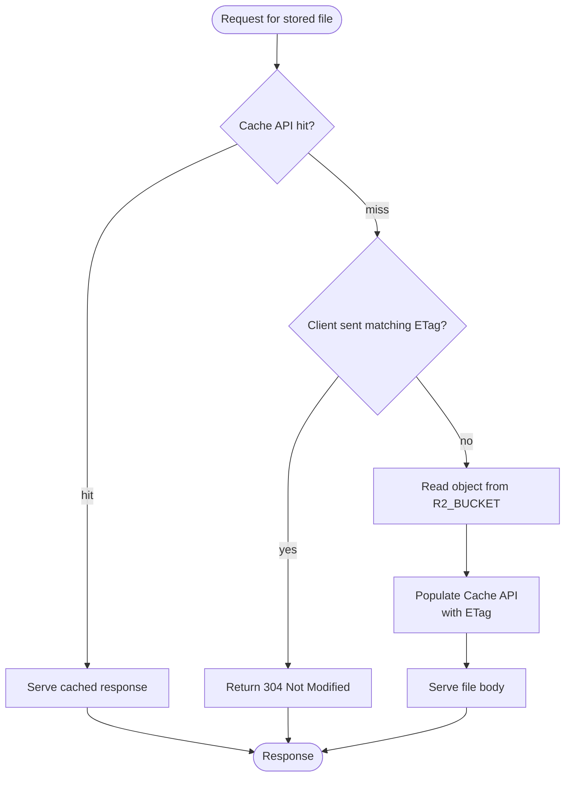

Object storage for the platform is centralized behind a single `StorageAdapter` abstraction that talks to a Cloudflare R2 bucket bound as `R2_BUCKET`, with public file delivery served through the Worker's storage route and layered caching.

## Purpose and Scope

This page documents how the application performs binary object storage: the `StorageAdapter` abstraction (`@/lib/storage/adapter`), the Cloudflare R2 bucket binding defined in `wrangler.jsonc`, the per-environment bucket configuration, the public URL scheme (`storage-r2.ozeaon.com` / `storage-r2.ozeaon.dev`), and the file-serving cache path under `/api/storage`. It also carries the per-file reference for the rest of `src/lib/storage` — the `R2BindingStorage` class behind the adapter, the module barrel, and the storage audit / orphan-cleanup pair — plus the server-side upload and delete pipelines built on top of the adapter (`src/lib/documents/upload.ts`, `src/lib/images/upload.ts`, `src/lib/images/delete.ts`). The browser-side, moderation-aware upload helper (`src/lib/images/client.ts`) is documented on [Media, Images & Attachments](../../features/media-and-images/).

It is intentionally bounded to the **storage layer**. Related topics that live on sibling pages:

- For the moderation workflow that consumes uploaded media, see the parent topic **Moderation & Storage**.
- For deployment mechanics, environment variables, and GitHub Environments configuration that inject storage secrets, see the deployment operations documentation (`docs/ops-deployment.md`).
- For the database schema and RLS policies that store object *metadata* (keys, ownership), see the data model / schema pages — this page covers the *bytes*, not the relational records.

## Overview

The application stores user-generated and application-managed files (profile covers, uploaded media, and other binary assets) in object storage rather than in the relational database. Cloudflare R2 is used as the object store, and it is accessed **exclusively** through a project-level abstraction called `StorageAdapter`.

Two design decisions dominate this subsystem:

1. **A single chokepoint for storage access.** The project convention (enforced by review, documented in `CLAUDE.md`) is that all storage operations must go through `StorageAdapter` at `@/lib/storage/adapter`. Application code must never touch the raw Cloudflare R2 binding directly, and must never instantiate an S3-compatible client. This keeps content-type handling, cache-control headers, key generation, and URL construction consistent across every feature.
2. **A stable public URL surface independent of the storage backend.** Files are addressed by an object *key* (a path-like string such as `profiles/{userId}/covers/{file}`), and the public URL is derived from that key through URL helpers. Because the key is the canonical identifier, the storage backend can change (different bucket, different CDN host per environment) without changing how callers reference files.

Key terminology used throughout this page:

| Term | Meaning |
| --- | --- |
| **Object key** | The path-like identifier of a stored object, e.g. `profiles/<userId>/covers/<filename>`. Generated by `generateUniqueKey`. |
| **StorageAdapter** | The application abstraction (`@/lib/storage/adapter`) wrapping all upload/URL/delete operations. |
| **`R2_BUCKET`** | The Cloudflare Worker binding name for the R2 bucket, declared in `wrangler.jsonc`. |
| **Public URL host** | The hostname that serves stored objects — `storage-r2.ozeaon.com` (production) / `storage-r2.ozeaon.dev` (dev), allow-listed in `next.config.ts`. |

## Architecture

The storage subsystem has four cooperating layers: the calling feature code, the `StorageAdapter` abstraction, the Cloudflare R2 binding (declared per environment in `wrangler.jsonc`), and the public file-serving/caching route under `/api/storage`.



The diagram reflects the real call graph: feature code generates keys and validates files *before* calling `StorageAdapter`, the adapter is the only component that talks to the `R2_BUCKET` binding, and read-path traffic for stored files flows through the `/api/storage` route with the Cloudflare Cache API in front of R2.

### Why this layering

- **Adapter as the only writer.** If the raw binding or an S3 client were used directly, different features would drift on cache headers and content types. Routing everything through one class means a change to cache policy is a one-line change in one file.
- **Key generation separated from the adapter.** `generateUniqueKey` lives in `@/utils` and composes the key from a logical prefix plus the original filename. This lets each feature own its own namespace (`profiles/<userId>/covers`) while the adapter stays generic.
- **URL helpers separated from the adapter.** `getImageUrl` / `getImageUrlFromKey` derive display URLs from keys, so rendering code never needs to know the bucket binding exists.

## `R2BindingStorage` — the binding class behind the adapter

`src/lib/storage/r2-binding.ts` is the one class in the codebase that talks to the raw `R2_BUCKET` binding. `StorageAdapter` is the application-facing facade over it; `R2BindingStorage` is the typed wrapper that turns options objects into Workers R2 API calls. It is constructed with the binding itself, which callers read from the Cloudflare context:

```typescript
import { getCloudflareContext } from "@opennextjs/cloudflare";
import { R2BindingStorage } from "@/lib/storage";

const { env } = await getCloudflareContext();
const storage = new R2BindingStorage(env.R2_BUCKET);
await storage.upload("key", data);
```

> Source: [index.ts](https://github.com/ozeaon/ozeaon-v2/blob/0a4f1a95824db87782f1221a4108019d174df3d9/src/lib/storage/index.ts#L1-L14)

### Method surface

| Method | Signature | Behaviour |
| --- | --- | --- |
| `upload` | `(key, data, options?) => Promise<UploadResult>` | `bucket.put` with `httpMetadata` assembled from `contentType` / `cacheControl` / `contentDisposition` (or a passthrough `options.httpMetadata`) and `customMetadata` from `options.metadata`. Accepts `string`, `ArrayBuffer`, `ArrayBufferView`, `ReadableStream`, `Blob`, or `null`. |
| `uploadFile` | `(key, file: File, options?) => Promise<UploadResult>` | Converts the `File` to an `ArrayBuffer` first (R2 needs a known length for streams) and defaults `contentType` to `file.type`. |
| `get` | `(key) => Promise<GetObjectResult \| null>` | Full read into an `ArrayBuffer`; `contentType` defaults to `application/octet-stream` when unset. |
| `getAsResponse` | `(key) => Promise<Response \| null>` | Streams `object.body` straight into a `Response` with `Content-Type`, `Cache-Control`, `Content-Disposition`, `ETag`, `Last-Modified`, and `Content-Length` headers — the read path used when serving objects. |
| `getAsText` / `getAsJson<T>` | `(key) => Promise<string \| T \| null>` | Convenience reads; `getAsJson` parses the text as JSON. |
| `exists` | `(key) => Promise<boolean>` | `bucket.head` non-null check. |
| `head` | `(key) => Promise<Omit<GetObjectResult, "data"> \| null>` | Metadata without the body. |
| `delete` / `deleteMany` | `(key)` / `(keys: string[])` | Single and batched `bucket.delete`. |
| `list` | `(options?) => Promise<ListResult>` | Paginated listing; `includeCustomMetadata: true` maps to `include: ["customMetadata"]`. Returns `objects`, `delimitedPrefixes`, `truncated`, and a `cursor` when truncated. |
| `copy` | `(sourceKey, destinationKey)` | No native R2 copy — downloads and re-uploads, preserving http and custom metadata. Throws if the source is missing. |
| `move` | `(sourceKey, destinationKey)` | `copy` then `delete`. |
| `createMultipartUpload` | `(key, options?) => Promise<R2MultipartUpload>` | Returns the raw Workers multipart handle for chunked uploads of large files. |

> Sources: [r2-binding.ts](https://github.com/ozeaon/ozeaon-v2/blob/0a4f1a95824db87782f1221a4108019d174df3d9/src/lib/storage/r2-binding.ts#L48-L49), [r2-binding.ts](https://github.com/ozeaon/ozeaon-v2/blob/0a4f1a95824db87782f1221a4108019d174df3d9/src/lib/storage/r2-binding.ts#L304-L408)

The file also owns the adapter's data shapes — `UploadOptions` (including an `onMark` timing hook used by the upload pipelines below), `UploadResult` (`key`, `size`, `etag`, `version?`), `GetObjectResult`, `ListOptions`, and `ListResult` — all re-exported from the module barrel. A closing note in the source records that the old free-function utilities (`generateUniqueKey`, `getContentType`, `validateFileSize`, `validateFileType`) were moved out to `@/utils/generators`, `@/utils/url`, and `@/utils/validators`; nothing of that kind lives here any more.

> Source: [r2-binding.ts](https://github.com/ozeaon/ozeaon-v2/blob/0a4f1a95824db87782f1221a4108019d174df3d9/src/lib/storage/r2-binding.ts#L411-L413)

### Module barrel (`src/lib/storage/index.ts` and `src/lib/index.ts`)

`src/lib/storage/index.ts` is the subsystem's public barrel: it re-exports `R2BindingStorage`, the five data types above, `StorageAdapter` (from `./adapter`), and the audit pair `auditStorage` / `cleanupOrphans` with their result types. `src/lib/storage/adapter.ts` itself imports the binding class, so the dependency chain is `adapter → r2-binding → R2_BUCKET`.

`src/lib/index.ts` is a top-level barrel that re-exports `cn`, `hasEnvVars`, and `getErrorMessage` from `@/utils/shadcn/utils` and then `export * from "./storage"`. Application code does not import through it — callers use `@/lib/storage` and `@/utils` directly — so it exists as a convenience root rather than a used surface.

> Sources: [storage/index.ts](https://github.com/ozeaon/ozeaon-v2/blob/0a4f1a95824db87782f1221a4108019d174df3d9/src/lib/storage/index.ts#L16-L35), [src/lib/index.ts](https://github.com/ozeaon/ozeaon-v2/blob/0a4f1a95824db87782f1221a4108019d174df3d9/src/lib/index.ts#L1-L3)

## Upload Workflow

Uploading a file is a three-step pipeline: **key generation → validation → adapter write**. The canonical pattern, taken from the project's storage documentation, is:

```typescript
import { StorageAdapter } from "@/lib/storage/adapter";
import { generateUniqueKey, validateFileType, validateFileSize } from "@/utils";
import { getImageUrl, getImageUrlFromKey } from "@/utils/url/image";

// Upload
const key = generateUniqueKey(`profiles/${userId}/covers`, file.name);
await StorageAdapter.uploadFile(key, file, {
  contentType: file.type,
  cacheControl: "public, max-age=31536000, immutable",
});

// Get URL & Delete
const url = StorageAdapter.getPublicUrl(key);
await StorageAdapter.deleteFile(key);

// Get URL to display/download file
const urlFromFile = getImageUrl({ path: key });

const urlFromPath_1 = getImageUrl(key);
const urlFromPath_2 = getImageUrlFromKey(key);
```

> Source: [r2-storage.md](https://github.com/ozeaon/ozeaon-v2/blob/0a4f1a95824db87782f1221a4108019d174df3d9/docs/r2-storage.md#L3-L24)

Walking through this in detail:

1. **Key generation** — `generateUniqueKey(prefix, filename)` receives a logical prefix (`profiles/${userId}/covers`) and the original file name. The prefix establishes a per-user namespace, which means a user's covers are grouped and the key can be traced back to an owner. The helper is responsible for producing a unique key so that concurrent uploads with the same filename do not collide.
2. **Validation** — `validateFileType` and `validateFileSize` (imported from `@/utils`) are the guard rails applied before any byte reaches R2. Keeping validation in shared utilities means the accepted MIME types and maximum size are consistent for every upload entry point.
3. **Write** — `StorageAdapter.uploadFile(key, file, options)` performs the actual write. The options object carries two semantics that matter for the read path:
   - `contentType: file.type` preserves the browser-reported MIME type so the object is served with the correct `Content-Type` later.
   - `cacheControl: "public, max-age=31536000, immutable"` is the *strongest* caching directive available (one year, immutable). The `immutable` flag is only safe because keys are unique per object — a given key is never rewritten with different content. This is the key design intent behind `generateUniqueKey`: **content-addressed-by-path immutability** lets the CDN cache aggressively without staleness risk.
4. **URL derivation & delete** — `StorageAdapter.getPublicUrl(key)` returns the direct public URL for a key, and `deleteFile(key)` removes the object. The display path uses the URL helpers instead (`getImageUrl`, `getImageUrlFromKey`), which normalize the different calling conventions used across the codebase.

### Upload sequence



The ordering matters: validation happens **before** the adapter call, so rejected files never consume storage or bandwidth; key generation happens before validation only to produce the namespace, and the key is not committed until `uploadFile` succeeds.

## Read & Cache Workflow

Serving is deliberately more layered than writing. Rather than reading from R2 on every request, stored files are served through the `/api/storage` route, which chains three tiers:

**Cloudflare Cache API → ETag revalidation (304) → R2 read.**



The three tiers exist for distinct reasons:

| Tier | Purpose | Why it is ordered here |
| --- | --- | --- |
| **Cloudflare Cache API** | Absorb repeat requests at the edge without invoking the Worker's storage logic. | Cheapest possible outcome — no R2 operation, no revalidation logic. Checked first. |
| **ETag / 304** | Avoid re-sending unchanged bytes while still guaranteeing client freshness. | When the edge cache misses but the client already holds the version, a 304 avoids a full body transfer. |
| **R2 read** | The authoritative source of bytes. | Only reached on a true miss, so it is the least frequently exercised path. |

Combined with the year-long `immutable` cache-control set at upload time, this pattern means immutable objects are served from cache essentially forever, and R2 is read only for cold objects. The stated chain in the project documentation is:

> **File caching** (`/api/storage`): Cloudflare Cache API → ETag 304 → R2 read

> Source: [r2-storage.md](https://github.com/ozeaon/ozeaon-v2/blob/0a4f1a95824db87782f1221a4108019d174df3d9/docs/r2-storage.md#L26)

## Server-Side Upload Pipelines

Three server helpers wrap the validate → key → upload → DB-record sequence for the route handlers in `src/app/api/*`. All of them write bytes through `StorageAdapter` first and insert the relational record second, and all of them delete the uploaded object when the record insert fails, so a failed write never strands an orphan.

### `uploadImage` — `src/lib/images/upload.ts`

```typescript
export async function uploadImage({
  supabase, userId, file, storageKeyPrefix, uploadType, maxSize,
  account, surface, width, height, onMark,
}: UploadImageParams): Promise<UploadImageResult>
```

> Source: [upload.ts](https://github.com/ozeaon/ozeaon-v2/blob/0a4f1a95824db87782f1221a4108019d174df3d9/src/lib/images/upload.ts#L12-L24)

The full image pipeline, in order:

1. **Validation** — `validateFileType(file.name, IMAGE_CONFIG.allowedTypes)` and `validateFileSize(file.size, maxSize)` return `400` with the shared `IMAGE_ERROR_MESSAGES` wording before anything is written.
2. **Key + write** — `generateUniqueKey(storageKeyPrefix, file.name)` then `StorageAdapter.uploadFile` with `cacheControl: "public, max-age=31536000, immutable"` and custom metadata (`userId`, `uploadType`, `originalName`, `uploadedAt`). An `onMark` callback is forwarded so routes can time the write.
3. **Moderation gate** — `resolveModerationImage` + `checkUploadedImage` run the asset through the content-moderation pipeline (see [Content Moderation Pipeline](../moderation/)). A `rejected` decision deletes the just-uploaded object (best-effort, logged on failure) and returns `422` with `moderation: [{ field: uploadType, categories }]`; any other non-`allowed` decision returns `503` with the shared "We couldn't complete the content check" message.
4. **DB record** — inserts into `images` (`path`, `uploader_id`, `alt`, `title` derived by stripping the extension, `mime_type`, `file_size_bytes`, caller-measured `width`/`height`). On insert failure the object is deleted and `500` returned.
5. **Result** — `{ imageId, imageUrl: StorageAdapter.getPublicUrl(path), path }`.

Consumed by the image routes for posts and projects (`/api/posts/image`, `/api/projects/[id]/image`, `/api/projects/[id]/section-image`).

> Source: [upload.ts](https://github.com/ozeaon/ozeaon-v2/blob/0a4f1a95824db87782f1221a4108019d174df3d9/src/lib/images/upload.ts#L43-L90)

### `uploadDocument` — `src/lib/documents/upload.ts`

The document variant validates against the **database**, not a config list: it looks the file's MIME type up in `document_types` and returns `{ error: "Unsupported file type", status: 400 }` when no row matches. It then extracts `page_count` via `extractPdfPageCount`, writes to `${storageKeyPrefix}/${Date.now()}-${file.name}` with `cacheControl: "private, max-age=0"` — note the contrast with images: documents are **private and never cached** — and inserts into `documents` (`uploader_id`, `document_type_id`, `path`, `filename`, `file_size_bytes`, `page_count`, `title` defaulting to the filename). A failed insert deletes the uploaded object and returns `500` (`"Failed to save document record"`).

> Source: [upload.ts](https://github.com/ozeaon/ozeaon-v2/blob/0a4f1a95824db87782f1221a4108019d174df3d9/src/lib/documents/upload.ts#L12-L67)

Consumed by `/api/projects/[id]/documents`.

### `deleteImageById` — `src/lib/images/delete.ts`

Deletion distinguishes **why** a row survived, because only one of the reasons actually removed anything:

```typescript
export type DeleteImageOutcome =
  "deleted" | "referenced" | "blocked" | "failed";
```

> Source: [delete.ts](https://github.com/ozeaon/ozeaon-v2/blob/0a4f1a95824db87782f1221a4108019d174df3d9/src/lib/images/delete.ts#L8-L10)

It deletes the `images` row first (`delete().eq("id", imageId).select("path").maybeSingle()`), then removes the object:

| Outcome | Trigger | Meaning |
| --- | --- | --- |
| `"referenced"` | Postgres `P0001` — `trg_prevent_image_deletion` raised because another entity still points at the image | Expected for a shared asset; not logged as a failure |
| `"blocked"` | The delete matched no row — already gone, or RLS hid it from this client | Nothing was deleted |
| `"failed"` | Any other DB error | Logged via `logError` with the `imageId` |
| `"deleted"` | Row removed; `StorageAdapter.deleteFile(image.path)` follows, best-effort | The bucket object may outlive a failed R2 delete (logged, not retried) |

> Source: [delete.ts](https://github.com/ozeaon/ozeaon-v2/blob/0a4f1a95824db87782f1221a4108019d174df3d9/src/lib/images/delete.ts#L12-L41)

Consumed by the post, project, section-image, and organization image routes.

## Storage Audit & Orphan Cleanup

`src/lib/storage/audit.ts` reconciles the bucket against the relational metadata and repairs the difference. It exists because the delete paths above are best-effort: any failed R2 delete or missing DB write leaves the two stores disagreeing.

### `auditStorage(): Promise<StorageAuditResult>`

Walks the **entire** bucket and both metadata tables and diffs them:

- **R2 side** — pages through `R2BindingStorage.list({ limit: 1000, cursor, includeCustomMetadata: true })` until `truncated` is false, keeping each object's `size`, `lastModified`, `uploadType`, and any `articleId`/`projectId`/`postId` metadata entry.
- **DB side** — pages through `images` and `documents` (`id, path, uploader_id, created_at`) in 1000-row ranges using `createAdminClient()`, the RLS-bypassing client — the audit must see every row regardless of caller. Requires `env.R2_BUCKET` from the Cloudflare context and throws when it is absent.

An R2 object whose key is not in the DB path set is an **R2 orphan**; a DB row whose path has no object is a **DB orphan**. The result carries both lists plus `stats` (`r2Total`, `dbTotal`, `matched`, `r2Orphans`, `dbOrphans`) and a `scannedAt` timestamp.

> Source: [audit.ts](https://github.com/ozeaon/ozeaon-v2/blob/0a4f1a95824db87782f1221a4108019d174df3d9/src/lib/storage/audit.ts#L51-L161)

### `cleanupOrphans(result): Promise<CleanupResult>`

Takes an audit result and deletes both orphan sets: R2 orphans through `storage.deleteMany(keys)`, DB orphans through one `delete().in("id", ids)` on `images` via the admin client. Each side is independently try/caught — a failed R2 sweep does not stop the DB sweep — and every failure is collected into `errors` as a string rather than thrown, so one call reports everything that went wrong.

> Source: [audit.ts](https://github.com/ozeaon/ozeaon-v2/blob/0a4f1a95824db87782f1221a4108019d174df3d9/src/lib/storage/audit.ts#L163-L203)

### Caller

The pair is exposed by the secret-gated `/api/storage/audit` route: `GET` runs `auditStorage()` and returns the report; `DELETE` runs the audit and then `cleanupOrphans`, returning what was deleted. Both require an `x-audit-secret` header matching the `STORAGE_AUDIT_SECRET` environment variable and return `403` otherwise — appropriate, given the admin client and bulk-delete behaviour. The route is one of the plain-export handlers that pass `route`/`method` to `logError` explicitly (see [Logging & Observability](../../operations/logging-observability/)).

> Source: [route.ts](https://github.com/ozeaon/ozeaon-v2/blob/0a4f1a95824db87782f1221a4108019d174df3d9/src/app/api/storage/audit/route.ts#L4-L39)

## Configuration

### R2 bucket bindings (`wrangler.jsonc`)

The R2 bucket is bound to the Worker under the name `R2_BUCKET`. The binding is declared **per environment**, so each deployment stage points at a distinct bucket:

| Environment | Binding name | Bucket name | Source |
| --- | --- | --- | --- |
| Top-level (default) | `R2_BUCKET` | `app-content` (preview: `app-content`) | [wrangler.jsonc](https://github.com/ozeaon/ozeaon-v2/blob/0a4f1a95824db87782f1221a4108019d174df3d9/wrangler.jsonc#L29-L34) |
| `staging` | `R2_BUCKET` | `staging-app-content` | [wrangler.jsonc](https://github.com/ozeaon/ozeaon-v2/blob/0a4f1a95824db87782f1221a4108019d174df3d9/wrangler.jsonc#L50-L53) |
| `staging` (named worker) | `R2_BUCKET` | `staging-app-content` | [wrangler.jsonc](https://github.com/ozeaon/ozeaon-v2/blob/0a4f1a95824db87782f1221a4108019d174df3d9/wrangler.jsonc#L69-L72) |

The binding name is **identical across environments** (`R2_BUCKET`) while the *bucket* differs. This is what allows `StorageAdapter` to reference a single binding name unconditionally — the environment separation is handled entirely at the infrastructure layer, and application code is oblivious to which bucket it is writing to.

The deployment documentation confirms this arrangement:

> `wrangler.jsonc` defines `r2_buckets` and the `WORKER_SELF_REFERENCE` service binding per-environment under `env.staging` / `env.production`.

> Source: [ops-deployment.md](https://github.com/ozeaon/ozeaon-v2/blob/0a4f1a95824db87782f1221a4108019d174df3d9/docs/ops-deployment.md#L29)

Deployment guidance is emphatic that secret/binding configuration belongs in the GitHub repository **Environments**, not the Cloudflare dashboard, because workflows inject them at build/deploy time:

> Configure the R2 bucket binding as `R2_BUCKET` in `wrangler.jsonc`.

> Source: [ops-deployment.md](https://github.com/ozeaon/ozeaon-v2/blob/0a4f1a95824db87782f1221a4108019d174df3d9/docs/ops-deployment.md#L36)

### Public host allow-listing (`next.config.ts`)

Stored files are served from dedicated `storage-r2` hostnames. These hosts are collected into a `Set` (de-duplicated) and used as allowed image remote patterns:

```typescript
[
  "storage-r2.ozeaon.com",
  "storage-r2.ozeaon.dev",
  storageHost,
].filter(
  Boolean,
```

> Source: [next.config.ts](https://github.com/ozeaon/ozeaon-v2/blob/0a4f1a95824db87782f1221a4108019d174df3d9/next.config.ts#L32-L34)

Design intent:

- Two **static** production/dev hostnames plus a dynamic `storageHost` (likely sourced from environment) are merged and `.filter(Boolean)`-ed so an unset `storageHost` does not inject an empty entry.
- Wrapping in `new Set(...)` de-duplicates in case `storageHost` equals one of the static hosts.

### Incremental cache overrides (`open-next.config.ts`)

OpenNext's Cloudflare adapter exposes an optional R2-backed incremental cache. In this project that override is **present but commented out**, meaning the OpenNext `incrementalCache` is *not* backed by R2 in the current configuration:

```typescript
import { defineCloudflareConfig } from "@opennextjs/cloudflare";
// import r2IncrementalCache from "@opennextjs/cloudflare/overrides/incremental-cache/r2-incremental-cache";
// import d1NextTagCache from "@opennextjs/cloudflare/overrides/tag-cache/d1-next-tag-cache";
```

> Source: [open-next.config.ts](https://github.com/ozeaon/ozeaon-v2/blob/0a4f1a95824db87782f1221a4108019d174df3d9/open-next.config.ts#L1-L3)

This is an important distinction: the **application** storage (user files) uses R2 via `StorageAdapter`, while the **Next.js incremental cache** is *not* using `r2IncrementalCache` here. Do not conflate the two when reasoning about where data lives.

## API Reference

The following surface is documented from the usage patterns in `docs/r2-storage.md`. The adapter is imported as a module-level export named `StorageAdapter` from `@/lib/storage/adapter`.

### `StorageAdapter.uploadFile(key, file, options)`

Writes an object to the bound R2 bucket.

**Parameters:**

- `key` (string): The object key produced by `generateUniqueKey`. Determines the object's location/namespace in the bucket.
- `file` (File / Blob): The binary payload to store.
- `options` (object): Write options.
  - `contentType` (string): MIME type recorded on the object, e.g. `file.type`.
  - `cacheControl` (string): Cache-Control header stored with the object, e.g. `"public, max-age=31536000, immutable"`.

**Returns:** A promise that resolves when the write completes.

> Source: [r2-storage.md](https://github.com/ozeaon/ozeaon-v2/blob/0a4f1a95824db87782f1221a4108019d174df3d9/docs/r2-storage.md#L9-L13)

### `StorageAdapter.getPublicUrl(key)`

Returns the public URL for a stored object.

**Parameters:**

- `key` (string): The object key.

**Returns:** The public URL string for the key.

> Source: [r2-storage.md](https://github.com/ozeaon/ozeaon-v2/blob/0a4f1a95824db87782f1221a4108019d174df3d9/docs/r2-storage.md#L16)

### `StorageAdapter.deleteFile(key)`

Deletes a stored object.

**Parameters:**

- `key` (string): The object key to remove.

**Returns:** A promise that resolves when deletion completes.

> Source: [r2-storage.md](https://github.com/ozeaon/ozeaon-v2/blob/0a4f1a95824db87782f1221a4108019d174df3d9/docs/r2-storage.md#L17)

### Utility helpers

These live outside the adapter and are used alongside it:

| Helper | Module | Purpose |
| --- | --- | --- |
| `generateUniqueKey(prefix, filename)` | `@/utils` | Builds a unique, namespaced object key. |
| `validateFileType(file)` | `@/utils` | Validates the uploaded file's MIME type. |
| `validateFileSize(file)` | `@/utils` | Validates the uploaded file's size. |
| `getImageUrl({ path })` | `@/utils/url/image` | Derives a display URL from an object `{ path }`. |
| `getImageUrl(key)` | `@/utils/url/image` | Derives a display URL from a key. |
| `getImageUrlFromKey(key)` | `@/utils/url/image` | Derives a display URL from a key (explicit variant). |

> Source: [r2-storage.md](https://github.com/ozeaon/ozeaon-v2/blob/0a4f1a95824db87782f1221a4108019d174df3d9/docs/r2-storage.md#L4-L6)

Note that the URL helpers accept **two calling conventions** — an object wrapper (`getImageUrl({ path: key })`) and a bare key (`getImageUrl(key)`, `getImageUrlFromKey(key)`). All three produce a URL from the same key, which is what makes them safe drop-in alternatives during refactors. Prefer `getImageUrlFromKey` in new code when the intent should be explicit.

## Failure Modes, Edge Cases & Concurrency

Because source exploration was bounded, the following are the failure characteristics *observable from the documented contract and configuration*; deeper implementation specifics of the adapter internals were not read.

| Scenario | Why it happens | Mitigation implied by the design |
| --- | --- | --- |
| **Key collision on concurrent uploads** | Two uploads with the same prefix and filename could map to the same key. | `generateUniqueKey` exists specifically to produce unique keys; uniqueness is the contract, not the caller's responsibility. |
| **Stale content after re-upload** | The upload path sets `immutable` + one-year `max-age`. | Safe only because keys are unique/immutable by convention — **never overwrite an existing key with new bytes**, as caches will not revalidate. Generate a new key instead. |
| **Wrong `Content-Type` served** | The object is served with whatever content type was stored. | `uploadFile` requires `contentType: file.type`; omitting it yields incorrect delivery headers. |
| **Invalid or oversized file reaching R2** | A caller forgets to validate. | Validation (`validateFileType`, `validateFileSize`) must be invoked *before* `uploadFile`; these are not automatic inside the adapter based on the documented pattern. |
| **Cross-environment bucket confusion** | Same binding name (`R2_BUCKET`) resolves to different buckets per environment. | This is intentional; ensure deployment config injects the correct bucket. Never assume the binding points at production. |
| **Client holds stale version but edge missed** | Cache API miss but client has a valid ETag. | The 304 tier short-circuits before an R2 read, avoiding redundant body transfer. |
| **Empty remote-pattern entry** | `storageHost` env var unset. | `next.config.ts` `.filter(Boolean)` prevents an empty host from entering the allow-list. |
| **DB insert fails after a successful upload** | The record insert in `uploadImage` / `uploadDocument` errors. | The just-written object is deleted best-effort and `500` returned; a failed delete is logged, producing an R2 orphan the audit can sweep. |
| **Image rejected by moderation** | `checkUploadedImage` returns a non-`allowed` decision after the object was written. | The object is deleted and `422` (with moderation categories) or `503` returned — rejected bytes are never persisted. |
| **Shared image delete refused** | `trg_prevent_image_deletion` raises `P0001` while another entity references the row. | `deleteImageById` maps it to `"referenced"` — expected behaviour, not an error. |
| **Image delete matches no row** | The image was already deleted, or RLS hid it from this client. | Outcome `"blocked"`; callers must not treat it as success. |
| **Audit without `R2_BUCKET` in context** | `auditStorage` cannot construct the binding storage. | Throws `"R2_BUCKET not available in Cloudflare context"` before any work. |
| **Partial cleanup failure** | R2 bulk delete or the `images` bulk delete fails. | `cleanupOrphans` collects per-side error strings in `errors` instead of throwing, and still completes the other side. |

### Concurrency and consistency notes

- **Read-after-write:** Because uploads write directly to R2 and reads may be served from the Cloudflare Cache API, there is an inherent cache-population step on the read path. Immutable keys make this benign; mutable keys would create a consistency hazard.
- **Binding identity across environments:** A single binding name means the *same application binary* behaves identically in staging and production while touching different buckets. This is a deliberate isolation mechanism, not an accident.

## Extension Points

| Extension point | How to extend | Constraint |
| --- | --- | --- |
| **New namespaces** | Pass a new logical prefix to `generateUniqueKey` (e.g., `uploads/<userId>/avatars`). | Keep the `<domain>/<ownerId>/<subpath>` shape so keys remain traceable to owners. |
| **Storage backend swap** | Change the bucket in `wrangler.jsonc` or swap the adapter implementation. | Callers must continue addressing objects by key so URL derivation stays backend-agnostic. |
| **Cache policy tuning** | Change the `cacheControl` option passed to `uploadFile`. | Only use `immutable` when the key is never rewritten. |
| **Public host changes** | Add/adjust hosts in the `next.config.ts` remote-pattern `Set`. | New hosts must be added to the allow-list or image optimization will reject them. |
| **OpenNext incremental cache over R2** | Uncomment `r2IncrementalCache` and `d1NextTagCache` in `open-next.config.ts`. | Currently disabled — enabling it changes framework-level caching behavior and should be a deliberate decision. |

> Source: [open-next.config.ts](https://github.com/ozeaon/ozeaon-v2/blob/0a4f1a95824db87782f1221a4108019d174df3d9/open-next.config.ts#L1-L7)

## Operational Considerations

- **Mandatory abstraction.** The project convention is explicit and non-negotiable:

  > Always go through `StorageAdapter` (`@/lib/storage/adapter`) — never the raw R2 binding or an S3-compatible client.

  > Source: [CLAUDE.md](https://github.com/ozeaon/ozeaon-v2/blob/0a4f1a95824db87782f1221a4108019d174df3d9/CLAUDE.md#L135-L136)

  Enforcing this in review prevents drift in cache headers, content types, and URL construction. It also means the storage backend is swappable, since no feature code is coupled to Cloudflare-specific APIs.

- **Stack context.** R2 is part of the platform's core infrastructure alongside Supabase and Cloudflare Workers:

  > Supabase (RLS, 30+ tables), Cloudflare R2 + Workers, pnpm. Deployment: OpenNext + Wrangler → Cloudflare Workers.

  > Source: [CLAUDE.md](https://github.com/ozeaon/ozeaon-v2/blob/0a4f1a95824db87782f1221a4108019d174df3d9/CLAUDE.md#L49)

- **Environment provisioning.** Bucket bindings and related secrets belong in GitHub repository **Environments**, not the Cloudflare dashboard, because the deployment workflows inject them at build/deploy time.

## Related Links

- [R2 Storage Patterns (docs/r2-storage.md)](https://github.com/ozeaon/ozeaon-v2/blob/0a4f1a95824db87782f1221a4108019d174df3d9/docs/r2-storage.md) — the canonical upload/URL/delete pattern and cache chain.
- [R2 binding class](https://github.com/ozeaon/ozeaon-v2/blob/0a4f1a95824db87782f1221a4108019d174df3d9/src/lib/storage/r2-binding.ts) — `R2BindingStorage` and its data types.
- [Storage module barrel](https://github.com/ozeaon/ozeaon-v2/blob/0a4f1a95824db87782f1221a4108019d174df3d9/src/lib/storage/index.ts) — public exports for the subsystem.
- [Storage audit](https://github.com/ozeaon/ozeaon-v2/blob/0a4f1a95824db87782f1221a4108019d174df3d9/src/lib/storage/audit.ts) — `auditStorage` / `cleanupOrphans`; exposed by the [audit route](https://github.com/ozeaon/ozeaon-v2/blob/0a4f1a95824db87782f1221a4108019d174df3d9/src/app/api/storage/audit/route.ts).
- [Image upload pipeline](https://github.com/ozeaon/ozeaon-v2/blob/0a4f1a95824db87782f1221a4108019d174df3d9/src/lib/images/upload.ts) and [image delete](https://github.com/ozeaon/ozeaon-v2/blob/0a4f1a95824db87782f1221a4108019d174df3d9/src/lib/images/delete.ts) — server-side helpers.
- [Document upload pipeline](https://github.com/ozeaon/ozeaon-v2/blob/0a4f1a95824db87782f1221a4108019d174df3d9/src/lib/documents/upload.ts) — `uploadDocument`.
- Client-side moderated uploads live on [Media, Images & Attachments](../../features/media-and-images/); the moderation gate itself on [Content Moderation Pipeline](../moderation/).
- [wrangler.jsonc](https://github.com/ozeaon/ozeaon-v2/blob/0a4f1a95824db87782f1221a4108019d174df3d9/wrangler.jsonc#L29-L72) — R2 bucket bindings per environment.
- [next.config.ts](https://github.com/ozeaon/ozeaon-v2/blob/0a4f1a95824db87782f1221a4108019d174df3d9/next.config.ts#L32-L34) — `storage-r2` remote host allow-listing.
- [open-next.config.ts](https://github.com/ozeaon/ozeaon-v2/blob/0a4f1a95824db87782f1221a4108019d174df3d9/open-next.config.ts#L1-L7) — commented-out R2 incremental cache overrides.
- [docs/ops-deployment.md](https://github.com/ozeaon/ozeaon-v2/blob/0a4f1a95824db87782f1221a4108019d174df3d9/docs/ops-deployment.md#L29-L36) — deployment, environment configuration, and secret injection.
- [CLAUDE.md](https://github.com/ozeaon/ozeaon-v2/blob/0a4f1a95824db87782f1221a4108019d174df3d9/CLAUDE.md#L135-L136) — project convention mandating `StorageAdapter` usage.
