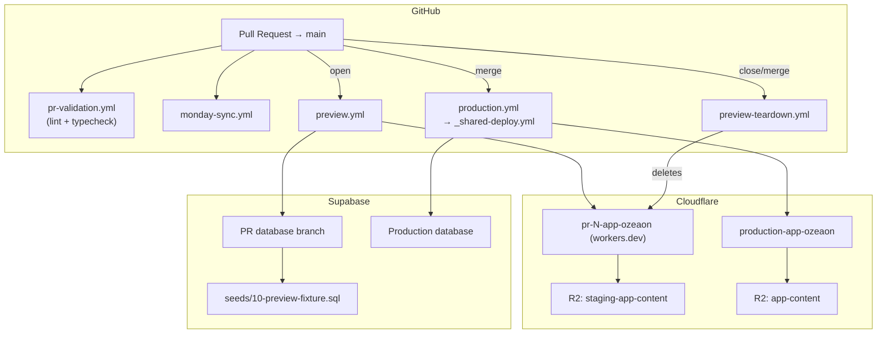
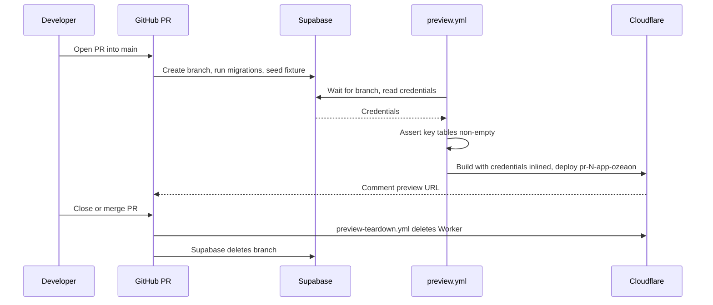

The OZEAON pipeline is built around three ideas: every pull request into `main` gets its own Cloudflare Worker and its own Supabase database branch; schema changes ship with the code that needs them; and preview environments are seeded from a committed fixture rather than a real-data dump.

## Overview

| File | Purpose |
| --- | --- |
| `.github/workflows/preview.yml` | Build and deploy a per-PR Worker |
| `.github/workflows/preview-teardown.yml` | Delete the Worker on PR close or merge |
| `.github/workflows/production.yml` | Deploy to production on merge to `main` |
| `.github/workflows/staging.yml` | Manual redeployment of the staging Worker (dispatch-only — the `staging` branch is retired) |
| `.github/workflows/monday-sync.yml` | Link PRs to Monday items and advance their status |
| `.github/workflows/pr-validation.yml` | Lint and type-check on every PR |
| `.github/workflows/pr-monitoring.yml` | Discord notifications on PR events |
| `.github/workflows/backmerge.yml` | Back-merge production changes to open PRs |
| `.github/workflows/performance-report.yml` | Weekly cron performance summary |
| `.github/workflows/_shared-build.yml` | Reusable build job (install → typegen → lint → `ci:build`) |
| `.github/workflows/_shared-deploy.yml` | Reusable deploy job (`ci:build` with real secrets → `wrangler-action`) |
| `.github/CODEOWNERS` | Review enforcement for `src/`, `supabase/`, `.github/workflows/` |

## Architecture

## Development Flow

The everyday path: feature branch → local dev (`pnpm dev`) → PR with `Closes TOZN-<n>` in the title or description → QA on the PR's own preview environment → merge → automatic production deployment. Commit format (Conventional Commits), branch naming conventions and PR requirements are documented in [`docs/workflows.md`](https://github.com/ozeaon/ozeaon-v2/blob/0a4f1a95824db87782f1221a4108019d174df3d9/docs/workflows.md).

**Deployment is CI-only.** `pnpm ci:deploy` runs only inside `_shared-deploy.yml`. Never run it locally. Rollback is `git revert` + push to trigger CI — not `wrangler rollback`. The failing workflow writes rollback instructions into `$GITHUB_STEP_SUMMARY`.

Two enforcement gaps shape the practical risk:

- **No required status check on `main`.** `pr-validation.yml` runs lint and type-checks on every PR, but nothing blocks a merge if they are red — engineers must read the checks before merging.
- **No approval count enforced.** A PR touching none of `src/`, `supabase/`, or `.github/workflows/` can merge unreviewed despite CODEOWNERS.

## Monday Ticket Automation

`monday-sync.yml` links a PR to its Monday item and moves it forward as the PR progresses. Both jobs share the link-detection logic in `.github/scripts/monday-ticket.mjs`.

A ticket is linked only by an explicit closes line in the PR **title or description** — `Closes TOZN-<n>` or `Closes BOZN-<n>`. IDs in branch names and commit messages are ignored. IDs inside backticks or fenced blocks are also ignored: a PR description once moved five live tickets by describing the rule in plain prose.

| Event | Tasks column | Bugs Queue column |
| --- | --- | --- |
| PR opened / made ready | Code Review | Code Review |
| One approving review | QA | QA |
| PR converted to draft (from Code Review only) | Dev In Progress | Fixing |
| Merged | Done | Fixed |

Moves are **forward-only**. A PR with no closes line fails the **Ticket ID** check; applying the `no-ticket` label clears it immediately with no new commit required. Draft PRs and bot PRs are skipped.

**Token exposure:** `MONDAY_API_TOKEN` is reachable by same-repo PRs. The mitigation is scoping the token to the two boards. The clean fix (`pull_request_target`) is deferred because it would prevent testing changes to `monday-ticket.mjs`.

## Preview Deployment Lifecycle

Every PR into `main` gets its own Worker and its own Supabase database branch. The cost is roughly 7 minutes end-to-end and approximately $0.013/branch-hour; the branch limit is 10.

| Aspect | Value |
| --- | --- |
| URL | `https://pr-<N>-app-ozeaon.joseph-400.workers.dev` |
| Login | `alpha@ozeaon.com` … `tango@ozeaon.com` — password `ozeaon-preview` |
| Lifetime | Created on PR open, destroyed on close or merge |

### End-to-End Flow

### Why a Worker per PR

Cloudflare mints no preview URL for a Worker exporting a Durable Object. `.open-next/worker.js` exports three (`DOQueueHandler`, `DOShardedTagCache`, `BucketCachePurge`) even with every override in `open-next.config.ts` commented out — uploads succeed silently, no URL is ever created. Each PR therefore deploys a fully separate Worker under its own `workers.dev` hostname. Because each is a freshly created Worker it inherits no secrets — every secret must be written in full on each deploy.

### Why a Fixture

`supabase/seed.sql` (the real-data dump) is gitignored, so the Supabase GitHub integration cannot read it and branches came up empty. [`supabase/seeds/10-preview-fixture.sql`](https://github.com/ozeaon/ozeaon-v2/blob/0a4f1a95824db87782f1221a4108019d174df3d9/supabase/seeds/10-preview-fixture.sql) is committed, contains no real data, and is what the integration seeds. `seeds/00-truncate.sql` is excluded from `sql_paths` for the same reason: without the real dump it would only destroy the reference data migrations create (`member_roles`, `sdgs`, `article_types`).

### Migration Drift Guard

Seeds run **after** migrations. A migration that drops or renames a column the fixture writes to leaves the branch empty — but credentials still resolve and the build still succeeds, making this a silent failure. `preview.yml` asserts that a few key tables are non-empty and fails the check rather than deploying silently.

| Situation | Action |
| --- | --- |
| Fixture out of date for a migration | Update `seeds/10-preview-fixture.sql` in the same PR |
| Preview needed before the fixture is fixed | Apply `preview:allow-empty-db` — the check warns and deploys anyway |

Fixture edits are not re-applied to an existing branch — seeds run at branch creation only. To pick up a fixture edit, close and reopen the PR.

### Secrets & Mail in Previews

Because each preview is a freshly created Worker, every secret must be written in full per deploy.

| Secret / setting | Behavior in preview |
| --- | --- |
| `PREVIEW_RESEND_API_KEY` | Separate key — previews send **real** email |
| `PREVIEW_MAILCHIMP_*` | Unset — mailing-list writes fail rather than touching the live audience |
| `ACCESS_TOKEN` / `PREVIEW_ACCESS_TOKEN` | `ozeaon-preview` by default; production token never reaches a public hostname |
| `PREVIEW_OPENAI_API_KEY` | Prevents previews spending production's moderation quota |

Preview R2 binds `staging-app-content` (shared with staging). Uploads persist after teardown.

## Failure Modes & Edge Cases

| Failure | Detection | Mitigation |
| --- | --- | --- |
| Worker version has no preview URL | Silent — upload succeeds, no URL | Deploy a full Worker per PR (current approach) |
| Preview branch seeds to nothing | Empty pages, green build | Committed fixture `10-preview-fixture.sql` |
| Migration renames/drops fixture targets | Empty pages; credentials and build still succeed | `preview.yml` asserts key tables non-empty |
| Preview needed before fixture is fixed | — | `preview:allow-empty-db` label downgrades to a warning |
| Fixture edited but branch unchanged | Seeds run at creation only | Close and reopen PR |
| `revalidateTag` from preview | Routes to staging code via `WORKER_SELF_REFERENCE` | By design; Worker must exist before binding is created |
| `psql` targets wrong server | Local stack not running | `db:reset-real` stops rather than falling through to an unintended server |
| Ticket not linked | Ticket ID check fails | `no-ticket` label clears the check; no new commit needed |
| Ticket regressed out of QA | — | Moves forward-only; draft-return reverses from Code Review only |
| Tickets moved by documentation prose | — | IDs inside backticks/fenced blocks are never parsed |

**Third enforcement gap:** `MONDAY_API_TOKEN` is reachable by same-repo PRs — bounded by least-privilege scoping to the two boards pending `pull_request_target` migration.

## Operational Notes

- **Time budget:** roughly 7 minutes per preview cycle.
- **Cost:** approximately $0.013/branch-hour; hard limit of 10 branches. Teardown on close/merge keeps the pool free.
- **Review ownership:** `.github/CODEOWNERS` governs `src/`, `supabase/` and `.github/workflows/`.
- **Mail:** previews use `PREVIEW_RESEND_API_KEY` — treat any address entered in a preview as a live recipient.
- **Teardown completeness:** Worker and Supabase branch are removed; R2 uploads persist because storage is shared with staging.
- **Monday script sharing:** `monday-ticket.mjs` is consumed by both sync jobs; a change to link parsing affects both the Tasks and Bugs Queue paths.
- **Local testing:** `pnpm run preview` builds the OpenNext bundle and serves it locally on port 3000 — safe to run locally. Only `ci:deploy` is CI-only.

## Related Links

- [`docs/workflows.md`](https://github.com/ozeaon/ozeaon-v2/blob/0a4f1a95824db87782f1221a4108019d174df3d9/docs/workflows.md) — commit conventions, branch naming, PR requirements, Monday automation detail
- [`docs/deployment-previews.md`](https://github.com/ozeaon/ozeaon-v2/blob/0a4f1a95824db87782f1221a4108019d174df3d9/docs/deployment-previews.md) — per-PR Worker and Supabase branch lifecycle
- [Cloudflare Deployment](../cloudflare-deployment/) — build/deploy commands, OpenNext adapter, runtime constraints
- [Config & Constants](../../config-and-utils/config-constants/) — environment variable inventory
- [`supabase/seeds/10-preview-fixture.sql`](https://github.com/ozeaon/ozeaon-v2/blob/0a4f1a95824db87782f1221a4108019d174df3d9/supabase/seeds/10-preview-fixture.sql) — synthetic accounts, projects, articles and posts
- [`wrangler.jsonc`](https://github.com/ozeaon/ozeaon-v2/blob/0a4f1a95824db87782f1221a4108019d174df3d9/wrangler.jsonc) — Worker names, R2 bindings and preview environment settings
