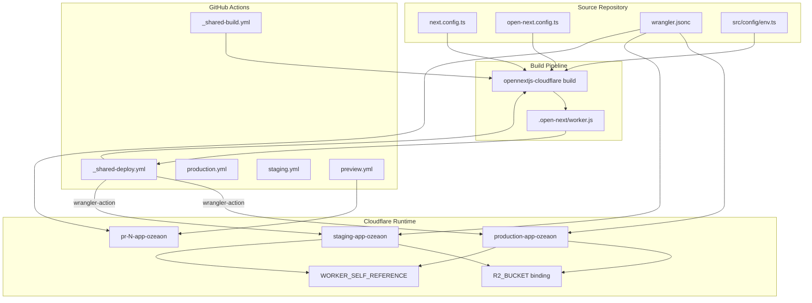
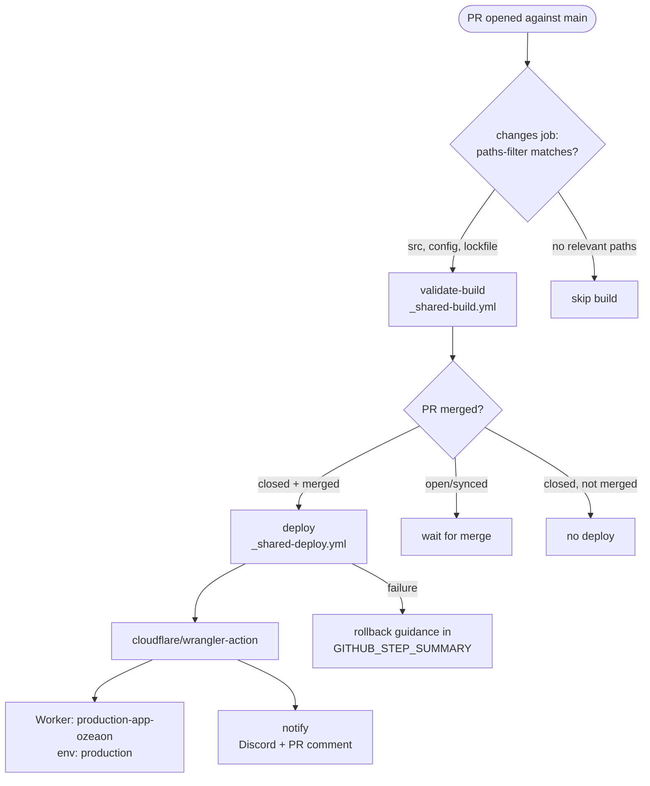
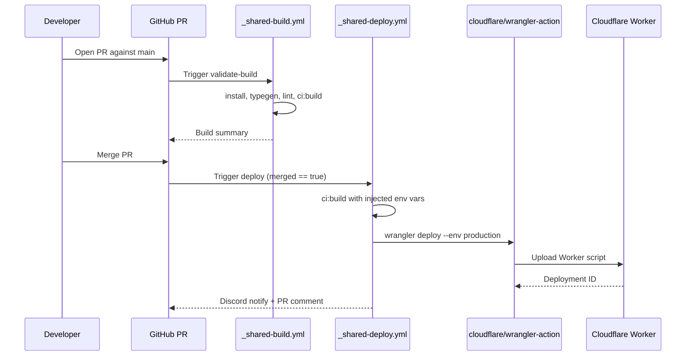
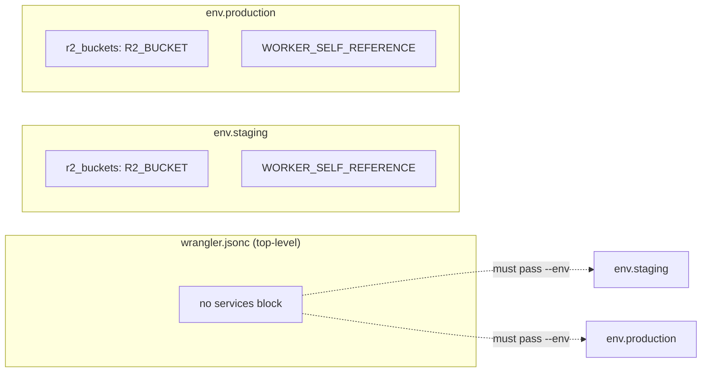
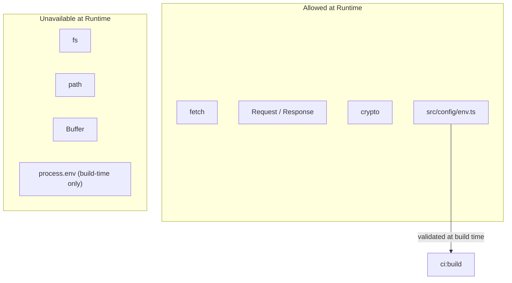
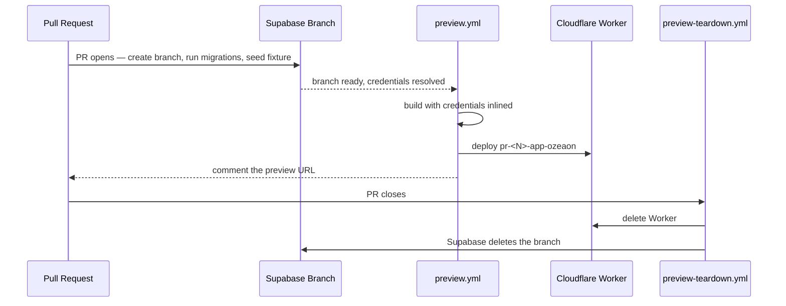
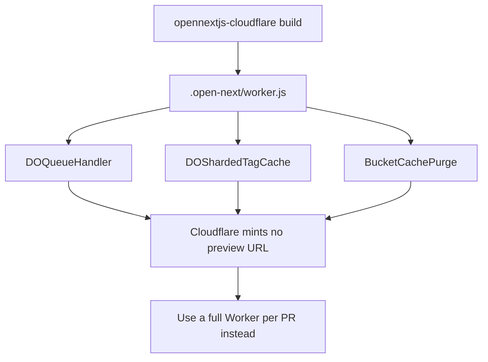
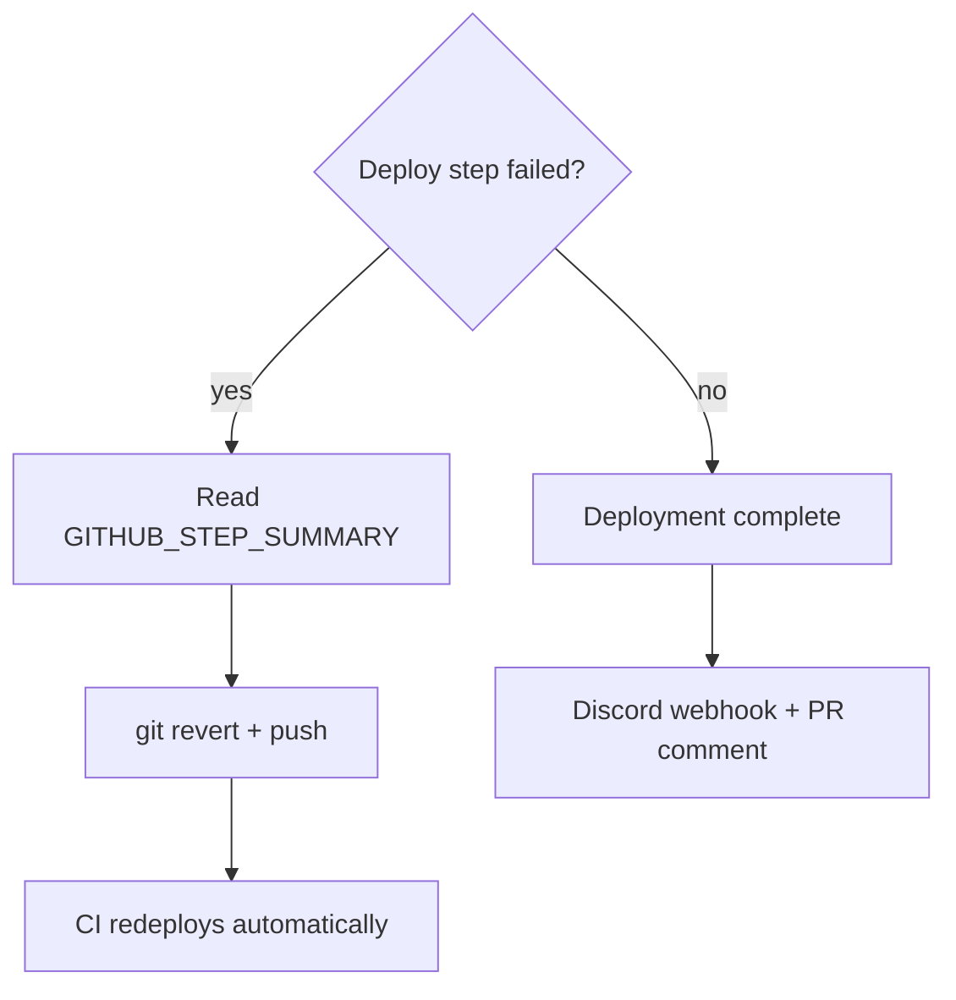

This page documents how the ozeaon-v2 Next.js application is built and deployed to Cloudflare Workers using the OpenNext Cloudflare adapter (`@opennextjs/cloudflare`). It covers the build pipeline, runtime configuration, GitHub Actions deployment workflows, environment handling, and the operational constraints imposed by the Workers runtime.

## Purpose and Scope

This page covers the **deployment mechanism** of the application:

- The OpenNext Cloudflare adapter configuration (`open-next.config.ts`)
- The development/runtime integration in `next.config.ts`
- The `wrangler.jsonc` binding model (R2 buckets, `WORKER_SELF_REFERENCE` service bindings)
- The CI build/deploy commands (`ci:build`, `ci:deploy`)
- The GitHub Actions workflow topology (shared build/deploy, staging, production, PR validation)
- Runtime constraints (no Node.js APIs, `process.env` is build-time only)
- Preview deployments (one Worker per PR)

Related topics are covered by sibling pages:

- For environment variable definitions and local setup, see the environment configuration page.
- For R2 storage behavior at runtime, see the storage/R2 documentation.
- For logging sink behavior under Workers, see the logging conventions page.

## Overview

ozeaon-v2 is a Next.js application deployed as a single Cloudflare Worker. The OpenNext Cloudflare adapter transforms the Next.js build output into a Worker-compatible bundle that is written to `.open-next/`. The Worker runs on the Workers runtime, which is a V8 isolate-based environment — not Node.js.

The deployment model is **CI-only**. The project explicitly forbids local `ci:deploy` runs; every live deployment flows through GitHub Actions, either triggered by a merge to a protected branch or by a manual `workflow_dispatch`. This design keeps Cloudflare credentials off developer machines and guarantees each deploy is tied to a reviewed commit.

Key terminology used throughout this page:

| Term | Meaning |
| --- | --- |
| OpenNext | The adapter that compiles Next.js output into a Cloudflare Worker |
| `.open-next/` | Adapter build output directory (contains `worker.js`) |
| `.wrangler/` | Wrangler's local state directory |
| `Workers Scripts` | Cloudflare's deploy unit — each environment is one Worker |
| Service binding (`WORKER_SELF_REFERENCE`) | A Worker-to-Worker binding allowing a deployment to call itself |
| Durable Object | Cloudflare's stateful compute primitive, exported by the OpenNext worker |

## Architecture

The deployment pipeline has three distinct layers: local/CI build, adapter transformation, and Cloudflare runtime. The diagram below reflects the actual files and commands involved.



The three configuration files each play a distinct role: `next.config.ts` wires Cloudflare bindings into the **local dev server** and defines production security headers; `open-next.config.ts` selects which OpenNext caching overrides are active; and `wrangler.jsonc` declares per-environment bindings (R2, service bindings) that the deployed Worker consumes at runtime.

### Adapter Configuration

The OpenNext adapter config is intentionally minimal — every override is commented out, meaning the adapter runs with its default cache/queue implementations.

```typescript
import { defineCloudflareConfig } from "@opennextjs/cloudflare";
// import r2IncrementalCache from "@opennextjs/cloudflare/overrides/incremental-cache/r2-incremental-cache";
// import d1NextTagCache from "@opennextjs/cloudflare/overrides/tag-cache/d1-next-tag-cache";
// import doQueue from "@opennextjs/cloudflare/overrides/queue/do-queue";

export default defineCloudflareConfig({
  // incrementalCache: r2IncrementalCache,
  // tagCache: d1NextTagCache,
  // queue: doQueue,
  // routePreloadingBehavior: "none",
});
```

> Source: [open-next.config.ts](https://github.com/ozeaon/ozeaon-v2/blob/0a4f1a95824db87782f1221a4108019d174df3d9/open-next.config.ts#L1-L11)

The commented-out imports (`r2IncrementalCache`, `d1NextTagCache`, `doQueue`) are the three override strategies that could replace the defaults: an R2-backed incremental cache, a D1-backed tag cache, and a Durable-Object-backed queue. They are kept in the file as deliberate extension points — swapping a caching backend is a matter of uncommenting a line, not rewriting adapter plumbing. Because they remain commented, the adapter still emits the default Durable Object exports (see the preview-deployment rationale below).

### Next.js ↔ Cloudflare Integration

`next.config.ts` initializes OpenNext's dev bindings, but only when running the dev server. This guard exists because initializing bindings during `typegen`, `build`, or other CLI invocations would stall those commands.

```typescript
import { initOpenNextCloudflareForDev } from "@opennextjs/cloudflare";
import type { NextConfig } from "next";

// Only initialize Cloudflare dev bindings when running the dev server
// Skip during typegen, build, or other CLI commands to prevent stalling
if (process.env.NODE_ENV === "development") {
  initOpenNextCloudflareForDev();
}
```

> Source: [next.config.ts](https://github.com/ozeaon/ozeaon-v2/blob/0a4f1a95824db87782f1221a4108019d174df3d9/next.config.ts#L1-L8)

Several `next.config.ts` settings exist specifically because of the Cloudflare target:

- `cacheComponents: false` — deliberately disabled, as the project notes it will adopt the newer Next.js 16 cache model "when feature is stable with the CloudFlare adapter."
- `serverExternalPackages: ["pdfjs-dist"]` — keeps `pdfjs-dist` out of the server bundle so it resolves as an external package at runtime.
- `enablePrerenderSourceMaps: false` and `productionBrowserSourceMaps: false` — reduces bundle weight, which matters under Workers size limits.
- `experimental.typedEnv: true` — enables typed environment access aligned with the `CloudflareEnv` interface generated by `wrangler types`.

The custom image loader (`./src/lib/image-loader.ts`) is also relevant: because Workers cannot use `fs`-based image optimization, the project supplies a custom loader and configures `minimumCacheTTL` to four days with remote patterns allowing GitHub, Google, Supabase, GStatic, and the configured storage host.

```typescript
images: {
    loader: "custom",
    loaderFile: "./src/lib/image-loader.ts",
    qualities: [75, 85, 95],
    remotePatterns: [
      { hostname: "*.githubusercontent.com", protocol: "https" },
      { hostname: "*.googleusercontent.com", protocol: "https" },
      { hostname: "*.supabase.co", protocol: "https" },
      { hostname: "*.gstatic.com", protocol: "https" },
      ...(storageHost
        ? [{ hostname: storageHost, protocol: "https" as const }]
        : []),
    ],
    localPatterns: [{ pathname: "/**" }], // allow all local images
    formats: ["image/avif", "image/webp"],
    minimumCacheTTL: FOUR_DAYS,
  },
```

> Source: [next.config.ts](https://github.com/ozeaon/ozeaon-v2/blob/0a4f1a95824db87782f1221a4108019d174df3d9/next.config.ts#L123-L139)

### Security Headers at the Edge

Production headers are emitted from `next.config.ts` via the `headers()` hook and are skipped entirely in development. The full Content Security Policy is assembled dynamically from environment-derived hosts.

```typescript
  async headers() {
    if (isDev) {
      return [];
    }
    return [
      {
        source: "/_next/image/:path*",
        headers: [
          {
            key: "Cache-Control",
            value: `public, max-age=0, s-maxage=${FOUR_DAYS}, stale-while-revalidate=86400`,
          },
        ],
      },
```

> Source: [next.config.ts](https://github.com/ozeaon/ozeaon-v2/blob/0a4f1a95824db87782f1221a4108019d174df3d9/next.config.ts#L141-L154)

The CSP builder derives allowed storage hosts from `NEXT_PUBLIC_STORAGE_URL` and merges them with the two known storage origins, deduplicating via `Set`. This is required because article content and attachments store absolute URLs against whichever environment uploaded them, so both storage hosts must remain allowlisted regardless of which one this deployment writes to.

```typescript
const STORAGE_HOSTS = [
  ...new Set(
    ["storage-r2.ozeaon.com", "storage-r2.ozeaon.dev", storageHost].filter(
      Boolean,
    ),
  ),
].join(" ");
```

> Source: [next.config.ts](https://github.com/ozeaon/ozeaon-v2/blob/0a4f1a95824db87782f1221a4108019d174df3d9/next.config.ts#L31-L37)

A parallel derivation detects a locally hosted Supabase and adds its origins to `connect-src`. The comment explains the design intent: it keys off the configured URL rather than `NODE_ENV`, because `pnpm preview` and `pnpm ci:build` emit production headers while still pointing at localhost.

```typescript
const localSupabaseOrigins = (() => {
  const url = process.env.NEXT_PUBLIC_SUPABASE_URL;
  if (!url) return "";
  try {
    const { host, hostname } = new URL(url);
    if (hostname !== "127.0.0.1" && hostname !== "localhost") return "";
    return `http://${host} ws://${host}`;
  } catch {
    return "";
  }
})();
```

> Source: [next.config.ts](https://github.com/ozeaon/ozeaon-v2/blob/0a4f1a95824db87782f1221a4108019d174df3d9/next.config.ts#L45-L55)

## Build & Deploy Commands

The npm scripts map directly onto the OpenNext adapter CLI. These are the exact commands the CI pipeline executes.

| Script | Command | Purpose |
| --- | --- | --- |
| `build` | `next build` | Standalone Next.js build (local use) |
| `preview` | `opennextjs-cloudflare build && opennextjs-cloudflare preview --port 3000` | Build + run the Worker locally on port 3000 |
| `ci:build` | `opennextjs-cloudflare build` | Adapter build producing `.open-next/` (CI) |
| `ci:deploy` | `opennextjs-cloudflare deploy` | Deploy the built Worker (CI only) |
| `typegen` | `next typegen && wrangler types --env-interface CloudflareEnv cloudflare-env.d.ts` | Generate Next.js route types + Cloudflare env types |
| `clean-cache` | `rm -rf .next .turbo node_modules/.cache .open-next .wrangler` | Purge all build/cache artifacts |

```json
"build": "next build",
"preview": "opennextjs-cloudflare build && opennextjs-cloudflare preview --port 3000",
"ci:build": "opennextjs-cloudflare build",
"ci:deploy": "opennextjs-cloudflare deploy",
```

> Source: [package.json](https://github.com/ozeaon/ozeaon-v2/blob/0a4f1a95824db87782f1221a4108019d174df3d9/package.json#L19-L22)

The distinction between `ci:build` and `build` is deliberate. `ci:build` invokes the adapter, which wraps `next build` and then produces the Worker bundle in `.open-next/`. The validation path in CI uses `ci:build` (not plain `next build`), so the build job surfaces both Next.js type errors and any adapter-specific packaging failures.

The `typegen` command is important for the Cloudflare target because `wrangler types --env-interface CloudflareEnv cloudflare-env.d.ts` generates a typed interface describing the Worker bindings (R2, service bindings, vars). That generated `CloudflareEnv` type backs `experimental.typedEnv: true` in `next.config.ts`.

## Deployment Workflow Topology

Deployment is exclusively CI-driven. The project documentation states this emphatically: **never run `pnpm ci:deploy` from a local machine**. Merging to `staging` or `main`, or a manual `workflow_dispatch`, is the only supported path to a live environment.



The workflow set is split into reusable and entry-point files:

| File | Purpose |
| --- | --- |
| `_shared-build.yml` | Reusable — install → typegen → lint → `ci:build`. No deployment. |
| `_shared-deploy.yml` | Reusable — install → typegen → `ci:build` → deploy via `wrangler-action`. |
| `staging.yml` | Dispatch-only; retained for on-demand staging redeploys. |
| `production.yml` | PR-to-`main` lifecycle: validate on open/sync, deploy on merge. |
| `pr-validation.yml` | Lint + `tsc --noEmit` only. No build, no deploy. |
| `performance-report.yml` | Weekly CI performance report filed as a GitHub issue. |



### Path Filtering — Why Deploys Are Selective

The `changes` job uses `dorny/paths-filter` to decide whether a build is even relevant. It matches on `src/**`, `next.config.ts`, `open-next.config.ts`, `package.json`, `pnpm-lock.yaml`, `tsconfig.json`, and `wrangler.jsonc`. This list directly encodes which files can affect the build output — notably including both deployment config files (`open-next.config.ts`, `wrangler.jsonc`), because a change to either alters the produced Worker.

### Deployment Job Conditions

The `deploy` job runs only when the PR was **merged** (`closed` + `merged == true`) or the workflow was manually dispatched. An unmerged close never deploys. On failure, the workflow writes rollback instructions (`git revert` + push) into `$GITHUB_STEP_SUMMARY`, and the documented guidance is to **fix forward with a new commit** rather than deploying manually as a workaround.

Worker names map to environments:

| Environment | Worker name | Trigger |
| --- | --- | --- |
| `staging` | `staging-app-ozeaon` | merge to `staging` / dispatch |
| `production` | `production-app-ozeaon` | merge to `main` / dispatch |
| preview | `pr-<N>-app-ozeaon` | PR opened into `main` |

## Environment Bindings and Secrets

Environment variables and secrets are configured per environment in **GitHub repo → Settings → Environments**, not in the Cloudflare dashboard. The workflows inject them at build/deploy time. Each environment requires:

```dotenv
# Secrets
CLOUDFLARE_API_TOKEN      # Workers Scripts (Edit) + Account Settings (Read)
CLOUDFLARE_ACCOUNT_ID
RESEND_API_KEY
RESEND_SENDER_EMAIL

# Variables
NEXT_PUBLIC_BASE_URL              # e.g. https://staging.ozeaon.com
NEXT_PUBLIC_SUPABASE_URL
NEXT_PUBLIC_SUPABASE_PUBLISHABLE_KEY
```

> Source: [docs/ops-deployment.md](https://github.com/ozeaon/ozeaon-v2/blob/0a4f1a95824db87782f1221a4108019d174df3d9/docs/ops-deployment.md#L126-L137)

The `CLOUDFLARE_API_TOKEN` scope is deliberately minimal: Workers Scripts (Edit) to upload the script, and Account Settings (Read) to resolve the account. `DISCORD_WEBHOOK_URL` is a repo-level secret; notification steps are `continue-on-error` and silently skip when unset.

### wrangler.jsonc Bindings

`wrangler.jsonc` declares the runtime bindings per environment under `env.staging` / `env.production`:

- `r2_buckets` — the `R2_BUCKET` binding
- `WORKER_SELF_REFERENCE` — a service binding to the Worker itself

The documentation flags a critical operational trap: **the top-level config has no `services` block**. If you run `wrangler deploy` manually for debugging, you must pass `--env staging` or `--env production`; omitting `--env` means `WORKER_SELF_REFERENCE` is not bound and self-referential features break.



## Runtime Constraints of Cloudflare Workers

The Workers runtime is not Node.js. The project documents four hard constraints that shape all server code:

1. **No Node.js APIs at runtime** — `fs`, `path`, and `Buffer` are unavailable. Use Web-standard APIs only: `fetch`, `Request`/`Response`, `crypto`.
2. **`process.env` is build-time only** — server code must read configuration through `src/config/env.ts`, which is validated at build time. This is why `next.config.ts` reads `process.env.NEXT_PUBLIC_*` during the build to inline CSP hosts rather than resolving them per request.
3. **No long-running background tasks** — the Workers execution model does not support them.
4. **Build-time env validation** — `src/config/env.ts` asserts the presence of the required variables at build time, so a missing secret fails the CI build rather than surfacing as a runtime error.



This matters for the OpenNext adapter because the default caching overrides may use Durable Objects and bindings rather than filesystem-backed caches. The `next.config.ts` choices (`serverExternalPackages: ["pdfjs-dist"]`, custom image loader, no source maps) are all downstream consequences of the runtime's lack of a filesystem.

## CI Caching Strategy

Both the build and deploy jobs cache three things to keep the ~7-minute preview cycle and production builds fast:

| Cache | Paths | Key |
| --- | --- | --- |
| pnpm store | pnpm store dir | `pnpm-lock.yaml` hash |
| Next.js build | `.next/cache`, `node_modules/.cache`, `.open-next/cache` (deploy job) | lockfile hash + environment + source hash, progressively broader fallbacks |
| wrangler | `~/.wrangler`, `node_modules/.cache/wrangler` | wrangler version + `wrangler.jsonc` hash |

Note that `.open-next/cache` is only cached in the **deploy** job, since it is only produced by the adapter build. Cache keys fall back progressively to broader keys, which prevents a cache miss that would otherwise force a full rebuild.

CI-pinned tool versions are set in each workflow's `env:` block, independent of local `package.json` ranges:

| Tool | Version |
| --- | --- |
| pnpm | `11.9.0` |
| Node.js | `24.18.0` |
| Wrangler | `4.114.0` |

Pinning Wrangler independently of `package.json` matters because the wrangler cache key includes the wrangler version — a silent version drift would invalidate the cache and change deploy behavior.

## Preview Deployments

Every PR into `main` gets its own Worker **and** its own database branch. This is a distinct flow from staging/production and lives in `preview.yml` / `preview-teardown.yml`.

| Aspect | Value |
| --- | --- |
| URL | `https://pr-<N>-app-ozeaon.joseph-400.workers.dev` |
| Login | `alpha@ozeaon.com` … `tango@ozeaon.com` (20 accounts), password `ozeaon-preview` |
| Lifetime | created on open, destroyed on close or merge |
| Duration | ~7 minutes |

### Flow



### Why a Worker Per PR Instead of a Version

This is a notable architectural constraint with a non-obvious cause. Cloudflare **mints no preview URL** for a Worker that exports a Durable Object. `.open-next/worker.js` exports three Durable Objects — `DOQueueHandler`, `DOShardedTagCache`, and `BucketCachePurge` — **even when every override in `open-next.config.ts` is commented out**. The upload succeeds silently but no URL is ever created.



Deployed Workers are exempt from this limitation — staging exports the same three Durable Objects and works. This is exactly why the commented-out overrides in `open-next.config.ts` do not eliminate the Durable Object exports; the adapter emits them unconditionally.

### Preview Seeding and Database Safety

Previews seed from `supabase/seeds/10-preview-fixture.sql` rather than a dump. The rationale:

- `supabase/seed.sql` is gitignored, so the integration cannot read it.
- `seeds/00-truncate.sql` is excluded from `sql_paths` because without the dump it would only destroy reference data created by migrations (`member_roles`, `sdgs`, `article_types`).

If a PR contains a migration that drops or renames something the fixture writes to, seeds run after migrations and leave the branch empty. Credentials still resolve and the build still succeeds, so the only symptom would be empty pages. To catch this, `preview.yml` asserts a few tables are non-empty and fails instead.

| Situation | Action |
| --- | --- |
| Fixture needs updating for your migration | Update `seeds/10-preview-fixture.sql` in the same PR |
| You want a preview before fixing it | Label `preview:allow-empty-db` — the check warns and deploys anyway |

### Preview Isolation of Secrets

Secrets are written in full per deploy — a new Worker inherits none. Two deliberate isolation choices:

- **Email**: previews use `PREVIEW_RESEND_API_KEY`, separate from production's key. Consequence: **previews send real mail** — whatever address you type in a sign-up or invite gets a real message.
- **Mailing list**: `PREVIEW_MAILCHIMP_*` are unset, so mailing list writes fail rather than touching the live audience.

Sign-up is gated by `ACCESS_TOKEN`, compared verbatim in `signup()`. Previews use `ozeaon-preview`, so production's token never reaches a public `workers.dev` hostname while signup stays testable. `PREVIEW_ACCESS_TOKEN` overrides it, and `PREVIEW_OPENAI_API_KEY` prevents previews from spending production's moderation quota (falling back to `OPENAI_API_KEY` without it).

## Failure Modes and Edge Cases

| Failure | Root cause | Behavior / Recovery |
| --- | --- | --- |
| Missing `WORKER_SELF_REFERENCE` | Manual `wrangler deploy` without `--env` | Top-level config has no `services` block; must pass `--env staging` or `--env production` |
| No preview URL after upload | Worker exports a Durable Object | Upload succeeds silently, no URL minted — use a full Worker per PR |
| Empty preview pages | Migration drops/renames fixture targets | `preview.yml` asserts non-empty tables and fails; label `preview:allow-empty-db` to override |
| `revalidateTag` from a preview hits staging | Shared `WORKER_SELF_REFERENCE` | Self-reference cannot be created before the Worker exists; documented gotcha |
| Build failure | Stale caches / lockfile drift | `pnpm clean-cache && rm -rf node_modules pnpm-lock.yaml && pnpm install` |
| Stale Supabase types | DB schema changed | `pnpm db:gen` (not `typegen`, which only regenerates Next.js route + Cloudflare env types) |
| Deploy failed in CI | Any deploy step failure | Inspect `$GITHUB_STEP_SUMMARY` for rollback instructions; fix forward with a new commit |
| Fixture unchanged after edit | Seeds run at branch creation | Close and reopen the PR to recreate the branch |



A further edge case: `.open-next/cache` appears only in the deploy job's cache configuration, so the build-validation job cannot reuse it — validation and deployment maintain separate cache lineages keyed on the same lockfile/source hashes.

## Operational Notes and Extension Points

### Extending the Adapter: Caching Overrides

The primary extension point for the Cloudflare deployment is `open-next.config.ts`. The three imports represent swappable caching strategies:

| Override | Module path | What it would change |
| --- | --- | --- |
| `incrementalCache` | `overrides/incremental-cache/r2-incremental-cache` | Back the incremental cache with R2 |
| `tagCache` | `overrides/tag-cache/d1-next-tag-cache` | Back tag revalidation with D1 |
| `queue` | `overrides/queue/do-queue` | Durable-Object-backed queue |
| `routePreloadingBehavior` | (inline option) | Set to `"none"` to disable route preloading |

Uncommenting any of these changes the runtime binding requirements, so `wrangler.jsonc` must gain the corresponding binding (e.g. an R2 bucket binding for the R2 incremental cache, a D1 database for the tag cache) before deploying. Note again that these overrides do **not** remove the Durable Object exports from the Worker.

### Operational Guardrails

- **Never deploy manually.** The documented rule is that CI is the only path to a live environment. Reproduction builds (`pnpm ci:build`) run locally; deploys do not.
- **Never work around a failed deploy** by hand. Use `git revert` + push, or fix forward.
- **Environments are the source of truth for secrets.** Set them in GitHub, not the Cloudflare dashboard, because workflows inject them at build/deploy time (and `NEXT_PUBLIC_*` values are inlined into the Worker bundle at build time).
- **Branch limit and cost.** Supabase preview branches are limited to 10, at roughly $0.013 per branch-hour.

### Environment Support Status

| Environment | Status | Notes |
| --- | --- | --- |
| Staging | ✅ Auto-deploy on merge to `staging`, manual dispatch supported |
| Production | ✅ Auto-deploy on merge to `main`, manual dispatch supported |
| Per-PR Preview | ✅ Worker-per-PR with dedicated Supabase branch |
| Cloudflare-native version previews | ❌ Not usable — Durable Object exports suppress preview URLs |

## Related Links

- [docs/ops-deployment.md](https://github.com/ozeaon/ozeaon-v2/blob/0a4f1a95824db87782f1221a4108019d174df3d9/docs/ops-deployment.md) — Environment variables, deployment workflows, and troubleshooting
- [docs/deployment-previews.md](https://github.com/ozeaon/ozeaon-v2/blob/0a4f1a95824db87782f1221a4108019d174df3d9/docs/deployment-previews.md) — Preview Worker-per-PR model and preview secrets
- [open-next.config.ts](https://github.com/ozeaon/ozeaon-v2/blob/0a4f1a95824db87782f1221a4108019d174df3d9/open-next.config.ts) — OpenNext Cloudflare adapter configuration and caching overrides
- [next.config.ts](https://github.com/ozeaon/ozeaon-v2/blob/0a4f1a95824db87782f1221a4108019d174df3d9/next.config.ts) — Dev binding initialization, security headers, image loader, and CSP
- [package.json](https://github.com/ozeaon/ozeaon-v2/blob/0a4f1a95824db87782f1221a4108019d174df3d9/package.json) — Build, preview, typegen, and deploy scripts
- [eslint.config.mjs](https://github.com/ozeaon/ozeaon-v2/blob/0a4f1a95824db87782f1221a4108019d174df3d9/eslint.config.mjs) — Lint ignores for `.open-next/**` and `.wrangler/**`
