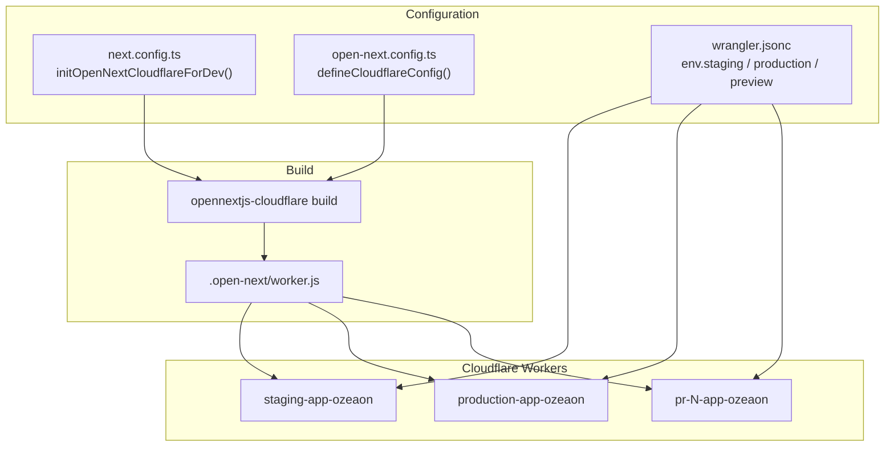

Ozeaon is a Next.js App Router application deployed to Cloudflare Workers — a V8-isolate runtime, not Node.js. The `@opennextjs/cloudflare` adapter bridges the gap: it transforms the Next.js build output into a Worker entrypoint plus assets. Three artifacts define the deployment: `open-next.config.ts` (adapter options), `wrangler.jsonc` (resource topology per environment), and the `package.json` scripts that both developers and CI invoke.

## Overview

| Artifact | Role |
| --- | --- |
| `open-next.config.ts` | Selects optional cache, tag-cache and queue overrides — currently all commented out (defaults active) |
| `wrangler.jsonc` | Worker names, R2 bucket bindings and service bindings per environment |
| `package.json` scripts | The command contract: `ci:build`, `ci:deploy`, `preview`, `typegen` |

**Deployment is CI-only.** Merging a PR to `main` triggers `production.yml`, which calls `_shared-deploy.yml`. `staging.yml` is dispatch-only (the `staging` branch is retired). Never run `pnpm ci:deploy` locally. Rollback is `git revert` + push — the failing workflow writes rollback instructions into `$GITHUB_STEP_SUMMARY`.

## Architecture

[`next.config.ts`](https://github.com/ozeaon/ozeaon-v2/blob/0a4f1a95824db87782f1221a4108019d174df3d9/next.config.ts) calls `initOpenNextCloudflareForDev()` so that `pnpm dev` sees the same Cloudflare binding surface as the deployed Worker. The three named Workers map to `env.staging`, `env.production` and `env.preview` in [`wrangler.jsonc`](https://github.com/ozeaon/ozeaon-v2/blob/0a4f1a95824db87782f1221a4108019d174df3d9/wrangler.jsonc).

## OpenNext Configuration

[`open-next.config.ts`](https://github.com/ozeaon/ozeaon-v2/blob/0a4f1a95824db87782f1221a4108019d174df3d9/open-next.config.ts) calls `defineCloudflareConfig()` with every option commented out — the commented imports (`r2IncrementalCache`, `d1NextTagCache`, `doQueue`) serve as the upgrade path: uncomment the relevant line and provision the corresponding binding when the project needs cross-instance cache sharing, D1-backed tag invalidation, or a Durable Object revalidation queue. Running with defaults requires no D1 or dedicated cache bucket.

The Durable Object classes (`DOQueueHandler`, `DOShardedTagCache`, `BucketCachePurge`) are still exported by `.open-next/worker.js` even with all overrides disabled. This has a direct consequence for preview deployments — see [CI/CD Workflows](../ci-cd-workflows/) for the explanation.

Adopting Next.js `cacheComponents` is planned once the Cloudflare adapter stabilises; [`eslint.rules.cache.mjs`](https://github.com/ozeaon/ozeaon-v2/blob/0a4f1a95824db87782f1221a4108019d174df3d9/eslint.rules.cache.mjs) currently bans `use cache`, `cacheTag`, `cacheLife` and `updateTag`.

## Build & Deploy Scripts

| Script | Purpose |
| --- | --- |
| `pnpm dev` | Local dev server with Cloudflare bindings via `initOpenNextCloudflareForDev()` |
| `pnpm preview` | Build Worker bundle + serve locally on port 3000 (safe to run locally) |
| `pnpm ci:build` | Build the deployable Worker bundle; type errors surface here |
| `pnpm ci:deploy` | Upload the Worker — **CI-only** |
| `pnpm typegen` | Generate `cloudflare-env.d.ts` (`CloudflareEnv` interface) from `wrangler.jsonc` |
| `pnpm clean-cache` | Remove `.next`, `.open-next`, `.wrangler` and cache directories |

`typegen` must run before `ci:build`. The `CloudflareEnv` interface it generates makes binding mismatches into compile-time errors; the canonical CI sequence is install → `typegen` → lint → `ci:build`. See [`package.json`](https://github.com/ozeaon/ozeaon-v2/blob/0a4f1a95824db87782f1221a4108019d174df3d9/package.json) for the exact commands.

## Deployment Topology

`wrangler.jsonc` declares bindings per environment. Two bindings carry architectural weight:

- **`R2_BUCKET`** — object storage. Staging and preview bind `staging-app-content`; production binds `app-content`.
- **`WORKER_SELF_REFERENCE`** — a service binding pointing at the Worker itself, used for `revalidateTag` internal calls. It exists only inside `env.staging` / `env.production`; the top-level config has no `services` block deliberately.

Always pass `--env staging` or `--env production` when running `wrangler deploy` manually — omitting `--env` produces a Worker with no `WORKER_SELF_REFERENCE`, which fails silently at deploy time and only manifests when a route calls back into the Worker.

Secrets live in GitHub Environments (Settings → Environments), not the Cloudflare dashboard — the workflows inject them at build/deploy time. See [Config & Constants](../../config-and-utils/config-constants/) for the full variable inventory.

## Runtime Constraints

The V8 isolate runtime imposes hard rules on application code:

- **No Node.js APIs** (`fs`, `path`, `Buffer`) at runtime; use Web-standard APIs (`fetch`, `Request`/`Response`, `crypto`).
- **`process.env` is build-time only.** Values are inlined by `opennextjs-cloudflare build`; a missing required variable is a build failure, not a runtime 500. All env access goes through [`src/config/env.ts`](https://github.com/ozeaon/ozeaon-v2/blob/0a4f1a95824db87782f1221a4108019d174df3d9/src/config/env.ts), which validates at build time.
- **No long-running background tasks.** Work cannot outlive the request that spawned it.

## Preview Deployments

Every PR gets a separate Worker (`pr-<N>-app-ozeaon`) rather than a version of the staging Worker, because Cloudflare mints no preview URL for a Worker that exports a Durable Object — and the OpenNext bundle always exports three. Full lifecycle details — fixture strategy, migration drift guard, secrets isolation, operational gotchas — are in [CI/CD Workflows: Preview Deployment Lifecycle](../ci-cd-workflows/).

## Failure Modes & Edge Cases

| Symptom | Cause | Resolution |
| --- | --- | --- |
| Deployment fails | Build or upload error | Inspect `$GITHUB_STEP_SUMMARY`; fix forward with `git revert` + push |
| `revalidateTag` fails | Deployed without `--env`; no `WORKER_SELF_REFERENCE` binding | Redeploy with `--env staging` / `--env production` |
| Build fails on env access | Missing/invalid variable in GitHub Environment | Fix the secret; validation is in `src/config/env.ts` |
| Stale build artifacts | Corrupted `.next` / `.open-next` state | `pnpm clean-cache && rm -rf node_modules pnpm-lock.yaml && pnpm install` |
| Preview sends real email | `PREVIEW_RESEND_API_KEY` is a live key | By design — treat any address in a preview as a real recipient |

## Operational Notes

- CI pins tool versions independently of local `package.json` ranges; see the `env:` blocks in [`_shared-build.yml`](https://github.com/ozeaon/ozeaon-v2/blob/0a4f1a95824db87782f1221a4108019d174df3d9/.github/workflows/_shared-build.yml) and [`_shared-deploy.yml`](https://github.com/ozeaon/ozeaon-v2/blob/0a4f1a95824db87782f1221a4108019d174df3d9/.github/workflows/_shared-deploy.yml).
- Three CI caches speed up `ci:build`: the pnpm store (keyed on `pnpm-lock.yaml`), the Next.js build cache (`.next/cache`, `.open-next/cache`, keyed on lockfile + env + source hash), and Wrangler state (`~/.wrangler`, keyed on Wrangler version + `wrangler.jsonc`). A `wrangler.jsonc` change invalidates the Wrangler cache.
- The `changes` gate (`dorny/paths-filter`) only triggers a build when a PR touches `src/**`, `next.config.ts`, `open-next.config.ts`, `package.json`, `pnpm-lock.yaml`, `tsconfig.json` or `wrangler.jsonc`. The deploy job is gated on `closed` + `merged == true` — an unmerged close never deploys.

## Extension Points

| Extension | How |
| --- | --- |
| R2-backed incremental cache | Uncomment `r2IncrementalCache` in `open-next.config.ts`; provision the R2 binding |
| D1-backed tag cache | Uncomment `d1NextTagCache`; provision the D1 binding |
| Durable Object revalidation queue | Uncomment `doQueue` |
| New environment | Add `env.<name>` to `wrangler.jsonc`, re-run `typegen`, add GitHub Environment, extend `_shared-deploy.yml` |
| New binding | Declare in `wrangler.jsonc` → re-run `typegen`; mismatches become compile-time errors |

## Related Links

- [`docs/ops-deployment.md`](https://github.com/ozeaon/ozeaon-v2/blob/0a4f1a95824db87782f1221a4108019d174df3d9/docs/ops-deployment.md) — authoritative operations document
- [CI/CD Workflows](../ci-cd-workflows/) — preview lifecycle, Monday automation, full workflow graph
- [Config & Constants](../../config-and-utils/config-constants/) — environment variable inventory
- [SSR Rendering & Caching](../../architecture/ssr-rendering-and-caching/) — how routes decide between dynamic and prerendered
- [`open-next.config.ts`](https://github.com/ozeaon/ozeaon-v2/blob/0a4f1a95824db87782f1221a4108019d174df3d9/open-next.config.ts) — adapter configuration switchboard
- [`wrangler.jsonc`](https://github.com/ozeaon/ozeaon-v2/blob/0a4f1a95824db87782f1221a4108019d174df3d9/wrangler.jsonc) — Cloudflare resource topology
- [`package.json`](https://github.com/ozeaon/ozeaon-v2/blob/0a4f1a95824db87782f1221a4108019d174df3d9/package.json) — script contract
