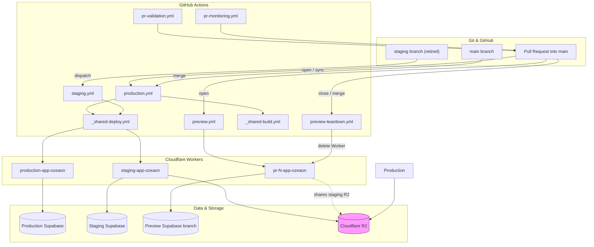
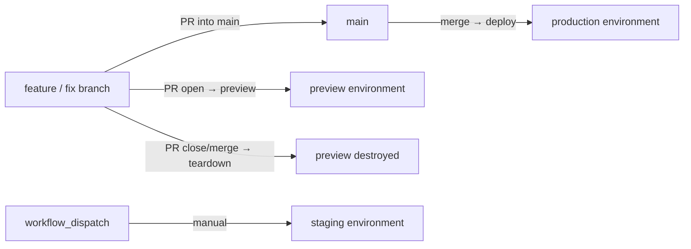
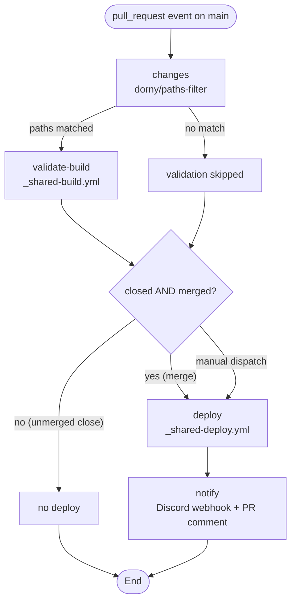
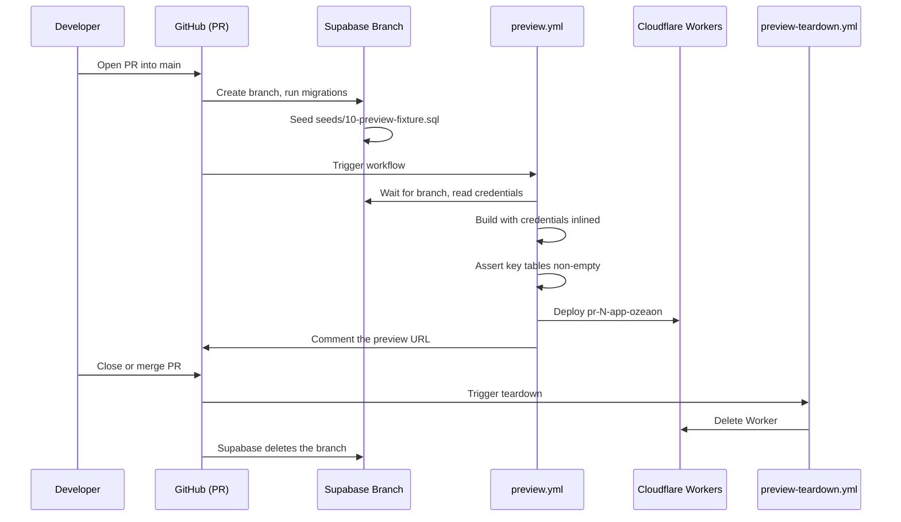
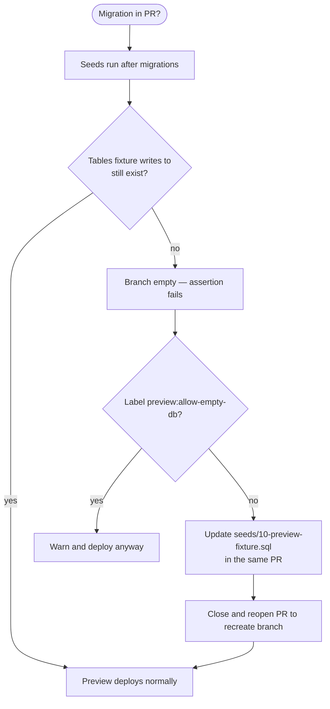

How ozeaon-v2 maps Git branches to Cloudflare Workers deployments, how every pull request gets an isolated preview Worker plus a branched Supabase database, and how secrets, seeds, and teardown are managed across environments.

## Purpose and Scope

This page documents the **environment topology and deployment lifecycle** of ozeaon-v2: the environments that exist (`staging`, `production`, and per-PR previews), the GitHub Actions workflows that build and deploy them, the branch strategy that drives them, and the per-environment configuration that makes each one behave differently.

It covers:

- The three environment tiers and their Worker / database isolation model.
- The branch → environment mapping (`main` → production, `staging` → staging, PR branch → preview).
- The reusable and orchestrating GitHub Actions workflows and the exact job graph (`changes`, `validate-build`, `deploy`, `notify`).
- The preview deployment lifecycle, including Supabase branch databases, the preview seed fixture, credential inlining, and teardown.
- Per-environment secrets, Worker naming, `wrangler.jsonc` `env` configuration, and the `WORKER_SELF_REFERENCE` binding.
- Environment-specific runtime constraints and known limitations.

Related topics intentionally left to sibling pages:

- For the contents and validation of the environment variable module (`src/config/env.ts`), see the configuration page.
- For local database workflows (`supabase db reset`, `db:reset-real`, `supabase-local.md` mechanics), see the local development page.
- For logging behavior that differs between development and production/preview, see the logging conventions page.
- For application internals (routing, data access, R2 usage), see the respective application pages.

## Overview

ozeaon-v2 is a Next.js App Router application deployed as a **Cloudflare Worker** via OpenNext plus Wrangler, with **Supabase** for persistence and **Cloudflare R2** for object storage. It defines three tiers of runtime environment:

| Environment | Git branch | Worker name | Database | Trigger |
| --- | --- | --- | --- | --- |
| Production | `main` | `production-app-ozeaon` | Production Supabase project | Merge to `main` (or manual dispatch) |
| Staging | `staging` (retired) | `staging-app-ozeaon` | Staging Supabase branch | Manual dispatch only |
| Preview | any PR into `main` | `pr-<N>-app-ozeaon` | Supabase branch per PR | PR opened / closed |

The design intent is **strict environment isolation with a single, CI-only deployment path**. Deployment happens exclusively through GitHub Actions — never from a local machine — which keeps Cloudflare and Supabase secrets off developer laptops and ties every deploy to a reviewed, merged commit.

Each environment is populated with its own secrets at build/deploy time from **GitHub Environments** (`Settings → Environments`), not from the Cloudflare dashboard. Because the application runs on Cloudflare Workers, the runtime is constrained: no Node.js APIs (`fs`, `path`, `Buffer`), `process.env` is build-time only, and there are no long-running background tasks.

Previews take the isolation model one step further: every PR gets **its own Worker and its own database**, created on PR open and destroyed on close or merge, with a synthetic seed fixture so the ephemeral database always starts in a known-good state.

## Architecture

The diagram below shows the three environment tiers and how Git events fan out into Workers, Supabase databases, and shared infrastructure.



Key structural facts reflected above, all sourced from the operational documentation:

- **Production and staging share the reusable build/deploy workflows**, differing only in the environment they target and the secrets injected.
- **Previews bypass the shared deploy workflow** and define their own build path, because they must first wait for a Supabase branch to exist and then inline its credentials.
- **R2 is shared**: staging owns it, previews reference staging's bucket, and uploads persist even after a preview Worker is torn down.

> Sources:
> - [ops-deployment.md](https://github.com/ozeaon/ozeaon-v2/blob/0a4f1a95824db87782f1221a4108019d174df3d9/docs/ops-deployment.md#L44-L120)
> - [deployment-previews.md](https://github.com/ozeaon/ozeaon-v2/blob/0a4f1a95824db87782f1221a4108019d174df3d9/docs/deployment-previews.md#L1-L18)

## Branch Strategy

The branch hierarchy maps directly onto environments. This mapping is the single source of truth for which workflow fires.



- **`main` is the deployment branch.** `production.yml` triggers on the `pull_request` lifecycle against `main`. It validates the build on open/sync and deploys only on merge (or manual dispatch). An unmerged close never deploys.
- **`staging` is retired but recoverable.** `staging.yml` keeps the same four-job shape, but on manual dispatch only `deploy` and `notify` run; `changes` and `validate-build` are skipped by design. It is kept so the staging Worker can be redeployed on demand.
- **`backmerge.yml` is retired** along with the branch hierarchy; it too is dispatch-only. The documentation notes backmerge conflicts are never resolved automatically — a labelled PR is opened against the target branch for manual resolution, and re-running will not duplicate it while that branch still exists.
- **Every PR branch into `main` gets its own preview environment**, independent of the branch name — the Worker is keyed on the PR number, not the branch.

## Deployment Workflows

The CI system is organized as two **reusable** workflows plus several **orchestrating** workflows that call them.

| File | Purpose |
| --- | --- |
| `_shared-build.yml` | Reusable — install → typegen → lint → `ci:build`. No deployment. |
| `_shared-deploy.yml` | Reusable — install → typegen → `ci:build` → deploy to Cloudflare via `wrangler-action`. |
| `staging.yml` | Retired with the `staging` branch. Dispatch-only, kept so the staging Worker can be redeployed on demand. |
| `production.yml` | PR-to-`main` lifecycle: validates the build on open/sync, deploys on merge (or manual dispatch), notifies Discord + comments on the PR. |
| `pr-validation.yml` | Lint + `tsc --noEmit` on PRs into `main`. No build, no deploy. |
| `pr-monitoring.yml` | Discord notifications for PR review requests, reviews submitted, and merges on `main`. |
| `performance-report.yml` | Weekly (Sun 00:00 UTC) CI performance report — success rate, p50/p95 duration — filed as a GitHub issue per environment. |
| `backmerge.yml` | Retired with the branch hierarchy. Dispatch-only. |

> Source: [ops-deployment.md](https://github.com/ozeaon/ozeaon-v2/blob/0a4f1a95824db87782f1221a4108019d174df3d9/docs/ops-deployment.md#L46-L57)

### The Four-Job Lifecycle (`production.yml`)

`production.yml` runs the full shape below; `staging.yml` keeps the same four jobs but skips `changes` and `validate-build` on manual dispatch.



1. **`changes`** — `dorny/paths-filter` checks whether the PR touches `src/**`, `next.config.ts`, `open-next.config.ts`, `package.json`, `pnpm-lock.yaml`, `tsconfig.json`, or `wrangler.jsonc`. This avoids burning CI on documentation-only or fixture-only changes.
2. **`validate-build`** — runs `_shared-build.yml` only when the PR is open/synced (not closed) and the paths filter matched. It validates that the build compiles; it does not deploy.
3. **`deploy`** — runs `_shared-deploy.yml` only when the PR was **merged** (`closed` + `merged == true`) or the workflow was manually dispatched. It never runs on an unmerged close.
4. **`notify`** — posts a Discord webhook + PR comment on success; on failure it writes rollback instructions into the step summary.

> Source: [ops-deployment.md](https://github.com/ozeaon/ozeaon-v2/blob/0a4f1a95824db87782f1221a4108019d174df3d9/docs/ops-deployment.md#L59-L71)

The `closed + merged == true` guard is the design mechanism that makes "merge to deploy" safe: closing a PR without merging is a normal, frequent action, and the workflow must not treat it as a release.

### Build vs. Deploy Pipelines

`_shared-build.yml` performs validation only:

```
1. Checkout code
2. Setup pnpm / Node.js
3. Restore pnpm store + Next.js + wrangler caches
4. Install dependencies (--frozen-lockfile)
5. Generate types (typegen)
6. Lint (pnpm run lint)
7. Build (pnpm run ci:build) — type errors surface here via next build
8. Build summary (success/failure) in $GITHUB_STEP_SUMMARY
```

`_shared-deploy.yml` is called only after a merge and additionally injects real environment variables:

```
1. Checkout code
2. Setup pnpm / Node.js
3. Restore caches
4. Install dependencies
5. Generate types
6. Build (pnpm run ci:build) with real environment vars/secrets injected
7. Deploy via cloudflare/wrangler-action (environment: staging|production)
8. Deployment summary / failure + rollback guidance
```

> Source: [ops-deployment.md](https://github.com/ozeaon/ozeaon-v2/blob/0a4f1a95824db87782f1221a4108019d174df3d9/docs/ops-deployment.md#L73-L99)

The critical difference is step 6: **the build is performed with secrets present**, which is required because `NEXT_PUBLIC_*` values are inlined into the client bundle at build time, and because `src/config/env.ts` validates required variables at build time. This is also why deployment must not be run locally — a local `pnpm ci:build` would need production secrets on the developer machine.

`pr-validation.yml` is deliberately separate and lighter: it is `main`-targeted, path-filtered to `.ts`/`.tsx`/config changes, and runs only `pnpm run lint` and `pnpm run check` (i.e. `tsc --noEmit`). It never builds or deploys, so it can fail fast on type errors without the cost of a full OpenNext build.

### Caching Strategy

Both build and deploy jobs cache three layers, each keyed to invalidate precisely:

| Cache | Paths | Key |
| --- | --- | --- |
| pnpm store | pnpm store dir | `pnpm-lock.yaml` hash |
| Next.js build | `.next/cache`, `node_modules/.cache`, `.open-next/cache` (deploy job) | lockfile hash + environment + source file hash, falling back progressively to broader keys |
| wrangler | `~/.wrangler`, `node_modules/.cache/wrangler` | wrangler version + `wrangler.jsonc` hash |

CI pins its toolchain versions in each workflow's `env:` block, independent of local `package.json` ranges: **pnpm `11.9.0`, Node `24.18.0`, Wrangler `4.114.0`**.

Including the **environment** in the Next.js build cache key is what prevents a staging build artifact from being reused for a production deployment, since the inlined `NEXT_PUBLIC_*` values differ per environment.

> Source: [ops-deployment.md](https://github.com/ozeaon/ozeaon-v2/blob/0a4f1a95824db87782f1221a4108019d174df3d9/docs/ops-deployment.md#L104-L114)

### Environment Support Matrix

- ✅ **Staging** — auto-deploy on merge to `staging`, manual dispatch supported.
- ✅ **Production** — auto-deploy on merge to `main`, manual dispatch supported.
- ⏳ **Preview (per-PR)** — historically listed as not implemented within `ops-deployment.md`; a dedicated preview pipeline now exists (see the next section), and `pr-number` is threaded through the shared workflows for future use.

> Source: [ops-deployment.md](https://github.com/ozeaon/ozeaon-v2/blob/0a4f1a95824db87782f1221a4108019d174df3d9/docs/ops-deployment.md#L116-L120)

## Preview Deployments

Every PR into `main` gets its own Worker and its own database.

| | |
| --- | --- |
| **URL** | `https://pr-<N>-app-ozeaon.joseph-400.workers.dev` |
| **Login** | `alpha@ozeaon.com` … `tango@ozeaon.com` (20 accounts) — password `ozeaon-preview` |
| **Lifetime** | created on open, destroyed on close or merge |

> Source: [deployment-previews.md](https://github.com/ozeaon/ozeaon-v2/blob/0a4f1a95824db87782f1221a4108019d174df3d9/docs/deployment-previews.md#L1-L9)

### Preview Lifecycle



The flow, step by step:

1. **PR opens** — Supabase creates a branch, runs migrations, and seeds `supabase/seeds/10-preview-fixture.sql`.
2. **`preview.yml`** waits for the branch, reads its credentials, and builds with those credentials inlined.
3. It deploys the Worker named `pr-<N>-app-ozeaon` and comments the URL on the PR.
4. **PR closes** — `preview-teardown.yml` deletes the Worker; Supabase deletes the branch.

The whole cycle takes roughly **7 minutes**.

> Source: [deployment-previews.md](https://github.com/ozeaon/ozeaon-v2/blob/0a4f1a95824db87782f1221a4108019d174df3d9/docs/deployment-previews.md#L11-L18)

### Why a Worker per PR, not a Worker version

This is a significant and non-obvious design constraint. Cloudflare mints **no preview URL for a Worker that exports a Durable Object**. `.open-next/worker.js` exports three — `DOQueueHandler`, `DOShardedTagCache`, and `BucketCachePurge` — even with every override in `open-next.config.ts` commented out. Uploads succeed silently and no preview URL is ever created.

Deployed Workers are exempt from this restriction — staging exports the same three Durable Objects and works fine. The consequence is that previews cannot use Cloudflare's cheaper per-version mechanism and must provision a **distinct deployed Worker** per PR.

> Source: [deployment-previews.md](https://github.com/ozeaon/ozeaon-v2/blob/0a4f1a95824db87782f1221a4108019d174df3d9/docs/deployment-previews.md#L20-L26)

### Why a fixture instead of the real dump

`supabase/seed.sql` is **gitignored**, so the Supabase GitHub integration cannot read it — branches seeded to nothing. `seeds/00-truncate.sql` is excluded from `sql_paths` for the same reason: without the dump, it would only destroy the reference data that migrations create (`member_roles`, `sdgs`, `article_types`).

The replacement is `supabase/seeds/10-preview-fixture.sql`: **synthetic seed data for preview branches and local `supabase db reset`**, containing 20 accounts, 3 organisations, projects and articles with content, posts, and R2 imagery.

> Sources:
> - [deployment-previews.md](https://github.com/ozeaon/ozeaon-v2/blob/0a4f1a95824db87782f1221a4108019d174df3d9/docs/deployment-previews.md#L28-L33)
> - [supabase/config.toml](https://github.com/ozeaon/ozeaon-v2/blob/0a4f1a95824db87782f1221a4108019d174df3d9/supabase/config.toml#L60-L70)
> - [10-preview-fixture.sql](https://github.com/ozeaon/ozeaon-v2/blob/0a4f1a95824db87782f1221a4108019d174df3d9/supabase/seeds/10-preview-fixture.sql#L1-L1)

### DDL changes and the empty-database guard

Seeds run **after** migrations, so a migration that drops or renames a table or column the fixture writes to leaves the branch empty. Credentials still resolve and the build still succeeds, so the only visible symptom would be empty pages. To prevent a silently broken preview, `preview.yml` asserts that a few tables are non-empty and fails instead.

| Situation | What to do |
| --- | --- |
| Fixture needs updating for your migration | Update `seeds/10-preview-fixture.sql` in the same PR |
| You want a preview before fixing it | Label `preview:allow-empty-db` — the check warns and deploys anyway |

Note that this is explicitly **not** the workaround described in `supabase-local.md`. Removing a migration, reseeding, then reapplying it exists because `seed.sql` is a dump that always lags the schema. The fixture ships **with** migrations, so it gets updated rather than worked around.

> Source: [deployment-previews.md](https://github.com/ozeaon/ozeaon-v2/blob/0a4f1a95824db87782f1221a4108019d174df3d9/docs/deployment-previews.md#L35-L48)



### Preview configuration surface

| File | Purpose |
| --- | --- |
| `.github/workflows/preview.yml` | build and deploy |
| `.github/workflows/preview-teardown.yml` | delete on close |
| `wrangler.jsonc` → `env.preview` | `workers_dev: true`, staging R2, self-ref to staging |
| `supabase/seeds/10-preview-fixture.sql` | 20 accounts, 3 organisations, projects and articles with content, posts, R2 imagery |

> Source: [deployment-previews.md](https://github.com/ozeaon/ozeaon-v2/blob/0a4f1a95824db87782f1221a4108019d174df3d9/docs/deployment-previews.md#L60-L67)

The `env.preview` block in `wrangler.jsonc` sets `workers_dev: true` (so a public `workers.dev` hostname is created), points the R2 binding at **staging's** bucket, and self-references staging via `WORKER_SELF_REFERENCE`.

### Secrets on previews

Because a new Worker inherits **none** of the environment's secrets, they are **written in full on every deploy**. Preview-specific behavior:

- **Email** uses `PREVIEW_RESEND_API_KEY`, separate from production's key, so **previews send real mail** — any address typed into a sign-up or invite receives a real message.
- **`PREVIEW_MAILCHIMP_*` are unset**, so mailing-list writes **fail** rather than touching the live audience.
- **Sign-up is gated by `ACCESS_TOKEN`**, compared verbatim in `signup()`. Previews use `ozeaon-preview`, so production's token never reaches a public `workers.dev` hostname while signup stays testable. Set `PREVIEW_ACCESS_TOKEN` to override.
- **`PREVIEW_OPENAI_API_KEY`** stops previews from spending production's moderation quota; without it, previews fall back to `OPENAI_API_KEY`.

> Source: [deployment-previews.md](https://github.com/ozeaon/ozeaon-v2/blob/0a4f1a95824db87782f1221a4108019d174df3d9/docs/deployment-previews.md#L69-L77)

This is a deliberate safety posture: the two capabilities that could cause real-world side effects (sending mail to arbitrary addresses, writing to the live mailing list) are either keyed separately or left unset to fail closed.

## Environment Configuration & Secrets

### Where secrets live

Environment variables and secrets are configured **per environment in the GitHub repository** at **Settings → Environments → `staging` / `production`**, not in the Cloudflare dashboard directly. The workflows inject them at build/deploy time. Each environment needs:

```dotenv
# Secrets
CLOUDFLARE_API_TOKEN      # Workers Scripts (Edit) + Account Settings (Read)
CLOUDFLARE_ACCOUNT_ID
RESEND_API_KEY
RESEND_SENDER_EMAIL

# Variables
NEXT_PUBLIC_BASE_URL              # e.g. https://staging.ozeaon.com
NEXT_PUBLIC_SUPABASE_URL
NEXT_PUBLIC_SUPABASE_PUBLISHABLE_KEY
```

> Source: [ops-deployment.md](https://github.com/ozeaon/ozeaon-v2/blob/0a4f1a95824db87782f1221a4108019d174df3d9/docs/ops-deployment.md#L122-L137)

A **repo-level** secret `DISCORD_WEBHOOK_URL` is used by `staging.yml`, `production.yml`, and `pr-monitoring.yml`. Notifications are `continue-on-error` and silently skip if unset. `pr-monitoring.yml` additionally reads `.github/discord-user-map.json` to map GitHub logins to Discord user IDs for @-mentions.

Recommended protection rules for each environment: **require ≥1 reviewer other than the author**, optional wait timer.

> Source: [ops-deployment.md](https://github.com/ozeaon/ozeaon-v2/blob/0a4f1a95824db87782f1221a4108019d174df3d9/docs/ops-deployment.md#L139-L143)

### Application-level required variables

The local `.env.local` requires the following, validated at build time via `src/config/env.ts`:

```dotenv
NEXT_PUBLIC_SUPABASE_URL=
NEXT_PUBLIC_SUPABASE_PUBLISHABLE_KEY=
SUPABASE_SERVICE_ROLE_KEY=
RESEND_API_KEY=
RESEND_SENDER_EMAIL=
NEXT_PUBLIC_STORAGE_URL=
```

> Source: [ops-deployment.md](https://github.com/ozeaon/ozeaon-v2/blob/0a4f1a95824db87782f1221a4108019d174df3d9/docs/ops-deployment.md#L3-L14)

Note the asymmetry: the Supabase values that appear in the GitHub environment configuration are the **public** URL and publishable key, while `SUPABASE_SERVICE_ROLE_KEY` is required by the application configuration but is not among the listed GitHub environment variables — it is a server-only secret consumed at runtime and must be provisioned appropriately for the deployed environment.

### `wrangler.jsonc` per-environment bindings

`wrangler.jsonc` defines `r2_buckets` and the `WORKER_SELF_REFERENCE` service binding **per environment** under `env.staging` / `env.production`. The R2 bucket binding is configured as `R2_BUCKET`.

⚠️ If you ever do run `wrangler deploy` by hand for debugging, **always pass `--env staging` or `--env production`** — the top-level config has no `services` block, so omitting `--env` breaks `WORKER_SELF_REFERENCE`.

> Source: [ops-deployment.md](https://github.com/ozeaon/ozeaon-v2/blob/0a4f1a95824db87782f1221a4108019d174df3d9/docs/ops-deployment.md#L29-L36)

The `WORKER_SELF_REFERENCE` binding is what allows the Worker to call back into itself (for example, for on-demand cache revalidation). This is why it is a per-environment *deployed* binding rather than a configuration value that can exist independently of a deployed Worker — see the gotchas section below.

### Runtime constraints (Cloudflare Workers)

| Constraint | Implication |
| --- | --- |
| No Node.js APIs (`fs`, `path`, `Buffer`) at runtime | Use Web-standard APIs only: `fetch`, `Request`/`Response`, `crypto` |
| `process.env` is build-time only | Read runtime config through `src/config/env.ts` |
| No long-running background tasks | Work must complete within the request/event scope |

> Source: [ops-deployment.md](https://github.com/ozeaon/ozeaon-v2/blob/0a4f1a95824db87782f1221a4108019d174df3d9/docs/ops-deployment.md#L38-L40)

These constraints explain why the build must inline environment values: on Workers there is no filesystem or long-lived process to read configuration from, so build-time resolution is the only reliable mechanism.

## Failure Modes, Edge Cases & Gotchas

### Preview-specific gotchas

| Gotcha | Consequence / Mitigation |
| --- | --- |
| **Seeds run at branch creation** | Editing the fixture requires recreating the branch — close and reopen the PR. |
| **`revalidateTag` from a preview hits staging's code** | Via `WORKER_SELF_REFERENCE`. A self-reference cannot be created before the Worker exists. |
| **R2 is shared with staging** | Uploads persist after teardown and are visible to staging. |
| **Branch limit is 10; ~$0.013/branch-hour** | Concurrent open PRs beyond the limit will not get preview databases. |

> Source: [deployment-previews.md](https://github.com/ozeaon/ozeaon-v2/blob/0a4f1a95824db87782f1221a4108019d174df3d9/docs/deployment-previews.md#L79-L85)

The `revalidateTag` gotcha is the most subtle: because a preview Worker self-references **staging**, a cache revalidation triggered from a preview purges staging's cache, not its own. This is a direct consequence of `WORKER_SELF_REFERENCE` pointing at staging in `env.preview`, and the ordering constraint (the Worker must exist before the binding can be created) is a Cloudflare platform limitation.

The R2 sharing means preview uploads are not cleaned up on teardown — a preview that uploads imagery leaves permanent artifacts in staging's bucket.

### Deployment failure handling

| Symptom | Action |
| --- | --- |
| Build errors | `pnpm clean-cache && rm -rf node_modules pnpm-lock.yaml && pnpm install` |
| TypeScript errors from stale Supabase types | `pnpm db:gen` (not `typegen` — that regenerates Next.js route types + Cloudflare env types, unrelated to the DB schema) |
| Hydration mismatches | Use the `useHydration` hook for client-only content |
| Deployment failed | Check the failing workflow run's step summary first — `staging.yml`/`production.yml` write rollback instructions (`git revert` + push) directly into `$GITHUB_STEP_SUMMARY` |

The documented policy on a failed deployment is explicit: **never attempt to deploy manually as a workaround — fix forward with a new commit and let CI redeploy.**

> Source: [ops-deployment.md](https://github.com/ozeaon/ozeaon-v2/blob/0a4f1a95824db87782f1221a4108019d174df3d9/docs/ops-deployment.md#L156-L167)

### Known workflow limitations

- **PR comment on merge** relies on the workflow's own `pull_request` event context rather than commit-message parsing — safe for squash merges.
- **Performance report** only counts `completed` runs from the last 7 days; a quiet week produces a "no data" summary rather than an error.
- **Backmerge conflicts** are never resolved automatically — a labelled PR is opened against the target branch for manual resolution, and re-running won't duplicate it while that branch still exists.

> Source: [ops-deployment.md](https://github.com/ozeaon/ozeaon-v2/blob/0a4f1a95824db87782f1221a4108019d174df3d9/docs/ops-deployment.md#L145-L152)

## Operational Notes & Extension Points

### Cost and capacity characteristics

- **Branch limit: 10** concurrent Supabase branches; approximately **$0.013 per branch-hour**. Since a preview exists for the entire lifetime of an open PR, long-lived PRs accumulate cost continuously.
- **Preview cycle time: ~7 minutes** from PR open to a live URL. This includes waiting for the Supabase branch, seeding, an OpenNext build, and the deploy.
- **Caching is the primary lever** on CI duration; the three-layer cache (pnpm store, Next.js build, wrangler) is keyed so that lockfile, environment, and source changes each invalidate only the caches they must.

### Adding a new environment

To add an environment tier, the following coordinated changes are required, based on the patterns in the source:

1. Add an `env.<name>` block to `wrangler.jsonc` with `r2_buckets` and the `WORKER_SELF_REFERENCE` service binding.
2. Create a GitHub Environment (`Settings → Environments → <name>`) with the secrets and variables listed above.
3. Author a workflow that calls `_shared-build.yml` for validation and `_shared-deploy.yml` for deployment, passing `environment: <name>` and the Worker name.
4. Add the environment to any per-environment reporting (e.g. `performance-report.yml` files an issue per environment).
5. Extend the `changes` paths filter if the new environment should be sensitive to additional files.

The reusable-workflow split is the extension point here: `_shared-build.yml` and `_shared-deploy.yml` are environment-agnostic, so a new environment is essentially a new thin orchestrator plus configuration and secrets.

### Preview pipeline extension points

- **`preview.yml` assertion set** — the non-empty-table assertions are the guardrail against silently broken previews. When the fixture grows, these assertions should grow with it.
- **`preview:allow-empty-db` label** — the sanctioned escape hatch for the rare case where an author needs a preview before updating the fixture.
- **`PREVIEW_*` secret namespace** — each preview-specific override (`PREVIEW_RESEND_API_KEY`, `PREVIEW_ACCESS_TOKEN`, `PREVIEW_OPENAI_API_KEY`, `PREVIEW_MAILCHIMP_*`) is the mechanism for diverging preview behavior from production without changing code. Adding a new `PREVIEW_*` variable is the intended way to isolate a newly added production dependency.

### `pr-number` threading

`pr-number` is threaded through the shared workflows for future use. This is the designed seam for extending per-PR behavior (for example, alternative preview mechanisms or per-PR reporting) without restructuring the workflow graph.

> Source: [ops-deployment.md](https://github.com/ozeaon/ozeaon-v2/blob/0a4f1a95824db87782f1221a4108019d174df3d9/docs/ops-deployment.md#L116-L120)

## Environment Behavior Matrix

A single consolidated view of how each tier differs. Values are drawn directly from the environment and preview documentation.

| Aspect | Production | Staging | Preview (`pr-<N>`) |
| --- | --- | --- | --- |
| Git branch | `main` | `staging` (retired) | any PR branch into `main` |
| Worker name | `production-app-ozeaon` | `staging-app-ozeaon` | `pr-<N>-app-ozeaon` |
| Trigger | merge to `main` / manual dispatch | manual dispatch only | PR open (deploy), PR close (teardown) |
| Workflow | `production.yml` | `staging.yml` | `preview.yml` + `preview-teardown.yml` |
| Jobs on dispatch | `changes`, `validate-build`, `deploy`, `notify` | `deploy`, `notify` (others skipped) | build + deploy + URL comment |
| Database | Production Supabase project | Staging Supabase | Supabase branch per PR |
| Seed data | Production data | Staging data | `seeds/10-preview-fixture.sql` (synthetic) |
| `workers_dev` | n/a | n/a | `true` (public `workers.dev` URL) |
| R2 bucket | Production R2 | Staging R2 (shared) | Staging R2 (shared) |
| `WORKER_SELF_REFERENCE` | self | self | staging |
| Email key | `RESEND_API_KEY` | `RESEND_API_KEY` | `PREVIEW_RESEND_API_KEY` |
| Mailchimp | live audience | live audience | `PREVIEW_MAILCHIMP_*` unset → writes fail |
| Signup `ACCESS_TOKEN` | production token | staging token | `ozeaon-preview` (overridable via `PREVIEW_ACCESS_TOKEN`) |
| OpenAI key | `OPENAI_API_KEY` | `OPENAI_API_KEY` | `PREVIEW_OPENAI_API_KEY` (falls back to `OPENAI_API_KEY`) |
| Lifetime | permanent | permanent | created on open, destroyed on close/merge |

## API & Command Reference

### Package scripts

| Script | Command | Purpose |
| --- | --- | --- |
| `build` | `next build` | Standard Next.js build |
| `preview` | `opennextjs-cloudflare build && opennextjs-cloudflare preview --port 3000` | Build and run the OpenNext Cloudflare preview locally on port 3000 |
| `ci:build` | `opennextjs-cloudflare build` | The build command used by CI (`_shared-build.yml` / `_shared-deploy.yml`) |
| `ci:deploy` | `opennextjs-cloudflare deploy` | The deploy command CI runs — ⚠️ **never run locally** |
| `db:schema` | `node scripts/schema/generate.mjs` | Regenerate database schema artifacts |

> Source: [package.json](https://github.com/ozeaon/ozeaon-v2/blob/0a4f1a95824db87782f1221a4108019d174df3d9/package.json#L19-L23)

```json
"build": "next build",
"preview": "opennextjs-cloudflare build && opennextjs-cloudflare preview --port 3000",
"ci:build": "opennextjs-cloudflare build",
"ci:deploy": "opennextjs-cloudflare deploy",
"db:schema": "node scripts/schema/generate.mjs",
```

> Source: [package.json](https://github.com/ozeaon/ozeaon-v2/blob/0a4f1a95824db87782f1221a4108019d174df3d9/package.json#L19-L23)

The distinction between `preview` and `ci:build` matters: `pnpm preview` is a **local** OpenNext build-and-serve on port 3000, entirely unrelated to the PR preview environments described in this page. The PR previews are deployed Workers, not local servers.

### Local database commands

```
supabase db reset      # fixture, matches previews
pnpm db:reset-real     # truncate + supabase/seed.sql
```

`db:reset-real` shells out to `psql` and `jq`, and stops if the local stack is not running rather than letting `psql` fall through to whatever server is listening on the default port.

> Source: [deployment-previews.md](https://github.com/ozeaon/ozeaon-v2/blob/0a4f1a95824db87782f1221a4108019d174df3d9/docs/deployment-previews.md#L50-L58)

`supabase db reset` is deliberately aligned with previews — both use the synthetic fixture — so that a developer's local data shape matches what a reviewer sees on the preview URL. `pnpm db:reset-real` is the opt-in path for working against real dumped data, and its fail-fast check on the local stack prevents accidentally truncating a non-local server.

### Deploy commands (CI only)

```
pnpm ci:build → pnpm ci:deploy
```

These are the underlying commands the CI pipeline runs. They are useful for **reproducing a build failure locally**, but deployment itself happens exclusively through GitHub Actions.

> Source: [ops-deployment.md](https://github.com/ozeaon/ozeaon-v2/blob/0a4f1a95824db87782f1221a4108019d174df3d9/docs/ops-deployment.md#L16-L32)

## Summary of Design Decisions

| Decision | Rationale |
| --- | --- |
| CI-only deployment | Keeps secrets off local machines; every deploy tied to a reviewed commit |
| Worker per PR instead of Worker version | Cloudflare mints no preview URL for Workers exporting Durable Objects (`.open-next/worker.js` exports `DOQueueHandler`, `DOShardedTagCache`, `BucketCachePurge`) |
| Synthetic fixture instead of a seed dump | `supabase/seed.sql` is gitignored and invisible to the Supabase GitHub integration |
| Non-empty table assertions in `preview.yml` | A DDL change that breaks the fixture otherwise fails silently as empty pages |
| Fixture updated rather than worked around | The fixture ships with migrations, so it tracks the schema instead of lagging it |
| Full secret rewrite per preview deploy | A new Worker inherits no secrets |
| Separate `PREVIEW_RESEND_API_KEY` | Previews send real mail, so the key must be independently revocable |
| `PREVIEW_MAILCHIMP_*` unset | Mailing-list writes fail closed rather than touching the live audience |
| `ozeaon-preview` signup token | Keeps production's token off a public `workers.dev` hostname while keeping signup testable |
| Fix forward, never deploy manually | Manual deploys bypass review and secret handling |

## Related Links

- [Preview Deployments](https://github.com/ozeaon/ozeaon-v2/blob/0a4f1a95824db87782f1221a4108019d174df3d9/docs/deployment-previews.md) — the per-PR Worker and database lifecycle
- [Environment, Deployment & Troubleshooting](https://github.com/ozeaon/ozeaon-v2/blob/0a4f1a95824db87782f1221a4108019d174df3d9/docs/ops-deployment.md) — environments, workflows, secrets, troubleshooting
- [Development Workflow Guide](https://github.com/ozeaon/ozeaon-v2/blob/0a4f1a95824db87782f1221a4108019d174df3d9/docs/workflows.md) — deployment flow and day-to-day workflow
- [Deployment Guide (README link)](https://github.com/ozeaon/ozeaon-v2/blob/0a4f1a95824db87782f1221a4108019d174df3d9/README.md#L18) — entry point to deployment documentation
- [Project conventions (CLAUDE.md)](https://github.com/ozeaon/ozeaon-v2/blob/0a4f1a95824db87782f1221a4108019d174df3d9/CLAUDE.md#L48-L50) — stack summary and deployment target (OpenNext + Wrangler → Cloudflare Workers)
- [Supabase local configuration](https://github.com/ozeaon/ozeaon-v2/blob/0a4f1a95824db87782f1221a4108019d174df3d9/supabase/config.toml#L60-L70) — seed and `sql_paths` configuration affecting preview branches
- [Preview fixture seed](https://github.com/ozeaon/ozeaon-v2/blob/0a4f1a95824db87782f1221a4108019d174df3d9/supabase/seeds/10-preview-fixture.sql#L1-L1) — synthetic seed data for previews and local resets
- [Package scripts](https://github.com/ozeaon/ozeaon-v2/blob/0a4f1a95824db87782f1221a4108019d174df3d9/package.json#L19-L23) — `ci:build`, `ci:deploy`, `preview`, `db:schema`
- [Logging conventions](https://github.com/ozeaon/ozeaon-v2/blob/0a4f1a95824db87782f1221a4108019d174df3d9/docs/logging-conventions.md#L106-L106) — production/preview vs. development log formatters
