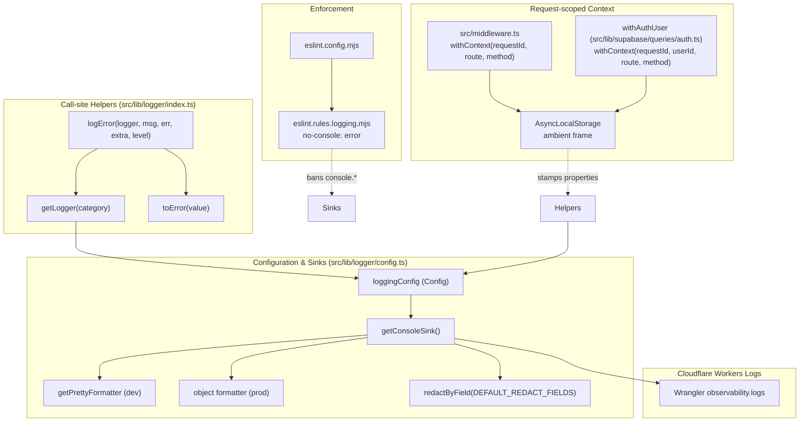
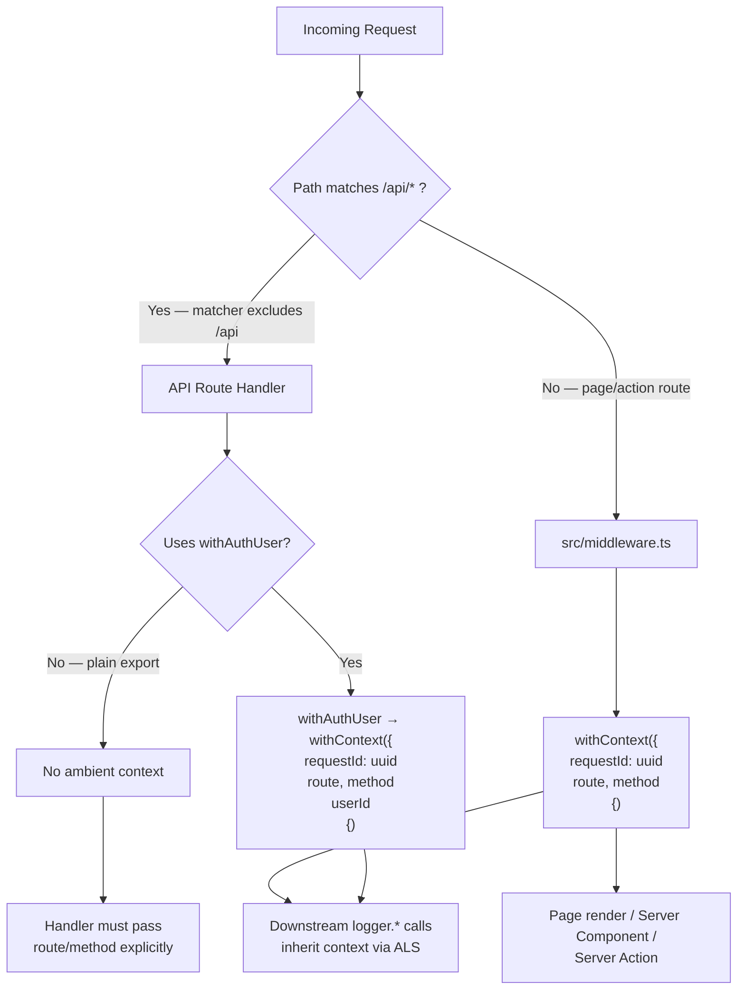
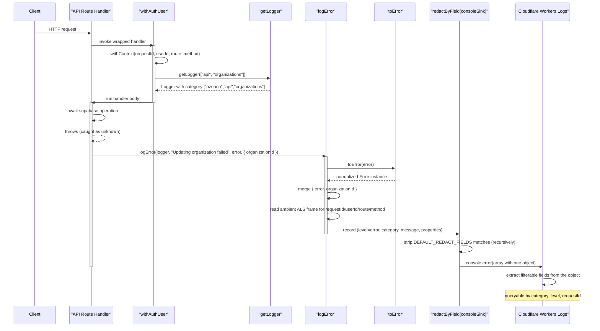

Structured, category-scoped logging for the ozeaon platform built on [LogTape](https://logtape.org/), with request-scoped ambient context, field-level redaction, Cloudflare Workers Logs integration, and ESLint enforcement that forbids unstructured `console.*` calls anywhere in the codebase.

## Purpose and Scope

This page documents the end-to-end logging and observability subsystem of ozeaon: the logger configuration and sinks, the `@/lib/logger` helper API (`getLogger`, `logError`, `toError`), the category taxonomy convention, request-scoped context propagation through middleware and `withAuthUser`, redaction of sensitive fields, Cloudflare Workers Logs constraints, and the ESLint rule that enforces the "no console logging" policy.

In scope:

- `src/lib/logger/config.ts` — sink construction, formatters, redaction wiring, and the LogTape `Config` object.
- `src/lib/logger/index.ts` — the public helper surface (`getLogger`, `toError`, `logError`).
- `docs/logging-conventions.md` — the normative conventions for categories, call sites, context, and redaction.
- `eslint.rules.logging.mjs` and its registration in `eslint.config.mjs`.
- Cloudflare Workers Logs behavior configured through `wrangler.jsonc` and `next.config.ts`.

Out of scope (covered by sibling pages):

- **Authentication and authorization** — the `withAuthUser` wrapper is described here only as a context-seeding mechanism. For its full auth responsibilities, see the authentication/authorization page.
- **Deployment and infrastructure** — OpenNext/Cloudflare build and deploy topology. Only the observability-relevant parts of the Workers runtime are discussed here.
- **Individual API route and Server Action behavior** — logging call sites are used as illustrative examples; route semantics belong to their own pages.

## Overview

The logging subsystem is deliberately thin at the call site and heavily conventional at the edges. Every module gets a logger through a single helper, every error path goes through a single wrapper, and every log record is stamped with ambient request context that is established once per request by middleware or by the authenticated-route wrapper. The design intent is to make the *correct* call the *easy* call, so that the ESLint rule enforcing it is a safety net rather than the primary mechanism.

Three properties characterize the subsystem:

1. **Category-based routing instead of module-global loggers.** LogTape routes records by category (`string[]`), and ozeaon derives categories mechanically from file paths. This means log filtering and dashboard queries can target a subtree of the application (`["ozeaon", "api", "organizations"]`) without any code change, because directory structure and category structure are kept isomorphic.

2. **Ambient context over manual threading.** Rather than passing a `requestId` down through every function signature, middleware and `withAuthUser` wrap execution in `withContext`, which relies on `AsyncLocalStorage` to make `requestId`, `route`, `method`, and `userId` available to *any* downstream logger call without explicit parameters. This is why Server Components, Server Actions, and page renders — which previously had no request context at all — now produce correlated logs.

3. **Redaction as a backstop, not a strategy.** A redaction sink strips known-sensitive field names before records reach the console. The conventions are explicit that this is a defense against mistakes, not a license to log secrets.

The trade-off accepted throughout is **coupling to conventions over coupling to a framework**. The core `src/lib/logger/config.ts` is intentionally compact (63 lines) and knows nothing about routing, auth, or route groups. Everything context-sensitive lives in the conventions document and in the wrappers that establish context, keeping the foundation stable so that adding a new sink (Sentry/OTel) or a new correlation field does not require restructuring.

## Architecture

The subsystem has four layers: the enforcement layer (ESLint), the call-site helper layer (`@/lib/logger`), the configuration/sink layer (`src/lib/logger/config.ts`), and the runtime context layer (middleware and `withAuthUser`). Context flows *into* records from the context layer; records flow *out* through the sink layer to the Cloudflare Workers console.



**Why the layers are ordered this way.** Enforcement sits outside the runtime entirely so that a violation is caught before it can ship. The helper layer exists because LogTape's raw API has two specific ergonomic gaps (`getLogger` requires re-prepending the root category; `logger.error` cannot accept an `unknown` from a `catch` block), and closing those gaps at the call site is what makes the convention viable. The context layer is separate from the helper layer because context seeding is per-request and per-wrapper, not per-call — mixing the two would force every call site to think about request identity. The sink layer is deliberately context-free and env-switched, so that adding a sink is a one-line change to `loggingConfig.sinks`.

## Helper API Implementation

The public helper surface lives in `src/lib/logger/index.ts`. It is intentionally small: three exported functions that close the two ergonomic gaps in LogTape's native API and centralize the root category.

```ts
import { getLogger as getLogTapeLogger, type Logger } from "@logtape/logtape";
import { LOGGER_ROOT_CATEGORY } from "@/lib/logger/config";

export function getLogger(category: readonly string[]): Logger {
  return getLogTapeLogger([LOGGER_ROOT_CATEGORY, ...category]);
}

export function toError(value: unknown): Error {
  if (value instanceof Error) return value;
  // ...
}

export function logError(
  logger: Logger,
  // ...
): void {
  const error = toError(err);
  // ...
}
```

> Source: [index.ts](https://github.com/ozeaon/ozeaon-v2/blob/0a4f1a95824db87782f1221a4108019d174df3d9/src/lib/logger/index.ts#L1-L28)

### `getLogger(category)`

The wrapper prepends the shared root category constant to the caller-supplied segments. `LOGGER_ROOT_CATEGORY` is defined as `"ozeaon"` and exported from the config module:

```ts
export const LOGGER_ROOT_CATEGORY = "ozeaon";
```

> Source: [config.ts](https://github.com/ozeaon/ozeaon-v2/blob/0a4f1a95824db87782f1221a4108019d174df3d9/src/lib/logger/config.ts#L6)

**Design intent.** Every logger in the application must be a descendant of the `ozeaon` root so that:

- The `loggingConfig` logger entry `{ category: [LOGGER_ROOT_CATEGORY], lowestLevel, sinks: ["console"] }` matches *every* application logger, meaning a single config entry controls level and sink routing for the whole app.
- LogTape's own internal diagnostic logger (`["logtape", "meta"]`) stays a separate, quieter subtree rather than being mixed with application records.

By exporting a wrapper instead of the raw `getLogger`, the codebase guarantees that no module can accidentally create an orphan category outside the root, and no module can hardcode the root segment and drift from it.

### `toError(value)`

`toError` is the coercion primitive. It normalizes anything throwable into a real `Error` instance:

- If `value instanceof Error`, it is returned unchanged (fast path, preserves stack and subclass identity).
- Otherwise the thrown value — a string, a plain object, `undefined`, anything — is converted into an `Error`.

**Design intent.** Under TypeScript `strict`, a `catch` block always binds its variable as `unknown`. LogTape 2.x added native `Error` overloads (`logger.error(err)`, `logger.error(err, extra)`, `logger.error(message, err)`), but all of them require an actual `Error` instance, and LogTape provides no built-in `unknown → Error` coercion. `toError` is the piece doing real work: without it, passing a caught `unknown` into a native overload fails type-checking, and at runtime the record's error property would be a non-Error value that the formatter cannot render consistently. `toError` is exported so call sites can reuse it directly when they need a normalized `Error` outside of `logError`.

### `logError(logger, message, err, extra?, level?)`

`logError` is the mandatory shape for every error path. It:

1. Coerces `err` via `toError`.
2. Merges the resulting error with the caller's `extra` structured properties.
3. Adapts behavior by environment — the source guards on `env.isProduction`.
4. Accepts an optional trailing level argument defaulting to `"error"`, so best-effort cleanup can be demoted to `"warning"`.

**Why a dedicated wrapper instead of a bare `logger.error`.** The conventions document is emphatic that the native overloads do *not* supersede `logError`:

> **This is not superseded by LogTape's own native `Error` overloads** ... Those overloads require an actual `Error` instance; a `catch` block always types `error` as `unknown` under `strict`, and LogTape has no built-in `unknown`→`Error` coercion. `toError()` is the piece doing real work.

> Source: [logging-conventions.md](https://github.com/ozeaon/ozeaon-v2/blob/0a4f1a95824db87782f1221a4108019d174df3d9/docs/logging-conventions.md#L41)

The `{ error, ...extra }` properties shape is the contract: the coerced error is attached as a named `error` property, and the caller's structured context is merged alongside it as sibling keys. This keeps error logs queryable — a dashboard can filter on `level = error` and then read `organizationId` from the same record — instead of forcing the error into the message string.

### The optional level argument

For failure paths that are genuinely non-actionable — the canonical example is best-effort cleanup that does not change a response already sent to the client:

```ts
logError(logger, "R2 cleanup after moderation failed", e, { path: key }, "warning");
```

> Source: [logging-conventions.md](https://github.com/ozeaon/ozeaon-v2/blob/0a4f1a95824db87782f1221a4108019d174df3d9/docs/logging-conventions.md#L46)

**Design intent.** The fifth argument exists so that operational cleanup noise does not page anyone once an alerting sink is added (Sentry/OTel, listed as a deferred extension point). Concretely: the object-storage cleanup that runs after a moderation-driven delete is best-effort — the database write has already failed and the response has already been formed, so a failed R2 delete is an orphaned-object condition to be swept later, not an incident. Encoding that judgment at the call site via `"warning"` means the severity decision is made by the engineer who knows the contract, not by a global heuristic.

## Category Taxonomy

Categories are derived mechanically from the `src/`-relative directory of the calling file, using two segments, with a third only when a directory genuinely needs sub-grouping.

```ts
const logger = getLogger(["api", "organizations"]);
const logger = getLogger(["lib", "supabase"]);
const logger = getLogger(["components", "articles"]);
```

> Source: [logging-conventions.md](https://github.com/ozeaon/ozeaon-v2/blob/0a4f1a95824db87782f1221a4108019d174df3d9/docs/logging-conventions.md#L13-L17)

The rules are:

| Rule | Behavior | Rationale |
|------|----------|-----------|
| Route groups are stripped, not renamed | A file at `app/(main)/(feed)/(public)/(home)/page.tsx` maps to `["app", "feed"]` | Route-group directories are organizational parenthesis-syntax in Next.js, not real path segments; renaming them would make the category unpredictable |
| Server Actions always use `["actions", X]` | Regardless of route group | Actions are invoked from many contexts; a stable category makes them filterable as a class |
| Root-level files use `["app", "root"]` | `instrumentation.ts`, `middleware.ts`, `layout.tsx`, `error.tsx` | A single fixed category rather than inventing a per-file second segment for files that have no meaningful parent directory |

> Source: [logging-conventions.md](https://github.com/ozeaon/ozeaon-v2/blob/0a4f1a95824db87782f1221a4108019d174df3d9/docs/logging-conventions.md#L9-L11)

**Design intent.** Making the category a mechanical projection of the file path means the taxonomy cannot drift: moving a file and updating its logger can be verified by inspection, and a reviewer can tell whether a category is correct without knowing any business logic. The `["app", "root"]` carve-out acknowledges that files directly under `src/` or `src/app` have no second path segment to mirror, so inventing one would require a lookup table that would rot.

## Request-Scoped Context

Ambient context is the mechanism that makes request correlation free at the call site. Two independent wrappers seed it, because they cover two disjoint execution paths.



### Middleware-seeded context

`src/middleware.ts` wraps every request it runs on in LogTape's `withContext`, stamping three fields:

- `requestId` — a fresh UUID per request
- `route`
- `method`

These propagate to *every* log emitted downstream, including logs from helpers called deeper in the stack, with no explicit passing required.

> Source: [logging-conventions.md](https://github.com/ozeaon/ozeaon-v2/blob/0a4f1a95824db87782f1221a4108019d174df3d9/docs/logging-conventions.md#L65)

**The critical exclusion.** Middleware's `config.matcher` excludes `/api/*` entirely via a negative lookahead. This means middleware's ambient context **never reaches API route handlers**. The conventions state the consequence precisely:

> Middleware only closes the gap for page renders, Server Components, and Server Actions, which previously had no request context at all.

> Source: [logging-conventions.md](https://github.com/ozeaon/ozeaon-v2/blob/0a4f1a95824db87782f1221a4108019d174df3d9/docs/logging-conventions.md#L67)

So middleware is *not* an application-wide instrumentation layer. It is specifically the instrumentation layer for the rendering path, and the `/api` exclusion is a deliberate consequence of the matcher configuration rather than an oversight the API handlers can rely on being reversed.

### `withAuthUser`-seeded context

Because API routes never pass through middleware, `withAuthUser` (`src/lib/supabase/queries/auth.ts`) seeds all four fields itself, in its own independent `withContext`:

- `requestId` — a fresh UUID per request
- `userId`
- `route`
- `method`

> Source: [logging-conventions.md](https://github.com/ozeaon/ozeaon-v2/blob/0a4f1a95824db87782f1221a4108019d174df3d9/docs/logging-conventions.md#L69)

**Design intent.** `withAuthUser` does not rely on or inherit from middleware's context. This is a correct architectural choice rather than duplication: the two wrappers cover disjoint paths (API vs. page render), so neither can depend on the other having run. The consequence is that there are two independent context-seeding sites, and a future refactor must not collapse one into the other.

### Where context is *not* ambient — and why that matters

Three situations require explicit context passing, and each is documented with a concrete failure mode:

**1. Server Actions and client code.** These never run through `withAuthUser`, so nothing puts `userId` on their log records automatically. The conventions single out `deleteAccount` in `src/lib/supabase/actions.ts` as the case to remember: its failure paths are logged for a manual sweep of orphaned `auth.users` rows, and `userId` is the *only* handle that sweep has.

> if it's ever dropped on the assumption that "it's already ambient," the sweep silently loses its key.

> Source: [logging-conventions.md](https://github.com/ozeaon/ozeaon-v2/blob/0a4f1a95824db87782f1221a4108019d174df3d9/docs/logging-conventions.md#L71)

**2. Plain-export API route handlers.** A route that does not go through `withAuthUser` (public GETs, secret-header-gated admin routes) has no ambient `requestId`/`route`/`method`. A `logError` there must pass them explicitly:

```ts
export async function GET(request: NextRequest) {
  try {
    // ...
  } catch (error) {
    logError(logger, "Failed to retrieve object", error, {
      path: key,
      route: request.nextUrl.pathname,
      method: request.method,
    });
  }
}
```

> Source: [logging-conventions.md](https://github.com/ozeaon/ozeaon-v2/blob/0a4f1a95824db87782f1221a4108019d174df3d9/docs/logging-conventions.md#L76-L86)

The current set of plain-export handlers is enumerated in the conventions: `src/app/api/storage/route.ts`, `src/app/api/storage/audit/route.ts` (which takes a plain `Request`, so `new URL(request.url).pathname` is used instead of `request.nextUrl`), `src/app/api/posts/route.ts` GET, and `src/app/api/articles/[id]/content/route.ts` GET.

> Source: [logging-conventions.md](https://github.com/ozeaon/ozeaon-v2/blob/0a4f1a95824db87782f1221a4108019d174df3d9/docs/logging-conventions.md#L89)

**3. Redundancy inside ambient scopes.** The conventions explicitly forbid the opposite mistake in covered paths: do not re-derive or duplicate `requestId`/`route`/`method` as manual properties in individual `logger.*` calls in Server Components, Server Actions, or page renders, because they are already ambient there. Duplicating them wastes the mechanism and creates a second source of truth that can disagree with the ambient value.

### Catch-block message conventions

Messages name the *operation*, not the route:

> A catch block's message should say what failed (`"Organisation member role update failed"`), not restate `${method} ${path}` — the method and path are already structured fields (ambient or explicit, per above), so putting them in the message string duplicates data and pushes out the one thing the string is for.

> Source: [logging-conventions.md](https://github.com/ozeaon/ozeaon-v2/blob/0a4f1a95824db87782f1221a4108019d174df3d9/docs/logging-conventions.md#L91)

This matters especially when a file has more than one catch block for the same route+method — for example an inner Supabase-error check plus an outer catch-all. Each must get a distinct, specific name so that the log alone identifies which branch fired.

## Structured Properties vs. String Interpolation

For non-error logging, the rule is that structured data goes in the properties object, never into the message string:

```ts
// ✅
logger.info("upload completed", { fileId, sizeBytes });

// ❌ never do this
logger.info(`upload completed for ${fileId} (${sizeBytes} bytes)`);
```

> Source: [logging-conventions.md](https://github.com/ozeaon/ozeaon-v2/blob/0a4f1a95824db87782f1221a4108019d174df3d9/docs/logging-conventions.md#L52-L56)

**Design intent.** This is what makes the Cloudflare Workers Logs object formatter (see below) useful: properties merged into the console object become individually filterable dashboard fields. Interpolating them into the message destroys that, because the resulting record has one opaque message string and no structured field to filter on. The message should read as a stable, low-cardinality event name; the variable data belongs in properties.

## Sink Configuration

`src/lib/logger/config.ts` is the entire conversion from LogTape's configuration model to a concrete sink. It is 63 lines and environment-switched.

```ts
import { getConsoleSink, type Config } from "@logtape/logtape";
import { DEFAULT_REDACT_FIELDS, redactByField } from "@logtape/redaction";
import { env } from "@/config";
import { getPrettyFormatter } from "@logtape/pretty";

export const LOGGER_ROOT_CATEGORY = "ozeaon";

const lowestLevel = env.isDevelopment ? "debug" : "info";
```

> Source: [config.ts](https://github.com/ozeaon/ozeaon-v2/blob/0a4f1a95824db87782f1221a4108019d174df3d9/src/lib/logger/config.ts#L1-L8)

### Level gating

A single `lowestLevel` constant gates the application subtree: `debug` in development, `info` in production. Because the root logger entry applies to `[LOGGER_ROOT_CATEGORY]`, this one value governs the whole `ozeaon` category tree. The `logtape.meta` subtree is pinned separately to `warning` so that LogTape's own diagnostics do not flood the console.

### Development sink: human-readable pretty output

```ts
const consoleSink = env.isDevelopment
  ? getConsoleSink({
      formatter: (record) => {
        const result: unknown[] = [
          getPrettyFormatter(formatterOptions)(record),
        ];
        // prints objects into console, not texts
        if (Object.keys(record.properties).length > 0) {
          result.push(record.properties);
        }
        return result;
      },
    })
  : getConsoleSink({ /* production object formatter */ });
```

> Source: [config.ts](https://github.com/ozeaon/ozeaon-v2/blob/0a4f1a95824db87782f1221a4108019d174df3d9/src/lib/logger/config.ts#L23-L35)

The formatter options disable decoration that would fight a terminal, and constrain object inspection depth:

```ts
const formatterOptions = {
  icons: false,
  align: false,
  colors: false,
  inspectOptions: {
    depth: 1,
    compact: true,
    colors: true,
    showProxy: true,
    getters: true,
  },
} as const;
```

> Source: [config.ts](https://github.com/ozeaon/ozeaon-v2/blob/0a4f1a95824db87782f1221a4108019d174df3d9/src/lib/logger/config.ts#L10-L21)

`depth: 1` is significant: it keeps a nested Supabase or request object from spilling hundreds of lines into the console, which is the common failure mode when logging rich objects. `showProxy: true` and `getters: true` ensure that lazily-computed and proxied values (which Next.js request objects frequently are) render as actual values rather than opaque proxy shells.

### Production sink: object, not JSON string

```ts
  : getConsoleSink({
      // Cloudflare Workers Logs only auto-extracts filterable fields from a
      // real object passed to console.log — a JSON *string* argument (e.g.
      // from getJsonLinesFormatter()) is stored as one opaque text field.
      formatter: (record) => [
        {
          level: record.level,
          category: record.category.join("."),
          message: record.rawMessage,
          timestamp: new Date(record.timestamp).toISOString(),
          ...record.properties,
        },
      ],
    });
```

> Source: [config.ts](https://github.com/ozeaon/ozeaon-v2/blob/0a4f1a95824db87782f1221a4108019d174df3d9/src/lib/logger/config.ts#L36-L48)

This is the single most operationally consequential decision in the file, and the conventions document explains it at length:

> **Cloudflare Workers Logs only auto-extracts filterable dashboard fields from an actual object passed to `console.log`/`console.error`.** A JSON *string* argument — which is what `@logtape/logtape`'s built-in `getJsonLinesFormatter()` produces — is stored as one opaque text field, identical to unstructured logging, even though it's valid JSON. `getConsoleSink`'s internal sink only takes the multi-arg `console[method](https://github.com/ozeaon/ozeaon-v2/blob/0a4f1a95824db87782f1221a4108019d174df3d9/...args)` path (the one Workers Logs can decompose) when the formatter returns an **array** instead of a string.

> Source: [logging-conventions.md](https://github.com/ozeaon/ozeaon-v2/blob/0a4f1a95824db87782f1221a4108019d174df3d9/docs/logging-conventions.md#L109)

Note the shape precisely: the formatter returns an **array containing one object**. `record.properties` is spread at the top level of that object, so `fileId` and `sizeBytes` become first-class keys alongside `level`, `category`, `message`, and `timestamp`. The category array is flattened to a dot-joined string (`["ozeaon","api","organizations"]` → `"ozeaon.api.organizations"`) because Workers Logs needs a scalar to index; `record.rawMessage` is used rather than a formatted message so that no formatter decoration leaks into the stored value, and the timestamp is forced to ISO-8601 for stable cross-referencing.

The conventions explicitly warn against "simplifying" this back to `getJsonLinesFormatter()`:

> Don't swap this back to `getJsonLinesFormatter()` for convenience; it silently defeats field extraction in the Cloudflare dashboard.

> Source: [logging-conventions.md](https://github.com/ozeaon/ozeaon-v2/blob/0a4f1a95824db87782f1221a4108019d174df3d9/docs/logging-conventions.md#L109)

### The `loggingConfig` object

```ts
const sink = redactByField(consoleSink, DEFAULT_REDACT_FIELDS);

export const loggingConfig: Config<"console", never> = {
  sinks: { console: sink },
  loggers: [
    { category: [LOGGER_ROOT_CATEGORY], lowestLevel, sinks: ["console"] },
    {
      category: ["logtape", "meta"],
      lowestLevel: "warning",
      sinks: ["console"],
    },
  ],
  reset: true,
};
```

> Source: [config.ts](https://github.com/ozeaon/ozeaon-v2/blob/0a4f1a95824db87782f1221a4108019d174df3d9/src/lib/logger/config.ts#L50-L63)

Two details matter for extension:

- **`Config<"console", never>`** — the generic parameters name the sink registry keys and (here) no filters. Adding a sink means widening the first type argument, which makes it a compile-time-visible change rather than a silent config drift.
- **`reset: true`** — the configuration replaces any pre-existing global LogTape state, which is what makes `configure(loggingConfig)` idempotent across dev-server restarts and Worker instance reinitialization.

## Redaction

Redaction is wired exactly once, by wrapping the console sink:

```ts
const sink = redactByField(consoleSink, DEFAULT_REDACT_FIELDS);
```

> Source: [config.ts](https://github.com/ozeaon/ozeaon-v2/blob/0a4f1a95824db87782f1221a4108019d174df3d9/src/lib/logger/config.ts#L50)

`DEFAULT_REDACT_FIELDS` (from `@logtape/redaction`) matches common sensitive field names — password, token, secret, and others — **anywhere** in a logged properties object, including nested objects, and deletes them before the sink formats or writes the record. Both environment sinks are wrapped, so redaction applies regardless of environment.

### The collateral-damage trap

The field-name patterns are broad substring/regex matches, not an exact-name allowlist:

> `/auth/i`, `/email/i`, `/address/i`, and `/private/i` are matched wherever they appear, so ordinary field names like `authorId`, `userEmail`, or `isPrivate` get silently redacted as collateral damage, not because they're actually sensitive. Treat any property containing those substrings as untrustworthy in logs until proven otherwise, and don't assume a missing field was never logged — it may have been redacted.

> Source: [logging-conventions.md](https://github.com/ozeaon/ozeaon-v2/blob/0a4f1a95824db87782f1221a4108019d174df3d9/docs/logging-conventions.md#L102)

This is the single most important operational caveat in the subsystem. During an incident, a missing `authorId` in a log record is *not* evidence that the field was never set — it is ambiguous between "not logged," "logged and redacted," and "logged under a different name." Any debugging procedure that treats absence as proof is unsound here. The conventions address this by recommending avoiding substring-colliding names for fields that matter, and by treating redaction as a backstop rather than a design.

### The "never log secrets" rule

> Don't put passwords, tokens, API keys, or full session/JWT values into a logged properties object, even as a one-off. ... but treat this as a backstop against mistakes, not a substitute for not logging secrets in the first place.

> Source: [logging-conventions.md](https://github.com/ozeaon/ozeaon-v2/blob/0a4f1a95824db87782f1221a4108019d174df3d9/docs/logging-conventions.md#L61)

The layering is deliberate: redaction protects against slips, while the rule states that the primary control is not producing the record at all. The reason is coverage — redaction only strips fields whose *names* match known patterns, so a secret placed in a message string, in an array element, or under an unrecognized key passes through untouched.

## Cloudflare Workers Logs Constraints

The following limits are material to log design because they bound what the platform can retain and correlate. They are configured via `wrangler.jsonc` (`observability.logs.enabled`, `invocation_logs`, `observability.logs.head_sampling_rate`) and `next.config.ts` (`logging.browserToTerminal: false`, alongside `productionBrowserSourceMaps: false`).

| Constraint | Value | Operational consequence |
|-----------|-------|-------------------------|
| Max size per log entry | 256 KB | Larger entries are truncated — structured objects should be kept shallow |
| Retention | 3 days (Free plan), 7 days (Paid) | No long-term dashboard storage; longer retention requires Logpush, which is **not set up** in this project |
| Account-wide volume | ~5 billion logs/day before Cloudflare's automatic 1% sampling kicks in | Beyond that threshold, logs are silently sampled |
| Per-Worker volume lever | `observability.logs.head_sampling_rate` | The proactive control to lower ingest volume if it becomes a cost or noise concern |
| Correlation | App-supplied `requestId` | Cloudflare's Ray ID cannot substitute — it is only a single-hop parent link and is not guaranteed unique |

> Source: [logging-conventions.md](https://github.com/ozeaon/ozeaon-v2/blob/0a4f1a95824db87782f1221a4108019d174df3d9/docs/logging-conventions.md#L115-L118)

**Design intent behind app-level correlation.** Because the platform identifier is unreliable for joining records, the subsystem invests in `requestId` — a fresh UUID stamped by `withContext` — as the canonical join key. This is why the context layer is load-bearing rather than a convenience: without it, there is no reliable way to reconstruct a single request's log stream from the dashboard.

The retention constraint also explains part of why the deferred Sentry/OTel sink matters: the Workers Logs dashboard cannot serve as an incident-forensics store beyond a week.

## ESLint Enforcement

The policy that all logging flows through the helpers is mechanically enforced. The rule module is trivially small:

```js
export default {
  "no-console": "error",
};
```

> Source: [eslint.rules.logging.mjs](https://github.com/ozeaon/ozeaon-v2/blob/0a4f1a95824db87782f1221a4108019d174df3d9/eslint.rules.logging.mjs#L1-L3)

It is registered in `eslint.config.mjs` as a top-level spread:

```js
import loggingRules from "./eslint.rules.logging.mjs";
// ...
    rules: {
      ...loggingRules,
    },
```

> Source: [eslint.config.mjs](https://github.com/ozeaon/ozeaon-v2/blob/0a4f1a95824db87782f1221a4108019d174df3d9/eslint.config.mjs#L10-L33)

### Why it is its own top-level block

The conventions are explicit that this is deliberately *not* folded into the existing `.tsx`-only block:

> `no-console` is enforced project-wide as its own top-level block in `eslint.config.mjs`, covering both `.ts` and `.tsx` — deliberately not folded into the existing `.tsx`-only `{ files: ["src/**/*.tsx"], rules: { ...cacheRules, ...authRules } }` block, which has an unrelated pre-existing bug (only the last spread in that merge takes effect) that is out of scope to fix here.

> Source: [logging-conventions.md](https://github.com/ozeaon/ozeaon-v2/blob/0a4f1a95824db87782f1221a4108019d174df3d9/docs/logging-conventions.md#L142)

**Design intent.** Had the logging rule been added to that block, the pre-existing merge bug (where only the last spread survives object-spread merging) would have silently disabled it — the rule would appear to be configured while having no effect. Placing it in a separate top-level block covering both extensions sidesteps the bug entirely and broadens coverage to `.ts` files, which the buggy block never covered in the first place. This is a good example of the enforcement layer being designed around a known-defective neighbor rather than depending on it.

## Core Flow: From Exception to Queryable Record

The following sequence traces a single failure in an authenticated API route through to the Cloudflare dashboard. It exercises every layer: `withAuthUser`'s context seeding, `getLogger`'s category construction, `logError`'s coercion and merging, the redaction sink, and the object formatter.



**What to notice.** The handler never passes `requestId`, `route`, `method`, or `userId` — those arrive through the `AsyncLocalStorage` frame set up by `withAuthUser`, and are read implicitly when the record is built. That is the payoff of the context layer: a `logError` call in a deeply-nested helper is correlated with the request without any of the intermediate functions knowing about logging at all. The only explicit context is `organizationId`, which is genuine handler-local data.

## Failure Modes & Edge Cases

| Scenario | Behavior | Evidence |
|----------|----------|----------|
| `catch` binds `unknown` (non-`Error`) | `logError` coerces via `toError`; native LogTape overloads would fail to type-check | [logging-conventions.md](https://github.com/ozeaon/ozeaon-v2/blob/0a4f1a95824db87782f1221a4108019d174df3d9/docs/logging-conventions.md#L41) |
| Error path in a plain-export API route | No ambient context; `route`/`method` must be passed explicitly or the record is uncorrelated | [logging-conventions.md](https://github.com/ozeaon/ozeaon-v2/blob/0a4f1a95824db87782f1221a4108019d174df3d9/docs/logging-conventions.md#L73-L89) |
| Server Action failure needing `userId` for later sweep | `userId` is not ambient there; must be passed explicitly or the orphan sweep loses its key | [logging-conventions.md](https://github.com/ozeaon/ozeaon-v2/blob/0a4f1a95824db87782f1221a4108019d174df3d9/docs/logging-conventions.md#L71) |
| Ambiguous missing field in a record | Field may have been redacted by broad pattern match (`authorId`, `userEmail`, `isPrivate`); absence is not proof of non-logging | [logging-conventions.md](https://github.com/ozeaon/ozeaon-v2/blob/0a4f1a95824db87782f1221a4108019d174df3d9/docs/logging-conventions.md#L102) |
| Log entry > 256 KB | Truncated by Cloudflare Workers Logs | [logging-conventions.md](https://github.com/ozeaon/ozeaon-v2/blob/0a4f1a95824db87782f1221a4108019d174df3d9/docs/logging-conventions.md#L115) |
| Ingest exceeds ~5B logs/day | Cloudflare applies automatic 1% sampling; mitigate via `head_sampling_rate` | [logging-conventions.md](https://github.com/ozeaon/ozeaon-v2/blob/0a4f1a95824db87782f1221a4108019d174df3d9/docs/logging-conventions.md#L117) |
| Logs needed beyond 3/7-day retention | No mechanism — Logpush is not configured | [logging-conventions.md](https://github.com/ozeaon/ozeaon-v2/blob/0a4f1a95824db87782f1221a4108019d174df3d9/docs/logging-conventions.md#L116) |
| Nested object logged | `inspectOptions.depth: 1` bounds console output in development | [config.ts](https://github.com/ozeaon/ozeaon-v2/blob/0a4f1a95824db87782f1221a4108019d174df3d9/src/lib/logger/config.ts#L14-L20) |
| Worker instance torn down | No `dispose()` call exists; safe only because the sole sink is `getConsoleSink()` | [logging-conventions.md](https://github.com/ozeaon/ozeaon-v2/blob/0a4f1a95824db87782f1221a4108019d174df3d9/docs/logging-conventions.md#L129) |

### Concurrency: the `AsyncLocalStorage` caveat

The context mechanism depends on `AsyncLocalStorage`, which on Cloudflare Workers is only partially available:

> Cloudflare's Workers runtime implements a documented subset of `node:async_hooks`' `AsyncLocalStorage` under `nodejs_compat`, but **reuses the same ALS frame internally to propagate its own trace spans alongside application context — don't assume exclusive ownership of the frame.** Whether context survives across a `ctx.waitUntil()` callback is undocumented upstream; treat it as unverified rather than assuming either way if that pattern is ever introduced.

> Source: [logging-conventions.md](https://github.com/ozeaon/ozeaon-v2/blob/0a4f1a95824db87782f1221a4108019d174df3d9/docs/logging-conventions.md#L127)

This is a genuine correctness risk rather than a theoretical one: the platform shares the ALS frame, so the application's context occupancy is not guaranteed to be exclusive. The conventions make the correct move explicit — treat `ctx.waitUntil()` context survival as *unverified* rather than assuming either behavior, which prevents a future contributor from building on an untested assumption.

## Extension Points

The architecture is explicitly designed so the following additions require no restructuring. None are built today.

| Extension | Mechanism | Cost |
|-----------|-----------|------|
| **Sentry / OTel** | Add a second sink to `loggingConfig.sinks` in `src/lib/logger/config.ts` and reference it from the relevant logger entries | One step; category taxonomy and `logError`/context plumbing need no changes |
| **Performance / suboptimal-request surfacing** | Extract the inline `timed()` helper into `@/lib/logger`, setting a `Server-Timing` mark *and* emitting `logger.warn` on threshold breach | Reuses an existing pattern rather than inventing a new one |
| **Client → server journey tracing** | Generate a client-side request/session id, thread it through `fetch` as a header, merge into `withContext` in `withAuthUser` | Requires a client-aware variant |
| **API route request context** | Wrap every plain-export API handler in its own `withContext`, mirroring `withAuthUser` | Touches ~30 files individually — deferred |
| **Sink disposal** | Add `dispose()`/`disposeSync()` when any non-console sink is introduced | Must ship with the sink, not after |

> Sources: [logging-conventions.md](https://github.com/ozeaon/ozeaon-v2/blob/0a4f1a95824db87782f1221a4108019d174df3d9/docs/logging-conventions.md#L124-L129)

### The existing `timed()` pattern and `Server-Timing`

The recommended performance-surfacing path builds on something already present in the codebase rather than a new abstraction. The inline `timed()` helper — used in `src/app/api/projects/[id]/image/route.ts` — wraps an async operation, records a `performance.now()` duration, and appends a `name;dur=X.Xms` `Server-Timing` mark. A parallel mark, `auth_wrapper`, already exists inside `withAuthUser`.

**Design intent.** Because `Server-Timing` is a browser-visible response header, these marks are observable in DevTools without any dashboard at all, making them useful during local development. The proposed extraction centralizes both the header emission and the threshold-triggered `logger.warn`, so that a slow operation appears in structured logs and in the network panel simultaneously — and the two signals cannot drift out of agreement because they come from one call.

### Client-side logging gap

`src/instrumentation-client.ts` exists, but browser-side logs have no `AsyncLocalStorage` and therefore do not carry a `requestId`:

> `withAuthUser`'s `requestId` (and middleware's, for page renders) is the join key for a future single-request view across server-side logs, but browser-side logs ... don't carry a `requestId` today.

> Source: [logging-conventions.md](https://github.com/ozeaon/ozeaon-v2/blob/0a4f1a95824db87782f1221a4108019d174df3d9/docs/logging-conventions.md#L125)

This is the current boundary of correlation: server-side records join on `requestId`; client-side records join on nothing.

## Considered and Rejected Approaches

Two alternatives were evaluated and ruled out. Both are worth recording because they are the obvious first ideas and will be proposed again.

### Wrapping the Cloudflare Workers `fetch` handler

For "log every request at the platform level," wrapping `export default { fetch }` looks attractive but fails for two confirmed reasons:

1. **No such handler exists in this codebase to wrap.** The project deploys via OpenNext (`@opennextjs/cloudflare`), which *generates* the `fetch` handler as build output — it is not hand-written application code. Patching it means reaching into OpenNext internals (its "Wrapper"/"Converter" concepts, which are internal platform-adapter plugin points, not a public per-request instrumentation API), which is brittle across OpenNext version bumps.
2. **Next.js already exposes the right hooks**, and the project uses them: `middleware.ts` runs per-request before routing (where `requestId` seeding happens for page routes), `instrumentation.ts`'s `register()` runs once per server instance (the correct place for `configure()`), and `onRequestError()` covers Server Component / Route Handler / Server Action / Proxy error observability.

> Source: [logging-conventions.md](https://github.com/ozeaon/ozeaon-v2/blob/0a4f1a95824db87782f1221a4108019d174df3d9/docs/logging-conventions.md#L133-L136)

### Cloudflare Tail Workers

Tail Workers were considered as a wrapping mechanism and ruled out because they receive **read-only `TailItem` telemetry strictly after an invocation completes** (per Cloudflare's Tail Handler documentation) and cannot inject context into or modify the in-flight request. They are a post-hoc log sink, not middleware.

> Source: [logging-conventions.md](https://github.com/ozeaon/ozeaon-v2/blob/0a4f1a95824db87782f1221a4108019d174df3d9/docs/logging-conventions.md#L138)

**The general lesson from both:** the correct instrumentation layer for this application is the Next.js hook surface (`middleware.ts`, `instrumentation.ts`, `onRequestError()`), not the generated adapter or the platform's post-hoc telemetry. Together the Next.js hooks cover what "wrap every fetch" would have attempted, without depending on adapter internals.

## Design Trade-offs Summary

| Decision | Benefit | Cost / Risk |
|----------|---------|-------------|
| Category mirrors file path | Taxonomy cannot drift; no lookup tables | Route groups must be stripped by convention, which is easy to get wrong |
| Root category injected by wrapper | Single config entry governs the whole app | Global LogTape `getLogger` must never be called directly |
| `withContext` via `AsyncLocalStorage` | Zero-argument correlation for all downstream logs | Depends on partial `nodejs_compat` ALS; shares frame with platform traces |
| Two independent context seeders | Each covers a path the other cannot reach | Two sites to maintain; a refactor collapsing them breaks correlation |
| Object formatter, not JSON lines | Fields are filterable in Workers Logs | Counter-intuitive; the "obvious" `getJsonLinesFormatter()` silently degrades it |
| Broad redaction patterns | Catches sensitive fields under unexpected names | Silently redacts innocuous fields (`authorId`, `userEmail`) |
| Separate top-level ESLint block | Sidesteps a pre-existing spread-merge bug; covers `.ts` too | The buggy `.tsx` block remains unfixed |
| No `dispose()` today | No unnecessary lifecycle code | Must be added with the first non-console sink, or writes may be dropped |

## Related Links

### Source files

- [Logger configuration and sinks](https://github.com/ozeaon/ozeaon-v2/blob/0a4f1a95824db87782f1221a4108019d174df3d9/src/lib/logger/config.ts)
- [Logger helper API](https://github.com/ozeaon/ozeaon-v2/blob/0a4f1a95824db87782f1221a4108019d174df3d9/src/lib/logger/index.ts)
- [Logging conventions document](https://github.com/ozeaon/ozeaon-v2/blob/0a4f1a95824db87782f1221a4108019d174df3d9/docs/logging-conventions.md)
- [ESLint logging rule](https://github.com/ozeaon/ozeaon-v2/blob/0a4f1a95824db87782f1221a4108019d174df3d9/eslint.rules.logging.mjs)
- [ESLint configuration](https://github.com/ozeaon/ozeaon-v2/blob/0a4f1a95824db87782f1221a4108019d174df3d9/eslint.config.mjs)
- [Next.js configuration](https://github.com/ozeaon/ozeaon-v2/blob/0a4f1a95824db87782f1221a4108019d174df3d9/next.config.ts)

### Referenced modules

- `src/middleware.ts` — request-scoped `withContext` seeding for page renders, with `/api/*` excluded by `config.matcher`
- `src/instrumentation.ts` — `register()` (server-instance `configure()`) and `onRequestError()`
- `src/instrumentation-client.ts` — browser-side instrumentation (no `requestId` propagation)
- `src/lib/supabase/queries/auth.ts` — `withAuthUser`, the API-route context seeder
- `src/lib/supabase/actions.ts` — `deleteAccount`, whose failure logs depend on explicit `userId`
- `src/app/api/storage/route.ts`, `src/app/api/storage/audit/route.ts`, `src/app/api/posts/route.ts`, `src/app/api/articles/[id]/content/route.ts` — plain-export handlers that must pass `route`/`method` explicitly
- `src/app/api/projects/[id]/image/route.ts` — inline `timed()` helper and `Server-Timing` emission
- `wrangler.jsonc` — `observability.logs.enabled`, `invocation_logs`, `head_sampling_rate`

### Related documentation

- Authentication & Authorization — full responsibilities of `withAuthUser` beyond context seeding
- Deployment & Infrastructure — OpenNext/Cloudflare build topology
- API Routes — per-route semantics for the handlers referenced above
