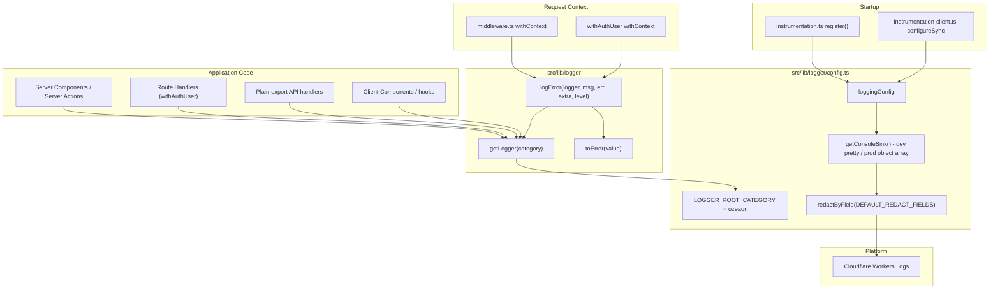
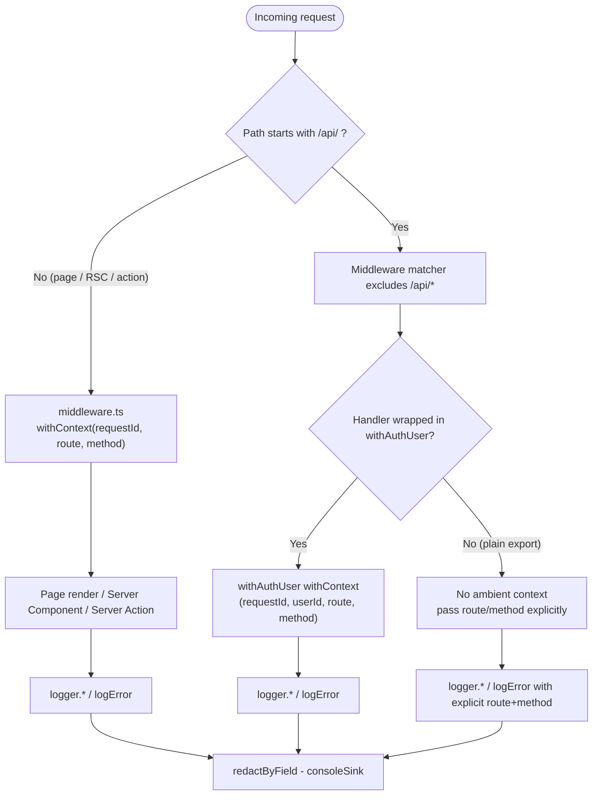
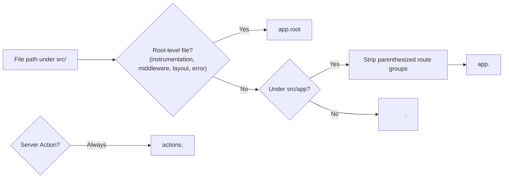
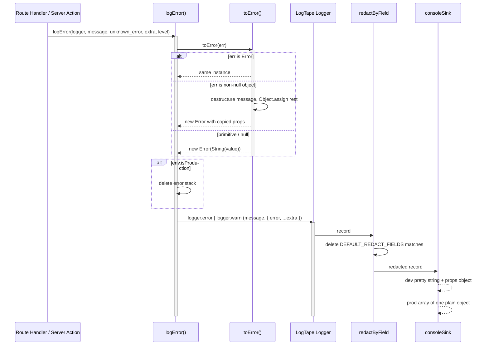
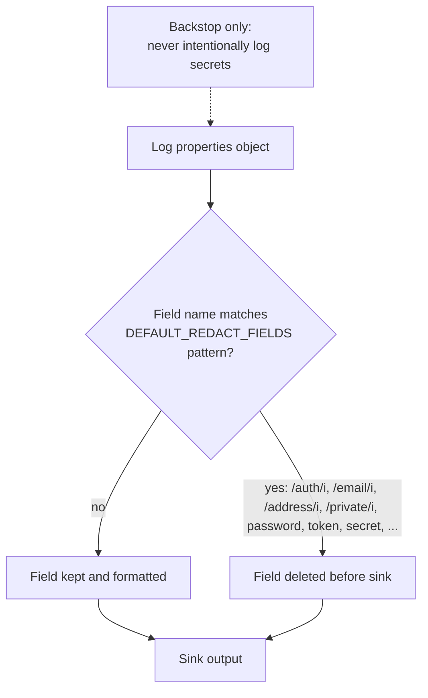
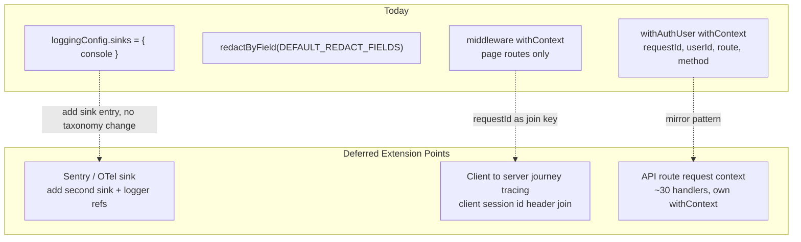

Structured, category-taxonomy-based logging built on [LogTape](https://logtape.org/), with a shared logger factory, mandatory error-wrapping helper, request-scoped ambient context, field-level redaction, and Cloudflare Workers Logs-aware sinks.

## Purpose and Scope

This page documents how the application emits, structures, redacts, and routes log records — the `src/lib/logger` module, the LogTape configuration and sinks, the instrumentation/startup wiring, the request-scoped context stamped by `middleware.ts` and `withAuthUser`, the ESLint enforcement of the conventions, and the Cloudflare Workers Logs operational characteristics.

Specifically covered:

- The `getLogger` / `toError` / `logError` helper surface in `src/lib/logger/index.ts`
- The root category, level floor, formatter selection, and redaction sink in `src/lib/logger/config.ts`
- Startup sequencing via `src/instrumentation.ts` and `src/instrumentation-client.ts`
- Ambient `requestId` / `route` / `method` / `userId` context and its known gaps
- Category taxonomy rules from `docs/logging-conventions.md`
- ESLint enforcement (`eslint.rules.logging.mjs`, `no-console`)
- Deferred extension points (Sentry/OTel sink, client→server tracing, API-route context, `dispose()`)

Out of scope on this page: error-response shaping and HTTP status mapping (see the API/routing pages), Supabase auth flows beyond their logging wrapper, and moderation-specific log semantics (`src/lib/moderation/log.ts`) which belong with the moderation capability.

## Overview

The application never calls `console.*` directly. Instead, every log record flows through a thin, opinionated wrapper around LogTape that enforces four properties:

1. **One root category.** Every logger is created through `getLogger()` from `@/lib/logger`, which prepends the shared root segment `"ozeaon"`. This guarantees a single stable namespace prefix in the log stream while allowing per-module second segments derived from the file's real path.
2. **Unknown-safe error logging.** A `catch` block in TypeScript `strict` mode types its binding as `unknown`. LogTape's native `Error` overloads require an actual `Error` instance, so the project provides `toError()` for coercion and `logError()` for the common `{ error, ...extra }` shape.
3. **Ambient request context.** `withContext` from LogTape stamps `requestId`/`route`/`method` (and, inside `withAuthUser`, `userId`) onto every record emitted downstream — without thread-through parameters.
4. **Redaction by default.** The only sink is wrapped in `redactByField(consoleSink, DEFAULT_REDACT_FIELDS)`, so known-sensitive field names are stripped before formatting, in every environment.

The design intent is explicitly *defensive layering*: the redaction sink is a backstop against mistakes, not a licence to log secrets; `logError` exists so that error paths cannot silently coerce badly; and the production formatter deliberately avoids `getJsonLinesFormatter()` so that Cloudflare Workers Logs can decompose records into filterable dashboard fields.

### Key concepts

| Term | Meaning |
|------|---------|
| **Category** | An array of string segments, e.g. `["ozeaon", "api", "organizations"]`. Mirrors the `src/`-relative file path. |
| **Root category** | `LOGGER_ROOT_CATEGORY = "ozeaon"`, prepended automatically by `getLogger()`. |
| **Level floor** | `lowestLevel` — `"debug"` in development, `"info"` otherwise. |
| **Sink** | Where records are written. Only `getConsoleSink()` is configured today. |
| **Ambient context** | LogTape `withContext` scope values merged into every record in that async scope. |
| **Redaction** | `redactByField()` deleting fields matching `DEFAULT_REDACT_FIELDS` before the sink sees them. |

## Architecture



The diagram reflects the actual module graph: `src/lib/logger/index.ts` imports `LOGGER_ROOT_CATEGORY` from `src/lib/logger/config.ts`, and `config.ts` owns both the formatter selection and the redaction wrap. `instrumentation.ts` is the single server-side `configure()` call site, while `instrumentation-client.ts` uses the synchronous `configureSync()` for the browser. Every application layer converges on `getLogger()`; error paths additionally route through `toError`/`logError`. Only `redactByField(consoleSink, ...)` reaches the platform.

## Core Implementation

### The helper surface: `src/lib/logger/index.ts`

The entire public logging API is three functions. This is deliberate minimalism: there is exactly one way to obtain a logger and exactly one way to log an error, so conventions can be enforced by import discipline rather than by review.

```ts
import { getLogger as getLogTapeLogger, type Logger } from "@logtape/logtape";
import { LOGGER_ROOT_CATEGORY } from "@/lib/logger/config";
import { env } from "@/config";

export function getLogger(category: readonly string[]): Logger {
  return getLogTapeLogger([LOGGER_ROOT_CATEGORY, ...category]);
}

export function toError(value: unknown): Error {
  if (value instanceof Error) return value;
  if (typeof value === "object" && value !== null) {
    const { message, ...rest } = value as { message?: unknown };
    const err = new Error(
      typeof message === "string" ? message : JSON.stringify(value),
    );
    return Object.assign(err, rest);
  }
  return new Error(String(value));
}

export function logError(
  logger: Logger,
  message: string,
  err: unknown,
  extra?: Record<string, unknown>,
  level: "error" | "warning" = "error",
): void {
  const error = toError(err);
  if (env.isProduction) {
    delete error.stack;
  }
  logger[level === "warning" ? "warn" : "error"](message, {
    error,
    ...extra,
  });
}
```

> Source: [index.ts](https://github.com/ozeaon/ozeaon-v2/blob/0a4f1a95824db87782f1221a4108019d174df3d9/src/lib/logger/index.ts#L1-L36)

Three implementation decisions are worth calling out:

- **`getLogger` aliases LogTape's own `getLogger`** as `getLogTapeLogger` and always shallow-copies the caller's category with the root prefixed. Callers therefore pass *only* the relative segments (`["api", "organizations"]`), and the `"ozeaon"` root can never be duplicated or omitted.
- **`toError` handles four input shapes**: a real `Error` passes through untouched; a non-null object is destructured for a `message` field, using `JSON.stringify(value)` as the message when `message` is not a string, and *all remaining own properties are copied onto the new `Error`* via `Object.assign`; `null` and primitives fall through to `new Error(String(value))`. That third branch is what preserves structured error metadata — e.g. a Supabase/PostgREST error object's `code`, `details`, and `hint` fields survive onto the `Error` instance and therefore into the logged `error` property.
- **Stack stripping is environment-gated.** In production the `stack` property is `delete`d before logging. This is a size and leakage control: Cloudflare Workers Logs truncates entries above 256 KB, and stacks are the largest and most infrastructure-revealing part of a record. Development and preview keep stacks for diagnosis.

### Configuration, level floor, and sinks: `src/lib/logger/config.ts`

```ts
export const LOGGER_ROOT_CATEGORY = "ozeaon";

const lowestLevel = env.isDevelopment ? "debug" : "info";

const consoleSink = env.isDevelopment
  ? getConsoleSink({
      formatter: (record) => {
        const result: unknown[] = [
          getPrettyFormatter(formatterOptions)(record),
        ];
        // prints objects into console, not texts
        if (Object.keys(record.properties).length > 0) {
          result.push(record.properties);
        }
        return result;
      },
    })
  : getConsoleSink({
      // Cloudflare Workers Logs only auto-extracts filterable fields from a
      // real object passed to console.log — a JSON *string* argument (e.g.
      // from getJsonLinesFormatter()) is stored as one opaque text field.
      formatter: (record) => [
        {
          level: record.level,
          category: record.category.join("."),
          message: record.rawMessage,
          timestamp: new Date(record.timestamp).toISOString(),
          ...record.properties,
        },
      ],
    });
const sink = redactByField(consoleSink, DEFAULT_REDACT_FIELDS);

export const loggingConfig: Config<"console", never> = {
  sinks: { console: sink },
  loggers: [
    { category: [LOGGER_ROOT_CATEGORY], lowestLevel, sinks: ["console"] },
    {
      category: ["logtape", "meta"],
      lowestLevel: "warning",
      sinks: ["console"],
    },
  ],
  reset: true,
};
```

> Source: [config.ts](https://github.com/ozeaon/ozeaon-v2/blob/0a4f1a95824db87782f1221a4108019d174df3d9/src/lib/logger/config.ts#L1-L63)

This file is the single place where observability behavior is decided. Its key properties:

| Element | Value | Rationale |
|---------|-------|-----------|
| `LOGGER_ROOT_CATEGORY` | `"ozeaon"` | Single namespace prefix; shared with `index.ts` to avoid a circular import of behavior. |
| `lowestLevel` | `"debug"` (dev) / `"info"` (non-dev) | Verbose locally, quiet in production/preview while keeping the 256 KB / volume budget sane. |
| Dev formatter | `getPrettyFormatter({ icons: false, align: false, colors: false, ... })` plus the raw `record.properties` object as a second console argument | Human-readable line, but properties are still printed as a real object. |
| Prod formatter | Returns an **array containing one plain object** | The only shape Workers Logs can decompose into filterable fields. |
| `logtape.meta` logger | `lowestLevel: "warning"` | Suppresses LogTape's internal meta-logging chatter except problems. |
| `reset: true` | — | `configure()` replaces the global config rather than merging, so repeated registration is idempotent. |
| Redaction | `redactByField(consoleSink, DEFAULT_REDACT_FIELDS)` | Wraps *the sink itself*, so redaction applies regardless of environment. |

A subtle but load-bearing detail: the dev formatter explicitly does **not** rely on the message template to surface properties. It appends `record.properties` as a separate argument whenever the properties object is non-empty. The conventions doc records that this replaced a hand-rolled `Object.keys(...).length > 0` workaround in favor of `@logtape/pretty`'s native `properties: true` option — the comment `// prints objects into console, not texts` marks the intent, and the `formatterOptions` object above it (with `icons: false`, `align: false`, `colors: false`) keeps the pretty output stable for a console that may be captured or piped.

The production formatter's shape is the single most consequential line in the file:

- `record.level`, `record.category.join(".")`, `record.rawMessage`, and an ISO `timestamp` become top-level fields.
- `...record.properties` is spread **after** those four, so a logged property named `record`-colliding keys would override them — a reason to avoid property names like `level`, `category`, `message`, or `timestamp` in structured context.
- Note `record.rawMessage` rather than a pre-formatted message, so the message is a plain string field rather than an interpolated template result.

### Startup wiring

The server-side configuration is applied once per server instance inside Next.js instrumentation:

```ts
const { configure } = await import("@logtape/logtape");
const { AsyncLocalStorage } = await import("node:async_hooks");
const { loggingConfig } = await import("@/lib/logger/config");
await configure({
  ...loggingConfig,
```

> Source: [instrumentation.ts](https://github.com/ozeaon/ozeaon-v2/blob/0a4f1a95824db87782f1221a4108019d174df3d9/src/instrumentation.ts#L4-L9)

Instrumentation uses **dynamic `await import()`** rather than static imports. Combined with `AsyncLocalStorage` being imported from `node:async_hooks`, this keeps the configuration off the hot path and out of environments that must not eagerly load Node-only modules. `register()` is the correct hook for one-time setup per instance; the same file also imports `getLogger` and `toError` lazily inside the unhandled-request-error hook to emit `getLogger(["app", "root"]).error("Unhandled request error", { ... })`.

> Source: [instrumentation.ts](https://github.com/ozeaon/ozeaon-v2/blob/0a4f1a95824db87782f1221a4108019d174df3d9/src/instrumentation.ts#L17-L19)

The client side is separate and synchronous, because browsers have no `AsyncLocalStorage` and no async startup window:

```ts
import { configureSync } from "@logtape/logtape";
import { clientLoggingConfig } from "@/lib/logger/client-config";

configureSync(clientLoggingConfig);
```

> Source: [instrumentation-client.ts](https://github.com/ozeaon/ozeaon-v2/blob/0a4f1a95824db87782f1221a4108019d174df3d9/src/instrumentation-client.ts#L1-L4)

Note that the client uses a distinct export, `clientLoggingConfig` from `@/lib/logger/client-config`, rather than the server `loggingConfig`. This mirrors the module's separation of concerns and is consistent with the documented fact that client logs carry no `requestId` and no ALS-backed context.

### Client configuration: `src/lib/logger/client-config.ts`

`clientLoggingConfig` is the browser counterpart of `loggingConfig`, and its differences from the server file are each deliberate:

```ts
export const clientLoggingConfig: Config<"console", never> = {
  reset: true,
  sinks: {
    console: getConsoleSink({
      // Cloudflare Workers Logs only auto-extracts filterable fields from a
      // real object passed to console.log — a JSON *string* argument (e.g.
      // from getJsonLinesFormatter()) is stored as one opaque text field.
      formatter: (record) => {
        const result: unknown[] = [
          env.isDevelopment
            ? getPrettyFormatter(formatterOptions)(record)
            : jsonFormatter(record),
        ];
        // prints objects into console, not texts
        if (Object.keys(record.properties).length > 0) {
          result.push(record.properties);
        }
        return result;
      },
    }),
  },
  loggers: [
    {
      category: [LOGGER_ROOT_CATEGORY],
      lowestLevel: env.isDevelopment ? "debug" : "warning",
      sinks: ["console"],
    },
    {
      category: ["logtape", "meta"],
      lowestLevel: "warning",
      sinks: ["console"],
    },
  ],
};
```

> Source: [client-config.ts](https://github.com/ozeaon/ozeaon-v2/blob/0a4f1a95824db87782f1221a4108019d174df3d9/src/lib/logger/client-config.ts#L21-L54)

Differences from `config.ts` and why they exist:

| Aspect | Server (`config.ts`) | Client (`client-config.ts`) |
|--------|----------------------|------------------------------|
| Production level floor | `"info"` | `"warning"` — only warnings and errors are emitted from a client session |
| Production formatter | One plain object with `...record.properties` spread **into** it | `jsonFormatter(record)` object (`level`, `category`, `message`, `timestamp`) with the properties object pushed as a **second** console argument |
| Redaction wrap | `redactByField(consoleSink, DEFAULT_REDACT_FIELDS)` | Not applied — the console sink is used bare |
| Dev pretty formatter | `{ icons: false, align: false, colors: false }` | `{ icons: false, align: false, colors: true }` — ANSI colors stay on, since browser output is always a live console |
| Categories / `reset` | `LOGGER_ROOT_CATEGORY`, `logtape.meta` at `"warning"`, `reset: true` | Identical — client records keep the `"ozeaon"` prefix, so the category taxonomy is one namespace across both runtimes |

`client-config.ts` has exactly one consumer: `src/instrumentation-client.ts`, whose entire body is the `configureSync(clientLoggingConfig)` call shown above.

## Request-Scoped Context

Ambient context is what makes a log record correlate without every caller threading a request id by hand. The project uses two independent `withContext` entry points, because middleware and API route handlers occupy disjoint execution paths.



### Middleware context (page routes only)

`src/middleware.ts` wraps every request it runs on in LogTape's `withContext`, stamping:

| Field | Source | Notes |
|-------|--------|-------|
| `requestId` | Fresh UUID per request | Primary correlation key across all log lines for one request. |
| `route` | Request path | Ambient for downstream page/RSC/action code. |
| `method` | HTTP method | Ambient for downstream page/RSC/action code. |

Because it is ALS-based, these fields appear on records emitted by helpers called arbitrarily deep in the stack, with no explicit passing. The conventions doc explicitly instructs against re-deriving or duplicating them as manual properties in Server Components, Server Actions, or page renders.

**Critical gap:** middleware's `config.matcher` excludes `/api/*` entirely, so middleware context *never* reaches API route handlers. Middleware closes the context gap for page renders, Server Components, and Server Actions, which previously had no request context at all.

### `withAuthUser` context (authenticated API routes)

`withAuthUser` in `src/lib/supabase/queries/auth.ts` independently wraps every authenticated route handler call in its own `withContext`, seeding all four fields itself because it cannot inherit from middleware:

| Field | Notes |
|-------|-------|
| `requestId` | Fresh UUID per request — not inherited from middleware. |
| `userId` | The authenticated principal. |
| `route` | Request path. |
| `method` | HTTP method. |

The important asymmetry: **`userId` is only ambient inside a `withAuthUser` handler.** Server Actions and client code never pass through that wrapper, so nothing stamps `userId` on their records automatically — it must be passed explicitly where it matters. The documented exemplar is `deleteAccount` in `src/lib/supabase/actions.ts`, whose failure paths are logged specifically to enable a manual sweep of orphaned `auth.users` rows; `userId` is the *only* handle that sweep has, so dropping it on an "it's already ambient" assumption silently breaks the operational recovery path.

### Plain-export API handlers: the persistent exception

Route handlers that do **not** go through `withAuthUser` — public GETs, secret-header-gated admin routes — get no ambient context from either source. A `logError` in such a handler must pass `route` and `method` explicitly:

```ts
export async function GET(request: NextRequest) {
  try {
    // ...
  } catch (error) {
    logError(logger, "Failed to retrieve object", error, {
      path: key,
      route: request.nextUrl.pathname,
      method: request.method,
    });
  }
}
```

> Source: [logging-conventions.md](https://github.com/ozeaon/ozeaon-v2/blob/0a4f1a95824db87782f1221a4108019d174df3d9/docs/logging-conventions.md#L76-L87)

Documented current examples of this pattern are `src/app/api/storage/route.ts`, `src/app/api/storage/audit/route.ts`, the `GET` in `src/app/api/posts/route.ts`, and the `GET` in `src/app/api/articles/[id]/content/route.ts`. Note the variant: handlers typed with a plain `Request` (not `NextRequest`) must use `new URL(request.url).pathname` because `.nextUrl` does not exist.

## Category Taxonomy

Categories are derived mechanically from file location, which is what keeps them consistent across a large codebase without a registry.



| Rule | Result | Example |
|------|--------|---------|
| Route groups are **stripped, not renamed** | First real segment after `app` | `app/(main)/(feed)/(public)/(home)/page.tsx` → `["app", "feed"]`, never `["app", "home"]` |
| Server Actions always use `["actions", X]` | Regardless of route group | Any action file |
| Root-level files use `["app", "root"]` | One fixed category | `instrumentation.ts`, `middleware.ts`, `layout.tsx`, `error.tsx` |
| Two segments standard, third only for genuine sub-grouping | Avoids arbitrary depth | — |

Representative declarations:

```ts
const logger = getLogger(["api", "organizations"]);
const logger = getLogger(["lib", "supabase"]);
const logger = getLogger(["components", "articles"]);
```

> Source: [logging-conventions.md](https://github.com/ozeaon/ozeaon-v2/blob/0a4f1a95824db87782f1221a4108019d174df3d9/docs/logging-conventions.md#L14-L16)

`getLogger` from `@/lib/logger` prepends the root category automatically. The conventions forbid calling LogTape's own `getLogger` directly or hardcoding the root segment — enforcing this in one place is what makes the `"ozeaon"` prefix a reliable stream-level filter.

Real examples in the codebase follow this exactly, including the hook category:

```ts
import { getLogger, logError } from "@/lib/logger";

const logger = getLogger(["hooks", "use-async-action"]);
```

> Sources:
> - [use-async-action.ts](https://github.com/ozeaon/ozeaon-v2/blob/0a4f1a95824db87782f1221a4108019d174df3d9/src/hooks/use-async-action.ts#L5-L7)
> - [use-notification-count.ts](https://github.com/ozeaon/ozeaon-v2/blob/0a4f1a95824db87782f1221a4108019d174df3d9/src/hooks/use-notification-count.ts#L15)
> - [use-post-images.ts](https://github.com/ozeaon/ozeaon-v2/blob/0a4f1a95824db87782f1221a4108019d174df3d9/src/hooks/use-post-images.ts#L12-L14)

## Core Flow

### Logging an error from a catch block



The ordering matters: coercion happens *before* the level is chosen and *before* the properties object is built, so the `error` key is always a real `Error`. The stack deletion happens after coercion but before emission, so no formatting path ever sees the stack in production. Redaction is the last hop before the sink, meaning it applies to the whole properties object including the `error` instance's own enumerable copied fields.

### Level selection and warning semantics

`logError`'s second-to-last parameter selects the level via a lookup rather than a conditional API:

```ts
logger[level === "warning" ? "warn" : "error"](message, { error, ...extra });
```

> Source: [index.ts](https://github.com/ozeaon/ozeaon-v2/blob/0a4f1a95824db87782f1221a4108019d174df3d9/src/lib/logger/index.ts#L32-L35)

`"warning"` maps to LogTape's `warn` (LogTape's level vocabulary and the app's argument vocabulary differ slightly — the app accepts `"error" | "warning"`). The documented use case is **best-effort cleanup that does not change the response already sent**: deleting an orphaned R2 object after a DB write failed. Such a failure must not page an on-call engineer once an alerting sink is added, hence `"warning"`:

```ts
logError(logger, "R2 cleanup after moderation failed", e, { path: key }, "warning");
```

> Source: [logging-conventions.md](https://github.com/ozeaon/ozeaon-v2/blob/0a4f1a95824db87782f1221a4108019d174df3d9/docs/logging-conventions.md#L46)

### Message versus structured properties

The strongest stylistic rule in the taxonomy is that messages must not interpolate variables:

```ts
// ✅
logger.info("upload completed", { fileId, sizeBytes });

// ❌ never do this
logger.info(`upload completed for ${fileId} (${sizeBytes} bytes)`);
```

> Source: [logging-conventions.md](https://github.com/ozeaon/ozeaon-v2/blob/0a4f1a95824db87782f1221a4108019d174df3d9/docs/logging-conventions.md#L53-L56)

The reason is structural, not aesthetic: only `record.properties` keys become filterable fields in the production object-array payload. Interpolating into the message string pushes those values into the opaque `message` field, where the Cloudflare dashboard cannot index them.

Similarly, **catch-block messages name the operation, not the route** — `"Organisation member role update failed"` rather than `${method} ${path}`, since method and path are already structured fields. Where a file contains multiple catch blocks for the same route+method (an inner Supabase-error check and an outer catch-all), each must have a distinct name so the log alone identifies which branch fired.

## Redaction

Redaction is configured once and applies to every environment:

```ts
const sink = redactByField(consoleSink, DEFAULT_REDACT_FIELDS);
```

> Source: [config.ts](https://github.com/ozeaon/ozeaon-v2/blob/0a4f1a95824db87782f1221a4108019d174df3d9/src/lib/logger/config.ts#L50)

`DEFAULT_REDACT_FIELDS` from `@logtape/redaction` matches common sensitive field names (password, token, secret, etc.) *anywhere* in a logged properties object, including nested objects, and **deletes** them before the sink formats or writes the record.

Two properties of this mechanism deserve emphasis because they change how you read existing logs:

1. **It is substring/regex-based, not an exact-name allowlist.** The documented patterns are broad: `/auth/i`, `/email/i`, `/address/i`, and `/private/i` match wherever they appear. Ordinary field names such as `authorId`, `userEmail`, and `isPrivate` are therefore **silently redacted as collateral damage**, not because they are sensitive.
2. **A missing field does not prove it was never logged.** Investigators must treat any property containing those substrings as untrustworthy, and must not conclude absence of evidence.

The design intent is stated explicitly in the conventions: treat redaction as a **backstop against mistakes, not a substitute for not logging secrets in the first place**. Passwords, tokens, API keys, and full session/JWT values must never be placed into a logged properties object even as a one-off.



## Configuration Reference

### `loggingConfig` (`src/lib/logger/config.ts`)

| Option | Type | Value | Description |
|--------|------|-------|-------------|
| `LOGGER_ROOT_CATEGORY` | `string` | `"ozeaon"` | Root category prepended by `getLogger()`. |
| `lowestLevel` | `LogLevel` | `"debug"` (dev) / `"info"` (non-dev) | Minimum level emitted for the root category. |
| `sinks` | `Record<string, Sink>` | `{ console: redactByField(getConsoleSink(), DEFAULT_REDACT_FIELDS) }` | Single redacted console sink. |
| `loggers[0].category` | `string[]` | `["ozeaon"]` | App-wide logger entry. |
| `loggers[1].category` | `string[]` | `["logtape", "meta"]` | LogTape internal meta logger. |
| `loggers[1].lowestLevel` | `LogLevel` | `"warning"` | Suppresses meta chatter. |
| `reset` | `boolean` | `true` | Replace global config on each `configure()`. |

### `clientLoggingConfig` (`src/lib/logger/client-config.ts`)

| Option | Type | Value | Description |
|--------|------|-------|-------------|
| `reset` | `boolean` | `true` | Same replace-on-configure semantics as the server config. |
| `sinks.console` | `Sink` | `getConsoleSink({ formatter })` | Dev: pretty formatter + properties object. Prod: `jsonFormatter` object (`level`, `category`, `message`, `timestamp`) plus a separate properties object. No redaction wrap. |
| `loggers[0].category` | `string[]` | `["ozeaon"]` | Root-category logger, shared with the server. |
| `loggers[0].lowestLevel` | `LogLevel` | `"debug"` (dev) / `"warning"` (non-dev) | Stricter than the server's `"info"` production floor. |
| `loggers[1]` | entry | `["logtape", "meta"]` at `"warning"` | Suppresses LogTape meta chatter, as on the server. |

> Source: [client-config.ts](https://github.com/ozeaon/ozeaon-v2/blob/0a4f1a95824db87782f1221a4108019d174df3d9/src/lib/logger/client-config.ts#L21-L54)

### Dev formatter options

| Option | Type | Value | Description |
|--------|------|-------|-------------|
| `icons` | `boolean` | `false` | Disable level icons for stable text output. |
| `align` | `boolean` | `false` | Disable column alignment. |
| `colors` | `boolean` | `false` | Disable ANSI colors. |
| `inspectOptions.depth` | `number` | `1` | Shallow object inspection — keeps lines short and avoids dumping deep trees. |
| `inspectOptions.compact` | `boolean` | `true` | Compact nested output. |
| `inspectOptions.colors` | `boolean` | `true` | Colors retained inside the inspected properties block. |
| `inspectOptions.showProxy` | `boolean` | `true` | Render proxies instead of silently misreading them. |
| `inspectOptions.getters` | `boolean` | `true` | Invoke getters when inspecting. |

> Source: [config.ts](https://github.com/ozeaon/ozeaon-v2/blob/0a4f1a95824db87782f1221a4108019d174df3d9/src/lib/logger/config.ts#L10-L21)

`inspectOptions.depth: 1` is a defensive choice: it bounds the pretty-printed properties block, which both keeps developer output readable and avoids deep-object expansion that would blow past the 256 KB per-entry limit in production-equivalent paths.

### Runtime/environment toggles

| Setting | Location | Effect |
|---------|----------|--------|
| `env.isDevelopment` | `@/config` | Selects `lowestLevel` and the dev pretty formatter. |
| `env.isProduction` | `@/config` | Triggers `delete error.stack` in `logError`. |
| `observability.logs.enabled` | `wrangler.jsonc` | Enables Cloudflare Workers Logs. |
| `observability.logs.invocation_logs` | `wrangler.jsonc` | Per-invocation platform logs. |
| `observability.logs.head_sampling_rate` | `wrangler.jsonc` | Per-Worker sampling lever to reduce volume/cost. |

## API Reference

### `getLogger(category: readonly string[]): Logger`

Creates a LogTape logger under the shared root category.

**Parameters**
- `category` (`readonly string[]`, required): Relative category segments, e.g. `["api", "organizations"]`. Must **not** include the root segment.

**Returns:** A LogTape `Logger` whose full category is `["ozeaon", ...category]`. Supports `debug`, `info`, `warn`, `error`.

> Source: [index.ts](https://github.com/ozeaon/ozeaon-v2/blob/0a4f1a95824db87782f1221a4108019d174df3d9/src/lib/logger/index.ts#L5-L7)

### `toError(value: unknown): Error`

Coerces an arbitrary thrown value into a proper `Error`.

**Parameters**
- `value` (`unknown`, required): Any caught value.

**Returns:** The same instance if already an `Error`; otherwise a new `Error`. For non-null objects, the new error's message is `value.message` when it is a string, else `JSON.stringify(value)`, and all other own enumerable properties are copied onto the error via `Object.assign`. For `null` and primitives, `new Error(String(value))`.

> Source: [index.ts](https://github.com/ozeaon/ozeaon-v2/blob/0a4f1a95824db87782f1221a4108019d174df3d9/src/lib/logger/index.ts#L9-L19)

### `logError(logger, message, err, extra?, level?): void`

Logs a caught error through LogTape, with coercion and production stack stripping.

**Parameters**
- `logger` (`Logger`, required): Obtain via `getLogger()`.
- `message` (`string`, required): Names **what operation failed**, not the route or method.
- `err` (`unknown`, required): Passed through `toError()`.
- `extra` (`Record<string, unknown>`, optional): Merged into the properties object *after* `error`, so `extra` keys override a same-named key only if it were literally `error`; in practice it appends named context such as `path`, `route`, `method`, or `userId`.
- `level` (`"error" | "warning"`, optional, default `"error"`): `"warning"` maps to LogTape's `warn`; use for best-effort cleanup that does not change the response already sent.

**Returns:** `void`.

**Side effects:** In `env.isProduction`, `error.stack` is deleted before emission.

> Source: [index.ts](https://github.com/ozeaon/ozeaon-v2/blob/0a4f1a95824db87782f1221a4108019d174df3d9/src/lib/logger/index.ts#L21-L36)

### `clientLoggingConfig: Config<"console", never>`

The browser logging configuration applied by `configureSync()` in `instrumentation-client.ts`. Single `console` sink (dev pretty formatter, prod `jsonFormatter` object plus a separate properties object), root-category logger at `"debug"` in development and `"warning"` otherwise, `logtape.meta` capped at `"warning"`, `reset: true`. No redaction wrap and no ambient context — client logs carry no `requestId`/`userId`.

> Source: [client-config.ts](https://github.com/ozeaon/ozeaon-v2/blob/0a4f1a95824db87782f1221a4108019d174df3d9/src/lib/logger/client-config.ts#L21-L54)

## Failure Modes, Edge Cases & Concurrency

| Concern | Behavior / Risk | Evidence |
|---------|-----------------|----------|
| `catch (error)` is `unknown` under `strict` | A bare `logger.error(error)` fails to type-check or coerces badly; `logError` is required. | conventions §Logging calls |
| Non-`Error` object thrown | `toError` copies own properties; a non-string `message` becomes `JSON.stringify(value)`, which can be large. | `index.ts` L11-L17 |
| Circular object thrown | `JSON.stringify` would throw inside the catch path — an edge case not guarded in source. | `index.ts` L14 |
| Production stack leakage | Mitigated by `delete error.stack`. | `index.ts` L29-L31 |
| Collateral redaction | `authorId`, `userEmail`, `isPrivate` silently deleted. | conventions §Redaction |
| Missing `userId` in Server Actions | Not ambient outside `withAuthUser`; must be passed explicitly or orphan sweeps lose their key. | conventions §Request-scoped context |
| `/api/*` has no ambient context | Middleware matcher excludes it; `withAuthUser` covers only wrapped handlers. | conventions §Request-scoped context |
| ALS frame ownership | Cloudflare's `nodejs_compat` ALS may be shared with the runtime's own trace spans; surviving `ctx.waitUntil()` is **undocumented upstream** — treat as unverified. | conventions §Not built yet |
| Multiple catch blocks per route+method | Each needs a distinct message, else the log cannot distinguish branches. | conventions §Catch-block messages |

Concurrency note: the ALS mechanism is what makes context correct under concurrency — each request's `withContext` scope is isolated per async execution, so interleaved requests never cross-contaminate `requestId`/`userId`. Because middleware and `withAuthUser` do not nest, the `requestId` observed in a `withAuthUser` log is **not** the same `requestId` middleware would have generated; they are two independent correlation spaces covering disjoint handler types.

## Performance & Operational Considerations

### Cloudflare Workers Logs characteristics

| Property | Value | Implication |
|----------|-------|-------------|
| Max size per log entry | 256 KB | Larger entries are truncated. Combined with `depth: 1` inspection and stack stripping. |
| Retention | 3 days (Free) / 7 days (Paid) | No long-term dashboard storage; longer retention requires Logpush, **not set up**. |
| Account-wide volume | ~5 billion logs/day before automatic 1% sampling | `observability.logs.head_sampling_rate` is the proactive per-Worker lever. |
| Correlation | App-supplied `requestId` | Cloudflare's Ray ID is a single-hop parent link and is **not guaranteed unique**, so it cannot substitute for the app-level correlation id. |

### Why the production formatter returns an array, not JSON

This is the highest-value operational detail on the page. Cloudflare Workers Logs **only auto-extracts filterable dashboard fields from an actual object passed to `console.log`/`console.error`**. A JSON *string* argument — which is exactly what LogTape's built-in `getJsonLinesFormatter()` produces — is stored as one opaque text field, identical in practice to unstructured logging, even though the string is valid JSON.

`getConsoleSink`'s internal sink only takes the multi-argument `console[method](https://github.com/ozeaon/ozeaon-v2/blob/0a4f1a95824db87782f1221a4108019d174df3d9/...args)` path (the one Workers Logs can decompose) when the formatter returns an **array** instead of a string. The conventions doc records this as verified by reading `@logtape/logtape/dist/sink.js`. Swapping to `getJsonLinesFormatter()` for convenience would silently defeat field extraction in the dashboard while appearing to work locally.

### Why `console.*` is banned

`no-console` is enforced project-wide as its own top-level block in `eslint.config.mjs`, covering both `.ts` and `.tsx`. The conventions note this block is deliberately **not** folded into the existing `.tsx`-only merge block (which has an unrelated pre-existing bug where only the last spread takes effect). The reasoning is that direct `console.*` bypasses redaction, the root category, level floors, and the Workers-Logs-compatible object shape simultaneously — so it must be structurally impossible, not merely discouraged.

### Rejected approaches (recorded design decisions)

| Approach | Verdict | Reason |
|----------|---------|--------|
| Wrapping the Cloudflare Workers `export default { fetch }` handler | **Rejected** | No such handler exists in app code — OpenNext (`@opennextjs/cloudflare`) generates it as build output. Patching means reaching into internal Wrapper/Converter plugin points, brittle across version bumps. |
| Cloudflare Tail Workers | **Rejected** | Receive read-only `TailItem` telemetry strictly *after* an invocation completes; cannot inject context into or modify the in-flight request. A post-hoc log sink, not middleware. |
| Standard Next.js hooks | **Adopted instead** | `middleware.ts` runs per-request before routing (seeds `requestId`), `instrumentation.ts` `register()` runs once per instance (correct place for `configure()`), and `onRequestError()` covers Server Component / Route Handler / Server Action errors. |

### Performance / suboptimal-request surfacing (existing pattern)

An inline `timed()` helper already exists (see `src/app/api/projects/[id]/image/route.ts`), and `withAuthUser` already emits an `auth_wrapper` mark. `timed()` wraps an async operation, records a `performance.now()` duration, and appends a `name;dur=X.Xms` `Server-Timing` mark. The documented natural next step is extracting a shared `timed()` into `@/lib/logger` that both sets the `Server-Timing` mark **and** emits `logger.warn` when a duration threshold is exceeded — reusing the existing pattern rather than inventing a new one.

## Extension Points

The design is documented as deliberately structured for these additions without restructuring the foundation:



| Extension | Additive step | Cost |
|-----------|---------------|------|
| **Sentry/OTel** | Add a second sink to `loggingConfig.sinks` and reference it from relevant logger entries. Category taxonomy and `logError`/context plumbing need no changes. | One step. |
| **Client → server journey tracing** | Generate a client-side request/session id, thread it through `fetch` as a header, merge into `withContext`'s properties in `withAuthUser` (or a new client-aware variant) on arrival. `requestId` is the future join key. | Moderate; browser has no ALS and carries no `requestId` today. |
| **API route request context** | Wrap each plain-export API handler in its own `withContext`, mirroring `withAuthUser`. | ~30 files individually; deferred until a concrete need justifies it. |
| **Shared `timed()`** | Extract to `@/lib/logger` from the inline pattern. | Small. |

### Mandatory companion: sink disposal

**No `dispose()`/`disposeSync()` call exists today.** This is safe only because the sole sink is `getConsoleSink()`, which requires no draining. The documented constraint is explicit: if a stream, file, or async sink is ever added (e.g. the Sentry/OTel trigger), a matching `dispose()`/`disposeSync()` call **must be added at the same time**, or pending writes will be dropped when a Worker instance is torn down. This is a hard coupling that makes the Sentry/OTel extension a two-part change, not one.

## Tests & Enforcement

There is no dedicated unit-test suite for the logger helpers documented in the sources read; correctness is instead enforced by static and structural means:

| Mechanism | Scope | Effect |
|-----------|-------|--------|
| `no-console` (ESLint, top-level block in `eslint.config.mjs`) | `.ts` and `.tsx` | All logging must route through `@/lib/logger`. |
| `eslint.rules.logging.mjs` | Project-wide | Additional logging-specific lint rules referenced by the conventions as the enforcement of "structured logging via LogTape". |
| Conventions document (`docs/logging-conventions.md`) | Human-facing | Codifies category taxonomy, `logError` usage rationale, redaction caveats, and explicitly argues against "simplifying" `logError` away. |

The strongest defense is documentation-driven: the conventions doc pre-emptively counters three plausible refactors — (1) replacing `logError` with LogTape's native `Error` overloads on the theory the wrapper is redundant, (2) swapping the production formatter to `getJsonLinesFormatter()`, and (3) re-adding ambient context manually. Each is documented with the specific failure it causes, so a future reader does not have to rediscover it.

## Related Links

### Source files
- [src/lib/logger/index.ts](https://github.com/ozeaon/ozeaon-v2/blob/0a4f1a95824db87782f1221a4108019d174df3d9/src/lib/logger/index.ts) — `getLogger`, `toError`, `logError`
- [src/lib/logger/config.ts](https://github.com/ozeaon/ozeaon-v2/blob/0a4f1a95824db87782f1221a4108019d174df3d9/src/lib/logger/config.ts) — root category, sinks, formatters, redaction, `loggingConfig`
- [src/lib/logger/client-config.ts](https://github.com/ozeaon/ozeaon-v2/blob/0a4f1a95824db87782f1221a4108019d174df3d9/src/lib/logger/client-config.ts) — `clientLoggingConfig` for the browser runtime
- [src/instrumentation.ts](https://github.com/ozeaon/ozeaon-v2/blob/0a4f1a95824db87782f1221a4108019d174df3d9/src/instrumentation.ts) — server startup `configure()`
- [src/instrumentation-client.ts](https://github.com/ozeaon/ozeaon-v2/blob/0a4f1a95824db87782f1221a4108019d174df3d9/src/instrumentation-client.ts) — browser `configureSync()`
- [src/middleware.ts](https://github.com/ozeaon/ozeaon-v2/blob/0a4f1a95824db87782f1221a4108019d174df3d9/src/middleware.ts) — page-route `withContext` and `/api/*` matcher exclusion
- [src/lib/supabase/queries/auth.ts](https://github.com/ozeaon/ozeaon-v2/blob/0a4f1a95824db87782f1221a4108019d174df3d9/src/lib/supabase/queries/auth.ts) — `withAuthUser` `withContext`
- [eslint.rules.logging.mjs](https://github.com/ozeaon/ozeaon-v2/blob/0a4f1a95824db87782f1221a4108019d174df3d9/eslint.rules.logging.mjs) — logging lint rules
- [package.json](https://github.com/ozeaon/ozeaon-v2/blob/0a4f1a95824db87782f1221a4108019d174df3d9/package.json) — `@logtape/logtape`, `@logtape/redaction`, `@logtape/pretty` versions

### Documentation
- [docs/logging-conventions.md](https://github.com/ozeaon/ozeaon-v2/blob/0a4f1a95824db87782f1221a4108019d174df3d9/docs/logging-conventions.md) — authoritative conventions, limits, and deferred extension points

### Related catalog topics
- For HTTP error-response shaping and status mapping around these logs, see the API/Routing pages.
- For authentication flows producing `userId` context, see the Supabase/Auth pages.
- For the moderation-specific logging wrapper (`src/lib/moderation/log.ts`) and its cleanup-warning pattern, see the Moderation page.
