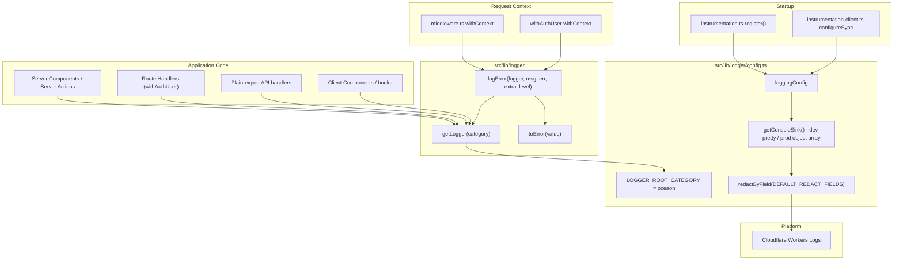

Structured, category-taxonomy-based logging built on [LogTape](https://logtape.org/), with a shared logger factory, mandatory error-wrapping helper, request-scoped ambient context, field-level redaction, and Cloudflare Workers Logs-aware sinks.

## Overview

The application never calls `console.*` directly. Every log record flows through a thin opinionated wrapper around LogTape that enforces four properties:

1. **One root category.** Every logger is created through `getLogger()` from `@/lib/logger`, which prepends `"ozeaon"` automatically. This guarantees a single stable namespace prefix in the log stream while allowing per-module second segments derived from the file's real path.
2. **Unknown-safe error logging.** A `catch` block in TypeScript `strict` mode types its binding as `unknown`. LogTape's native `Error` overloads require a real `Error` instance, so the project provides `toError()` for coercion and `logError()` for the common `{ error, ...extra }` shape.
3. **Ambient request context.** `withContext` from LogTape stamps `requestId`/`route`/`method` (and, inside `withAuthUser`, `userId`) onto every record emitted downstream — without threading parameters through the call stack.
4. **Redaction by default.** The only sink is wrapped in `redactByField(consoleSink, DEFAULT_REDACT_FIELDS)`, so known-sensitive field names are stripped before formatting, in every environment.

The design intent is explicitly *defensive layering*: redaction is a backstop against mistakes, not a licence to log secrets; `logError` exists so that error paths cannot silently coerce badly; and the production formatter deliberately avoids `getJsonLinesFormatter()` so that Cloudflare Workers Logs can decompose records into filterable dashboard fields.

## Architecture



### Helper Surface: `src/lib/logger/index.ts`

The public API is three functions ([source](https://github.com/ozeaon/ozeaon-v2/blob/0a4f1a95824db87782f1221a4108019d174df3d9/src/lib/logger/index.ts)):

- **`getLogger`** aliases LogTape's own `getLogger` and always prepends the root segment. Callers pass only relative segments (`["api", "organizations"]`); the `"ozeaon"` prefix can never be duplicated or omitted.
- **`toError`** handles four input shapes: a real `Error` passes through untouched; a non-null object is destructured for `message`, with all remaining own properties copied via `Object.assign` (preserving Supabase/PostgREST `code`/`details`/`hint` fields); `null` and primitives fall through to `new Error(String(value))`.
- **`logError`** coerces via `toError`, strips `error.stack` in production (size and leakage control), then calls `logger.error` or `logger.warn` with `{ error, ...extra }`.

### Production Formatter: The Most Consequential Line

`config.ts` ([source](https://github.com/ozeaon/ozeaon-v2/blob/0a4f1a95824db87782f1221a4108019d174df3d9/src/lib/logger/config.ts)) selects the formatter per environment. The production path returns an array containing one plain object:

```ts
formatter: (record) => [
  {
    level: record.level,
    category: record.category.join("."),
    message: record.rawMessage,
    timestamp: new Date(record.timestamp).toISOString(),
    ...record.properties,
  },
],
```

This shape is what Cloudflare Workers Logs needs to decompose records into filterable dashboard fields. A JSON *string* (from `getJsonLinesFormatter()`) is stored as one opaque text field and cannot be indexed. `record.rawMessage` rather than a formatted message keeps the message a plain string. The spread of `record.properties` after the four fixed keys means a logged property named `level`, `category`, `message`, or `timestamp` would silently override the structured field.

The dev formatter appends `record.properties` as a separate console argument using a manual `Object.keys(record.properties).length > 0` check in both `config.ts` and `client-config.ts`. Note: `docs/logging-conventions.md` records that this workaround was replaced by `@logtape/pretty`'s native `properties: true` option, but the code still uses the manual check — the conventions doc is out of sync.

### Startup Wiring

The server-side configuration is applied once per instance inside Next.js instrumentation ([`src/instrumentation.ts`](https://github.com/ozeaon/ozeaon-v2/blob/0a4f1a95824db87782f1221a4108019d174df3d9/src/instrumentation.ts)), using **dynamic `await import()`** rather than static imports — this keeps Node-only modules (`node:async_hooks`) off the hot path. The browser uses the synchronous counterpart, `configureSync(clientLoggingConfig)`, in [`src/instrumentation-client.ts`](https://github.com/ozeaon/ozeaon-v2/blob/0a4f1a95824db87782f1221a4108019d174df3d9/src/instrumentation-client.ts). `reset: true` on both configs makes `configure()` idempotent on repeated registration.

### Server vs Client Differences

[`client-config.ts`](https://github.com/ozeaon/ozeaon-v2/blob/0a4f1a95824db87782f1221a4108019d174df3d9/src/lib/logger/client-config.ts) differs from `config.ts` in four ways:

- **Production level floor:** server emits from `"info"` up; client emits from `"warning"` up — browser sessions generate high volume and most info-level events have no operational value from a client.
- **Production formatter:** server spreads `record.properties` *into* one object; client uses `jsonFormatter(record)` for the base fields then pushes the properties object as a *second* console argument.
- **Redaction:** server wraps the sink in `redactByField`; client does not — client logs carry less sensitive server-side state.
- **Dev colors:** both use `{ icons: false, align: false }` for stable output; client keeps `colors: true` since browser consoles are always live.

### Request-scoped Context

Two independent `withContext` entry points exist because middleware and API route handlers run in disjoint execution paths.

**Middleware** (`src/middleware.ts`) wraps every request in `withContext`, stamping `requestId` (fresh UUID), `route`, and `method` as ambient fields. Because middleware's `config.matcher` excludes `/api/*` entirely, this context *never* reaches API route handlers — it covers only page renders, Server Components, and Server Actions.

**`withAuthUser`** ([`src/lib/supabase/queries/auth.ts`](https://github.com/ozeaon/ozeaon-v2/blob/0a4f1a95824db87782f1221a4108019d174df3d9/src/lib/supabase/queries/auth.ts)) independently wraps every authenticated route handler with its own `withContext`, seeding all four fields. Its `requestId` is a fresh UUID — not inherited from middleware. `userId` is only ambient inside a `withAuthUser` handler; Server Actions and client code must pass it explicitly where it matters.

**Plain-export handlers** (public GETs, admin routes) get no ambient context from either source. They must pass `route` and `method` explicitly:

```ts
logError(logger, "Failed to retrieve object", error, {
  path: key,
  route: request.nextUrl.pathname,
  method: request.method,
});
```

Handlers typed with a plain `Request` (not `NextRequest`) must use `new URL(request.url).pathname` instead of `.nextUrl`.

### Category Taxonomy

Categories are derived mechanically from file location. Key rules ([`docs/logging-conventions.md`](https://github.com/ozeaon/ozeaon-v2/blob/0a4f1a95824db87782f1221a4108019d174df3d9/docs/logging-conventions.md)):

| Rule | Result |
|------|--------|
| Route groups are stripped, not renamed | `app/(main)/(feed)/page.tsx` → `["app", "feed"]` |
| Server Actions always use `["actions", X]` | Regardless of route group |
| Root-level files use `["app", "root"]` | `instrumentation.ts`, `middleware.ts`, `layout.tsx` |
| Two segments standard, third only for genuine sub-grouping | Avoids arbitrary depth |

`getLogger` from `@/lib/logger` prepends `"ozeaon"` automatically. Calling LogTape's own `getLogger` directly, or hardcoding the root segment, is banned — it would break the `"ozeaon"` prefix as a stream-level filter.

### Message and Level Conventions

`logError`'s level parameter is `"error" | "warning"`, where `"warning"` maps to LogTape's `warn`:

```ts
logger[level === "warning" ? "warn" : "error"](message, { error, ...extra });
```

Use `"warning"` for best-effort cleanup that does not change the response already sent (e.g. failing to delete an orphaned R2 object). That distinction matters once an alerting sink is added — it determines what pages an on-call engineer.

Messages must not interpolate variables. `logger.info("upload completed", { fileId, sizeBytes })` is correct; a template literal pushes values into the opaque `message` field where the Cloudflare dashboard cannot index them. Catch-block messages name the operation, not the route (`"Organisation member role update failed"` not `${method} ${path}`), since method and path are already structured fields.

## Redaction

`redactByField(consoleSink, DEFAULT_REDACT_FIELDS)` wraps the sink itself, so redaction applies in every environment before formatting. Two properties change how you read existing logs:

1. **Substring-based, not an exact-name allowlist.** The documented patterns are broad: `/auth/i`, `/email/i`, `/address/i`, `/private/i`. Field names such as `authorId`, `userEmail`, and `isPrivate` are silently redacted as collateral damage.
2. **A missing field does not prove it was never logged.** Any property containing those substrings is unreliable in the log output.

The design intent: treat redaction as a backstop against mistakes, not a substitute for not logging secrets. Passwords, tokens, API keys, and JWT values must never be placed into a logged properties object.

## Failure Modes & Edge Cases

| Concern | Behavior |
|---------|---------|
| `catch (error)` is `unknown` under `strict` | `logError` is required; a bare `logger.error(error)` fails to type-check or coerces badly |
| Non-`Error` object thrown | `toError` copies own properties; a non-string `message` becomes `JSON.stringify(value)`, which can be large |
| Circular object thrown | `JSON.stringify` would throw inside `toError` — unguarded edge case |
| Production stack leakage | Mitigated by `delete error.stack` in production |
| Collateral redaction | `authorId`, `userEmail`, `isPrivate` silently deleted by the substring patterns |
| Missing `userId` in Server Actions | Not ambient outside `withAuthUser`; must be passed explicitly or orphan sweeps lose their only key |
| `/api/*` has no ambient context | Middleware matcher excludes it; `withAuthUser` covers only wrapped handlers |
| ALS frame under Cloudflare `nodejs_compat` | Whether context survives `ctx.waitUntil()` is undocumented upstream — treat as unverified |

Concurrency: the ALS mechanism isolates each request's `withContext` scope per async execution, so interleaved requests never cross-contaminate `requestId`/`userId`. Because middleware and `withAuthUser` do not nest, the `requestId` in a `withAuthUser` log is not the same one middleware would have generated — they are two independent correlation spaces covering disjoint handler types.

## Operational Notes

### Cloudflare Workers Logs Characteristics

| Property | Value | Implication |
|----------|-------|-------------|
| Max size per log entry | 256 KB | Combined with `depth: 1` inspection and stack stripping |
| Retention | 3 days (Free) / 7 days (Paid) | Longer retention requires Logpush, which is not set up |
| Account-wide volume | ~5 billion logs/day before 1% auto-sampling | `observability.logs.head_sampling_rate` is the proactive per-Worker lever |
| Correlation | App-supplied `requestId` | Cloudflare's Ray ID is not guaranteed unique and cannot substitute |

### Why the Production Formatter Returns an Array, Not JSON

`getConsoleSink` takes the multi-argument `console[method](...args)` path — the one Workers Logs can decompose into filterable fields — only when the formatter returns an **array** rather than a string. Swapping to `getJsonLinesFormatter()` for convenience would silently defeat field extraction in the dashboard while appearing to work locally.

### Why `console.*` Is Banned

`no-console` is enforced project-wide as its own top-level block in `eslint.config.mjs`. Direct `console.*` bypasses redaction, the root category, level floors, and the Workers-Logs-compatible object shape simultaneously — so it must be structurally impossible, not merely discouraged. The block is deliberately not folded into the existing `.tsx`-only merge block, which has a pre-existing bug where only the last spread takes effect.

### Rejected Approaches

| Approach | Verdict | Reason |
|----------|---------|--------|
| Wrapping the Cloudflare `export default { fetch }` handler | Rejected | No such handler exists in app code — OpenNext generates it as build output |
| Cloudflare Tail Workers | Rejected | Post-hoc sink only; cannot inject context into an in-flight request |
| Standard Next.js hooks | Adopted | `middleware.ts` per request, `instrumentation.ts` once per instance, `onRequestError()` for errors |

## Extension Points

The following are planned additions, not built today:

- **Sentry/OTel sink** — add a second sink to `loggingConfig.sinks` and reference it from relevant logger entries. Category taxonomy and `logError`/context plumbing need no changes. Requires adding a matching `dispose()`/`disposeSync()` call at the same time — no such call exists today, which is safe only because `getConsoleSink()` requires no draining. Adding a stream or async sink without `dispose()` will silently drop pending writes when a Worker instance is torn down.
- **Client → server journey tracing** — generate a client-side session id, thread it through `fetch` as a header, and merge it into `withContext` on arrival. `requestId` is the future join key.
- **API route request context** — wrap each plain-export API handler in its own `withContext`, mirroring `withAuthUser`. Approximately 30 files; deferred until a concrete need justifies it.
- **Shared `timed()`** — extract the inline pattern from `src/app/api/projects/[id]/image/route.ts` into `@/lib/logger`, emitting a `Server-Timing` mark and a `logger.warn` when a duration threshold is exceeded.

## Related Links

- [`src/lib/logger/index.ts`](https://github.com/ozeaon/ozeaon-v2/blob/0a4f1a95824db87782f1221a4108019d174df3d9/src/lib/logger/index.ts) — `getLogger`, `toError`, `logError`
- [`src/lib/logger/config.ts`](https://github.com/ozeaon/ozeaon-v2/blob/0a4f1a95824db87782f1221a4108019d174df3d9/src/lib/logger/config.ts) — root category, sinks, formatters, redaction, `loggingConfig`
- [`src/lib/logger/client-config.ts`](https://github.com/ozeaon/ozeaon-v2/blob/0a4f1a95824db87782f1221a4108019d174df3d9/src/lib/logger/client-config.ts) — `clientLoggingConfig` for the browser runtime
- [`src/instrumentation.ts`](https://github.com/ozeaon/ozeaon-v2/blob/0a4f1a95824db87782f1221a4108019d174df3d9/src/instrumentation.ts) — server startup `configure()`
- [`src/instrumentation-client.ts`](https://github.com/ozeaon/ozeaon-v2/blob/0a4f1a95824db87782f1221a4108019d174df3d9/src/instrumentation-client.ts) — browser `configureSync()`
- [`src/middleware.ts`](https://github.com/ozeaon/ozeaon-v2/blob/0a4f1a95824db87782f1221a4108019d174df3d9/src/middleware.ts) — page-route `withContext` and `/api/*` matcher exclusion
- [`src/lib/supabase/queries/auth.ts`](https://github.com/ozeaon/ozeaon-v2/blob/0a4f1a95824db87782f1221a4108019d174df3d9/src/lib/supabase/queries/auth.ts) — `withAuthUser` `withContext`
- [`eslint.rules.logging.mjs`](https://github.com/ozeaon/ozeaon-v2/blob/0a4f1a95824db87782f1221a4108019d174df3d9/eslint.rules.logging.mjs) — logging lint rules
- [`docs/logging-conventions.md`](https://github.com/ozeaon/ozeaon-v2/blob/0a4f1a95824db87782f1221a4108019d174df3d9/docs/logging-conventions.md) — authoritative conventions, limits, and deferred extension points
- For HTTP error-response shaping and status mapping, see [API Routes](../../api-layer/api-routes/) and [Server Actions & Queries](../../api-layer/server-actions-and-queries/).
- For authentication flows producing `userId` context, see [Auth Flows](../../auth-and-accounts/auth-flows/).
- For the moderation-specific logging wrapper (`src/lib/moderation/log.ts`), see [Moderation](../../moderation-and-storage/moderation/).
