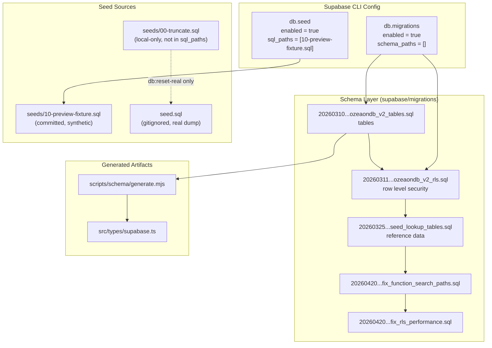
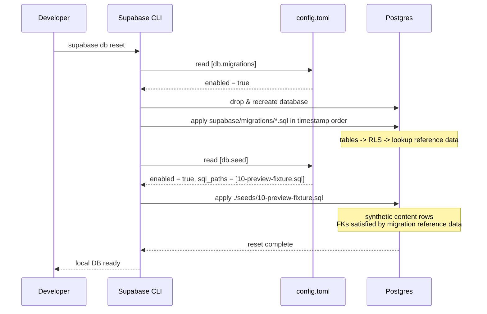
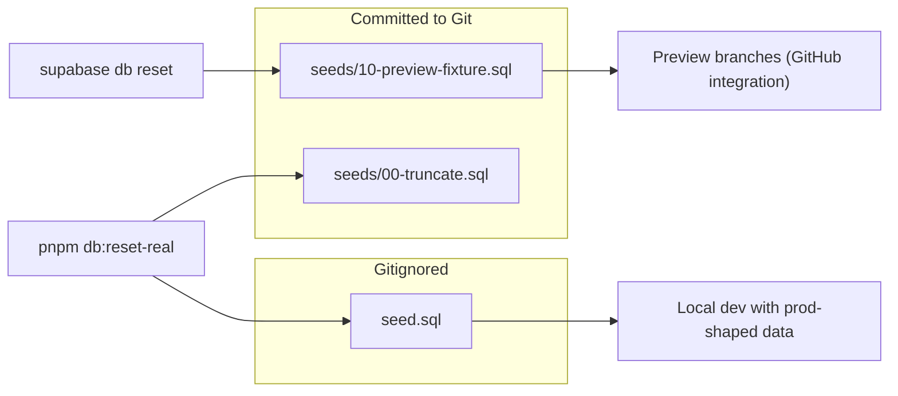
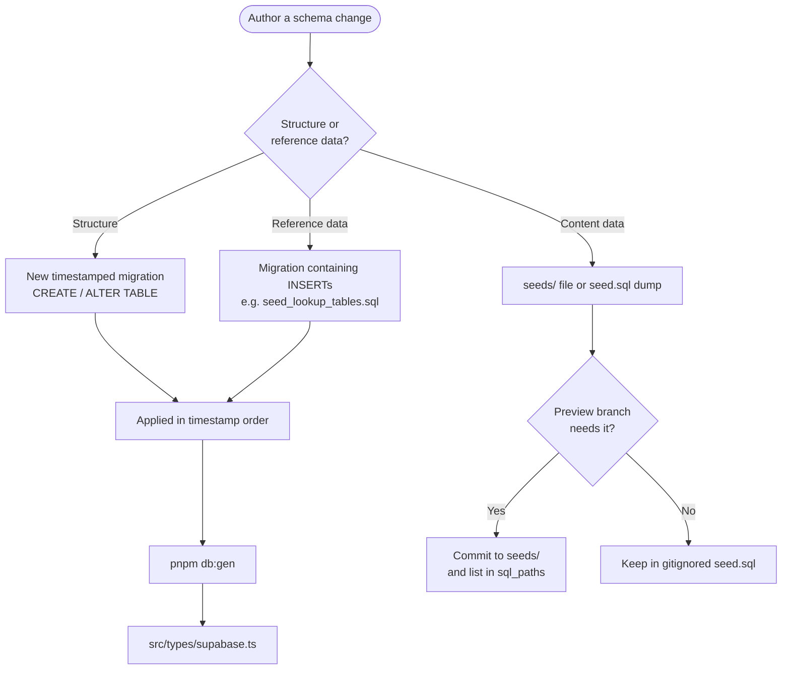

How Ozeaon's Supabase schema evolves over time through ordered SQL migrations, and how the database is populated with reference data, synthetic preview fixtures, and real-data dumps.

## Purpose and Scope

This page documents the database lifecycle management subsystem of Ozeaon: the ordered migration history under `supabase/migrations/`, the seeding configuration in `supabase/config.toml`, the `seed.sql` / `seeds/` split, and the `pnpm db:*` scripts that drive them.

It covers:

- The `[db.migrations]` and `[db.seed]` configuration blocks in [`supabase/config.toml`](https://github.com/ozeaon/ozeaon-v2/blob/0a4f1a95824db87782f1221a4108019d174df3d9/supabase/config.toml#L51-L73).
- The migration file naming convention and ordering semantics.
- A chronological catalog of the full migration history beyond the foundation files, with the consequential migrations covered in depth.
- The distinction between the *synthetic* preview fixture and the *real-data* dump, and why they are deliberately separated.
- The `db:schema`, `db:types`, `db:gen`, `db:seed-dump`, and `db:reset-real` scripts in [`package.json`](https://github.com/ozeaon/ozeaon-v2/blob/0a4f1a95824db87782f1221a4108019d174df3d9/package.json#L23-L27).
- How migrations interact with preview deployments and the `db-trigger` security convention.

Related operational topics — app deployment, preview environments, and CI — are covered by sibling pages in `10-operations/`. Backend code that consumes the generated types is documented under the application/data-access pages.

## Overview

Ozeaon's data layer is a hosted Supabase Postgres instance. There is no ORM-managed schema and no code-first migration generator: the schema is defined exclusively by an ordered, append-only list of SQL migration files under [`supabase/migrations/`](https://github.com/ozeaon/ozeaon-v2/blob/0a4f1a95824db87782f1221a4108019d174df3d9/supabase/migrations). Supabase applies them in lexicographic order of their timestamp prefix, so the filename encodes both the authoring time and the ordering contract.

Alongside the schema, the repository maintains **two distinct data populations**:

1. **Migration-embedded reference data** — lookup tables such as `member_roles`, `sdgs`, `article_types`, `resource_categories`, and `project_types` are created and populated directly inside migrations (see [`20260325000000_seed_lookup_tables.sql`](https://github.com/ozeaon/ozeaon-v2/blob/0a4f1a95824db87782f1221a4108019d174df3d9/supabase/migrations/20260325000000_seed_lookup_tables.sql)). Because these rows ship with the schema, every environment — local, preview, and production — gets them automatically.
2. **Data seeds** — the local seed pipeline, split between a committable **synthetic fixture** (`supabase/seeds/10-preview-fixture.sql`) and a gitignored **real-data dump** (`supabase/seed.sql`).

The core design intent, stated directly in the config comments, is that migrations own *structure and reference data*, while seeds own *content data*. The synthetic fixture exists so that environments which cannot see the gitignored real dump (notably Supabase preview branches built by the GitHub integration) still come up with usable, referential-integrity-respecting content.

## Architecture



**Why this shape.** The migration subgraph is a strict linear chain because Supabase migrations are order-dependent: `ozeaondb_v2_tables.sql` must land before `ozeaondb_v2_rls.sql`, because RLS policies reference tables that must already exist. The later `fix_*` migrations are corrective, applied last so they can override earlier definitions of functions and policies. The seed side branches into two independent sources keyed by *environment capability*: the fixture is committed (always available), the dump is gitignored (only available where a developer or CI job generates it), and `00-truncate.sql` is deliberately excluded from normal resets to preserve migration-created reference data.

## Migration Configuration

Migration behavior is configured in [`supabase/config.toml`](https://github.com/ozeaon/ozeaon-v2/blob/0a4f1a95824db87782f1221a4108019d174df3d9/supabase/config.toml#L51-L56).

```toml
[db.migrations]
# If disabled, migrations will be skipped during a db push or reset.
enabled = true
# Specifies an ordered list of schema files that describe your database.
# Supports glob patterns relative to supabase directory: "./schemas/*.sql"
schema_paths = []
```

> Source: [config.toml](https://github.com/ozeaon/ozeaon-v2/blob/0a4f1a95824db87782f1221a4108019d174df3d9/supabase/config.toml#L51-L56)

| Option | Type | Default | Description |
|--------|------|---------|-------------|
| `db.migrations.enabled` | boolean | `true` | When `true`, migrations run during `supabase db push` and `supabase db reset`. Setting this to `false` skips schema evolution entirely — useful only for debugging. |
| `db.migrations.schema_paths` | string array | `[]` | Optional declarative-schema glob list. Left empty here, which means the project is **migration-first**, not declarative-schema-first. Leaving it empty is intentional: authoritative schema changes must arrive as timestamped migration files so that history stays reproducible. |

The empty `schema_paths` value is a meaningful design decision rather than an omission. Supabase supports two schema modes: declarative (`schema_paths` globs that are diffed into migrations) and imperative (hand-written migration files). By leaving the list empty, Ozeaon commits to the imperative mode, which is what makes the security conventions embedded in migration history — `SECURITY DEFINER`, explicit `search_path`, and revoked grants — auditable and reviewable as code. [`CLAUDE.md`](https://github.com/ozeaon/ozeaon-v2/blob/0a4f1a95824db87782f1221a4108019d174df3d9/CLAUDE.md#L215-L217) documents this convention explicitly, directing authors to the `db-trigger` skill rather than hand-rolling trigger functions from memory.

## Migration Naming and Ordering

Migration files under [`supabase/migrations/`](https://github.com/ozeaon/ozeaon-v2/blob/0a4f1a95824db87782f1221a4108019d174df3d9/supabase/migrations) follow the Supabase timestamp convention:

```
YYYYMMDDHHMMSS_description.sql
```

Examples from the repository:

| Migration | Purpose (from filename) |
|-----------|------------------------|
| [`20260224141918_remote_schema.sql`](https://github.com/ozeaon/ozeaon-v2/blob/0a4f1a95824db87782f1221a4108019d174df3d9/supabase/migrations/20260224141918_remote_schema.sql) | Initial import of the remote schema |
| [`20260224142212_remote_schema.sql`](https://github.com/ozeaon/ozeaon-v2/blob/0a4f1a95824db87782f1221a4108019d174df3d9/supabase/migrations/20260224142212_remote_schema.sql) | Follow-up remote schema import |
| [`20260310232125_ozeaondb_v2_tables.sql`](https://github.com/ozeaon/ozeaon-v2/blob/0a4f1a95824db87782f1221a4108019d174df3d9/supabase/migrations/20260310232125_ozeaondb_v2_tables.sql) | Core `ozeaondb_v2` table definitions |
| [`20260311112434_ozeaondb_v2_rls.sql`](https://github.com/ozeaon/ozeaon-v2/blob/0a4f1a95824db87782f1221a4108019d174df3d9/supabase/migrations/20260311112434_ozeaondb_v2_rls.sql) | Row Level Security policies for those tables |
| [`20260313000000_reconcile_stats_function.sql`](https://github.com/ozeaon/ozeaon-v2/blob/0a4f1a95824db87782f1221a4108019d174df3d9/supabase/migrations/20260313000000_reconcile_stats_function.sql) | Statistics reconciliation function |
| [`20260323000000_move_view_count.sql`](https://github.com/ozeaon/ozeaon-v2/blob/0a4f1a95824db87782f1221a4108019d174df3d9/supabase/migrations/20260323000000_move_view_count.sql) | Relocates view-count storage |
| [`20260325000000_seed_lookup_tables.sql`](https://github.com/ozeaon/ozeaon-v2/blob/0a4f1a95824db87782f1221a4108019d174df3d9/supabase/migrations/20260325000000_seed_lookup_tables.sql) | Reference/lookup data seeding |
| [`20260328000000_articles_full_schema.sql`](https://github.com/ozeaon/ozeaon-v2/blob/0a4f1a95824db87782f1221a4108019d174df3d9/supabase/migrations/20260328000000_articles_full_schema.sql) | Full articles schema |
| [`20260414000000_project_faqs.sql`](https://github.com/ozeaon/ozeaon-v2/blob/0a4f1a95824db87782f1221a4108019d174df3d9/supabase/migrations/20260414000000_project_faqs.sql) | Project FAQs |
| [`20260414000001_project_team.sql`](https://github.com/ozeaon/ozeaon-v2/blob/0a4f1a95824db87782f1221a4108019d174df3d9/supabase/migrations/20260414000001_project_team.sql) | Project team members |
| [`20260414000002_documents.sql`](https://github.com/ozeaon/ozeaon-v2/blob/0a4f1a95824db87782f1221a4108019d174df3d9/supabase/migrations/20260414000002_documents.sql) | Documents |
| [`20260414000003_project_related_content.sql`](https://github.com/ozeaon/ozeaon-v2/blob/0a4f1a95824db87782f1221a4108019d174df3d9/supabase/migrations/20260414000003_project_related_content.sql) | Project related content |
| [`20260414000004_project_settings_constraints.sql`](https://github.com/ozeaon/ozeaon-v2/blob/0a4f1a95824db87782f1221a4108019d174df3d9/supabase/migrations/20260414000004_project_settings_constraints.sql) | Project settings constraints |
| [`20260420000001_fix_function_search_paths.sql`](https://github.com/ozeaon/ozeaon-v2/blob/0a4f1a95824db87782f1221a4108019d174df3d9/supabase/migrations/20260420000001_fix_function_search_paths.sql) | Security hardening: function `search_path` |
| [`20260420000002_fix_rls_performance.sql`](https://github.com/ozeaon/ozeaon-v2/blob/0a4f1a95824db87782f1221a4108019d174df3d9/supabase/migrations/20260420000002_fix_rls_performance.sql) | RLS performance corrections |

Two conventions are visible here. First, migration timestamps are **manually spaced** (`20260414000000`, `...000001`, `...000002`…) when several related migrations land together, which guarantees a deterministic order for a logical batch. Second, **corrective migrations never edit history**: [`20260420000001_fix_function_search_paths.sql`](https://github.com/ozeaon/ozeaon-v2/blob/0a4f1a95824db87782f1221a4108019d174df3d9/supabase/migrations/20260420000001_fix_function_search_paths.sql) and [`20260420000002_fix_rls_performance.sql`](https://github.com/ozeaon/ozeaon-v2/blob/0a4f1a95824db87782f1221a4108019d174df3d9/supabase/migrations/20260420000002_fix_rls_performance.sql) were appended rather than modifying the original `ozeaondb_v2_rls.sql`. This preserves the rule that a migration file is immutable once applied, so environments at any point in history converge on the same schema.

## Migration Catalog

The migration history has grown well past the foundation files. The fifteen migrations introduced in [Migration Naming and Ordering](#migration-naming-and-ordering) — the two remote-schema imports, the core `ozeaondb_v2` tables and RLS, the lookup seed, and the first corrective wave — are the base layer; this catalog covers the remaining 65 migrations chronologically, grouped by era. Dates are taken from the timestamp prefix.

### Articles: schema evolution (March–April 2026)

| Migration | Date | What it does |
|-----------|------|--------------|
| [`20260327222422_articles_update.sql`](https://github.com/ozeaon/ozeaon-v2/blob/0a4f1a95824db87782f1221a4108019d174df3d9/supabase/migrations/20260327222422_articles_update.sql) | 2026-03-27 | Creates the `access_levels` and `license_types` lookup tables (public read), adds `access_level_id`, `license_type_id` and `abstract` to `articles`, and creates the ORCID-validated, order-aware `article_authors` table. |
| [`20260327222907_articles_categories.sql`](https://github.com/ozeaon/ozeaon-v2/blob/0a4f1a95824db87782f1221a4108019d174df3d9/supabase/migrations/20260327222907_articles_categories.sql) | 2026-03-27 | Creates the `article_categories` / `article_subcategories` junction tables against the resource category lookups, with composite primary keys and article-owner RLS. |
| [`20260331104653_article_content_key.sql`](https://github.com/ozeaon/ozeaon-v2/blob/0a4f1a95824db87782f1221a4108019d174df3d9/supabase/migrations/20260331104653_article_content_key.sql) | 2026-03-31 | Moves article bodies out of the database: drops `articles.content` (destructive — existing values are lost) and adds `content_file_id` pointing at the R2-backed attachment row. |
| [`20260402000000_add_is_featured.sql`](https://github.com/ozeaon/ozeaon-v2/blob/0a4f1a95824db87782f1221a4108019d174df3d9/supabase/migrations/20260402000000_add_is_featured.sql) | 2026-04-02 | Renames `featured` to `is_featured` on `articles`, `projects` and `resource_subjects`; adds the column (with partial indexes) to `organizations` and `educational_resources`. |
| [`20260402123602_article_fields.sql`](https://github.com/ozeaon/ozeaon-v2/blob/0a4f1a95824db87782f1221a4108019d174df3d9/supabase/migrations/20260402123602_article_fields.sql) | 2026-04-02 | Drops `articles.excerpt` and adds `articles.language`. |
| [`20260421205300_article_author_role.sql`](https://github.com/ozeaon/ozeaon-v2/blob/0a4f1a95824db87782f1221a4108019d174df3d9/supabase/migrations/20260421205300_article_author_role.sql) | 2026-04-21 | Adds the `role` column (default `'Primary Author'`) to `article_authors`. |

### Organisations MVP (late April–May 2026)

| Migration | Date | What it does |
|-----------|------|--------------|
| [`20260428000000_orgs_schema.sql`](https://github.com/ozeaon/ozeaon-v2/blob/0a4f1a95824db87782f1221a4108019d174df3d9/supabase/migrations/20260428000000_orgs_schema.sql) | 2026-04-28 | The organisations MVP data structure: seeds `member_roles` and `organization_types`, extends `organizations`, creates `organization_links`, `organization_blocked_users`, `organization_audit_log` and `open_calls`, adds org attribution columns to posts and articles, and installs the single-owner and auto-follow triggers. |
| [`20260505000000_org_rls_permissions.sql`](https://github.com/ozeaon/ozeaon-v2/blob/0a4f1a95824db87782f1221a4108019d174df3d9/supabase/migrations/20260505000000_org_rls_permissions.sql) | 2026-05-05 | Aligns every organisation table's RLS with the permissions matrix: replaces the blanket FOR ALL owner policy with per-operation policies (create = creator, update = owner/admin, delete = owner) and gates slug changes behind a trigger. |
| [`20260505000001_org_transfer_ownership.sql`](https://github.com/ozeaon/ozeaon-v2/blob/0a4f1a95824db87782f1221a4108019d174df3d9/supabase/migrations/20260505000001_org_transfer_ownership.sql) | 2026-05-05 | Adds the `transfer_org_ownership()` RPC, which demotes the caller to admin before promoting the new owner so the single-owner trigger passes. |
| [`20260518000003_simplify_org_invites.sql`](https://github.com/ozeaon/ozeaon-v2/blob/0a4f1a95824db87782f1221a4108019d174df3d9/supabase/migrations/20260518000003_simplify_org_invites.sql) | 2026-05-18 | Simplifies `organization_invites` to an in-app flow: drops the email-link columns (`invitee_email`, `token`, `expires_at`), makes `invitee_user_id` NOT NULL, and adds a partial unique index on pending invites. |
| [`20260520000000_organization_add_member_triggers.sql`](https://github.com/ozeaon/ozeaon-v2/blob/0a4f1a95824db87782f1221a4108019d174df3d9/supabase/migrations/20260520000000_organization_add_member_triggers.sql) | 2026-05-20 | Makes `organization_members` the first-class entity: an AFTER INSERT trigger marks the pending invite accepted or the join request approved, and the join-request audit columns are renamed. |
| [`20260528000000_protect_last_org_admin.sql`](https://github.com/ozeaon/ozeaon-v2/blob/0a4f1a95824db87782f1221a4108019d174df3d9/supabase/migrations/20260528000000_protect_last_org_admin.sql) | 2026-05-28 | Adds a trigger that blocks demoting the last admin of an organisation, raising a custom SQLSTATE the API maps to a 409. |
| [`20260602000000_add_org_coordinates.sql`](https://github.com/ozeaon/ozeaon-v2/blob/0a4f1a95824db87782f1221a4108019d174df3d9/supabase/migrations/20260602000000_add_org_coordinates.sql) | 2026-06-02 | Adds the `coordinates` point column to `organizations`. |

### Security hardening (May 2026)

| Migration | Date | What it does |
|-----------|------|--------------|
| [`20260505120000_security_warnings.sql`](https://github.com/ozeaon/ozeaon-v2/blob/0a4f1a95824db87782f1221a4108019d174df3d9/supabase/migrations/20260505120000_security_warnings.sql) | 2026-05-05 | Clears 282 Supabase linter warnings: pins `search_path` on the org triggers, revokes EXECUTE on `graphql.resolve`, and revokes anon/authenticated EXECUTE on trigger and admin functions. |
| [`20260505130000_fix_public_execute_grants.sql`](https://github.com/ozeaon/ozeaon-v2/blob/0a4f1a95824db87782f1221a4108019d174df3d9/supabase/migrations/20260505130000_fix_public_execute_grants.sql) | 2026-05-05 | Fixes the remaining 278: the previous revokes were no-ops while PUBLIC still held Postgres' default EXECUTE grant, so this revokes from PUBLIC and re-grants the user-facing action functions to authenticated. |
| [`20260505140000_drop_pg_graphql.sql`](https://github.com/ozeaon/ozeaon-v2/blob/0a4f1a95824db87782f1221a4108019d174df3d9/supabase/migrations/20260505140000_drop_pg_graphql.sql) | 2026-05-05 | Drops the `pg_graphql` extension CASCADE — the app is REST-only — removing 218 GraphQL schema-exposure warnings. |
| [`20260505150000_rls_helpers_to_private_schema.sql`](https://github.com/ozeaon/ozeaon-v2/blob/0a4f1a95824db87782f1221a4108019d174df3d9/supabase/migrations/20260505150000_rls_helpers_to_private_schema.sql) | 2026-05-05 | Moves the RLS helpers `is_blocked_pair`, `are_connected` and `get_user_visibility` into a new `private` schema and recreates the ten policies that referenced them. |

### Images, documents, and content plumbing (May 2026)

| Migration | Date | What it does |
|-----------|------|--------------|
| [`20260430104609_article_images_documents.sql`](https://github.com/ozeaon/ozeaon-v2/blob/0a4f1a95824db87782f1221a4108019d174df3d9/supabase/migrations/20260430104609_article_images_documents.sql) | 2026-04-30 | Creates the `article_images` and `article_documents` junctions with owner-scoped RLS, adds `articles.doi`, repoints `content_file_id` at `documents`, and drops `article_attachments`. |
| [`20260504121711_image_constraints.sql`](https://github.com/ozeaon/ozeaon-v2/blob/0a4f1a95824db87782f1221a4108019d174df3d9/supabase/migrations/20260504121711_image_constraints.sql) | 2026-05-04 | Rebuilds every image foreign key across seven tables as `ON DELETE SET NULL`, so removing an image never cascades into content. |
| [`20260505022307_images_file_size_bytes_column.sql`](https://github.com/ozeaon/ozeaon-v2/blob/0a4f1a95824db87782f1221a4108019d174df3d9/supabase/migrations/20260505022307_images_file_size_bytes_column.sql) | 2026-05-05 | Adds `images.file_size_bytes`. |
| [`20260506000001_project_section_types_sort_and_image.sql`](https://github.com/ozeaon/ozeaon-v2/blob/0a4f1a95824db87782f1221a4108019d174df3d9/supabase/migrations/20260506000001_project_section_types_sort_and_image.sql) | 2026-05-06 | Adds `sort_order` to `project_section_types` with canonical values, adds `image_id` to `project_sections`, and lets users manage their own custom section types. |
| [`20260507000000_add_organization_id_to_content_tables.sql`](https://github.com/ozeaon/ozeaon-v2/blob/0a4f1a95824db87782f1221a4108019d174df3d9/supabase/migrations/20260507000000_add_organization_id_to_content_tables.sql) | 2026-05-07 | Adds `organization_id` to `articles` and every comment/reaction table for org-mode attribution. |
| [`20260507000001_drop_project_participants.sql`](https://github.com/ozeaon/ozeaon-v2/blob/0a4f1a95824db87782f1221a4108019d174df3d9/supabase/migrations/20260507000001_drop_project_participants.sql) | 2026-05-07 | Removes `project_participants` in favour of `project_team`: renames the stat to `team_count`, rebuilds the stats trigger, and drops the table CASCADE. |
| [`20260511000000_projects_linked_organization_id.sql`](https://github.com/ozeaon/ozeaon-v2/blob/0a4f1a95824db87782f1221a4108019d174df3d9/supabase/migrations/20260511000000_projects_linked_organization_id.sql) | 2026-05-11 | Adds `projects.linked_organization_id` as a pure association carrying no permissions, and rewrites the org `project_count` trigger to count by it. |
| [`20260518000000_add_engagement_score_to_stats_tables.sql`](https://github.com/ozeaon/ozeaon-v2/blob/0a4f1a95824db87782f1221a4108019d174df3d9/supabase/migrations/20260518000000_add_engagement_score_to_stats_tables.sql) | 2026-05-18 | Adds a generated, indexed `engagement_score` to the three stats tables (comments ×40, reactions ×10, views ×1; reposts ×30 on posts). |
| [`20260518000001_article_image_type.sql`](https://github.com/ozeaon/ozeaon-v2/blob/0a4f1a95824db87782f1221a4108019d174df3d9/supabase/migrations/20260518000001_article_image_type.sql) | 2026-05-18 | Adds the `article_image_type` enum and an `image_type` column distinguishing content images from attachments. |
| [`20260518000002_documents_update_policy.sql`](https://github.com/ozeaon/ozeaon-v2/blob/0a4f1a95824db87782f1221a4108019d174df3d9/supabase/migrations/20260518000002_documents_update_policy.sql) | 2026-05-18 | Adds the documents UPDATE policy (uploader-only) whose absence silently made content autosave a no-op. |

### Fields, profiles, and environment sync (June–July 2026)

| Migration | Date | What it does |
|-----------|------|--------------|
| [`20260610000000_add_project_contact_fields.sql`](https://github.com/ozeaon/ozeaon-v2/blob/0a4f1a95824db87782f1221a4108019d174df3d9/supabase/migrations/20260610000000_add_project_contact_fields.sql) | 2026-06-10 | Adds `contact_email`, `website_url` and `contact_is_public` to projects and flips the `comments_enabled` default to false. |
| [`20260610121400_articles_add_country_and_pdf_fk.sql`](https://github.com/ozeaon/ozeaon-v2/blob/0a4f1a95824db87782f1221a4108019d174df3d9/supabase/migrations/20260610121400_articles_add_country_and_pdf_fk.sql) | 2026-06-10 | Adds `geographic_scope_country` and `pdf_file_id`, drops `thumbnail_image_id`, and backfills `pdf_file_id` from `article_documents` (deleting the migrated rows). |
| [`20260610121500_function_fix.sql`](https://github.com/ozeaon/ozeaon-v2/blob/0a4f1a95824db87782f1221a4108019d174df3d9/supabase/migrations/20260610121500_function_fix.sql) | 2026-06-10 | Recreates `prevent_image_deletion_if_referenced()` with a pinned `search_path` and an updated reference count. |
| [`20260622111000_add_user_profile_role_descriptor.sql`](https://github.com/ozeaon/ozeaon-v2/blob/0a4f1a95824db87782f1221a4108019d174df3d9/supabase/migrations/20260622111000_add_user_profile_role_descriptor.sql) | 2026-06-22 | Adds `user_profiles.role_descriptor` in three steps: nullable column, backfill `'Member'`, then NOT NULL. |
| [`20260623120000_profile_settings.sql`](https://github.com/ozeaon/ozeaon-v2/blob/0a4f1a95824db87782f1221a4108019d174df3d9/supabase/migrations/20260623120000_profile_settings.sql) | 2026-06-23 | Adds `github_url` to profiles and creates the `user_links` table with owner-scoped RLS. |
| [`20260626211000_project_team_unique_member.sql`](https://github.com/ozeaon/ozeaon-v2/blob/0a4f1a95824db87782f1221a4108019d174df3d9/supabase/migrations/20260626211000_project_team_unique_member.sql) | 2026-06-26 | Deduplicates `project_team` (keeping the earliest row) and adds a partial unique index so a registered user can only appear once per team; external members without accounts stay unconstrained. |
| [`20260701114041_remote_schema.sql`](https://github.com/ozeaon/ozeaon-v2/blob/0a4f1a95824db87782f1221a4108019d174df3d9/supabase/migrations/20260701114041_remote_schema.sql) | 2026-07-01 | Re-asserts the full grant surface — 576 GRANT statements plus column comments — pulled from the live environment. |
| [`20260701114042_allow_invitee_and_requester_self_actions.sql`](https://github.com/ozeaon/ozeaon-v2/blob/0a4f1a95824db87782f1221a4108019d174df3d9/supabase/migrations/20260701114042_allow_invitee_and_requester_self_actions.sql) | 2026-07-01 | Lets invitees accept or decline their own invites and requesters cancel their own join requests, which RLS previously blocked; an invitee's role is pinned to the invite's. |
| [`20260703000000_grant_v_project_status_select.sql`](https://github.com/ozeaon/ozeaon-v2/blob/0a4f1a95824db87782f1221a4108019d174df3d9/supabase/migrations/20260703000000_grant_v_project_status_select.sql) | 2026-07-03 | Grants SELECT on the `security_invoker` view `v_project_status` to anon and authenticated so public feeds can resolve derived project status. |
| [`20260707000000_realtime_comments_publication.sql`](https://github.com/ozeaon/ozeaon-v2/blob/0a4f1a95824db87782f1221a4108019d174df3d9/supabase/migrations/20260707000000_realtime_comments_publication.sql) | 2026-07-07 | Adds the three comment tables to the `supabase_realtime` publication for CommentThread subscriptions, guarded to be a no-op if already present. |
| [`20260707113304_article_summary_constraint.sql`](https://github.com/ozeaon/ozeaon-v2/blob/0a4f1a95824db87782f1221a4108019d174df3d9/supabase/migrations/20260707113304_article_summary_constraint.sql) | 2026-07-07 | Backfills missing summaries (from `abstract`, then `title`) and makes `articles.summary` NOT NULL. |
| [`20260707180506_article_external_publish_url.sql`](https://github.com/ozeaon/ozeaon-v2/blob/0a4f1a95824db87782f1221a4108019d174df3d9/supabase/migrations/20260707180506_article_external_publish_url.sql) | 2026-07-07 | Adds `articles.external_publish_url`. |
| [`20260714171240_default_verified_org.sql`](https://github.com/ozeaon/ozeaon-v2/blob/0a4f1a95824db87782f1221a4108019d174df3d9/supabase/migrations/20260714171240_default_verified_org.sql) | 2026-07-14 | Stopgap ahead of real verification: marks every organisation verified and makes the column NOT NULL defaulting to true. |
| [`20260714174218_ensure_has_custom_license_type.sql`](https://github.com/ozeaon/ozeaon-v2/blob/0a4f1a95824db87782f1221a4108019d174df3d9/supabase/migrations/20260714174218_ensure_has_custom_license_type.sql) | 2026-07-14 | Flags the `CUSTOM` license-type row as `is_custom`. |
| [`20260720164149_unverify_all_organizations.sql`](https://github.com/ozeaon/ozeaon-v2/blob/0a4f1a95824db87782f1221a4108019d174df3d9/supabase/migrations/20260720164149_unverify_all_organizations.sql) | 2026-07-20 | Reverses the stopgap: un-verifies all organisations and sets the default back to false. |

### Ownership, comments, and deletion (August 2026)

| Migration | Date | What it does |
|-----------|------|--------------|
| [`20260805125500_articles_org_member_authors_unpublished_select.sql`](https://github.com/ozeaon/ozeaon-v2/blob/0a4f1a95824db87782f1221a4108019d174df3d9/supabase/migrations/20260805125500_articles_org_member_authors_unpublished_select.sql) | 2026-08-05 | Lets org members read their organisation's unpublished articles, which previously only the writing author could see. |
| [`20260805223000_organization_article_count.sql`](https://github.com/ozeaon/ozeaon-v2/blob/0a4f1a95824db87782f1221a4108019d174df3d9/supabase/migrations/20260805223000_organization_article_count.sql) | 2026-08-05 | Denormalises a published-article counter onto `organizations`, maintained by a recompute-style trigger and backfilled for every organisation. |
| [`20260812000000_project_ownership.sql`](https://github.com/ozeaon/ozeaon-v2/blob/0a4f1a95824db87782f1221a4108019d174df3d9/supabase/migrations/20260812000000_project_ownership.sql) | 2026-08-12 | Moves projects onto an explicit, transferable owner: renames `created_by` to `owner_id`, adds an immutable `created_by_id` history column, enforces exclusive ownership (`owner_id` XOR `organization_id`), transfers an org's projects to a successor person on org deletion, and rewrites the thirteen child-table policies around the `can_manage_project` / `can_read_project` helpers. |
| [`20260812000001_extend_v_project_status.sql`](https://github.com/ozeaon/ozeaon-v2/blob/0a4f1a95824db87782f1221a4108019d174df3d9/supabase/migrations/20260812000001_extend_v_project_status.sql) | 2026-08-12 | Drops and recreates `v_project_status` to carry the full `projects` row alongside the computed lifecycle status, re-grants it, and adds a `(start_date, end_date)` index for the feed filters. |
| [`20260814000000_organizations_created_by_not_null.sql`](https://github.com/ozeaon/ozeaon-v2/blob/0a4f1a95824db87782f1221a4108019d174df3d9/supabase/migrations/20260814000000_organizations_created_by_not_null.sql) | 2026-08-14 | Makes `organizations.created_by` NOT NULL with no backfill, deliberately failing on null rows (reversed five days later). |
| [`20260815090000_consolidate_article_rls_policies.sql`](https://github.com/ozeaon/ozeaon-v2/blob/0a4f1a95824db87782f1221a4108019d174df3d9/supabase/migrations/20260815090000_consolidate_article_rls_policies.sql) | 2026-08-15 | Brings articles onto the projects ownership model (`author_id` XOR `organization_id`), adds four shared `private` RLS helpers, merges the author-only and org predicates into one permissive policy per action across articles and its seven child tables, and freezes article ownership with a trigger. |
| [`20260816000000_projects_blocking_and_shared_org_primitives.sql`](https://github.com/ozeaon/ozeaon-v2/blob/0a4f1a95824db87782f1221a4108019d174df3d9/supabase/migrations/20260816000000_projects_blocking_and_shared_org_primitives.sql) | 2026-08-16 | Rebuilds the project predicates on the shared `is_org_admin` primitive and adds the blocked-users veto projects were missing, as a RESTRICTIVE SELECT policy and inside `can_read_project`. |
| [`20260817000000_comments_spec_alignment.sql`](https://github.com/ozeaon/ozeaon-v2/blob/0a4f1a95824db87782f1221a4108019d174df3d9/supabase/migrations/20260817000000_comments_spec_alignment.sql) | 2026-08-17 | Aligns comments with the component spec: soft-deletion placeholders, two-level nesting with `reply_to_comment_id`, a deep-thread flattening backfill, `comments_enabled` on all three content types, and org-gated comment authoring. |
| [`20260819120000_deletion_cascades.sql`](https://github.com/ozeaon/ozeaon-v2/blob/0a4f1a95824db87782f1221a4108019d174df3d9/supabase/migrations/20260819120000_deletion_cascades.sql) | 2026-08-19 | Makes organisation and account deletion work end to end: org-owned content and acting-as-org interactions CASCADE, 30 `user_profiles` foreign keys get explicit actions, and the `delete_organization()` / `delete_user_account()` teardown RPCs collect R2 paths for bucket cleanup. |
| [`20260819120100_repost_link_on_delete.sql`](https://github.com/ozeaon/ozeaon-v2/blob/0a4f1a95824db87782f1221a4108019d174df3d9/supabase/migrations/20260819120100_repost_link_on_delete.sql) | 2026-08-19 | Switches the repost link `posts.post_tag` to `ON DELETE SET NULL` so teardowns no longer abort for exactly the accounts whose posts were reposted. |
| [`20260819120300_attachment_unavailable_markers.sql`](https://github.com/ozeaon/ozeaon-v2/blob/0a4f1a95824db87782f1221a4108019d174df3d9/supabase/migrations/20260819120300_attachment_unavailable_markers.sql) | 2026-08-19 | Adds four `*_unavailable` flags to posts plus a trigger that sets them when a deletion cascade nulls the corresponding tag, driving the feed's unavailable placeholder. |
| [`20260819120400_organizations_created_by_nullable.sql`](https://github.com/ozeaon/ozeaon-v2/blob/0a4f1a95824db87782f1221a4108019d174df3d9/supabase/migrations/20260819120400_organizations_created_by_nullable.sql) | 2026-08-19 | Reverts `created_by` to nullable: the deletion cascades changed its foreign key to SET NULL, invalidating the premise of the NOT NULL migration. |
| [`20260819120500_article_ownership_lock_allows_deletion.sql`](https://github.com/ozeaon/ozeaon-v2/blob/0a4f1a95824db87782f1221a4108019d174df3d9/supabase/migrations/20260819120500_article_ownership_lock_allows_deletion.sql) | 2026-08-19 | Carves the `created_by_id` clear-on-delete cascade out of the article ownership lock, mirroring the projects trigger. |
| [`20260824000000_drop_is_org_manager_duplicate.sql`](https://github.com/ozeaon/ozeaon-v2/blob/0a4f1a95824db87782f1221a4108019d174df3d9/supabase/migrations/20260824000000_drop_is_org_manager_duplicate.sql) | 2026-08-24 | Folds the duplicate `is_org_manager` helper (byte-identical to `is_org_admin`) into `can_author_as_organization` and rewrites its six live policies. |
| [`20260825000000_add_missing_categories_subcategories.sql`](https://github.com/ozeaon/ozeaon-v2/blob/0a4f1a95824db87782f1221a4108019d174df3d9/supabase/migrations/20260825000000_add_missing_categories_subcategories.sql) | 2026-08-25 | Brings the resource category tree in line with the category spec: renames one subcategory in place to preserve links, then upserts ten categories with their subcategories. |
| [`20260826000000_moderation_checks.sql`](https://github.com/ozeaon/ozeaon-v2/blob/0a4f1a95824db87782f1221a4108019d174df3d9/supabase/migrations/20260826000000_moderation_checks.sql) | 2026-08-26 | Builds the normalised moderation log: five enums, `moderation_attempts` / `moderation_checks` / `moderation_check_categories`, five target link tables, and a single-transaction `log_moderation_attempt()` writer. |
| [`20260826170000_alpha_badge_window.sql`](https://github.com/ozeaon/ozeaon-v2/blob/0a4f1a95824db87782f1221a4108019d174df3d9/supabase/migrations/20260826170000_alpha_badge_window.sql) | 2026-08-26 | Adds the Founding Member badge: a `has_alpha_badge` default driven by a `private` cutoff function (2026-12-02), a backfill of existing rows, and a trigger guard against self-granting once the window closes. |
| [`20260826170100_drop_unused_soft_delete_flags.sql`](https://github.com/ozeaon/ozeaon-v2/blob/0a4f1a95824db87782f1221a4108019d174df3d9/supabase/migrations/20260826170100_drop_unused_soft_delete_flags.sql) | 2026-08-26 | Drops the never-written `user_profiles.deleted_at` and the read-by-nothing `organizations.is_archived`. |
| [`20260831000000_org_admins_delete_org_posts.sql`](https://github.com/ozeaon/ozeaon-v2/blob/0a4f1a95824db87782f1221a4108019d174df3d9/supabase/migrations/20260831000000_org_admins_delete_org_posts.sql) | 2026-08-31 | Lets any org admin delete an org-authored post; previously RLS silently restricted deletion to the creating member. |

### Notifications (September 2026)

| Migration | Date | What it does |
|-----------|------|--------------|
| [`20260918000000_notifications_foundation.sql`](https://github.com/ozeaon/ozeaon-v2/blob/0a4f1a95824db87782f1221a4108019d174df3d9/supabase/migrations/20260918000000_notifications_foundation.sql) | 2026-09-18 | Replaces the never-used legacy notification tables with a new `notifications` table — per-account copies, snapshotted display values, typed subject foreign keys, `read_at` — plus a `notification_type` enum, the `v_notifications` destination view, and realtime publication. Clients get no INSERT path at all. |
| [`20260921000000_notifications_triggers.sql`](https://github.com/ozeaon/ozeaon-v2/blob/0a4f1a95824db87782f1221a4108019d174df3d9/supabase/migrations/20260921000000_notifications_triggers.sql) | 2026-09-21 | Adds the SECURITY DEFINER delivery helpers (single recipient, org fan-out, owner dispatch) and the AFTER triggers per catalogue family — posts, projects, articles, membership — which are the only write path. |
| [`20260922000000_notification_post_destinations.sql`](https://github.com/ozeaon/ozeaon-v2/blob/0a4f1a95824db87782f1221a4108019d174df3d9/supabase/migrations/20260922000000_notification_post_destinations.sql) | 2026-09-22 | Recreates `v_notifications` so post-backed notifications resolve `/posts/<id>` destinations now that a single-post route exists. |
| [`20260924000000_notifications_revoke_default_grants.sql`](https://github.com/ozeaon/ozeaon-v2/blob/0a4f1a95824db87782f1221a4108019d174df3d9/supabase/migrations/20260924000000_notifications_revoke_default_grants.sql) | 2026-09-24 | Revokes the default table privileges on `notifications` and grants only SELECT, DELETE and `UPDATE (read_at)`, so the column-level grant actually restricts. |

### Key Migrations in Depth

#### The organisations MVP — `20260428000000_orgs_schema.sql`

[`20260428000000_orgs_schema.sql`](https://github.com/ozeaon/ozeaon-v2/blob/0a4f1a95824db87782f1221a4108019d174df3d9/supabase/migrations/20260428000000_orgs_schema.sql) is the structural keystone of org mode. One transaction seeds the `member_roles` vocabulary (`owner` / `admin` / `member`), seeds fifteen `organization_types`, reshapes `organizations` for the MVP spec (adding `linkedin_url`, `contact_email`, `is_archived` and `has_alpha_badge` while dropping `founded_date` and `country`), and creates `organization_links`, `organization_blocked_users`, `organization_audit_log`, and `open_calls`. It also plants the attribution columns — `posts.organization_id` and `articles.published_by_org_id` — that let content be authored *as* an organisation while the acting user stays on their own column.

Two invariant triggers ship with it and every later org migration relies on them: `trg_enforce_single_owner` keeps exactly one owner per organisation at all times, and `trg_org_member_auto_follow` makes joining an org follow it. The permissions matrix, invite simplification, and ownership transfer documented below are all successive layers on this base.

#### The org permissions matrix — `20260505000000_org_rls_permissions.sql`

[`20260505000000_org_rls_permissions.sql`](https://github.com/ozeaon/ozeaon-v2/blob/0a4f1a95824db87782f1221a4108019d174df3d9/supabase/migrations/20260505000000_org_rls_permissions.sql) replaces the single FOR ALL owner policy with granular per-operation policies derived from the orgs spec: any authenticated user may create an organisation (`created_by = auth.uid()`), owners and admins may update it, and only the owner may delete it. Because Postgres has no column-level RLS, slug changes get their own trigger (`trg_protect_org_slug`) enforcing the owner-only rule inside the broader UPDATE policy. Twenty policies are dropped and twenty created; the same matrix is then applied across `organization_members`, invites, join requests, follows, blocks, and the audit log. Its recurring `organization_members ⋈ member_roles` join is the pattern that the August migrations later factor into shared `private` helpers.

#### The May security wave — four corrective migrations

Four migrations on 2026-05-05 form a single hardening arc, and their sequence is instructive. [`20260505120000_security_warnings.sql`](https://github.com/ozeaon/ozeaon-v2/blob/0a4f1a95824db87782f1221a4108019d174df3d9/supabase/migrations/20260505120000_security_warnings.sql) takes on 282 linter warnings by pinning `search_path` on the new org triggers and revoking EXECUTE from `anon`/`authenticated`. [`20260505130000_fix_public_execute_grants.sql`](https://github.com/ozeaon/ozeaon-v2/blob/0a4f1a95824db87782f1221a4108019d174df3d9/supabase/migrations/20260505130000_fix_public_execute_grants.sql) then corrects its predecessor: revoking from `anon`/`authenticated` is a no-op while PostgreSQL's default PUBLIC grant still stands, so the real fix is `REVOKE ... FROM PUBLIC` plus targeted re-grants. [`20260505140000_drop_pg_graphql.sql`](https://github.com/ozeaon/ozeaon-v2/blob/0a4f1a95824db87782f1221a4108019d174df3d9/supabase/migrations/20260505140000_drop_pg_graphql.sql) removes the unused `pg_graphql` extension outright (218 warnings gone; the app is REST-only). Finally [`20260505150000_rls_helpers_to_private_schema.sql`](https://github.com/ozeaon/ozeaon-v2/blob/0a4f1a95824db87782f1221a4108019d174df3d9/supabase/migrations/20260505150000_rls_helpers_to_private_schema.sql) moves `is_blocked_pair`, `are_connected`, and `get_user_visibility` into a new `private` schema — they are called only from RLS policies, never via RPC — and recreates the ten policies that referenced them. This is the same append-only corrective pattern as the April `fix_*` pair: hardening is iterative, and later migrations amend earlier ones without editing history.

#### Project ownership — `20260812000000_project_ownership.sql`

[`20260812000000_project_ownership.sql`](https://github.com/ozeaon/ozeaon-v2/blob/0a4f1a95824db87782f1221a4108019d174df3d9/supabase/migrations/20260812000000_project_ownership.sql) moves projects off "whoever inserted the row" onto an explicit, transferable owner. `created_by` becomes `owner_id` with `ON DELETE CASCADE` (personal projects die with the account — right to erasure), while a new `created_by_id` preserves the historical fact of creation under an immutability trigger. Ownership is made exclusive by `projects_single_owner_check`: exactly one of `owner_id` / `organization_id` is ever set. Deleting an organisation no longer destroys its projects — a BEFORE DELETE trigger hands them to a successor person, with the foreign key's SET NULL kept as a backstop. The thirteen child-table policies are rewritten around `private.can_manage_project()` / `private.can_read_project()`. The header also records a subtle reason the rename is safe: Postgres stores column references by attribute number, so the child policies survive the rename untouched.

#### Article RLS consolidation — `20260815090000_consolidate_article_rls_policies.sql`

[`20260815090000_consolidate_article_rls_policies.sql`](https://github.com/ozeaon/ozeaon-v2/blob/0a4f1a95824db87782f1221a4108019d174df3d9/supabase/migrations/20260815090000_consolidate_article_rls_policies.sql) gives articles the same ownership model projects received days earlier: `author_id` XOR `organization_id` enforced by a CHECK constraint, an immutable `created_by_id`, and four `private` helpers — `is_org_admin()` / `is_org_member()` as reusable org primitives, `can_manage_article()` / `can_read_article()` as the article predicates built on them. Every author-only and org predicate merges into one PERMISSIVE policy per action across `articles` and its seven child tables, resolving Supabase lint 0006 (Postgres ORs every PERMISSIVE policy for a role+action, so two policies cost two subquery evaluations per row for no behavioural gain). The migration also documents the bug it retires: the API layer's PATCH check verified only that the caller was *some* org, not *this* article's org with an owner/admin role — under- and over-permitting at once. `trg_lock_article_ownership` closes a hole RLS cannot express: an UPDATE is validated with USING against the old row but WITH CHECK against the new one, so without the trigger a single statement could detach an article from its org.

#### Shared primitives and the blocking gap — `20260816000000_projects_blocking_and_shared_org_primitives.sql`

[`20260816000000_projects_blocking_and_shared_org_primitives.sql`](https://github.com/ozeaon/ozeaon-v2/blob/0a4f1a95824db87782f1221a4108019d174df3d9/supabase/migrations/20260816000000_projects_blocking_and_shared_org_primitives.sql) completes the consolidation by rebuilding the project predicates on `is_org_admin()` and adding the blocked-users veto projects never had. Two details matter. First, the header counts eight hand-inlined copies of the owner/admin role check across migrations and application code and collapses them into one database definition, so a future role is granted in one place. Second, it explains why the veto must live twice: the child tables authorise through `can_read_project()`, which is SECURITY DEFINER and therefore bypasses the parent table's RESTRICTIVE policy — a veto stated only on `projects` would not reach the thirteen child tables, so it is folded into the helper as well.

#### Comments spec alignment — `20260817000000_comments_spec_alignment.sql`

[`20260817000000_comments_spec_alignment.sql`](https://github.com/ozeaon/ozeaon-v2/blob/0a4f1a95824db87782f1221a4108019d174df3d9/supabase/migrations/20260817000000_comments_spec_alignment.sql) reshapes all three comment tables to the component spec (CMP-001). Soft deletion arrives as `deleted_at` with placeholder retention — a comment with replies is kept as a stub rather than cascading its replies away. Nesting is capped at two levels: `parent_comment_id` always points at the Level 1 root, while the new `reply_to_comment_id` records the comment actually being answered so the "Reply to @username" label renders correctly; a recursive backfill flattens every pre-existing deeper thread. `posts.allow_comment` is renamed to `comments_enabled` and `articles` gains the same flag, so all three content types expose one toggle. It also narrows the `updated_at` triggers to fire only on content changes — placed deliberately before the backfill, or every migrated reply would render as "Edited" — and introduces `private.is_org_manager()` plus the `*_comments_open()` helpers to gate comment creation. (`is_org_manager` later proves byte-identical to `is_org_admin` and is deduplicated by [`20260824000000_drop_is_org_manager_duplicate.sql`](https://github.com/ozeaon/ozeaon-v2/blob/0a4f1a95824db87782f1221a4108019d174df3d9/supabase/migrations/20260824000000_drop_is_org_manager_duplicate.sql).)

#### Deletion cascades — `20260819120000_deletion_cascades.sql` and its four same-day follow-ups

[`20260819120000_deletion_cascades.sql`](https://github.com/ozeaon/ozeaon-v2/blob/0a4f1a95824db87782f1221a4108019d174df3d9/supabase/migrations/20260819120000_deletion_cascades.sql) is the largest corrective migration in the history and the reason the August ownership work exists. Its header states the two failures it fixes: organisation deletion raised 23503 for any org that ever had a project or post (three content tables had kept the Postgres-default NO ACTION despite a later migration's SET NULL intent), and account deletion was worse — 30 foreign keys onto `user_profiles` had no ON DELETE clause at all, so `auth.admin.deleteUser()` failed for anyone who had ever uploaded an image. Its central design rule: a foreign key cannot express the deletion discriminator ("delete this row only if personally authored"), so authorship columns are SET NULL and the new `delete_organization()` / `delete_user_account()` teardown RPCs delete personal content explicitly, returning R2 paths so the caller can purge the storage bucket.

Four follow-ups landed the same day as the gaps surfaced. [`20260819120100_repost_link_on_delete.sql`](https://github.com/ozeaon/ozeaon-v2/blob/0a4f1a95824db87782f1221a4108019d174df3d9/supabase/migrations/20260819120100_repost_link_on_delete.sql) fixes the one content-to-content foreign key the audit missed — deletion failed for exactly the accounts whose posts got traction. [`20260819120300_attachment_unavailable_markers.sql`](https://github.com/ozeaon/ozeaon-v2/blob/0a4f1a95824db87782f1221a4108019d174df3d9/supabase/migrations/20260819120300_attachment_unavailable_markers.sql) preserves the fact that a repost or tag existed via trigger-set `*_unavailable` flags. [`20260819120400_organizations_created_by_nullable.sql`](https://github.com/ozeaon/ozeaon-v2/blob/0a4f1a95824db87782f1221a4108019d174df3d9/supabase/migrations/20260819120400_organizations_created_by_nullable.sql) reverses the NOT NULL constraint from 2026-08-14 because the cascades invalidated its premise, and [`20260819120500_article_ownership_lock_allows_deletion.sql`](https://github.com/ozeaon/ozeaon-v2/blob/0a4f1a95824db87782f1221a4108019d174df3d9/supabase/migrations/20260819120500_article_ownership_lock_allows_deletion.sql) carves the clear-on-delete cascade out of the article ownership lock. Together they are a worked example of the page's core rule — never edit an applied migration, append a corrective one.

#### Moderation log — `20260826000000_moderation_checks.sql`

[`20260826000000_moderation_checks.sql`](https://github.com/ozeaon/ozeaon-v2/blob/0a4f1a95824db87782f1221a4108019d174df3d9/supabase/migrations/20260826000000_moderation_checks.sql) adds the content-moderation audit trail (TOZN-434): five enums for the closed domains, a `moderation_attempts` → `moderation_checks` → `moderation_check_categories` hierarchy (one row per user action, per OpenAI API call, per category), and five typed 1:1 link tables to the moderated targets. `log_moderation_attempt()` writes an entire attempt in one transaction as a plain SECURITY INVOKER function that relies on each table's own RLS rather than privileged checks. The header argues its data-modelling calls explicitly: no array or JSONB columns (both are repeating groups that fail 1NF), and all thirteen category scores stored rather than only the flagged ones — the non-firing scores are the threshold data that later tuning decisions need.

#### Notifications — `20260918000000_notifications_foundation.sql` and successors

[`20260918000000_notifications_foundation.sql`](https://github.com/ozeaon/ozeaon-v2/blob/0a4f1a95824db87782f1221a4108019d174df3d9/supabase/migrations/20260918000000_notifications_foundation.sql) drops the legacy `notifications` / `notification_types` tables outright — both were empty in every environment, and the old shape could not carry the notification catalogue — and rebuilds notifications as per-account copies with snapshotted display values (`actor_name`, avatar, snippet), typed subject foreign keys, and `read_at` timestamps. The header defends each choice: an enum over a lookup table because the catalogue is closed and code branches on it; snapshots over live joins because a rename should not rewrite history; derived (not snapshotted) destinations because slugs change and a frozen path would 404; separate subject foreign keys over a polymorphic pair so `ON DELETE CASCADE` removes notifications when their subject dies. Clients get no INSERT grant and no INSERT policy — [`20260921000000_notifications_triggers.sql`](https://github.com/ozeaon/ozeaon-v2/blob/0a4f1a95824db87782f1221a4108019d174df3d9/supabase/migrations/20260921000000_notifications_triggers.sql) makes SECURITY DEFINER triggers the only write path, so a notification cannot be missed by a write path that forgot to send it or forged by a client. [`20260922000000_notification_post_destinations.sql`](https://github.com/ozeaon/ozeaon-v2/blob/0a4f1a95824db87782f1221a4108019d174df3d9/supabase/migrations/20260922000000_notification_post_destinations.sql) extends the destination view once a single-post route exists, and [`20260924000000_notifications_revoke_default_grants.sql`](https://github.com/ozeaon/ozeaon-v2/blob/0a4f1a95824db87782f1221a4108019d174df3d9/supabase/migrations/20260924000000_notifications_revoke_default_grants.sql) closes the loop on grants: Supabase's default privileges had silently widened the column-level `UPDATE (read_at)` grant into full table access, so the defaults are revoked and the intended narrow set re-granted.

## Seeding Configuration

Seeding is configured by the `[db.seed]` block in [`supabase/config.toml`](https://github.com/ozeaon/ozeaon-v2/blob/0a4f1a95824db87782f1221a4108019d174df3d9/supabase/config.toml#L58-L73).

```toml
[db.seed]
# If enabled, seeds the database after migrations during a db reset.
enabled = true
# Specifies an ordered list of seed files to load during db reset.
# Supports glob patterns relative to supabase directory: "./seeds/*.sql"
# Synthetic fixture only. seed.sql (the real-data dump) is gitignored, so the
# Supabase GitHub integration cannot see it and preview branches came up empty.
#
# 00-truncate.sql is deliberately NOT listed: it exists to stop migration-inserted
# rows colliding with that dump, and without the dump it just destroys the
# reference data migrations create (member_roles, sdgs, article_types,
# resource_categories, project_types...), which the fixture depends on.
#
# To load the real dump locally instead:
#   psql "$DB" -f supabase/seeds/00-truncate.sql -f supabase/seed.sql
sql_paths = ["./seeds/10-preview-fixture.sql"]
```

> Source: [config.toml](https://github.com/ozeaon/ozeaon-v2/blob/0a4f1a95824db87782f1221a4108019d174df3d9/supabase/config.toml#L58-L73)

| Option | Type | Default | Description |
|--------|------|---------|-------------|
| `db.seed.enabled` | boolean | `true` | Seeds the database after migrations complete during `supabase db reset`. |
| `db.seed.sql_paths` | string array | `["./seeds/10-preview-fixture.sql"]` | Ordered list of seed files applied on reset. Supports globs relative to the `supabase/` directory. |

### The fixture/dump split — design rationale

The comments in the config file spell out a genuine operational problem and its resolution. The state is:

- `supabase/seed.sql` is the **real-data dump** (`pnpm db:seed-dump` writes it). It is **gitignored**.
- The Supabase GitHub integration creates a preview branch per pull request, but it builds from the repository — so it cannot see a gitignored file. Preview branches therefore came up **empty**.
- The fix: commit a **synthetic fixture** at `supabase/seeds/10-preview-fixture.sql` and list only that in `sql_paths`, so preview branches always have sufficient content to exercise the application.

`00-truncate.sql` is intentionally excluded from `sql_paths`. Its only job is to remove migration-inserted rows that would collide with the real dump's primary keys. Without the dump present, running it would simply erase the migration-created reference data (`member_roles`, `sdgs`, `article_types`, `resource_categories`, `project_types`, …) that the fixture itself depends on for foreign keys. Excluding it from the automatic path makes the two seed sources mutually exclusive by construction rather than by careful ordering.

## Core Flow: Reset, Migrate, Seed

`supabase db reset` is the canonical local workflow, and it is the flow that both `sql_paths` and `migrations` feed into. The sequence below reflects the configured behaviour.



The ordering is the load-bearing property: the fixture must run **after** migrations, because it references lookup rows the migrations insert. If `00-truncate.sql` were in `sql_paths`, it would run and delete those rows before the fixture needed them — the exact failure the config comment warns about.

### Real-data reset flow

When a developer needs production-shaped data locally, `pnpm db:reset-real` bypasses `sql_paths` and drives `psql` directly:

```json
"db:reset-real": "supabase db reset && DB_URL=$(supabase status --output json | jq -er '.DB_URL') && psql \"$DB_URL\" -v ON_ERROR_STOP=1 -f supabase/seeds/00-truncate.sql -f supabase/seed.sql"
```

> Source: [package.json](https://github.com/ozeaon/ozeaon-v2/blob/0a4f1a95824db87782f1221a4108019d174df3d9/package.json#L27)

The control flow of this one-liner, step by step:

1. `supabase db reset` — drops and recreates the database, applying all migrations and then the *fixture* (since `sql_paths` still points at it).
2. `supabase status --output json | jq -er '.DB_URL'` — extracts the connection string. The `-e` flag makes `jq` **exit non-zero** if `.DB_URL` is missing or null, which aborts the chain rather than letting an empty `$DB_URL` reach `psql`.
3. `psql "$DB_URL" -v ON_ERROR_STOP=1 -f supabase/seeds/00-truncate.sql -f supabase/seed.sql` — truncates the colliding rows, then loads the real dump. `ON_ERROR_STOP=1` ensures a mid-file SQL error halts immediately instead of silently producing a half-seeded database.

Note that `-f` is passed twice in a single `psql` invocation, so both files are processed in one session and in the stated order: truncate first, dump second. This is the ordering guarantee that `00-truncate.sql` exists to provide.

## Seed Sources



| Source file | Committed | Loaded by | Contents |
|-------------|-----------|-----------|----------|
| [`supabase/seeds/10-preview-fixture.sql`](https://github.com/ozeaon/ozeaon-v2/blob/0a4f1a95824db87782f1221a4108019d174df3d9/supabase/seeds/10-preview-fixture.sql) | Yes | `supabase db reset` (`db.seed.sql_paths`) | Synthetic fixture, intentionally narrow so it can be reliably maintained alongside migrations |
| [`supabase/seeds/00-truncate.sql`](https://github.com/ozeaon/ozeaon-v2/blob/0a4f1a95824db87782f1221a4108019d174df3d9/supabase/seeds/00-truncate.sql) | Yes | `pnpm db:reset-real` only | Truncation of migration-inserted rows to avoid PK collisions with the real dump |
| `supabase/seed.sql` | No (gitignored) | `pnpm db:reset-real` only | Real-data dump produced by `pnpm db:seed-dump` |

## Derived Artifacts and the `db:*` Scripts

The scripts in [`package.json`](https://github.com/ozeaon/ozeaon-v2/blob/0a4f1a95824db87782f1221a4108019d174df3d9/package.json#L23-L27) form the migration-adjacent toolchain:

```json
"db:schema": "node scripts/schema/generate.mjs",
"db:types": "supabase gen types typescript --local > src/types/supabase.ts && prettier --write src/types/supabase.ts",
"db:gen": "pnpm db:schema && pnpm db:types",
"db:seed-dump": "supabase db dump --data-only -f supabase/seed.sql",
"db:reset-real": "supabase db reset && DB_URL=$(supabase status --output json | jq -er '.DB_URL') && psql \"$DB_URL\" -v ON_ERROR_STOP=1 -f supabase/seeds/00-truncate.sql -f supabase/seed.sql"
```

> Source: [package.json](https://github.com/ozeaon/ozeaon-v2/blob/0a4f1a95824db87782f1221a4108019d174df3d9/package.json#L23-L27)

| Script | Command | Purpose |
|--------|---------|---------|
| `db:schema` | `node scripts/schema/generate.mjs` | Generates human-readable schema documentation from the local database |
| `db:types` | `supabase gen types typescript --local > src/types/supabase.ts && prettier --write src/types/supabase.ts` | Regenerates TypeScript types from the **local** database and formats the output |
| `db:gen` | `pnpm db:schema && pnpm db:types` | Composite: schema docs plus types |
| `db:seed-dump` | `supabase db dump --data-only -f supabase/seed.sql` | Dumps data (not schema) from a remote database into `supabase/seed.sql` |
| `db:reset-real` | see above | Full reset plus real-data load |

The `--data-only` flag on `db:seed-dump` is what makes the dump safe to load on top of an already-migrated schema: it emits `INSERT`/`COPY` statements without `CREATE TABLE`/`ALTER` statements, so the dump never competes with migration history for schema ownership. Likewise, `--local` on `db:types` is essential — types are generated from the developer's migrated local database, guaranteeing the committed `src/types/supabase.ts` matches the migration head rather than whatever happens to be deployed.

`db:gen` must be run **after** migrations (as [`CLAUDE.md`](https://github.com/ozeaon/ozeaon-v2/blob/0a4f1a95824db87782f1221a4108019d174df3d9/CLAUDE.md#L72) states), because both steps introspect the live local schema. Running it against a stale database silently produces outdated types.

## Migration Contents: Reference Data vs. Structure

A structural migration and a reference-data migration look different in intent. `ozeaondb_v2_tables.sql` defines structure; `seed_lookup_tables.sql` inserts the fixed vocabulary the rest of the system joins against.



The decision tree encodes the rule the config comments imply: if a preview branch requires the data to render the application meaningfully, it must be **committed** and referenced from `db.seed.sql_paths`. If it is only useful for local realism, it belongs in the gitignored dump.

Because lookup tables are populated inside migrations, the fixture can safely join against `member_roles`, `sdgs`, `article_types`, `resource_categories`, and `project_types` on a fresh preview branch with no additional setup. This is exactly the dependency the config comment calls out when explaining why `00-truncate.sql` is excluded from the automatic path.

## Failure Modes, Edge Cases & Operational Notes

| Failure mode | Trigger | Mitigation in source |
|--------------|---------|----------------------|
| Preview branch comes up empty | Supabase GitHub integration cannot read the gitignored `seed.sql` | Committed synthetic fixture `seeds/10-preview-fixture.sql` listed in `db.seed.sql_paths` ([config.toml](https://github.com/ozeaon/ozeaon-v2/blob/0a4f1a95824db87782f1221a4108019d174df3d9/supabase/config.toml#L63-L73)) |
| Reference data destroyed on reset | Running `00-truncate.sql` without the real dump present | `00-truncate.sql` deliberately omitted from `sql_paths`; only invoked by `db:reset-real` ([config.toml](https://github.com/ozeaon/ozeaon-v2/blob/0a4f1a95824db87782f1221a4108019d174df3d9/supabase/config.toml#L66-L69)) |
| Primary-key collision between migration-inserted rows and the dump | Loading `seed.sql` over rows the lookup migration already inserted | `00-truncate.sql` runs first inside the same `psql` invocation via repeated `-f` ([package.json](https://github.com/ozeaon/ozeaon-v2/blob/0a4f1a95824db87782f1221a4108019d174df3d9/package.json#L27)) |
| Empty `$DB_URL` reaching `psql` | `supabase status --output json` lacking `DB_URL` | `jq -er` fails the chain on missing/null value ([package.json](https://github.com/ozeaon/ozeaon-v2/blob/0a4f1a95824db87782f1221a4108019d174df3d9/package.json#L27)) |
| Partially applied dump | SQL error midway through `seed.sql` | `-v ON_ERROR_STOP=1` aborts the session ([package.json](https://github.com/ozeaon/ozeaon-v2/blob/0a4f1a95824db87782f1221a4108019d174df3d9/package.json#L27)) |
| Stale generated types | `db:gen` run before migrations are applied locally | `db:types` uses `--local`; [`CLAUDE.md`](https://github.com/ozeaon/ozeaon-v2/blob/0a4f1a95824db87782f1221a4108019d174df3d9/CLAUDE.md#L72) mandates running it *after* migrations |
| Schema drift between modes | Declarative schema files diverging from migration files | `db.migrations.schema_paths = []` forces the migration-first mode ([config.toml](https://github.com/ozeaon/ozeaon-v2/blob/0a4f1a95824db87782f1221a4108019d174df3d9/supabase/config.toml#L54-L56)) |
| Fixture out of sync with schema | A migration changes what the fixture writes to | [`CLAUDE.md`](https://github.com/ozeaon/ozeaon-v2/blob/0a4f1a95824db87782f1221a4108019d174df3d9/CLAUDE.md#L231-L233) requires the fixture update in the same PR |

### Fixture maintenance as a PR-time obligation

The coupling between migrations and the fixture is an explicit contractual obligation, documented in [`CLAUDE.md`](https://github.com/ozeaon/ozeaon-v2/blob/0a4f1a95824db87782f1221a4108019d174df3d9/CLAUDE.md#L231-L233): every PR into `main` receives its own Worker and Supabase branch seeded from `seeds/10-preview-fixture.sql`, and **a migration that changes what the fixture writes to needs the fixture updated in the same PR**. This is the mechanism that keeps preview environments trustworthy — the fixture is not optional scaffolding, it is the input that makes review environments representative.

### Security conventions are part of migration history

Because there is no declarative schema layer, the security posture of database functions and policies lives entirely in migrations. [`CLAUDE.md`](https://github.com/ozeaon/ozeaon-v2/blob/0a4f1a95824db87782f1221a4108019d174df3d9/CLAUDE.md#L215-L217) describes this as a security convention made up of `SECURITY DEFINER`, explicit `search_path`, and revoked grants, all **derived from migration history**. The corrective migrations [`20260420000001_fix_function_search_paths.sql`](https://github.com/ozeaon/ozeaon-v2/blob/0a4f1a95824db87782f1221a4108019d174df3d9/supabase/migrations/20260420000001_fix_function_search_paths.sql) and [`20260420000002_fix_rls_performance.sql`](https://github.com/ozeaon/ozeaon-v2/blob/0a4f1a95824db87782f1221a4108019d174df3d9/supabase/migrations/20260420000002_fix_rls_performance.sql) are the visible record of hardening that convention: rather than editing the original definitions, they re-declare functions with a fixed `search_path` and reissue policies for performance. Contributors adding triggers are directed to the `db-trigger` skill instead of writing the pattern from memory.

## Extension Points

- **Adding a schema change:** create a new timestamped file in [`supabase/migrations/`](https://github.com/ozeaon/ozeaon-v2/blob/0a4f1a95824db87782f1221a4108019d174df3d9/supabase/migrations). Never edit an applied migration; append a corrective one, following the `2026042000000x_fix_*.sql` pattern.
- **Adding committable seed content:** place it under `supabase/seeds/` and add it to `db.migrations`-adjacent `[db.seed].sql_paths` in [`supabase/config.toml`](https://github.com/ozeaon/ozeaon-v2/blob/0a4f1a95824db87782f1221a4108019d174df3d9/supabase/config.toml#L73). Files are applied in list order, so prefix names numerically (`00-`, `10-`) to control sequencing.
- **Adding local-only data:** populate `supabase/seed.sql` via `pnpm db:seed-dump` and keep it out of `sql_paths`.
- **Regenerating downstream artifacts:** run `pnpm db:gen` after any migration, which refreshes the generated schema documentation (via [`scripts/schema/generate.mjs`](https://github.com/ozeaon/ozeaon-v2/blob/0a4f1a95824db87782f1221a4108019d174df3d9/scripts/schema/generate.mjs)) and [`src/types/supabase.ts`](https://github.com/ozeaon/ozeaon-v2/blob/0a4f1a95824db87782f1221a4108019d174df3d9/src/types/supabase.ts).

## Related Links

- [Supabase configuration — `supabase/config.toml`](https://github.com/ozeaon/ozeaon-v2/blob/0a4f1a95824db87782f1221a4108019d174df3d9/supabase/config.toml#L51-L73)
- [Migration history — `supabase/migrations/`](https://github.com/ozeaon/ozeaon-v2/blob/0a4f1a95824db87782f1221a4108019d174df3d9/supabase/migrations)
- [Preview seed fixture — `supabase/seeds/10-preview-fixture.sql`](https://github.com/ozeaon/ozeaon-v2/blob/0a4f1a95824db87782f1221a4108019d174df3d9/supabase/seeds/10-preview-fixture.sql)
- [Truncation script — `supabase/seeds/00-truncate.sql`](https://github.com/ozeaon/ozeaon-v2/blob/0a4f1a95824db87782f1221a4108019d174df3d9/supabase/seeds/00-truncate.sql)
- [Database scripts — `package.json`](https://github.com/ozeaon/ozeaon-v2/blob/0a4f1a95824db87782f1221a4108019d174df3d9/package.json#L23-L27)
- [Schema generator — `scripts/schema/generate.mjs`](https://github.com/ozeaon/ozeaon-v2/blob/0a4f1a95824db87782f1221a4108019d174df3d9/scripts/schema/generate.mjs)
- [Generated types — `src/types/supabase.ts`](https://github.com/ozeaon/ozeaon-v2/blob/0a4f1a95824db87782f1221a4108019d174df3d9/src/types/supabase.ts)
- [Project conventions — `CLAUDE.md`](https://github.com/ozeaon/ozeaon-v2/blob/0a4f1a95824db87782f1221a4108019d174df3d9/CLAUDE.md#L72)
- [Deployment previews — `docs/deployment-previews.md`](https://github.com/ozeaon/ozeaon-v2/blob/0a4f1a95824db87782f1221a4108019d174df3d9/docs/deployment-previews.md)
