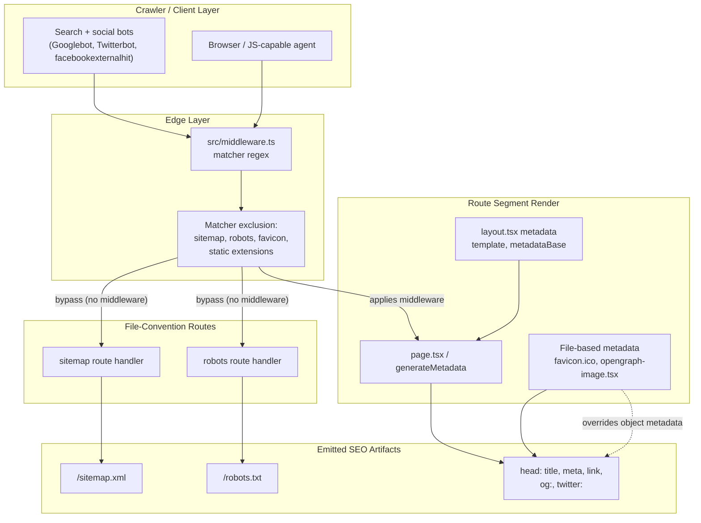
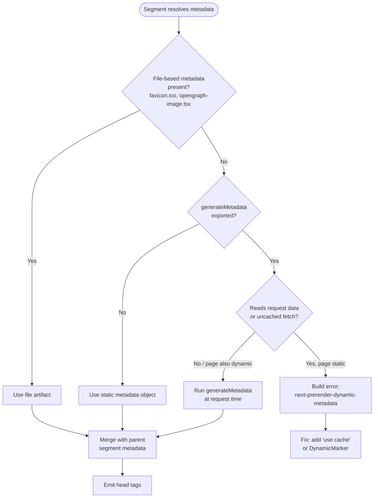
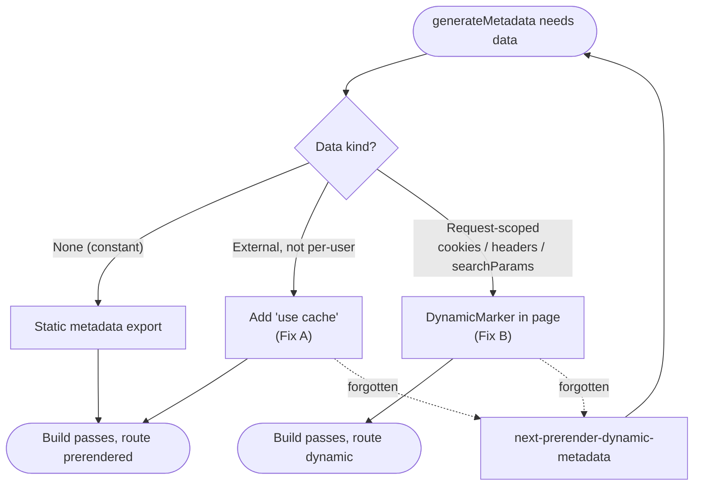

The SEO surface of ozeaon-v2 is assembled from three cooperating layers: Next.js file-convention routes (`sitemap.xml`, `robots.txt`, manifest), the `generateMetadata`/Metadata API used by every route segment, and the middleware matcher that decides which requests the SEO endpoints bypass entirely.

## Purpose and Scope

This page documents how the application exposes machine-readable SEO artifacts and how the Metadata API interacts with the rendering pipeline. It covers:

- The route-matching rules in `src/middleware.ts` that reserve `sitemap.xml`, `robots.txt`, `favicon.ico`, and static asset extensions from normal page handling.
- The Metadata API model used by route segments (`generateMetadata`, static `metadata` exports, file-based metadata such as `favicon.ico` and `opengraph-image.tsx`).
- The **keystone constraint**: `generateMetadata` must share one render mode with the page it annotates, enforced at build time by the `next-prerender-dynamic-metadata` error.
- Metadata merge semantics (including `openGraph` shallow replacement and `title.absolute` opting out of the parent template).
- Streaming behavior for HTML-limited bots and the `htmlLimitedBots` tuning knob.
- How a mid-stream `notFound()` degrades into an in-stream `<meta name="robots" content="noindex">` rather than a 404 status.

**Out of scope / sibling pages.** The full cache-components and prerender model (partial prerendering, `'use cache'`, `cacheLife`, `DynamicMarker`, Suspense/streaming rules) is documented in the SSR cache-components page — this page only repeats the metadata-relevant slice. Request routing, auth guards, and the general middleware pipeline belong to the middleware/routing page; only the SEO-relevant matcher exclusion is described here. Deployment and domain configuration (which determines `metadataBase` values and canonical hostnames) belong to the operations/deployment pages.

> **Documentation status.** The repository files read for this page are the middleware matcher and the `docs/ssr/cache-components-model.md` design document. A dedicated `src/app/sitemap.ts`, `robots.ts`, or manifest module was not located within the source-discovery budget, so where this page describes app-level metadata it cites the documented rules rather than a per-file implementation. Treat any statement not backed by a citation as a gap, not a claim.

## Overview

SEO in a Next.js App Router application is not a single service; it is a set of conventions that the framework resolves at build and request time. Three distinct mechanisms are involved, and confusing them is the most common source of broken crawler output:

| Mechanism | Unit of work | When it runs | Typical artifacts |
| --- | --- | --- | --- |
| File-convention routes | A route file exporting a route handler (e.g. `sitemap.ts`, `robots.ts`) | Build or request time, advertised to crawlers as a URL | `/sitemap.xml`, `/robots.txt` |
| Metadata API | A route segment (`layout.tsx` / `page.tsx`) exporting `metadata` or `generateMetadata` | Alongside the segment's render | `<title>`, `<meta>`, `<link rel="canonical">`, Open Graph tags |
| File-based metadata | Conventionally named files in a segment folder | Resolved by the framework, overriding object metadata | `favicon.ico`, `opengraph-image.tsx`, Twitter card images |

Two design intents drive the rules below:

1. **Crawler endpoints must never be intercepted by application middleware.** A middleware rewrite or redirect applied to `/sitemap.xml` silently serves HTML with a `200` to a crawler that expected XML, which de-indexes pages without any visible error. The matcher regex therefore excludes these paths explicitly.
2. **Metadata must not break the render contract.** Because metadata is produced by the same route tree it annotates, a metadata function that reads request data forces the whole route out of static prerendering. Next.js surfaces this as a hard build failure rather than a subtle runtime inconsistency — see [Dynamic metadata — the keystone rule](#dynamic-metadata--the-keystone-rule).

## Architecture

The diagram below shows the three cooperating layers and where each piece of the SEO surface is produced. Node names correspond to concrete files or framework APIs verified in the sources read.



The three layers are deliberately decoupled:

- **Middleware** makes a routing decision using only path shape — it never needs to know what the sitemap contains. This keeps the SEO endpoints available even if middleware has a bug or an outage, which is why they are excluded in the same regex as `_next/static` and `_next/image`.
- **File-convention routes** produce documents whose format is fixed by protocol (XML for sitemaps, plain text for robots). They are addressable artifacts, not HTML pages, and crawlers fetch them directly.
- **The segment metadata layer** produces the per-page `<head>`. It is the only layer that participates in the render mode contract, and therefore the only one that can fail a build.

> Source: [middleware.ts](https://github.com/ozeaon/ozeaon-v2/blob/0a4f1a95824db87782f1221a4108019d174df3d9/src/middleware.ts#L19-L21)

## The middleware matcher exclusion

The single most consequential SEO-relevant line in the routing layer is the matcher's negative lookahead. The middleware `config.matcher` uses a regex that matches **everything except** a specific allowlist:

```ts
source:
  "/((?!api|_next/static|_next/image|favicon\\.ico|sitemap\\.xml|robots\\.txt|.*\\.(?:svg|png|jpg|jpeg|gif|webp|ico)$).*)",
```

> Source: [middleware.ts](https://github.com/ozeaon/ozeaon-v2/blob/0a4f1a95824db87782f1221a4108019d174df3d9/src/middleware.ts#L20)

Reading the alternation left to right, a request is excluded from middleware when its path begins with any of:

| Excluded prefix / pattern | Why it is excluded |
| --- | --- |
| `api` | API routes have their own semantics; middleware rewriting would break JSON clients |
| `_next/static` | Build-immutable static assets; no per-request logic is meaningful |
| `_next/image` | The image optimizer endpoint; must reach the handler untouched |
| `favicon\.ico` | Browser and crawler fetch this unconditionally from the site root |
| `sitemap\.xml` | The crawler-facing sitemap document |
| `robots\.txt` | The crawler-facing crawl-policy document |
| `.*\.(?:svg\|png\|jpg\|jpeg\|gif\|webp\|ico)$` | Any static image by extension, including social share images |

Design intent: the `favicon\.ico`, `sitemap\.xml`, and `robots\.txt` entries are named explicitly *in addition to* the extension catch-all because `.xml` and `.txt` are not in the image-extension list. Without the explicit entries, a middleware rewrite rule would rewrite `/robots.txt` into an HTML route, and crawlers would receive a `200 OK` HTML body where they expected a directive file. That failure mode is nearly invisible: no error, no log noise, just a crawl policy that silently stops applying.

The extension catch-all additionally protects social share images. Because Open Graph consumers (`facebookexternalhit`, `Twitterbot`) fetch `og:image` URLs out-of-band — not as part of a page render — those requests must be servable without middleware involvement, and they must be fetchable by an unauthenticated client, since crawlers carry no session cookie.

## The Metadata API

Each route segment may contribute metadata through one of three mechanisms, resolved in a fixed precedence order.

### Static `metadata` export

A segment can export a constant `metadata` object. This is the cheapest form: it is evaluated at build time, contributes nothing to the render-mode decision, and can never trigger the dynamic-metadata build failure. Use it for anything that does not depend on the request — site name, default title template, `metadataBase`.

### `generateMetadata` function

When metadata depends on route params or external data, a segment exports an async `generateMetadata`. Its signature mirrors the page it annotates, receiving a promise of route params:

```tsx
export async function generateMetadata({ params }: { params: Promise<{ slug: string }> }) {
  "use cache";
```

> Source: [cache-components-model.md](https://github.com/ozeaon/ozeaon-v2/blob/0a4f1a95824db87782f1221a4108019d174df3d9/docs/ssr/cache-components-model.md#L290-L291)

Note the `"use cache"` directive on the first line of the body. This is the documented fix for the case where `generateMetadata` reads external data but the page itself is otherwise static (see the keystone rule below). The `params` argument being a `Promise` reflects the asynchronous dynamic-API contract of the App Router.

The alternative shape — a metadata function that reads request-scoped state — is shown in the design document as:

```tsx
export async function generateMetadata() {
  const token = (await cookies()).get("token")?.value;
```

> Source: [cache-components-model.md](https://github.com/ozeaon/ozeaon-v2/blob/0a4f1a95824db87782f1221a4108019d174df3d9/docs/ssr/cache-components-model.md#L317-L318)

This form reads `cookies()`, a runtime request API. It is legitimate only when the rest of the route is also dynamic; otherwise it fails the build.

### File-based metadata

Conventionally named files inside a segment folder participate automatically and, critically, **take precedence over the object/function export**:

> File-based metadata (`favicon.ico`, `opengraph-image.tsx`) wins over the object/function export.

> Source: [cache-components-model.md](https://github.com/ozeaon/ozeaon-v2/blob/0a4f1a95824db87782f1221a4108019d174df3d9/docs/ssr/cache-components-model.md#L349)

Design intent: file-based metadata lets designers ship binary assets (`favicon.ico`) and generated images (`opengraph-image.tsx`) without any code in the metadata object, and the precedence rule means the file is the single source of truth. If both exist, editing the object metadata has no effect — a common source of confusion when an Open Graph image "won't change."

### Precedence and resolution flow



### Merge semantics across segments

Metadata from a parent layout and a child page are merged, but not deeply. The documented rules that matter in practice:

| Key | Merge behavior |
| --- | --- |
| `title.absolute` (page) | Bypasses the parent `template` |
| `openGraph` (any segment) | Shallow merge — a child's `openGraph` **replaces** the parent's entire `openGraph` |
| `metadataBase` (root layout) | Resolves relative URLs in all child metadata |

> Source: [cache-components-model.md](https://github.com/ozeaon/ozeaon-v2/blob/0a4f1a95824db87782f1221a4108019d174df3d9/docs/ssr/cache-components-model.md#L345-L347)

Two of these are behavioral traps worth calling out explicitly:

- **`title.absolute` opt-out.** A root layout typically sets `title.template` such as `"%s | ozeaon"`, and every child title is wrapped by it. Pages whose titles must not be suffixed — home pages, landing pages, legal pages — set `title.absolute`, which is the documented escape hatch.
- **`openGraph` is not deep-merged.** Because a child's `openGraph` replaces the parent's wholesale, a child that sets only `openGraph.title` loses the parent's `openGraph.images`, `openGraph.siteName`, and `openGraph.type`. The correct pattern is to re-declare the full `openGraph` block in the child, or to derive it from the parent rather than writing a partial object.

- **`metadataBase` gates relative URLs.** Setting `metadataBase` once in the root layout is what allows child segments to write `openGraph.images: "/og/foo.png"` and have it resolved to an absolute URL. Crawlers require absolute URLs for `og:image` and canonical links; without `metadataBase`, relative values are either dropped or resolved against an unreliable origin.

## Dynamic metadata — the keystone rule

This is the constraint that shapes how the whole application is structured, and the design document is explicit that it drove an iterative debugging loop:

> `generateMetadata` follows the same prerender rules as a component. **If it reads runtime data (`cookies`/`headers`/`searchParams`/un-static `params`) or does an uncached fetch while the rest of the page is fully static, the build fails** with `next-prerender-dynamic-metadata`: *"Route … has a `generateMetadata` that depends on Request data … or uncached external data … when the rest of the route does not."*

> Source: [cache-components-model.md](https://github.com/ozeaon/ozeaon-v2/blob/0a4f1a95824db87782f1221a4108019d174df3d9/docs/ssr/cache-components-model.md#L283)

Three properties follow from this:

1. **Metadata and page share one render mode.** The framework treats the route as a unit; `generateMetadata` cannot be static while the page is dynamic, or vice versa. The design document lists this as rule 5 of the cache-components model.
2. **The failure is a build error, not a runtime warning.** This is intentional: a silently-inconsistent metadata output would produce correct-looking pages whose `<head>` differed between deploys, which is far harder to diagnose than a failed build.
3. **There are exactly two documented fixes.** Either make the metadata cached, or make the page dynamic.

### Fix A — cache the metadata

Adding `"use cache"` to the `generateMetadata` body makes it a build-time-prerenderable unit even when it reads external (non-request) data. This is applicable when the metadata depends on data that is not per-user — database rows keyed only on URL params, CMS content, catalog entries.

- `generateMetadata` based on external (non-request) data — [§7.2 Case A](https://nextjs.org/docs/messages/next-prerender-dynamic-metadata)

> Source: [cache-components-model.md](https://github.com/ozeaon/ozeaon-v2/blob/0a4f1a95824db87782f1221a4108019d174df3d9/docs/ssr/cache-components-model.md#L473-L474)

### Fix B — mark the route dynamic

When the metadata genuinely depends on the current user (for example, a personalized title derived from a session), the correct fix is the inverse: add a `DynamicMarker` (or otherwise read request data) in the page so both the page and its metadata render dynamically. The decision procedure in the design document states it as a single rule:

> 5. `generateMetadata` touches runtime data? → cache it (§7.2 A) **or** add a `DynamicMarker` (§7.2 B). Never a bare top-level `await connection()`.

> Source: [cache-components-model.md](https://github.com/ozeaon/ozeaon-v2/blob/0a4f1a95824db87782f1221a4108019d174df3d9/docs/ssr/cache-components-model.md#L594)

The prohibition on a bare top-level `await connection()` is deliberate: it forces a dynamic render without expressing any intent, and it interacts badly with the streaming rules described in the next section.

### Decision diagram



## Streaming behavior and HTML-limited bots

Metadata emission is not uniform across consumers. The design document distinguishes agents that execute JavaScript from those that only parse the raw HTML response:

> For browsers and JS-capable bots (`Googlebot`), `generateMetadata` can stream and be appended to `<body>` after first paint. HTML-limited bots (``facebookexternalhit`, `Twitterbot`, Slackbot) get blocking metadata in `<head>`. Tune via `htmlLimitedBots`.

> Source: [cache-components-model.md](https://github.com/ozeaon/ozeaon-v2/blob/0a4f1a95824db87782f1221a4108019d174df3d9/docs/ssr/cache-components-model.md#L337)

This split exists because there are two consumers with incompatible requirements:

| Consumer | Requirement | Consequence |
| --- | --- | --- |
| Browser, Googlebot | Can execute JS and observe streamed DOM mutations | Metadata may stream and be appended to `<body>` after first paint |
| `facebookexternalhit`, `Twitterbot`, Slackbot | Parse the initial HTML only; ignore appended nodes | Metadata must be resolved **blocking** and placed in `<head>` |

The framework therefore buffers metadata for agents it classifies as HTML-limited, so the `<head>` is complete before the response is flushed. The `htmlLimitedBots` configuration is the tuning surface: it determines which user agents are treated as HTML-limited. Design intent: streams stay fast for real users and for Googlebot (which renders JS), while social-card scrapers — which have no rendering pipeline and would otherwise see an empty `<head>` and drop the preview entirely — always receive blocking metadata.

Operationally, this means Open Graph tag output is not a pure function of the metadata code: the same route can emit its tags in a different position depending on the requesting user agent. When debugging a missing link preview, reproduce with the actual crawler user agent rather than `curl`'s default.

## Failure Modes, Edge Cases & Concurrency

### Mid-stream `notFound()` becomes a `noindex` meta tag, not a 404

This is the most important edge case at the intersection of streaming and crawler semantics:

> Once the first chunk streams, HTTP status is locked to `200`. A mid-stream `notFound()` becomes an in-stream `<meta name="robots" content="noindex">`; `redirect()` becomes a client redirect. For a real 404/redirect, run the check **before** any `await`/`<Suspense>` (or in `src/middleware.ts`).

> Source: [cache-components-model.md](https://github.com/ozeaon/ozeaon-v2/blob/0a4f1a95824db87782f1221a4108019d174df3d9/docs/ssr/cache-components-model.md#L528)

The consequence for SEO is direct and severe if misunderstood: **an entity-existence check performed after the first await cannot produce a 404 status.** Instead of `404 Not Found`, the crawler receives `200 OK` with a `<meta name="robots" content="noindex">` in the body. Search engines are subsequently instructed not to index the page — which is the right content decision — but the status code is wrong, so monitoring, uptime checks, and any client relying on HTTP status will not detect the missing resource. It also means soft-404s will not be distinguishable from real pages in server logs.

The mitigation is ordering, and it is stated as a hard rule in the design document's verification checklist:

> 6. Real 404 needed? → `notFound()` before any `await`/`<Suspense>`.

> Source: [cache-components-model.md](https://github.com/ozeaon/ozeaon-v2/blob/0a4f1a95824db87782f1221a4108019d174df3d9/docs/ssr/cache-components-model.md#L595)

Three options, in order of preference:

1. Call `notFound()` **before any `await` or `<Suspense>` boundary** — the status is still mutable, so a true `404` is emitted.
2. Perform the check in `src/middleware.ts` — the middleware runs before the response begins, so it controls the status.
3. Accept the `noindex` degradation only when a `200` is genuinely acceptable (for example, a page that should be hidden but was legitimately reached).

### `notFound()` and `redirect()` status divergence

The same streaming constraint applies to redirects: a mid-stream `redirect()` degrades to a **client-side** redirect. A crawler that does not execute JavaScript will not follow it and will instead index the origin page. For crawl-affecting redirects — canonicalization between URL forms, consolidated duplicate content, HTTP→HTTPS or host canonicalization — the redirect must be emitted before streaming begins, or from middleware.

### Summary of status-affecting failures

| Trigger | Naive outcome | Correct mitigation |
| --- | --- | --- |
| `notFound()` after first chunk streamed | `200` + `<meta name="robots" content="noindex">` | Move the check before any `await`/`<Suspense>`, or into `src/middleware.ts` |
| `redirect()` after first chunk streamed | `200` + client-side redirect (invisible to non-JS crawlers) | Emit the redirect before streaming, or from middleware |
| `generateMetadata` reads request data while page is static | Build error `next-prerender-dynamic-metadata` | Add `"use cache"` (Fix A) or a `DynamicMarker` (Fix B) |
| Middleware applies to `/sitemap.xml` or `/robots.txt` | `200 OK` HTML body served to a crawler expecting XML/text | Matcher exclusion regex in `src/middleware.ts` |
| Child sets partial `openGraph` | Parent's `og:image`, `og:siteName`, `og:type` silently lost | Re-declare the complete `openGraph` block in the child |
| Both a file and an object provide the same metadata | Object/function value ignored | Remove the object key, or remove the convention file |

### Request-data APIs and their metadata impact

The design document cross-references which APIs are legal in which context, including a dedicated column for `generateMetadata`:

> | API | In layout? | In page? | In `'use cache'`? | In `generateMetadata`? |

> Source: [cache-components-model.md](https://github.com/ozeaon/ozeaon-v2/blob/0a4f1a95824db87782f1221a4108019d174df3d9/docs/ssr/cache-components-model.md#L574)

The table exists because the answer is not uniform: several Next.js runtime APIs are legal in a layout or page but force `generateMetadata` out of static rendering, or are illegal inside a `'use cache'` scope. Any code that reads the current request from inside a cached or metadata context should be checked against that matrix before being committed.

### Concurrency considerations

Metadata resolution is per-request and has no shared mutable state in the application code paths examined, so there is no application-level lock or race. The observable concurrency concern is **ordering-based rather than thread-based**: whether the framework has already flushed the first stream chunk when a status-changing call occurs. Because that is a property of render scheduling rather than of application logic, it cannot be fixed by synchronization — only by moving the call earlier in the control flow (before `await`/`<Suspense>`) or out of the route entirely (into middleware). This is why the guidance is expressed as an ordering rule.

## Operational and Performance Notes

- **SEO endpoints are deliberately outside the middleware hot path.** Because `/sitemap.xml`, `/robots.txt`, `favicon.ico`, and all image extensions are excluded by the matcher regex, crawler traffic on these endpoints never pays for middleware execution. During a crawl, the sitemap is typically fetched first and repeatedly; keeping it on the edge-free path avoids adding middleware cost to that traffic.
- **`generateMetadata` participates in the render budget.** A slow metadata function delays the `<head>` for HTML-limited bots, because their metadata is blocking. External data read inside `generateMetadata` should therefore be cached (`"use cache"`) where the data is not request-scoped — this both satisfies the build-time rule and reduces the blocking time for social scrapers.
- **LCP elements must stay outside `Suspense`** per the streaming guidance; the same principle applies to any markup whose eligibility for indexing depends on being in the initial payload.

> Source: [cache-components-model.md](https://github.com/ozeaon/ozeaon-v2/blob/0a4f1a95824db87782f1221a4108019d174df3d9/docs/ssr/cache-components-model.md#L529)

## Extension Points

| Surface | How to extend | Constraint to respect |
| --- | --- | --- |
| `src/middleware.ts` `config.matcher` | Add new SEO/crawler paths to the negative lookahead alternation | The matcher regex is a single string; removing an existing entry re-enables middleware for that path and can break crawler output |
| `generateMetadata` per segment | Add or override keys; compose child metadata over the parent | Must share the render mode with its page, or the build fails |
| Root layout `metadata` | Set `metadataBase`, `title.template`, default `openGraph` | Child `openGraph` replaces rather than merges parent `openGraph`; `title.absolute` bypasses the template |
| File-based metadata | Drop `favicon.ico`, `opengraph-image.tsx` into a segment folder | File artifacts win over object/function metadata |
| `htmlLimitedBots` | Tune which user agents receive blocking `<head>` metadata | Affects only emission position; it does not change render mode |

## Gaps and Unverified Areas

The following areas could not be verified within the source-discovery budget for this page and should be treated as open questions rather than assumptions:

- No `src/app/sitemap.ts`, `robots.ts`, or manifest module was located; whether the sitemap and robots documents are generated by route handlers or served as static files is **not confirmed** by the sources read. The middleware matcher proves only that the paths `/sitemap.xml` and `/robots.txt` are reserved.
- The concrete sitemap contents (which routes are enumerated, changefreq/priority values, `lastModified` derivation) are not known from the sources read.
- Whether a web app manifest is present and what it declares (`name`, `short_name`, `theme_color`, `display`, icon set) is **not confirmed**. The catalog title names a PWA manifest, but no manifest file was found in the searches performed; the searches returned no matches for `manifest.json`, `manifest.ts`, or `manifest.webmanifest`.
- The exact `htmlLimitedBots` configuration value used in this repository, if any, was not located.
- No test files covering metadata, sitemap, or robots output were located.

## Related Links

- [src/middleware.ts](https://github.com/ozeaon/ozeaon-v2/blob/0a4f1a95824db87782f1221a4108019d174df3d9/src/middleware.ts#L19-L21) — matcher regex excluding `sitemap.xml`, `robots.txt`, `favicon.ico`, and static asset extensions
- [docs/ssr/cache-components-model.md](https://github.com/ozeaon/ozeaon-v2/blob/0a4f1a95824db87782f1221a4108019d174df3d9/docs/ssr/cache-components-model.md#L283) — `generateMetadata` render-mode rule and the `next-prerender-dynamic-metadata` error
- [docs/ssr/cache-components-model.md](https://github.com/ozeaon/ozeaon-v2/blob/0a4f1a95824db87782f1221a4108019d174df3d9/docs/ssr/cache-components-model.md#L290-L291) — cached `generateMetadata` example with `"use cache"`
- [docs/ssr/cache-components-model.md](https://github.com/ozeaon/ozeaon-v2/blob/0a4f1a95824db87782f1221a4108019d174df3d9/docs/ssr/cache-components-model.md#L317-L318) — request-scoped `generateMetadata` reading `cookies()`
- [docs/ssr/cache-components-model.md](https://github.com/ozeaon/ozeaon-v2/blob/0a4f1a95824db87782f1221a4108019d174df3d9/docs/ssr/cache-components-model.md#L337) — streaming behavior and `htmlLimitedBots`
- [docs/ssr/cache-components-model.md](https://github.com/ozeaon/ozeaon-v2/blob/0a4f1a95824db87782f1221a4108019d174df3d9/docs/ssr/cache-components-model.md#L345-L349) — metadata merge semantics and file-based metadata precedence
- [docs/ssr/cache-components-model.md](https://github.com/ozeaon/ozeaon-v2/blob/0a4f1a95824db87782f1221a4108019d174df3d9/docs/ssr/cache-components-model.md#L528) — mid-stream `notFound()`/`redirect()` degradation
- [docs/ssr/cache-components-model.md](https://github.com/ozeaon/ozeaon-v2/blob/0a4f1a95824db87782f1221a4108019d174df3d9/docs/ssr/cache-components-model.md#L594-L595) — decision checklist for dynamic metadata and real 404s
