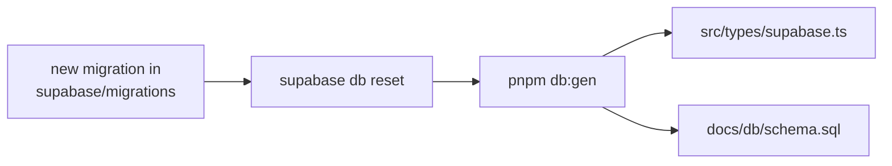

This page gets you from a fresh clone to a running dev server. The in-repo guides are the detailed references: [`README.md`](https://github.com/ozeaon/ozeaon-v2/blob/0a4f1a95824db87782f1221a4108019d174df3d9/README.md) for quick start and environment variables, and [`docs/supabase-local.md`](https://github.com/ozeaon/ozeaon-v2/blob/0a4f1a95824db87782f1221a4108019d174df3d9/docs/supabase-local.md) for the local database.

## Prerequisites

- **Node and pnpm** at the versions pinned in `package.json` (`devEngines` and `packageManager`). pnpm downloads the right Node if yours doesn't match. Use pnpm only, never npm or yarn.
- **Docker** and the **Supabase CLI**, for the local database.
- **`jq` and `psql`** on your `PATH`, if you want `pnpm db:reset-real`.

## First Run

```bash
pnpm install                 # also installs Husky git hooks
cp .env.example .env.local   # then fill in values
supabase start               # local Postgres, Auth and Storage (needs Docker)
pnpm typegen                 # Next route types + cloudflare-env.d.ts
pnpm dev                     # http://localhost:3000
```

[`.env.example`](https://github.com/ozeaon/ozeaon-v2/blob/0a4f1a95824db87782f1221a4108019d174df3d9/.env.example) lists the variables, and `src/config/env.ts` validates them at load time (see [Environment & Configuration Constants](../../config-and-utils/config-constants/)). Anything prefixed `NEXT_PUBLIC_` is inlined into the browser bundle. Keep the service-role key and OAuth secrets unprefixed.

`src/types/supabase.ts` is committed, so a fresh clone type-checks without a database. `cloudflare-env.d.ts` is not committed. If the editor can't find `CloudflareEnv` or typed route params, run `pnpm typegen`.

## Day-to-Day Database Work



- Run `pnpm db:gen` after every migration. Types are derived from the generated file and never hand-written (see [Type System & Generated Types](../../architecture/type-system/)).
- `supabase db reset` seeds the local DB with the preview fixture. `pnpm db:reset-real` loads a real data dump instead. Both wipe local data.
- If a migration changes what the preview fixture writes, update `supabase/seeds/10-preview-fixture.sql` in the same PR. Otherwise preview deployments break.

See [Database Migrations & Seeding](../../operations/migrations-and-seeding/) for the full workflow.

## Before You Push

```bash
pnpm check    # tsc --noEmit
pnpm lint
pnpm format
pnpm preview  # optional: run the real Cloudflare Worker build locally
```

`pnpm dev` doesn't run the code the way production does. `pnpm preview` builds with the OpenNext adapter and serves it with Worker semantics, which catches edge-runtime problems before CI does.

## Failure Modes & Edge Cases

| Symptom | Fix |
| --- | --- |
| `CloudflareEnv` or route types missing | `pnpm typegen` |
| `pnpm db:gen` fails or writes an empty file | Local Supabase isn't running; `supabase start` |
| `db:reset-real` fails immediately | Install `jq` and `psql` |
| Build behaves inexplicably after switching branches or environments | `pnpm clean-cache`, then `pnpm install && pnpm typegen` |
| `document is not defined` | A browser API is used in a Server Component or at module scope; move it into a Client Component |

## Related Links

- [Technology Stack & Scripts](../technology-stack/): what each script does
- [Coding Conventions & Linting Rules](../../developer-guide/conventions-and-linting/): rules to know before your first PR
- [Supabase Client Patterns](../../architecture/supabase-client-patterns/): which Supabase client to use where
- [docs/workflows.md](https://github.com/ozeaon/ozeaon-v2/blob/0a4f1a95824db87782f1221a4108019d174df3d9/docs/workflows.md): branching and PR workflow
