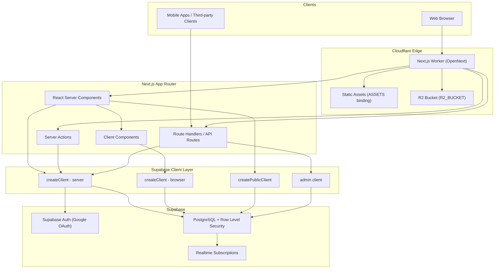
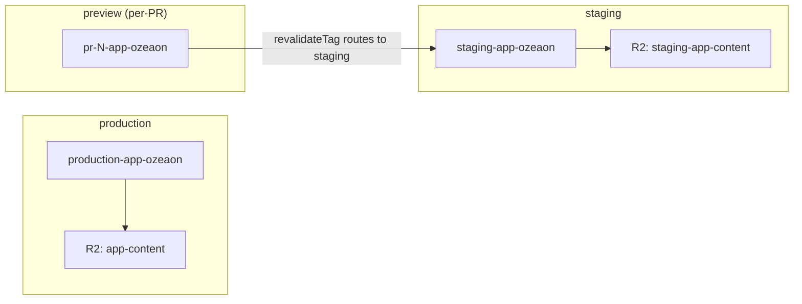
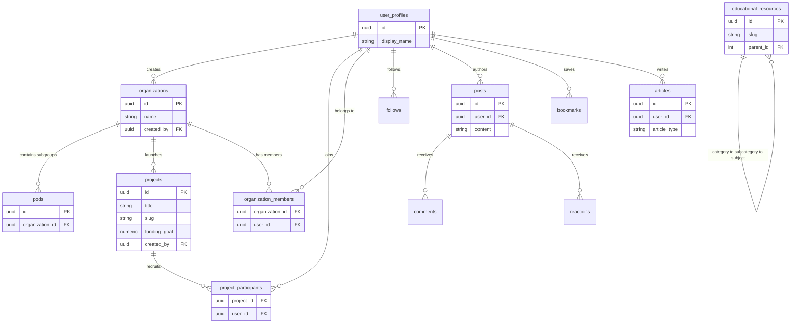
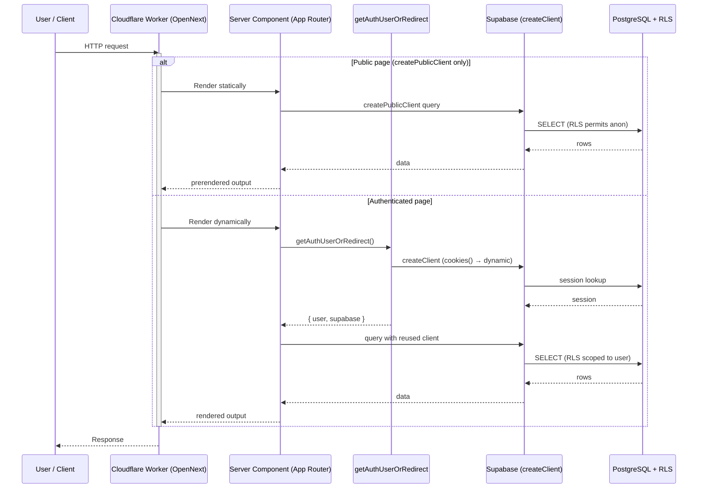
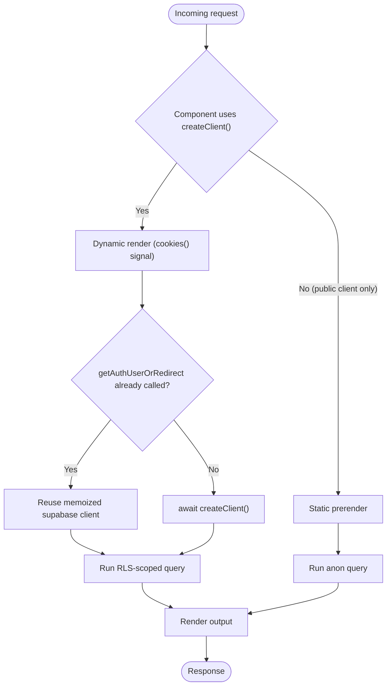

OZEAON V2 is a full-stack ocean conservation and climate-action platform that unifies organizations, conservation projects, educational content, community features, token rewards, and DAO governance into a single digital ecosystem.

## Purpose and Scope

This page is the entry point to the OZEAON V2 codebase. It describes **what the platform is, why it exists, and how its major subsystems fit together**: the mission, the domain capabilities it serves, the technology stack, the deployment topology, and the repository layout.

It intentionally stays at the platform level. Detailed treatment of individual subsystems is delegated to sibling pages:

- For project CRUD, funding goals, and participant flows, see the **Projects** pages.
- For organization profiles, pods, and membership, see the **Organizations** pages.
- For the 3-tier learning system, quizzes, and certifications, see the **Education** pages.
- For posts, comments, reactions, follows, and bookmarks, see the **Community & Social** pages.
- For proposals, weighted voting, and fund allocation, see the **DAO Governance** page.
- For authentication, session handling, and the Supabase client variants, see the **Authentication & Supabase Clients** page.
- For build, `wrangler`, environment variables, and CI/CD, see **Deployment & Operations**.

This page covers the common substrate — SSR constraints, data access model, type system, and multi-environment deployment — that every sibling page builds on.

## Overview

OZEAON V2 is positioned as the **central hub for the OZEAON ecosystem**: a public-facing platform for browsing projects, organizations, articles and educational content, plus an authenticated portal with personalized dashboards and an API surface intended to power mobile apps and third-party integrations ([README.md](https://github.com/ozeaon/ozeaon-v2/blob/0a4f1a95824db87782f1221a4108019d174df3d9/README.md#L41-L49)).

The mission, stated in the repository, is to create a unified digital ecosystem where ([README.md](https://github.com/ozeaon/ozeaon-v2/blob/0a4f1a95824db87782f1221a4108019d174df3d9/README.md#L30-L39)):

| Audience | Value delivered |
| --- | --- |
| **Organizations** | Showcase conservation initiatives through profiles, teams, and pods |
| **Projects** | Receive funding and community support through crowdfunding and volunteer recruitment |
| **Individuals** | Access educational resources on marine sustainability via a 3-tier learning system |
| **Communities** | Collaborate on climate action aligned with UN SDGs |
| **Contributors** | Earn rewards through a token-based incentive system |
| **Governance** | Operate transparently through DAO voting |

### Key concepts and terminology

- **Organization** — a conservation body with a public profile, members, and nested **pods** (sub-groups) that launch projects ([README.md](https://github.com/ozeaon/ozeaon-v2/blob/0a4f1a95824db87782f1221a4108019d174df3d9/README.md#L69-L76)).
- **Project** — a conservation initiative with a funding goal, a geographic location, participants, and reported impact metrics ([README.md](https://github.com/ozeaon/ozeaon-v2/blob/0a4f1a95824db87782f1221a4108019d174df3d9/README.md#L80-L88)).
- **Educational resource** — content organized as **categories → subcategories → subjects** (the "3-tier learning system"), with quizzes, progress tracking, and certifications that award tokens ([README.md](https://github.com/ozeaon/ozeaon-v2/blob/0a4f1a95824db87782f1221a4108019d174df3d9/README.md#L93-L100)).
- **SDG alignment** — projects are tagged with Sustainable Development Goals, specifically SDG 13 (Climate Action) and SDG 14 (Life Below Water) ([README.md](https://github.com/ozeaon/ozeaon-v2/blob/0a4f1a95824db87782f1221a4108019d174df3d9/README.md#L51-L59)).
- **DAO governance** — community-driven proposals with weighted voting based on contribution and engagement, plus transparent voting records ([README.md](https://github.com/ozeaon/ozeaon-v2/blob/0a4f1a95824db87782f1221a4108019d174df3d9/README.md#L117-L124)).

### Design intent: sustainability as a first-class constraint

The repository treats carbon efficiency as an architectural requirement rather than an afterthought: the platform deploys to Cloudflare's edge network, which the project cites as green-energy powered, and the deployment topology is deliberately chosen to minimize compute and data transfer ([README.md](https://github.com/ozeaon/ozeaon-v2/blob/0a4f1a95824db87782f1221a4108019d174df3d9/README.md#L51-L59)). Similarly, transparency of funding and impact metrics is a product requirement expressed directly in the data model (funding goals and impact reporting on projects).

## Architecture

The platform is a single Next.js application deployed to Cloudflare Workers via the OpenNext adapter, talking to a Supabase (PostgreSQL) backend, with object storage on Cloudflare R2.



**Why this shape.** The worker entry point is `.open-next/worker.js` with static assets served from `.open-next/assets` through the `ASSETS` binding, and runtime data stored in the `R2_BUCKET` binding (`app-content` in production) ([wrangler.jsonc](https://github.com/ozeaon/ozeaon-v2/blob/0a4f1a95824db87782f1221a4108019d174df3d9/wrangler.jsonc#L2-L35)). Splitting into four Supabase client variants is deliberate: it lets public, cacheable pages stay statically prerenderable while authenticated pages opt into dynamic rendering automatically, without route-level cache directives.

### Rendering and caching model

The critical architectural rule is that **the choice of Supabase client determines the rendering mode** (`CLAUDE.md`):

- `await createClient()` (the server client) internally calls `cookies()`, which is the signal that opts a route into dynamic rendering. Any component that goes through `createClient()` is therefore safe without declaring `export const dynamic`.
- Components that use only `createPublicClient()` or admin clients remain statically prerenderable.
- Never mix a user-specific client and an admin/public client in the same component, because the component would then render both user-specific state and a statically cached response.
- Legacy cache directives (`dynamic`, `revalidate`, `fetchCache`, `runtime`) must not be used; the project is migrating toward Next.js 16's `cacheComponents` model once the Cloudflare adapter is stable.
- Browser APIs (`document`, `window`) must never be used in server components or at module level.

### Multi-environment deployment topology

A single root `wrangler.jsonc` defines three Worker environments, each with its own R2 bucket and self-reference service binding. The `services` block is the reason `--env` is mandatory when deploying: without it, `WORKER_SELF_REFERENCE` breaks (see `CLAUDE.md`).



For per-PR previews, the Worker is deployed as its own named Worker rather than as a version of staging, because the built worker exports Durable Objects and Cloudflare does not mint preview URLs for such Workers. The comment in the config also notes a deliberate trade-off: preview's `WORKER_SELF_REFERENCE` points at **staging** rather than itself, because a self-reference to a not-yet-existing Worker fails on first deploy — the cost being that `revalidateTag` from a preview executes staging's code ([wrangler.jsonc](https://github.com/ozeaon/ozeaon-v2/blob/0a4f1a95824db87782f1221a4108019d174df3d9/wrangler.jsonc#L38-L66)).

## Technology Stack

The stack is deliberately narrow and version-rigid. The repository warns that exact versions drift, so `package.json` is the source of truth — but a handful of breaking changes matter for how code is written (`CLAUDE.md`):

| Layer | Technology | Notes / breaking-change caveats |
| --- | --- | --- |
| Framework | Next.js 16 (`16.3.5`) App Router | `cookies()` / `headers()` are **async** (breaking from 14) |
| UI runtime | React 19 (`19.3.0`) | Server Components by default |
| Language | TypeScript strict mode | `pnpm check` runs `tsc --noEmit` |
| Validation | Zod v4 (`^4.6.5`) | v4 API — do not use deprecated v3 APIs |
| Forms | React Hook Form + `@hookform/resolvers` | |
| Styling | Tailwind CSS v4 + Radix UI primitives | v4 config format; no `tailwind.config.js` pattern |
| Animation | Motion | |
| Backend | Supabase (PostgreSQL + RLS + Realtime + Auth) | 30+ interconnected tables |
| Auth | Supabase Auth with Google OAuth | |
| Object storage | Cloudflare R2 + Workers | Accessed only through `StorageAdapter` |
| Edge deploy | OpenNext + Wrangler → Cloudflare Workers | `pnpm ci:build` → `pnpm ci:deploy` |
| Package manager | pnpm **only** | never `npm` or `yarn` |
| Logging | `@logtape/logtape`, `@logtape/redaction` | dedicated ESLint ruleset |
| Rich text | Tiptap 3 (`@tiptap/*`) | article/editor content |
| Data viz / UX | `date-fns`, `lucide-react`, `cmdk`, `vaul`, `sonner`, `@dnd-kit/*` | |
| Content safety | `obscenity`, `xss`, `validator` | user-generated content sanitization |
| Files | `browser-image-compression`, `react-image-crop`, `react-pdf` | client-side media handling |

```json
{
  "name": "ozeaon-v2",
  "description": "Main repository for Ozeaon Platform source code.",
  "version": "0.1.0",
  "homepage": "https://www.ozeaon.com",
  "private": true,
  "type": "module"
}
```

> Source: [package.json](https://github.com/ozeaon/ozeaon-v2/blob/0a4f1a95824db87782f1221a4108019d174df3d9/package.json#L1-L29)

The project is `"type": "module"` (ESM throughout) and has no public npm surface — it is a deployable application, not a library.

## Repository Layout and Engineering Tooling

Rather than one monolithic ESLint config, the repository splits its rules by concern and composes them. This is a deliberate signal about which constraints the team considers non-negotiable:

| Config file | Concern enforced |
| --- | --- |
| [eslint.config.mjs](https://github.com/ozeaon/ozeaon-v2/blob/0a4f1a95824db87782f1221a4108019d174df3d9/eslint.config.mjs) | Root composition |
| [eslint.rules.base.mjs](https://github.com/ozeaon/ozeaon-v2/blob/0a4f1a95824db87782f1221a4108019d174df3d9/eslint.rules.base.mjs) | Baseline JS/TS rules |
| [eslint.rules.auth.mjs](https://github.com/ozeaon/ozeaon-v2/blob/0a4f1a95824db87782f1221a4108019d174df3d9/eslint.rules.auth.mjs) | Authentication patterns (Supabase client misuse) |
| [eslint.rules.cache.mjs](https://github.com/ozeaon/ozeaon-v2/blob/0a4f1a95824db87782f1221a4108019d174df3d9/eslint.rules.cache.mjs) | Caching / rendering-mode discipline |
| [eslint.rules.import.mjs](https://github.com/ozeaon/ozeaon-v2/blob/0a4f1a95824db87782f1221a4108019d174df3d9/eslint.rules.import.mjs) | Import boundaries and conventions |
| [eslint.rules.logging.mjs](https://github.com/ozeaon/ozeaon-v2/blob/0a4f1a95824db87782f1221a4108019d174df3d9/eslint.rules.logging.mjs) | Logging conventions (LogTape) |

Supporting configuration: [tsconfig.json](https://github.com/ozeaon/ozeaon-v2/blob/0a4f1a95824db87782f1221a4108019d174df3d9/tsconfig.json) (path aliases such as `@/`), [next.config.ts](https://github.com/ozeaon/ozeaon-v2/blob/0a4f1a95824db87782f1221a4108019d174df3d9/next.config.ts), [open-next.config.ts](https://github.com/ozeaon/ozeaon-v2/blob/0a4f1a95824db87782f1221a4108019d174df3d9/open-next.config.ts) (Cloudflare adapter), [components.json](https://github.com/ozeaon/ozeaon-v2/blob/0a4f1a95824db87782f1221a4108019d174df3d9/components.json) (shadcn component generation), [postcss.config.mjs](https://github.com/ozeaon/ozeaon-v2/blob/0a4f1a95824db87782f1221a4108019d174df3d9/postcss.config.mjs) (Tailwind v4 pipeline), and [pnpm-workspace.yaml](https://github.com/ozeaon/ozeaon-v2/blob/0a4f1a95824db87782f1221a4108019d174df3d9/pnpm-workspace.yaml).

### The commands that define the developer workflow

The `package.json` scripts reveal the intended loop — typegen and DB type generation are generator steps that must be run after schema or route changes:

```json
"dev": "next dev",
"check": "tsc --noEmit",
"typegen": "next typegen && wrangler types --env-interface CloudflareEnv cloudflare-env.d.ts",
"db:gen": "pnpm db:schema && pnpm db:types",
"ci:build": "opennextjs-cloudflare build",
"ci:deploy": "opennextjs-cloudflare deploy",
"clean-cache": "rm -rf .next .turbo node_modules/.cache .open-next .wrangler"
```

> Source: [package.json](https://github.com/ozeaon/ozeaon-v2/blob/0a4f1a95824db87782f1221a4108019d174df3d9/package.json#L8-L28)

Note the two distinct build paths and why they exist:

- **Local dev/preview chain:** `pnpm dev` (Turbopack) and `pnpm preview` → `opennextjs-cloudflare build && opennextjs-cloudflare preview --port 3000`. Preview exercises the *actual Cloudflare worker build* locally, so Cloudflare-only failures surface before CI.
- **CI chain:** `pnpm ci:build` → `pnpm ci:deploy`, mirroring the adapter build used for real deploys.
- **Type generation chain:** `pnpm typegen` produces Next.js route types **and** Cloudflare env types (`cloudflare-env.d.ts`), while `pnpm db:gen` runs the schema generator plus `supabase gen types typescript --local` into `src/types/supabase.ts` and Prettier-formats it. This makes the database the ultimate source of truth for row types.
- **Seed chain:** `pnpm db:seed-dump` dumps remote data into `supabase/seed.sql`, and `pnpm db:reset-real` resets the local DB, truncates via `supabase/seeds/00-truncate.sql`, then loads the real dump with `ON_ERROR_STOP=1`. This gives developers a realistic local dataset that matches production shape.

### Documentation and design governance

The repository carries its own first-class documentation set that is referenced from `README.md` and `CLAUDE.md`:

- [Deployment Guide](https://github.com/ozeaon/ozeaon-v2/blob/0a4f1a95824db87782f1221a4108019d174df3d9/docs/ops-deployment.md) — environment variables and troubleshooting; the source of truth for required env vars validated in `src/config/env.ts`.
- [Development Workflow Guide](https://github.com/ozeaon/ozeaon-v2/blob/0a4f1a95824db87782f1221a4108019d174df3d9/docs/workflows.md)
- [Local Supabase Setup](https://github.com/ozeaon/ozeaon-v2/blob/0a4f1a95824db87782f1221a4108019d174df3d9/docs/supabase_local.md)
- [R2 Storage Guide](https://github.com/ozeaon/ozeaon-v2/blob/0a4f1a95824db87782f1221a4108019d174df3d9/docs/r2-storage.md)
- [Component Library](https://github.com/ozeaon/ozeaon-v2/blob/0a4f1a95824db87782f1221a4108019d174df3d9/docs/component-library.md) — the canonical list of primitives (`EmptyState`, `GridLayout`, `Button`/`LoadingButton`, `ConfirmDialog`, and more).
- [Design System](https://github.com/ozeaon/ozeaon-v2/blob/0a4f1a95824db87782f1221a4108019d174df3d9/docs/design-system.md) — the type scale, text color, and background token tables. Raw Tailwind size and color utilities are prohibited; tokens live in `src/styles/typography.css` and `src/styles/globals.css`.
- [Database Schema](https://github.com/ozeaon/ozeaon-v2/blob/0a4f1a95824db87782f1221a4108019d174df3d9/docs/db/schema.sql) — the full schema.
- [Deployment Previews](https://github.com/ozeaon/ozeaon-v2/blob/0a4f1a95824db87782f1221a4108019d174df3d9/docs/deployment-previews.md)

This governance layer is a real architectural constraint: UI code must use design tokens rather than raw utilities, and components must be reused rather than reimplemented.

## Data Access and Domain Model

### Four Supabase clients, one rule each

The platform exposes exactly four Supabase entry points, and choosing the wrong one is the most common way to break the rendering model (`CLAUDE.md`):

| Client | Import path | Use in | Rendering consequence |
| --- | --- | --- | --- |
| Server | `@/lib/supabase/server` | Server Components, Server Actions, API routes | Calls `cookies()` → route becomes dynamic |
| Browser | `@/lib/supabase/client` | Client Components (`"use client"`) | Must be created **fresh per call**, never cached globally |
| Admin | `@/lib/supabase/admin` | API routes bypassing RLS | Use sparingly; never alongside user-specific state |
| Public | `@/lib/supabase/public` | Unauthenticated public queries | Allows static prerendering |

The canonical server pattern:

```typescript
//  Server Component / API route
import { createClient } from "@/lib/supabase/server";

const supabase = await createClient();
```

> Source: [CLAUDE.md](https://github.com/ozeaon/ozeaon-v2/blob/0a4f1a95824db87782f1221a4108019d174df3d9/CLAUDE.md#L91-L96)

A subtle but explicitly documented optimization: `getAuthUser()` and `getAuthUserOrRedirect()` already return a `supabase` client memoized via React `cache()` for the request, so calling `createClient()` afterwards creates a redundant second client.

```typescript
// ❌ Wrong — two clients for one request
const supabase = await createClient();
const { user } = await getAuthUserOrRedirect();

// ✅ Correct — reuse the client from auth
const { user, supabase } = await getAuthUserOrRedirect();
```

> Source: [CLAUDE.md](https://github.com/ozeaon/ozeaon-v2/blob/0a4f1a95824db87782f1221a4108019d174df3d9/CLAUDE.md#L100-L107)

The same rule applies to route handlers wrapped in `withAuthUser`, which receive `supabase` through the handler context:

```typescript
// ✅ Correct
export const POST = withAuthUser(async (req, { user, supabase }) => {
  ...
});
```

> Source: [CLAUDE.md](https://github.com/ozeaon/ozeaon-v2/blob/0a4f1a95824db87782f1221a4108019d174df3d9/CLAUDE.md#L109-L122)

### Domain entities

The core tables map directly onto the mission's audiences. Primary entities and their relationship tables (`CLAUDE.md`):



The 3-tier education system (`categories → subcategories → subjects`) is self-referential on `educational_resources`, which is why the `resource_subcategories` table appears in type derivation examples (`CLAUDE.md`). Project-to-SDG tagging supports the UN SDG alignment claim in the mission ([README.md](https://github.com/ozeaon/ozeaon-v2/blob/0a4f1a95824db87782f1221a4108019d174df3d9/README.md#L51-L59)).

### The type system derives from the database, never from hand-written shapes

This is one of the strongest conventions in the repository: every domain type must be derived from generated Supabase types, not authored by hand (`CLAUDE.md`).

```typescript
type Project = Tables<"projects">; // full row
type Slug = Pick<Tables<"resource_subcategories">, "id" | "name" | "slug">; // projection
type Comment = Tables<"comments"> & { author: UserProfileForJoin }; // join
type Article = Omit<Tables<"articles">, "article_type"> & {
  // FK override
  article_type: { id: number; type: string } | null;
};
const insert: TablesInsert<"projects"> = { title, slug, created_by: user.id }; // mutation
```

> Source: [CLAUDE.md](https://github.com/ozeaon/ozeaon-v2/blob/0a4f1a95824db87782f1221a4108019d174df3d9/CLAUDE.md#L166-L177)

Design intent: because `src/types/supabase.ts` is regenerated from the live schema by `pnpm db:types`, the compiler becomes the enforcement mechanism for schema drift. Hand-rolled types would silently diverge after a migration. Domain types live centrally in `src/types/` and are never defined inside component files.

### Where business logic is allowed to live

The repository partitions side effects by determinism (`CLAUDE.md`):

- **PostgreSQL triggers** — for anything that is a *deterministic side effect of a row state change*: audit timestamps, cascading inserts on status change, denormalised counters, invariant enforcement. These must never be implemented in API routes or Server Actions. Triggers follow a strict security convention (`SECURITY DEFINER`, explicit `search_path`, revoked grants) derived from the migration history, and are authored via a dedicated skill rather than from memory.
- **API routes** — authenticate with `supabase.auth.getUser()` and return `401` when absent; use `TablesInsert<"table">` for insert shapes; return `201` on create, `400` on validation failure, `500` on error.
- **Server Actions** — must verify ownership by adding `.eq("user_id", user.id)` to mutations, and must call `revalidateTag(...)` after writes.

The `revalidateTag` requirement connects directly back to the deployment topology: because `WORKER_SELF_REFERENCE` is bound in every environment, revalidation is dispatched through a service binding to the Worker itself (`wrangler.jsonc`).

### Storage abstraction

All R2 access is funneled through `StorageAdapter` (`@/lib/storage/adapter`). Raw R2 bindings or S3-compatible clients are prohibited, so that key generation, URL signing, and image-caching behavior remain centralized and testable ([CLAUDE.md](https://github.com/ozeaon/ozeaon-v2/blob/0a4f1a95824db87782f1221a4108019d174df3d9/CLAUDE.md#L133-L136)).

## Configuration Reference

### Environment variables

Required environment variables are declared and validated in `src/config/env.ts`, and are imported through the `@/config` barrel:

```typescript
import { useAuth } from "@/hooks"; // barrel exports
import { env, IMAGE_CONFIG } from "@/config";
import { validateFileType, generateUniqueKey } from "@/utils";
import { createClient } from "@/lib/supabase/server"; // explicit Supabase client imports
import { cn } from "@/utils/shadcn/utils";
import type { Tables, TablesInsert, TablesUpdate } from "@/types/supabase";
```

> Source: [CLAUDE.md](https://github.com/ozeaon/ozeaon-v2/blob/0a4f1a95824db87782f1221a4108019d174df3d9/CLAUDE.md#L148-L157)

Design intent: centralizing env access behind a validated module means a missing variable fails at a known place rather than surfacing as an undefined value deep in a query. The deployment guide `docs/ops-deployment.md` is the authoritative list; `CLAUDE.md` explicitly points there rather than duplicating it.

### Cloudflare bindings

| Binding | Type | Staging / Production value | Purpose |
| --- | --- | --- | --- |
| `ASSETS` | Static assets | `.open-next/assets` | Serves the Next.js static output |
| `R2_BUCKET` | R2 bucket | `app-content` (prod), `staging-app-content` (staging) | Runtime content storage |
| `WORKER_SELF_REFERENCE` | Service binding | Own Worker name per env | Required for on-demand revalidation such as `revalidateTag` |

Worker-level settings from [wrangler.jsonc](https://github.com/ozeaon/ozeaon-v2/blob/0a4f1a95824db87782f1221a4108019d174df3d9/wrangler.jsonc#L2-L35):

| Setting | Value | Notes |
| --- | --- | --- |
| `main` | `.open-next/worker.js` | OpenNext build output |
| `name` | `production-app-ozeaon` | Top-level default; per-env names override |
| `compatibility_date` | `2026-06-16` | |
| `compatibility_flags` | `["nodejs_compat"]` | Enables Node built-ins in the Worker |
| `workers_dev` | `false` (top level and staging/production) | Custom domains only; `true` for `preview` only |
| `observability.enabled` | `true` | Head sampling rate `1` |
| `observability.logs` | enabled, persisted, `invocation_logs: true` | Full-fidelity log capture |
| `observability.traces` | enabled, persisted | Full-fidelity tracing |
| `upload_source_maps` | `false` | |
| `keep_names` | `false` | Minified names in stack traces |

### Per-environment matrix

| Aspect | `preview` | `staging` | `production` |
| --- | --- | --- | --- |
| Worker name | `pr-<N>-app-ozeaon` (CI overrides) | `staging-app-ozeaon` | `production-app-ozeaon` |
| `workers_dev` | `true` (own `workers.dev` hostname) | inherits `false` | inherits `false` |
| R2 bucket | `staging-app-content` | `staging-app-content` | `app-content` |
| `WORKER_SELF_REFERENCE` | `staging-app-ozeaon` | `staging-app-ozeaon` | `production-app-ozeaon` |

The `preview` environment's `workers_dev: true` is explicitly scoped rather than inherited, because `workers_dev` is inheritable and both staging and production deliberately serve on custom domains with it off ([wrangler.jsonc](https://github.com/ozeaon/ozeaon-v2/blob/0a4f1a95824db87782f1221a4108019d174df3d9/wrangler.jsonc#L43-L56)).

## Core Flow: from request to data

The end-to-end path a reader should keep in mind when navigating the codebase:



Key points in this flow:

1. **The rendering branch is decided by the client choice, not by a directive.** `cookies()` inside `createClient()` is the dynamic signal.
2. **Authentication returns a reusable client.** `getAuthUserOrRedirect()` memoizes the Supabase client per request via React `cache()`, so the query step reuses it rather than creating a second one.
3. **RLS is the security boundary.** Row Level Security enforces authorization at the database layer, which is why Server Actions additionally assert ownership with `.eq("user_id", user.id)` as defense in depth.
4. **Self-reference keeps revalidation in-network.** After a write, `revalidateTag(...)` dispatches through `WORKER_SELF_REFERENCE` rather than the public internet.



## Failure Modes, Edge Cases & Operational Notes

These are the concrete failure modes the repository's own guidance warns about:

| Failure mode | Root cause | Mitigation encoded in the repo |
| --- | --- | --- |
| Two Supabase clients per request | Calling `createClient()` after `getAuthUser*` | Reuse the client returned by `getAuthUserOrRedirect()` |
| Redundant client in route handlers | Calling `createClient()` inside `withAuthUser` | Destructure `supabase` from the handler context |
| Stale browser client | Caching the browser Supabase client globally | Create fresh per call in Client Components |
| Broken revalidation after deploy | Omitting `--env` when running `ci:deploy` | Top-level config has no `services` block, so `WORKER_SELF_REFERENCE` breaks — always pass `--env staging` or `--env production` |
| Preview first-deploy failure | `WORKER_SELF_REFERENCE` pointing at a not-yet-existing Worker | Preview points at staging instead of itself |
| Preview preview-URL absence | Worker exports Durable Objects, so Cloudflare mints no preview URL | Deploy previews as their own named Worker (`pr-<N>-app-ozeaon`) |
| Preview revalidation runs wrong code | Preview's self-reference targets staging | Known, accepted trade-off documented in config |
| Hydration / runtime errors from browser APIs | Using `document` / `window` in server components or at module level | Explicit SSR constraint; also enforced by the auth/cache ESLint rulesets |
| Silently duplicated business logic | Implementing deterministic side effects in routes instead of triggers | Triggers mandated for audit timestamps, cascading inserts, counters, invariants |
| Schema/type drift | Hand-rolled types diverging from migrations | Types derived from `Tables<...>`; regenerate via `pnpm db:gen` |
| Preview seed drift | Migration changes what the fixture writes | The preview fixture (`supabase/seeds/10-preview-fixture.sql`) must be updated in the same PR |
| Missing env var at runtime | Unvalidated env access | Centralized validation in `src/config/env.ts` |

### Observability

All three environments run with full-fidelity observability: head sampling rate `1`, logs persisted with invocation logs, and traces persisted ([wrangler.jsonc](https://github.com/ozeaon/ozeaon-v2/blob/0a4f1a95824db87782f1221a4108019d174df3d9/wrangler.jsonc#L14-L28)). Combined with the dedicated logging ESLint ruleset and LogTape's redaction package, the platform is designed to be diagnosable in production without redeploying.

### Operational workflow constraints

Two process rules materially affect how changes land ([CLAUDE.md](https://github.com/ozeaon/ozeaon-v2/blob/0a4f1a95824db87782f1221a4108019d174df3d9/CLAUDE.md#L31-L42)):

- **Diagnose before editing.** If asked to "understand", "analyze", "explore", "check", or "review", the expected output is analysis first.
- **Parallelism threshold.** Changes spanning 4+ files should use parallel task agents, with confirmation before proceeding sequentially on large refactors.

Additionally, an **auto-validation hook** runs incremental `tsc --noEmit` on any turn that edits `.ts`/`.tsx` files and *blocks completion* if errors remain, forcing a fix loop. Type correctness is therefore a merge gate independent of CI.

## Usage Examples

### Server-side authenticated read with client reuse

```typescript
import { getAuthUserOrRedirect } from "@/lib/auth";

export default async function DashboardPage() {
  const { user, supabase } = await getAuthUserOrRedirect();

  const { data: projects } = await supabase
    .from("projects")
    .select("*")
    .eq("created_by", user.id);

  return <ProjectGrid projects={projects ?? []} />;
}
```

> Source: pattern documented in [CLAUDE.md](https://github.com/ozeaon/ozeaon-v2/blob/0a4f1a95824db87782f1221a4108019d174df3d9/CLAUDE.md#L98-L107); the underlying `supabase.auth.getUser()` contract is described in [CLAUDE.md](https://github.com/ozeaon/ozeaon-v2/blob/0a4f1a95824db87782f1221a4108019d174df3d9/CLAUDE.md#L142)

This example illustrates the two rules working together: the auth helper both enforces authentication (redirecting when there is no session) and supplies the memoized client that the subsequent query reuses.

### Authenticated API route handler

```typescript
import { withAuthUser } from "@/lib/auth";

export const POST = withAuthUser(async (req, { user, supabase }) => {
  const body = await req.json();
  const insert: TablesInsert<"projects"> = {
    title: body.title,
    slug: body.slug,
    created_by: user.id,
  };
  const { data, error } = await supabase.from("projects").insert(insert).select().single();
  if (error) return Response.json({ error }, { status: 500 });
  return Response.json(data, { status: 201 });
});
```

> Source: conventions and status codes from [CLAUDE.md](https://github.com/ozeaon/ozeaon-v2/blob/0a4f1a95824db87782f1221a4108019d174df3d9/CLAUDE.md#L109-L122) and [CLAUDE.md](https://github.com/ozeaon/ozeaon-v2/blob/0a4f1a95824db87782f1221a4108019d174df3d9/CLAUDE.md#L140-L144); the insert-shape pattern from [CLAUDE.md](https://github.com/ozeaon/ozeaon-v2/blob/0a4f1a95824db87782f1221a4108019d174df3d9/CLAUDE.md#L176)

The status codes are part of the platform contract: `201` on create, `400` for validation failures, `401` when no user is present, `500` for errors — a predictable API surface for the mobile and third-party clients referenced in the mission.

### Client-side Supabase access

```typescript
"use client";
// ⚠️ Create fresh per request, never cache globally Client Component
import { createClient } from "@/lib/supabase/client";

const supabase = createClient();
```

> Source: [CLAUDE.md](https://github.com/ozeaon/ozeaon-v2/blob/0a4f1a95824db87782f1221a4108019d174df3d9/CLAUDE.md#L124-L131)

### Building a Cloudflare Worker deployment

```bash
# Local preview of the real worker build
pnpm preview

# CI build and deploy (--env is mandatory)
pnpm ci:build
pnpm ci:deploy --env production
```

> Source: script definitions in [package.json](https://github.com/ozeaon/ozeaon-v2/blob/0a4f1a95824db87782f1221a4108019d174df3d9/package.json#L20-L22) and the `--env` requirement in [CLAUDE.md](https://github.com/ozeaon/ozeaon-v2/blob/0a4f1a95824db87782f1221a4108019d174df3d9/CLAUDE.md#L221-L233)

## Extension Points

The platform is designed to be extended along four seams, each with an established entry point:

1. **New database-driven behavior via triggers.** Any deterministic side effect of a row state change belongs in a PostgreSQL trigger using the project's `SECURITY DEFINER` / `search_path` / revoke-grants convention, not in application code.
2. **New user-facing pages and mutations.** Add App Router routes and Server Actions that reuse `getAuthUserOrRedirect()` and `createClient()`; ownership checks and `revalidateTag` are the required additions.
3. **New UI.** Extend by composing existing primitives documented in `docs/component-library.md` and styling exclusively with design tokens from `src/styles/typography.css` and `src/styles/globals.css`.
4. **New storage behavior.** Extend `StorageAdapter` (`@/lib/storage/adapter`) rather than touching R2 bindings directly.

Because the type system is derived from the database, adding a table or column requires running `pnpm db:gen` so that `Tables<"new_table">` becomes available — a change that then propagates through the compiler into every consumer.

## Related Links

- [README.md](https://github.com/ozeaon/ozeaon-v2/blob/0a4f1a95824db87782f1221a4108019d174df3d9/README.md) — mission statement, feature matrix, technology badges, quick start
- [CLAUDE.md](https://github.com/ozeaon/ozeaon-v2/blob/0a4f1a95824db87782f1221a4108019d174df3d9/CLAUDE.md) — engineering conventions: SSR constraints, client patterns, type system, deployment rules
- [package.json](https://github.com/ozeaon/ozeaon-v2/blob/0a4f1a95824db87782f1221a4108019d174df3d9/package.json) — dependency inventory and all `pnpm` scripts
- [wrangler.jsonc](https://github.com/ozeaon/ozeaon-v2/blob/0a4f1a95824db87782f1221a4108019d174df3d9/wrangler.jsonc) — Worker environments, bindings, R2 buckets, observability
- [next.config.ts](https://github.com/ozeaon/ozeaon-v2/blob/0a4f1a95824db87782f1221a4108019d174df3d9/next.config.ts) and [open-next.config.ts](https://github.com/ozeaon/ozeaon-v2/blob/0a4f1a95824db87782f1221a4108019d174df3d9/open-next.config.ts) — Next.js and Cloudflare adapter configuration
- [eslint.config.mjs](https://github.com/ozeaon/ozeaon-v2/blob/0a4f1a95824db87782f1221a4108019d174df3d9/eslint.config.mjs) — composed rule sets for auth, cache, import, and logging discipline
- [docs/ops-deployment.md](https://github.com/ozeaon/ozeaon-v2/blob/0a4f1a95824db87782f1221a4108019d174df3d9/docs/ops-deployment.md) — deployment guide and environment variables
- [docs/component-library.md](https://github.com/ozeaon/ozeaon-v2/blob/0a4f1a95824db87782f1221a4108019d174df3d9/docs/component-library.md) — UI primitive catalogue
- [docs/design-system.md](https://github.com/ozeaon/ozeaon-v2/blob/0a4f1a95824db87782f1221a4108019d174df3d9/docs/design-system.md) — typography and color tokens
- [docs/db/schema.sql](https://github.com/ozeaon/ozeaon-v2/blob/0a4f1a95824db87782f1221a4108019d174df3d9/docs/db/schema.sql) — full database schema
- [docs/r2-storage.md](https://github.com/ozeaon/ozeaon-v2/blob/0a4f1a95824db87782f1221a4108019d174df3d9/docs/r2-storage.md) — storage adapter usage
- [docs/deployment-previews.md](https://github.com/ozeaon/ozeaon-v2/blob/0a4f1a95824db87782f1221a4108019d174df3d9/docs/deployment-previews.md) — per-PR preview environments
