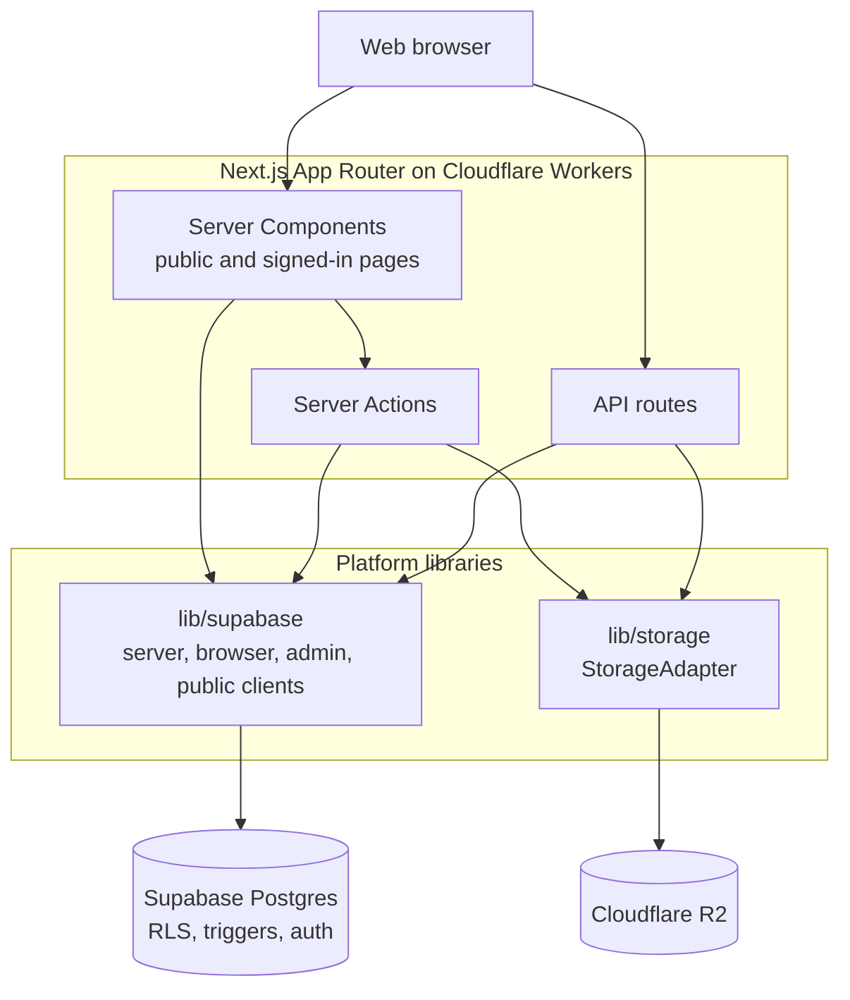

OZEAON is the web application behind the OZEAON ocean conservation platform. Organisations, projects and individuals publish and discuss conservation work in one place. It is a single Next.js App Router app running on Cloudflare Workers, with Supabase for data and auth, and Cloudflare R2 for files.

## Features

- **Accounts:** sign up, sign in, email verification, password reset, profile settings, switching between a personal account and an organisation account, and account deletion. See [Auth Flows](../../auth-and-accounts/auth-flows/) and [Account Switching & Active Account](../../auth-and-accounts/account-switching/).
- **Organisations:** public profiles, members and roles, invitations and join requests, and organisation deletion. See [Organisation Profiles, Membership & Roles](../../organisations/organisations/).
- **Projects:** multi-section project pages, drafts and publishing, My Projects, and deletion. See [Project Lifecycle & Discovery](../../projects/projects/).
- **Articles:** a Tiptap-based editor, publishing, My Articles and a reader view. See [Article Authoring & Publishing](../../articles/articles-authoring/) and [Article Reader Experience](../../articles/articles-reader/).
- **Posts:** a community feed with image attachments and reposts. See [Posts](../../posts/posts/).
- **Comments** on posts, projects and articles, and **likes** on posts and comments. See [Comments & Reactions](../../community/comments-and-reactions/).
- **Search:** name and title search across organisations, projects, articles and people. See [Search & Discovery](../../community/search/).
- **Automated moderation:** content is checked with the OpenAI moderation API before it publishes. See [Content Moderation Pipeline](../../moderation/moderation/).
- **Founding-member (alpha) badges** for users and organisations created before the alpha cutoff. See [Founding Member Badges](../../profiles/founding-member-badges/).
- **UN SDG tagging** on projects and articles.

In progress: notifications (behind the `NEXT_PUBLIC_FEATURE_NOTIFICATIONS` flag), legal pages, and in-feed filters on the article and project feeds.

## Roadmap

Planned work includes:
- pods and DAO governance
- a token reward system
- project funding, donations and tipping
- an educational resources hub with quizzes
- events
- messaging
- notes and bookmarks
- connections and blocking
- search across every content type

The database schema already contains tables for several of these, such as `pods`, `dao_proposals`, `token_transactions`, `educational_resources`, `events`, `bookmark_folders` and `open_calls`. These tables have no application features behind them yet. A few API routes also exist with no UI calling them: `/api/connections`, `/api/blocks` and `/api/events`. [Data Model & Database Schema](../../architecture/data-model-and-schema/) lists the placeholder tables.

## Architecture

The decisions that shape the codebase:

- **The Supabase client decides how a route renders.** Public pages that use only `createPublicClient()` prerender statically. Anything that calls `await createClient()` reads cookies and renders dynamically. Rendering is never set with `dynamic`/`revalidate` exports. See [SSR, Rendering & Caching](../../architecture/ssr-rendering-and-caching/) and [Supabase Client Patterns](../../architecture/supabase-client-patterns/).
- **Postgres does the deterministic work.** Row-Level Security handles authorization, and triggers maintain counters, audit timestamps and cascades. See [Data Model & Database Schema](../../architecture/data-model-and-schema/).
- **Types are derived from the generated Supabase types.** See [Type System & Generated Types](../../architecture/type-system/).
- **All file access goes through `StorageAdapter`**, not the raw R2 binding. See [Storage Abstraction & R2 Integration](../../storage/storage-r2/).
- **It deploys to Cloudflare Workers through OpenNext.** Every PR gets its own preview Worker and Supabase branch. See [Cloudflare Deployment](../../operations/cloudflare-deployment/) and [CI/CD Workflows](../../operations/ci-cd-workflows/).

## Where to Go Next

- [Getting Started & Local Setup](../getting-started/): run the app locally.
- [Technology Stack & Scripts](../technology-stack/): the libraries in use and the pnpm scripts.
- [Coding Conventions & Linting Rules](../../developer-guide/conventions-and-linting/): the rules contributors follow.
- [Adding a New Feature End-to-End](../../developer-guide/adding-a-feature/): a worked path through the layers.

## Related Links

- [README.md](https://github.com/ozeaon/ozeaon-v2/blob/0a4f1a95824db87782f1221a4108019d174df3d9/README.md): product vision and live environments.
- [CLAUDE.md](https://github.com/ozeaon/ozeaon-v2/blob/0a4f1a95824db87782f1221a4108019d174df3d9/CLAUDE.md): engineering conventions and commands.
- [docs/](https://github.com/ozeaon/ozeaon-v2/tree/0a4f1a95824db87782f1221a4108019d174df3d9/docs): in-repo deep dives on deployment, R2, the component library and the design system.
- Live: [ozeaon.com](https://ozeaon.com) (landing), [app.ozeaon.com](https://app.ozeaon.com) (production), [app.ozeaon.dev](https://app.ozeaon.dev) (staging).
