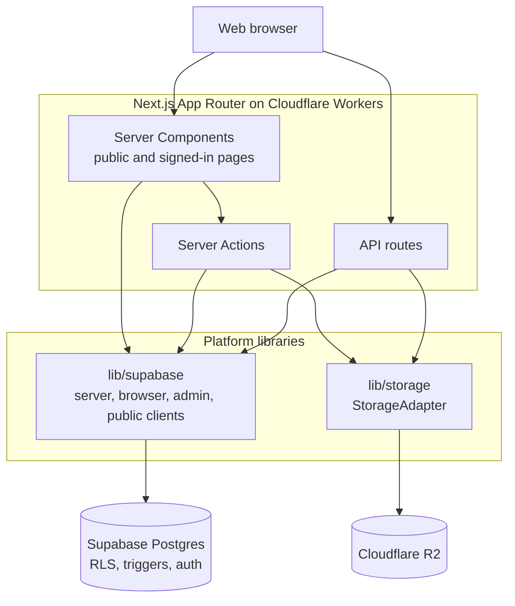

OZEAON V2 is the web application behind the OZEAON ocean conservation platform. Organizations, projects and individuals publish and discuss conservation work in one place. It is a single Next.js App Router app running on Cloudflare Workers, with Supabase for data and auth and Cloudflare R2 for files.

## What Is Built

These areas are live in the codebase today:

- **Accounts:** sign up, sign in, email verification, password reset, profile settings, switching between a personal account and an organization account, and account hard deletion. See [Authentication Flows & Pages](../../auth-and-accounts/auth-flows/) and [Account Switching & Active Account](../../auth-and-accounts/account-switching/).
- **Organizations:** public profiles, members and roles, invitations and join requests, and organization hard deletion. See [Organization Profiles, Membership & Roles](../../features/organizations/).
- **Projects:** multi-section project pages, drafts and publishing, My Projects, and hard deletion. See [Project Lifecycle & Discovery](../../features/projects/).
- **Articles:** a Tiptap-based authoring flow, publishing, My Articles, and a reader view. See [Article Authoring & Publishing](../../features/articles-authoring/) and [Article Reader Experience](../../features/articles-reader/).
- **Posts:** a community feed with attachments and reposts. See [Posts Feed & Post Creation](../../features/posts/).
- **Comments and likes** on posts, projects and articles. See [Comments & Reactions](../../features/comments-and-reactions/).
- **Automated moderation:** content is checked with the OpenAI moderation API before it publishes. See [Content Moderation Pipeline](../../moderation-and-storage/moderation/).
- **Alpha badges** for users and organizations created during the alpha.
- **UN SDG tagging** on projects and articles.

These are **in progress**: notifications (first release), legal pages, and in-feed filters on the article and project feeds.

## What Is Planned

The repository README describes the full product vision: pods, DAO governance, a token reward system, project funding and donations, an educational hub with quizzes, and API access for mobile apps and third parties. **None of that is built yet.** It is roadmap work, tracked in the internal product roadmap.

Some of it already has tables in the database schema, for example `pods`, `dao_proposals`, `token_transactions`, `educational_resources`, `events`, `bookmark_folders` and `open_calls`. Treat those as placeholders. A table existing does not mean the feature ships. [Data Model & Database Schema](../../architecture/data-model-and-schema/) marks which tables back live features.

## Architecture

The decisions that shape the codebase:

- **The Supabase client decides how a route renders.** Public pages that only use `createPublicClient()` prerender statically. Anything that calls `await createClient()` reads cookies and becomes dynamic. The project does not use manual `dynamic`/`revalidate` directives. See [SSR, Rendering Model & Caching](../../architecture/ssr-rendering-and-caching/) and [Supabase Client Patterns](../../architecture/supabase-client-patterns/).
- **Postgres does the deterministic work.** Row-Level Security covers authorization, and triggers handle counters, audit timestamps and cascades. See [Data Model & Database Schema](../../architecture/data-model-and-schema/).
- **Types are derived from the generated Supabase types**, never written by hand. See [Type System & Generated Types](../../architecture/type-system/).
- **All file access goes through `StorageAdapter`**, never the raw R2 binding. See [Storage Abstraction & R2 Integration](../../moderation-and-storage/storage-r2/).
- **It deploys to Cloudflare Workers through OpenNext**, and every PR gets its own preview Worker and Supabase branch. See [Cloudflare Deployment (OpenNext & Wrangler)](../../operations/cloudflare-deployment/) and [CI/CD Workflows & Preview Deployments](../../operations/ci-cd-workflows/).

## Where to Go Next

- [Getting Started & Local Setup](../getting-started/): run the app locally.
- [Technology Stack & Scripts](../technology-stack/): the libraries in use and the pnpm scripts.
- [Coding Conventions & Linting Rules](../../developer-guide/conventions-and-linting/): the rules contributors are expected to follow.
- [Adding a New Feature End-to-End](../../developer-guide/adding-a-feature/): a worked path through the layers.

## Related Links

- [README.md](https://github.com/ozeaon/ozeaon-v2/blob/0a4f1a95824db87782f1221a4108019d174df3d9/README.md): product vision and live environments. Much of its feature list is roadmap.
- [CLAUDE.md](https://github.com/ozeaon/ozeaon-v2/blob/0a4f1a95824db87782f1221a4108019d174df3d9/CLAUDE.md): engineering conventions and commands.
- [docs/](https://github.com/ozeaon/ozeaon-v2/tree/0a4f1a95824db87782f1221a4108019d174df3d9/docs): in-repo deep dives (deployment, R2, component library, design system).
- Live: [ozeaon.com](https://ozeaon.com) (landing), [app.ozeaon.com](https://app.ozeaon.com) (production), [app.ozeaon.dev](https://app.ozeaon.dev) (staging).
