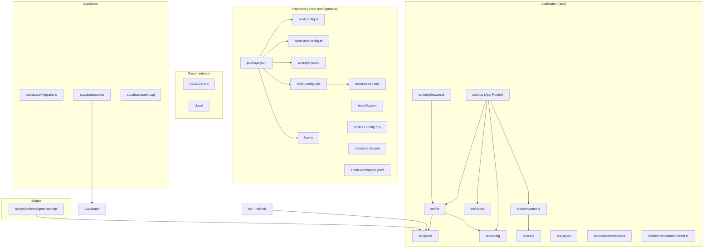
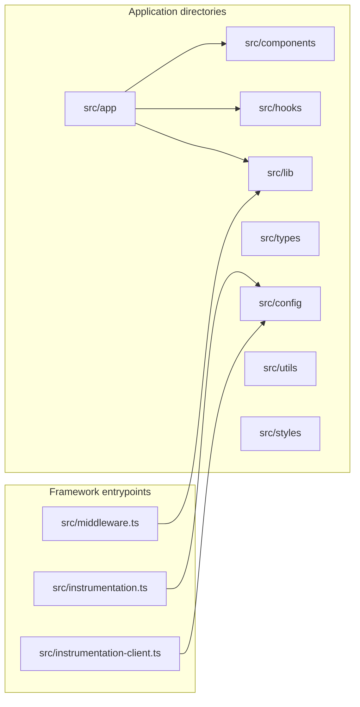
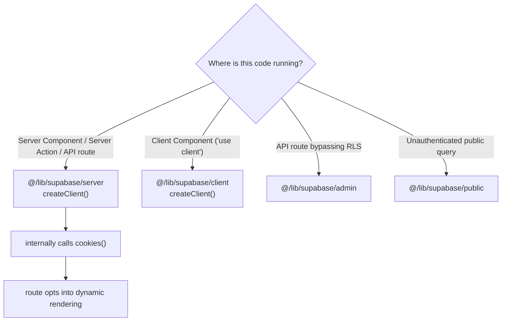
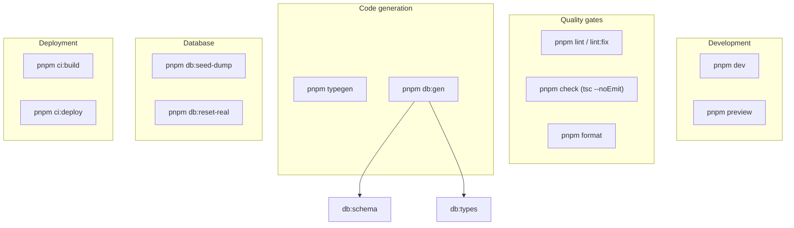
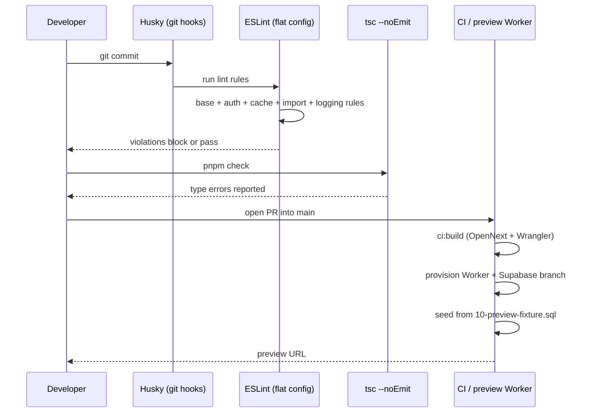

OZEAON V2 is a full-stack ocean conservation platform built with Next.js (App Router), Supabase, TypeScript, and Tailwind CSS. This page documents how the repository is laid out, which files serve which purpose, and the conventions that govern code organization, imports, typing, and tooling.

## Purpose and Scope

This page is the orientation map for the codebase. It covers:

- The top-level repository layout (root configuration files and their roles)
- The `src/` application tree and the responsibilities of each major directory
- Codified conventions: import paths, Supabase client selection, type derivation, and component library reuse
- The toolchain and command surface that enforce those conventions (ESLint, TypeScript, Prettier, Husky, OpenNext/Wrangler)

It intentionally does **not** deep-dive into individual features. For specific subsystems, consult the sibling catalog pages:

- Deployment and Cloudflare ops → see the deployment/ops pages
- Database schema and triggers → see the database/schema pages
- Design system, typography, and color tokens → see the design-system pages
- R2 object storage → see the storage page

## Overview

The repository is a **single-package application**, not a monorepo, despite shipping a `pnpm-workspace.yaml`. It targets a **Cloudflare Workers runtime** via the OpenNext adapter, which is the single most consequential structural constraint: any code that runs on the server must be compatible with the Workers runtime (no Node.js APIs, no filesystem access at request time).

Three structural ideas drive the layout:

1. **Route-centric application code.** All routeable code lives under `src/app` using the Next.js App Router convention. There is no separate `pages/` directory.
2. **Configuration as data.** Environment variables, image rules, and other tunables are funneled through `src/config` rather than being read ad hoc from `process.env`.
3. **Derived types over hand-written types.** The database row/insert/update shapes are generated into `src/types/supabase.ts` and everything else derives from them.

The `CLAUDE.md` file at the repository root is the authoritative conventions document for this repository. It is written as an agent-guidance file, but its content is equally valid as onboarding documentation for human contributors, and the sections below trace directly back to it.

## Architecture

The diagram below shows the top-level repository layout and how the root configuration files relate to the application tree. Every node corresponds to a real file or directory.



The root configuration files are all referenced from `package.json` scripts, which means the command surface in `package.json` is the practical entry point to understanding the toolchain. The `eslint.config.mjs` file was split into modular rule files (`eslint.rules.auth.mjs`, `eslint.rules.base.mjs`, `eslint.rules.cache.mjs`, `eslint.rules.import.mjs`, `eslint.rules.logging.mjs`) so that each concern — auth guards, caching correctness, import boundaries, and logging — can be reasoned about and extended independently.

## Top-Level File Responsibilities

| File | Role |
| --- | --- |
| `package.json` | Package manifest, dependency pins, and the entire command surface (`dev`, `build`, `lint`, `check`, `db:*`, `ci:*`) |
| `next.config.ts` | Next.js framework configuration; also the wiring point for the OpenNext/Cloudflare adapter |
| `open-next.config.ts` | OpenNext adapter configuration for Cloudflare Workers deployment |
| `wrangler.jsonc` | Cloudflare Workers configuration — bindings, environments (`staging`/`production`), and the `services` block that `WORKER_SELF_REFERENCE` depends on |
| `tsconfig.json` | TypeScript configuration, including the `@/*` path alias that makes `@/lib`, `@/components`, etc. resolvable |
| `eslint.config.mjs` | Flat-config entry point that composes the modular rule files |
| `eslint.rules.*.mjs` | Per-concern lint rules: auth, base, cache, import boundaries, logging |
| `postcss.config.mjs` | PostCSS pipeline for Tailwind CSS v4 |
| `components.json` | shadcn/ui generator configuration; drives where generated primitives land |
| `pnpm-workspace.yaml` | Workspace declaration (pnpm is the only supported package manager) |
| `CLAUDE.md` | The repository conventions document — project overview, workflow rules, client patterns, import conventions |
| `DESIGN-CONSISTENCY-PLAN.md` | Design-consistency initiative notes |
| `README.md` | Entry-point readme |

> Sources:
> - [package.json](https://github.com/ozeaon/ozeaon-v2/blob/0a4f1a95824db87782f1221a4108019d174df3d9/package.json#L1-L28)
> - [CLAUDE.md](https://github.com/ozeaon/ozeaon-v2/blob/0a4f1a95824db87782f1221a4108019d174df3d9/CLAUDE.md#L46-L57)
> - [CLAUDE.md](https://github.com/ozeaon/ozeaon-v2/blob/0a4f1a95824db87782f1221a4108019d174df3d9/CLAUDE.md#L237-L251)

## The `src/` Application Tree

All application code lives under `src/`. The entry points at the top of `src/` are framework-level hooks rather than application features:



### Directory responsibilities

| Path | Responsibility |
| --- | --- |
| `src/app` | Next.js App Router tree — routes, layouts, pages, route handlers, metadata. Server Components by default. |
| `src/components` | Shared UI. Domain-specific cards live in per-domain `cards/` subdirectories, e.g. `@/components/posts/cards`, `@/components/articles/cards`. |
| `src/hooks` | React hooks, re-exported through a barrel (`@/hooks`). |
| `src/lib` | Infrastructure clients and adapters. Contains the four Supabase client factories (`supabase/server`, `supabase/client`, `supabase/admin`, `supabase/public`) and `storage/adapter`. |
| `src/config` | Centralized configuration and tunables, including `env` and `IMAGE_CONFIG`, exported from `@/config`. |
| `src/utils` | Pure helpers, e.g. `validateFileType`, `generateUniqueKey`. shadcn utilities live under `@/utils/shadcn/utils`. |
| `src/types` | Domain and generated types. `src/types/supabase.ts` is machine-generated; domain types are hand-authored but must derive from generated ones. |
| `src/styles` | Design-system token definitions — `src/styles/typography.css` and `src/styles/globals.css`. |
| `src/middleware.ts` | Edge middleware: session refresh and route protection. |
| `src/instrumentation.ts` / `src/instrumentation-client.ts` | Server-side and client-side instrumentation hooks (observability/logging bootstrap). |

> Sources:
> - [CLAUDE.md](https://github.com/ozeaon/ozeaon-v2/blob/0a4f1a95824db87782f1221a4108019d174df3d9/CLAUDE.md#L148-L161)
> - [CLAUDE.md](https://github.com/ozeaon/ozeaon-v2/blob/0a4f1a95824db87782f1221a4108019d174df3d9/CLAUDE.md#L164-L197)
> - [CLAUDE.md](https://github.com/ozeaon/ozeaon-v2/blob/0a4f1a95824db87782f1221a4108019d174df3d9/CLAUDE.md#L253-L258)

### `supabase/` and `scripts/`

Database and codegen assets sit outside `src/`:

- `supabase/migrations/` — SQL migrations (the source of truth for schema)
- `supabase/seeds/00-truncate.sql` and `supabase/seeds/10-preview-fixture.sql` — the truncate helper and the preview fixture used to seed per-PR preview branches
- `supabase/seed.sql` — a real data dump produced by `pnpm db:seed-dump` and consumed by `pnpm db:reset-real`
- `scripts/schema/generate.mjs` — the schema generator invoked by `pnpm db:schema`; `pnpm db:gen` chains schema generation with Supabase type generation

A critical convention: **a migration that changes what the preview fixture writes must update the fixture in the same PR**, because every pull request into `main` provisions its own Worker and Supabase branch seeded from `supabase/seeds/10-preview-fixture.sql`.

> Sources:
> - [package.json](https://github.com/ozeaon/ozeaon-v2/blob/0a4f1a95824db87782f1221a4108019d174df3d9/package.json#L23-L27)
> - [CLAUDE.md](https://github.com/ozeaon/ozeaon-v2/blob/0a4f1a95824db87782f1221a4108019d174df3d9/CLAUDE.md#L231-L233)

## Conventions

The repository treats conventions as enforceable rules rather than style preferences. The subsections below document the ones with the highest blast radius.

### Import conventions

Path aliases are centralized through the `@/*` mapping in `tsconfig.json`. The canonical import shapes are:

```typescript
import { useAuth } from "@/hooks"; // barrel exports
import { env, IMAGE_CONFIG } from "@/config";
import { validateFileType, generateUniqueKey } from "@/utils";
import { createClient } from "@/lib/supabase/server"; // explicit Supabase client imports
import { cn } from "@/utils/shadcn/utils";
import type { Tables, TablesInsert, TablesUpdate } from "@/types/supabase";
```

> Source: [CLAUDE.md](https://github.com/ozeaon/ozeaon-v2/blob/0a4f1a95824db87782f1221a4108019d174df3d9/CLAUDE.md#L150-L157)

Three rules follow from this:

1. **Barrel exports for `hooks`, `config`, and `utils`.** `src/hooks` exposes a barrel so consumers import `@/hooks`, not deep paths.
2. **Supabase clients are always imported explicitly** by module path (`@/lib/supabase/server`, `@/lib/supabase/client`, `@/lib/supabase/admin`, `@/lib/supabase/public`) — never re-exported through a generic barrel. This is deliberate: the choice of client is a security-relevant decision (RLS enforcement vs. bypass), so it should be visible at the import site.
3. **Domain cards come from `cards/` subdirectories**, e.g. `@/components/posts/cards` and `@/components/articles/cards`, rather than from a monolithic component barrel.

### Supabase client selection

Server rendering in this stack hinges on which Supabase client you construct. The mapping is:



The design intent is worth stating explicitly: with `cacheComponents: false` (the current setting), `await createClient()` from `@/lib/supabase/server` internally calls `cookies()`, and calling `cookies()` is what automatically opts a route into dynamic rendering. There is therefore no need for the legacy dynamic-rendering directives — and those directives are banned:

> Never use old model directives (`export const dynamic`/`revalidate`/`fetchCache`/`runtime`).

A second, easily-missed rule: **never call `createClient()` after `getAuthUser()` or `getAuthUserOrRedirect()`**. Both helpers already return a `supabase` client memoized by React `cache()` for the request, so calling `createClient()` again constructs a redundant second client.

```typescript
// ❌ Wrong — two clients for one request
const supabase = await createClient();
const { user } = await getAuthUserOrRedirect();

// ✅ Correct — reuse the client from auth
const { user, supabase } = await getAuthUserOrRedirect();
```

The same rule applies to route handlers wrapped in `withAuthUser`, which receive `supabase` through their context object:

```typescript
// ❌ Wrong
export const POST = withAuthUser(async (req, { user }) => {
  const supabase = await createClient();
  ...
});

// ✅ Correct
export const POST = withAuthUser(async (req, { user, supabase }) => {
  ...
});
```

> Sources:
> - [CLAUDE.md](https://github.com/ozeaon/ozeaon-v2/blob/0a4f1a95824db87782f1221a4108019d174df3d9/CLAUDE.md#L82-L122)
> - [CLAUDE.md](https://github.com/ozeaon/ozeaon-v2/blob/0a4f1a95824db87782f1221a4108019d174df3d9/CLAUDE.md#L9-L21)

For client components, the inverse rule holds — create a fresh client per call, never cache one globally:

```typescript
// Client Component
"use client";
// ⚠️ Create fresh per request, never cache globally Client Component
import { createClient } from "@/lib/supabase/client";

const supabase = createClient();
```

> Source: [CLAUDE.md](https://github.com/ozeaon/ozeaon-v2/blob/0a4f1a95824db87782f1221a4108019d174df3d9/CLAUDE.md#L124-L131)

### Type system: derive, never hand-roll

`src/types/supabase.ts` is generated by Supabase's type generator (`pnpm db:types`, wrapped by `pnpm db:gen`). Every domain type must be derived from the generated `Tables`, `TablesInsert`, and `TablesUpdate` helpers rather than written by hand:

```typescript
type Project = Tables<"projects">; // full row
type Slug = Pick<Tables<"resource_subcategories">, "id" | "name" | "slug">; // projection
type Comment = Tables<"comments"> & { author: UserProfileForJoin }; // join
type Article = Omit<Tables<"articles">, "article_type"> & {
  // FK override
  article_type: { id: number; type: string } | null;
};
const insert: TablesInsert<"projects"> = { title, slug, created_by: user.id }; // mutation
```

> Source: [CLAUDE.md](https://github.com/ozeaon/ozeaon-v2/blob/0a4f1a95824db87782f1221a4108019d174df3d9/CLAUDE.md#L168-L177)

Two organizational rules accompany this: **domain types live in `src/types/`** and are never defined inside component files; and when a signed type is wrong, the fix is to correct the schema and regenerate, not to cast. The related quality rule is that validation boundaries must line up field-for-field across Zod schemas, DB types, and props (the documented failure example is `author_name` vs `display_name`).

### Component library reuse

The repository maintains a documented component library, and the convention is that a primitive which already exists must not be reimplemented as raw markup. The primitives most often reinvented — and therefore most worth memorizing — are:

| Primitive | Must not be replaced with |
| --- | --- |
| `EmptyState` | a raw centered `<div>` |
| `GridLayout` | raw `grid` utility classes |
| `Button` / `LoadingButton` | custom markup; icons go through the `iconLeft`/`iconRight` props, never JSX children |
| `ConfirmDialog` | `window.confirm()` |

Additionally, **raw Tailwind size and color utilities are banned** in favor of named design tokens defined in `src/styles/typography.css` and `src/styles/globals.css`. This is what makes theme changes tractable and is enforced by the Tailwind lint plugin.

> Sources:
> - [CLAUDE.md](https://github.com/ozeaon/ozeaon-v2/blob/0a4f1a95824db87782f1221a4108019d174df3d9/CLAUDE.md#L183-L197)

### Database logic placement

Deterministic side-effects of a row state change — audit timestamps, cascading inserts, denormalised counters, invariant enforcement — must be implemented as **PostgreSQL triggers**, never in API routes or Server Actions. The stated reasoning is that these are properties of the data, so placing them in the database makes them hold regardless of which code path mutates the row.

> Source: [CLAUDE.md](https://github.com/ozeaon/ozeaon-v2/blob/0a4f1a95824db87782f1221a4108019d174df3d9/CLAUDE.md#L211-L217)

### Server action and API route conventions

- **API routes** authenticate with `supabase.auth.getUser()` and return `401` when there is no user. Insert shapes use `TablesInsert<"table">`. Status codes are `201` on create, `400` for validation failures, `500` for errors.
- **Server Actions** must verify ownership by scoping mutations with `.eq("user_id", user.id)`, and must call `revalidateTag(...)` after writes.

> Source: [CLAUDE.md](https://github.com/ozeaon/ozeaon-v2/blob/0a4f1a95824db87782f1221a4108019d174df3d9/CLAUDE.md#L140-L144)

## Toolchain and Command Surface

The command surface in `package.json` is partitioned into five groups. Understanding the grouping explains which script to reach for.



| Command | Description |
| --- | --- |
| `pnpm dev` | Start the dev server |
| `pnpm build` | Production Next.js build |
| `pnpm lint` / `pnpm lint:fix` | Run ESLint / with auto-fix |
| `pnpm check` | Type check via `tsc --noEmit` |
| `pnpm format` | Format with Prettier |
| `pnpm typegen` | Generate Next.js route types + Cloudflare env types |
| `pnpm db:gen` | Generate Supabase DB schema types (run after migrations) |
| `pnpm db:seed-dump` | Dump remote data to `supabase/seed.sql` |
| `pnpm db:reset-real` | Load the real dump instead of the preview fixture |
| `pnpm preview` | Preview the Cloudflare deployment locally |
| `pnpm ci:build` | Production build with the Cloudflare adapter |
| `pnpm ci:deploy` | Deploy to Cloudflare |
| `pnpm clean-cache` | Clean all build caches |

> Sources:
> - [CLAUDE.md](https://github.com/ozeaon/ozeaon-v2/blob/0a4f1a95824db87782f1221a4108019d174df3d9/CLAUDE.md#L61-L79)
> - [package.json](https://github.com/ozeaon/ozeaon-v2/blob/0a4f1a95824db87782f1221a4108019d174df3d9/package.json#L8-L28)

### Required environment and deployment convention

Environment variables are validated centrally in `src/config/env.ts`; a missing required variable is a startup failure rather than a runtime surprise. On the deployment side, `pnpm ci:deploy` **must** be invoked with an explicit `--env staging` or `--env production`. The reasoning is structural: the top-level `wrangler.jsonc` has no `services` block, so omitting `--env` breaks `WORKER_SELF_REFERENCE`.

> Source: [CLAUDE.md](https://github.com/ozeaon/ozeaon-v2/blob/0a4f1a95824db87782f1221a4108019d174df3d9/CLAUDE.md#L221-L233)

## Enforcement: How Conventions Are Kept True

Conventions in this repository are backed by automated gates so that drift is caught mechanically rather than in review.



### ESLint as an architectural constraint

`eslint.config.mjs` composes five concern-specific rule files. Each corresponds to a class of bug that the architecture makes easy to introduce:

| Rule file | Concern it guards |
| --- | --- |
| `eslint.rules.base.mjs` | Baseline correctness and style |
| `eslint.rules.auth.mjs` | Correct authentication usage (e.g. the Supabase client selection rules) |
| `eslint.rules.cache.mjs` | Caching correctness — guards the dynamic-rendering model and forbids the legacy directives |
| `eslint.rules.import.mjs` | Import boundaries — enforces explicit Supabase client imports over barrel re-exports and keeps `src/types` out of component files |
| `eslint.rules.logging.mjs` | Structured logging discipline via LogTape |

The presence of a dedicated `cache` rule file is the clearest signal of architectural intent: the render-mode contract (`createClient()` → `cookies()` → dynamic) is important enough to be lint-enforced rather than left to documentation.

> Source: [CLAUDE.md](https://github.com/ozeaon/ozeaon-v2/blob/0a4f1a95824db87782f1221a4108019d174df3d9/CLAUDE.md#L9-L21)

### The TypeScript auto-validation loop

A Stop hook performs incremental `tsc --noEmit` whenever `.ts`/`.tsx` files were edited and **blocks completion** if errors remain, forcing a fix loop. This means "type checking is green" is a property of the working state rather than something the developer remembers to verify (`pnpm check` remains available for manual runs). The convention that makes this loop productive is the field-name rule: verify that the fix resolves the **exact** error, and check that field names match across Zod schemas, DB types, and props.

> Source: [CLAUDE.md](https://github.com/ozeaon/ozeaon-v2/blob/0a4f1a95824db87782f1221a4108019d174df3d9/CLAUDE.md#L38-L42)

## Failure Modes and Edge Cases

The repository layout creates a handful of recurring failure modes. Each has an explicit convention that exists to prevent it.

| Failure mode | Root cause | Convention that prevents it |
| --- | --- | --- |
| Route unexpectedly becomes dynamic | Using `createPublicClient()` or the admin client in a component that also renders user-specific state | Use `createClient()` for user-specific data; reserve public/admin clients for genuinely public or RLS-bypassing paths |
| Duplicate Supabase clients per request | Calling `createClient()` after `getAuthUser()`/`getAuthUserOrRedirect()`, or inside a `withAuthUser` handler | Reuse the memoized `supabase` returned by the auth helper or ctx |
| Type drift between DB and code | Hand-written types diverging from the schema | Derive all types from generated `Tables`/`TablesInsert`/`TablesUpdate`; regenerate with `pnpm db:gen` after migrations |
| Preview environment breakage | A migration changes what the fixture writes but the fixture is not updated | Update `supabase/seeds/10-preview-fixture.sql` in the same PR |
| Deploy failure on `WORKER_SELF_REFERENCE` | `ci:deploy` invoked without an `--env` flag | Always pass `--env staging` or `--env production` |
| Workers runtime crash | Using Node.js APIs or filesystem access in server code | Target the Workers runtime; `pnpm ci:build` surfaces incompatibilities before deploy |
| Browser API crash during SSR | `document`/`window` referenced in a server component or at module level | Never use browser APIs in server components or at module scope |

> Sources:
> - [CLAUDE.md](https://github.com/ozeaon/ozeaon-v2/blob/0a4f1a95824db87782f1221a4108019d174df3d9/CLAUDE.md#L9-L21)
> - [CLAUDE.md](https://github.com/ozeaon/ozeaon-v2/blob/0a4f1a95824db87782f1221a4108019d174df3d9/CLAUDE.md#L98-L122)
> - [CLAUDE.md](https://github.com/ozeaon/ozeaon-v2/blob/0a4f1a95824db87782f1221a4108019d174df3d9/CLAUDE.md#L227-L233)

## Working in This Repository: Practical Guidance

A few process rules are worth internalizing because they shape how work should be sequenced:

- **Diagnose root cause before editing files.** If the task is to "understand", "analyze", "explore", "check", or "review", the expected output is analysis, not edits.
- **For changes touching 4 or more files, use parallel task agents** (and ask before proceeding sequentially on a large refactor).
- **Read the framework's own docs before touching routes, layouts, metadata, caching, or Supabase-in-SSR code.** The bundled Next.js documentation under `node_modules/next/dist/docs/` (index, `01-app` App Router, `03-architecture`) is treated as authoritative over general knowledge, because this Next.js version has breaking changes relative to common training data — notably that `cookies()` and `headers()` are async.
- **Ignore build artifacts and lockfiles when exploring.** The excluded paths are `.open-next/**`, `.wrangler/**`, `.next/**`, `node_modules/**`, and `*.lock`.

> Sources:
> - [CLAUDE.md](https://github.com/ozeaon/ozeaon-v2/blob/0a4f1a95824db87782f1221a4108019d174df3d9/CLAUDE.md#L23-L27)
> - [CLAUDE.md](https://github.com/ozeaon/ozeaon-v2/blob/0a4f1a95824db87782f1221a4108019d174df3d9/CLAUDE.md#L31-L34)
> - [CLAUDE.md](https://github.com/ozeaon/ozeaon-v2/blob/0a4f1a95824db87782f1221a4108019d174df3d9/CLAUDE.md#L246-L266)

### Version-sensitivity warnings

Exact versions drift, so `package.json` is the source of truth rather than any copied version table. The breaking changes that actually change how code must be written are:

| Technology | Breaking change that affects code |
| --- | --- |
| Next.js 16 (`next: ^16.3.5`) | `cookies()` / `headers()` are async — a breaking change from v14 |
| Zod 4 (`zod: ^4.6.5`) | v3 APIs are deprecated; do not use them |
| Tailwind CSS 4 (`tailwindcss: ^4.3.3`) | Config format differs from v3 — do not reach for a `tailwind.config.js` pattern |
| Package manager | **pnpm only** — never `npm` or `yarn` |
| React 19 (`react: ^19.3.0`) | Pairs with the async request-API model above |

> Sources:
> - [package.json](https://github.com/ozeaon/ozeaon-v2/blob/0a4f1a95824db87782f1221a4108019d174df3d9/package.json#L73-L91)
> - [CLAUDE.md](https://github.com/ozeaon/ozeaon-v2/blob/0a4f1a95824db87782f1221a4108019d174df3d9/CLAUDE.md#L51-L57)

## Extension Points

The repository exposes several deliberate extension seams:

- **ESLint rule modules.** Adding a new architectural constraint means adding an `eslint.rules.<concern>.mjs` file and composing it in `eslint.config.mjs`, keeping rules independently reviewable.
- **Supabase client factories.** `src/lib/supabase/{server,client,admin,public}` is the single seam for data access; changing how requests are authenticated or scoped happens there.
- **Storage adapter.** All object storage goes through `StorageAdapter` in `src/lib/storage/adapter` — never the raw R2 binding or an S3-compatible client. This makes the storage backend swappable and keeps upload/URL/delete behavior in one place.
- **Config module.** `src/config` is the seam for tunables (`env`, `IMAGE_CONFIG`), so new configuration is added there rather than read from `process.env` at call sites.
- **Database triggers.** New deterministic data logic is added as migrations in `supabase/migrations/`, following the project's trigger security convention (`SECURITY DEFINER`, explicit `search_path`, revoke grants).
- **Cache model migration path.** When the feature set is stable, the project intends to adopt `cacheComponents` — the newer Next.js cache model — replacing the current `createClient()`/`cookies()` dynamic-rendering approach.

> Sources:
> - [CLAUDE.md](https://github.com/ozeaon/ozeaon-v2/blob/0a4f1a95824db87782f1221a4108019d174df3d9/CLAUDE.md#L11-L13)
> - [CLAUDE.md](https://github.com/ozeaon/ozeaon-v2/blob/0a4f1a95824db87782f1221a4108019d174df3d9/CLAUDE.md#L133-L136)
> - [CLAUDE.md](https://github.com/ozeaon/ozeaon-v2/blob/0a4f1a95824db87782f1221a4108019d174df3d9/CLAUDE.md#L211-L217)

## Related Links

- [CLAUDE.md](https://github.com/ozeaon/ozeaon-v2/blob/0a4f1a95824db87782f1221a4108019d174df3d9/CLAUDE.md) — the authoritative conventions document for this repository
- [package.json](https://github.com/ozeaon/ozeaon-v2/blob/0a4f1a95824db87782f1221a4108019d174df3d9/package.json) — dependencies, version pins, and the complete command surface
- [tsconfig.json](https://github.com/ozeaon/ozeaon-v2/blob/0a4f1a95824db87782f1221a4108019d174df3d9/tsconfig.json) — path alias configuration backing `@/*` imports
- [next.config.ts](https://github.com/ozeaon/ozeaon-v2/blob/0a4f1a95824db87782f1221a4108019d174df3d9/next.config.ts) — Next.js framework configuration
- [open-next.config.ts](https://github.com/ozeaon/ozeaon-v2/blob/0a4f1a95824db87782f1221a4108019d174df3d9/open-next.config.ts) — OpenNext adapter configuration for Cloudflare
- [wrangler.jsonc](https://github.com/ozeaon/ozeaon-v2/blob/0a4f1a95824db87782f1221a4108019d174df3d9/wrangler.jsonc) — Cloudflare Workers bindings and environments
- [eslint.config.mjs](https://github.com/ozeaon/ozeaon-v2/blob/0a4f1a95824db87782f1221a4108019d174df3d9/eslint.config.mjs) — flat-config entry point composing the modular rule files
- [eslint.rules.cache.mjs](https://github.com/ozeaon/ozeaon-v2/blob/0a4f1a95824db87782f1221a4108019d174df3d9/eslint.rules.cache.mjs) — lint enforcement of the caching/render-mode contract
- [eslint.rules.auth.mjs](https://github.com/ozeaon/ozeaon-v2/blob/0a4f1a95824db87782f1221a4108019d174df3d9/eslint.rules.auth.mjs) — lint enforcement of auth and Supabase client usage
- [components.json](https://github.com/ozeaon/ozeaon-v2/blob/0a4f1a95824db87782f1221a4108019d174df3d9/components.json) — shadcn/ui generator configuration
- [src/middleware.ts](https://github.com/ozeaon/ozeaon-v2/blob/0a4f1a95824db87782f1221a4108019d174df3d9/src/middleware.ts) — session refresh and route protection
- [src/instrumentation.ts](https://github.com/ozeaon/ozeaon-v2/blob/0a4f1a95824db87782f1221a4108019d174df3d9/src/instrumentation.ts) — server-side instrumentation bootstrap
- [src/instrumentation-client.ts](https://github.com/ozeaon/ozeaon-v2/blob/0a4f1a95824db87782f1221a4108019d174df3d9/src/instrumentation-client.ts) — client-side instrumentation bootstrap
- [scripts/schema/generate.mjs](https://github.com/ozeaon/ozeaon-v2/blob/0a4f1a95824db87782f1221a4108019d174df3d9/scripts/schema/generate.mjs) — schema generation entry point used by `pnpm db:schema`
