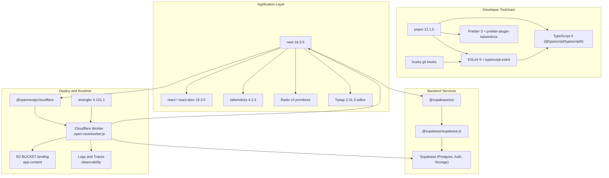
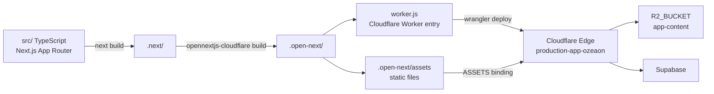

A reference for the runtime platform, framework, language toolchain, and third-party libraries that make up `ozeaon-v2`, along with where each dependency is declared and how versions are pinned.

## Purpose and Scope

This page documents the **technology stack of the Ozeaon Platform application** as declared by its repository configuration — the framework, runtime, package manager, language toolchain, build/deploy targets, and the major third-party libraries the codebase depends on.

It focuses on **what the stack is and where it is declared**, not on how individual features are implemented.

- For the application's directory layout and architectural layering, see the project structure / architecture page.
- For authentication, storage, and data-access behavior built on top of Supabase, see the respective data and auth pages.
- For CI/CD pipeline details behind `pnpm ci:build` / `pnpm ci:deploy`, see the deployment page.

Everything here is derived from the root configuration files: [`package.json`](https://github.com/ozeaon/ozeaon-v2/blob/0a4f1a95824db87782f1221a4108019d174df3d9/package.json), [`tsconfig.json`](https://github.com/ozeaon/ozeaon-v2/blob/0a4f1a95824db87782f1221a4108019d174df3d9/tsconfig.json), [`next.config.ts`](https://github.com/ozeaon/ozeaon-v2/blob/0a4f1a95824db87782f1221a4108019d174df3d9/next.config.ts), and [`wrangler.jsonc`](https://github.com/ozeaon/ozeaon-v2/blob/0a4f1a95824db87782f1221a4108019d174df3d9/wrangler.jsonc).

## Overview

`ozeaon-v2` is a **Next.js App Router application written in TypeScript**, deployed as a **Cloudflare Worker** through the **OpenNext Cloudflare adapter**, backed by **Supabase** for database/auth/storage, and hosted on **Cloudflare R2** for object storage. The package manifest identifies it as `ozeaon-v2`, version `0.1.0`, described as the "Main repository for Ozeaon Platform source code" and marked `private` with ESM (`"type": "module"`).

The stack is organized into four distinct planes:

| Plane | Technology | Declared in |
|-------|-----------|-------------|
| Application framework | Next.js 16 (App Router) + React 19 | [`package.json`](https://github.com/ozeaon/ozeaon-v2/blob/0a4f1a95824db87782f1221a4108019d174df3d9/package.json#L73-L79) |
| Language / toolchain | TypeScript (via `@typescript/typescript6`), ESLint 9 flat config, Prettier 3 | [`package.json`](https://github.com/ozeaon/ozeaon-v2/blob/0a4f1a95824db87782f1221a4108019d174df3d9/package.json#L104-L121) |
| Deploy / runtime | Cloudflare Workers + OpenNext adapter, Wrangler | [`wrangler.jsonc`](https://github.com/ozeaon/ozeaon-v2/blob/0a4f1a95824db87782f1221a4108019d174df3d9/wrangler.jsonc), [`next.config.ts`](https://github.com/ozeaon/ozeaon-v2/blob/0a4f1a95824db87782f1221a4108019d174df3d9/next.config.ts) |
| Backend services | Supabase (Postgres, Auth, Storage) + Cloudflare R2 | [`package.json`](https://github.com/ozeaon/ozeaon-v2/blob/0a4f1a95824db87782f1221a4108019d174df3d9/package.json#L53-L54), [`wrangler.jsonc`](https://github.com/ozeaon/ozeaon-v2/blob/0a4f1a95824db87782f1221a4108019d174df3d9/wrangler.jsonc#L29-L35) |

**Key concepts worth knowing up front:**

- **Edge-first deployment.** There is no Node.js server in production; `next build` output is transformed by `open-next` into `.open-next/worker.js`, which Wrangler uploads. This is why `nodejs_compat` is a required compatibility flag and why Node-only packages must be declared as `serverExternalPackages`.
- **Serverless-shape constraints.** Because the source of truth is the manifest and the Wrangler config, anything that needs native binaries or Node APIs has to be explicitly opted into.
- **Environment separation as code.** Preview, staging, and production are all defined in one `wrangler.jsonc`, each with its own Worker name, R2 bucket, and self-reference service binding.

## Architecture

The stack layers from developer tooling down to platform services. The diagram below maps the declared components and their real wiring, using the exact package and service names from the configuration files.



**How to read this diagram:**

- The **Developer Toolchain** block is entirely dev-dependency driven; none of it ships to the Worker. `husky` is installed through the `prepare` lifecycle script, so a fresh `pnpm install` wires the hooks automatically.
- The **Application Layer** is the runtime code. Next.js is the composition point: it consumes React for rendering, Tailwind for styling, Radix for accessible primitives, Tiptap for rich text, and the Supabase client packages for data.
- The **Backend Services** block is reached over the network. `@supabase/ssr` is the SSR-aware wrapper used from server components and route handlers; `@supabase/supabase-js` is the underlying client that both `supabase` CLI tooling and the SSR package build on.
- The **Deploy and Runtime** block shows the transformation path: `next build` → `open-next` → a single Worker bundle at `.open-next/worker.js` with static assets served from `.open-next/assets`, plus R2 and observability bindings declared in `wrangler.jsonc`.

## Core Framework & Language

### Next.js 16 and React 19

The application framework is `next` pinned to `16.3.5`, with `react` and `react-dom` at `^19.3.0`.

```json
"next": "16.3.5",
"obscenity": "^0.4.6",
"open-next": "^3.1.3",
"prettier": "^3.9.6",
"react": "^19.3.0",
"react-day-picker": "^10.0.1",
"react-dom": "^19.3.0",
```

> Source: [package.json](https://github.com/ozeaon/ozeaon-v2/blob/0a4f1a95824db87782f1221a4108019d174df3d9/package.json#L73-L79)

Note that `next` uses an **exact pin** (`16.3.5`) while React uses a caret range (`^19.3.0`). Pinning the framework exactly is deliberate: Next.js minor releases frequently change build output shape and bundling behavior, which matters a great deal when the output is consumed by the OpenNext → Cloudflare pipeline.

### TypeScript via an alias package

The project does **not** depend on the plain `typescript` package. Instead, `typescript` is aliased to `@typescript/typescript6`:

```json
"typescript": "npm:@typescript/typescript6@^6.0.2"
```

> Source: [package.json](https://github.com/ozeaon/ozeaon-v2/blob/0a4f1a95824db87782f1221a4108019d174df3d9/package.json#L120)

The dev dependency `@typescript/native` (`npm:typescript@^7.0.2`) is a separate entry, alongside `tsx` for running `.mjs`/TypeScript scripts directly (used by the `db:schema` script).

```json
"@typescript/native": "npm:typescript@^7.0.2",
"autoprefixer": "^10.6.0",
"baseline-browser-mapping": "^2.11.23",
"dotenv": "^17.4.2",
"eslint": "^9.39.5",
```

> Source: [package.json](https://github.com/ozeaon/ozeaon-v2/blob/0a4f1a95824db87782f1221a4108019d174df3d9/package.json#L104-L108)

### Compiler configuration

`tsconfig.json` is set up for a modern bundler-based workflow with strict checking enabled:

```json
"target": "ES2017",
"lib": ["dom", "dom.iterable", "esnext"],
"allowJs": true,
"skipLibCheck": true,
"strict": true,
"forceConsistentCasingInFileNames": true,
"noEmit": true,
"esModuleInterop": true,
"module": "esnext",
"moduleResolution": "bundler",
"moduleDetection": "force",
"resolveJsonModule": true,
"isolatedModules": true,
"jsx": "react-jsx",
"incremental": true,
"plugins": [{ "name": "next" }],
"paths": { "@/*": ["./src/*"] }
```

> Source: [tsconfig.json](https://github.com/ozeaon/ozeaon-v2/blob/0a4f1a95824db87782f1221a4108019d174df3d9/tsconfig.json#L3-L25)

Design intent behind the notable flags:

| Flag | Why it is set this way |
|------|------------------------|
| `moduleResolution: "bundler"` | Matches how Next.js resolves modules; allows omitting file extensions and supports `exports` maps. |
| `isolatedModules: true` | Each file can be transpiled independently — required because the build pipeline transpiles per-module rather than doing a whole-program compile. |
| `noEmit: true` | TypeScript never emits; Next.js owns the compilation. Type checking is a separate concern run via `pnpm check`. |
| `strict: true` | Full strictness is enforced across the codebase. |
| `paths: { "@/*": ["./src/*"] }` | Establishes the `@/` import alias used throughout `src/`. |
| `plugins: [{ name: "next" }]` | Enables Next.js' TypeScript plugin for editor integration. |

The `include` array deliberately pulls in generated declaration files, and `exclude` keeps build artifacts and SQL sources out of type checking:

```json
"include": [
  "next-env.d.ts",
  "cloudflare-env.d.ts",
  "**/*.ts",
  "**/*.tsx",
  ".next/types/**/*.ts",
  ".next/dev/types/**/*.ts"
],
"exclude": ["node_modules", ".next", ".open-next", "supabase/**"]
```

> Source: [tsconfig.json](https://github.com/ozeaon/ozeaon-v2/blob/0a4f1a95824db87782f1221a4108019d174df3d9/tsconfig.json#L27-L35)

`cloudflare-env.d.ts` is generated by the `typegen` script (`wrangler types --env-interface CloudflareEnv`), which is how the Worker's binding types (`R2_BUCKET`, `ASSETS`, `WORKER_SELF_REFERENCE`) become type-safe in application code. The `supabase/**` exclusion means SQL migrations and seeds are not type-checked by `tsc`.

## Package Management & Runtime

The project uses **pnpm** as its package manager, pinned via the `packageManager` field, and requires a specific Node.js runtime:

```json
"packageManager": "pnpm@12.1.0",
"devEngines": {
  "runtime": {
    "name": "node",
    "version": "24.20.0",
    "onFail": "download"
  }
}
```

> Source: [package.json](https://github.com/ozeaon/ozeaon-v2/blob/0a4f1a95824db87782f1221a4108019d174df3d9/package.json#L124-L131)

`devEngines.runtime.onFail: "download"` means a developer running an incorrect Node version will have the correct one (`24.20.0`) downloaded automatically rather than hitting a hard failure. Version pinning here matters because the Cloudflare Workers toolchain and OpenNext adapter are sensitive to Node version differences.

The presence of `pnpm-lock.yaml` and `pnpm-workspace.yaml` at the repository root confirms pnpm as the single source of dependency truth.

## UI & Presentation Stack

### Tailwind CSS 4

Styling uses Tailwind CSS v4, which is configured through PostCSS rather than a `tailwind.config.js`:

```json
"@tailwindcss/postcss": "^4.3.3",
"tailwindcss": "^4.3.3",
"tailwindcss-animate": "^1.0.7",
"tw-animate-css": "^1.4.0",
```

> Source: [package.json](https://github.com/ozeaon/ozeaon-v2/blob/0a4f1a95824db87782f1221a4108019d174df3d9/package.json#L97-L119)

Supporting utilities in the Tailwind/CSS layer: `@tailwindcss/typography` for prose styling, `postcss` + `autoprefixer` for the build pipeline, and `prettier-plugin-tailwindcss` to enforce consistent class ordering in formatting. The `components.json` file at the repository root indicates a component registry convention (shadcn-style) is in use.

### Radix UI primitives

Accessible, unstyled UI primitives come from a large set of `@radix-ui/react-*` packages:

```json
"@radix-ui/react-accordion": "^1.2.20",
"@radix-ui/react-avatar": "^1.2.6",
"@radix-ui/react-checkbox": "^1.3.11",
"@radix-ui/react-collapsible": "^1.1.20",
"@radix-ui/react-dialog": "^1.1.23",
"@radix-ui/react-dropdown-menu": "^2.1.24",
"@radix-ui/react-label": "^2.1.15",
"@radix-ui/react-popover": "^1.1.23",
```

> Source: [package.json](https://github.com/ozeaon/ozeaon-v2/blob/0a4f1a95824db87782f1221a4108019d174df3d9/package.json#L38-L45)

The full set also includes `radio-group`, `scroll-area`, `select`, `separator`, `slot`, `switch`, and `tooltip`. The `slot` primitive is the mechanism that lets wrapper components merge props onto a child element — standard for variants built with `class-variance-authority` and `tailwind-merge`, both of which are present:

```json
"class-variance-authority": "^0.7.1",
"client-only": "^0.0.1",
"clsx": "^2.1.1",
"cmdk": "^1.1.1",
```

> Source: [package.json](https://github.com/ozeaon/ozeaon-v2/blob/0a4f1a95824db87782f1221a4108019d174df3d9/package.json#L65-L68)

### Rich text editing

Article/comment authoring uses **Tiptap 3**:

```json
"@tiptap/core": "^3.31.3",
"@tiptap/extension-heading": "^3.31.3",
"@tiptap/extension-text-align": "^3.31.3",
"@tiptap/extension-underline": "^3.31.3",
"@tiptap/extensions": "^3.31.3",
"@tiptap/react": "^3.31.3",
"@tiptap/starter-kit": "^3.31.3"
```

> Source: [package.json](https://github.com/ozeaon/ozeaon-v2/blob/0a4f1a95824db87782f1221a4108019d174df3d9/package.json#L56-L62)

`@tiptap/pm` (ProseMirror) appears in dev dependencies, and `@tiptap/starter-kit` provides the baseline extension bundle that the individual extensions supplement.

### Forms, validation, and other UI libraries

| Package | Version | Role |
|---------|---------|------|
| `react-hook-form` | `^7.88.0` | Form state management |
| `@hookform/resolvers` | `^5.9.1` | Bridges React Hook Form with schema validators |
| `zod` | `^4.6.5` | Schema definition and validation |
| `validator` | `^13.15.35` | String-level validators (with `@types/validator`) |
| `xss` | `^1.0.15` | HTML sanitization for user-supplied rich text |
| `date-fns` | `^4.4.0` | Date utilities |
| `react-day-picker` | `^10.0.1` | Calendar/date-picker UI |
| `sonner` | `^2.0.8` | Toast notifications |
| `vaul` | `^1.1.2` | Drawer component |
| `cmdk` | `^1.1.1` | Command palette |
| `lucide-react` | `^1.45.0` | Icon set |
| `react-pdf` | `^10.5.0` | PDF rendering in the browser |
| `dnd-kit` (`core`, `sortable`, `utilities`) | `^6.3.1` / `^10.0.0` / `^3.2.2` | Drag-and-drop and sortable lists |

> Source: [package.json](https://github.com/ozeaon/ozeaon-v2/blob/0a4f1a95824db87782f1221a4108019d174df3d9/package.json#L31-L91)

Specialized libraries worth noting for their unusual scope:

- **`natural`** (`^8.1.1`) — natural language processing (tokenization, stemming, similarity) used server-side.
- **`transliteration`** (`^2.6.1`) — converts non-Latin scripts to Latin, typically for slug generation.
- **`obscenity`** (`^0.4.6`) — profanity filtering.
- **`emoji-regex-xs`** (`^2.0.1`) — emoji detection.
- **`browser-image-compression`** (`^2.0.2`) and **`react-image-crop`** (`^11.1.2`) — client-side image processing before upload.
- **`server-only`** / **`client-only`** (`^0.0.1`) — build-time guards that make a module fail to compile if imported from the wrong environment. These are the enforcement mechanism for the server/client boundary.

## Logging

Structured logging uses **LogTape**, with a redaction companion and a pretty-printer for local development:

```json
"@logtape/logtape": "2.3.4",
"@logtape/redaction": "2.3.4",
```

> Source: [package.json](https://github.com/ozeaon/ozeaon-v2/blob/0a4f1a95824db87782f1221a4108019d174df3d9/package.json#L35-L36)

```json
"@logtape/pretty": "^2.3.4",
```

> Source: [package.json](https://github.com/ozeaon/ozeaon-v2/blob/0a4f1a95824db87782f1221a4108019d174df3d9/package.json#L94)

Both runtime packages are pinned **exactly** (`2.3.4`, no caret). This is consistent with the fact that there is a dedicated ESLint rule file for logging (`eslint.rules.logging.mjs`), implying the logger's usage pattern is lint-enforced and version drift could break those rules.

## Backend Services: Supabase and Storage

The data plane is **Supabase**, reached through two client packages:

```json
"@supabase/ssr": "^0.12.7",
"@supabase/supabase-js": "^2.116.0",
```

> Source: [package.json](https://github.com/ozeaon/ozeaon-v2/blob/0a4f1a95824db87782f1221a4108019d174df3d9/package.json#L53-L54)

`@supabase/ssr` is the SSR-aware client used from server components, server actions, and route handlers; it handles cookie-based session propagation. `@supabase/supabase-js` is the base client. The `supabase` CLI (`^2.117.0`) is a runtime dependency used by the database scripts, and `@supabase/auth-js` is a dev dependency.

The database workflow is script-driven, which reveals where the schema and types actually come from:

```json
"db:schema": "node scripts/schema/generate.mjs",
"db:types": "supabase gen types typescript --local > src/types/supabase.ts && prettier --write src/types/supabase.ts",
"db:gen": "pnpm db:schema && pnpm db:types",
"db:seed-dump": "supabase db dump --data-only -f supabase/seed.sql",
"db:reset-real": "supabase db reset && DB_URL=$(supabase status --output json | jq -er '.DB_URL') && psql \"$DB_URL\" -v ON_ERROR_STOP=1 -f supabase/seeds/00-truncate.sql -f supabase/seed.sql"
```

> Source: [package.json](https://github.com/ozeaon/ozeaon-v2/blob/0a4f1a95824db87782f1221a4108019d174df3d9/package.json#L23-L27)

Design intent: `src/types/supabase.ts` is a **generated artifact**, not hand-written. `db:gen` regenerates both the SQL schema and the TypeScript types in one step, so database shape changes flow into compile-time types. The `db:reset-real` script chains `supabase db reset`, extracts the local `DB_URL` from `supabase status --output json`, then pipes a truncate seed and the data seed through `psql` with `ON_ERROR_STOP=1` — making a failed statement abort the whole reset rather than silently continuing.

### Object storage on R2

Binary content lives in **Cloudflare R2**, bound to the Worker rather than accessed over a REST API:

```jsonc
"r2_buckets": [
  {
    "binding": "R2_BUCKET",
    "bucket_name": "app-content",
    "preview_bucket_name": "app-content"
  }
],
"assets": {
  "directory": ".open-next/assets",
  "binding": "ASSETS"
}
```

> Source: [wrangler.jsonc](https://github.com/ozeaon/ozeaon-v2/blob/0a4f1a95824db87782f1221a4108019d174df3d9/wrangler.jsonc#L9-L35)

Two distinct bindings serve two distinct purposes: `ASSETS` is the static build output served directly by the Workers asset pipeline, while `R2_BUCKET` is the mutable application content store (uploads, attachments, generated files) accessed through the R2 binding API.

The CSP in `next.config.ts` reveals the public storage hosts and confirms dual-environment storage URLs:

```ts
/**
 * Article content and attachments store absolute URLs against whichever
 * environment uploaded them, so both storage hosts must be allowed regardless
 * of which one this deployment writes to — for images (`img-src`) and for the
 * XHR reads pdf.js and document downloads perform (`connect-src`).
 */
const STORAGE_HOSTS = [
  ...new Set(
    ["storage-r2.ozeaon.com", "storage-r2.ozeaon.dev", storageHost].filter(
      Boolean,
    ),
  ),
].join(" ");
```

> Source: [next.config.ts](https://github.com/ozeaon/ozeaon-v2/blob/0a4f1a95824db87782f1221a4108019d174df3d9/next.config.ts#L25-L37)

Because content stores **absolute URLs written at upload time**, a production deployment may still need to fetch from the development host. This is why both hosts are hardcoded into `img-src` and `connect-src` rather than deriving them solely from the current environment's `NEXT_PUBLIC_STORAGE_URL`.

### Google sign-in

Google OAuth is supported, evidenced by CSP allowances and supporting packages:

```json
"@types/google-one-tap": "^1.2.7",
```

> Source: [package.json](https://github.com/ozeaon/ozeaon-v2/blob/0a4f1a95824db87782f1221a4108019d174df3d9/package.json#L99)

```json
"google-one-tap": "^1.0.6",
```

> Source: [package.json](https://github.com/ozeaon/ozeaon-v2/blob/0a4f1a95824db87782f1221a4108019d174df3d9/package.json#L112)

The CSP explicitly whitelists `accounts.google.com`, `apis.google.com`, `oauth2.googleapis.com`, and `www.googleapis.com` across `script-src`, `connect-src`, `frame-src`, `style-src`, and `img-src`.

## Deployment & Runtime Platform

### OpenNext → Cloudflare Workers

Production has **no Node.js server**. The transformation path is:



The Worker entry point and compatibility settings are declared in Wrangler:

```jsonc
"main": ".open-next/worker.js",
"name": "production-app-ozeaon",
"compatibility_date": "2026-06-16",
"compatibility_flags": [
  "nodejs_compat"
],
```

> Source: [wrangler.jsonc](https://github.com/ozeaon/ozeaon-v2/blob/0a4f1a95824db87782f1221a4108019d174df3d9/wrangler.jsonc#L3-L8)

`nodejs_compat` is essential — it supplies the Node.js API surface (`node:buffer`, `node:crypto`, etc.) that Next.js and its dependencies assume. `compatibility_date` pins the Workers runtime behavior so a platform-side change cannot silently alter semantics of an already-deployed build.

The build/deploy scripts reflect this pipeline:

```json
"build": "next build",
"preview": "opennextjs-cloudflare build && opennextjs-cloudflare preview --port 3000",
"ci:build": "opennextjs-cloudflare build",
"ci:deploy": "opennextjs-cloudflare deploy",
```

> Source: [package.json](https://github.com/ozeaon/ozeaon-v2/blob/0a4f1a95824db87782f1221a4108019d174df3d9/package.json#L19-L22)

`preview` runs the *full* Cloudflare build then serves it locally on port 3000 — it does not use `next dev`. This means local preview exercises the real edge runtime, catching incompatibilities that `next dev` would hide.

### `serverExternalPackages` and why it matters

```ts
const nextConfig: NextConfig = {
  cacheComponents: false,
  allowedDevOrigins: ["*.ngrok-free.dev", "192.168.1.71"],
  serverExternalPackages: ["pdfjs-dist"],
  enablePrerenderSourceMaps: false,
  productionBrowserSourceMaps: false,
  logging: {
    browserToTerminal: false,
    incomingRequests: {
      ignore: [/manifest.webmanifest/, /\/api\/storage/],
    },
  },
```

> Source: [next.config.ts](https://github.com/ozeaon/ozeaon-v2/blob/0a4f1a95824db87782f1221a4108019d174df3d9/next.config.ts#L100-L111)

`serverExternalPackages: ["pdfjs-dist"]` is a direct consequence of the edge runtime: `pdfjs-dist` cannot be bundled into the Worker and must instead be loaded as an external module at runtime. Any future dependency with native bindings or unusual dynamic `require` patterns would need to be added to this list.

`allowedDevOrigins` permits tunneled development access (`*.ngrok-free.dev` and a LAN address) — necessary when testing OAuth callbacks or mobile devices against a dev server.

### Environment topology

All three environments are declared in one file, which makes the differences auditable in version control:

| Environment | Worker name | R2 bucket | `workers_dev` | `WORKER_SELF_REFERENCE` |
|-------------|-------------|-----------|---------------|-------------------------|
| `preview` | `preview-app-ozeaon` (CI overrides to `pr-<N>-app-ozeaon`) | `staging-app-content` | `true` | points at `staging-app-ozeaon` |
| `staging` | `staging-app-ozeaon` | `staging-app-content` | inherited (`false`) | `staging-app-ozeaon` |
| `production` | `production-app-ozeaon` | `app-content` | inherited (`false`) | `production-app-ozeaon` |

> Source: [wrangler.jsonc](https://github.com/ozeaon/ozeaon-v2/blob/0a4f1a95824db87782f1221a4108019d174df3d9/wrangler.jsonc#L38-L98)

Two non-obvious design decisions are documented inline in the config. First, previews get their own Worker rather than being versions of staging:

```jsonc
// Per-PR previews. Deployed as their own Worker (`--name pr-<N>-app-ozeaon`)
// rather than as versions of staging: the built worker exports three Durable
// Objects, and Cloudflare never mints preview URLs for a Worker that
// implements one. Deployed Workers are unaffected by that restriction.
"preview": {
  // Local fallback only — CI overrides this with --name pr-<N>-app-ozeaon.
  "name": "preview-app-ozeaon",
```

> Source: [wrangler.jsonc](https://github.com/ozeaon/ozeaon-v2/blob/0a4f1a95824db87782f1221a4108019d174df3d9/wrangler.jsonc#L39-L45)

Second, the preview self-reference deliberately points at **staging**, not itself:

```jsonc
// Points at staging, not at itself: a self-reference to a Worker that does
// not exist yet fails on first deploy. Cost is that revalidateTag from a
// preview runs staging's code.
"services": [
  {
    "binding": "WORKER_SELF_REFERENCE",
    "service": "staging-app-ozeaon"
  }
],
```

> Source: [wrangler.jsonc](https://github.com/ozeaon/ozeaon-v2/blob/0a4f1a95824db87782f1221a4108019d174df3d9/wrangler.jsonc#L57-L65)

The acknowledged trade-off — `revalidateTag` from a preview executes staging's code — is an explicit, documented cost accepted in exchange for a deploy that succeeds on the first attempt.

### Observability

Workers observability is enabled at full sampling for both logs and traces:

```jsonc
"observability": {
  "enabled": true,
  "head_sampling_rate": 1,
  "logs": {
    "enabled": true,
    "head_sampling_rate": 1,
    "persist": true,
    "invocation_logs": true
  },
  "traces": {
    "enabled": true,
    "persist": true,
    "head_sampling_rate": 1
  }
}
```

> Source: [wrangler.jsonc](https://github.com/ozeaon/ozeaon-v2/blob/0a4f1a95824db87782f1221a4108019d174df3d9/wrangler.jsonc#L14-L28)

`head_sampling_rate: 1` means 100% of requests are captured — appropriate for a platform of this scale. `persist: true` retains the data beyond the live tail, and `invocation_logs: true` records per-invocation metadata.

## Build, Lint & Quality Toolchain

### Script reference

The `scripts` block is the canonical entry point for every development task:

| Script | Command | Purpose |
|--------|---------|---------|
| `dev` | `next dev` | Local development server |
| `lint` | `eslint .` | Lint the whole repository |
| `lint:fix` | `eslint . --fix` | Lint and auto-fix |
| `format:check` | `prettier -c src` | Verify formatting without writing |
| `format` | `prettier -w -c src` | Write formatted output |
| `start` | `next start` | Node server (not the production path) |
| `prepare` | `husky` | Install git hooks on `pnpm install` |
| `check` | `tsc --noEmit` | Type check without emitting |
| `clean-cache` | `rm -rf .next .turbo node_modules/.cache .open-next .wrangler` | Clear every build/cache directory |
| `typegen` | `next typegen && wrangler types --env-interface CloudflareEnv cloudflare-env.d.ts` | Generate route and binding types |
| `build` | `next build` | Standard Next.js build |
| `preview` | `opennextjs-cloudflare build && opennextjs-cloudflare preview --port 3000` | Full edge build + local serve |
| `ci:build` | `opennextjs-cloudflare build` | CI build |
| `ci:deploy` | `opennextjs-cloudflare deploy` | CI deploy |

> Source: [package.json](https://github.com/ozeaon/ozeaon-v2/blob/0a4f1a95824db87782f1221a4108019d174df3d9/package.json#L8-L28)

Two entries are worth calling out. `typegen` composes Next.js' own type generation with `wrangler types`, feeding the `CloudflareEnv` interface into `cloudflare-env.d.ts` — the same file listed in `tsconfig.json`'s `include`. This is the mechanism that gives `env.R2_BUCKET` and `env.ASSETS` their static types. And `clean-cache` clears `.turbo` even though no Turborepo config was found in the root file listing, suggesting it is a defensive cleanup entry.

### ESLint split into composable rule files

Rather than a single flat config, the repository splits concerns across files:

- `eslint.config.mjs` — the entry configuration
- `eslint.rules.base.mjs`
- `eslint.rules.auth.mjs`
- `eslint.rules.cache.mjs`
- `eslint.rules.import.mjs`
- `eslint.rules.logging.mjs`

This per-domain decomposition (auth, cache, import, logging) means each cross-cutting concern can enforce its own conventions — for example, restricting direct `@supabase/supabase-js` imports in favor of `@supabase/ssr`, or requiring structured LogTape calls instead of `console.log`. Combined with `eslint-plugin-better-tailwindcss` for class-name validation and `eslint-config-prettier` to disable conflicting stylistic rules, the lint step acts as an architectural guardrail rather than just a style check.

### Husky and Prettier

`husky` is installed via the `prepare` lifecycle hook and Prettier is listed as a *runtime* dependency (not dev) at `^3.9.6`, along with `prettier-plugin-tailwindcss` in dev dependencies. Tailwind class ordering is therefore normalized automatically by the formatter, eliminating a common source of spurious diffs.

## Dependency Versioning Strategy

The manifest mixes exact pins and caret ranges in a pattern that reflects risk tolerance per dependency:

| Dependency | Declaration | Interpretation |
|-----------|-------------|----------------|
| `next` | `16.3.5` | Exact — build output shape is consumed by OpenNext |
| `@logtape/logtape` | `2.3.4` | Exact — lint rules depend on its API |
| `@logtape/redaction` | `2.3.4` | Exact — same |
| `@types/node` | `26.5.0` | Exact — type surface stability |
| `eslint-config-next` | `16.3.5` | Exact — must match `next` |
| `react` / `react-dom` | `^19.3.0` | Caret — patch/minor tolerated |
| `@supabase/*` | `^...` | Caret — additive API changes tolerated |
| `@radix-ui/*` | `^...` | Caret — independent primitives |
| `zod` | `^4.6.5` | Caret |

> Source: [package.json](https://github.com/ozeaon/ozeaon-v2/blob/0a4f1a95824db87782f1221a4108019d174df3d9/package.json#L30-L123)

The rule of thumb visible here: **anything whose output or API shape is consumed by another tool in the pipeline is pinned exactly; anything consumed only as a library uses a caret.**

## Failure Modes, Edge Cases & Operational Notes

### Runtime compatibility

- **Node.js API availability.** Because production runs on Workers with `nodejs_compat`, any dependency that reaches for a Node API not covered by that flag will fail at runtime, not at build time. This is the most common class of edge-deployment breakage and the reason `next.config.ts` exposes `serverExternalPackages`.
- **`pdfjs-dist` is external.** It is excluded from bundling. Deployments must ensure it resolves at runtime; it cannot be tree-shaken into the Worker.
- **No Node server in production.** `pnpm start` (`next start`) exists for local use but is *not* the production execution path. Testing against `next start` does not validate the edge runtime.

### CSP as a runtime coupling

The Content Security Policy is constructed at build time from environment variables, with two failure directions:

- If `NEXT_PUBLIC_STORAGE_URL` is unset or unparseable, `storageHost` silently resolves to `""`. The `try/catch` swallows the URL parsing error, so a malformed env var degrades to a CSP missing that host rather than failing the build — uploads and image loads from that host would then be blocked by the browser.
- If `NEXT_PUBLIC_SUPABASE_URL` points at `127.0.0.1` or `localhost`, local origins are added to `connect-src`. This detection is done by inspecting the **URL hostname, not `NODE_ENV`**, deliberately:

```ts
/**
 * A locally hosted Supabase needs its own origins in `connect-src`. Derived
 * from the configured URL rather than `NODE_ENV`, because `pnpm preview` and
 * `pnpm ci:build` emit production headers while still pointing at localhost.
 * Resolves to nothing whenever Supabase is hosted.
 */
```

> Source: [next.config.ts](https://github.com/ozeaon/ozeaon-v2/blob/0a4f1a95824db87782f1221a4108019d174df3d9/next.config.ts#L39-L44)

This is a notable edge case: `pnpm preview` and `pnpm ci:build` produce *production-mode* headers while still talking to a local Supabase. Keying off `NODE_ENV` would have broken WebSocket/Supabase connectivity in exactly those workflows.

- The entire CSP is collapsed to one line via `.replace(/\s{2,}/g, " ").trim()`, because multi-line template literals are not valid in an HTTP header value.

### Preview environment caveats

- `revalidateTag` calls originating from a preview Worker execute **staging's** deployment (documented trade-off in `wrangler.jsonc`).
- Preview Workers are deployed as separate Workers, not versions, because the build exports three Durable Objects — Cloudflare does not issue preview URLs for Workers implementing Durable Objects.
- `workers_dev` is inherited from the top level (`false`) and overridden to `true` only in `preview`, so staging and production serve only on custom domains.

### Build-time observability

- `enablePrerenderSourceMaps` and `productionBrowserSourceMaps` are both `false`, and `upload_source_maps` is `false` in `wrangler.jsonc` — source maps are not shipped in production, reducing bundle size at the cost of unminified stack traces.
- `keep_names` is `false`, so function names may be dropped during minification.
- `next.config.ts` gates the Cloudflare dev-binding initialization behind an explicit environment check to avoid stalling non-dev CLI commands:

```ts
// Only initialize Cloudflare dev bindings when running the dev server
// Skip during typegen, build, or other CLI commands to prevent stalling
if (process.env.NODE_ENV === "development") {
  initOpenNextCloudflareForDev();
}
```

> Source: [next.config.ts](https://github.com/ozeaon/ozeaon-v2/blob/0a4f1a95824db87782f1221a4108019d174df3d9/next.config.ts#L4-L8)

Without this guard, `next typegen` and `next build` would attempt to connect to local Cloudflare bindings and hang.

### Experimental flags

`next.config.ts` enables several experimental Next.js features:

| Flag | Value | Note |
|------|-------|------|
| `typedEnv` | `true` | Environment variables become type-checked |
| `optimisticRouting` | `true` | Faster perceived navigation |
| `varyParams` | `true` | Params participate in cache variance |
| `inlineCss` | `false` | Disabled |
| `prefetchInlining` | `false` | Disabled |
| `prerenderEarlyExit` | `false` | Disabled |
| `useTypeScriptCli` | `false` | Uses the default type-checking path rather than the external CLI |

> Source: [next.config.ts](https://github.com/ozeaon/ozeaon-v2/blob/0a4f1a95824db87782f1221a4108019d174df3d9/next.config.ts#L112-L120)

`typedEnv: true` is the notable one: it turns environment-variable access into a compile-time-checked operation, which pairs with the generated `cloudflare-env.d.ts` to keep the Workers binding surface type-safe across the codebase.

`logging.incomingRequests.ignore` suppresses dev-server log noise for the web manifest and the storage API routes, which are high-frequency and not useful in a request log.

## Extension Points

| Concern | Where to change it |
|---------|-------------------|
| Adding a Node-only dependency | `serverExternalPackages` in [`next.config.ts`](https://github.com/ozeaon/ozeaon-v2/blob/0a4f1a95824db87782f1221a4108019d174df3d9/next.config.ts#L103) |
| Allowing a new external origin | `_ContentSecurityPolicy` in [`next.config.ts`](https://github.com/ozeaon/ozeaon-v2/blob/0a4f1a95824db87782f1221a4108019d174df3d9/next.config.ts#L57-L96) |
| Adding a Worker binding | `wrangler.jsonc`, then re-run `pnpm typegen` |
| Adding an environment | `env` block in [`wrangler.jsonc`](https://github.com/ozeaon/ozeaon-v2/blob/0a4f1a95824db87782f1221a4108019d174df3d9/wrangler.jsonc#L38-L98) |
| Adding a lint rule domain | New `eslint.rules.<domain>.mjs` included from `eslint.config.mjs` |
| Changing dependency versions | [`package.json`](https://github.com/ozeaon/ozeaon-v2/blob/0a4f1a95824db87782f1221a4108019d174df3d9/package.json) (with `pnpm-lock.yaml` committed) |
| Path alias | `paths` in [`tsconfig.json`](https://github.com/ozeaon/ozeaon-v2/blob/0a4f1a95824db87782f1221a4108019d174df3d9/tsconfig.json#L23-L25) |

## Related Links

- [package.json](https://github.com/ozeaon/ozeaon-v2/blob/0a4f1a95824db87782f1221a4108019d174df3d9/package.json) — all runtime and dev dependencies, scripts, package manager and Node runtime pins
- [tsconfig.json](https://github.com/ozeaon/ozeaon-v2/blob/0a4f1a95824db87782f1221a4108019d174df3d9/tsconfig.json) — compiler options, path aliases, included generated declaration files
- [next.config.ts](https://github.com/ozeaon/ozeaon-v2/blob/0a4f1a95824db87782f1221a4108019d174df3d9/next.config.ts) — CSP construction, `serverExternalPackages`, experimental flags, request logging
- [wrangler.jsonc](https://github.com/ozeaon/ozeaon-v2/blob/0a4f1a95824db87782f1221a4108019d174df3d9/wrangler.jsonc) — Worker entry, compatibility flags, R2 buckets, observability, per-environment topology
- [open-next.config.ts](https://github.com/ozeaon/ozeaon-v2/blob/0a4f1a95824db87782f1221a4108019d174df3d9/open-next.config.ts) — OpenNext adapter configuration
- [components.json](https://github.com/ozeaon/ozeaon-v2/blob/0a4f1a95824db87782f1221a4108019d174df3d9/components.json) — component registry conventions for the UI layer
- [eslint.config.mjs](https://github.com/ozeaon/ozeaon-v2/blob/0a4f1a95824db87782f1221a4108019d174df3d9/eslint.config.mjs) — flat ESLint entry point and rule-domain composition
